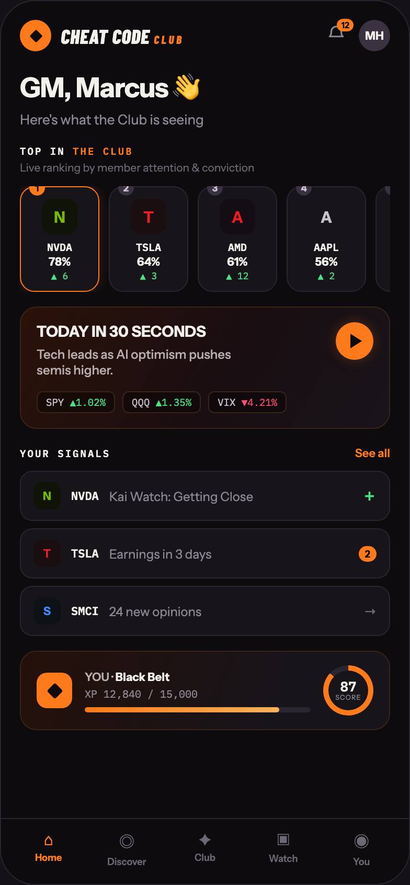

# 01 HOME

Canvas: **CHEAT CODE · LOCKED BRAND · GLOW AT 40%** · board index 0 · slug `01-home`
Frame: **392×846px** (design width 392px — port at 390px logical, scale ratios).

> Style values are EXACT computed values from the canvas. `T.*` = canvas token, resolved in
> the Tokens appendix at the bottom of this file. Text marked `(MOCK)` must not ship as drawn —
> see `../../DELTA.md` for its substitution rule.

## Tree

- **“CHEAT CODE CLUB 12 MH GM, Marcus 👋 Here…”** → `
`
  - box: 392x846 · display: flex · dir: column · width: 390px · height: 844px · bg: T.violet-900-b · border: 1px solid T.violet-800 · radius: 34px (T.r20) · overflow: hidden · type: color T.neutral-950 / Instrument Sans / 16px / w400 / lh normal
  - **“CHEAT CODE CLUB 12 MH GM, Marcus 👋 Here…”** → `
`
    - box: 390x781 · flex: 1 1 0% · flex-grow: 1 · flex-basis: 0% · pad: 18px 18px 0px 18px · overflow: hidden
    - **“CHEAT CODE CLUB 12 MH…”** → `
`
      - box: 354x30 · display: flex · align: center · justify: space-between
      - **“CHEAT CODE CLUB…”** → `
`
        - box: 156.8x30 · display: flex · align: center · gap: 9px
        - **block[0]** → `
`
          - box: 30x30 · display: grid · align: center · justify-items: center · grid-cols: 30px · grid-rows: 30px · width: 30px · height: 30px · bg: T.orange-400 · radius: 50% (T.r21)
          - **block[0]** → `
`
            - box: 12.7x12.7 · width: 9px · height: 9px · bg: T.violet-900-b · radius: 1.5px (T.r2) · transform: matrix(0.707107, 0.707107, -0.707107, 0.707107, 0, 0)
        - **"Cheat Code"** → ``
          - box: 117.8x23 · type: color T.orange-50 / Barlow Condensed / 19px / w800 / italic / ls 0.38px / uppercase · scale: T.ty28
          - text: "Cheat Code"
          - **"Club"** → ``
            - box: 28.7x13 · display: inline · type: color T.orange-400 / 11px / ls 2.2px · scale: T.ty95
            - text: "Club"
      - **“12 MH…”** → `
`
        - box: 61x30 · display: flex · align: center · gap: 12px
        - **“12…”** → `
`
          - box: 19x23 · position: relative [0px 0px 0px 0px]
          - **svg** → `<svg>`
            - box: 19x19 · display: inline · overflow: hidden
            - svg: `<svg data-dc-tpl="30" width="19" height="19" viewBox="0 0 24 24"><path data-dc-tpl="31" d="M6 9a6 6 0 1 1 12 0c0 5 2 6 2 6H4s2-1 2-6" fill="none" stroke="#8F8894" stroke-width="2" stroke-linejoin="round"></path></svg>`
            - **block[0]** → `<path>`
              - box: 12.7x9.5 · display: inline
          - **"12"** → ``
            - box: 15.6x12 · pad: 1px 4px 1px 4px · bg: T.orange-400 · radius: 8px (T.r9) · position: absolute [-5px -7px 16px 10.3906px] · type: color T.violet-900-b / 8px / w800 · scale: T.ty151
            - text: "12"
        - **"MH"** → `
`
          - box: 30x30 · display: grid · align: center · justify-items: center · grid-cols: 30px · grid-rows: 30px · width: 30px · height: 30px · bg: T.violet-800-b · radius: 50% (T.r21) · type: color T.orange-50 / 11px / w700 · scale: T.ty86
          - text: "MH"
    - **"GM, Marcus 👋"** → `<h2>`
      - box: 354x34 · margin: 18px 0px 0px 0px · type: color T.orange-50 / 26px / w700 / ls -0.52px · scale: T.ty11
      - text: "GM, Marcus 👋"
    - **"Here's what the Club is seeing"** → `
`
      - box: 354x16 · margin: 5px 0px 0px 0px · type: color T.neutral-400 / 13px · scale: T.ty59
      - text: "Here's what the Club is seeing"
    - **"Top in"** → `
`
      - box: 354x13 · margin: 16px 0px 0px 0px · type: color T.orange-50 / IBM Plex Mono / 9.5px / w600 / ls 1.52px / uppercase · scale: T.ty118
      - text: "Top in"
      - **"the club"** → ``
        - box: 57.8x13 · display: inline · type: color T.orange-400 · scale: T.ty118
        - text: "the club"
    - **"Live ranking by member attention & convictio"** → `
`
      - box: 354x13 · margin: 3px 0px 0px 0px · type: color T.neutral-500 / 10.5px · scale: T.ty100
      - text: "Live ranking by member attention & conviction"
    - **“1 N NVDA 78% ▲ 6 2 T TSLA 64% ▲ 3 3 A AM…”** → `
`
      - box: 354x101 · display: flex · gap: 9px · margin: 11px 0px 0px 0px · overflow: hidden
      - **“1 N NVDA 78% ▲ 6…”** → `
`
        - box: 76x101 · width: 74px · flex: 0 0 auto · flex-shrink: 0 · pad: 9px 0px 9px 0px · bg: T.violet-900 · border: 1px solid T.orange-400 · radius: 14px (T.r15) · shadow: T.orange-400a18 0px 0px 12px 0px · position: relative [0px 0px 0px 0px] · type: align-center
        - **"1"** → ``
          - box: 15x15 · display: grid · align: center · justify-items: center · grid-cols: 15px · grid-rows: 15px · width: 15px · height: 15px · bg: T.orange-400 · radius: 50% (T.r21) · position: absolute [-7px 51px 91px 8px] · type: color T.violet-900-b / 9px / w800 · scale: T.ty130
          - text: "1"
        - **"N"** → `
`
          - box: 34x34 · display: grid · align: center · justify-items: center · grid-cols: 34px · grid-rows: 34px · width: 34px · height: 34px · margin: 2px 20px 0px 20px · bg: T.lime-900 · radius: 10px (T.r11) · type: color T.lime-600 / 15px / w800 · scale: T.ty43
          - text: "N"
        - **"NVDA"** → `
`
          - box: 74x13 · margin: 6px 0px 0px 0px · type: color T.orange-50 / IBM Plex Mono / 10px / w600 · scale: T.ty110
          - text: "NVDA"
        - **"78%"** **(MOCK)** → `
`
          - box: 74x14 · type: color T.orange-50 / 11px / w700 · scale: T.ty86
          - text: "78%"
        - **"▲ 6"** → `
`
          - box: 74x11 · margin: 1px 0px 0px 0px · type: color T.green-400 / IBM Plex Mono / 9px · scale: T.ty127
          - text: "▲ 6"
      - **“2 T TSLA 64% ▲ 3…”** → `
`
        - box: 76x101 · width: 74px · flex: 0 0 auto · flex-shrink: 0 · pad: 9px 0px 9px 0px · bg: T.violet-900 · border: 1px solid T.violet-800 · radius: 14px (T.r15) · position: relative [0px 0px 0px 0px] · type: align-center
        - **"2"** → ``
          - box: 15x15 · display: grid · align: center · justify-items: center · grid-cols: 15px · grid-rows: 15px · width: 15px · height: 15px · bg: T.violet-800-b · radius: 50% (T.r21) · position: absolute [-7px 51px 91px 8px] · type: color T.violet-200 / 9px / w800 · scale: T.ty130
          - text: "2"
        - **"T"** → `
`
          - box: 34x34 · display: grid · align: center · justify-items: center · grid-cols: 34px · grid-rows: 34px · width: 34px · height: 34px · margin: 2px 20px 0px 20px · bg: T.red-900 · radius: 10px (T.r11) · type: color T.red-400 / 15px / w800 · scale: T.ty43
          - text: "T"
        - **"TSLA"** → `
`
          - box: 74x13 · margin: 6px 0px 0px 0px · type: color T.orange-50 / IBM Plex Mono / 10px / w600 · scale: T.ty110
          - text: "TSLA"
        - **"64%"** **(MOCK)** → `
`
          - box: 74x14 · type: color T.orange-50 / 11px / w700 · scale: T.ty86
          - text: "64%"
        - **"▲ 3"** → `
`
          - box: 74x11 · margin: 1px 0px 0px 0px · type: color T.green-400 / IBM Plex Mono / 9px · scale: T.ty127
          - text: "▲ 3"
      - **“3 A AMD 61% ▲ 12…”** → `
`
        - box: 76x101 · width: 74px · flex: 0 0 auto · flex-shrink: 0 · pad: 9px 0px 9px 0px · bg: T.violet-900 · border: 1px solid T.violet-800 · radius: 14px (T.r15) · position: relative [0px 0px 0px 0px] · type: align-center
        - **"3"** → ``
          - box: 15x15 · display: grid · align: center · justify-items: center · grid-cols: 15px · grid-rows: 15px · width: 15px · height: 15px · bg: T.violet-800-b · radius: 50% (T.r21) · position: absolute [-7px 51px 91px 8px] · type: color T.violet-200 / 9px / w800 · scale: T.ty130
          - text: "3"
        - **"A"** → `
`
          - box: 34x34 · display: grid · align: center · justify-items: center · grid-cols: 34px · grid-rows: 34px · width: 34px · height: 34px · margin: 2px 20px 0px 20px · bg: T.magenta-900 · radius: 10px (T.r11) · type: color T.red-400-b / 15px / w800 · scale: T.ty43
          - text: "A"
        - **"AMD"** → `
`
          - box: 74x13 · margin: 6px 0px 0px 0px · type: color T.orange-50 / IBM Plex Mono / 10px / w600 · scale: T.ty110
          - text: "AMD"
        - **"61%"** **(MOCK)** → `
`
          - box: 74x14 · type: color T.orange-50 / 11px / w700 · scale: T.ty86
          - text: "61%"
        - **"▲ 12"** → `
`
          - box: 74x11 · margin: 1px 0px 0px 0px · type: color T.green-400 / IBM Plex Mono / 9px · scale: T.ty127
          - text: "▲ 12"
      - **“4 A AAPL 56% ▲ 2…”** → `
`
        - box: 76x101 · width: 74px · flex: 0 0 auto · flex-shrink: 0 · pad: 9px 0px 9px 0px · bg: T.violet-900 · border: 1px solid T.violet-800 · radius: 14px (T.r15) · position: relative [0px 0px 0px 0px] · type: align-center
        - **"4"** → ``
          - box: 15x15 · display: grid · align: center · justify-items: center · grid-cols: 15px · grid-rows: 15px · width: 15px · height: 15px · bg: T.violet-800-b · radius: 50% (T.r21) · position: absolute [-7px 51px 91px 8px] · type: color T.violet-200 / 9px / w800 · scale: T.ty130
          - text: "4"
        - **"A"** → `
`
          - box: 34x34 · display: grid · align: center · justify-items: center · grid-cols: 34px · grid-rows: 34px · width: 34px · height: 34px · margin: 2px 20px 0px 20px · bg: T.violet-900 · radius: 10px (T.r11) · type: color T.violet-200 / 15px / w800 · scale: T.ty43
          - text: "A"
        - **"AAPL"** → `
`
          - box: 74x13 · margin: 6px 0px 0px 0px · type: color T.orange-50 / IBM Plex Mono / 10px / w600 · scale: T.ty110
          - text: "AAPL"
        - **"56%"** **(MOCK)** → `
`
          - box: 74x14 · type: color T.orange-50 / 11px / w700 · scale: T.ty86
          - text: "56%"
        - **"▲ 2"** → `
`
          - box: 74x11 · margin: 1px 0px 0px 0px · type: color T.green-400 / IBM Plex Mono / 9px · scale: T.ty127
          - text: "▲ 2"
      - **“5 P PLTR 53% ▲ 9…”** → `
`
        - box: 76x101 · width: 74px · flex: 0 0 auto · flex-shrink: 0 · pad: 9px 0px 9px 0px · bg: T.violet-900 · border: 1px solid T.violet-800 · radius: 14px (T.r15) · position: relative [0px 0px 0px 0px] · type: align-center
        - **"5"** → ``
          - box: 15x15 · display: grid · align: center · justify-items: center · grid-cols: 15px · grid-rows: 15px · width: 15px · height: 15px · bg: T.violet-800-b · radius: 50% (T.r21) · position: absolute [-7px 51px 91px 8px] · type: color T.violet-200 / 9px / w800 · scale: T.ty130
          - text: "5"
        - **"P"** → `
`
          - box: 34x34 · display: grid · align: center · justify-items: center · grid-cols: 34px · grid-rows: 34px · width: 34px · height: 34px · margin: 2px 20px 0px 20px · bg: T.blue-900 · radius: 10px (T.r11) · type: color T.blue-300-b / 15px / w800 · scale: T.ty43
          - text: "P"
        - **"PLTR"** → `
`
          - box: 74x13 · margin: 6px 0px 0px 0px · type: color T.orange-50 / IBM Plex Mono / 10px / w600 · scale: T.ty110
          - text: "PLTR"
        - **"53%"** **(MOCK)** → `
`
          - box: 74x14 · type: color T.orange-50 / 11px / w700 · scale: T.ty86
          - text: "53%"
        - **"▲ 9"** → `
`
          - box: 74x11 · margin: 1px 0px 0px 0px · type: color T.green-400 / IBM Plex Mono / 9px · scale: T.ty127
          - text: "▲ 9"
    - **“TODAY IN 30 SECONDS Tech leads as AI opt…”** → `
`
      - box: 354x117 · pad: 14px 15px 14px 15px · margin: 14px 0px 0px 0px · bg-image: linear-gradient(120deg, T.orange-900-b 0%, T.pink-900 55%, T.violet-900 100%) · border: 1px solid T.orange-800 · radius: 16px (T.r16) · overflow: hidden · position: relative [0px 0px 0px 0px]
      - **“TODAY IN 30 SECONDS Tech leads as AI opt…”** → `
`
        - box: 322x54 · display: flex · align: flex-start · justify: space-between
        - **"TODAY IN 30 SECONDS"** → `
`
          - box: 220x54 · type: color T.orange-50 / 14.5px / w700 / lh 18.85px · scale: T.ty49
          - text: "TODAY IN 30 SECONDS"
          - **"Tech leads as AI optimism pushes semis highe"** → `
`
            - box: 220x31.2 · max-width: 220px · margin: 4px 0px 0px 0px · type: color T.neutral-200-b / 12px / w500 / lh 15.6px · scale: T.ty77
            - text: "Tech leads as AI optimism pushes semis higher."
        - **block[1]** → `
`
          - box: 36x36 · display: grid · align: center · justify-items: center · grid-cols: 36px · grid-rows: 36px · width: 36px · height: 36px · flex: 0 0 auto · flex-shrink: 0 · bg: T.orange-400 · radius: 50% (T.r21) · shadow: T.orange-400a25 0px 0px 12px 0px
          - **block[0]** → `
`
            - box: 11x14 · width: 0px · height: 0px · margin: 0px 0px 0px 3px · border: T:7px solid T.neutral-950a00 R:0px none T.neutral-950 B:7px solid T.neutral-950a00 L:11px solid T.violet-900-b
      - **“SPY ▲1.02% QQQ ▲1.35% VIX ▼4.21%…”** → `
`
        - box: 322x21 · display: flex · gap: 7px · margin: 12px 0px 0px 0px
        - **"SPY"** → ``
          - box: 75x21 · pad: 3px 8px 3px 8px · bg: T.neutral-950a35 · border: 1px solid T.orange-800 · radius: 6px (T.r7) · type: color T.violet-200 / IBM Plex Mono / 9.5px · scale: T.ty119
          - text: "SPY"
          - **"▲1.02%"** **(MOCK)** → ``
            - box: 34.2x13 · display: inline · type: color T.green-400 · scale: T.ty119
            - text: "▲1.02%"
        - **"QQQ"** → ``
          - box: 75x21 · pad: 3px 8px 3px 8px · bg: T.neutral-950a35 · border: 1px solid T.orange-800 · radius: 6px (T.r7) · type: color T.violet-200 / IBM Plex Mono / 9.5px · scale: T.ty119
          - text: "QQQ"
          - **"▲1.35%"** **(MOCK)** → ``
            - box: 34.2x13 · display: inline · type: color T.green-400 · scale: T.ty119
            - text: "▲1.35%"
        - **"VIX"** → ``
          - box: 75x21 · pad: 3px 8px 3px 8px · bg: T.neutral-950a35 · border: 1px solid T.orange-800 · radius: 6px (T.r7) · type: color T.violet-200 / IBM Plex Mono / 9.5px · scale: T.ty119
          - text: "VIX"
          - **"▼4.21%"** **(MOCK)** → ``
            - box: 34.2x13 · display: inline · type: color T.red-300 · scale: T.ty119
            - text: "▼4.21%"
    - **“YOUR SIGNALS See all…”** → `
`
      - box: 354x14 · display: flex · align: baseline · justify: space-between · margin: 16px 0px 0px 0px
      - **"Your signals"** → ``
        - box: 86.6x13 · type: color T.orange-50 / IBM Plex Mono / 9.5px / w600 / ls 1.52px / uppercase · scale: T.ty118
        - text: "Your signals"
      - **"See all"** → ``
        - box: 33.6x14 · type: color T.orange-400 / 11px / w600 · scale: T.ty92
        - text: "See all"
    - **“N NVDA Kai Watch: Getting Close ＋ T TSLA…”** → `
`
      - box: 354x158 · display: flex · dir: column · gap: 7px · margin: 10px 0px 0px 0px
      - **“N NVDA Kai Watch: Getting Close ＋…”** → `
`
        - box: 354x48 · display: flex · align: center · gap: 10px · pad: 10px 12px 10px 12px · bg: T.violet-900 · border: 1px solid T.violet-800 · radius: 12px (T.r13)
        - **"N"** → `
`
          - box: 26x26 · display: grid · align: center · justify-items: center · grid-cols: 26px · grid-rows: 26px · width: 26px · height: 26px · bg: T.lime-900 · radius: 8px (T.r9) · type: color T.lime-600 / 11px / w800 · scale: T.ty91
          - text: "N"
        - **"NVDA"** → ``
          - box: 26.4x14 · type: color T.orange-50 / IBM Plex Mono / 11px / w600 · scale: T.ty87
          - text: "NVDA"
        - **"Kai Watch: Getting Close"** → ``
          - box: 232.3x15 · flex: 1 1 0% · flex-grow: 1 · flex-basis: 0% · type: color T.neutral-400 / 12px · scale: T.ty71
          - text: "Kai Watch: Getting Close"
        - **"＋"** → ``
          - box: 13.3x18 · type: color T.green-400 / 13px / w800 · scale: T.ty61
          - text: "＋"
      - **“T TSLA Earnings in 3 days 2…”** → `
`
        - box: 354x48 · display: flex · align: center · gap: 10px · pad: 10px 12px 10px 12px · bg: T.violet-900 · border: 1px solid T.violet-800 · radius: 12px (T.r13)
        - **"T"** → `
`
          - box: 26x26 · display: grid · align: center · justify-items: center · grid-cols: 26px · grid-rows: 26px · width: 26px · height: 26px · bg: T.red-900 · radius: 8px (T.r9) · type: color T.red-400 / 11px / w800 · scale: T.ty91
          - text: "T"
        - **"TSLA"** → ``
          - box: 26.4x14 · type: color T.orange-50 / IBM Plex Mono / 11px / w600 · scale: T.ty87
          - text: "TSLA"
        - **"Earnings in 3 days"** → ``
          - box: 228.5x15 · flex: 1 1 0% · flex-grow: 1 · flex-basis: 0% · type: color T.neutral-400 / 12px · scale: T.ty71
          - text: "Earnings in 3 days"
        - **"2"** → ``
          - box: 17.1x15 · pad: 2px 6px 2px 6px · bg: T.orange-400 · radius: 8px (T.r9) · type: color T.violet-900-b / 9px / w800 · scale: T.ty130
          - text: "2"
      - **“S SMCI 24 new opinions →…”** → `
`
        - box: 354x48 · display: flex · align: center · gap: 10px · pad: 10px 12px 10px 12px · bg: T.violet-900 · border: 1px solid T.violet-800 · radius: 12px (T.r13)
        - **"S"** → `
`
          - box: 26x26 · display: grid · align: center · justify-items: center · grid-cols: 26px · grid-rows: 26px · width: 26px · height: 26px · bg: T.blue-900 · radius: 8px (T.r9) · type: color T.blue-300-b / 11px / w800 · scale: T.ty91
          - text: "S"
        - **"SMCI"** → ``
          - box: 26.4x14 · type: color T.orange-50 / IBM Plex Mono / 11px / w600 · scale: T.ty87
          - text: "SMCI"
        - **"24 new opinions"** → ``
          - box: 233.6x15 · flex: 1 1 0% · flex-grow: 1 · flex-basis: 0% · type: color T.neutral-400 / 12px · scale: T.ty71
          - text: "24 new opinions"
        - **"→"** → ``
          - box: 12x15 · type: color T.neutral-500 / 12px / w800 · scale: T.ty76
          - text: "→"
    - **“YOU · Black Belt XP 12,840 / 15,000 87 S…”** → `
`
      - box: 354x76 · display: flex · align: center · gap: 12px · pad: 13px 15px 13px 15px · margin: 14px 0px 0px 0px · bg-image: linear-gradient(110deg, T.orange-900 0%, T.violet-900 70%) · border: 1px solid T.orange-800 · radius: 16px (T.r16)
      - **block[0]** → `
`
        - box: 34x34 · display: grid · align: center · justify-items: center · grid-cols: 34px · grid-rows: 34px · width: 34px · height: 34px · flex: 0 0 auto · flex-shrink: 0 · bg: T.orange-400 · radius: 10px (T.r11)
        - **block[0]** → `
`
          - box: 15.6x15.6 · width: 11px · height: 11px · bg: T.violet-900-b · radius: 2px (T.r3) · transform: matrix(0.707107, 0.707107, -0.707107, 0.707107, 0, 0)
      - **“YOU · Black Belt XP 12,840 / 15,000…”** → `
`
        - box: 216x41 · flex: 1 1 0% · flex-grow: 1 · flex-basis: 0%
        - **"YOU ·"** → `
`
          - box: 216x14 · type: color T.neutral-200-b / 11px / w600 · scale: T.ty92
          - text: "YOU ·"
          - **"Black Belt"** → ``
            - box: 51.8x14 · display: inline · type: color T.orange-50 / w700 · scale: T.ty86
            - text: "Black Belt"
        - **"XP 12,840 / 15,000"** **(MOCK)** → `
`
          - box: 216x13 · margin: 3px 0px 0px 0px · type: color T.neutral-400 / IBM Plex Mono / 10px · scale: T.ty108
          - text: "XP 12,840 / 15,000"
        - **block[2]** → `
`
          - box: 216x5 · height: 5px · margin: 6px 0px 0px 0px · bg: T.violet-800 · radius: 3px (T.r4) · overflow: hidden
          - **block[0]** → `
`
            - box: 185.8x5 · width: 86% · height: 100% · bg-image: linear-gradient(90deg, T.orange-400, T.orange-300-c) · radius: 3px (T.r4)
      - **“87 SCORE…”** → `
`
        - box: 48x48 · display: grid · align: center · justify-items: center · grid-cols: 48px · grid-rows: 48px · width: 48px · height: 48px · flex: 0 0 auto · flex-shrink: 0 · bg-image: conic-gradient(T.orange-400 0deg, T.orange-400 87%, T.violet-800 87%, T.violet-800 100%) · radius: 50% (T.r21)
        - **“87 SCORE…”** → `
`
          - box: 38x38 · display: grid · align: center · justify-items: center · grid-cols: 38px · grid-rows: 38px · width: 38px · height: 38px · bg: T.violet-900 · radius: 50% (T.r21) · type: align-center
          - **“87 SCORE…”** → `
`
            - box: 24.9x21
            - **"87"** → `
`
              - box: 24.9x13 · type: color T.orange-50 / IBM Plex Mono / 13px / w600 / lh 13px · scale: T.ty63
              - text: "87"
            - **"SCORE"** → `
`
              - box: 24.9x8 · type: color T.neutral-400 / 6.5px / ls 0.52px · scale: T.ty156
              - text: "SCORE"
  - **“⌂ Home ◎ Discover ✦ Club ▣ Watch ◉ You…”** → `
`
    - box: 390x63 · display: flex · pad: 10px 8px 16px 8px · bg: T.violet-900-b · border: T:1px solid T.violet-800 R:0px none T.neutral-950 B:0px none T.neutral-950 L:0px none T.neutral-950
    - **“⌂ Home…”** → `
`
      - box: 74.8x36 · flex: 1 1 0% · flex-grow: 1 · flex-basis: 0% · type: align-center
      - **"⌂"** → `
`
        - box: 74.8x19 · type: color T.orange-400 / 15px · scale: T.ty42
        - text: "⌂"
      - **"Home"** → `
`
        - box: 74.8x11 · margin: 2px 0px 0px 0px · type: color T.orange-400 / 9px / w700 · scale: T.ty129
        - text: "Home"
    - **“◎ Discover…”** → `
`
      - box: 74.8x36 · flex: 1 1 0% · flex-grow: 1 · flex-basis: 0% · type: align-center
      - **"◎"** → `
`
        - box: 74.8x23 · type: color T.neutral-500 / 15px · scale: T.ty42
        - text: "◎"
      - **"Discover"** → `
`
        - box: 74.8x11 · margin: 2px 0px 0px 0px · type: color T.neutral-500 / 9px / w600 · scale: T.ty126
        - text: "Discover"
    - **“✦ Club…”** → `
`
      - box: 74.8x36 · flex: 1 1 0% · flex-grow: 1 · flex-basis: 0% · type: align-center
      - **"✦"** → `
`
        - box: 74.8x19 · type: color T.neutral-500 / 15px · scale: T.ty42
        - text: "✦"
      - **"Club"** → `
`
        - box: 74.8x11 · margin: 2px 0px 0px 0px · type: color T.neutral-500 / 9px / w600 · scale: T.ty126
        - text: "Club"
    - **“▣ Watch…”** → `
`
      - box: 74.8x36 · flex: 1 1 0% · flex-grow: 1 · flex-basis: 0% · type: align-center
      - **"▣"** → `
`
        - box: 74.8x20 · type: color T.neutral-500 / 15px · scale: T.ty42
        - text: "▣"
      - **"Watch"** → `
`
        - box: 74.8x11 · margin: 2px 0px 0px 0px · type: color T.neutral-500 / 9px / w600 · scale: T.ty126
        - text: "Watch"
    - **“◉ You…”** → `
`
      - box: 74.8x36 · flex: 1 1 0% · flex-grow: 1 · flex-basis: 0% · type: align-center
      - **"◉"** → `
`
        - box: 74.8x23 · type: color T.neutral-500 / 15px · scale: T.ty42
        - text: "◉"
      - **"You"** → `
`
        - box: 74.8x11 · margin: 2px 0px 0px 0px · type: color T.neutral-500 / 9px / w600 · scale: T.ty126
        - text: "You"

## Tokens used in this board

| token | value | role |
| --- | --- | --- |
| T.violet-800 | `#2A2530` | border, bg, gradient |
| T.orange-50 | `#F4F0EC` | text, bg, border |
| T.neutral-500 | `#6E6774` | text, bg |
| T.violet-900 | `#17141A` | bg, gradient, border |
| T.neutral-400 | `#8F8894` | text, border, bg |
| T.orange-400 | `#FF7A1A` | bg, text, border, gradient |
| T.violet-900-b | `#0D0B0E` | bg, text, border, gradient |
| T.neutral-950 | `#000000` | border, text |
| T.green-400 | `#4AE383` | text, gradient, border, bg |
| T.violet-200 | `#C8C2CE` | text |
| T.violet-800-b | `#3A3240` | bg, border |
| T.red-300 | `#FF4D6D` | text, gradient, bg, border |
| T.neutral-950a00 | `#000000/0` | border, gradient |
| T.lime-600 | `#76B900` | text, gradient |
| T.orange-800 | `#3A2418` | border, bg |
| T.lime-900 | `#101408` | bg, gradient |
| T.blue-300-b | `#3D8BFF` | text, border, bg |
| T.orange-900 | `#241009` | gradient |
| T.orange-400a18 | `#FF7A1A/0.18` | shadow, bg |
| T.red-900 | `#1A0E10` | bg, gradient |
| T.red-400 | `#E82127` | text |
| T.blue-900 | `#0E1216` | bg |
| T.neutral-200-b | `#B8AEB0` | text |
| T.orange-900-b | `#2A1208` | gradient |
| T.orange-400a25 | `#FF7A1A/0.25` | shadow |
| T.neutral-950a35 | `#000000/0.35` | bg |
| T.orange-300-c | `#FFB25E` | gradient |
| T.magenta-900 | `#140E14` | bg |
| T.red-400-b | `#ED1C24` | text |
| T.pink-900 | `#1A0E12` | gradient |
| T.ty11 | Instrument Sans 26px/normal w700 ls:-0.52px | type scale |
| T.ty28 | Barlow Condensed 19px/normal w800 ls:0.38px uppercase | type scale |
| T.ty42 | Instrument Sans 15px/normal w400 ls:normal | type scale |
| T.ty43 | Instrument Sans 15px/normal w800 ls:normal | type scale |
| T.ty49 | Instrument Sans 14.5px/18.85px w700 ls:normal | type scale |
| T.ty59 | Instrument Sans 13px/normal w400 ls:normal | type scale |
| T.ty61 | Instrument Sans 13px/normal w800 ls:normal | type scale |
| T.ty63 | IBM Plex Mono 13px/13px w600 ls:normal | type scale |
| T.ty71 | Instrument Sans 12px/normal w400 ls:normal | type scale |
| T.ty76 | Instrument Sans 12px/normal w800 ls:normal | type scale |
| T.ty77 | Instrument Sans 12px/15.6px w500 ls:normal | type scale |
| T.ty86 | Instrument Sans 11px/normal w700 ls:normal | type scale |
| T.ty87 | IBM Plex Mono 11px/normal w600 ls:normal | type scale |
| T.ty91 | Instrument Sans 11px/normal w800 ls:normal | type scale |
| T.ty92 | Instrument Sans 11px/normal w600 ls:normal | type scale |
| T.ty95 | Barlow Condensed 11px/normal w800 ls:2.2px uppercase | type scale |
| T.ty100 | Instrument Sans 10.5px/normal w400 ls:normal | type scale |
| T.ty108 | IBM Plex Mono 10px/normal w400 ls:normal | type scale |
| T.ty110 | IBM Plex Mono 10px/normal w600 ls:normal | type scale |
| T.ty118 | IBM Plex Mono 9.5px/normal w600 ls:1.52px uppercase | type scale |
| T.ty119 | IBM Plex Mono 9.5px/normal w400 ls:normal | type scale |
| T.ty126 | Instrument Sans 9px/normal w600 ls:normal | type scale |
| T.ty127 | IBM Plex Mono 9px/normal w400 ls:normal | type scale |
| T.ty129 | Instrument Sans 9px/normal w700 ls:normal | type scale |
| T.ty130 | Instrument Sans 9px/normal w800 ls:normal | type scale |
| T.ty151 | Instrument Sans 8px/normal w800 ls:normal | type scale |
| T.ty156 | Instrument Sans 6.5px/normal w400 ls:0.52px | type scale |
| T.r2 | `1.5px` | radius |
| T.r3 | `2px` | radius |
| T.r4 | `3px` | radius |
| T.r7 | `6px` | radius |
| T.r9 | `8px` | radius |
| T.r11 | `10px` | radius |
| T.r13 | `12px` | radius |
| T.r15 | `14px` | radius |
| T.r16 | `16px` | radius |
| T.r20 | `34px` | radius |
| T.r21 | `50%` | radius |
