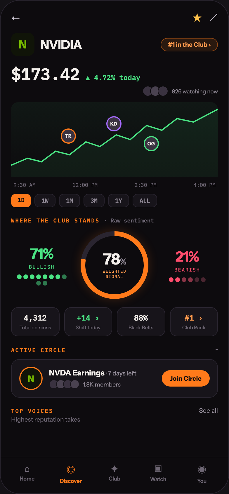

# 03 TICKER · NVDA

Canvas: **CHEAT CODE · LOCKED BRAND · GLOW AT 40%** · board index 2 · slug `03-ticker-nvda`
Frame: **392×846px** (design width 392px — port at 390px logical, scale ratios).

> Style values are EXACT computed values from the canvas. `T.*` = canvas token, resolved in
> the Tokens appendix at the bottom of this file. Text marked `(MOCK)` must not ship as drawn —
> see `../../DELTA.md` for its substitution rule.

## Tree

- **“← ★ ↗ N NVIDIA #1 in the Club › $173.42 …”** → `
`
  - box: 392x846 · display: flex · dir: column · width: 390px · height: 844px · bg: T.violet-900-b · border: 1px solid T.violet-800 · radius: 34px (T.r20) · overflow: hidden · type: color T.neutral-950 / Instrument Sans / 16px / w400 / lh normal
  - **“← ★ ↗ N NVIDIA #1 in the Club › $173.42 …”** → `
`
    - box: 390x781 · flex: 1 1 0% · flex-grow: 1 · flex-basis: 0% · pad: 18px 18px 0px 18px · overflow: hidden
    - **“← ★ ↗…”** → `
`
      - box: 354x23 · display: flex · align: center · justify: space-between
      - **"←"** → ``
        - box: 16x20 · type: color T.violet-200 · scale: T.ty36
        - text: "←"
      - **“★ ↗…”** → `
`
        - box: 43x23 · display: flex · align: center · gap: 14px
        - **"★"** → ``
          - box: 15x23 · type: color T.orange-300-b / 15px · scale: T.ty42
          - text: "★"
        - **"↗"** → ``
          - box: 14x21 · type: color T.violet-200 / 14px · scale: T.ty50
          - text: "↗"
    - **“N NVIDIA #1 in the Club ›…”** → `
`
      - box: 354x40 · display: flex · align: center · justify: space-between · margin: 14px 0px 0px 0px
      - **“N NVIDIA…”** → `
`
        - box: 121.3x40 · display: flex · align: center · gap: 10px
        - **"N"** → `
`
          - box: 40x40 · display: grid · align: center · justify-items: center · grid-cols: 40px · grid-rows: 40px · width: 40px · height: 40px · bg: T.lime-900 · radius: 11px (T.r12) · type: color T.lime-600 / 19px / w800 · scale: T.ty27
          - text: "N"
        - **"NVIDIA"** → `
`
          - box: 71.3x25 · type: color T.orange-50 / 21px / w800 / ls -0.21px · scale: T.ty22
          - text: "NVIDIA"
      - **"#1 in the Club ›"** → ``
        - box: 97.6x23 · pad: 4px 11px 4px 11px · bg: T.orange-400a12 · border: 1px solid T.orange-400a50 · radius: 16px (T.r16) · type: color T.orange-300 / 10.5px / w700 · scale: T.ty103
        - text: "#1 in the Club ›"
    - **“$173.42 ▲ 4.72% today…”** → `
`
      - box: 354x37 · display: flex · align: baseline · gap: 10px · margin: 12px 0px 0px 0px
      - **"$173.42"** **(MOCK)** → ``
        - box: 117.6x37 · type: color T.orange-50 / IBM Plex Mono / 28px / w600 · scale: T.ty7
        - text: "$173.42"
      - **"▲ 4.72% today"** **(MOCK)** → ``
        - box: 93.6x15 · type: color T.green-400 / IBM Plex Mono / 12px / w600 · scale: T.ty73
        - text: "▲ 4.72% today"
    - **“826 watching now…”** → `
`
      - box: 354x18 · display: flex · align: center · justify: flex-end · gap: 6px · margin: 2px 0px 0px 0px
      - **block[0]** → `
`
        - box: 44x18 · display: flex
        - **block[0]** → `
`
          - box: 18x18 · width: 16px · height: 16px · bg: T.violet-800-b · border: 1px solid T.violet-900-b · radius: 50% (T.r21)
        - **block[1]** → `
`
          - box: 18x18 · width: 16px · height: 16px · margin: 0px 0px 0px -5px · bg: T.violet-700 · border: 1px solid T.violet-900-b · radius: 50% (T.r21)
        - **block[2]** → `
`
          - box: 18x18 · width: 16px · height: 16px · margin: 0px 0px 0px -5px · bg: T.violet-800-b · border: 1px solid T.violet-900-b · radius: 50% (T.r21)
      - **"826 watching now"** **(MOCK)** → ``
        - box: 78.8x11 · type: color T.neutral-400 / 9.5px · scale: T.ty117
        - text: "826 watching now"
    - **“TR KD OG…”** → `
`
      - box: 354x132 · margin: 10px 0px 0px 0px · bg-image: linear-gradient(T.green-400a06, T.neutral-950a00) · radius: 12px (T.r13) · position: relative [0px 0px 0px 0px]
      - **svg** → `<svg>`
        - box: 354x128 · display: inline · overflow: hidden
        - svg: `<svg data-dc-tpl="282" width="100%" height="128" viewBox="0 0 354 128" preserveAspectRatio="none">
              <path data-dc-tpl="283" d="M0 108 L28 96 L52 102 L76 84 L100 90 L128 68 L152 76 L180 56 L204 64 L232 40 L258 48 L284 28 L312 34 L354 12" fill="none" stroke="#4AE383" stroke-width="2.2"></`
        - **block[0]** → `<path>`
          - box: 354x96 · display: inline
        - **block[1]** → `<path>`
          - box: 354x116 · display: inline
      - **"TR"** → `
`
        - box: 26x26 · display: grid · align: center · justify-items: center · grid-cols: 22px · grid-rows: 22px · width: 22px · height: 22px · bg: T.violet-800-b · border: 2px solid T.orange-400 · radius: 50% (T.r21) · position: absolute [44.875px 243.047px 61.125px 84.9531px] · type: color T.orange-50 / 8px / w700 · scale: T.ty150
        - text: "TR"
      - **"KD"** → `
`
        - box: 26x26 · display: grid · align: center · justify-items: center · grid-cols: 22px · grid-rows: 22px · width: 22px · height: 22px · bg: T.violet-800-b · border: 2px solid T.violet-200-b · radius: 50% (T.r21) · position: absolute [23.75px 165.172px 82.25px 162.828px] · type: color T.orange-50 / 8px / w700 · scale: T.ty150
        - text: "KD"
      - **"OG"** → `
`
        - box: 26x26 · display: grid · align: center · justify-items: center · grid-cols: 22px · grid-rows: 22px · width: 22px · height: 22px · bg: T.violet-800-b · border: 2px solid T.green-400 · radius: 50% (T.r21) · position: absolute [58.0781px 101.453px 47.9219px 226.547px] · type: color T.orange-50 / 8px / w700 · scale: T.ty150
        - text: "OG"
    - **“9:30 AM 12:00 PM 2:30 PM 4:00 PM…”** → `
`
      - box: 354x11 · display: flex · justify: space-between · pad: 0px 4px 0px 4px · margin: 4px 0px 0px 0px · type: color T.neutral-500 / IBM Plex Mono / 9px
      - **"9:30 AM"** → ``
        - box: 37.8x11 · scale: T.ty127
        - text: "9:30 AM"
      - **"12:00 PM"** → ``
        - box: 43.2x11 · scale: T.ty127
        - text: "12:00 PM"
      - **"2:30 PM"** → ``
        - box: 37.8x11 · scale: T.ty127
        - text: "2:30 PM"
      - **"4:00 PM"** → ``
        - box: 37.8x11 · scale: T.ty127
        - text: "4:00 PM"
    - **“1D 1W 1M 3M 1Y ALL…”** → `
`
      - box: 354x23 · display: flex · gap: 6px · margin: 10px 0px 0px 0px
      - **"1D"** → ``
        - box: 34x23 · pad: 4px 11px 4px 11px · bg: T.orange-400 · radius: 8px (T.r9) · type: color T.violet-900-b / IBM Plex Mono / 10px / w700 · scale: T.ty112
        - text: "1D"
      - **"1W"** → ``
        - box: 36x23 · pad: 4px 11px 4px 11px · bg: T.violet-900 · border: 1px solid T.violet-800 · radius: 8px (T.r9) · type: color T.neutral-400 / IBM Plex Mono / 10px / w600 · scale: T.ty110
        - text: "1W"
      - **"1M"** → ``
        - box: 36x23 · pad: 4px 11px 4px 11px · bg: T.violet-900 · border: 1px solid T.violet-800 · radius: 8px (T.r9) · type: color T.neutral-400 / IBM Plex Mono / 10px / w600 · scale: T.ty110
        - text: "1M"
      - **"3M"** → ``
        - box: 36x23 · pad: 4px 11px 4px 11px · bg: T.violet-900 · border: 1px solid T.violet-800 · radius: 8px (T.r9) · type: color T.neutral-400 / IBM Plex Mono / 10px / w600 · scale: T.ty110
        - text: "3M"
      - **"1Y"** → ``
        - box: 36x23 · pad: 4px 11px 4px 11px · bg: T.violet-900 · border: 1px solid T.violet-800 · radius: 8px (T.r9) · type: color T.neutral-400 / IBM Plex Mono / 10px / w600 · scale: T.ty110
        - text: "1Y"
      - **"ALL"** → ``
        - box: 42x23 · pad: 4px 11px 4px 11px · bg: T.violet-900 · border: 1px solid T.violet-800 · radius: 8px (T.r9) · type: color T.neutral-400 / IBM Plex Mono / 10px / w600 · scale: T.ty110
        - text: "ALL"
    - **"Where the club stands"** → `
`
      - box: 354x13 · margin: 16px 0px 0px 0px · type: color T.orange-400 / IBM Plex Mono / 9.5px / w600 / ls 1.52px / uppercase · scale: T.ty118
      - text: "Where the club stands"
      - **"· Raw sentiment"** → ``
        - box: 85.5x13 · display: inline · type: color T.neutral-500 · scale: T.ty123
        - text: "· Raw sentiment"
    - **“71% BULLISH 78% WEIGHTED SIGNAL 21% BEAR…”** → `
`
      - box: 354x116 · display: flex · align: center · gap: 14px · margin: 12px 0px 0px 0px
      - **“71% BULLISH…”** → `
`
        - box: 105x69 · flex: 1 1 0% · flex-grow: 1 · flex-basis: 0% · type: align-center
        - **"71%"** **(MOCK)** → `
`
          - box: 105x29 · type: color T.green-400 / 24px / w800 / ls -0.48px · scale: T.ty14
          - text: "71%"
        - **"BULLISH"** → `
`
          - box: 105x11 · margin: 2px 0px 0px 0px · type: color T.green-400 / IBM Plex Mono / 8.5px / ls 1.19px · scale: T.ty143
          - text: "BULLISH"
        - **block[2]** → `
`
          - box: 90x19 · display: flex · wrap: wrap · justify: center · gap: 3px · max-width: 90px · margin: 8px 7.5px 0px 7.5px
          - **block[0]** → ``
            - box: 8x8 · width: 8px · height: 8px · bg: T.green-400 · radius: 50% (T.r21)
          - **block[1]** → ``
            - box: 8x8 · width: 8px · height: 8px · bg: T.green-400 · radius: 50% (T.r21)
          - **block[2]** → ``
            - box: 8x8 · width: 8px · height: 8px · bg: T.green-400 · radius: 50% (T.r21)
          - **block[3]** → ``
            - box: 8x8 · width: 8px · height: 8px · bg: T.green-400 · radius: 50% (T.r21)
          - **block[4]** → ``
            - box: 8x8 · width: 8px · height: 8px · bg: T.green-400 · radius: 50% (T.r21)
          - **block[5]** → ``
            - box: 8x8 · width: 8px · height: 8px · bg: T.green-400 · radius: 50% (T.r21)
          - **block[6]** → ``
            - box: 8x8 · width: 8px · height: 8px · bg: T.green-400 · radius: 50% (T.r21)
          - **block[7]** → ``
            - box: 8x8 · width: 8px · height: 8px · bg: T.green-600 · radius: 50% (T.r21)
          - **block[8]** → ``
            - box: 8x8 · width: 8px · height: 8px · bg: T.green-600 · radius: 50% (T.r21)
          - **block[9]** → ``
            - box: 8x8 · width: 8px · height: 8px · bg: T.green-600 · radius: 50% (T.r21)
      - **“78% WEIGHTED SIGNAL…”** → `
`
        - box: 116x116 · width: 116px · height: 116px · flex: 0 0 auto · flex-shrink: 0 · position: relative [0px 0px 0px 0px]
        - **block[0]** → `
`
          - box: 116x116 · bg-image: conic-gradient(T.orange-400 0deg, T.orange-400 78%, T.violet-800 78%, T.violet-800 100%) · radius: 50% (T.r21) · shadow: T.orange-400a20 0px 0px 18px 0px · position: absolute [0px 0px 0px 0px]
        - **“78% WEIGHTED SIGNAL…”** → `
`
          - box: 100x100 · display: grid · align: center · justify-items: center · grid-cols: 100px · grid-rows: 100px · bg: T.violet-900-b · radius: 50% (T.r21) · position: absolute [8px 8px 8px 8px]
          - **“78% WEIGHTED SIGNAL…”** → `
`
            - box: 40.3x47 · type: align-center
            - **"78"** → `
`
              - box: 40.3x26 · type: color T.orange-50 / 26px / w800 / ls -0.52px / lh 26px · scale: T.ty12
              - text: "78"
              - **"%"** → ``
                - box: 10.5x18 · display: inline · type: color T.neutral-400 / 14px / lh 14px · scale: T.ty52
                - text: "%"
            - **"WEIGHTEDSIGNAL"** → `
`
              - box: 40.3x18 · margin: 3px 0px 0px 0px · type: color T.orange-300 / IBM Plex Mono / 7px / ls 0.84px · scale: T.ty154
              - text: "WEIGHTEDSIGNAL"
              - **block[0]** → ` `
                - box: 0x9 · display: inline
      - **“21% BEARISH…”** → `
`
        - box: 105x58 · flex: 1 1 0% · flex-grow: 1 · flex-basis: 0% · type: align-center
        - **"21%"** **(MOCK)** → `
`
          - box: 105x29 · type: color T.red-300 / 24px / w800 / ls -0.48px · scale: T.ty14
          - text: "21%"
        - **"BEARISH"** → `
`
          - box: 105x11 · margin: 2px 0px 0px 0px · type: color T.red-300 / IBM Plex Mono / 8.5px / ls 1.19px · scale: T.ty143
          - text: "BEARISH"
        - **block[2]** → `
`
          - box: 90x8 · display: flex · wrap: wrap · justify: center · gap: 3px · max-width: 90px · margin: 8px 7.5px 0px 7.5px
          - **block[0]** → ``
            - box: 8x8 · width: 8px · height: 8px · bg: T.red-300 · radius: 50% (T.r21)
          - **block[1]** → ``
            - box: 8x8 · width: 8px · height: 8px · bg: T.red-300 · radius: 50% (T.r21)
          - **block[2]** → ``
            - box: 8x8 · width: 8px · height: 8px · bg: T.red-600 · radius: 50% (T.r21)
          - **block[3]** → ``
            - box: 8x8 · width: 8px · height: 8px · bg: T.red-600 · radius: 50% (T.r21)
          - **block[4]** → ``
            - box: 8x8 · width: 8px · height: 8px · bg: T.pink-800-b · radius: 50% (T.r21)
          - **block[5]** → ``
            - box: 8x8 · width: 8px · height: 8px · bg: T.pink-800-b · radius: 50% (T.r21)
    - **“4,312 Total opinions +14 › Shift today 8…”** → `
`
      - box: 354x50 · display: flex · gap: 8px · margin: 14px 0px 0px 0px
      - **“4,312 Total opinions…”** → `
`
        - box: 82.5x50 · flex: 1 1 0% · flex-grow: 1 · flex-basis: 0% · pad: 9px 6px 9px 6px · bg: T.violet-900 · border: 1px solid T.violet-800 · radius: 12px (T.r13) · type: align-center
        - **"4,312"** **(MOCK)** → `
`
          - box: 68.5x17 · type: color T.orange-50 / IBM Plex Mono / 13px / w600 · scale: T.ty60
          - text: "4,312"
        - **"Total opinions"** → `
`
          - box: 68.5x10 · margin: 3px 0px 0px 0px · type: color T.neutral-500 / 8.5px · scale: T.ty141
          - text: "Total opinions"
      - **“+14 › Shift today…”** → `
`
        - box: 82.5x50 · flex: 1 1 0% · flex-grow: 1 · flex-basis: 0% · pad: 9px 6px 9px 6px · bg: T.violet-900 · border: 1px solid T.violet-800 · radius: 12px (T.r13) · type: align-center
        - **"+14 ›"** **(MOCK)** → `
`
          - box: 68.5x17 · type: color T.green-400 / IBM Plex Mono / 13px / w600 · scale: T.ty60
          - text: "+14 ›"
        - **"Shift today"** → `
`
          - box: 68.5x10 · margin: 3px 0px 0px 0px · type: color T.neutral-500 / 8.5px · scale: T.ty141
          - text: "Shift today"
      - **“88% Black Belts…”** → `
`
        - box: 82.5x50 · flex: 1 1 0% · flex-grow: 1 · flex-basis: 0% · pad: 9px 6px 9px 6px · bg: T.violet-900 · border: 1px solid T.violet-800 · radius: 12px (T.r13) · type: align-center
        - **"88%"** **(MOCK)** → `
`
          - box: 68.5x17 · type: color T.orange-50 / IBM Plex Mono / 13px / w600 · scale: T.ty60
          - text: "88%"
        - **"Black Belts"** → `
`
          - box: 68.5x10 · margin: 3px 0px 0px 0px · type: color T.neutral-500 / 8.5px · scale: T.ty141
          - text: "Black Belts"
      - **“#1 › Club Rank…”** → `
`
        - box: 82.5x50 · flex: 1 1 0% · flex-grow: 1 · flex-basis: 0% · pad: 9px 6px 9px 6px · bg: T.violet-900 · border: 1px solid T.violet-800 · radius: 12px (T.r13) · type: align-center
        - **"#1 ›"** → `
`
          - box: 68.5x17 · type: color T.orange-300 / IBM Plex Mono / 13px / w600 · scale: T.ty60
          - text: "#1 ›"
        - **"Club Rank"** → `
`
          - box: 68.5x10 · margin: 3px 0px 0px 0px · type: color T.neutral-500 / 8.5px · scale: T.ty141
          - text: "Club Rank"
    - **“ACTIVE CIRCLE ···…”** → `
`
      - box: 354x15 · display: flex · align: baseline · justify: space-between · margin: 15px 0px 0px 0px
      - **"Active circle"** → ``
        - box: 93.9x13 · type: color T.orange-400 / IBM Plex Mono / 9.5px / w600 / ls 1.52px / uppercase · scale: T.ty118
        - text: "Active circle"
      - **"···"** → ``
        - box: 3.7x15 · type: color T.neutral-500 / 12px · scale: T.ty71
        - text: "···"
    - **“N NVDA Earnings · 7 days left 1.8K membe…”** → `
`
      - box: 354x66 · display: flex · align: center · gap: 11px · pad: 12px 13px 12px 13px · margin: 9px 0px 0px 0px · bg: T.violet-900 · border: 1px solid T.violet-800 · radius: 14px (T.r15)
      - **"N"** → `
`
        - box: 40x40 · display: grid · align: center · justify-items: center · grid-cols: 36px · grid-rows: 36px · width: 36px · height: 36px · flex: 0 0 auto · flex-shrink: 0 · bg: T.lime-900 · border: 2px solid T.orange-400 · radius: 50% (T.r21) · type: color T.lime-600 / 15px / w800 · scale: T.ty43
        - text: "N"
      - **“NVDA Earnings · 7 days left 1.8K members…”** → `
`
        - box: 182.1x36 · flex: 1 1 0% · flex-grow: 1 · flex-basis: 0%
        - **"NVDA Earnings"** → `
`
          - box: 182.1x16 · type: color T.orange-50 / 13px / w700 · scale: T.ty58
          - text: "NVDA Earnings"
          - **"· 7 days left"** → ``
            - box: 52.2x13 · display: inline · type: color T.neutral-400 / 10.5px / w500 · scale: T.ty107
            - text: "· 7 days left"
        - **“1.8K members…”** → `
`
          - box: 182.1x16 · display: flex · align: center · gap: 6px · margin: 4px 0px 0px 0px
          - **block[0]** → `
`
            - box: 52x16 · display: flex
            - **block[0]** → `
`
              - box: 16x16 · width: 14px · height: 14px · bg: T.violet-800-b · border: 1px solid T.violet-900 · radius: 50% (T.r21)
            - **block[1]** → `
`
              - box: 16x16 · width: 14px · height: 14px · margin: 0px 0px 0px -4px · bg: T.violet-700 · border: 1px solid T.violet-900 · radius: 50% (T.r21)
            - **block[2]** → `
`
              - box: 16x16 · width: 14px · height: 14px · margin: 0px 0px 0px -4px · bg: T.violet-800-b · border: 1px solid T.violet-900 · radius: 50% (T.r21)
            - **block[3]** → `
`
              - box: 16x16 · width: 14px · height: 14px · margin: 0px 0px 0px -4px · bg: T.violet-700 · border: 1px solid T.violet-900 · radius: 50% (T.r21)
          - **"1.8K members"** → ``
            - box: 64.4x13 · type: color T.neutral-400 / 10px · scale: T.ty109
            - text: "1.8K members"
      - **"Join Circle"** → ``
        - box: 81.9x28 · flex: 0 0 auto · flex-shrink: 0 · pad: 7px 14px 7px 14px · bg: T.orange-400 · radius: 18px (T.r17) · type: color T.violet-900-b / 11px / w700 · scale: T.ty86
        - text: "Join Circle"
    - **“TOP VOICES See all…”** → `
`
      - box: 354x14 · display: flex · align: baseline · justify: space-between · margin: 15px 0px 0px 0px
      - **"Top voices"** → ``
        - box: 72.2x13 · type: color T.orange-400 / IBM Plex Mono / 9.5px / w600 / ls 1.52px / uppercase · scale: T.ty118
        - text: "Top voices"
      - **"See all"** → ``
        - box: 32.4x14 · type: color T.neutral-400 / 11px · scale: T.ty88
        - text: "See all"
    - **"Highest reputation takes"** → `
`
      - box: 354x13 · margin: 2px 0px 0px 0px · type: color T.neutral-500 / 10.5px · scale: T.ty100
      - text: "Highest reputation takes"
  - **“⌂ Home ◎ Discover ✦ Club ▣ Watch ◉ You…”** → `
`
    - box: 390x63 · display: flex · pad: 10px 8px 16px 8px · bg: T.violet-900-b · border: T:1px solid T.violet-800 R:0px none T.neutral-950 B:0px none T.neutral-950 L:0px none T.neutral-950
    - **“⌂ Home…”** → `
`
      - box: 74.8x36 · flex: 1 1 0% · flex-grow: 1 · flex-basis: 0% · type: align-center
      - **"⌂"** → `
`
        - box: 74.8x19 · type: color T.neutral-500 / 15px · scale: T.ty42
        - text: "⌂"
      - **"Home"** → `
`
        - box: 74.8x11 · margin: 2px 0px 0px 0px · type: color T.neutral-500 / 9px / w600 · scale: T.ty126
        - text: "Home"
    - **“◎ Discover…”** → `
`
      - box: 74.8x36 · flex: 1 1 0% · flex-grow: 1 · flex-basis: 0% · type: align-center
      - **"◎"** → `
`
        - box: 74.8x23 · type: color T.orange-400 / 15px · scale: T.ty42
        - text: "◎"
      - **"Discover"** → `
`
        - box: 74.8x11 · margin: 2px 0px 0px 0px · type: color T.orange-400 / 9px / w700 · scale: T.ty129
        - text: "Discover"
    - **“✦ Club…”** → `
`
      - box: 74.8x36 · flex: 1 1 0% · flex-grow: 1 · flex-basis: 0% · type: align-center
      - **"✦"** → `
`
        - box: 74.8x19 · type: color T.neutral-500 / 15px · scale: T.ty42
        - text: "✦"
      - **"Club"** → `
`
        - box: 74.8x11 · margin: 2px 0px 0px 0px · type: color T.neutral-500 / 9px / w600 · scale: T.ty126
        - text: "Club"
    - **“▣ Watch…”** → `
`
      - box: 74.8x36 · flex: 1 1 0% · flex-grow: 1 · flex-basis: 0% · type: align-center
      - **"▣"** → `
`
        - box: 74.8x20 · type: color T.neutral-500 / 15px · scale: T.ty42
        - text: "▣"
      - **"Watch"** → `
`
        - box: 74.8x11 · margin: 2px 0px 0px 0px · type: color T.neutral-500 / 9px / w600 · scale: T.ty126
        - text: "Watch"
    - **“◉ You…”** → `
`
      - box: 74.8x36 · flex: 1 1 0% · flex-grow: 1 · flex-basis: 0% · type: align-center
      - **"◉"** → `
`
        - box: 74.8x23 · type: color T.neutral-500 / 15px · scale: T.ty42
        - text: "◉"
      - **"You"** → `
`
        - box: 74.8x11 · margin: 2px 0px 0px 0px · type: color T.neutral-500 / 9px / w600 · scale: T.ty126
        - text: "You"

## Tokens used in this board

| token | value | role |
| --- | --- | --- |
| T.violet-800 | `#2A2530` | border, bg, gradient |
| T.orange-50 | `#F4F0EC` | text, bg, border |
| T.neutral-500 | `#6E6774` | text, bg |
| T.violet-900 | `#17141A` | bg, gradient, border |
| T.neutral-400 | `#8F8894` | text, border, bg |
| T.orange-400 | `#FF7A1A` | bg, text, border, gradient |
| T.violet-900-b | `#0D0B0E` | bg, text, border, gradient |
| T.neutral-950 | `#000000` | border, text |
| T.green-400 | `#4AE383` | text, gradient, border, bg |
| T.orange-300 | `#FF9A4D` | text |
| T.violet-200 | `#C8C2CE` | text |
| T.violet-800-b | `#3A3240` | bg, border |
| T.red-300 | `#FF4D6D` | text, gradient, bg, border |
| T.orange-300-b | `#FFC24B` | text, gradient, border, bg |
| T.neutral-950a00 | `#000000/0` | border, gradient |
| T.lime-600 | `#76B900` | text, gradient |
| T.lime-900 | `#101408` | bg, gradient |
| T.violet-700 | `#4A4250` | bg |
| T.violet-200-b | `#A66BFF` | border, gradient, text, bg |
| T.green-600 | `#2E7A4E` | bg |
| T.orange-400a12 | `#FF7A1A/0.12` | bg, shadow |
| T.orange-400a20 | `#FF7A1A/0.2` | shadow |
| T.orange-400a50 | `#FF7A1A/0.5` | border |
| T.red-600 | `#8A3446` | bg |
| T.pink-800-b | `#4A2530` | bg |
| T.green-400a06 | `#4AE383/0.06` | gradient |
| T.ty7 | IBM Plex Mono 28px/normal w600 ls:normal | type scale |
| T.ty12 | Instrument Sans 26px/26px w800 ls:-0.52px | type scale |
| T.ty14 | Instrument Sans 24px/normal w800 ls:-0.48px | type scale |
| T.ty22 | Instrument Sans 21px/normal w800 ls:-0.21px | type scale |
| T.ty27 | Instrument Sans 19px/normal w800 ls:normal | type scale |
| T.ty36 | Instrument Sans 16px/normal w400 ls:normal | type scale |
| T.ty42 | Instrument Sans 15px/normal w400 ls:normal | type scale |
| T.ty43 | Instrument Sans 15px/normal w800 ls:normal | type scale |
| T.ty50 | Instrument Sans 14px/normal w400 ls:normal | type scale |
| T.ty52 | Instrument Sans 14px/14px w800 ls:-0.52px | type scale |
| T.ty58 | Instrument Sans 13px/normal w700 ls:normal | type scale |
| T.ty60 | IBM Plex Mono 13px/normal w600 ls:normal | type scale |
| T.ty71 | Instrument Sans 12px/normal w400 ls:normal | type scale |
| T.ty73 | IBM Plex Mono 12px/normal w600 ls:normal | type scale |
| T.ty86 | Instrument Sans 11px/normal w700 ls:normal | type scale |
| T.ty88 | Instrument Sans 11px/normal w400 ls:normal | type scale |
| T.ty100 | Instrument Sans 10.5px/normal w400 ls:normal | type scale |
| T.ty103 | Instrument Sans 10.5px/normal w700 ls:normal | type scale |
| T.ty107 | Instrument Sans 10.5px/normal w500 ls:normal | type scale |
| T.ty109 | Instrument Sans 10px/normal w400 ls:normal | type scale |
| T.ty110 | IBM Plex Mono 10px/normal w600 ls:normal | type scale |
| T.ty112 | IBM Plex Mono 10px/normal w700 ls:normal | type scale |
| T.ty117 | Instrument Sans 9.5px/normal w400 ls:normal | type scale |
| T.ty118 | IBM Plex Mono 9.5px/normal w600 ls:1.52px uppercase | type scale |
| T.ty123 | IBM Plex Mono 9.5px/normal w600 ls:normal | type scale |
| T.ty126 | Instrument Sans 9px/normal w600 ls:normal | type scale |
| T.ty127 | IBM Plex Mono 9px/normal w400 ls:normal | type scale |
| T.ty129 | Instrument Sans 9px/normal w700 ls:normal | type scale |
| T.ty141 | Instrument Sans 8.5px/normal w400 ls:normal | type scale |
| T.ty143 | IBM Plex Mono 8.5px/normal w400 ls:1.19px | type scale |
| T.ty150 | Instrument Sans 8px/normal w700 ls:normal | type scale |
| T.ty154 | IBM Plex Mono 7px/normal w400 ls:0.84px | type scale |
| T.r9 | `8px` | radius |
| T.r12 | `11px` | radius |
| T.r13 | `12px` | radius |
| T.r15 | `14px` | radius |
| T.r16 | `16px` | radius |
| T.r17 | `18px` | radius |
| T.r20 | `34px` | radius |
| T.r21 | `50%` | radius |
