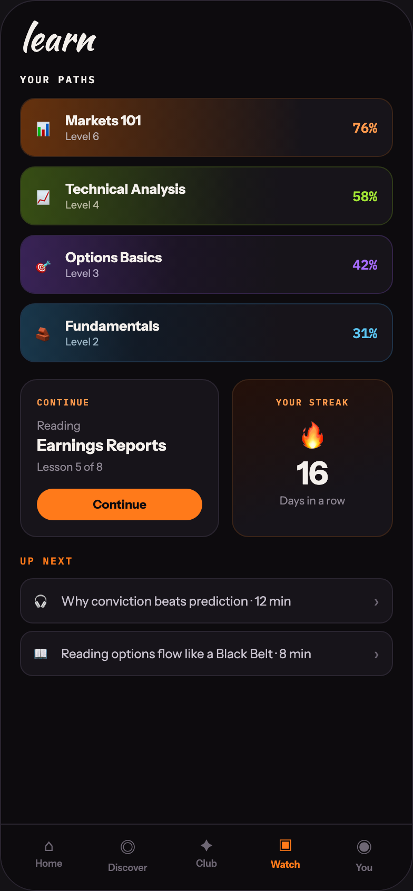

# 08 LEARN

Canvas: **CHEAT CODE · LOCKED BRAND · GLOW AT 40%** · board index 7 · slug `08-learn`
Frame: **392×846px** (design width 392px — port at 390px logical, scale ratios).

> Style values are EXACT computed values from the canvas. `T.*` = canvas token, resolved in
> the Tokens appendix at the bottom of this file. Text marked `(MOCK)` must not ship as drawn —
> see `../../DELTA.md` for its substitution rule.

## Tree

- **“learn YOUR PATHS 📊 Markets 101 Level 6 …”** → `
`
  - box: 392x846 · display: flex · dir: column · width: 390px · height: 844px · bg: T.violet-900-b · border: 1px solid T.violet-800 · radius: 34px (T.r20) · overflow: hidden · type: color T.neutral-950 / Instrument Sans / 16px / w400 / lh normal
  - **“learn YOUR PATHS 📊 Markets 101 Level 6 …”** → `
`
    - box: 390x781 · flex: 1 1 0% · flex-grow: 1 · flex-basis: 0% · pad: 18px 18px 0px 18px · overflow: hidden
    - **"learn"** → `
`
      - box: 354x34 · type: color T.orange-50 / Kaushan Script / 34px / lh 34px · scale: T.ty2
      - text: "learn"
    - **"Your paths"** → `
`
      - box: 354x13 · margin: 16px 0px 0px 0px · type: color T.orange-50 / IBM Plex Mono / 9.5px / w600 / ls 1.52px / uppercase · scale: T.ty118
      - text: "Your paths"
    - **“📊 Markets 101 Level 6 76% 📈 Technical …”** → `
`
      - box: 354x251 · display: flex · dir: column · gap: 9px · margin: 11px 0px 0px 0px
      - **“📊 Markets 101 Level 6 76%…”** → `
`
        - box: 354x56 · pad: 12px 14px 12px 14px · bg-image: linear-gradient(90deg, T.orange-850 0%, T.violet-900 76%) · border: 1px solid T.orange-800 · radius: 14px (T.r15) · overflow: hidden · position: relative [0px 0px 0px 0px]
        - **block[0]** → `
`
          - box: 267.5x54 · width: 76% · bg-image: linear-gradient(90deg, T.orange-400a22, T.neutral-950a00) · position: absolute [0px 84.4844px 0px 0px]
        - **“📊 Markets 101 Level 6 76%…”** → `
`
          - box: 324x30 · display: flex · align: center · justify: space-between · position: relative [0px 0px 0px 0px]
          - **“📊 Markets 101 Level 6…”** → `
`
            - box: 99.7x30 · display: flex · align: center · gap: 10px
            - **"📊"** → ``
              - box: 18x23 · type: 14px · scale: T.ty50
              - text: "📊"
            - **“Markets 101 Level 6…”** → `
`
              - box: 71.7x30
              - **"Markets 101"** → `
`
                - box: 71.7x16 · type: color T.orange-50 / 13px / w700 · scale: T.ty58
                - text: "Markets 101"
              - **"Level 6"** → `
`
                - box: 71.7x13 · margin: 1px 0px 0px 0px · type: color T.neutral-200-b / 10px · scale: T.ty109
                - text: "Level 6"
          - **"76%"** **(MOCK)** → ``
            - box: 23.4x17 · type: color T.orange-300 / IBM Plex Mono / 13px / w600 · scale: T.ty60
            - text: "76%"
      - **“📈 Technical Analysis Level 4 58%…”** → `
`
        - box: 354x56 · pad: 12px 14px 12px 14px · bg-image: linear-gradient(90deg, T.lime-850 0%, T.violet-900 70%) · border: 1px solid T.lime-800 · radius: 14px (T.r15) · overflow: hidden · position: relative [0px 0px 0px 0px]
        - **block[0]** → `
`
          - box: 204.2x54 · width: 58% · bg-image: linear-gradient(90deg, T.lime-400a16, T.neutral-950a00) · position: absolute [0px 147.844px 0px 0px]
        - **“📈 Technical Analysis Level 4 58%…”** → `
`
          - box: 324x30 · display: flex · align: center · justify: space-between · position: relative [0px 0px 0px 0px]
          - **“📈 Technical Analysis Level 4…”** → `
`
            - box: 142x30 · display: flex · align: center · gap: 10px
            - **"📈"** → ``
              - box: 18x23 · type: 14px · scale: T.ty50
              - text: "📈"
            - **“Technical Analysis Level 4…”** → `
`
              - box: 114x30
              - **"Technical Analysis"** → `
`
                - box: 114x16 · type: color T.orange-50 / 13px / w700 · scale: T.ty58
                - text: "Technical Analysis"
              - **"Level 4"** → `
`
                - box: 114x13 · margin: 1px 0px 0px 0px · type: color T.yellow-300 / 10px · scale: T.ty109
                - text: "Level 4"
          - **"58%"** **(MOCK)** → ``
            - box: 23.4x17 · type: color T.lime-400 / IBM Plex Mono / 13px / w600 · scale: T.ty60
            - text: "58%"
      - **“🎯 Options Basics Level 3 42%…”** → `
`
        - box: 354x56 · pad: 12px 14px 12px 14px · bg-image: linear-gradient(90deg, T.violet-850-d 0%, T.violet-900 70%) · border: 1px solid T.violet-800-c · radius: 14px (T.r15) · overflow: hidden · position: relative [0px 0px 0px 0px]
        - **block[0]** → `
`
          - box: 147.8x54 · width: 42% · bg-image: linear-gradient(90deg, T.violet-200a16, T.neutral-950a00) · position: absolute [0px 204.172px 0px 0px]
        - **“🎯 Options Basics Level 3 42%…”** → `
`
          - box: 324x30 · display: flex · align: center · justify: space-between · position: relative [0px 0px 0px 0px]
          - **“🎯 Options Basics Level 3…”** → `
`
            - box: 119.6x30 · display: flex · align: center · gap: 10px
            - **"🎯"** → ``
              - box: 18x23 · type: 14px · scale: T.ty50
              - text: "🎯"
            - **“Options Basics Level 3…”** → `
`
              - box: 91.6x30
              - **"Options Basics"** → `
`
                - box: 91.6x16 · type: color T.orange-50 / 13px / w700 · scale: T.ty58
                - text: "Options Basics"
              - **"Level 3"** → `
`
                - box: 91.6x13 · margin: 1px 0px 0px 0px · type: color T.violet-200-c / 10px · scale: T.ty109
                - text: "Level 3"
          - **"42%"** **(MOCK)** → ``
            - box: 23.4x17 · type: color T.violet-200-b / IBM Plex Mono / 13px / w600 · scale: T.ty60
            - text: "42%"
      - **“🧱 Fundamentals Level 2 31%…”** → `
`
        - box: 354x56 · pad: 12px 14px 12px 14px · bg-image: linear-gradient(90deg, T.blue-850-b 0%, T.violet-900 70%) · border: 1px solid T.blue-800-b · radius: 14px (T.r15) · overflow: hidden · position: relative [0px 0px 0px 0px]
        - **block[0]** → `
`
          - box: 109.1x54 · width: 31% · bg-image: linear-gradient(90deg, T.blue-300a14, T.neutral-950a00) · position: absolute [0px 242.891px 0px 0px]
        - **“🧱 Fundamentals Level 2 31%…”** → `
`
          - box: 324x30 · display: flex · align: center · justify: space-between · position: relative [0px 0px 0px 0px]
          - **“🧱 Fundamentals Level 2…”** → `
`
            - box: 117.2x30 · display: flex · align: center · gap: 10px
            - **"🧱"** → ``
              - box: 18x23 · type: 14px · scale: T.ty50
              - text: "🧱"
            - **“Fundamentals Level 2…”** → `
`
              - box: 89.2x30
              - **"Fundamentals"** → `
`
                - box: 89.2x16 · type: color T.orange-50 / 13px / w700 · scale: T.ty58
                - text: "Fundamentals"
              - **"Level 2"** → `
`
                - box: 89.2x13 · margin: 1px 0px 0px 0px · type: color T.blue-300-d / 10px · scale: T.ty109
                - text: "Level 2"
          - **"31%"** **(MOCK)** → ``
            - box: 23.4x17 · type: color T.blue-300 / IBM Plex Mono / 13px / w600 · scale: T.ty60
            - text: "31%"
    - **“CONTINUE Reading Earnings Reports Lesson…”** → `
`
      - box: 354x149.8 · display: flex · gap: 12px · margin: 16px 0px 0px 0px
      - **“CONTINUE Reading Earnings Reports Lesson…”** → `
`
        - box: 189.1x149.8 · flex: 1.3 1 0% · flex-grow: 1.3 · flex-basis: 0% · pad: 15px 15px 15px 15px · bg: T.violet-900 · border: 1px solid T.violet-800 · radius: 16px (T.r16)
        - **"Continue"** → `
`
          - box: 157.1x11 · type: color T.orange-300 / IBM Plex Mono / 8.5px / w600 / ls 1.19px / uppercase · scale: T.ty140
          - text: "Continue"
        - **"Reading"** → `
`
          - box: 157.1x14 · margin: 10px 0px 0px 0px · type: color T.neutral-400 / 11px · scale: T.ty88
          - text: "Reading"
        - **"Earnings Reports"** → `
`
          - box: 157.1x18.8 · margin: 3px 0px 0px 0px · type: color T.orange-50 / 15px / w700 / lh 18.75px · scale: T.ty45
          - text: "Earnings Reports"
        - **"Lesson 5 of 8"** → `
`
          - box: 157.1x13 · margin: 4px 0px 0px 0px · type: color T.neutral-400 / 10.5px · scale: T.ty100
          - text: "Lesson 5 of 8"
        - **"Continue"** → `
`
          - box: 157.1x30 · pad: 8px 0px 8px 0px · margin: 14px 0px 0px 0px · bg: T.orange-400 · radius: 18px (T.r17) · type: color T.violet-900-b / 11.5px / w700 / align-center · scale: T.ty82
          - text: "Continue"
      - **“YOUR STREAK 🔥 16 Days in a row…”** → `
`
        - box: 152.9x149.8 · flex: 1 1 0% · flex-grow: 1 · flex-basis: 0% · pad: 15px 15px 15px 15px · bg-image: linear-gradient(160deg, T.orange-900 0%, T.violet-900 70%) · border: 1px solid T.orange-800 · radius: 16px (T.r16) · type: align-center
        - **"Your streak"** → `
`
          - box: 120.9x11 · type: color T.orange-300 / IBM Plex Mono / 8.5px / w600 / ls 1.19px / uppercase · scale: T.ty140
          - text: "Your streak"
        - **"🔥"** → `
`
          - box: 120.9x34 · margin: 10px 0px 0px 0px · type: 26px · scale: T.ty9
          - text: "🔥"
        - **"16"** → `
`
          - box: 120.9x30 · margin: 4px 0px 0px 0px · type: color T.orange-50 / 30px / w800 / ls -0.6px / lh 30px · scale: T.ty4
          - text: "16"
        - **"Days in a row"** → `
`
          - box: 120.9x13 · margin: 4px 0px 0px 0px · type: color T.neutral-400 / 10.5px · scale: T.ty100
          - text: "Days in a row"
    - **“UP NEXT…”** → `
`
      - box: 354x13 · display: flex · align: baseline · justify: space-between · margin: 16px 0px 0px 0px
      - **"Up next"** → ``
        - box: 50.5x13 · type: color T.orange-400 / IBM Plex Mono / 9.5px / w600 / ls 1.52px / uppercase · scale: T.ty118
        - text: "Up next"
    - **“🎧 Why conviction beats prediction · 12 …”** → `
`
      - box: 354x93 · display: flex · dir: column · gap: 7px · margin: 10px 0px 0px 0px
      - **“🎧 Why conviction beats prediction · 12 …”** → `
`
        - box: 354x43 · display: flex · align: center · gap: 10px · pad: 10px 12px 10px 12px · bg: T.violet-900 · border: 1px solid T.violet-800 · radius: 12px (T.r13)
        - **"🎧"** → ``
          - box: 16x21 · type: 13px · scale: T.ty59
          - text: "🎧"
        - **"Why conviction beats prediction · 12 min"** → ``
          - box: 286.6x15 · flex: 1 1 0% · flex-grow: 1 · flex-basis: 0% · type: color T.violet-200 / 12px · scale: T.ty71
          - text: "Why conviction beats prediction · 12 min"
        - **"›"** → ``
          - box: 5.4x20 · type: color T.neutral-500 · scale: T.ty36
          - text: "›"
      - **“📖 Reading options flow like a Black Bel…”** → `
`
        - box: 354x43 · display: flex · align: center · gap: 10px · pad: 10px 12px 10px 12px · bg: T.violet-900 · border: 1px solid T.violet-800 · radius: 12px (T.r13)
        - **"📖"** → ``
          - box: 16x21 · type: 13px · scale: T.ty59
          - text: "📖"
        - **"Reading options flow like a Black Belt · 8 m"** → ``
          - box: 286.6x15 · flex: 1 1 0% · flex-grow: 1 · flex-basis: 0% · type: color T.violet-200 / 12px · scale: T.ty71
          - text: "Reading options flow like a Black Belt · 8 min"
        - **"›"** → ``
          - box: 5.4x20 · type: color T.neutral-500 · scale: T.ty36
          - text: "›"
  - **“⌂ Home ◎ Discover ✦ Club ▣ Watch ◉ You…”** → `
`
    - box: 390x63 · display: flex · pad: 10px 8px 16px 8px · bg: T.violet-900-b · border: T:1px solid T.violet-800 R:0px none T.neutral-950 B:0px none T.neutral-950 L:0px none T.neutral-950
    - **“⌂ Home…”** → `
`
      - box: 74.8x36 · flex: 1 1 0% · flex-grow: 1 · flex-basis: 0% · type: align-center
      - **"⌂"** → `
`
        - box: 74.8x19 · type: color T.neutral-500 / 15px · scale: T.ty42
        - text: "⌂"
      - **"Home"** → `
`
        - box: 74.8x11 · margin: 2px 0px 0px 0px · type: color T.neutral-500 / 9px / w600 · scale: T.ty126
        - text: "Home"
    - **“◎ Discover…”** → `
`
      - box: 74.8x36 · flex: 1 1 0% · flex-grow: 1 · flex-basis: 0% · type: align-center
      - **"◎"** → `
`
        - box: 74.8x23 · type: color T.neutral-500 / 15px · scale: T.ty42
        - text: "◎"
      - **"Discover"** → `
`
        - box: 74.8x11 · margin: 2px 0px 0px 0px · type: color T.neutral-500 / 9px / w600 · scale: T.ty126
        - text: "Discover"
    - **“✦ Club…”** → `
`
      - box: 74.8x36 · flex: 1 1 0% · flex-grow: 1 · flex-basis: 0% · type: align-center
      - **"✦"** → `
`
        - box: 74.8x19 · type: color T.neutral-500 / 15px · scale: T.ty42
        - text: "✦"
      - **"Club"** → `
`
        - box: 74.8x11 · margin: 2px 0px 0px 0px · type: color T.neutral-500 / 9px / w600 · scale: T.ty126
        - text: "Club"
    - **“▣ Watch…”** → `
`
      - box: 74.8x36 · flex: 1 1 0% · flex-grow: 1 · flex-basis: 0% · type: align-center
      - **"▣"** → `
`
        - box: 74.8x20 · type: color T.orange-400 / 15px · scale: T.ty42
        - text: "▣"
      - **"Watch"** → `
`
        - box: 74.8x11 · margin: 2px 0px 0px 0px · type: color T.orange-400 / 9px / w700 · scale: T.ty129
        - text: "Watch"
    - **“◉ You…”** → `
`
      - box: 74.8x36 · flex: 1 1 0% · flex-grow: 1 · flex-basis: 0% · type: align-center
      - **"◉"** → `
`
        - box: 74.8x23 · type: color T.neutral-500 / 15px · scale: T.ty42
        - text: "◉"
      - **"You"** → `
`
        - box: 74.8x11 · margin: 2px 0px 0px 0px · type: color T.neutral-500 / 9px / w600 · scale: T.ty126
        - text: "You"

## Tokens used in this board

| token | value | role |
| --- | --- | --- |
| T.violet-800 | `#2A2530` | border, bg, gradient |
| T.orange-50 | `#F4F0EC` | text, bg, border |
| T.neutral-500 | `#6E6774` | text, bg |
| T.violet-900 | `#17141A` | bg, gradient, border |
| T.neutral-400 | `#8F8894` | text, border, bg |
| T.orange-400 | `#FF7A1A` | bg, text, border, gradient |
| T.violet-900-b | `#0D0B0E` | bg, text, border, gradient |
| T.neutral-950 | `#000000` | border, text |
| T.orange-300 | `#FF9A4D` | text |
| T.violet-200 | `#C8C2CE` | text |
| T.neutral-950a00 | `#000000/0` | border, gradient |
| T.orange-800 | `#3A2418` | border, bg |
| T.blue-300 | `#5BC4F0` | text, gradient, bg |
| T.orange-900 | `#241009` | gradient |
| T.violet-200-b | `#A66BFF` | border, gradient, text, bg |
| T.neutral-200-b | `#B8AEB0` | text |
| T.orange-400a22 | `#FF7A1A/0.22` | gradient, shadow |
| T.orange-850 | `#3A1D0A` | gradient |
| T.lime-800 | `#2E3A18` | border |
| T.blue-850-b | `#0E2030` | gradient |
| T.lime-850 | `#22300E` | gradient |
| T.lime-400a16 | `#A3E635/0.16` | gradient |
| T.yellow-300 | `#B8B8A0` | text |
| T.lime-400 | `#A3E635` | text |
| T.violet-800-c | `#322347` | border |
| T.violet-850-d | `#241536` | gradient |
| T.violet-200a16 | `#A66BFF/0.16` | gradient |
| T.violet-200-c | `#B0A6C0` | text |
| T.blue-800-b | `#1E3247` | border |
| T.blue-300a14 | `#5BC4F0/0.14` | gradient |
| T.blue-300-d | `#9BB4C4` | text |
| T.ty2 | Kaushan Script 34px/34px w400 ls:normal | type scale |
| T.ty4 | Instrument Sans 30px/30px w800 ls:-0.6px | type scale |
| T.ty9 | Instrument Sans 26px/normal w400 ls:normal | type scale |
| T.ty36 | Instrument Sans 16px/normal w400 ls:normal | type scale |
| T.ty42 | Instrument Sans 15px/normal w400 ls:normal | type scale |
| T.ty45 | Instrument Sans 15px/18.75px w700 ls:normal | type scale |
| T.ty50 | Instrument Sans 14px/normal w400 ls:normal | type scale |
| T.ty58 | Instrument Sans 13px/normal w700 ls:normal | type scale |
| T.ty59 | Instrument Sans 13px/normal w400 ls:normal | type scale |
| T.ty60 | IBM Plex Mono 13px/normal w600 ls:normal | type scale |
| T.ty71 | Instrument Sans 12px/normal w400 ls:normal | type scale |
| T.ty82 | Instrument Sans 11.5px/normal w700 ls:normal | type scale |
| T.ty88 | Instrument Sans 11px/normal w400 ls:normal | type scale |
| T.ty100 | Instrument Sans 10.5px/normal w400 ls:normal | type scale |
| T.ty109 | Instrument Sans 10px/normal w400 ls:normal | type scale |
| T.ty118 | IBM Plex Mono 9.5px/normal w600 ls:1.52px uppercase | type scale |
| T.ty126 | Instrument Sans 9px/normal w600 ls:normal | type scale |
| T.ty129 | Instrument Sans 9px/normal w700 ls:normal | type scale |
| T.ty140 | IBM Plex Mono 8.5px/normal w600 ls:1.19px uppercase | type scale |
| T.r13 | `12px` | radius |
| T.r15 | `14px` | radius |
| T.r16 | `16px` | radius |
| T.r17 | `18px` | radius |
| T.r20 | `34px` | radius |
