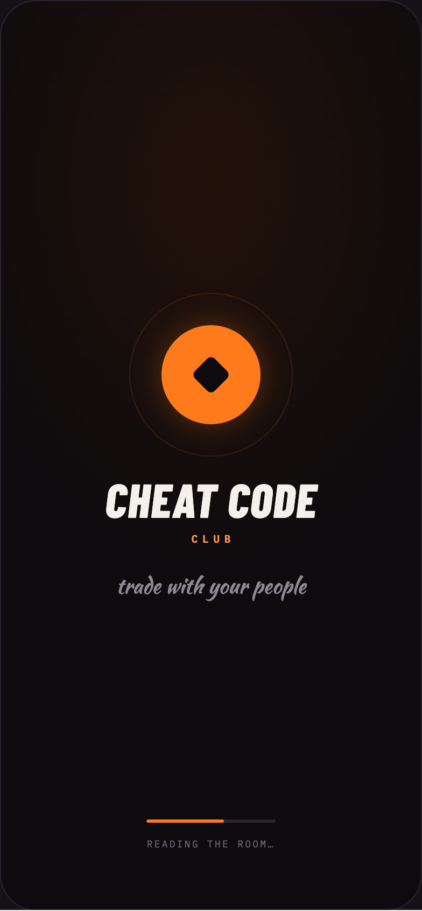

# 09 SPLASH

Canvas: **CHEAT CODE · LOCKED BRAND · GLOW AT 40%** · board index 8 · slug `09-splash`
Frame: **392×846px** (design width 392px — port at 390px logical, scale ratios).

> Style values are EXACT computed values from the canvas. `T.*` = canvas token, resolved in
> the Tokens appendix at the bottom of this file. Text marked `(MOCK)` must not ship as drawn —
> see `../../DELTA.md` for its substitution rule.

## Tree

- **“CHEAT CODE CLUB trade with your people R…”** → `
`
  - box: 392x846 · display: flex · dir: column · align: center · justify: center · width: 390px · height: 844px · bg-image: radial-gradient(120% 80% at 50% 20%, T.orange-900-c 0%, T.violet-900-b 55%) · border: 1px solid T.violet-800 · radius: 34px (T.r20) · overflow: hidden · position: relative [0px 0px 0px 0px] · type: color T.neutral-950 / Instrument Sans / 16px / w400 / lh normal
  - **block[0]** → `
`
    - box: 120x120 · width: 120px · height: 120px · position: relative [0px 0px 0px 0px]
    - **block[0]** → ``
      - box: 242.9x242.9 · border: 1px solid T.orange-400a35 · radius: 50% (T.r21) · opacity: 0.1343 · transform: matrix(2.02396, 0, 0, 2.02396, 0, 0) · position: absolute [0px 0px 0px 0px]
    - **block[1]** → ``
      - box: 152x152 · border: 1px solid T.orange-400a15 · radius: 50% (T.r21) · position: absolute [-16px -16px -16px -16px]
    - **block[2]** → `
`
      - box: 92x92 · display: grid · align: center · justify-items: center · grid-cols: 92px · grid-rows: 92px · bg: T.orange-400 · radius: 50% (T.r21) · shadow: T.orange-400a30 0px 0px 30px 0px · position: absolute [14px 14px 14px 14px]
      - **block[0]** → `
`
        - box: 36.8x36.8 · width: 26px · height: 26px · bg: T.violet-900-b · radius: 5px (T.r6) · transform: matrix(0.707107, 0.707107, -0.707107, 0.707107, 0, 0)
  - **"Cheat Code"** → `
`
    - box: 196.9x44 · margin: 34px 0px 0px 0px · type: color T.orange-50 / Barlow Condensed / 44px / w800 / italic / ls 0.88px / lh 44px / uppercase · scale: T.ty1
    - text: "Cheat Code"
  - **"Club"** → `
`
    - box: 45x13 · pad: 0px 0px 0px 4.2px · margin: 8px 0px 0px 0px · type: color T.orange-300 / IBM Plex Mono / 10px / w600 / ls 4.2px / uppercase · scale: T.ty114
    - text: "Club"
  - **"trade with your people"** → `
`
    - box: 176.2x29 · margin: 22px 0px 0px 0px · type: color T.neutral-400 / Kaushan Script / 20px · scale: T.ty24
    - text: "trade with your people"
  - **“READING THE ROOM……”** → `
`
    - box: 390x28 · display: flex · dir: column · align: center · gap: 14px · position: absolute [760px 0px 56px 0px]
    - **block[0]** → `
`
      - box: 120x3 · width: 120px · height: 3px · bg: T.violet-800 · radius: 2px (T.r3) · overflow: hidden
      - **block[0]** → `
`
        - box: 72x3 · width: 60% · height: 100% · bg: T.orange-400 · radius: 2px (T.r3)
    - **"Reading the room…"** → `
`
      - box: 119.3x11 · type: color T.neutral-500 / IBM Plex Mono / 9px / ls 1.62px / uppercase · scale: T.ty135
      - text: "Reading the room…"

## Tokens used in this board

| token | value | role |
| --- | --- | --- |
| T.violet-800 | `#2A2530` | border, bg, gradient |
| T.orange-50 | `#F4F0EC` | text, bg, border |
| T.neutral-500 | `#6E6774` | text, bg |
| T.neutral-400 | `#8F8894` | text, border, bg |
| T.orange-400 | `#FF7A1A` | bg, text, border, gradient |
| T.violet-900-b | `#0D0B0E` | bg, text, border, gradient |
| T.neutral-950 | `#000000` | border, text |
| T.orange-300 | `#FF9A4D` | text |
| T.orange-400a15 | `#FF7A1A/0.15` | shadow, border |
| T.orange-400a35 | `#FF7A1A/0.35` | border, shadow |
| T.orange-900-c | `#221109` | gradient |
| T.orange-400a30 | `#FF7A1A/0.3` | shadow |
| T.ty1 | Barlow Condensed 44px/44px w800 ls:0.88px uppercase | type scale |
| T.ty24 | Kaushan Script 20px/normal w400 ls:normal | type scale |
| T.ty114 | IBM Plex Mono 10px/normal w600 ls:4.2px uppercase | type scale |
| T.ty135 | IBM Plex Mono 9px/normal w400 ls:1.62px uppercase | type scale |
| T.r3 | `2px` | radius |
| T.r6 | `5px` | radius |
| T.r20 | `34px` | radius |
| T.r21 | `50%` | radius |
