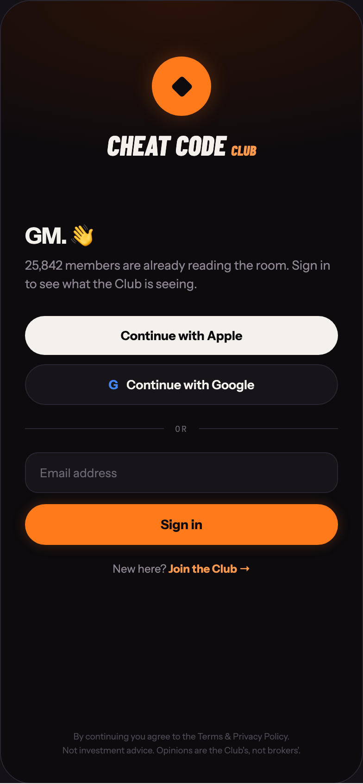

# 10 LOGIN

Canvas: **CHEAT CODE · LOCKED BRAND · GLOW AT 40%** · board index 9 · slug `10-login`
Frame: **392×846px** (design width 392px — port at 390px logical, scale ratios).

> Style values are EXACT computed values from the canvas. `T.*` = canvas token, resolved in
> the Tokens appendix at the bottom of this file. Text marked `(MOCK)` must not ship as drawn —
> see `../../DELTA.md` for its substitution rule.

## Tree

- **“CHEAT CODE CLUB GM. 👋 25,842 members ar…”** → `
`
  - box: 392x846 · display: flex · dir: column · width: 390px · height: 844px · bg: T.violet-900-b · border: 1px solid T.violet-800 · radius: 34px (T.r20) · overflow: hidden · position: relative [0px 0px 0px 0px] · type: color T.neutral-950 / Instrument Sans / 16px / w400 / lh normal
  - **“CHEAT CODE CLUB…”** → `
`
    - box: 390x230 · display: flex · dir: column · align: center · justify: center · height: 230px · flex: 0 0 auto · flex-shrink: 0 · bg-image: radial-gradient(140% 100% at 50% 0%, T.orange-900-b 0%, T.violet-900-b 75%)
    - **block[0]** → `
`
      - box: 64x64 · display: grid · align: center · justify-items: center · grid-cols: 64px · grid-rows: 64px · width: 64px · height: 64px · bg: T.orange-400 · radius: 50% (T.r21) · shadow: T.orange-400a25 0px 0px 22px 0px
      - **block[0]** → `
`
        - box: 24x24 · width: 17px · height: 17px · bg: T.violet-900-b · radius: 3px (T.r4) · transform: matrix(0.707107, 0.707107, -0.707107, 0.707107, 0, 0)
    - **"Cheat Code"** → `
`
      - box: 161.2x30 · margin: 16px 0px 0px 0px · type: color T.orange-50 / Barlow Condensed / 30px / w800 / italic / lh 30px / uppercase · scale: T.ty5
      - text: "Cheat Code"
      - **"Club"** → ``
        - box: 27.1x18 · display: inline · type: color T.orange-300 / 15px / lh 15px · scale: T.ty46
        - text: "Club"
  - **“GM. 👋 25,842 members are already readin…”** → `
`
    - box: 390x555.6 · flex: 1 1 0% · flex-grow: 1 · flex-basis: 0% · pad: 8px 26px 0px 26px
    - **"GM. 👋"** → `
`
      - box: 338x32 · type: color T.orange-50 / 24px / w700 / ls -0.48px · scale: T.ty17
      - text: "GM. 👋"
    - **"25,842 members are already reading the room."** **(MOCK)** → `
`
      - box: 338x40.5 · margin: 5px 0px 0px 0px · type: color T.neutral-400 / 13.5px / lh 20.25px · scale: T.ty54
      - text: "25,842 members are already reading the room. Sign in to see what the Club is seeing."
    - **“Continue with Apple G Continue with Goog…”** → `
`
      - box: 338x96 · display: flex · dir: column · gap: 10px · margin: 24px 0px 0px 0px
      - **"Continue with Apple"** → `
`
        - box: 338x42 · display: flex · align: center · justify: center · gap: 9px · pad: 13px 0px 13px 0px · bg: T.orange-50 · radius: 24px (T.r19) · type: color T.violet-900-b / 13.5px / w700 · scale: T.ty55
        - text: "Continue with Apple"
      - **"Continue with Google"** → `
`
        - box: 338x44 · display: flex · align: center · justify: center · gap: 9px · pad: 13px 0px 13px 0px · bg: T.violet-900 · border: 1px solid T.violet-800 · radius: 24px (T.r19) · type: color T.orange-50 / 13.5px / w600 · scale: T.ty56
        - text: "Continue with Google"
        - **"G"** → ``
          - box: 10.3x16 · type: color T.blue-300-e / w800 · scale: T.ty57
          - text: "G"
    - **“OR…”** → `
`
      - box: 338x11 · display: flex · align: center · gap: 12px · margin: 20px 0px 20px 0px
      - **block[0]** → `
`
        - box: 150.2x1 · height: 1px · flex: 1 1 0% · flex-grow: 1 · flex-basis: 0% · bg: T.violet-800
      - **"OR"** → ``
        - box: 13.7x11 · type: color T.neutral-500 / IBM Plex Mono / 9px / ls 1.44px · scale: T.ty136
        - text: "OR"
      - **block[2]** → `
`
        - box: 150.2x1 · height: 1px · flex: 1 1 0% · flex-grow: 1 · flex-basis: 0% · bg: T.violet-800
    - **"Email address"** → `
`
      - box: 338x44 · pad: 13px 15px 13px 15px · bg: T.violet-900 · border: 1px solid T.violet-800 · radius: 14px (T.r15) · type: color T.neutral-500 / 13px · scale: T.ty59
      - text: "Email address"
    - **"Sign in"** → `
`
      - box: 338x44 · pad: 13px 0px 13px 0px · margin: 12px 0px 0px 0px · bg: T.orange-400 · radius: 24px (T.r19) · shadow: T.orange-400a22 0px 0px 14px 0px · type: color T.violet-900-b / 14px / w800 / align-center · scale: T.ty51
      - text: "Sign in"
    - **"New here?"** → `
`
      - box: 338x15 · margin: 18px 0px 0px 0px · type: color T.neutral-400 / 12px / align-center · scale: T.ty71
      - text: "New here?"
      - **"Join the Club →"** → ``
        - box: 88.2x15 · display: inline · type: color T.orange-300 / w700 · scale: T.ty72
        - text: "Join the Club →"
  - **"By continuing you agree to the Terms & Priva"** → `
`
    - box: 390x58.4 · pad: 0px 26px 28px 26px · type: color T.neutral-700 / 9.5px / lh 15.2px / align-center · scale: T.ty124
    - text: "By continuing you agree to the Terms & Privacy Policy.Not investment advice. Opinions are the Club's, not brokers'."
    - **block[0]** → ` `
      - box: 0x11 · display: inline

## Tokens used in this board

| token | value | role |
| --- | --- | --- |
| T.violet-800 | `#2A2530` | border, bg, gradient |
| T.orange-50 | `#F4F0EC` | text, bg, border |
| T.neutral-500 | `#6E6774` | text, bg |
| T.violet-900 | `#17141A` | bg, gradient, border |
| T.neutral-400 | `#8F8894` | text, border, bg |
| T.orange-400 | `#FF7A1A` | bg, text, border, gradient |
| T.violet-900-b | `#0D0B0E` | bg, text, border, gradient |
| T.neutral-950 | `#000000` | border, text |
| T.orange-300 | `#FF9A4D` | text |
| T.orange-900-b | `#2A1208` | gradient |
| T.orange-400a25 | `#FF7A1A/0.25` | shadow |
| T.orange-400a22 | `#FF7A1A/0.22` | gradient, shadow |
| T.neutral-700 | `#4E4854` | text, bg |
| T.blue-300-e | `#4285F4` | text |
| T.ty5 | Barlow Condensed 30px/30px w800 ls:normal uppercase | type scale |
| T.ty17 | Instrument Sans 24px/normal w700 ls:-0.48px | type scale |
| T.ty46 | Barlow Condensed 15px/15px w800 ls:normal uppercase | type scale |
| T.ty51 | Instrument Sans 14px/normal w800 ls:normal | type scale |
| T.ty54 | Instrument Sans 13.5px/20.25px w400 ls:normal | type scale |
| T.ty55 | Instrument Sans 13.5px/normal w700 ls:normal | type scale |
| T.ty56 | Instrument Sans 13.5px/normal w600 ls:normal | type scale |
| T.ty57 | Instrument Sans 13.5px/normal w800 ls:normal | type scale |
| T.ty59 | Instrument Sans 13px/normal w400 ls:normal | type scale |
| T.ty71 | Instrument Sans 12px/normal w400 ls:normal | type scale |
| T.ty72 | Instrument Sans 12px/normal w700 ls:normal | type scale |
| T.ty124 | Instrument Sans 9.5px/15.2px w400 ls:normal | type scale |
| T.ty136 | IBM Plex Mono 9px/normal w400 ls:1.44px | type scale |
| T.r4 | `3px` | radius |
| T.r15 | `14px` | radius |
| T.r19 | `24px` | radius |
| T.r20 | `34px` | radius |
| T.r21 | `50%` | radius |
