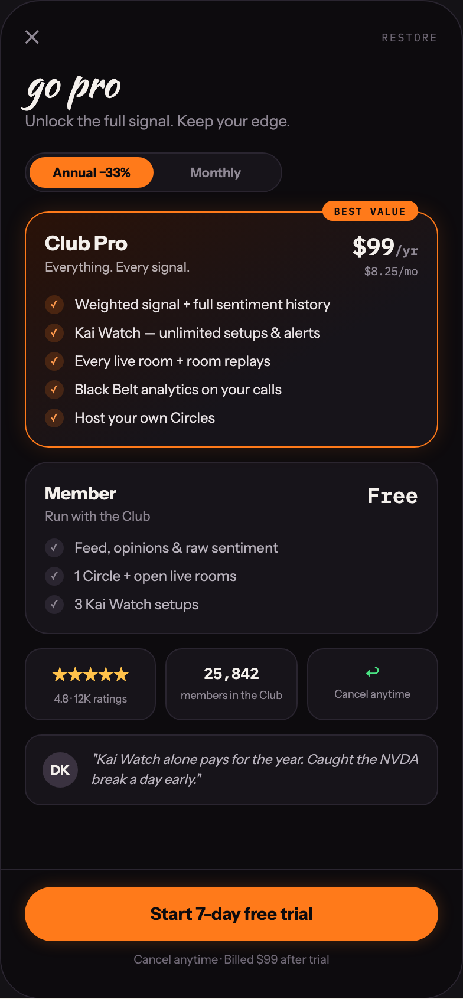

# 11 PRICING

Canvas: **CHEAT CODE · LOCKED BRAND · GLOW AT 40%** · board index 10 · slug `11-pricing`
Frame: **392×846px** (design width 392px — port at 390px logical, scale ratios).

> Style values are EXACT computed values from the canvas. `T.*` = canvas token, resolved in
> the Tokens appendix at the bottom of this file. Text marked `(MOCK)` must not ship as drawn —
> see `../../DELTA.md` for its substitution rule.

## Tree

- **“✕ RESTORE go pro Unlock the full signal.…”** → `
`
  - box: 392x846 · display: flex · dir: column · width: 390px · height: 844px · bg: T.violet-900-b · border: 1px solid T.violet-800 · radius: 34px (T.r20) · overflow: hidden · position: relative [0px 0px 0px 0px] · type: color T.neutral-950 / Instrument Sans / 16px / w400 / lh normal
  - **“✕ RESTORE go pro Unlock the full signal.…”** → `
`
    - box: 390x735 · flex: 1 1 0% · flex-grow: 1 · flex-basis: 0% · pad: 20px 20px 0px 20px · overflow: hidden
    - **“✕ RESTORE…”** → `
`
      - box: 350x20 · display: flex · align: center · justify: space-between
      - **"✕"** → ``
        - box: 12.2x20 · type: color T.neutral-400 · scale: T.ty36
        - text: "✕"
      - **"Restore"** → ``
        - box: 47.9x11 · type: color T.neutral-500 / IBM Plex Mono / 9px / ls 1.44px / uppercase · scale: T.ty137
        - text: "Restore"
    - **"go pro"** → `
`
      - box: 350x32 · margin: 14px 0px 0px 0px · type: color T.orange-50 / Kaushan Script / 32px / lh 32px · scale: T.ty3
      - text: "go pro"
    - **"Unlock the full signal. Keep your edge."** → `
`
      - box: 350x19.5 · margin: 6px 0px 0px 0px · type: color T.neutral-400 / 13px / lh 19.5px · scale: T.ty62
      - text: "Unlock the full signal. Keep your edge."
    - **“Annual −33% Monthly…”** → `
`
      - box: 218x34 · display: flex · width: 210px · pad: 3px 3px 3px 3px · margin: 16px 0px 0px 0px · bg: T.violet-900 · border: 1px solid T.violet-800 · radius: 20px (T.r18)
      - **"Annual −33%"** **(MOCK)** → ``
        - box: 105x26 · flex: 1 1 0% · flex-grow: 1 · flex-basis: 0% · pad: 6px 0px 6px 0px · bg: T.orange-400 · radius: 16px (T.r16) · type: color T.violet-900-b / 11px / w700 / align-center · scale: T.ty86
        - text: "Annual −33%"
      - **"Monthly"** → ``
        - box: 105x26 · flex: 1 1 0% · flex-grow: 1 · flex-basis: 0% · pad: 6px 0px 6px 0px · type: color T.neutral-400 / 11px / w600 / align-center · scale: T.ty92
        - text: "Monthly"
    - **“BEST VALUE Club Pro Everything. Every si…”** → `
`
      - box: 350x200 · pad: 16px 16px 16px 16px · margin: 16px 0px 0px 0px · bg-image: linear-gradient(150deg, T.orange-900-b 0%, T.violet-900 65%) · border: 1px solid T.orange-400 · radius: 20px (T.r18) · shadow: T.orange-400a15 0px 0px 18px 0px · position: relative [0px 0px 0px 0px]
      - **"BEST VALUE"** → ``
        - box: 81.2x17 · pad: 3px 10px 3px 10px · bg: T.orange-400 · radius: 10px (T.r11) · position: absolute [-10px 16px 191px 250.797px] · type: color T.violet-900-b / IBM Plex Mono / 8.5px / w700 / ls 1.02px · scale: T.ty144
        - text: "BEST VALUE"
      - **“Club Pro Everything. Every signal. $99/y…”** → `
`
        - box: 316x40 · display: flex · align: flex-start · justify: space-between
        - **“Club Pro Everything. Every signal.…”** → `
`
          - box: 122.8x37
          - **"Club Pro"** → `
`
            - box: 122.8x20 · type: color T.orange-50 / 17px / w800 · scale: T.ty33
            - text: "Club Pro"
          - **"Everything. Every signal."** → `
`
            - box: 122.8x14 · margin: 3px 0px 0px 0px · type: color T.neutral-200-b / 11px · scale: T.ty88
            - text: "Everything. Every signal."
        - **“$99/yr $8.25/mo…”** → `
`
          - box: 55.8x40 · type: align-right
          - **"$99"** **(MOCK)** → `
`
            - box: 55.8x25 · type: color T.orange-50 / IBM Plex Mono / 20px / w600 · scale: T.ty25
            - text: "$99"
            - **"/yr"** → ``
              - box: 19.8x14 · display: inline · type: color T.neutral-400 / 11px · scale: T.ty87
              - text: "/yr"
          - **"$8.25/mo"** **(MOCK)** → `
`
            - box: 55.8x13 · margin: 2px 0px 0px 0px · type: color T.neutral-400 / IBM Plex Mono / 9.5px · scale: T.ty119
            - text: "$8.25/mo"
      - **“✓ Weighted signal + full sentiment histo…”** → `
`
        - box: 316x112 · display: flex · dir: column · gap: 8px · margin: 14px 0px 0px 0px
        - **"Weighted signal + full sentiment history"** → `
`
          - box: 316x16 · display: flex · align: center · gap: 9px · type: color T.pink-100 / 12px · scale: T.ty71
          - text: "Weighted signal + full sentiment history"
          - **"✓"** → ``
            - box: 16x16 · display: grid · align: center · justify-items: center · grid-cols: 16px · grid-rows: 16px · width: 16px · height: 16px · bg: T.orange-400a18 · radius: 50% (T.r21) · type: color T.orange-300 / 9px · scale: T.ty128
            - text: "✓"
        - **"Kai Watch — unlimited setups & alerts"** → `
`
          - box: 316x16 · display: flex · align: center · gap: 9px · type: color T.pink-100 / 12px · scale: T.ty71
          - text: "Kai Watch — unlimited setups & alerts"
          - **"✓"** → ``
            - box: 16x16 · display: grid · align: center · justify-items: center · grid-cols: 16px · grid-rows: 16px · width: 16px · height: 16px · bg: T.orange-400a18 · radius: 50% (T.r21) · type: color T.orange-300 / 9px · scale: T.ty128
            - text: "✓"
        - **"Every live room + room replays"** → `
`
          - box: 316x16 · display: flex · align: center · gap: 9px · type: color T.pink-100 / 12px · scale: T.ty71
          - text: "Every live room + room replays"
          - **"✓"** → ``
            - box: 16x16 · display: grid · align: center · justify-items: center · grid-cols: 16px · grid-rows: 16px · width: 16px · height: 16px · bg: T.orange-400a18 · radius: 50% (T.r21) · type: color T.orange-300 / 9px · scale: T.ty128
            - text: "✓"
        - **"Black Belt analytics on your calls"** → `
`
          - box: 316x16 · display: flex · align: center · gap: 9px · type: color T.pink-100 / 12px · scale: T.ty71
          - text: "Black Belt analytics on your calls"
          - **"✓"** → ``
            - box: 16x16 · display: grid · align: center · justify-items: center · grid-cols: 16px · grid-rows: 16px · width: 16px · height: 16px · bg: T.orange-400a18 · radius: 50% (T.r21) · type: color T.orange-300 / 9px · scale: T.ty128
            - text: "✓"
        - **"Host your own Circles"** → `
`
          - box: 316x16 · display: flex · align: center · gap: 9px · type: color T.pink-100 / 12px · scale: T.ty71
          - text: "Host your own Circles"
          - **"✓"** → ``
            - box: 16x16 · display: grid · align: center · justify-items: center · grid-cols: 16px · grid-rows: 16px · width: 16px · height: 16px · bg: T.orange-400a18 · radius: 50% (T.r21) · type: color T.orange-300 / 9px · scale: T.ty128
            - text: "✓"
    - **“Member Run with the Club Free ✓ Feed, op…”** → `
`
      - box: 350x146 · pad: 16px 16px 16px 16px · margin: 12px 0px 0px 0px · bg: T.violet-900 · border: 1px solid T.violet-800 · radius: 20px (T.r18)
      - **“Member Run with the Club Free…”** → `
`
        - box: 316x36 · display: flex · align: flex-start · justify: space-between
        - **“Member Run with the Club…”** → `
`
          - box: 89.3x36
          - **"Member"** → `
`
            - box: 89.3x19 · type: color T.orange-50 / 15px / w700 · scale: T.ty47
            - text: "Member"
          - **"Run with the Club"** → `
`
            - box: 89.3x14 · margin: 3px 0px 0px 0px · type: color T.neutral-400 / 11px · scale: T.ty88
            - text: "Run with the Club"
        - **"Free"** → `
`
          - box: 43.2x23 · type: color T.orange-50 / IBM Plex Mono / 18px / w600 · scale: T.ty31
          - text: "Free"
      - **“✓ Feed, opinions & raw sentiment ✓ 1 Cir…”** → `
`
        - box: 316x64 · display: flex · dir: column · gap: 8px · margin: 12px 0px 0px 0px
        - **"Feed, opinions & raw sentiment"** → `
`
          - box: 316x16 · display: flex · align: center · gap: 9px · type: color T.neutral-200 / 12px · scale: T.ty71
          - text: "Feed, opinions & raw sentiment"
          - **"✓"** → ``
            - box: 16x16 · display: grid · align: center · justify-items: center · grid-cols: 16px · grid-rows: 16px · width: 16px · height: 16px · bg: T.violet-800 · radius: 50% (T.r21) · type: color T.neutral-400 / 9px · scale: T.ty128
            - text: "✓"
        - **"1 Circle + open live rooms"** → `
`
          - box: 316x16 · display: flex · align: center · gap: 9px · type: color T.neutral-200 / 12px · scale: T.ty71
          - text: "1 Circle + open live rooms"
          - **"✓"** → ``
            - box: 16x16 · display: grid · align: center · justify-items: center · grid-cols: 16px · grid-rows: 16px · width: 16px · height: 16px · bg: T.violet-800 · radius: 50% (T.r21) · type: color T.neutral-400 / 9px · scale: T.ty128
            - text: "✓"
        - **"3 Kai Watch setups"** → `
`
          - box: 316x16 · display: flex · align: center · gap: 9px · type: color T.neutral-200 / 12px · scale: T.ty71
          - text: "3 Kai Watch setups"
          - **"✓"** → ``
            - box: 16x16 · display: grid · align: center · justify-items: center · grid-cols: 16px · grid-rows: 16px · width: 16px · height: 16px · bg: T.violet-800 · radius: 50% (T.r21) · type: color T.neutral-400 / 9px · scale: T.ty128
            - text: "✓"
    - **“★★★★★ 4.8 · 12K ratings 25,842 members i…”** → `
`
      - box: 350x61 · display: flex · gap: 8px · margin: 12px 0px 0px 0px
      - **“★★★★★ 4.8 · 12K ratings…”** → `
`
        - box: 111.3x61 · flex: 1 1 0% · flex-grow: 1 · flex-basis: 0% · pad: 12px 8px 12px 8px · bg: T.violet-900 · border: 1px solid T.violet-800 · radius: 14px (T.r15) · type: align-center
        - **"★★★★★"** → `
`
          - box: 93.3x20 · type: color T.orange-300-b / 13px · scale: T.ty59
          - text: "★★★★★"
        - **"4.8 · 12K ratings"** → `
`
          - box: 93.3x11 · margin: 4px 0px 0px 0px · type: color T.neutral-400 / 9px · scale: T.ty128
          - text: "4.8 · 12K ratings"
      - **“25,842 members in the Club…”** → `
`
        - box: 111.3x61 · flex: 1 1 0% · flex-grow: 1 · flex-basis: 0% · pad: 12px 8px 12px 8px · bg: T.violet-900 · border: 1px solid T.violet-800 · radius: 14px (T.r15) · type: align-center
        - **"25,842"** **(MOCK)** → `
`
          - box: 93.3x17 · type: color T.orange-50 / IBM Plex Mono / 13px / w600 · scale: T.ty60
          - text: "25,842"
        - **"members in the Club"** → `
`
          - box: 93.3x11 · margin: 4px 0px 0px 0px · type: color T.neutral-400 / 9px · scale: T.ty128
          - text: "members in the Club"
      - **“↩ Cancel anytime…”** → `
`
        - box: 111.3x61 · flex: 1 1 0% · flex-grow: 1 · flex-basis: 0% · pad: 12px 8px 12px 8px · bg: T.violet-900 · border: 1px solid T.violet-800 · radius: 14px (T.r15) · type: align-center
        - **"↩"** → `
`
          - box: 93.3x16 · type: color T.green-400 / 13px · scale: T.ty59
          - text: "↩"
        - **"Cancel anytime"** → `
`
          - box: 93.3x11 · margin: 4px 0px 0px 0px · type: color T.neutral-400 / 9px · scale: T.ty128
          - text: "Cancel anytime"
    - **“DK "Kai Watch alone pays for the year. C…”** → `
`
      - box: 350x60.5 · display: flex · align: center · gap: 11px · pad: 12px 14px 12px 14px · margin: 12px 0px 0px 0px · bg: T.violet-900 · border: 1px solid T.violet-800 · radius: 14px (T.r15)
      - **"DK"** → `
`
        - box: 30x30 · display: grid · align: center · justify-items: center · grid-cols: 30px · grid-rows: 30px · width: 30px · height: 30px · flex: 0 0 auto · flex-shrink: 0 · bg: T.violet-800-b · radius: 50% (T.r21) · type: color T.orange-50 / 11px / w700 · scale: T.ty86
        - text: "DK"
      - **"\"Kai Watch alone pays for the year. Caught t"** → `
`
        - box: 279x34.5 · flex: 1 1 0% · flex-grow: 1 · flex-basis: 0% · type: color T.neutral-200 / 11.5px / italic / lh 17.25px · scale: T.ty83
        - text: "\"Kai Watch alone pays for the year. Caught the NVDA break a day early.\""
  - **“Start 7-day free trial Cancel anytime · …”** → `
`
    - box: 390x109 · pad: 14px 20px 26px 20px · bg: T.violet-900-b · border: T:1px solid T.violet-800 R:0px none T.neutral-950 B:0px none T.neutral-950 L:0px none T.neutral-950
    - **"Start 7-day free trial"** → `
`
      - box: 350x46 · pad: 14px 0px 14px 0px · bg: T.orange-400 · radius: 24px (T.r19) · shadow: T.orange-400a22 0px 0px 14px 0px · type: color T.violet-900-b / 14.5px / w800 / align-center · scale: T.ty48
      - text: "Start 7-day free trial"
    - **"Cancel anytime · Billed $99 after trial"** **(MOCK)** → `
`
      - box: 350x13 · margin: 9px 0px 0px 0px · type: color T.neutral-500 / 10px / align-center · scale: T.ty109
      - text: "Cancel anytime · Billed $99 after trial"

## Tokens used in this board

| token | value | role |
| --- | --- | --- |
| T.violet-800 | `#2A2530` | border, bg, gradient |
| T.orange-50 | `#F4F0EC` | text, bg, border |
| T.neutral-500 | `#6E6774` | text, bg |
| T.violet-900 | `#17141A` | bg, gradient, border |
| T.neutral-400 | `#8F8894` | text, border, bg |
| T.orange-400 | `#FF7A1A` | bg, text, border, gradient |
| T.violet-900-b | `#0D0B0E` | bg, text, border, gradient |
| T.neutral-950 | `#000000` | border, text |
| T.green-400 | `#4AE383` | text, gradient, border, bg |
| T.orange-300 | `#FF9A4D` | text |
| T.violet-800-b | `#3A3240` | bg, border |
| T.orange-300-b | `#FFC24B` | text, gradient, border, bg |
| T.pink-100 | `#E8E2E4` | text |
| T.neutral-200 | `#B8B2BC` | text |
| T.orange-400a18 | `#FF7A1A/0.18` | shadow, bg |
| T.neutral-200-b | `#B8AEB0` | text |
| T.orange-900-b | `#2A1208` | gradient |
| T.orange-400a15 | `#FF7A1A/0.15` | shadow, border |
| T.orange-400a22 | `#FF7A1A/0.22` | gradient, shadow |
| T.ty3 | Kaushan Script 32px/32px w400 ls:normal | type scale |
| T.ty25 | IBM Plex Mono 20px/normal w600 ls:normal | type scale |
| T.ty31 | IBM Plex Mono 18px/normal w600 ls:normal | type scale |
| T.ty33 | Instrument Sans 17px/normal w800 ls:normal | type scale |
| T.ty36 | Instrument Sans 16px/normal w400 ls:normal | type scale |
| T.ty47 | Instrument Sans 15px/normal w700 ls:normal | type scale |
| T.ty48 | Instrument Sans 14.5px/normal w800 ls:normal | type scale |
| T.ty59 | Instrument Sans 13px/normal w400 ls:normal | type scale |
| T.ty60 | IBM Plex Mono 13px/normal w600 ls:normal | type scale |
| T.ty62 | Instrument Sans 13px/19.5px w400 ls:normal | type scale |
| T.ty71 | Instrument Sans 12px/normal w400 ls:normal | type scale |
| T.ty83 | Instrument Sans 11.5px/17.25px w400 ls:normal | type scale |
| T.ty86 | Instrument Sans 11px/normal w700 ls:normal | type scale |
| T.ty87 | IBM Plex Mono 11px/normal w600 ls:normal | type scale |
| T.ty88 | Instrument Sans 11px/normal w400 ls:normal | type scale |
| T.ty92 | Instrument Sans 11px/normal w600 ls:normal | type scale |
| T.ty109 | Instrument Sans 10px/normal w400 ls:normal | type scale |
| T.ty119 | IBM Plex Mono 9.5px/normal w400 ls:normal | type scale |
| T.ty128 | Instrument Sans 9px/normal w400 ls:normal | type scale |
| T.ty137 | IBM Plex Mono 9px/normal w400 ls:1.44px uppercase | type scale |
| T.ty144 | IBM Plex Mono 8.5px/normal w700 ls:1.02px | type scale |
| T.r11 | `10px` | radius |
| T.r15 | `14px` | radius |
| T.r16 | `16px` | radius |
| T.r18 | `20px` | radius |
| T.r19 | `24px` | radius |
| T.r20 | `34px` | radius |
| T.r21 | `50%` | radius |
