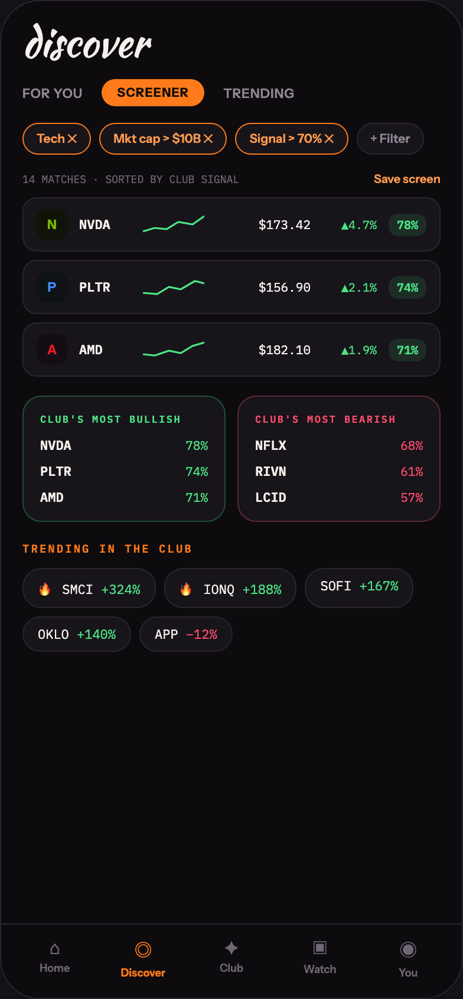

# 15 DISCOVER · SCREENER

Canvas: **CHEAT CODE · LOCKED BRAND · GLOW AT 40%** · board index 14 · slug `15-discover-screener`
Frame: **392×846px** (design width 392px — port at 390px logical, scale ratios).

> Style values are EXACT computed values from the canvas. `T.*` = canvas token, resolved in
> the Tokens appendix at the bottom of this file. Text marked `(MOCK)` must not ship as drawn —
> see `../../DELTA.md` for its substitution rule.

## Tree

- **“discover FOR YOU SCREENER TRENDING Tech …”** → `
`
  - box: 392x846 · display: flex · dir: column · width: 390px · height: 844px · bg: T.violet-900-b · border: 1px solid T.violet-800 · radius: 34px (T.r20) · overflow: hidden · type: color T.neutral-950 / Instrument Sans / 16px / w400 / lh normal
  - **“discover FOR YOU SCREENER TRENDING Tech …”** → `
`
    - box: 390x781 · flex: 1 1 0% · flex-grow: 1 · flex-basis: 0% · pad: 18px 18px 0px 18px · overflow: hidden
    - **"discover"** → `
`
      - box: 354x34 · type: color T.orange-50 / Kaushan Script / 34px / lh 34px · scale: T.ty2
      - text: "discover"
    - **“FOR YOU SCREENER TRENDING…”** → `
`
      - box: 354x23 · display: flex · align: center · gap: 16px · margin: 14px 0px 0px 0px
      - **"FOR YOU"** → ``
        - box: 51.1x14 · type: color T.neutral-400 / 11px / w600 / ls 0.44px · scale: T.ty90
        - text: "FOR YOU"
      - **"SCREENER"** → ``
        - box: 87x23 · pad: 5px 13px 5px 13px · bg: T.orange-400 · radius: 16px (T.r16) · type: color T.violet-900-b / 10.5px / w800 / ls 0.63px · scale: T.ty104
        - text: "SCREENER"
      - **"TRENDING"** → ``
        - box: 60.4x14 · type: color T.neutral-400 / 11px / w600 / ls 0.44px · scale: T.ty90
        - text: "TRENDING"
    - **“Tech ✕ Mkt cap > $10B ✕ Signal > 70% ✕ +…”** → `
`
      - box: 354x27 · display: flex · gap: 7px · margin: 14px 0px 0px 0px · overflow: hidden
      - **"Tech ✕"** → ``
        - box: 58.1x27 · flex: 0 0 auto · flex-shrink: 0 · pad: 6px 11px 6px 11px · bg: T.violet-900 · border: 1px solid T.orange-400 · radius: 16px (T.r16) · type: color T.orange-300 / 10.5px / w600 · scale: T.ty101
        - text: "Tech ✕"
      - **"Mkt cap > $10B ✕"** **(MOCK)** → ``
        - box: 108.1x27 · flex: 0 0 auto · flex-shrink: 0 · pad: 6px 11px 6px 11px · bg: T.violet-900 · border: 1px solid T.orange-400 · radius: 16px (T.r16) · type: color T.orange-300 / 10.5px / w600 · scale: T.ty101
        - text: "Mkt cap > $10B ✕"
      - **"Signal > 70% ✕"** **(MOCK)** → ``
        - box: 95.5x27 · flex: 0 0 auto · flex-shrink: 0 · pad: 6px 11px 6px 11px · bg: T.violet-900 · border: 1px solid T.orange-400 · radius: 16px (T.r16) · type: color T.orange-300 / 10.5px / w600 · scale: T.ty101
        - text: "Signal > 70% ✕"
      - **"+ Filter"** → ``
        - box: 57.5x27 · flex: 0 0 auto · flex-shrink: 0 · pad: 6px 11px 6px 11px · bg: T.violet-900 · border: 1px solid T.violet-800 · radius: 16px (T.r16) · type: color T.neutral-400 / 10.5px / w600 · scale: T.ty101
        - text: "+ Filter"
    - **“14 MATCHES · SORTED BY CLUB SIGNAL Save …”** → `
`
      - box: 354x13 · display: flex · align: baseline · justify: space-between · margin: 14px 0px 0px 0px
      - **"14 MATCHES · SORTED BY CLUB SIGNAL"** → ``
        - box: 183.6x11 · type: color T.neutral-500 / IBM Plex Mono / 9px · scale: T.ty127
        - text: "14 MATCHES · SORTED BY CLUB SIGNAL"
      - **"Save screen"** → ``
        - box: 56.5x13 · type: color T.orange-300 / 10px / w600 · scale: T.ty116
        - text: "Save screen"
    - **“N NVDA $173.42 ▲4.7% 78% P PLTR $156.90 …”** → `
`
      - box: 354x152 · display: flex · dir: column · gap: 7px · margin: 9px 0px 0px 0px
      - **“N NVDA $173.42 ▲4.7% 78%…”** → `
`
        - box: 354x46 · display: flex · align: center · gap: 10px · pad: 9px 11px 9px 11px · bg: T.violet-900 · border: 1px solid T.violet-800 · radius: 12px (T.r13)
        - **"N"** → `
`
          - box: 26x26 · display: grid · align: center · justify-items: center · grid-cols: 26px · grid-rows: 26px · width: 26px · height: 26px · bg: T.lime-900 · radius: 8px (T.r9) · type: color T.lime-600 / 11px / w800 · scale: T.ty91
          - text: "N"
        - **“NVDA…”** → `
`
          - box: 44x14 · width: 44px
          - **"NVDA"** → `
`
            - box: 44x14 · type: color T.orange-50 / IBM Plex Mono / 11px / w600 · scale: T.ty87
            - text: "NVDA"
        - **svg** → `<svg>`
          - box: 52x18 · flex: 0 0 auto · flex-shrink: 0 · overflow: hidden
          - svg: `<svg data-dc-tpl="1203" width="52" height="18" viewBox="0 0 52 18" style="flex: 0 0 auto;"><path data-dc-tpl="1204" d="M0 15 L10 12 L20 13 L30 7 L42 9 L52 2" fill="none" stroke="#4AE383" stroke-width="1.6"></path></svg>`
          - **block[0]** → `<path>`
            - box: 52x13 · display: inline
        - **"$173.42"** **(MOCK)** → ``
          - box: 80x14 · flex: 1 1 0% · flex-grow: 1 · flex-basis: 0% · type: color T.orange-50 / IBM Plex Mono / 10.5px / align-right · scale: T.ty102
          - text: "$173.42"
        - **"▲4.7%"** **(MOCK)** → ``
          - box: 46x13 · width: 46px · type: color T.green-400 / IBM Plex Mono / 10px / align-right · scale: T.ty108
          - text: "▲4.7%"
        - **"78%"** **(MOCK)** → ``
          - box: 32x19 · pad: 3px 7px 3px 7px · bg: T.green-400a12 · radius: 8px (T.r9) · type: color T.green-400 / IBM Plex Mono / 10px / w600 · scale: T.ty110
          - text: "78%"
      - **“P PLTR $156.90 ▲2.1% 74%…”** → `
`
        - box: 354x46 · display: flex · align: center · gap: 10px · pad: 9px 11px 9px 11px · bg: T.violet-900 · border: 1px solid T.violet-800 · radius: 12px (T.r13)
        - **"P"** → `
`
          - box: 26x26 · display: grid · align: center · justify-items: center · grid-cols: 26px · grid-rows: 26px · width: 26px · height: 26px · bg: T.blue-900 · radius: 8px (T.r9) · type: color T.blue-300-b / 11px / w800 · scale: T.ty91
          - text: "P"
        - **“PLTR…”** → `
`
          - box: 44x14 · width: 44px
          - **"PLTR"** → `
`
            - box: 44x14 · type: color T.orange-50 / IBM Plex Mono / 11px / w600 · scale: T.ty87
            - text: "PLTR"
        - **svg** → `<svg>`
          - box: 52x18 · flex: 0 0 auto · flex-shrink: 0 · overflow: hidden
          - svg: `<svg data-dc-tpl="1212" width="52" height="18" viewBox="0 0 52 18" style="flex: 0 0 auto;"><path data-dc-tpl="1213" d="M0 14 L12 15 L22 9 L32 11 L44 4 L52 6" fill="none" stroke="#4AE383" stroke-width="1.6"></path></svg>`
          - **block[0]** → `<path>`
            - box: 52x11 · display: inline
        - **"$156.90"** **(MOCK)** → ``
          - box: 80x14 · flex: 1 1 0% · flex-grow: 1 · flex-basis: 0% · type: color T.orange-50 / IBM Plex Mono / 10.5px / align-right · scale: T.ty102
          - text: "$156.90"
        - **"▲2.1%"** **(MOCK)** → ``
          - box: 46x13 · width: 46px · type: color T.green-400 / IBM Plex Mono / 10px / align-right · scale: T.ty108
          - text: "▲2.1%"
        - **"74%"** **(MOCK)** → ``
          - box: 32x19 · pad: 3px 7px 3px 7px · bg: T.green-400a12 · radius: 8px (T.r9) · type: color T.green-400 / IBM Plex Mono / 10px / w600 · scale: T.ty110
          - text: "74%"
      - **“A AMD $182.10 ▲1.9% 71%…”** → `
`
        - box: 354x46 · display: flex · align: center · gap: 10px · pad: 9px 11px 9px 11px · bg: T.violet-900 · border: 1px solid T.violet-800 · radius: 12px (T.r13)
        - **"A"** → `
`
          - box: 26x26 · display: grid · align: center · justify-items: center · grid-cols: 26px · grid-rows: 26px · width: 26px · height: 26px · bg: T.magenta-900 · radius: 8px (T.r9) · type: color T.red-400-b / 11px / w800 · scale: T.ty91
          - text: "A"
        - **“AMD…”** → `
`
          - box: 44x14 · width: 44px
          - **"AMD"** → `
`
            - box: 44x14 · type: color T.orange-50 / IBM Plex Mono / 11px / w600 · scale: T.ty87
            - text: "AMD"
        - **svg** → `<svg>`
          - box: 52x18 · flex: 0 0 auto · flex-shrink: 0 · overflow: hidden
          - svg: `<svg data-dc-tpl="1221" width="52" height="18" viewBox="0 0 52 18" style="flex: 0 0 auto;"><path data-dc-tpl="1222" d="M0 13 L10 14 L22 10 L32 12 L42 6 L52 3" fill="none" stroke="#4AE383" stroke-width="1.6"></path></svg>`
          - **block[0]** → `<path>`
            - box: 52x11 · display: inline
        - **"$182.10"** **(MOCK)** → ``
          - box: 80x14 · flex: 1 1 0% · flex-grow: 1 · flex-basis: 0% · type: color T.orange-50 / IBM Plex Mono / 10.5px / align-right · scale: T.ty102
          - text: "$182.10"
        - **"▲1.9%"** **(MOCK)** → ``
          - box: 46x13 · width: 46px · type: color T.green-400 / IBM Plex Mono / 10px / align-right · scale: T.ty108
          - text: "▲1.9%"
        - **"71%"** **(MOCK)** → ``
          - box: 32x19 · pad: 3px 7px 3px 7px · bg: T.green-400a12 · radius: 8px (T.r9) · type: color T.green-400 / IBM Plex Mono / 10px / w600 · scale: T.ty110
          - text: "71%"
    - **“CLUB'S MOST BULLISH NVDA 78% PLTR 74% AM…”** → `
`
      - box: 354x107 · display: flex · gap: 10px · margin: 16px 0px 0px 0px
      - **“CLUB'S MOST BULLISH NVDA 78% PLTR 74% AM…”** → `
`
        - box: 172x107 · flex: 1 1 0% · flex-grow: 1 · flex-basis: 0% · pad: 13px 14px 13px 14px · bg: T.violet-900 · border: 1px solid T.teal-800 · radius: 16px (T.r16)
        - **"Club's most bullish"** → `
`
          - box: 142x11 · type: color T.green-400 / IBM Plex Mono / 8.5px / w600 / ls 1.19px / uppercase · scale: T.ty140
          - text: "Club's most bullish"
        - **“NVDA 78% PLTR 74% AMD 71%…”** → `
`
          - box: 142x58 · display: flex · dir: column · gap: 8px · margin: 10px 0px 0px 0px
          - **“NVDA 78%…”** → `
`
            - box: 142x14 · display: flex · align: center · justify: space-between
            - **"NVDA"** → ``
              - box: 26.4x14 · type: color T.orange-50 / IBM Plex Mono / 11px / w600 · scale: T.ty87
              - text: "NVDA"
            - **"78%"** **(MOCK)** → ``
              - box: 18.9x14 · type: color T.green-400 / IBM Plex Mono / 10.5px · scale: T.ty102
              - text: "78%"
          - **“PLTR 74%…”** → `
`
            - box: 142x14 · display: flex · align: center · justify: space-between
            - **"PLTR"** → ``
              - box: 26.4x14 · type: color T.orange-50 / IBM Plex Mono / 11px / w600 · scale: T.ty87
              - text: "PLTR"
            - **"74%"** **(MOCK)** → ``
              - box: 18.9x14 · type: color T.green-400 / IBM Plex Mono / 10.5px · scale: T.ty102
              - text: "74%"
          - **“AMD 71%…”** → `
`
            - box: 142x14 · display: flex · align: center · justify: space-between
            - **"AMD"** → ``
              - box: 19.8x14 · type: color T.orange-50 / IBM Plex Mono / 11px / w600 · scale: T.ty87
              - text: "AMD"
            - **"71%"** **(MOCK)** → ``
              - box: 18.9x14 · type: color T.green-400 / IBM Plex Mono / 10.5px · scale: T.ty102
              - text: "71%"
      - **“CLUB'S MOST BEARISH NFLX 68% RIVN 61% LC…”** → `
`
        - box: 172x107 · flex: 1 1 0% · flex-grow: 1 · flex-basis: 0% · pad: 13px 14px 13px 14px · bg: T.violet-900 · border: 1px solid T.pink-700 · radius: 16px (T.r16)
        - **"Club's most bearish"** → `
`
          - box: 142x11 · type: color T.red-300 / IBM Plex Mono / 8.5px / w600 / ls 1.19px / uppercase · scale: T.ty140
          - text: "Club's most bearish"
        - **“NFLX 68% RIVN 61% LCID 57%…”** → `
`
          - box: 142x58 · display: flex · dir: column · gap: 8px · margin: 10px 0px 0px 0px
          - **“NFLX 68%…”** → `
`
            - box: 142x14 · display: flex · align: center · justify: space-between
            - **"NFLX"** → ``
              - box: 26.4x14 · type: color T.orange-50 / IBM Plex Mono / 11px / w600 · scale: T.ty87
              - text: "NFLX"
            - **"68%"** **(MOCK)** → ``
              - box: 18.9x14 · type: color T.red-300 / IBM Plex Mono / 10.5px · scale: T.ty102
              - text: "68%"
          - **“RIVN 61%…”** → `
`
            - box: 142x14 · display: flex · align: center · justify: space-between
            - **"RIVN"** → ``
              - box: 26.4x14 · type: color T.orange-50 / IBM Plex Mono / 11px / w600 · scale: T.ty87
              - text: "RIVN"
            - **"61%"** **(MOCK)** → ``
              - box: 18.9x14 · type: color T.red-300 / IBM Plex Mono / 10.5px · scale: T.ty102
              - text: "61%"
          - **“LCID 57%…”** → `
`
            - box: 142x14 · display: flex · align: center · justify: space-between
            - **"LCID"** → ``
              - box: 26.4x14 · type: color T.orange-50 / IBM Plex Mono / 11px / w600 · scale: T.ty87
              - text: "LCID"
            - **"57%"** **(MOCK)** → ``
              - box: 18.9x14 · type: color T.red-300 / IBM Plex Mono / 10.5px · scale: T.ty102
              - text: "57%"
    - **"Trending in the club"** → `
`
      - box: 354x13 · margin: 16px 0px 0px 0px · type: color T.orange-400 / IBM Plex Mono / 9.5px / w600 / ls 1.52px / uppercase · scale: T.ty118
      - text: "Trending in the club"
    - **“🔥 SMCI +324% 🔥 IONQ +188% SOFI +167% O…”** → `
`
      - box: 354x71 · display: flex · wrap: wrap · gap: 7px · margin: 10px 0px 0px 0px
      - **"🔥 SMCI"** → ``
        - box: 112.6x34 · pad: 7px 12px 7px 12px · bg: T.violet-900 · border: 1px solid T.violet-800 · radius: 16px (T.r16) · type: color T.orange-50 / IBM Plex Mono / 11px · scale: T.ty89
        - text: "🔥 SMCI"
        - **"+324%"** **(MOCK)** → ``
          - box: 33x14 · display: inline · type: color T.green-400 · scale: T.ty89
          - text: "+324%"
      - **"🔥 IONQ"** → ``
        - box: 112.6x34 · pad: 7px 12px 7px 12px · bg: T.violet-900 · border: 1px solid T.violet-800 · radius: 16px (T.r16) · type: color T.orange-50 / IBM Plex Mono / 11px · scale: T.ty89
        - text: "🔥 IONQ"
        - **"+188%"** **(MOCK)** → ``
          - box: 33x14 · display: inline · type: color T.green-400 · scale: T.ty89
          - text: "+188%"
      - **"SOFI"** → ``
        - box: 92x34 · pad: 7px 12px 7px 12px · bg: T.violet-900 · border: 1px solid T.violet-800 · radius: 16px (T.r16) · type: color T.orange-50 / IBM Plex Mono / 11px · scale: T.ty89
        - text: "SOFI"
        - **"+167%"** **(MOCK)** → ``
          - box: 33x14 · display: inline · type: color T.green-400 · scale: T.ty89
          - text: "+167%"
      - **"OKLO"** → ``
        - box: 92x30 · pad: 7px 12px 7px 12px · bg: T.violet-900 · border: 1px solid T.violet-800 · radius: 16px (T.r16) · type: color T.orange-50 / IBM Plex Mono / 11px · scale: T.ty89
        - text: "OKLO"
        - **"+140%"** **(MOCK)** → ``
          - box: 33x14 · display: inline · type: color T.green-400 · scale: T.ty89
          - text: "+140%"
      - **"APP"** → ``
        - box: 78.8x30 · pad: 7px 12px 7px 12px · bg: T.violet-900 · border: 1px solid T.violet-800 · radius: 16px (T.r16) · type: color T.orange-50 / IBM Plex Mono / 11px · scale: T.ty89
        - text: "APP"
        - **"−12%"** **(MOCK)** → ``
          - box: 26.4x14 · display: inline · type: color T.red-300 · scale: T.ty89
          - text: "−12%"
  - **“⌂ Home ◎ Discover ✦ Club ▣ Watch ◉ You…”** → `
`
    - box: 390x63 · display: flex · pad: 10px 8px 16px 8px · bg: T.violet-900-b · border: T:1px solid T.violet-800 R:0px none T.neutral-950 B:0px none T.neutral-950 L:0px none T.neutral-950
    - **“⌂ Home…”** → `
`
      - box: 74.8x36 · flex: 1 1 0% · flex-grow: 1 · flex-basis: 0% · type: align-center
      - **"⌂"** → `
`
        - box: 74.8x19 · type: color T.neutral-500 / 15px · scale: T.ty42
        - text: "⌂"
      - **"Home"** → `
`
        - box: 74.8x11 · margin: 2px 0px 0px 0px · type: color T.neutral-500 / 9px / w600 · scale: T.ty126
        - text: "Home"
    - **“◎ Discover…”** → `
`
      - box: 74.8x36 · flex: 1 1 0% · flex-grow: 1 · flex-basis: 0% · type: align-center
      - **"◎"** → `
`
        - box: 74.8x23 · type: color T.orange-400 / 15px · scale: T.ty42
        - text: "◎"
      - **"Discover"** → `
`
        - box: 74.8x11 · margin: 2px 0px 0px 0px · type: color T.orange-400 / 9px / w700 · scale: T.ty129
        - text: "Discover"
    - **“✦ Club…”** → `
`
      - box: 74.8x36 · flex: 1 1 0% · flex-grow: 1 · flex-basis: 0% · type: align-center
      - **"✦"** → `
`
        - box: 74.8x19 · type: color T.neutral-500 / 15px · scale: T.ty42
        - text: "✦"
      - **"Club"** → `
`
        - box: 74.8x11 · margin: 2px 0px 0px 0px · type: color T.neutral-500 / 9px / w600 · scale: T.ty126
        - text: "Club"
    - **“▣ Watch…”** → `
`
      - box: 74.8x36 · flex: 1 1 0% · flex-grow: 1 · flex-basis: 0% · type: align-center
      - **"▣"** → `
`
        - box: 74.8x20 · type: color T.neutral-500 / 15px · scale: T.ty42
        - text: "▣"
      - **"Watch"** → `
`
        - box: 74.8x11 · margin: 2px 0px 0px 0px · type: color T.neutral-500 / 9px / w600 · scale: T.ty126
        - text: "Watch"
    - **“◉ You…”** → `
`
      - box: 74.8x36 · flex: 1 1 0% · flex-grow: 1 · flex-basis: 0% · type: align-center
      - **"◉"** → `
`
        - box: 74.8x23 · type: color T.neutral-500 / 15px · scale: T.ty42
        - text: "◉"
      - **"You"** → `
`
        - box: 74.8x11 · margin: 2px 0px 0px 0px · type: color T.neutral-500 / 9px / w600 · scale: T.ty126
        - text: "You"

## Tokens used in this board

| token | value | role |
| --- | --- | --- |
| T.violet-800 | `#2A2530` | border, bg, gradient |
| T.orange-50 | `#F4F0EC` | text, bg, border |
| T.neutral-500 | `#6E6774` | text, bg |
| T.violet-900 | `#17141A` | bg, gradient, border |
| T.neutral-400 | `#8F8894` | text, border, bg |
| T.orange-400 | `#FF7A1A` | bg, text, border, gradient |
| T.violet-900-b | `#0D0B0E` | bg, text, border, gradient |
| T.neutral-950 | `#000000` | border, text |
| T.green-400 | `#4AE383` | text, gradient, border, bg |
| T.orange-300 | `#FF9A4D` | text |
| T.red-300 | `#FF4D6D` | text, gradient, bg, border |
| T.lime-600 | `#76B900` | text, gradient |
| T.lime-900 | `#101408` | bg, gradient |
| T.blue-300-b | `#3D8BFF` | text, border, bg |
| T.pink-700 | `#5A2A38` | gradient, border |
| T.teal-800 | `#20503A` | gradient, border |
| T.blue-900 | `#0E1216` | bg |
| T.green-400a12 | `#4AE383/0.12` | bg |
| T.magenta-900 | `#140E14` | bg |
| T.red-400-b | `#ED1C24` | text |
| T.ty2 | Kaushan Script 34px/34px w400 ls:normal | type scale |
| T.ty42 | Instrument Sans 15px/normal w400 ls:normal | type scale |
| T.ty87 | IBM Plex Mono 11px/normal w600 ls:normal | type scale |
| T.ty89 | IBM Plex Mono 11px/normal w400 ls:normal | type scale |
| T.ty90 | Instrument Sans 11px/normal w600 ls:0.44px | type scale |
| T.ty91 | Instrument Sans 11px/normal w800 ls:normal | type scale |
| T.ty101 | Instrument Sans 10.5px/normal w600 ls:normal | type scale |
| T.ty102 | IBM Plex Mono 10.5px/normal w400 ls:normal | type scale |
| T.ty104 | Instrument Sans 10.5px/normal w800 ls:0.63px | type scale |
| T.ty108 | IBM Plex Mono 10px/normal w400 ls:normal | type scale |
| T.ty110 | IBM Plex Mono 10px/normal w600 ls:normal | type scale |
| T.ty116 | Instrument Sans 10px/normal w600 ls:normal | type scale |
| T.ty118 | IBM Plex Mono 9.5px/normal w600 ls:1.52px uppercase | type scale |
| T.ty126 | Instrument Sans 9px/normal w600 ls:normal | type scale |
| T.ty127 | IBM Plex Mono 9px/normal w400 ls:normal | type scale |
| T.ty129 | Instrument Sans 9px/normal w700 ls:normal | type scale |
| T.ty140 | IBM Plex Mono 8.5px/normal w600 ls:1.19px uppercase | type scale |
| T.r9 | `8px` | radius |
| T.r13 | `12px` | radius |
| T.r16 | `16px` | radius |
| T.r20 | `34px` | radius |
