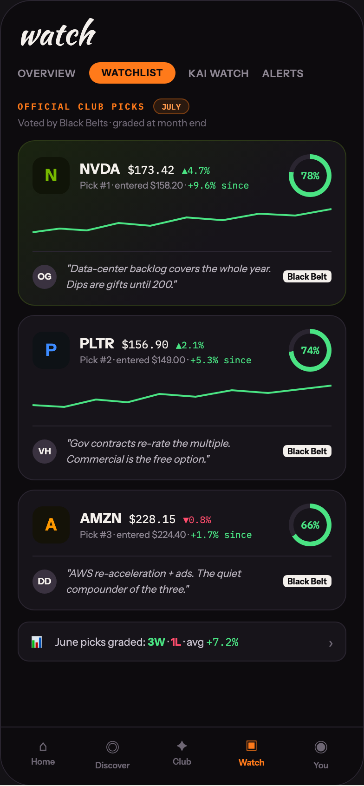

# 17 WATCHLIST · CLUB PICKS

Canvas: **CHEAT CODE · LOCKED BRAND · GLOW AT 40%** · board index 16 · slug `17-watchlist-club-picks`
Frame: **392×846px** (design width 392px — port at 390px logical, scale ratios).

> Style values are EXACT computed values from the canvas. `T.*` = canvas token, resolved in
> the Tokens appendix at the bottom of this file. Text marked `(MOCK)` must not ship as drawn —
> see `../../DELTA.md` for its substitution rule.

## Tree

- **“watch OVERVIEW WATCHLIST KAI WATCH ALERT…”** → `
`
  - box: 392x846 · display: flex · dir: column · width: 390px · height: 844px · bg: T.violet-900-b · border: 1px solid T.violet-800 · radius: 34px (T.r20) · overflow: hidden · type: color T.neutral-950 / Instrument Sans / 16px / w400 / lh normal
  - **“watch OVERVIEW WATCHLIST KAI WATCH ALERT…”** → `
`
    - box: 390x781 · flex: 1 1 0% · flex-grow: 1 · flex-basis: 0% · pad: 18px 18px 0px 18px · overflow: hidden
    - **"watch"** → `
`
      - box: 354x34 · type: color T.orange-50 / Kaushan Script / 34px / lh 34px · scale: T.ty2
      - text: "watch"
    - **“OVERVIEW WATCHLIST KAI WATCH ALERTS…”** → `
`
      - box: 354x23 · display: flex · align: center · gap: 14px · margin: 14px 0px 0px 0px
      - **"OVERVIEW"** → ``
        - box: 63x14 · type: color T.neutral-400 / 11px / w600 / ls 0.44px · scale: T.ty90
        - text: "OVERVIEW"
      - **"WATCHLIST"** → ``
        - box: 92.9x23 · pad: 5px 13px 5px 13px · bg: T.orange-400 · radius: 16px (T.r16) · type: color T.violet-900-b / 10.5px / w800 / ls 0.63px · scale: T.ty104
        - text: "WATCHLIST"
      - **"KAI WATCH"** → ``
        - box: 65.2x14 · type: color T.neutral-400 / 11px / w600 / ls 0.44px · scale: T.ty90
        - text: "KAI WATCH"
      - **"ALERTS"** → ``
        - box: 44.8x14 · type: color T.neutral-400 / 11px / w600 / ls 0.44px · scale: T.ty90
        - text: "ALERTS"
    - **“OFFICIAL CLUB PICKS JULY…”** → `
`
      - box: 354x17 · display: flex · align: center · gap: 9px · margin: 16px 0px 0px 0px
      - **"Official club picks"** → ``
        - box: 137.2x13 · type: color T.orange-400 / IBM Plex Mono / 9.5px / w600 / ls 1.52px / uppercase · scale: T.ty118
        - text: "Official club picks"
      - **"JULY"** → ``
        - box: 38.4x17 · pad: 2px 8px 2px 8px · bg: T.orange-400a12 · border: 1px solid T.orange-400a40 · radius: 10px (T.r11) · type: color T.orange-300 / IBM Plex Mono / 8.5px / w600 · scale: T.ty145
        - text: "JULY"
    - **"Voted by Black Belts · graded at month end"** → `
`
      - box: 354x13 · margin: 3px 0px 0px 0px · type: color T.neutral-500 / 10.5px · scale: T.ty100
      - text: "Voted by Black Belts · graded at month end"
    - **“N NVDA $173.42 ▲4.7% Pick #1 · entered $…”** → `
`
      - box: 354x178 · pad: 14px 15px 14px 15px · margin: 12px 0px 0px 0px · bg-image: linear-gradient(140deg, T.green-850-b 0%, T.violet-900 60%) · border: 1px solid T.lime-800 · radius: 18px (T.r17)
      - **“N NVDA $173.42 ▲4.7% Pick #1 · entered $…”** → `
`
        - box: 322x46 · display: flex · align: center · gap: 11px
        - **"N"** → `
`
          - box: 40x40 · display: grid · align: center · justify-items: center · grid-cols: 40px · grid-rows: 40px · width: 40px · height: 40px · flex: 0 0 auto · flex-shrink: 0 · bg: T.lime-900 · radius: 11px (T.r12) · type: color T.lime-600 / 18px / w800 · scale: T.ty30
          - text: "N"
        - **“NVDA $173.42 ▲4.7% Pick #1 · entered $15…”** → `
`
          - box: 214x34 · flex: 1 1 0% · flex-grow: 1 · flex-basis: 0%
          - **“NVDA $173.42 ▲4.7%…”** → `
`
            - box: 214x19 · display: flex · align: baseline · gap: 8px
            - **"NVDA"** → ``
              - box: 43.5x19 · type: color T.orange-50 / 15px / w800 · scale: T.ty43
              - text: "NVDA"
            - **"$173.42"** **(MOCK)** → ``
              - box: 50.4x15 · type: color T.orange-50 / IBM Plex Mono / 12px · scale: T.ty74
              - text: "$173.42"
            - **"▲4.7%"** **(MOCK)** → ``
              - box: 30x13 · type: color T.green-400 / IBM Plex Mono / 10px · scale: T.ty108
              - text: "▲4.7%"
          - **"Pick #1 · entered $158.20 ·"** **(MOCK)** → `
`
            - box: 214x13 · margin: 2px 0px 0px 0px · type: color T.neutral-400 / 10px · scale: T.ty109
            - text: "Pick #1 · entered $158.20 ·"
            - **"+9.6% since"** **(MOCK)** → ``
              - box: 66x13 · display: inline · type: color T.green-400 / IBM Plex Mono · scale: T.ty108
              - text: "+9.6% since"
        - **“78%…”** → `
`
          - box: 46x46 · display: grid · align: center · justify-items: center · grid-cols: 46px · grid-rows: 46px · width: 46px · height: 46px · flex: 0 0 auto · flex-shrink: 0 · bg-image: conic-gradient(T.green-400 0deg, T.green-400 78%, T.violet-800 78%, T.violet-800 100%) · radius: 50% (T.r21)
          - **"78%"** **(MOCK)** → `
`
            - box: 36x36 · display: grid · align: center · justify-items: center · grid-cols: 36px · grid-rows: 36px · width: 36px · height: 36px · bg: T.violet-900 · radius: 50% (T.r21) · type: color T.green-400 / IBM Plex Mono / 11px / w600 · scale: T.ty87
            - text: "78%"
      - **svg** → `<svg>`
        - box: 322x34 · display: inline · margin: 10px 0px 0px 0px · overflow: hidden
        - svg: `<svg data-dc-tpl="1402" width="100%" height="34" viewBox="0 0 330 34" preserveAspectRatio="none" style="margin-top: 10px;"><path data-dc-tpl="1403" d="M0 28 L30 24 L60 26 L95 18 L130 21 L170 12 L210 15 L250 8 L290 10 L330 3" fill="none" stroke="#4AE383" stroke-width="2"></path></svg>`
        - **block[0]** → `<path>`
          - box: 322x25 · display: inline
      - **“OG "Data-center backlog covers the whole…”** → `
`
        - box: 322x44 · display: flex · align: center · gap: 10px · pad: 10px 0px 0px 0px · margin: 10px 0px 0px 0px · border: T:1px solid T.violet-800 R:0px none T.neutral-950 B:0px none T.neutral-950 L:0px none T.neutral-950
        - **"OG"** → `
`
          - box: 26x26 · display: grid · align: center · justify-items: center · grid-cols: 26px · grid-rows: 26px · width: 26px · height: 26px · flex: 0 0 auto · flex-shrink: 0 · bg: T.violet-800-b · radius: 50% (T.r21) · type: color T.orange-50 / 9.5px / w700 · scale: T.ty121
          - text: "OG"
        - **"\"Data-center backlog covers the whole year. "** → `
`
          - box: 223.6x33 · flex: 1 1 0% · flex-grow: 1 · flex-basis: 0% · type: color T.neutral-200 / 11px / italic / lh 16.5px · scale: T.ty93
          - text: "\"Data-center backlog covers the whole year. Dips are gifts until 200.\""
        - **"Black Belt"** → ``
          - box: 52.4x13 · flex: 0 0 auto · flex-shrink: 0 · pad: 1px 5px 1px 5px · bg: T.orange-50 · radius: 4px (T.r5) · type: color T.violet-900-b / 9px / w700 · scale: T.ty129
          - text: "Black Belt"
    - **“P PLTR $156.90 ▲2.1% Pick #2 · entered $…”** → `
`
      - box: 354x178 · pad: 14px 15px 14px 15px · margin: 10px 0px 0px 0px · bg: T.violet-900 · border: 1px solid T.violet-800 · radius: 18px (T.r17)
      - **“P PLTR $156.90 ▲2.1% Pick #2 · entered $…”** → `
`
        - box: 322x46 · display: flex · align: center · gap: 11px
        - **"P"** → `
`
          - box: 40x40 · display: grid · align: center · justify-items: center · grid-cols: 40px · grid-rows: 40px · width: 40px · height: 40px · flex: 0 0 auto · flex-shrink: 0 · bg: T.blue-900 · radius: 11px (T.r12) · type: color T.blue-300-b / 18px / w800 · scale: T.ty30
          - text: "P"
        - **“PLTR $156.90 ▲2.1% Pick #2 · entered $14…”** → `
`
          - box: 214x34 · flex: 1 1 0% · flex-grow: 1 · flex-basis: 0%
          - **“PLTR $156.90 ▲2.1%…”** → `
`
            - box: 214x19 · display: flex · align: baseline · gap: 8px
            - **"PLTR"** → ``
              - box: 37x19 · type: color T.orange-50 / 15px / w800 · scale: T.ty43
              - text: "PLTR"
            - **"$156.90"** **(MOCK)** → ``
              - box: 50.4x15 · type: color T.orange-50 / IBM Plex Mono / 12px · scale: T.ty74
              - text: "$156.90"
            - **"▲2.1%"** **(MOCK)** → ``
              - box: 30x13 · type: color T.green-400 / IBM Plex Mono / 10px · scale: T.ty108
              - text: "▲2.1%"
          - **"Pick #2 · entered $149.00 ·"** **(MOCK)** → `
`
            - box: 214x13 · margin: 2px 0px 0px 0px · type: color T.neutral-400 / 10px · scale: T.ty109
            - text: "Pick #2 · entered $149.00 ·"
            - **"+5.3% since"** **(MOCK)** → ``
              - box: 66x13 · display: inline · type: color T.green-400 / IBM Plex Mono · scale: T.ty108
              - text: "+5.3% since"
        - **“74%…”** → `
`
          - box: 46x46 · display: grid · align: center · justify-items: center · grid-cols: 46px · grid-rows: 46px · width: 46px · height: 46px · flex: 0 0 auto · flex-shrink: 0 · bg-image: conic-gradient(T.green-400 0deg, T.green-400 74%, T.violet-800 74%, T.violet-800 100%) · radius: 50% (T.r21)
          - **"74%"** **(MOCK)** → `
`
            - box: 36x36 · display: grid · align: center · justify-items: center · grid-cols: 36px · grid-rows: 36px · width: 36px · height: 36px · bg: T.violet-900 · radius: 50% (T.r21) · type: color T.green-400 / IBM Plex Mono / 11px / w600 · scale: T.ty87
            - text: "74%"
      - **svg** → `<svg>`
        - box: 322x34 · display: inline · margin: 10px 0px 0px 0px · overflow: hidden
        - svg: `<svg data-dc-tpl="1420" width="100%" height="34" viewBox="0 0 330 34" preserveAspectRatio="none" style="margin-top: 10px;"><path data-dc-tpl="1421" d="M0 26 L35 28 L70 20 L105 23 L140 14 L180 17 L220 10 L260 13 L330 5" fill="none" stroke="#4AE383" stroke-width="2"></path></svg>`
        - **block[0]** → `<path>`
          - box: 322x23 · display: inline
      - **“VH "Gov contracts re-rate the multiple. …”** → `
`
        - box: 322x44 · display: flex · align: center · gap: 10px · pad: 10px 0px 0px 0px · margin: 10px 0px 0px 0px · border: T:1px solid T.violet-800 R:0px none T.neutral-950 B:0px none T.neutral-950 L:0px none T.neutral-950
        - **"VH"** → `
`
          - box: 26x26 · display: grid · align: center · justify-items: center · grid-cols: 26px · grid-rows: 26px · width: 26px · height: 26px · flex: 0 0 auto · flex-shrink: 0 · bg: T.violet-800-b · radius: 50% (T.r21) · type: color T.orange-50 / 9.5px / w700 · scale: T.ty121
          - text: "VH"
        - **"\"Gov contracts re-rate the multiple. Commerc"** → `
`
          - box: 223.6x33 · flex: 1 1 0% · flex-grow: 1 · flex-basis: 0% · type: color T.neutral-200 / 11px / italic / lh 16.5px · scale: T.ty93
          - text: "\"Gov contracts re-rate the multiple. Commercial is the free option.\""
        - **"Black Belt"** → ``
          - box: 52.4x13 · flex: 0 0 auto · flex-shrink: 0 · pad: 1px 5px 1px 5px · bg: T.orange-50 · radius: 4px (T.r5) · type: color T.violet-900-b / 9px / w700 · scale: T.ty129
          - text: "Black Belt"
    - **“A AMZN $228.15 ▼0.8% Pick #3 · entered $…”** → `
`
      - box: 354x130 · pad: 14px 15px 14px 15px · margin: 10px 0px 0px 0px · bg: T.violet-900 · border: 1px solid T.violet-800 · radius: 18px (T.r17)
      - **“A AMZN $228.15 ▼0.8% Pick #3 · entered $…”** → `
`
        - box: 322x46 · display: flex · align: center · gap: 11px
        - **"A"** → `
`
          - box: 40x40 · display: grid · align: center · justify-items: center · grid-cols: 40px · grid-rows: 40px · width: 40px · height: 40px · flex: 0 0 auto · flex-shrink: 0 · bg: T.amber-900 · radius: 11px (T.r12) · type: color T.orange-400-b / 18px / w800 · scale: T.ty30
          - text: "A"
        - **“AMZN $228.15 ▼0.8% Pick #3 · entered $22…”** → `
`
          - box: 214x34 · flex: 1 1 0% · flex-grow: 1 · flex-basis: 0%
          - **“AMZN $228.15 ▼0.8%…”** → `
`
            - box: 214x19 · display: flex · align: baseline · gap: 8px
            - **"AMZN"** → ``
              - box: 44.8x19 · type: color T.orange-50 / 15px / w800 · scale: T.ty43
              - text: "AMZN"
            - **"$228.15"** **(MOCK)** → ``
              - box: 50.4x15 · type: color T.orange-50 / IBM Plex Mono / 12px · scale: T.ty74
              - text: "$228.15"
            - **"▼0.8%"** **(MOCK)** → ``
              - box: 30x13 · type: color T.red-300 / IBM Plex Mono / 10px · scale: T.ty108
              - text: "▼0.8%"
          - **"Pick #3 · entered $224.40 ·"** **(MOCK)** → `
`
            - box: 214x13 · margin: 2px 0px 0px 0px · type: color T.neutral-400 / 10px · scale: T.ty109
            - text: "Pick #3 · entered $224.40 ·"
            - **"+1.7% since"** **(MOCK)** → ``
              - box: 66x13 · display: inline · type: color T.green-400 / IBM Plex Mono · scale: T.ty108
              - text: "+1.7% since"
        - **“66%…”** → `
`
          - box: 46x46 · display: grid · align: center · justify-items: center · grid-cols: 46px · grid-rows: 46px · width: 46px · height: 46px · flex: 0 0 auto · flex-shrink: 0 · bg-image: conic-gradient(T.green-400 0deg, T.green-400 66%, T.violet-800 66%, T.violet-800 100%) · radius: 50% (T.r21)
          - **"66%"** **(MOCK)** → `
`
            - box: 36x36 · display: grid · align: center · justify-items: center · grid-cols: 36px · grid-rows: 36px · width: 36px · height: 36px · bg: T.violet-900 · radius: 50% (T.r21) · type: color T.green-400 / IBM Plex Mono / 11px / w600 · scale: T.ty87
            - text: "66%"
      - **“DD "AWS re-acceleration + ads. The quiet…”** → `
`
        - box: 322x44 · display: flex · align: center · gap: 10px · pad: 10px 0px 0px 0px · margin: 10px 0px 0px 0px · border: T:1px solid T.violet-800 R:0px none T.neutral-950 B:0px none T.neutral-950 L:0px none T.neutral-950
        - **"DD"** → `
`
          - box: 26x26 · display: grid · align: center · justify-items: center · grid-cols: 26px · grid-rows: 26px · width: 26px · height: 26px · flex: 0 0 auto · flex-shrink: 0 · bg: T.violet-800-b · radius: 50% (T.r21) · type: color T.orange-50 / 9.5px / w700 · scale: T.ty121
          - text: "DD"
        - **"\"AWS re-acceleration + ads. The quiet compou"** → `
`
          - box: 223.6x33 · flex: 1 1 0% · flex-grow: 1 · flex-basis: 0% · type: color T.neutral-200 / 11px / italic / lh 16.5px · scale: T.ty93
          - text: "\"AWS re-acceleration + ads. The quiet compounder of the three.\""
        - **"Black Belt"** → ``
          - box: 52.4x13 · flex: 0 0 auto · flex-shrink: 0 · pad: 1px 5px 1px 5px · bg: T.orange-50 · radius: 4px (T.r5) · type: color T.violet-900-b / 9px / w700 · scale: T.ty129
          - text: "Black Belt"
    - **“📊 June picks graded: 3W · 1L · avg +7.2…”** → `
`
      - box: 354x43 · display: flex · align: center · gap: 10px · pad: 10px 13px 10px 13px · margin: 12px 0px 0px 0px · bg: T.violet-900 · border: 1px solid T.violet-800 · radius: 12px (T.r13)
      - **"📊"** → ``
        - box: 16x21 · type: 13px · scale: T.ty59
        - text: "📊"
      - **"June picks graded: · · avg"** → ``
        - box: 284.6x15 · flex: 1 1 0% · flex-grow: 1 · flex-basis: 0% · type: color T.violet-200 / 11.5px · scale: T.ty81
        - text: "June picks graded: · · avg"
        - **"3W"** → ``
          - box: 19.2x14 · display: inline · type: color T.green-400 / w700 · scale: T.ty82
          - text: "3W"
        - **"1L"** → ``
          - box: 11.2x14 · display: inline · type: color T.red-300 / w700 · scale: T.ty82
          - text: "1L"
        - **"+7.2%"** **(MOCK)** → ``
          - box: 34.5x15 · display: inline · type: color T.green-400 / IBM Plex Mono · scale: T.ty84
          - text: "+7.2%"
      - **"›"** → ``
        - box: 5.4x20 · type: color T.neutral-500 · scale: T.ty36
        - text: "›"
  - **“⌂ Home ◎ Discover ✦ Club ▣ Watch ◉ You…”** → `
`
    - box: 390x63 · display: flex · pad: 10px 8px 16px 8px · bg: T.violet-900-b · border: T:1px solid T.violet-800 R:0px none T.neutral-950 B:0px none T.neutral-950 L:0px none T.neutral-950
    - **“⌂ Home…”** → `
`
      - box: 74.8x36 · flex: 1 1 0% · flex-grow: 1 · flex-basis: 0% · type: align-center
      - **"⌂"** → `
`
        - box: 74.8x19 · type: color T.neutral-500 / 15px · scale: T.ty42
        - text: "⌂"
      - **"Home"** → `
`
        - box: 74.8x11 · margin: 2px 0px 0px 0px · type: color T.neutral-500 / 9px / w600 · scale: T.ty126
        - text: "Home"
    - **“◎ Discover…”** → `
`
      - box: 74.8x36 · flex: 1 1 0% · flex-grow: 1 · flex-basis: 0% · type: align-center
      - **"◎"** → `
`
        - box: 74.8x23 · type: color T.neutral-500 / 15px · scale: T.ty42
        - text: "◎"
      - **"Discover"** → `
`
        - box: 74.8x11 · margin: 2px 0px 0px 0px · type: color T.neutral-500 / 9px / w600 · scale: T.ty126
        - text: "Discover"
    - **“✦ Club…”** → `
`
      - box: 74.8x36 · flex: 1 1 0% · flex-grow: 1 · flex-basis: 0% · type: align-center
      - **"✦"** → `
`
        - box: 74.8x19 · type: color T.neutral-500 / 15px · scale: T.ty42
        - text: "✦"
      - **"Club"** → `
`
        - box: 74.8x11 · margin: 2px 0px 0px 0px · type: color T.neutral-500 / 9px / w600 · scale: T.ty126
        - text: "Club"
    - **“▣ Watch…”** → `
`
      - box: 74.8x36 · flex: 1 1 0% · flex-grow: 1 · flex-basis: 0% · type: align-center
      - **"▣"** → `
`
        - box: 74.8x20 · type: color T.orange-400 / 15px · scale: T.ty42
        - text: "▣"
      - **"Watch"** → `
`
        - box: 74.8x11 · margin: 2px 0px 0px 0px · type: color T.orange-400 / 9px / w700 · scale: T.ty129
        - text: "Watch"
    - **“◉ You…”** → `
`
      - box: 74.8x36 · flex: 1 1 0% · flex-grow: 1 · flex-basis: 0% · type: align-center
      - **"◉"** → `
`
        - box: 74.8x23 · type: color T.neutral-500 / 15px · scale: T.ty42
        - text: "◉"
      - **"You"** → `
`
        - box: 74.8x11 · margin: 2px 0px 0px 0px · type: color T.neutral-500 / 9px / w600 · scale: T.ty126
        - text: "You"

## Tokens used in this board

| token | value | role |
| --- | --- | --- |
| T.violet-800 | `#2A2530` | border, bg, gradient |
| T.orange-50 | `#F4F0EC` | text, bg, border |
| T.neutral-500 | `#6E6774` | text, bg |
| T.violet-900 | `#17141A` | bg, gradient, border |
| T.neutral-400 | `#8F8894` | text, border, bg |
| T.orange-400 | `#FF7A1A` | bg, text, border, gradient |
| T.violet-900-b | `#0D0B0E` | bg, text, border, gradient |
| T.neutral-950 | `#000000` | border, text |
| T.green-400 | `#4AE383` | text, gradient, border, bg |
| T.orange-300 | `#FF9A4D` | text |
| T.violet-200 | `#C8C2CE` | text |
| T.violet-800-b | `#3A3240` | bg, border |
| T.red-300 | `#FF4D6D` | text, gradient, bg, border |
| T.lime-600 | `#76B900` | text, gradient |
| T.lime-900 | `#101408` | bg, gradient |
| T.blue-300-b | `#3D8BFF` | text, border, bg |
| T.neutral-200 | `#B8B2BC` | text |
| T.blue-900 | `#0E1216` | bg |
| T.orange-400a12 | `#FF7A1A/0.12` | bg, shadow |
| T.amber-900 | `#141208` | bg |
| T.orange-400-b | `#FF9900` | text |
| T.lime-800 | `#2E3A18` | border |
| T.green-850-b | `#1A2410` | gradient |
| T.orange-400a40 | `#FF7A1A/0.4` | border |
| T.ty2 | Kaushan Script 34px/34px w400 ls:normal | type scale |
| T.ty30 | Instrument Sans 18px/normal w800 ls:normal | type scale |
| T.ty36 | Instrument Sans 16px/normal w400 ls:normal | type scale |
| T.ty42 | Instrument Sans 15px/normal w400 ls:normal | type scale |
| T.ty43 | Instrument Sans 15px/normal w800 ls:normal | type scale |
| T.ty59 | Instrument Sans 13px/normal w400 ls:normal | type scale |
| T.ty74 | IBM Plex Mono 12px/normal w400 ls:normal | type scale |
| T.ty81 | Instrument Sans 11.5px/normal w400 ls:normal | type scale |
| T.ty82 | Instrument Sans 11.5px/normal w700 ls:normal | type scale |
| T.ty84 | IBM Plex Mono 11.5px/normal w400 ls:normal | type scale |
| T.ty87 | IBM Plex Mono 11px/normal w600 ls:normal | type scale |
| T.ty90 | Instrument Sans 11px/normal w600 ls:0.44px | type scale |
| T.ty93 | Instrument Sans 11px/16.5px w400 ls:normal | type scale |
| T.ty100 | Instrument Sans 10.5px/normal w400 ls:normal | type scale |
| T.ty104 | Instrument Sans 10.5px/normal w800 ls:0.63px | type scale |
| T.ty108 | IBM Plex Mono 10px/normal w400 ls:normal | type scale |
| T.ty109 | Instrument Sans 10px/normal w400 ls:normal | type scale |
| T.ty118 | IBM Plex Mono 9.5px/normal w600 ls:1.52px uppercase | type scale |
| T.ty121 | Instrument Sans 9.5px/normal w700 ls:normal | type scale |
| T.ty126 | Instrument Sans 9px/normal w600 ls:normal | type scale |
| T.ty129 | Instrument Sans 9px/normal w700 ls:normal | type scale |
| T.ty145 | IBM Plex Mono 8.5px/normal w600 ls:normal | type scale |
| T.r5 | `4px` | radius |
| T.r11 | `10px` | radius |
| T.r12 | `11px` | radius |
| T.r13 | `12px` | radius |
| T.r16 | `16px` | radius |
| T.r17 | `18px` | radius |
| T.r20 | `34px` | radius |
| T.r21 | `50%` | radius |
