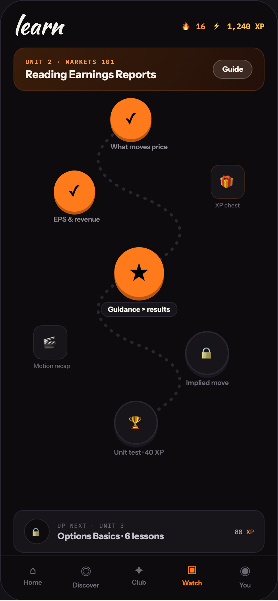

# 20 LEARN · PATH

Canvas: **CHEAT CODE · LOCKED BRAND · GLOW AT 40%** · board index 19 · slug `20-learn-path`
Frame: **392×846px** (design width 392px — port at 390px logical, scale ratios).

> Style values are EXACT computed values from the canvas. `T.*` = canvas token, resolved in
> the Tokens appendix at the bottom of this file. Text marked `(MOCK)` must not ship as drawn —
> see `../../DELTA.md` for its substitution rule.

## Tree

- **“learn 🔥 16 ⚡ 1,240 XP UNIT 2 · MARKETS …”** → `
`
  - box: 392x846 · display: flex · dir: column · width: 390px · height: 844px · bg: T.violet-900-b · border: 1px solid T.violet-800 · radius: 34px (T.r20) · overflow: hidden · type: color T.neutral-950 / Instrument Sans / 16px / w400 / lh normal
  - **“learn 🔥 16 ⚡ 1,240 XP UNIT 2 · MARKETS …”** → `
`
    - box: 390x781 · flex: 1 1 0% · flex-grow: 1 · flex-basis: 0% · pad: 18px 18px 0px 18px · overflow: hidden · position: relative [0px 0px 0px 0px]
    - **“learn 🔥 16 ⚡ 1,240 XP…”** → `
`
      - box: 354x34 · display: flex · align: center · justify: space-between
      - **"learn"** → `
`
        - box: 69.7x34 · type: color T.orange-50 / Kaushan Script / 34px / lh 34px · scale: T.ty2
        - text: "learn"
      - **“🔥 16 ⚡ 1,240 XP…”** → `
`
        - box: 117.2x18 · display: flex · align: center · gap: 10px
        - **"🔥 16"** → ``
          - box: 33.8x18 · type: color T.orange-300 / IBM Plex Mono / 11px / w600 · scale: T.ty87
          - text: "🔥 16"
        - **"⚡ 1,240 XP"** **(MOCK)** → ``
          - box: 73.4x18 · type: color T.orange-300-b / IBM Plex Mono / 11px / w600 · scale: T.ty87
          - text: "⚡ 1,240 XP"
    - **“UNIT 2 · MARKETS 101 Reading Earnings Re…”** → `
`
      - box: 354x61 · display: flex · align: center · gap: 12px · pad: 13px 16px 13px 16px · margin: 14px 0px 0px 0px · bg-image: linear-gradient(120deg, T.orange-850 0%, T.orange-900 100%) · border: 1px solid T.orange-800-b · radius: 16px (T.r16)
      - **“UNIT 2 · MARKETS 101 Reading Earnings Re…”** → `
`
        - box: 252.5x33 · flex: 1 1 0% · flex-grow: 1 · flex-basis: 0%
        - **"Unit 2 · Markets 101"** → `
`
          - box: 252.5x11 · type: color T.orange-300 / IBM Plex Mono / 8.5px / w600 / ls 1.19px / uppercase · scale: T.ty140
          - text: "Unit 2 · Markets 101"
        - **"Reading Earnings Reports"** → `
`
          - box: 252.5x19 · margin: 3px 0px 0px 0px · type: color T.orange-50 / 15px / w800 · scale: T.ty43
          - text: "Reading Earnings Reports"
      - **"Guide"** → ``
        - box: 55.5x27 · pad: 6px 12px 6px 12px · bg: T.neutral-0a10 · border: 1px solid T.neutral-0a20 · radius: 14px (T.r15) · type: color T.orange-50 / 10.5px / w700 · scale: T.ty103
        - text: "Guide"
    - **“✓ What moves price ✓ EPS & revenue ★ Gui…”** → `
`
      - box: 354x642 · height: 642px · margin: 8px 0px 0px 0px · position: relative [0px 0px 0px 0px]
      - **svg** → `<svg>`
        - box: 354x520 · overflow: hidden · position: absolute [0px 0px 0px 0px]
        - svg: `<svg data-dc-tpl="1626" width="100%" height="520" viewBox="0 0 354 520" preserveAspectRatio="none" style="position: absolute; inset: 0px;">
              <path data-dc-tpl="1627" d="M177 30 C 100 70, 100 110, 177 140 C 254 170, 254 210, 177 245 C 100 280, 100 320, 177 350 C 254 380, 254 420, 177 455`
        - **block[0]** → `<path>`
          - box: 115.5x425 · display: inline
      - **“✓ What moves price…”** → `
`
        - box: 80.8x74 · transform: matrix(1, 0, 0, 1, -40.4062, 0) · position: absolute [2px 96.1875px 566px 177px] · type: align-center
        - **"✓"** → `
`
          - box: 58x58 · display: grid · align: center · justify-items: center · grid-cols: 58px · grid-rows: 58px · width: 58px · height: 58px · bg: T.orange-400 · radius: 50% (T.r21) · shadow: T.orange-600 0px 4px 0px 0px · type: 22px · scale: T.ty20
          - text: "✓"
        - **"What moves price"** → `
`
          - box: 80.8x11 · margin: 5px 0px 0px 0px · type: color T.neutral-400 / 9.5px / w600 · scale: T.ty120
          - text: "What moves price"
      - **“✓ EPS & revenue…”** → `
`
        - box: 65.3x74 · position: absolute [104px 232.062px 464px 56.625px] · type: align-center
        - **"✓"** → `
`
          - box: 58x58 · display: grid · align: center · justify-items: center · grid-cols: 58px · grid-rows: 58px · width: 58px · height: 58px · bg: T.orange-400 · radius: 50% (T.r21) · shadow: T.orange-600 0px 4px 0px 0px · type: 22px · scale: T.ty20
          - text: "✓"
        - **"EPS & revenue"** → `
`
          - box: 65.3x11 · margin: 5px 0px 0px 0px · type: color T.neutral-400 / 9.5px / w600 · scale: T.ty120
          - text: "EPS & revenue"
      - **“★ Guidance > results…”** → `
`
        - box: 107.7x98 · transform: matrix(1, 0, 0, 1, -53.8359, 0) · position: absolute [212px 69.3281px 332px 177px] · type: align-center
        - **“★…”** → `
`
          - box: 70x70 · width: 70px · height: 70px · margin: 0px 18.8438px 0px 18.8281px · position: relative [0px 0px 0px 0px]
          - **block[0]** → ``
            - box: 195.9x195.9 · border: 2px solid T.orange-400a50 · radius: 50% (T.r21) · opacity: 0.0241822 · transform: matrix(2.33229, 0, 0, 2.33229, 0, 0) · position: absolute [-7px -7px -7px -7px]
          - **"★"** → `
`
            - box: 70x70 · display: grid · align: center · justify-items: center · grid-cols: 70px · grid-rows: 70px · bg: T.orange-400 · radius: 50% (T.r21) · shadow: T.orange-600 0px 5px 0px 0px · position: absolute [0px 0px 0px 0px] · type: 26px · scale: T.ty9
            - text: "★"
        - **"Guidance > results"** → `
`
          - box: 107.7x21 · display: inline-block · pad: 3px 9px 3px 9px · margin: 7px 0px 0px 0px · bg: T.violet-900 · border: 1px solid T.violet-800 · radius: 10px (T.r11) · type: color T.orange-50 / 10px / w700 · scale: T.ty111
          - text: "Guidance > results"
      - **“🔒 Implied move…”** → `
`
        - box: 62x78 · position: absolute [330px 49.5469px 234px 242.453px] · type: align-center
        - **"🔒"** → `
`
          - box: 62x62 · display: grid · align: center · justify-items: center · grid-cols: 58px · grid-rows: 58px · width: 58px · height: 58px · bg: T.violet-900 · border: 2px solid T.violet-800 · radius: 50% (T.r21) · shadow: T.violet-850-c 0px 4px 0px 0px · type: color T.neutral-500 / 18px · scale: T.ty29
          - text: "🔒"
        - **"Implied move"** → `
`
          - box: 62x11 · margin: 5px 0px 0px 0px · type: color T.neutral-500 / 9.5px / w600 · scale: T.ty120
          - text: "Implied move"
      - **“🏆 Unit test · 40 XP…”** → `
`
        - box: 70.5x78 · transform: matrix(1, 0, 0, 1, -35.2422, 0) · position: absolute [428px 106.516px 136px 177px] · type: align-center
        - **"🏆"** → `
`
          - box: 62x62 · display: grid · align: center · justify-items: center · grid-cols: 58px · grid-rows: 58px · width: 58px · height: 58px · bg: T.violet-900 · border: 2px solid T.violet-800 · radius: 50% (T.r21) · shadow: T.violet-850-c 0px 4px 0px 0px · type: 18px · scale: T.ty29
          - text: "🏆"
        - **"Unit test · 40 XP"** → `
`
          - box: 70.5x11 · margin: 5px 0px 0px 0px · type: color T.neutral-500 / 9.5px / w600 · scale: T.ty120
          - text: "Unit test · 40 XP"
      - **“🎁 XP chest…”** → `
`
        - box: 48x62 · position: absolute [96px 28.3125px 484px 277.688px] · type: align-center
        - **"🎁"** → `
`
          - box: 48x48 · display: grid · align: center · justify-items: center · grid-cols: 46px · grid-rows: 46px · width: 46px · height: 46px · bg: T.violet-900 · border: 1px solid T.orange-800 · radius: 12px (T.r13) · type: 18px · scale: T.ty29
          - text: "🎁"
        - **"XP chest"** → `
`
          - box: 48x10 · margin: 4px 0px 0px 0px · type: color T.neutral-500 / 8.5px · scale: T.ty141
          - text: "XP chest"
      - **“🎬 Motion recap…”** → `
`
        - box: 51.6x62 · position: absolute [322px 274.047px 258px 28.3125px] · type: align-center
        - **"🎬"** → `
`
          - box: 48x48 · display: grid · align: center · justify-items: center · grid-cols: 46px · grid-rows: 46px · width: 46px · height: 46px · bg: T.violet-900 · border: 1px solid T.violet-800 · radius: 12px (T.r13) · type: 18px · scale: T.ty29
          - text: "🎬"
        - **"Motion recap"** → `
`
          - box: 51.6x10 · margin: 4px 0px 0px 0px · type: color T.neutral-500 / 8.5px · scale: T.ty141
          - text: "Motion recap"
      - **“🔒 UP NEXT · UNIT 3 Options Basics · 6 l…”** → `
`
        - box: 354x60 · display: flex · align: center · gap: 11px · pad: 11px 14px 11px 14px · bg: T.violet-900 · border: 1px solid T.violet-800 · radius: 14px (T.r15) · position: absolute [582px 0px 0px 0px]
        - **"🔒"** → ``
          - box: 36x36 · display: grid · align: center · justify-items: center · grid-cols: 34px · grid-rows: 34px · width: 34px · height: 34px · flex: 0 0 auto · flex-shrink: 0 · bg: T.violet-900-b · border: 1px solid T.violet-800 · radius: 50% (T.r21) · type: color T.neutral-500 / 13px · scale: T.ty59
          - text: "🔒"
        - **“UP NEXT · UNIT 3 Options Basics · 6 less…”** → `
`
          - box: 239x27 · flex: 1 1 0% · flex-grow: 1 · flex-basis: 0%
          - **"Up next · Unit 3"** → `
`
            - box: 239x10 · type: color T.neutral-500 / IBM Plex Mono / 8px / ls 1.12px / uppercase · scale: T.ty152
            - text: "Up next · Unit 3"
          - **"Options Basics · 6 lessons"** → `
`
            - box: 239x15 · margin: 2px 0px 0px 0px · type: color T.violet-200 / 12.5px / w700 · scale: T.ty65
            - text: "Options Basics · 6 lessons"
        - **"80 XP"** → ``
          - box: 27x11 · type: color T.orange-300 / IBM Plex Mono / 9px · scale: T.ty127
          - text: "80 XP"
  - **“⌂ Home ◎ Discover ✦ Club ▣ Watch ◉ You…”** → `
`
    - box: 390x63 · display: flex · pad: 10px 8px 16px 8px · bg: T.violet-900-b · border: T:1px solid T.violet-800 R:0px none T.neutral-950 B:0px none T.neutral-950 L:0px none T.neutral-950
    - **“⌂ Home…”** → `
`
      - box: 74.8x36 · flex: 1 1 0% · flex-grow: 1 · flex-basis: 0% · type: align-center
      - **"⌂"** → `
`
        - box: 74.8x19 · type: color T.neutral-500 / 15px · scale: T.ty42
        - text: "⌂"
      - **"Home"** → `
`
        - box: 74.8x11 · margin: 2px 0px 0px 0px · type: color T.neutral-500 / 9px / w600 · scale: T.ty126
        - text: "Home"
    - **“◎ Discover…”** → `
`
      - box: 74.8x36 · flex: 1 1 0% · flex-grow: 1 · flex-basis: 0% · type: align-center
      - **"◎"** → `
`
        - box: 74.8x23 · type: color T.neutral-500 / 15px · scale: T.ty42
        - text: "◎"
      - **"Discover"** → `
`
        - box: 74.8x11 · margin: 2px 0px 0px 0px · type: color T.neutral-500 / 9px / w600 · scale: T.ty126
        - text: "Discover"
    - **“✦ Club…”** → `
`
      - box: 74.8x36 · flex: 1 1 0% · flex-grow: 1 · flex-basis: 0% · type: align-center
      - **"✦"** → `
`
        - box: 74.8x19 · type: color T.neutral-500 / 15px · scale: T.ty42
        - text: "✦"
      - **"Club"** → `
`
        - box: 74.8x11 · margin: 2px 0px 0px 0px · type: color T.neutral-500 / 9px / w600 · scale: T.ty126
        - text: "Club"
    - **“▣ Watch…”** → `
`
      - box: 74.8x36 · flex: 1 1 0% · flex-grow: 1 · flex-basis: 0% · type: align-center
      - **"▣"** → `
`
        - box: 74.8x20 · type: color T.orange-400 / 15px · scale: T.ty42
        - text: "▣"
      - **"Watch"** → `
`
        - box: 74.8x11 · margin: 2px 0px 0px 0px · type: color T.orange-400 / 9px / w700 · scale: T.ty129
        - text: "Watch"
    - **“◉ You…”** → `
`
      - box: 74.8x36 · flex: 1 1 0% · flex-grow: 1 · flex-basis: 0% · type: align-center
      - **"◉"** → `
`
        - box: 74.8x23 · type: color T.neutral-500 / 15px · scale: T.ty42
        - text: "◉"
      - **"You"** → `
`
        - box: 74.8x11 · margin: 2px 0px 0px 0px · type: color T.neutral-500 / 9px / w600 · scale: T.ty126
        - text: "You"

## Tokens used in this board

| token | value | role |
| --- | --- | --- |
| T.violet-800 | `#2A2530` | border, bg, gradient |
| T.orange-50 | `#F4F0EC` | text, bg, border |
| T.neutral-500 | `#6E6774` | text, bg |
| T.violet-900 | `#17141A` | bg, gradient, border |
| T.neutral-400 | `#8F8894` | text, border, bg |
| T.orange-400 | `#FF7A1A` | bg, text, border, gradient |
| T.violet-900-b | `#0D0B0E` | bg, text, border, gradient |
| T.neutral-950 | `#000000` | border, text |
| T.orange-300 | `#FF9A4D` | text |
| T.violet-200 | `#C8C2CE` | text |
| T.orange-300-b | `#FFC24B` | text, gradient, border, bg |
| T.orange-800 | `#3A2418` | border, bg |
| T.orange-900 | `#241009` | gradient |
| T.orange-600 | `#B85812` | gradient, shadow |
| T.orange-400a50 | `#FF7A1A/0.5` | border |
| T.orange-850 | `#3A1D0A` | gradient |
| T.violet-850-c | `#1A171E` | shadow |
| T.orange-800-b | `#4A2A12` | border |
| T.neutral-0a10 | `#FFFFFF/0.1` | bg |
| T.neutral-0a20 | `#FFFFFF/0.2` | border |
| T.ty2 | Kaushan Script 34px/34px w400 ls:normal | type scale |
| T.ty9 | Instrument Sans 26px/normal w400 ls:normal | type scale |
| T.ty20 | Instrument Sans 22px/normal w400 ls:normal | type scale |
| T.ty29 | Instrument Sans 18px/normal w400 ls:normal | type scale |
| T.ty42 | Instrument Sans 15px/normal w400 ls:normal | type scale |
| T.ty43 | Instrument Sans 15px/normal w800 ls:normal | type scale |
| T.ty59 | Instrument Sans 13px/normal w400 ls:normal | type scale |
| T.ty65 | Instrument Sans 12.5px/normal w700 ls:normal | type scale |
| T.ty87 | IBM Plex Mono 11px/normal w600 ls:normal | type scale |
| T.ty103 | Instrument Sans 10.5px/normal w700 ls:normal | type scale |
| T.ty111 | Instrument Sans 10px/normal w700 ls:normal | type scale |
| T.ty120 | Instrument Sans 9.5px/normal w600 ls:normal | type scale |
| T.ty126 | Instrument Sans 9px/normal w600 ls:normal | type scale |
| T.ty127 | IBM Plex Mono 9px/normal w400 ls:normal | type scale |
| T.ty129 | Instrument Sans 9px/normal w700 ls:normal | type scale |
| T.ty140 | IBM Plex Mono 8.5px/normal w600 ls:1.19px uppercase | type scale |
| T.ty141 | Instrument Sans 8.5px/normal w400 ls:normal | type scale |
| T.ty152 | IBM Plex Mono 8px/normal w400 ls:1.12px uppercase | type scale |
| T.r11 | `10px` | radius |
| T.r13 | `12px` | radius |
| T.r15 | `14px` | radius |
| T.r16 | `16px` | radius |
| T.r20 | `34px` | radius |
| T.r21 | `50%` | radius |
