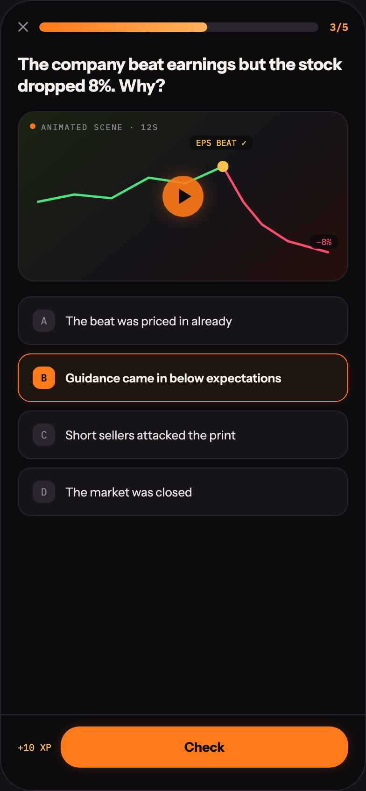

# 21 LEARN · MICRO LESSON

Canvas: **CHEAT CODE · LOCKED BRAND · GLOW AT 40%** · board index 20 · slug `21-learn-micro-lesson`
Frame: **392×846px** (design width 392px — port at 390px logical, scale ratios).

> Style values are EXACT computed values from the canvas. `T.*` = canvas token, resolved in
> the Tokens appendix at the bottom of this file. Text marked `(MOCK)` must not ship as drawn —
> see `../../DELTA.md` for its substitution rule.

## Tree

- **“✕ 3/5 The company beat earnings but the …”** → `
`
  - box: 392x846 · display: flex · dir: column · width: 390px · height: 844px · bg: T.violet-900-b · border: 1px solid T.violet-800 · radius: 34px (T.r20) · overflow: hidden · type: color T.neutral-950 / Instrument Sans / 16px / w400 / lh normal
  - **“✕ 3/5 The company beat earnings but the …”** → `
`
    - box: 390x763 · flex: 1 1 0% · flex-grow: 1 · flex-basis: 0% · pad: 18px 18px 0px 18px · overflow: hidden
    - **“✕ 3/5…”** → `
`
      - box: 354x19 · display: flex · align: center · gap: 12px
      - **"✕"** → ``
        - box: 11.4x19 · type: color T.neutral-400 / 15px · scale: T.ty42
        - text: "✕"
      - **block[1]** → `
`
        - box: 298.8x10 · height: 10px · flex: 1 1 0% · flex-grow: 1 · flex-basis: 0% · bg: T.violet-800 · radius: 5px (T.r6) · overflow: hidden
        - **block[0]** → `
`
          - box: 179.3x10 · width: 60% · height: 100% · bg-image: linear-gradient(90deg, T.orange-400, T.orange-300-c) · radius: 5px (T.r6)
      - **"3/5"** → ``
        - box: 19.8x14 · type: color T.orange-300 / IBM Plex Mono / 11px / w600 · scale: T.ty87
        - text: "3/5"
    - **"The company beat earnings but the stock drop"** **(MOCK)** → `
`
      - box: 354x46.8 · margin: 20px 0px 0px 0px · type: color T.orange-50 / 18px / w800 / ls -0.18px / lh 23.4px · scale: T.ty32
      - text: "The company beat earnings but the stock dropped 8%. Why?"
    - **“ANIMATED SCENE · 12S EPS BEAT ✓ −8%…”** → `
`
      - box: 354x182 · height: 180px · margin: 14px 0px 0px 0px · bg-image: linear-gradient(140deg, T.green-850-b 0%, T.violet-900 55%, T.orange-900 100%) · border: 1px solid T.violet-800 · radius: 18px (T.r17) · overflow: hidden · position: relative [0px 0px 0px 0px]
      - **“ANIMATED SCENE · 12S…”** → `
`
        - box: 137.8x11 · display: flex · align: center · gap: 6px · position: absolute [10px 202.188px 159px 12px]
        - **block[0]** → ``
          - box: 6x6 · width: 6px · height: 6px · bg: T.orange-400 · radius: 50% (T.r21)
        - **"Animated scene · 12s"** → ``
          - box: 125.8x11 · type: color T.neutral-400 / IBM Plex Mono / 8.5px / ls 1.19px / uppercase · scale: T.ty146
          - text: "Animated scene · 12s"
      - **svg** → `<svg>`
        - box: 352x180 · display: inline · overflow: hidden
        - svg: `<svg data-dc-tpl="1689" width="100%" height="100%" viewBox="0 0 354 180" preserveAspectRatio="none">
              <path data-dc-tpl="1690" d="M20 96 L60 88 L100 92 L140 70 L180 76 L220 58" fill="none" stroke="#4AE383" stroke-width="2.5"></path>
              <path data-dc-tpl="1691" d="M220 58 L242`
        - **block[0]** → `<path>`
          - box: 198.9x38 · display: inline
        - **block[1]** → `<path>`
          - box: 113.4x92 · display: inline
        - **block[2]** → `<circle>`
          - box: 11.9x12 · display: inline
      - **"EPS BEAT ✓"** → ``
        - box: 68x15 · pad: 2px 7px 2px 7px · bg: T.violet-900a80 · radius: 6px (T.r7) · position: absolute [25.1875px 100.938px 139.812px 183.031px] · type: color T.orange-300-b / IBM Plex Mono / 9px · scale: T.ty127
        - text: "EPS BEAT ✓"
      - **"−8%"** **(MOCK)** → ``
        - box: 30.2x15 · pad: 2px 7px 2px 7px · bg: T.violet-900a80 · radius: 6px (T.r7) · position: absolute [131px 10px 34px 311.797px] · type: color T.red-300 / IBM Plex Mono / 9px · scale: T.ty127
        - text: "−8%"
      - **block[4]** → `
`
        - box: 44x44 · display: grid · align: center · justify-items: center · grid-cols: 44px · grid-rows: 44px · width: 44px · height: 44px · bg: T.orange-400a90 · radius: 50% (T.r21) · shadow: T.orange-400a35 0px 0px 18px 0px · transform: matrix(1, 0, 0, 1, -22, -22) · position: absolute [90px 132px 46px 176px]
        - **block[0]** → `
`
          - box: 13x16 · width: 0px · height: 0px · margin: 0px 0px 0px 4px · border: T:8px solid T.neutral-950a00 R:0px none T.neutral-950 B:8px solid T.neutral-950a00 L:13px solid T.violet-900-b
    - **“A The beat was priced in already B Guida…”** → `
`
      - box: 354x235 · display: flex · dir: column · gap: 9px · margin: 16px 0px 0px 0px
      - **“A The beat was priced in already…”** → `
`
        - box: 354x52 · display: flex · align: center · gap: 11px · pad: 13px 15px 13px 15px · bg: T.violet-900 · border: 1px solid T.violet-800 · radius: 14px (T.r15)
        - **"A"** → ``
          - box: 24x24 · display: grid · align: center · justify-items: center · grid-cols: 24px · grid-rows: 24px · width: 24px · height: 24px · flex: 0 0 auto · flex-shrink: 0 · bg: T.violet-800 · radius: 8px (T.r9) · type: color T.neutral-400 / IBM Plex Mono / 11px · scale: T.ty89
          - text: "A"
        - **"The beat was priced in already"** → ``
          - box: 178.6x16 · type: color T.pink-100 / 13px · scale: T.ty59
          - text: "The beat was priced in already"
      - **“B Guidance came in below expectations…”** → `
`
        - box: 354x52 · display: flex · align: center · gap: 11px · pad: 13px 15px 13px 15px · bg: T.orange-400a08 · border: 1px solid T.orange-400 · radius: 14px (T.r15) · shadow: T.orange-400a12 0px 0px 10px 0px
        - **"B"** → ``
          - box: 24x24 · display: grid · align: center · justify-items: center · grid-cols: 24px · grid-rows: 24px · width: 24px · height: 24px · flex: 0 0 auto · flex-shrink: 0 · bg: T.orange-400 · radius: 8px (T.r9) · type: color T.violet-900-b / IBM Plex Mono / 11px / w700 · scale: T.ty96
          - text: "B"
        - **"Guidance came in below expectations"** → ``
          - box: 231.1x16 · type: color T.orange-50 / 13px / w600 · scale: T.ty64
          - text: "Guidance came in below expectations"
      - **“C Short sellers attacked the print…”** → `
`
        - box: 354x52 · display: flex · align: center · gap: 11px · pad: 13px 15px 13px 15px · bg: T.violet-900 · border: 1px solid T.violet-800 · radius: 14px (T.r15)
        - **"C"** → ``
          - box: 24x24 · display: grid · align: center · justify-items: center · grid-cols: 24px · grid-rows: 24px · width: 24px · height: 24px · flex: 0 0 auto · flex-shrink: 0 · bg: T.violet-800 · radius: 8px (T.r9) · type: color T.neutral-400 / IBM Plex Mono / 11px · scale: T.ty89
          - text: "C"
        - **"Short sellers attacked the print"** → ``
          - box: 182.4x16 · type: color T.pink-100 / 13px · scale: T.ty59
          - text: "Short sellers attacked the print"
      - **“D The market was closed…”** → `
`
        - box: 354x52 · display: flex · align: center · gap: 11px · pad: 13px 15px 13px 15px · bg: T.violet-900 · border: 1px solid T.violet-800 · radius: 14px (T.r15)
        - **"D"** → ``
          - box: 24x24 · display: grid · align: center · justify-items: center · grid-cols: 24px · grid-rows: 24px · width: 24px · height: 24px · flex: 0 0 auto · flex-shrink: 0 · bg: T.violet-800 · radius: 8px (T.r9) · type: color T.neutral-400 / IBM Plex Mono / 11px · scale: T.ty89
          - text: "D"
        - **"The market was closed"** → ``
          - box: 135.9x16 · type: color T.pink-100 / 13px · scale: T.ty59
          - text: "The market was closed"
  - **“+10 XP Check…”** → `
`
    - box: 390x81 · pad: 12px 18px 24px 18px · border: T:1px solid T.violet-800 R:0px none T.neutral-950 B:0px none T.neutral-950 L:0px none T.neutral-950
    - **“+10 XP Check…”** → `
`
      - box: 354x44 · display: flex · align: center · gap: 10px
      - **"+10 XP"** **(MOCK)** → ``
        - box: 36x13 · flex: 0 0 auto · flex-shrink: 0 · type: color T.orange-300-b / IBM Plex Mono / 10px · scale: T.ty108
        - text: "+10 XP"
      - **"Check"** → `
`
        - box: 308x44 · flex: 1 1 0% · flex-grow: 1 · flex-basis: 0% · pad: 13px 0px 13px 0px · bg: T.orange-400 · radius: 20px (T.r18) · shadow: T.orange-400a20 0px 0px 12px 0px · type: color T.violet-900-b / 14px / w800 / align-center · scale: T.ty51
        - text: "Check"

## Tokens used in this board

| token | value | role |
| --- | --- | --- |
| T.violet-800 | `#2A2530` | border, bg, gradient |
| T.orange-50 | `#F4F0EC` | text, bg, border |
| T.violet-900 | `#17141A` | bg, gradient, border |
| T.neutral-400 | `#8F8894` | text, border, bg |
| T.orange-400 | `#FF7A1A` | bg, text, border, gradient |
| T.violet-900-b | `#0D0B0E` | bg, text, border, gradient |
| T.neutral-950 | `#000000` | border, text |
| T.orange-300 | `#FF9A4D` | text |
| T.red-300 | `#FF4D6D` | text, gradient, bg, border |
| T.orange-300-b | `#FFC24B` | text, gradient, border, bg |
| T.pink-100 | `#E8E2E4` | text |
| T.neutral-950a00 | `#000000/0` | border, gradient |
| T.orange-900 | `#241009` | gradient |
| T.orange-300-c | `#FFB25E` | gradient |
| T.orange-400a12 | `#FF7A1A/0.12` | bg, shadow |
| T.orange-400a20 | `#FF7A1A/0.2` | shadow |
| T.orange-400a35 | `#FF7A1A/0.35` | border, shadow |
| T.green-850-b | `#1A2410` | gradient |
| T.violet-900a80 | `#0D0B0E/0.8` | bg |
| T.orange-400a90 | `#FF7A1A/0.9` | bg |
| T.orange-400a08 | `#FF7A1A/0.08` | bg |
| T.ty32 | Instrument Sans 18px/23.4px w800 ls:-0.18px | type scale |
| T.ty42 | Instrument Sans 15px/normal w400 ls:normal | type scale |
| T.ty51 | Instrument Sans 14px/normal w800 ls:normal | type scale |
| T.ty59 | Instrument Sans 13px/normal w400 ls:normal | type scale |
| T.ty64 | Instrument Sans 13px/normal w600 ls:normal | type scale |
| T.ty87 | IBM Plex Mono 11px/normal w600 ls:normal | type scale |
| T.ty89 | IBM Plex Mono 11px/normal w400 ls:normal | type scale |
| T.ty96 | IBM Plex Mono 11px/normal w700 ls:normal | type scale |
| T.ty108 | IBM Plex Mono 10px/normal w400 ls:normal | type scale |
| T.ty127 | IBM Plex Mono 9px/normal w400 ls:normal | type scale |
| T.ty146 | IBM Plex Mono 8.5px/normal w400 ls:1.19px uppercase | type scale |
| T.r6 | `5px` | radius |
| T.r7 | `6px` | radius |
| T.r9 | `8px` | radius |
| T.r15 | `14px` | radius |
| T.r17 | `18px` | radius |
| T.r18 | `20px` | radius |
| T.r20 | `34px` | radius |
| T.r21 | `50%` | radius |
