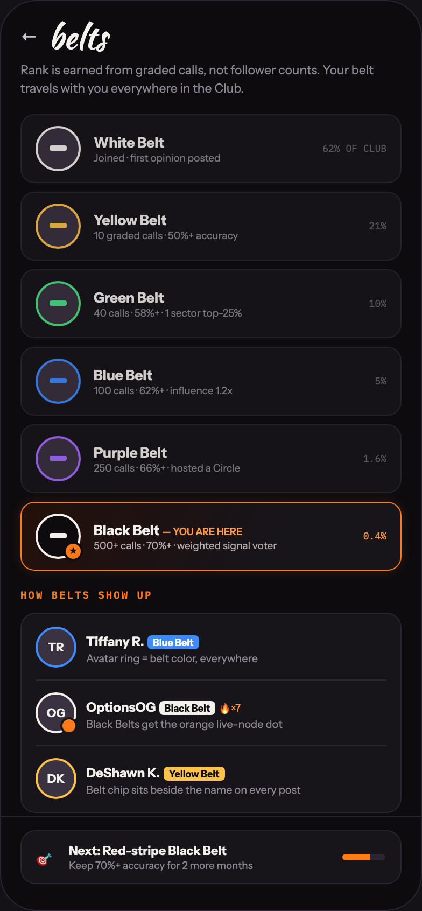

# 22 BELTS · RANK SYSTEM

Canvas: **CHEAT CODE · LOCKED BRAND · GLOW AT 40%** · board index 21 · slug `22-belts-rank-system`
Frame: **392×846px** (design width 392px — port at 390px logical, scale ratios).

> Style values are EXACT computed values from the canvas. `T.*` = canvas token, resolved in
> the Tokens appendix at the bottom of this file. Text marked `(MOCK)` must not ship as drawn —
> see `../../DELTA.md` for its substitution rule.

## Tree

- **“← belts Rank is earned from graded calls…”** → `
`
  - box: 392x846 · display: flex · dir: column · width: 390px · height: 844px · bg: T.violet-900-b · border: 1px solid T.violet-800 · radius: 34px (T.r20) · overflow: hidden · type: color T.neutral-950 / Instrument Sans / 16px / w400 / lh normal
  - **“← belts Rank is earned from graded calls…”** → `
`
    - box: 390x757 · flex: 1 1 0% · flex-grow: 1 · flex-basis: 0% · pad: 18px 18px 0px 18px · overflow: hidden
    - **“← belts…”** → `
`
      - box: 354x30 · display: flex · align: center · gap: 10px
      - **"←"** → ``
        - box: 16x20 · type: color T.violet-200 · scale: T.ty36
        - text: "←"
      - **"belts"** → `
`
        - box: 54.3x30 · type: color T.orange-50 / Kaushan Script / 30px / lh 30px · scale: T.ty6
        - text: "belts"
    - **"Rank is earned from graded calls, not follow"** → `
`
      - box: 354x34.5 · margin: 8px 0px 0px 0px · type: color T.neutral-400 / 11.5px / lh 17.25px · scale: T.ty83
      - text: "Rank is earned from graded calls, not follower counts. Your belt travels with you everywhere in the Club."
    - **“White Belt Joined · first opinion posted…”** → `
`
      - box: 354x424 · display: flex · dir: column · gap: 8px · margin: 14px 0px 0px 0px
      - **“White Belt Joined · first opinion posted…”** → `
`
        - box: 354x64 · display: flex · align: center · gap: 12px · pad: 10px 13px 10px 13px · bg: T.violet-900 · border: 1px solid T.violet-800 · radius: 13px (T.r14) · opacity: 0.85
        - **block[0]** → `
`
          - box: 42x42 · display: grid · align: center · justify-items: center · grid-cols: 38px · grid-rows: 38px · width: 38px · height: 38px · flex: 0 0 auto · flex-shrink: 0 · bg: T.violet-800-b · border: 2px solid T.orange-50 · radius: 50% (T.r21)
          - **block[0]** → ``
            - box: 16x5 · width: 16px · height: 5px · bg: T.orange-50 · radius: 2px (T.r3)
        - **“White Belt Joined · first opinion posted…”** → `
`
          - box: 200.6x28 · flex: 1 1 0% · flex-grow: 1 · flex-basis: 0%
          - **"White Belt"** → `
`
            - box: 200.6x16 · type: color T.orange-50 / 13px / w700 · scale: T.ty58
            - text: "White Belt"
          - **"Joined · first opinion posted"** → `
`
            - box: 200.6x11 · margin: 1px 0px 0px 0px · type: color T.neutral-400 / 9.5px · scale: T.ty117
            - text: "Joined · first opinion posted"
        - **"62% OF CLUB"** **(MOCK)** → ``
          - box: 59.4x11 · type: color T.neutral-500 / IBM Plex Mono / 9px · scale: T.ty127
          - text: "62% OF CLUB"
      - **“Yellow Belt 10 graded calls · 50%+ accur…”** → `
`
        - box: 354x64 · display: flex · align: center · gap: 12px · pad: 10px 13px 10px 13px · bg: T.violet-900 · border: 1px solid T.violet-800 · radius: 13px (T.r14) · opacity: 0.85
        - **block[0]** → `
`
          - box: 42x42 · display: grid · align: center · justify-items: center · grid-cols: 38px · grid-rows: 38px · width: 38px · height: 38px · flex: 0 0 auto · flex-shrink: 0 · bg: T.violet-800-b · border: 2px solid T.orange-300-b · radius: 50% (T.r21)
          - **block[0]** → ``
            - box: 16x5 · width: 16px · height: 5px · bg: T.orange-300-b · radius: 2px (T.r3)
        - **“Yellow Belt 10 graded calls · 50%+ accur…”** → `
`
          - box: 243.8x28 · flex: 1 1 0% · flex-grow: 1 · flex-basis: 0%
          - **"Yellow Belt"** → `
`
            - box: 243.8x16 · type: color T.orange-50 / 13px / w700 · scale: T.ty58
            - text: "Yellow Belt"
          - **"10 graded calls · 50%+ accuracy"** **(MOCK)** → `
`
            - box: 243.8x11 · margin: 1px 0px 0px 0px · type: color T.neutral-400 / 9.5px · scale: T.ty117
            - text: "10 graded calls · 50%+ accuracy"
        - **"21%"** **(MOCK)** → ``
          - box: 16.2x11 · type: color T.neutral-500 / IBM Plex Mono / 9px · scale: T.ty127
          - text: "21%"
      - **“Green Belt 40 calls · 58%+ · 1 sector to…”** → `
`
        - box: 354x64 · display: flex · align: center · gap: 12px · pad: 10px 13px 10px 13px · bg: T.violet-900 · border: 1px solid T.violet-800 · radius: 13px (T.r14) · opacity: 0.85
        - **block[0]** → `
`
          - box: 42x42 · display: grid · align: center · justify-items: center · grid-cols: 38px · grid-rows: 38px · width: 38px · height: 38px · flex: 0 0 auto · flex-shrink: 0 · bg: T.violet-800-b · border: 2px solid T.green-400 · radius: 50% (T.r21)
          - **block[0]** → ``
            - box: 16x5 · width: 16px · height: 5px · bg: T.green-400 · radius: 2px (T.r3)
        - **“Green Belt 40 calls · 58%+ · 1 sector to…”** → `
`
          - box: 243.8x28 · flex: 1 1 0% · flex-grow: 1 · flex-basis: 0%
          - **"Green Belt"** → `
`
            - box: 243.8x16 · type: color T.orange-50 / 13px / w700 · scale: T.ty58
            - text: "Green Belt"
          - **"40 calls · 58%+ · 1 sector top-25%"** **(MOCK)** → `
`
            - box: 243.8x11 · margin: 1px 0px 0px 0px · type: color T.neutral-400 / 9.5px · scale: T.ty117
            - text: "40 calls · 58%+ · 1 sector top-25%"
        - **"10%"** **(MOCK)** → ``
          - box: 16.2x11 · type: color T.neutral-500 / IBM Plex Mono / 9px · scale: T.ty127
          - text: "10%"
      - **“Blue Belt 100 calls · 62%+ · influence 1…”** → `
`
        - box: 354x64 · display: flex · align: center · gap: 12px · pad: 10px 13px 10px 13px · bg: T.violet-900 · border: 1px solid T.violet-800 · radius: 13px (T.r14) · opacity: 0.85
        - **block[0]** → `
`
          - box: 42x42 · display: grid · align: center · justify-items: center · grid-cols: 38px · grid-rows: 38px · width: 38px · height: 38px · flex: 0 0 auto · flex-shrink: 0 · bg: T.violet-800-b · border: 2px solid T.blue-300-b · radius: 50% (T.r21)
          - **block[0]** → ``
            - box: 16x5 · width: 16px · height: 5px · bg: T.blue-300-b · radius: 2px (T.r3)
        - **“Blue Belt 100 calls · 62%+ · influence 1…”** → `
`
          - box: 249.2x28 · flex: 1 1 0% · flex-grow: 1 · flex-basis: 0%
          - **"Blue Belt"** → `
`
            - box: 249.2x16 · type: color T.orange-50 / 13px / w700 · scale: T.ty58
            - text: "Blue Belt"
          - **"100 calls · 62%+ · influence 1.2x"** **(MOCK)** → `
`
            - box: 249.2x11 · margin: 1px 0px 0px 0px · type: color T.neutral-400 / 9.5px · scale: T.ty117
            - text: "100 calls · 62%+ · influence 1.2x"
        - **"5%"** **(MOCK)** → ``
          - box: 10.8x11 · type: color T.neutral-500 / IBM Plex Mono / 9px · scale: T.ty127
          - text: "5%"
      - **“Purple Belt 250 calls · 66%+ · hosted a …”** → `
`
        - box: 354x64 · display: flex · align: center · gap: 12px · pad: 10px 13px 10px 13px · bg: T.violet-900 · border: 1px solid T.violet-800 · radius: 13px (T.r14) · opacity: 0.85
        - **block[0]** → `
`
          - box: 42x42 · display: grid · align: center · justify-items: center · grid-cols: 38px · grid-rows: 38px · width: 38px · height: 38px · flex: 0 0 auto · flex-shrink: 0 · bg: T.violet-800-b · border: 2px solid T.violet-200-b · radius: 50% (T.r21)
          - **block[0]** → ``
            - box: 16x5 · width: 16px · height: 5px · bg: T.violet-200-b · radius: 2px (T.r3)
        - **“Purple Belt 250 calls · 66%+ · hosted a …”** → `
`
          - box: 238.4x28 · flex: 1 1 0% · flex-grow: 1 · flex-basis: 0%
          - **"Purple Belt"** → `
`
            - box: 238.4x16 · type: color T.orange-50 / 13px / w700 · scale: T.ty58
            - text: "Purple Belt"
          - **"250 calls · 66%+ · hosted a Circle"** **(MOCK)** → `
`
            - box: 238.4x11 · margin: 1px 0px 0px 0px · type: color T.neutral-400 / 9.5px · scale: T.ty117
            - text: "250 calls · 66%+ · hosted a Circle"
        - **"1.6%"** **(MOCK)** → ``
          - box: 21.6x11 · type: color T.neutral-500 / IBM Plex Mono / 9px · scale: T.ty127
          - text: "1.6%"
      - **“★ Black Belt — YOU ARE HERE 500+ calls ·…”** → `
`
        - box: 354x64 · display: flex · align: center · gap: 12px · pad: 10px 13px 10px 13px · bg-image: linear-gradient(120deg, T.orange-900 0%, T.violet-900 65%) · border: 1px solid T.orange-400 · radius: 13px (T.r14) · shadow: T.orange-400a14 0px 0px 12px 0px
        - **“★…”** → `
`
          - box: 42x42 · display: grid · align: center · justify-items: center · grid-cols: 38px · grid-rows: 38px · width: 38px · height: 38px · flex: 0 0 auto · flex-shrink: 0 · bg: T.violet-900-b · border: 2px solid T.orange-50 · radius: 50% (T.r21) · position: relative [0px 0px 0px 0px]
          - **block[0]** → ``
            - box: 16x5 · width: 16px · height: 5px · bg: T.orange-50 · radius: 2px (T.r3)
          - **"★"** → ``
            - box: 18x18 · display: grid · align: center · justify-items: center · grid-cols: 14px · grid-rows: 14px · width: 14px · height: 14px · bg: T.orange-400 · border: 2px solid T.violet-900-b · radius: 50% (T.r21) · position: absolute [24px -4px -4px 24px] · type: color T.violet-900-b / 7px · scale: T.ty155
            - text: "★"
        - **“Black Belt — YOU ARE HERE 500+ calls · 7…”** → `
`
          - box: 238.4x28 · flex: 1 1 0% · flex-grow: 1 · flex-basis: 0%
          - **"Black Belt"** → `
`
            - box: 238.4x16 · type: color T.orange-50 / 13px / w800 · scale: T.ty61
            - text: "Black Belt"
            - **"— YOU ARE HERE"** → ``
              - box: 74.4x11 · display: inline · type: color T.orange-300 / 9px / w600 · scale: T.ty126
              - text: "— YOU ARE HERE"
          - **"500+ calls · 70%+ · weighted signal voter"** **(MOCK)** → `
`
            - box: 238.4x11 · margin: 1px 0px 0px 0px · type: color T.neutral-200-b / 9.5px · scale: T.ty117
            - text: "500+ calls · 70%+ · weighted signal voter"
        - **"0.4%"** **(MOCK)** → ``
          - box: 21.6x11 · type: color T.orange-300 / IBM Plex Mono / 9px · scale: T.ty127
          - text: "0.4%"
    - **"How belts show up"** → `
`
      - box: 354x13 · margin: 16px 0px 0px 0px · type: color T.orange-400 / IBM Plex Mono / 9.5px / w600 / ls 1.52px / uppercase · scale: T.ty118
      - text: "How belts show up"
    - **“TR Tiffany R. Blue Belt Avatar ring = be…”** → `
`
      - box: 354x186 · pad: 12px 13px 12px 13px · margin: 10px 0px 0px 0px · bg: T.violet-900 · border: 1px solid T.violet-800 · radius: 14px (T.r15)
      - **“TR Tiffany R. Blue Belt Avatar ring = be…”** → `
`
        - box: 326x38 · display: flex · align: center · gap: 9px
        - **"TR"** → `
`
          - box: 38x38 · display: grid · align: center · justify-items: center · grid-cols: 34px · grid-rows: 34px · width: 34px · height: 34px · flex: 0 0 auto · flex-shrink: 0 · bg: T.violet-800-b · border: 2px solid T.blue-300-b · radius: 50% (T.r21) · type: color T.orange-50 / 11px / w700 · scale: T.ty86
          - text: "TR"
        - **“Tiffany R. Blue Belt Avatar ring = belt …”** → `
`
          - box: 279x34 · flex: 1 1 0% · flex-grow: 1 · flex-basis: 0%
          - **"Tiffany R."** → ``
            - box: 53.8x15 · display: inline · type: color T.orange-50 / 12px / w700 · scale: T.ty72
            - text: "Tiffany R."
          - **"Blue Belt"** → ``
            - box: 47.9x13 · display: inline · pad: 1px 5px 1px 5px · bg: T.blue-300-b · radius: 4px (T.r5) · type: color T.neutral-0 / 9px / w700 · scale: T.ty129
            - text: "Blue Belt"
          - **"Avatar ring = belt color, everywhere"** → `
`
            - box: 279x13 · margin: 1px 0px 0px 0px · type: color T.neutral-400 / 10px · scale: T.ty109
            - text: "Avatar ring = belt color, everywhere"
      - **“OG OptionsOG Black Belt 🔥×7 Black Belts…”** → `
`
        - box: 326x50 · display: flex · align: center · gap: 9px · pad: 11px 0px 0px 0px · margin: 11px 0px 0px 0px · border: T:1px solid T.violet-800 R:0px none T.neutral-950 B:0px none T.neutral-950 L:0px none T.neutral-950
        - **"OG"** → `
`
          - box: 38x38 · display: grid · align: center · justify-items: center · grid-cols: 34px · grid-rows: 34px · width: 34px · height: 34px · flex: 0 0 auto · flex-shrink: 0 · bg: T.violet-800-b · border: 2px solid T.orange-50 · radius: 50% (T.r21) · position: relative [0px 0px 0px 0px] · type: color T.orange-50 / 11px / w700 · scale: T.ty86
          - text: "OG"
          - **block[0]** → ``
            - box: 16x16 · width: 12px · height: 12px · bg: T.orange-400 · border: 2px solid T.violet-900 · radius: 50% (T.r21) · position: absolute [21px -3px -3px 21px]
        - **“OptionsOG Black Belt 🔥×7 Black Belts ge…”** → `
`
          - box: 279x34 · flex: 1 1 0% · flex-grow: 1 · flex-basis: 0%
          - **"OptionsOG"** → ``
            - box: 64.7x15 · display: inline · type: color T.orange-50 / 12px / w700 · scale: T.ty72
            - text: "OptionsOG"
          - **"Black Belt"** → ``
            - box: 52.4x13 · display: inline · pad: 1px 5px 1px 5px · bg: T.orange-50 · radius: 4px (T.r5) · type: color T.violet-900-b / 9px / w700 · scale: T.ty129
            - text: "Black Belt"
          - **"🔥×7"** → ``
            - box: 19.9x11 · display: inline · type: color T.orange-300 / 9px · scale: T.ty128
            - text: "🔥×7"
          - **"Black Belts get the orange live-node dot"** → `
`
            - box: 279x13 · margin: 1px 0px 0px 0px · type: color T.neutral-400 / 10px · scale: T.ty109
            - text: "Black Belts get the orange live-node dot"
      - **“DK DeShawn K. Yellow Belt Belt chip sits…”** → `
`
        - box: 326x50 · display: flex · align: center · gap: 9px · pad: 11px 0px 0px 0px · margin: 11px 0px 0px 0px · border: T:1px solid T.violet-800 R:0px none T.neutral-950 B:0px none T.neutral-950 L:0px none T.neutral-950
        - **"DK"** → `
`
          - box: 38x38 · display: grid · align: center · justify-items: center · grid-cols: 34px · grid-rows: 34px · width: 34px · height: 34px · flex: 0 0 auto · flex-shrink: 0 · bg: T.violet-800-b · border: 2px solid T.orange-300-b · radius: 50% (T.r21) · type: color T.orange-50 / 11px / w700 · scale: T.ty86
          - text: "DK"
        - **“DeShawn K. Yellow Belt Belt chip sits be…”** → `
`
          - box: 279x34 · flex: 1 1 0% · flex-grow: 1 · flex-basis: 0%
          - **"DeShawn K."** → ``
            - box: 68.6x15 · display: inline · type: color T.orange-50 / 12px / w700 · scale: T.ty72
            - text: "DeShawn K."
          - **"Yellow Belt"** → ``
            - box: 57x13 · display: inline · pad: 1px 5px 1px 5px · bg: T.orange-300-b · radius: 4px (T.r5) · type: color T.violet-900-b / 9px / w700 · scale: T.ty129
            - text: "Yellow Belt"
          - **"Belt chip sits beside the name on every post"** → `
`
            - box: 279x13 · margin: 1px 0px 0px 0px · type: color T.neutral-400 / 10px · scale: T.ty109
            - text: "Belt chip sits beside the name on every post"
  - **“🎯 Next: Red-stripe Black Belt Keep 70%+…”** → `
`
    - box: 390x87 · pad: 12px 18px 24px 18px · border: T:1px solid T.violet-800 R:0px none T.neutral-950 B:0px none T.neutral-950 L:0px none T.neutral-950
    - **“🎯 Next: Red-stripe Black Belt Keep 70%+…”** → `
`
      - box: 354x50 · display: flex · align: center · gap: 12px · pad: 11px 14px 11px 14px · bg: T.violet-900 · border: 1px solid T.violet-800 · radius: 14px (T.r15)
      - **"🎯"** → ``
        - box: 18x23 · type: 14px · scale: T.ty50
        - text: "🎯"
      - **“Next: Red-stripe Black Belt Keep 70%+ ac…”** → `
`
        - box: 242x26 · flex: 1 1 0% · flex-grow: 1 · flex-basis: 0%
        - **"Next: Red-stripe Black Belt"** → `
`
          - box: 242x14 · type: color T.orange-50 / 11.5px / w700 · scale: T.ty82
          - text: "Next: Red-stripe Black Belt"
        - **"Keep 70%+ accuracy for 2 more months"** **(MOCK)** → `
`
          - box: 242x11 · margin: 1px 0px 0px 0px · type: color T.neutral-400 / 9.5px · scale: T.ty117
          - text: "Keep 70%+ accuracy for 2 more months"
      - **block[2]** → `
`
        - box: 40x6 · width: 40px · height: 6px · bg: T.violet-800 · radius: 3px (T.r4) · overflow: hidden
        - **block[0]** → `
`
          - box: 25.6x6 · width: 64% · height: 100% · bg: T.orange-400

## Tokens used in this board

| token | value | role |
| --- | --- | --- |
| T.violet-800 | `#2A2530` | border, bg, gradient |
| T.orange-50 | `#F4F0EC` | text, bg, border |
| T.neutral-500 | `#6E6774` | text, bg |
| T.violet-900 | `#17141A` | bg, gradient, border |
| T.neutral-400 | `#8F8894` | text, border, bg |
| T.orange-400 | `#FF7A1A` | bg, text, border, gradient |
| T.violet-900-b | `#0D0B0E` | bg, text, border, gradient |
| T.neutral-950 | `#000000` | border, text |
| T.green-400 | `#4AE383` | text, gradient, border, bg |
| T.orange-300 | `#FF9A4D` | text |
| T.violet-200 | `#C8C2CE` | text |
| T.violet-800-b | `#3A3240` | bg, border |
| T.orange-300-b | `#FFC24B` | text, gradient, border, bg |
| T.blue-300-b | `#3D8BFF` | text, border, bg |
| T.orange-900 | `#241009` | gradient |
| T.violet-200-b | `#A66BFF` | border, gradient, text, bg |
| T.neutral-200-b | `#B8AEB0` | text |
| T.neutral-0 | `#FFFFFF` | text |
| T.orange-400a14 | `#FF7A1A/0.14` | shadow, bg |
| T.ty6 | Kaushan Script 30px/30px w400 ls:normal | type scale |
| T.ty36 | Instrument Sans 16px/normal w400 ls:normal | type scale |
| T.ty50 | Instrument Sans 14px/normal w400 ls:normal | type scale |
| T.ty58 | Instrument Sans 13px/normal w700 ls:normal | type scale |
| T.ty61 | Instrument Sans 13px/normal w800 ls:normal | type scale |
| T.ty72 | Instrument Sans 12px/normal w700 ls:normal | type scale |
| T.ty82 | Instrument Sans 11.5px/normal w700 ls:normal | type scale |
| T.ty83 | Instrument Sans 11.5px/17.25px w400 ls:normal | type scale |
| T.ty86 | Instrument Sans 11px/normal w700 ls:normal | type scale |
| T.ty109 | Instrument Sans 10px/normal w400 ls:normal | type scale |
| T.ty117 | Instrument Sans 9.5px/normal w400 ls:normal | type scale |
| T.ty118 | IBM Plex Mono 9.5px/normal w600 ls:1.52px uppercase | type scale |
| T.ty126 | Instrument Sans 9px/normal w600 ls:normal | type scale |
| T.ty127 | IBM Plex Mono 9px/normal w400 ls:normal | type scale |
| T.ty128 | Instrument Sans 9px/normal w400 ls:normal | type scale |
| T.ty129 | Instrument Sans 9px/normal w700 ls:normal | type scale |
| T.ty155 | Instrument Sans 7px/normal w400 ls:normal | type scale |
| T.r3 | `2px` | radius |
| T.r4 | `3px` | radius |
| T.r5 | `4px` | radius |
| T.r14 | `13px` | radius |
| T.r15 | `14px` | radius |
| T.r20 | `34px` | radius |
| T.r21 | `50%` | radius |
