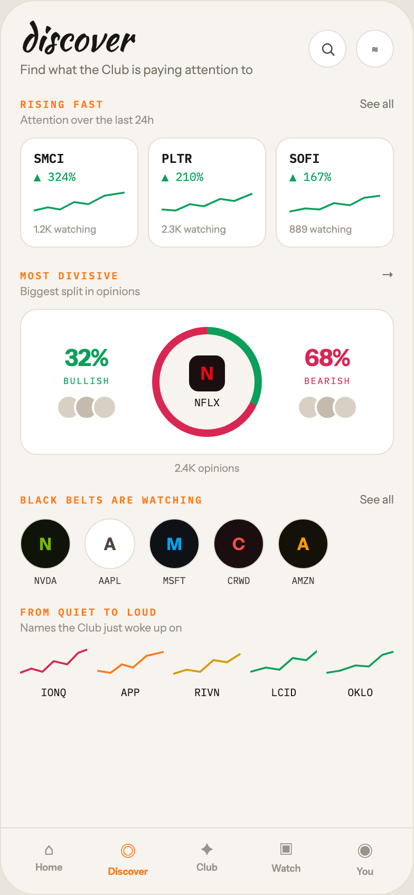

# 02 DISCOVER

Canvas: **CHEAT CODE · LIGHT THEME · SAME SYSTEM** · board index 1 · slug `02-discover`
Frame: **392×846px** (design width 392px — port at 390px logical, scale ratios).

> Style values are EXACT computed values from the canvas. `T.*` = canvas token, resolved in
> the Tokens appendix at the bottom of this file. Text marked `(MOCK)` must not ship as drawn —
> see `../../DELTA.md` for its substitution rule.

## Tree

- **“discover Find what the Club is paying at…”** → `
`
  - box: 392x846 · display: flex · dir: column · width: 390px · height: 844px · bg: T.orange-50 · border: 1px solid T.orange-100 · radius: 34px (T.r20) · overflow: hidden · type: color T.neutral-950 / Instrument Sans / 16px / w400 / lh normal
  - **“discover Find what the Club is paying at…”** → `
`
    - box: 390x781 · flex: 1 1 0% · flex-grow: 1 · flex-basis: 0% · pad: 18px 18px 0px 18px · overflow: hidden
    - **“discover Find what the Club is paying at…”** → `
`
      - box: 354x54 · display: flex · align: center · justify: space-between
      - **“discover Find what the Club is paying at…”** → `
`
        - box: 220.5x54
        - **"discover"** → `
`
          - box: 220.5x34 · type: color T.orange-900 / Kaushan Script / 34px / lh 34px · scale: T.ty2
          - text: "discover"
        - **"Find what the Club is paying attention to"** → `
`
          - box: 220.5x15 · margin: 5px 0px 0px 0px · type: color T.neutral-500 / 12px · scale: T.ty71
          - text: "Find what the Club is paying attention to"
      - **“≋…”** → `
`
        - box: 81x36 · display: flex · gap: 9px
        - **block[0]** → `
`
          - box: 36x36 · display: grid · align: center · justify-items: center · grid-cols: 34px · grid-rows: 34px · width: 34px · height: 34px · bg: T.neutral-0 · border: 1px solid T.orange-100 · radius: 50% (T.r21)
          - **svg** → `<svg>`
            - box: 15x15 · overflow: hidden
            - svg: `<svg data-dc-tpl="144" width="15" height="15" viewBox="0 0 24 24"><circle data-dc-tpl="145" cx="11" cy="11" r="7" fill="none" stroke="#4E463E" stroke-width="2"></circle><path data-dc-tpl="146" d="M16.2 16.2 21 21" stroke="#4E463E" stroke-width="2" stroke-linecap="round"></path></svg>`
            - **block[0]** → `<circle>`
              - box: 8.8x8.8 · display: inline
            - **block[1]** → `<path>`
              - box: 3x3 · display: inline
        - **"≋"** → `
`
          - box: 36x36 · display: grid · align: center · justify-items: center · grid-cols: 34px · grid-rows: 34px · width: 34px · height: 34px · bg: T.neutral-0 · border: 1px solid T.orange-100 · radius: 50% (T.r21) · type: color T.orange-700 / 12px · scale: T.ty71
          - text: "≋"
    - **“RISING FAST See all…”** → `
`
      - box: 354x14 · display: flex · align: baseline · justify: space-between · margin: 18px 0px 0px 0px
      - **"Rising fast"** → ``
        - box: 79.4x13 · type: color T.orange-400-b / IBM Plex Mono / 9.5px / w600 / ls 1.52px / uppercase · scale: T.ty118
        - text: "Rising fast"
      - **"See all"** → ``
        - box: 32.4x14 · type: color T.neutral-500 / 11px · scale: T.ty88
        - text: "See all"
    - **"Attention over the last 24h"** → `
`
      - box: 354x13 · margin: 2px 0px 0px 0px · type: color T.orange-400 / 10.5px · scale: T.ty100
      - text: "Attention over the last 24h"
    - **“SMCI ▲ 324% 1.2K watching PLTR ▲ 210% 2.…”** → `
`
      - box: 354x104 · display: flex · gap: 9px · margin: 10px 0px 0px 0px
      - **“SMCI ▲ 324% 1.2K watching…”** → `
`
        - box: 112x104 · flex: 1 1 0% · flex-grow: 1 · flex-basis: 0% · pad: 11px 12px 11px 12px · bg: T.neutral-0 · border: 1px solid T.orange-100 · radius: 14px (T.r15)
        - **"SMCI"** → `
`
          - box: 86x15 · type: color T.orange-900 / IBM Plex Mono / 12px / w600 · scale: T.ty73
          - text: "SMCI"
        - **"▲ 324%"** **(MOCK)** → `
`
          - box: 86x14 · margin: 3px 0px 0px 0px · type: color T.teal-600 / IBM Plex Mono / 11px · scale: T.ty89
          - text: "▲ 324%"
        - **svg** → `<svg>`
          - box: 86x22 · display: inline · margin: 6px 0px 0px 0px · overflow: hidden
          - svg: `<svg data-dc-tpl="156" width="100%" height="22" viewBox="0 0 90 22" preserveAspectRatio="none" style="margin-top: 6px;"><path data-dc-tpl="157" d="M0 19 L14 16 L26 18 L40 11 L54 13 L70 5 L90 2" fill="none" stroke="#0BA05A" stroke-width="1.8"></path></svg>`
          - **block[0]** → `<path>`
            - box: 86x17 · display: inline
        - **"1.2K watching"** → `
`
          - box: 86x11 · margin: 5px 0px 0px 0px · type: color T.orange-400 / 9.5px · scale: T.ty117
          - text: "1.2K watching"
      - **“PLTR ▲ 210% 2.3K watching…”** → `
`
        - box: 112x104 · flex: 1 1 0% · flex-grow: 1 · flex-basis: 0% · pad: 11px 12px 11px 12px · bg: T.neutral-0 · border: 1px solid T.orange-100 · radius: 14px (T.r15)
        - **"PLTR"** → `
`
          - box: 86x15 · type: color T.orange-900 / IBM Plex Mono / 12px / w600 · scale: T.ty73
          - text: "PLTR"
        - **"▲ 210%"** **(MOCK)** → `
`
          - box: 86x14 · margin: 3px 0px 0px 0px · type: color T.teal-600 / IBM Plex Mono / 11px · scale: T.ty89
          - text: "▲ 210%"
        - **svg** → `<svg>`
          - box: 86x22 · display: inline · margin: 6px 0px 0px 0px · overflow: hidden
          - svg: `<svg data-dc-tpl="162" width="100%" height="22" viewBox="0 0 90 22" preserveAspectRatio="none" style="margin-top: 6px;"><path data-dc-tpl="163" d="M0 18 L14 19 L28 13 L42 15 L58 8 L72 10 L90 3" fill="none" stroke="#0BA05A" stroke-width="1.8"></path></svg>`
          - **block[0]** → `<path>`
            - box: 86x16 · display: inline
        - **"2.3K watching"** → `
`
          - box: 86x11 · margin: 5px 0px 0px 0px · type: color T.orange-400 / 9.5px · scale: T.ty117
          - text: "2.3K watching"
      - **“SOFI ▲ 167% 889 watching…”** → `
`
        - box: 112x104 · flex: 1 1 0% · flex-grow: 1 · flex-basis: 0% · pad: 11px 12px 11px 12px · bg: T.neutral-0 · border: 1px solid T.orange-100 · radius: 14px (T.r15)
        - **"SOFI"** → `
`
          - box: 86x15 · type: color T.orange-900 / IBM Plex Mono / 12px / w600 · scale: T.ty73
          - text: "SOFI"
        - **"▲ 167%"** **(MOCK)** → `
`
          - box: 86x14 · margin: 3px 0px 0px 0px · type: color T.teal-600 / IBM Plex Mono / 11px · scale: T.ty89
          - text: "▲ 167%"
        - **svg** → `<svg>`
          - box: 86x22 · display: inline · margin: 6px 0px 0px 0px · overflow: hidden
          - svg: `<svg data-dc-tpl="168" width="100%" height="22" viewBox="0 0 90 22" preserveAspectRatio="none" style="margin-top: 6px;"><path data-dc-tpl="169" d="M0 20 L16 17 L30 18 L44 12 L60 14 L74 7 L90 5" fill="none" stroke="#0BA05A" stroke-width="1.8"></path></svg>`
          - **block[0]** → `<path>`
            - box: 86x15 · display: inline
        - **"889 watching"** **(MOCK)** → `
`
          - box: 86x11 · margin: 5px 0px 0px 0px · type: color T.orange-400 / 9.5px · scale: T.ty117
          - text: "889 watching"
    - **“MOST DIVISIVE →…”** → `
`
      - box: 354x15 · display: flex · align: baseline · justify: space-between · margin: 18px 0px 0px 0px
      - **"Most divisive"** → ``
        - box: 93.9x13 · type: color T.orange-400-b / IBM Plex Mono / 9.5px / w600 / ls 1.52px / uppercase · scale: T.ty118
        - text: "Most divisive"
      - **"→"** → ``
        - box: 12x15 · type: color T.neutral-500 / 12px · scale: T.ty71
        - text: "→"
    - **"Biggest split in opinions"** → `
`
      - box: 354x13 · margin: 2px 0px 0px 0px · type: color T.orange-400 / 10.5px · scale: T.ty100
      - text: "Biggest split in opinions"
    - **“32% BULLISH N NFLX 68% BEARISH…”** → `
`
      - box: 354x138 · display: flex · align: center · gap: 16px · pad: 16px 16px 16px 16px · margin: 10px 0px 0px 0px · bg: T.neutral-0 · border: 1px solid T.orange-100 · radius: 16px (T.r16)
      - **“32% BULLISH…”** → `
`
        - box: 92x72 · flex: 1 1 0% · flex-grow: 1 · flex-basis: 0% · type: align-center
        - **"32%"** **(MOCK)** → `
`
          - box: 92x27 · type: color T.teal-600 / 22px / w800 / ls -0.44px · scale: T.ty19
          - text: "32%"
        - **"BULLISH"** → `
`
          - box: 92x11 · margin: 2px 0px 0px 0px · type: color T.teal-600 / IBM Plex Mono / 8.5px / ls 1.19px · scale: T.ty143
          - text: "BULLISH"
        - **block[2]** → `
`
          - box: 92x24 · display: flex · justify: center · margin: 8px 0px 0px 0px
          - **block[0]** → `
`
            - box: 24x24 · width: 20px · height: 20px · bg: T.orange-100-b · border: 2px solid T.neutral-0 · radius: 50% (T.r21)
          - **block[1]** → `
`
            - box: 24x24 · width: 20px · height: 20px · margin: 0px 0px 0px -7px · bg: T.orange-200 · border: 2px solid T.neutral-0 · radius: 50% (T.r21)
          - **block[2]** → `
`
            - box: 24x24 · width: 20px · height: 20px · margin: 0px 0px 0px -7px · bg: T.orange-100-b · border: 2px solid T.neutral-0 · radius: 50% (T.r21)
      - **“N NFLX…”** → `
`
        - box: 104x104 · width: 104px · height: 104px · flex: 0 0 auto · flex-shrink: 0 · position: relative [0px 0px 0px 0px]
        - **block[0]** → `
`
          - box: 104x104 · bg-image: conic-gradient(T.teal-600 0deg, T.teal-600 32%, T.red-400 32%, T.red-400 100%) · radius: 50% (T.r21) · position: absolute [0px 0px 0px 0px]
        - **“N NFLX…”** → `
`
          - box: 90x90 · display: grid · align: center · justify-items: center · grid-cols: 90px · grid-rows: 90px · bg: T.orange-50 · radius: 50% (T.r21) · position: absolute [7px 7px 7px 7px]
          - **“N NFLX…”** → `
`
            - box: 34x51 · type: align-center
            - **"N"** → `
`
              - box: 34x34 · display: grid · align: center · justify-items: center · grid-cols: 34px · grid-rows: 34px · width: 34px · height: 34px · bg: T.red-900 · radius: 9px (T.r10) · type: color T.red-500 / 17px / w800 · scale: T.ty33
              - text: "N"
            - **"NFLX"** → `
`
              - box: 34x13 · margin: 4px 0px 0px 0px · type: color T.orange-900 / IBM Plex Mono / 10px · scale: T.ty108
              - text: "NFLX"
      - **“68% BEARISH…”** → `
`
        - box: 92x72 · flex: 1 1 0% · flex-grow: 1 · flex-basis: 0% · type: align-center
        - **"68%"** **(MOCK)** → `
`
          - box: 92x27 · type: color T.red-400 / 22px / w800 / ls -0.44px · scale: T.ty19
          - text: "68%"
        - **"BEARISH"** → `
`
          - box: 92x11 · margin: 2px 0px 0px 0px · type: color T.red-400 / IBM Plex Mono / 8.5px / ls 1.19px · scale: T.ty143
          - text: "BEARISH"
        - **block[2]** → `
`
          - box: 92x24 · display: flex · justify: center · margin: 8px 0px 0px 0px
          - **block[0]** → `
`
            - box: 24x24 · width: 20px · height: 20px · bg: T.orange-100-b · border: 2px solid T.neutral-0 · radius: 50% (T.r21)
          - **block[1]** → `
`
            - box: 24x24 · width: 20px · height: 20px · margin: 0px 0px 0px -7px · bg: T.orange-200 · border: 2px solid T.neutral-0 · radius: 50% (T.r21)
          - **block[2]** → `
`
            - box: 24x24 · width: 20px · height: 20px · margin: 0px 0px 0px -7px · bg: T.orange-100-b · border: 2px solid T.neutral-0 · radius: 50% (T.r21)
    - **"2.4K opinions"** → `
`
      - box: 354x13 · margin: 6px 0px 0px 0px · type: color T.orange-400 / 10px / align-center · scale: T.ty109
      - text: "2.4K opinions"
    - **“BLACK BELTS ARE WATCHING See all…”** → `
`
      - box: 354x14 · display: flex · align: baseline · justify: space-between · margin: 16px 0px 0px 0px
      - **"Black belts are watching"** → ``
        - box: 173.3x13 · type: color T.orange-400-b / IBM Plex Mono / 9.5px / w600 / ls 1.52px / uppercase · scale: T.ty118
        - text: "Black belts are watching"
      - **"See all"** → ``
        - box: 32.4x14 · type: color T.neutral-500 / 11px · scale: T.ty88
        - text: "See all"
    - **“N NVDA A AAPL M MSFT C CRWD A AMZN…”** → `
`
      - box: 354x64 · display: flex · gap: 13px · margin: 11px 0px 0px 0px
      - **“N NVDA…”** → `
`
        - box: 48x64 · type: align-center
        - **"N"** → `
`
          - box: 48x48 · display: grid · align: center · justify-items: center · grid-cols: 46px · grid-rows: 46px · width: 46px · height: 46px · bg: T.lime-900 · border: 1px solid T.orange-100 · radius: 50% (T.r21) · type: color T.lime-600 / w800 · scale: T.ty37
          - text: "N"
        - **"NVDA"** → `
`
          - box: 48x11 · margin: 5px 0px 0px 0px · type: color T.orange-700 / IBM Plex Mono / 9px · scale: T.ty127
          - text: "NVDA"
      - **“A AAPL…”** → `
`
        - box: 48x64 · type: align-center
        - **"A"** → `
`
          - box: 48x48 · display: grid · align: center · justify-items: center · grid-cols: 46px · grid-rows: 46px · width: 46px · height: 46px · bg: T.neutral-0 · border: 1px solid T.orange-100 · radius: 50% (T.r21) · type: color T.orange-700 / w800 · scale: T.ty37
          - text: "A"
        - **"AAPL"** → `
`
          - box: 48x11 · margin: 5px 0px 0px 0px · type: color T.orange-700 / IBM Plex Mono / 9px · scale: T.ty127
          - text: "AAPL"
      - **“M MSFT…”** → `
`
        - box: 48x64 · type: align-center
        - **"M"** → `
`
          - box: 48x48 · display: grid · align: center · justify-items: center · grid-cols: 46px · grid-rows: 46px · width: 46px · height: 46px · bg: T.blue-900 · border: 1px solid T.orange-100 · radius: 50% (T.r21) · type: color T.blue-500-b / w800 · scale: T.ty37
          - text: "M"
        - **"MSFT"** → `
`
          - box: 48x11 · margin: 5px 0px 0px 0px · type: color T.orange-700 / IBM Plex Mono / 9px · scale: T.ty127
          - text: "MSFT"
      - **“C CRWD…”** → `
`
        - box: 48x64 · type: align-center
        - **"C"** → `
`
          - box: 48x48 · display: grid · align: center · justify-items: center · grid-cols: 46px · grid-rows: 46px · width: 46px · height: 46px · bg: T.red-900 · border: 1px solid T.orange-100 · radius: 50% (T.r21) · type: color T.red-300 / w800 · scale: T.ty37
          - text: "C"
        - **"CRWD"** → `
`
          - box: 48x11 · margin: 5px 0px 0px 0px · type: color T.orange-700 / IBM Plex Mono / 9px · scale: T.ty127
          - text: "CRWD"
      - **“A AMZN…”** → `
`
        - box: 48x64 · type: align-center
        - **"A"** → `
`
          - box: 48x48 · display: grid · align: center · justify-items: center · grid-cols: 46px · grid-rows: 46px · width: 46px · height: 46px · bg: T.amber-900 · border: 1px solid T.orange-100 · radius: 50% (T.r21) · type: color T.orange-400-d / w800 · scale: T.ty37
          - text: "A"
        - **"AMZN"** → `
`
          - box: 48x11 · margin: 5px 0px 0px 0px · type: color T.orange-700 / IBM Plex Mono / 9px · scale: T.ty127
          - text: "AMZN"
    - **“FROM QUIET TO LOUD…”** → `
`
      - box: 354x13 · display: flex · align: baseline · justify: space-between · margin: 18px 0px 0px 0px
      - **"From quiet to loud"** → ``
        - box: 130x13 · type: color T.orange-400-b / IBM Plex Mono / 9.5px / w600 / ls 1.52px / uppercase · scale: T.ty118
        - text: "From quiet to loud"
    - **"Names the Club just woke up on"** → `
`
      - box: 354x13 · margin: 2px 0px 0px 0px · type: color T.orange-400 / 10.5px · scale: T.ty100
      - text: "Names the Club just woke up on"
    - **“IONQ APP RIVN LCID OKLO…”** → `
`
      - box: 354x51 · display: flex · gap: 9px · margin: 10px 0px 0px 0px
      - **“IONQ…”** → `
`
        - box: 63.6x51 · flex: 1 1 0% · flex-grow: 1 · flex-basis: 0% · type: align-center
        - **svg** → `<svg>`
          - box: 63.6x30 · display: inline · overflow: hidden
          - svg: `<svg data-dc-tpl="221" width="100%" height="30" viewBox="0 0 60 30" preserveAspectRatio="none"><path data-dc-tpl="222" d="M0 26 L10 22 L20 25 L30 15 L42 18 L52 7 L60 4" fill="none" stroke="#D92652" stroke-width="1.8"></path></svg>`
          - **block[0]** → `<path>`
            - box: 63.6x22 · display: inline
        - **"IONQ"** → `
`
          - box: 63.6x13 · margin: 4px 0px 0px 0px · type: color T.orange-900 / IBM Plex Mono / 10px · scale: T.ty108
          - text: "IONQ"
      - **“APP…”** → `
`
        - box: 63.6x51 · flex: 1 1 0% · flex-grow: 1 · flex-basis: 0% · type: align-center
        - **svg** → `<svg>`
          - box: 63.6x30 · display: inline · overflow: hidden
          - svg: `<svg data-dc-tpl="225" width="100%" height="30" viewBox="0 0 60 30" preserveAspectRatio="none"><path data-dc-tpl="226" d="M0 24 L12 26 L22 18 L32 21 L44 10 L60 6" fill="none" stroke="#FF7A1A" stroke-width="1.8"></path></svg>`
          - **block[0]** → `<path>`
            - box: 63.6x20 · display: inline
        - **"APP"** → `
`
          - box: 63.6x13 · margin: 4px 0px 0px 0px · type: color T.orange-900 / IBM Plex Mono / 10px · scale: T.ty108
          - text: "APP"
      - **“RIVN…”** → `
`
        - box: 63.6x51 · flex: 1 1 0% · flex-grow: 1 · flex-basis: 0% · type: align-center
        - **svg** → `<svg>`
          - box: 63.6x30 · display: inline · overflow: hidden
          - svg: `<svg data-dc-tpl="229" width="100%" height="30" viewBox="0 0 60 30" preserveAspectRatio="none"><path data-dc-tpl="230" d="M0 27 L12 23 L24 25 L36 14 L48 16 L60 8" fill="none" stroke="#D99A00" stroke-width="1.8"></path></svg>`
          - **block[0]** → `<path>`
            - box: 63.6x19 · display: inline
        - **"RIVN"** → `
`
          - box: 63.6x13 · margin: 4px 0px 0px 0px · type: color T.orange-900 / IBM Plex Mono / 10px · scale: T.ty108
          - text: "RIVN"
      - **“LCID…”** → `
`
        - box: 63.6x51 · flex: 1 1 0% · flex-grow: 1 · flex-basis: 0% · type: align-center
        - **svg** → `<svg>`
          - box: 63.6x30 · display: inline · overflow: hidden
          - svg: `<svg data-dc-tpl="233" width="100%" height="30" viewBox="0 0 60 30" preserveAspectRatio="none"><path data-dc-tpl="234" d="M0 25 L14 21 L26 23 L38 12 L50 14 L60 5" fill="none" stroke="#0BA05A" stroke-width="1.8"></path></svg>`
          - **block[0]** → `<path>`
            - box: 63.6x20 · display: inline
        - **"LCID"** → `
`
          - box: 63.6x13 · margin: 4px 0px 0px 0px · type: color T.orange-900 / IBM Plex Mono / 10px · scale: T.ty108
          - text: "LCID"
      - **“OKLO…”** → `
`
        - box: 63.6x51 · flex: 1 1 0% · flex-grow: 1 · flex-basis: 0% · type: align-center
        - **svg** → `<svg>`
          - box: 63.6x30 · display: inline · overflow: hidden
          - svg: `<svg data-dc-tpl="237" width="100%" height="30" viewBox="0 0 60 30" preserveAspectRatio="none"><path data-dc-tpl="238" d="M0 26 L12 24 L26 19 L38 20 L50 9 L60 6" fill="none" stroke="#0BA05A" stroke-width="1.8"></path></svg>`
          - **block[0]** → `<path>`
            - box: 63.6x20 · display: inline
        - **"OKLO"** → `
`
          - box: 63.6x13 · margin: 4px 0px 0px 0px · type: color T.orange-900 / IBM Plex Mono / 10px · scale: T.ty108
          - text: "OKLO"
  - **“⌂ Home ◎ Discover ✦ Club ▣ Watch ◉ You…”** → `
`
    - box: 390x63 · display: flex · pad: 10px 8px 16px 8px · bg: T.orange-50 · border: T:1px solid T.orange-100 R:0px none T.neutral-950 B:0px none T.neutral-950 L:0px none T.neutral-950
    - **“⌂ Home…”** → `
`
      - box: 74.8x36 · flex: 1 1 0% · flex-grow: 1 · flex-basis: 0% · type: align-center
      - **"⌂"** → `
`
        - box: 74.8x19 · type: color T.orange-400 / 15px · scale: T.ty42
        - text: "⌂"
      - **"Home"** → `
`
        - box: 74.8x11 · margin: 2px 0px 0px 0px · type: color T.orange-400 / 9px / w600 · scale: T.ty126
        - text: "Home"
    - **“◎ Discover…”** → `
`
      - box: 74.8x36 · flex: 1 1 0% · flex-grow: 1 · flex-basis: 0% · type: align-center
      - **"◎"** → `
`
        - box: 74.8x23 · type: color T.orange-400-b / 15px · scale: T.ty42
        - text: "◎"
      - **"Discover"** → `
`
        - box: 74.8x11 · margin: 2px 0px 0px 0px · type: color T.orange-400-b / 9px / w700 · scale: T.ty129
        - text: "Discover"
    - **“✦ Club…”** → `
`
      - box: 74.8x36 · flex: 1 1 0% · flex-grow: 1 · flex-basis: 0% · type: align-center
      - **"✦"** → `
`
        - box: 74.8x19 · type: color T.orange-400 / 15px · scale: T.ty42
        - text: "✦"
      - **"Club"** → `
`
        - box: 74.8x11 · margin: 2px 0px 0px 0px · type: color T.orange-400 / 9px / w600 · scale: T.ty126
        - text: "Club"
    - **“▣ Watch…”** → `
`
      - box: 74.8x36 · flex: 1 1 0% · flex-grow: 1 · flex-basis: 0% · type: align-center
      - **"▣"** → `
`
        - box: 74.8x20 · type: color T.orange-400 / 15px · scale: T.ty42
        - text: "▣"
      - **"Watch"** → `
`
        - box: 74.8x11 · margin: 2px 0px 0px 0px · type: color T.orange-400 / 9px / w600 · scale: T.ty126
        - text: "Watch"
    - **“◉ You…”** → `
`
      - box: 74.8x36 · flex: 1 1 0% · flex-grow: 1 · flex-basis: 0% · type: align-center
      - **"◉"** → `
`
        - box: 74.8x23 · type: color T.orange-400 / 15px · scale: T.ty42
        - text: "◉"
      - **"You"** → `
`
        - box: 74.8x11 · margin: 2px 0px 0px 0px · type: color T.orange-400 / 9px / w600 · scale: T.ty126
        - text: "You"

## Tokens used in this board

| token | value | role |
| --- | --- | --- |
| T.orange-100 | `#E5DFD5` | border, bg, gradient |
| T.orange-900 | `#1A1614` | text, bg, border |
| T.orange-400 | `#9B9289` | text, bg |
| T.neutral-0 | `#FFFFFF` | bg, gradient, border, text |
| T.neutral-500 | `#7B7369` | text, border, bg |
| T.orange-400-b | `#FF7A1A` | bg, text, border, gradient |
| T.neutral-950 | `#000000` | border, text |
| T.teal-600 | `#0BA05A` | text, gradient, border, bg |
| T.orange-50 | `#F7F4EF` | bg, border, text, gradient |
| T.orange-700 | `#4E463E` | text |
| T.orange-100-b | `#D8D0C4` | bg, border |
| T.red-400 | `#D92652` | text, gradient, bg, border |
| T.lime-600 | `#76B900` | text, gradient |
| T.lime-900 | `#101408` | bg, gradient |
| T.red-900 | `#1A0E10` | bg, gradient |
| T.orange-200 | `#C4BBAD` | bg |
| T.blue-900 | `#0E1216` | bg |
| T.amber-900 | `#141208` | bg |
| T.orange-400-d | `#FF9900` | text |
| T.red-500 | `#E50914` | text |
| T.blue-500-b | `#00A4EF` | text |
| T.red-300 | `#FF4D3D` | text |
| T.ty2 | Kaushan Script 34px/34px w400 ls:normal | type scale |
| T.ty19 | Instrument Sans 22px/normal w800 ls:-0.44px | type scale |
| T.ty33 | Instrument Sans 17px/normal w800 ls:normal | type scale |
| T.ty37 | Instrument Sans 16px/normal w800 ls:normal | type scale |
| T.ty42 | Instrument Sans 15px/normal w400 ls:normal | type scale |
| T.ty71 | Instrument Sans 12px/normal w400 ls:normal | type scale |
| T.ty73 | IBM Plex Mono 12px/normal w600 ls:normal | type scale |
| T.ty88 | Instrument Sans 11px/normal w400 ls:normal | type scale |
| T.ty89 | IBM Plex Mono 11px/normal w400 ls:normal | type scale |
| T.ty100 | Instrument Sans 10.5px/normal w400 ls:normal | type scale |
| T.ty108 | IBM Plex Mono 10px/normal w400 ls:normal | type scale |
| T.ty109 | Instrument Sans 10px/normal w400 ls:normal | type scale |
| T.ty117 | Instrument Sans 9.5px/normal w400 ls:normal | type scale |
| T.ty118 | IBM Plex Mono 9.5px/normal w600 ls:1.52px uppercase | type scale |
| T.ty126 | Instrument Sans 9px/normal w600 ls:normal | type scale |
| T.ty127 | IBM Plex Mono 9px/normal w400 ls:normal | type scale |
| T.ty129 | Instrument Sans 9px/normal w700 ls:normal | type scale |
| T.ty143 | IBM Plex Mono 8.5px/normal w400 ls:1.19px | type scale |
| T.r10 | `9px` | radius |
| T.r15 | `14px` | radius |
| T.r16 | `16px` | radius |
| T.r20 | `34px` | radius |
| T.r21 | `50%` | radius |
