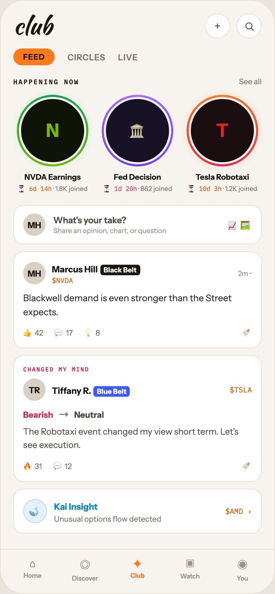

# 04 CLUB · FEED

Canvas: **CHEAT CODE · LIGHT THEME · SAME SYSTEM** · board index 3 · slug `04-club-feed`
Frame: **392×846px** (design width 392px — port at 390px logical, scale ratios).

> Style values are EXACT computed values from the canvas. `T.*` = canvas token, resolved in
> the Tokens appendix at the bottom of this file. Text marked `(MOCK)` must not ship as drawn —
> see `../../DELTA.md` for its substitution rule.

## Tree

- **“club + FEED CIRCLES LIVE HAPPENING NOW S…”** → `
`
  - box: 392x846 · display: flex · dir: column · width: 390px · height: 844px · bg: T.orange-50 · border: 1px solid T.orange-100 · radius: 34px (T.r20) · overflow: hidden · type: color T.neutral-950 / Instrument Sans / 16px / w400 / lh normal
  - **“club + FEED CIRCLES LIVE HAPPENING NOW S…”** → `
`
    - box: 390x781 · flex: 1 1 0% · flex-grow: 1 · flex-basis: 0% · pad: 18px 18px 0px 18px · overflow: hidden
    - **“club +…”** → `
`
      - box: 354x36 · display: flex · align: center · justify: space-between
      - **"club"** → `
`
        - box: 55x34 · type: color T.orange-900 / Kaushan Script / 34px / lh 34px · scale: T.ty2
        - text: "club"
      - **“+…”** → `
`
        - box: 81x36 · display: flex · gap: 9px
        - **"+"** → `
`
          - box: 36x36 · display: grid · align: center · justify-items: center · grid-cols: 34px · grid-rows: 34px · width: 34px · height: 34px · bg: T.neutral-0 · border: 1px solid T.orange-100 · radius: 50% (T.r21) · type: color T.orange-700 / w300 · scale: T.ty39
          - text: "+"
        - **block[1]** → `
`
          - box: 36x36 · display: grid · align: center · justify-items: center · grid-cols: 34px · grid-rows: 34px · width: 34px · height: 34px · bg: T.neutral-0 · border: 1px solid T.orange-100 · radius: 50% (T.r21)
          - **svg** → `<svg>`
            - box: 15x15 · overflow: hidden
            - svg: `<svg data-dc-tpl="395" width="15" height="15" viewBox="0 0 24 24"><circle data-dc-tpl="396" cx="11" cy="11" r="7" fill="none" stroke="#4E463E" stroke-width="2"></circle><path data-dc-tpl="397" d="M16.2 16.2 21 21" stroke="#4E463E" stroke-width="2" stroke-linecap="round"></path></svg>`
            - **block[0]** → `<circle>`
              - box: 8.8x8.8 · display: inline
            - **block[1]** → `<path>`
              - box: 3x3 · display: inline
    - **“FEED CIRCLES LIVE…”** → `
`
      - box: 354x24 · display: flex · align: center · gap: 18px · margin: 14px 0px 0px 0px
      - **"FEED"** → ``
        - box: 59.2x24 · pad: 5px 14px 5px 14px · bg: T.orange-400-b · radius: 16px (T.r16) · type: color T.orange-900 / 11px / w800 / ls 0.66px · scale: T.ty94
        - text: "FEED"
      - **"CIRCLES"** → ``
        - box: 54.1x15 · type: color T.neutral-500 / 12px / w600 / ls 0.48px · scale: T.ty75
        - text: "CIRCLES"
      - **"LIVE"** → ``
        - box: 28.4x15 · type: color T.neutral-500 / 12px / w600 / ls 0.48px · scale: T.ty75
        - text: "LIVE"
    - **“HAPPENING NOW See all…”** → `
`
      - box: 354x14 · display: flex · align: baseline · justify: space-between · margin: 16px 0px 0px 0px
      - **"Happening now"** → ``
        - box: 93.9x13 · type: color T.orange-900 / IBM Plex Mono / 9.5px / w600 / ls 1.52px / uppercase · scale: T.ty118
        - text: "Happening now"
      - **"See all"** → ``
        - box: 32.4x14 · type: color T.neutral-500 / 11px · scale: T.ty88
        - text: "See all"
    - **“N NVDA Earnings ⏳ 6d 14h · 1.8K joined �…”** → `
`
      - box: 354x141 · display: flex · justify: space-between · gap: 16px · pad: 0px 4px 0px 4px · margin: 12px 0px 0px 0px
      - **“N NVDA Earnings ⏳ 6d 14h · 1.8K joined…”** → `
`
        - box: 104x141 · width: 104px · type: align-center
        - **“N…”** → `
`
          - box: 102x102 · width: 96px · height: 96px · pad: 3px 3px 3px 3px · margin: 0px 1px 0px 1px · bg-image: conic-gradient(T.teal-600, T.lime-600, T.teal-600) · radius: 50% (T.r21) · shadow: T.green-400a15 0px 0px 14px 0px
          - **"N"** → `
`
            - box: 96x96 · display: grid · align: center · justify-items: center · grid-cols: 90px · grid-rows: 90px · width: 100% · height: 100% · bg: T.lime-900 · border: 3px solid T.orange-50 · radius: 50% (T.r21) · type: color T.lime-600 / 26px / w800 · scale: T.ty10
            - text: "N"
        - **"NVDA Earnings"** → `
`
          - box: 104x14 · margin: 8px 0px 0px 0px · type: color T.orange-900 / 11px / w700 · scale: T.ty86
          - text: "NVDA Earnings"
        - **"· 1.8K joined"** → `
`
          - box: 104x15 · margin: 2px 0px 0px 0px · type: color T.neutral-500 / 9.5px · scale: T.ty117
          - text: "· 1.8K joined"
          - **"⏳ 6d 14h"** → ``
            - box: 48.8x11 · display: inline · type: color T.orange-500 / IBM Plex Mono / 9px · scale: T.ty127
            - text: "⏳ 6d 14h"
      - **“🏛 Fed Decision ⏳ 1d 20h · 862 joined…”** → `
`
        - box: 104x141 · width: 104px · type: align-center
        - **“🏛…”** → `
`
          - box: 102x102 · width: 96px · height: 96px · pad: 3px 3px 3px 3px · margin: 0px 1px 0px 1px · bg-image: conic-gradient(T.violet-200, T.indigo-400, T.violet-200) · radius: 50% (T.r21)
          - **"🏛"** → `
`
            - box: 96x96 · display: grid · align: center · justify-items: center · grid-cols: 90px · grid-rows: 90px · width: 100% · height: 100% · bg: T.indigo-850 · border: 3px solid T.orange-50 · radius: 50% (T.r21) · type: color T.indigo-100 / 20px / w800 · scale: T.ty23
            - text: "🏛"
        - **"Fed Decision"** → `
`
          - box: 104x14 · margin: 8px 0px 0px 0px · type: color T.orange-900 / 11px / w700 · scale: T.ty86
          - text: "Fed Decision"
        - **"· 862 joined"** → `
`
          - box: 104x15 · margin: 2px 0px 0px 0px · type: color T.neutral-500 / 9.5px · scale: T.ty117
          - text: "· 862 joined"
          - **"⏳ 1d 20h"** → ``
            - box: 48.8x11 · display: inline · type: color T.red-400 / IBM Plex Mono / 9px · scale: T.ty127
            - text: "⏳ 1d 20h"
      - **“T Tesla Robotaxi ⏳ 10d 3h · 1.2K joined…”** → `
`
        - box: 104x141 · width: 104px · type: align-center
        - **“T…”** → `
`
          - box: 102x102 · width: 96px · height: 96px · pad: 3px 3px 3px 3px · margin: 0px 1px 0px 1px · bg-image: conic-gradient(T.orange-400-b, T.red-400, T.orange-400-b) · radius: 50% (T.r21) · shadow: T.orange-400a15 0px 0px 14px 0px
          - **"T"** → `
`
            - box: 96x96 · display: grid · align: center · justify-items: center · grid-cols: 90px · grid-rows: 90px · width: 100% · height: 100% · bg: T.red-900 · border: 3px solid T.orange-50 · radius: 50% (T.r21) · type: color T.red-400-b / 26px / w800 · scale: T.ty10
            - text: "T"
        - **"Tesla Robotaxi"** → `
`
          - box: 104x14 · margin: 8px 0px 0px 0px · type: color T.orange-900 / 11px / w700 · scale: T.ty86
          - text: "Tesla Robotaxi"
        - **"· 1.2K joined"** → `
`
          - box: 104x15 · margin: 2px 0px 0px 0px · type: color T.neutral-500 / 9.5px · scale: T.ty117
          - text: "· 1.2K joined"
          - **"⏳ 10d 3h"** → ``
            - box: 48.8x11 · display: inline · type: color T.orange-500 / IBM Plex Mono / 9px · scale: T.ty127
            - text: "⏳ 10d 3h"
    - **“MH What's your take? Share an opinion, c…”** → `
`
      - box: 354x56 · display: flex · align: center · gap: 11px · pad: 11px 13px 11px 13px · margin: 16px 0px 0px 0px · bg: T.neutral-0 · border: 1px solid T.orange-100 · radius: 14px (T.r15)
      - **"MH"** → `
`
        - box: 32x32 · display: grid · align: center · justify-items: center · grid-cols: 32px · grid-rows: 32px · width: 32px · height: 32px · flex: 0 0 auto · flex-shrink: 0 · bg: T.orange-100-b · radius: 50% (T.r21) · type: color T.orange-900 / 12px / w700 · scale: T.ty72
        - text: "MH"
      - **“What's your take? Share an opinion, char…”** → `
`
        - box: 237.4x29 · flex: 1 1 0% · flex-grow: 1 · flex-basis: 0%
        - **"What's your take?"** → `
`
          - box: 237.4x15 · type: color T.orange-700 / 12.5px / w600 · scale: T.ty68
          - text: "What's your take?"
        - **"Share an opinion, chart, or question"** → `
`
          - box: 237.4x13 · margin: 1px 0px 0px 0px · type: color T.orange-400 / 10px · scale: T.ty109
          - text: "Share an opinion, chart, or question"
      - **"📈 🖼"** → ``
        - box: 34.6x21 · type: color T.orange-400 / 13px · scale: T.ty59
        - text: "📈 🖼"
    - **“MH Marcus Hill Black Belt $NVDA 2m ··· B…”** → `
`
      - box: 354x138 · pad: 13px 13px 13px 13px · margin: 10px 0px 0px 0px · bg: T.neutral-0 · border: 1px solid T.orange-100 · radius: 14px (T.r15)
      - **“MH Marcus Hill Black Belt $NVDA 2m ···…”** → `
`
        - box: 326x34 · display: flex · align: center · gap: 9px
        - **"MH"** → `
`
          - box: 32x32 · display: grid · align: center · justify-items: center · grid-cols: 32px · grid-rows: 32px · width: 32px · height: 32px · bg: T.orange-100-b · radius: 50% (T.r21) · type: color T.orange-900 / 12px / w700 · scale: T.ty72
          - text: "MH"
        - **“Marcus Hill Black Belt $NVDA…”** → `
`
          - box: 256.2x34 · flex: 1 1 0% · flex-grow: 1 · flex-basis: 0%
          - **"Marcus Hill"** → ``
            - box: 65.4x15 · display: inline · type: color T.orange-900 / 12.5px / w700 · scale: T.ty65
            - text: "Marcus Hill"
          - **"Black Belt"** → ``
            - box: 57.1x15 · display: inline · pad: 1px 5px 1px 5px · bg: T.orange-900 · radius: 4px (T.r5) · type: color T.orange-50 / 10px / w700 · scale: T.ty111
            - text: "Black Belt"
          - **"$NVDA"** → `
`
            - box: 256.2x13 · margin: 1px 0px 0px 0px · type: color T.orange-500 / IBM Plex Mono / 10px · scale: T.ty108
            - text: "$NVDA"
        - **"2m ···"** → ``
          - box: 19.8x13 · type: color T.orange-400 / 10px · scale: T.ty109
          - text: "2m ···"
      - **"Blackwell demand is even stronger than the S"** → `
`
        - box: 326x39 · margin: 9px 0px 0px 0px · type: color T.orange-800 / 13px / lh 19.5px · scale: T.ty62
        - text: "Blackwell demand is even stronger than the Street expects."
      - **“👍 42 💬 17 💡 8 🔖…”** → `
`
        - box: 326x18 · display: flex · gap: 16px · margin: 10px 0px 0px 0px · type: color T.neutral-500 / 11px
        - **"👍 42"** → ``
          - box: 28.6x18 · scale: T.ty88
          - text: "👍 42"
        - **"💬 17"** → ``
          - box: 26.3x18 · scale: T.ty88
          - text: "💬 17"
        - **"💡 8"** → ``
          - box: 22.6x18 · scale: T.ty88
          - text: "💡 8"
        - **"🔖"** → ``
          - box: 14x18 · margin: 0px 0px 0px 186.516px · scale: T.ty88
          - text: "🔖"
    - **“CHANGED MY MIND TR Tiffany R. Blue Belt …”** → `
`
      - box: 354x179.5 · pad: 13px 13px 13px 13px · margin: 10px 0px 0px 0px · bg: T.neutral-0 · border: 1px solid T.orange-100 · radius: 14px (T.r15) · position: relative [0px 0px 0px 0px]
      - **"Changed my mind"** → `
`
        - box: 326x11 · type: color T.red-400 / IBM Plex Mono / 8.5px / w600 / ls 1.19px / uppercase · scale: T.ty140
        - text: "Changed my mind"
      - **“TR Tiffany R. Blue Belt $TSLA…”** → `
`
        - box: 326x32 · display: flex · align: center · gap: 9px · margin: 8px 0px 0px 0px
        - **"TR"** → `
`
          - box: 32x32 · display: grid · align: center · justify-items: center · grid-cols: 32px · grid-rows: 32px · width: 32px · height: 32px · bg: T.orange-100-b · radius: 50% (T.r21) · type: color T.orange-900 / 12px / w700 · scale: T.ty72
          - text: "TR"
        - **“Tiffany R. Blue Belt…”** → `
`
          - box: 244.5x20 · flex: 1 1 0% · flex-grow: 1 · flex-basis: 0%
          - **"Tiffany R."** → ``
            - box: 56x15 · display: inline · type: color T.orange-900 / 12.5px / w700 · scale: T.ty65
            - text: "Tiffany R."
          - **"Blue Belt"** → ``
            - box: 52.1x15 · display: inline · pad: 1px 5px 1px 5px · bg: T.blue-300-c · radius: 4px (T.r5) · type: color T.neutral-0 / 10px / w700 · scale: T.ty111
            - text: "Blue Belt"
        - **"$TSLA"** → ``
          - box: 31.5x14 · type: color T.orange-500 / IBM Plex Mono / 10.5px · scale: T.ty102
          - text: "$TSLA"
      - **“Bearish → Neutral…”** → `
`
        - box: 326x20 · display: flex · align: center · gap: 7px · margin: 9px 0px 0px 0px
        - **"Bearish"** → ``
          - box: 42.8x15 · type: color T.red-400 / 12px / w700 · scale: T.ty72
          - text: "Bearish"
        - **"→"** → ``
          - box: 16x20 · type: color T.neutral-500 · scale: T.ty36
          - text: "→"
        - **"Neutral"** → ``
          - box: 42.4x15 · type: color T.orange-700 / 12px / w700 · scale: T.ty72
          - text: "Neutral"
      - **"The Robotaxi event changed my view short ter"** → `
`
        - box: 326x37.5 · margin: 6px 0px 0px 0px · type: color T.orange-600 / 12.5px / lh 18.75px · scale: T.ty66
        - text: "The Robotaxi event changed my view short term. Let's see execution."
      - **“🔥 31 💬 12 🔖…”** → `
`
        - box: 326x18 · display: flex · gap: 16px · margin: 10px 0px 0px 0px · type: color T.neutral-500 / 11px
        - **"🔥 31"** → ``
          - box: 26.8x18 · scale: T.ty88
          - text: "🔥 31"
        - **"💬 12"** → ``
          - box: 26.5x18 · scale: T.ty88
          - text: "💬 12"
        - **"🔖"** → ``
          - box: 14x18 · margin: 0px 0px 0px 226.703px · scale: T.ty88
          - text: "🔖"
    - **“🐋 Kai Insight Unusual options flow dete…”** → `
`
      - box: 354x64 · display: flex · align: center · gap: 10px · pad: 13px 13px 13px 13px · margin: 10px 0px 0px 0px · bg: T.neutral-0 · border: 1px solid T.orange-100 · radius: 14px (T.r15)
      - **"🐋"** → `
`
        - box: 34x34 · display: grid · align: center · justify-items: center · grid-cols: 32px · grid-rows: 32px · width: 32px · height: 32px · flex: 0 0 auto · flex-shrink: 0 · bg: T.blue-50 · border: 1px solid T.blue-100 · radius: 50% (T.r21) · type: 14px · scale: T.ty50
        - text: "🐋"
      - **“Kai Insight Unusual options flow detecte…”** → `
`
        - box: 234.2x36 · flex: 1 1 0% · flex-grow: 1 · flex-basis: 0%
        - **"Kai Insight"** → ``
          - box: 62.3x15 · display: inline · type: color T.blue-500 / 12.5px / w700 · scale: T.ty65
          - text: "Kai Insight"
        - **"Unusual options flow detected"** → `
`
          - box: 234.2x14 · margin: 2px 0px 0px 0px · type: color T.neutral-500 / 11px · scale: T.ty88
          - text: "Unusual options flow detected"
      - **"$AMD ›"** → ``
        - box: 37.8x14 · type: color T.orange-500 / IBM Plex Mono / 10.5px · scale: T.ty102
        - text: "$AMD ›"
  - **“⌂ Home ◎ Discover ✦ Club ▣ Watch ◉ You…”** → `
`
    - box: 390x63 · display: flex · pad: 10px 8px 16px 8px · bg: T.orange-50 · border: T:1px solid T.orange-100 R:0px none T.neutral-950 B:0px none T.neutral-950 L:0px none T.neutral-950
    - **“⌂ Home…”** → `
`
      - box: 74.8x36 · flex: 1 1 0% · flex-grow: 1 · flex-basis: 0% · type: align-center
      - **"⌂"** → `
`
        - box: 74.8x19 · type: color T.orange-400 / 15px · scale: T.ty42
        - text: "⌂"
      - **"Home"** → `
`
        - box: 74.8x11 · margin: 2px 0px 0px 0px · type: color T.orange-400 / 9px / w600 · scale: T.ty126
        - text: "Home"
    - **“◎ Discover…”** → `
`
      - box: 74.8x36 · flex: 1 1 0% · flex-grow: 1 · flex-basis: 0% · type: align-center
      - **"◎"** → `
`
        - box: 74.8x23 · type: color T.orange-400 / 15px · scale: T.ty42
        - text: "◎"
      - **"Discover"** → `
`
        - box: 74.8x11 · margin: 2px 0px 0px 0px · type: color T.orange-400 / 9px / w600 · scale: T.ty126
        - text: "Discover"
    - **“✦ Club…”** → `
`
      - box: 74.8x36 · flex: 1 1 0% · flex-grow: 1 · flex-basis: 0% · type: align-center
      - **"✦"** → `
`
        - box: 74.8x19 · type: color T.orange-400-b / 15px · scale: T.ty42
        - text: "✦"
      - **"Club"** → `
`
        - box: 74.8x11 · margin: 2px 0px 0px 0px · type: color T.orange-400-b / 9px / w700 · scale: T.ty129
        - text: "Club"
    - **“▣ Watch…”** → `
`
      - box: 74.8x36 · flex: 1 1 0% · flex-grow: 1 · flex-basis: 0% · type: align-center
      - **"▣"** → `
`
        - box: 74.8x20 · type: color T.orange-400 / 15px · scale: T.ty42
        - text: "▣"
      - **"Watch"** → `
`
        - box: 74.8x11 · margin: 2px 0px 0px 0px · type: color T.orange-400 / 9px / w600 · scale: T.ty126
        - text: "Watch"
    - **“◉ You…”** → `
`
      - box: 74.8x36 · flex: 1 1 0% · flex-grow: 1 · flex-basis: 0% · type: align-center
      - **"◉"** → `
`
        - box: 74.8x23 · type: color T.orange-400 / 15px · scale: T.ty42
        - text: "◉"
      - **"You"** → `
`
        - box: 74.8x11 · margin: 2px 0px 0px 0px · type: color T.orange-400 / 9px / w600 · scale: T.ty126
        - text: "You"

## Tokens used in this board

| token | value | role |
| --- | --- | --- |
| T.orange-100 | `#E5DFD5` | border, bg, gradient |
| T.orange-900 | `#1A1614` | text, bg, border |
| T.orange-400 | `#9B9289` | text, bg |
| T.neutral-0 | `#FFFFFF` | bg, gradient, border, text |
| T.neutral-500 | `#7B7369` | text, border, bg |
| T.orange-400-b | `#FF7A1A` | bg, text, border, gradient |
| T.neutral-950 | `#000000` | border, text |
| T.teal-600 | `#0BA05A` | text, gradient, border, bg |
| T.orange-50 | `#F7F4EF` | bg, border, text, gradient |
| T.orange-500 | `#D95E00` | text |
| T.orange-700 | `#4E463E` | text |
| T.orange-100-b | `#D8D0C4` | bg, border |
| T.red-400 | `#D92652` | text, gradient, bg, border |
| T.orange-800 | `#2E2925` | text |
| T.lime-600 | `#76B900` | text, gradient |
| T.lime-900 | `#101408` | bg, gradient |
| T.blue-500 | `#0E86BE` | text, gradient, bg |
| T.orange-600 | `#5A534C` | text |
| T.red-900 | `#1A0E10` | bg, gradient |
| T.violet-200 | `#A66BFF` | border, gradient, text, bg |
| T.red-400-b | `#E82127` | text |
| T.blue-100 | `#B7D3E6` | border, gradient |
| T.blue-50 | `#E4F1FA` | bg, gradient |
| T.orange-400a15 | `#FF7A1A/0.15` | shadow, border |
| T.indigo-850 | `#171226` | bg, gradient |
| T.green-400a15 | `#4AE383/0.15` | shadow |
| T.indigo-400 | `#6C3DF4` | gradient |
| T.indigo-100 | `#C9B5FF` | text |
| T.blue-300-c | `#3D5AFE` | bg |
| T.ty2 | Kaushan Script 34px/34px w400 ls:normal | type scale |
| T.ty10 | Instrument Sans 26px/normal w800 ls:normal | type scale |
| T.ty23 | Instrument Sans 20px/normal w800 ls:normal | type scale |
| T.ty36 | Instrument Sans 16px/normal w400 ls:normal | type scale |
| T.ty39 | Instrument Sans 16px/normal w300 ls:normal | type scale |
| T.ty42 | Instrument Sans 15px/normal w400 ls:normal | type scale |
| T.ty50 | Instrument Sans 14px/normal w400 ls:normal | type scale |
| T.ty59 | Instrument Sans 13px/normal w400 ls:normal | type scale |
| T.ty62 | Instrument Sans 13px/19.5px w400 ls:normal | type scale |
| T.ty65 | Instrument Sans 12.5px/normal w700 ls:normal | type scale |
| T.ty66 | Instrument Sans 12.5px/18.75px w400 ls:normal | type scale |
| T.ty68 | Instrument Sans 12.5px/normal w600 ls:normal | type scale |
| T.ty72 | Instrument Sans 12px/normal w700 ls:normal | type scale |
| T.ty75 | Instrument Sans 12px/normal w600 ls:0.48px | type scale |
| T.ty86 | Instrument Sans 11px/normal w700 ls:normal | type scale |
| T.ty88 | Instrument Sans 11px/normal w400 ls:normal | type scale |
| T.ty94 | Instrument Sans 11px/normal w800 ls:0.66px | type scale |
| T.ty102 | IBM Plex Mono 10.5px/normal w400 ls:normal | type scale |
| T.ty108 | IBM Plex Mono 10px/normal w400 ls:normal | type scale |
| T.ty109 | Instrument Sans 10px/normal w400 ls:normal | type scale |
| T.ty111 | Instrument Sans 10px/normal w700 ls:normal | type scale |
| T.ty117 | Instrument Sans 9.5px/normal w400 ls:normal | type scale |
| T.ty118 | IBM Plex Mono 9.5px/normal w600 ls:1.52px uppercase | type scale |
| T.ty126 | Instrument Sans 9px/normal w600 ls:normal | type scale |
| T.ty127 | IBM Plex Mono 9px/normal w400 ls:normal | type scale |
| T.ty129 | Instrument Sans 9px/normal w700 ls:normal | type scale |
| T.ty140 | IBM Plex Mono 8.5px/normal w600 ls:1.19px uppercase | type scale |
| T.r5 | `4px` | radius |
| T.r15 | `14px` | radius |
| T.r16 | `16px` | radius |
| T.r20 | `34px` | radius |
| T.r21 | `50%` | radius |
