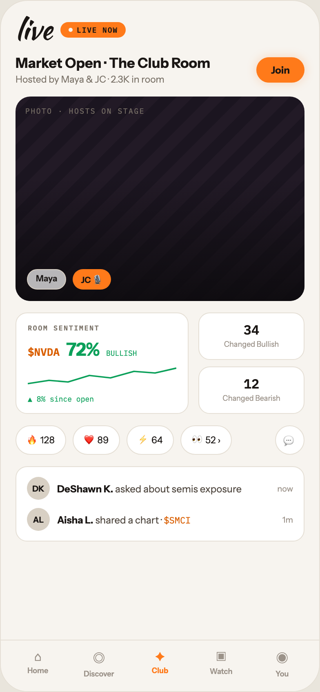

# 05 LIVE · THE CLUB ROOM

Canvas: **CHEAT CODE · LIGHT THEME · SAME SYSTEM** · board index 4 · slug `05-live-the-club-room`
Frame: **392×846px** (design width 392px — port at 390px logical, scale ratios).

> Style values are EXACT computed values from the canvas. `T.*` = canvas token, resolved in
> the Tokens appendix at the bottom of this file. Text marked `(MOCK)` must not ship as drawn —
> see `../../DELTA.md` for its substitution rule.

## Tree

- **“live LIVE NOW Market Open · The Club Roo…”** → `
`
  - box: 392x846 · display: flex · dir: column · width: 390px · height: 844px · bg: T.orange-50 · border: 1px solid T.orange-100 · radius: 34px (T.r20) · overflow: hidden · type: color T.neutral-950 / Instrument Sans / 16px / w400 / lh normal
  - **“live LIVE NOW Market Open · The Club Roo…”** → `
`
    - box: 390x781 · flex: 1 1 0% · flex-grow: 1 · flex-basis: 0% · pad: 18px 18px 0px 18px · overflow: hidden
    - **“live LIVE NOW…”** → `
`
      - box: 354x34 · display: flex · align: center · gap: 10px
      - **"live"** → `
`
        - box: 45x34 · type: color T.orange-900 / Kaushan Script / 34px / lh 34px · scale: T.ty2
        - text: "live"
      - **"LIVE NOW"** → ``
        - box: 80.4x19 · display: flex · align: center · gap: 5px · pad: 4px 10px 4px 10px · bg: T.orange-400-b · radius: 14px (T.r15) · type: color T.orange-900 / IBM Plex Mono / 9px / w700 / ls 0.9px · scale: T.ty133
        - text: "LIVE NOW"
        - **block[0]** → ``
          - box: 5x5 · width: 5px · height: 5px · bg: T.orange-50 · radius: 50% (T.r21)
    - **“Market Open · The Club Room Hosted by Ma…”** → `
`
      - box: 354x37 · display: flex · align: center · justify: space-between · margin: 14px 0px 0px 0px
      - **“Market Open · The Club Room Hosted by Ma…”** → `
`
        - box: 238.7x37
        - **"Market Open · The Club Room"** → `
`
          - box: 238.7x20 · type: color T.orange-900 / 17px / w700 · scale: T.ty34
          - text: "Market Open · The Club Room"
        - **"Hosted by Maya & JC · 2.3K in room"** → `
`
          - box: 238.7x14 · margin: 3px 0px 0px 0px · type: color T.neutral-500 / 11.5px · scale: T.ty81
          - text: "Hosted by Maya & JC · 2.3K in room"
      - **"Join"** → ``
        - box: 58.9x31 · pad: 8px 18px 8px 18px · bg: T.orange-400-b · radius: 20px (T.r18) · shadow: T.orange-400a25 0px 0px 12px 0px · type: color T.orange-900 / 12px / w700 · scale: T.ty72
        - text: "Join"
    - **“PHOTO · HOSTS ON STAGE Maya JC 🎙…”** → `
`
      - box: 354x250 · height: 250px · margin: 14px 0px 0px 0px · bg-image: repeating-linear-gradient(135deg, T.violet-850 0px, T.violet-850 14px, T.violet-850-b 14px, T.violet-850-b 28px) · radius: 18px (T.r17) · overflow: hidden · position: relative [0px 0px 0px 0px]
      - **block[0]** → `
`
        - box: 354x250 · bg-image: linear-gradient(T.neutral-950a00 40%, T.violet-900a90 100%) · position: absolute [0px 0px 0px 0px]
      - **"Photo · hosts on stage"** → `
`
        - box: 146.5x11 · position: absolute [12px 195.469px 227px 12px] · type: color T.neutral-500 / IBM Plex Mono / 9px / ls 1.26px / uppercase · scale: T.ty134
        - text: "Photo · hosts on stage"
      - **“Maya JC 🎙…”** → `
`
        - box: 103.4x25 · display: flex · gap: 8px · position: absolute [211px 236.562px 14px 14px]
        - **"Maya"** → ``
          - box: 48.2x25 · pad: 4px 10px 4px 10px · bg: T.neutral-0a70 · border: 1px solid T.orange-100-b · radius: 14px (T.r15) · type: color T.orange-900 / 10.5px / w600 · scale: T.ty101
          - text: "Maya"
        - **"JC 🎙"** → ``
          - box: 47.2x25 · pad: 4px 10px 4px 10px · bg: T.orange-400-b · radius: 14px (T.r15) · type: color T.orange-900 / 10.5px / w700 · scale: T.ty103
          - text: "JC 🎙"
    - **“ROOM SENTIMENT $NVDA 72% BULLISH ▲ 8% si…”** → `
`
      - box: 354x124 · display: flex · gap: 12px · margin: 14px 0px 0px 0px
      - **“ROOM SENTIMENT $NVDA 72% BULLISH ▲ 8% si…”** → `
`
        - box: 212x124 · flex: 1.4 1 0% · flex-grow: 1.4 · flex-basis: 0% · pad: 12px 14px 12px 14px · bg: T.neutral-0 · border: 1px solid T.orange-100 · radius: 14px (T.r15)
        - **"Room sentiment"** → `
`
          - box: 182x11 · type: color T.neutral-500 / IBM Plex Mono / 8.5px / w600 / ls 1.19px / uppercase · scale: T.ty140
          - text: "Room sentiment"
        - **“$NVDA 72% BULLISH…”** → `
`
          - box: 182x27 · display: flex · align: baseline · gap: 8px · margin: 8px 0px 0px 0px
          - **"$NVDA"** → ``
            - box: 39x17 · type: color T.orange-500 / IBM Plex Mono / 13px / w600 · scale: T.ty60
            - text: "$NVDA"
          - **"72%"** **(MOCK)** → ``
            - box: 41x27 · type: color T.teal-600 / 22px / w800 / ls -0.44px · scale: T.ty19
            - text: "72%"
          - **"BULLISH"** → ``
            - box: 37.8x11 · type: color T.teal-600 / IBM Plex Mono / 9px · scale: T.ty127
            - text: "BULLISH"
        - **svg** → `<svg>`
          - box: 182x26 · display: inline · margin: 6px 0px 0px 0px · overflow: hidden
          - svg: `<svg data-dc-tpl="511" width="100%" height="26" viewBox="0 0 140 26" preserveAspectRatio="none" style="margin-top: 6px;"><path data-dc-tpl="512" d="M0 22 L20 18 L38 20 L58 12 L78 15 L100 7 L120 9 L140 3" fill="none" stroke="#0BA05A" stroke-width="1.8"></path></svg>`
          - **block[0]** → `<path>`
            - box: 182x19 · display: inline
        - **"▲ 8% since open"** **(MOCK)** → `
`
          - box: 182x11 · margin: 5px 0px 0px 0px · type: color T.teal-600 / IBM Plex Mono / 9px · scale: T.ty127
          - text: "▲ 8% since open"
      - **“34 Changed Bullish 12 Changed Bearish…”** → `
`
        - box: 130x124 · display: flex · dir: column · gap: 8px · flex: 1 1 0% · flex-grow: 1 · flex-basis: 0%
        - **“34 Changed Bullish…”** → `
`
          - box: 130x58 · flex: 1 1 0% · flex-grow: 1 · flex-basis: 0% · pad: 10px 12px 10px 12px · bg: T.neutral-0 · border: 1px solid T.orange-100 · radius: 14px (T.r15) · type: align-center
          - **"34"** → `
`
            - box: 104x20 · type: color T.orange-900 / IBM Plex Mono / w600 · scale: T.ty38
            - text: "34"
          - **"Changed Bullish"** → `
`
            - box: 104x11 · margin: 2px 0px 0px 0px · type: color T.orange-400 / 9px · scale: T.ty128
            - text: "Changed Bullish"
        - **“12 Changed Bearish…”** → `
`
          - box: 130x58 · flex: 1 1 0% · flex-grow: 1 · flex-basis: 0% · pad: 10px 12px 10px 12px · bg: T.neutral-0 · border: 1px solid T.orange-100 · radius: 14px (T.r15) · type: align-center
          - **"12"** → `
`
            - box: 104x20 · type: color T.orange-900 / IBM Plex Mono / w600 · scale: T.ty38
            - text: "12"
          - **"Changed Bearish"** → `
`
            - box: 104x11 · margin: 2px 0px 0px 0px · type: color T.orange-400 / 9px · scale: T.ty128
            - text: "Changed Bearish"
    - **“🔥 128 ❤️ 89 ⚡ 64 👀 52 › 💬…”** → `
`
      - box: 354x36 · display: flex · gap: 8px · margin: 14px 0px 0px 0px
      - **"🔥 128"** → ``
        - box: 61.9x36 · pad: 7px 13px 7px 13px · bg: T.neutral-0 · border: 1px solid T.orange-100 · radius: 18px (T.r17) · type: color T.orange-900 / 11.5px · scale: T.ty81
        - text: "🔥 128"
      - **"❤️ 89"** → ``
        - box: 58.2x36 · pad: 7px 13px 7px 13px · bg: T.neutral-0 · border: 1px solid T.orange-100 · radius: 18px (T.r17) · type: color T.orange-900 / 11.5px · scale: T.ty81
        - text: "❤️ 89"
      - **"⚡ 64"** → ``
        - box: 58.1x36 · pad: 7px 13px 7px 13px · bg: T.neutral-0 · border: 1px solid T.orange-100 · radius: 18px (T.r17) · type: color T.orange-900 / 11.5px · scale: T.ty81
        - text: "⚡ 64"
      - **"👀 52 ›"** → ``
        - box: 63.1x36 · pad: 7px 13px 7px 13px · bg: T.neutral-0 · border: 1px solid T.orange-100 · radius: 18px (T.r17) · type: color T.orange-900 / 11.5px · scale: T.ty81
        - text: "👀 52 ›"
      - **"💬"** → ``
        - box: 36x36 · display: grid · align: center · justify-items: center · grid-cols: 34px · grid-rows: 34px · width: 34px · height: 34px · margin: 0px 0px 0px 44.625px · bg: T.neutral-0 · border: 1px solid T.orange-100 · radius: 50% (T.r21) · type: color T.orange-700 / 13px · scale: T.ty59
        - text: "💬"
    - **“DK DeShawn K. asked about semis exposure…”** → `
`
      - box: 354x92 · pad: 12px 13px 12px 13px · margin: 14px 0px 0px 0px · bg: T.neutral-0 · border: 1px solid T.orange-100 · radius: 14px (T.r15)
      - **“DK DeShawn K. asked about semis exposure…”** → `
`
        - box: 326x28 · display: flex · align: center · gap: 9px
        - **"DK"** → `
`
          - box: 28x28 · display: grid · align: center · justify-items: center · grid-cols: 28px · grid-rows: 28px · width: 28px · height: 28px · bg: T.orange-100-b · radius: 50% (T.r21) · type: color T.orange-900 / 10px / w700 · scale: T.ty111
          - text: "DK"
        - **"asked about semis exposure"** → `
`
          - box: 260.6x15 · flex: 1 1 0% · flex-grow: 1 · flex-basis: 0% · type: color T.orange-700 / 12px · scale: T.ty71
          - text: "asked about semis exposure"
          - **"DeShawn K."** → `<strong>`
            - box: 68.6x15 · display: inline · type: color T.orange-900 / w700 · scale: T.ty72
            - text: "DeShawn K."
        - **"now"** → ``
          - box: 19.4x13 · type: color T.orange-400 / 10px · scale: T.ty109
          - text: "now"
      - **“AL Aisha L. shared a chart · $SMCI 1m…”** → `
`
        - box: 326x28 · display: flex · align: center · gap: 9px · margin: 10px 0px 0px 0px
        - **"AL"** → `
`
          - box: 28x28 · display: grid · align: center · justify-items: center · grid-cols: 28px · grid-rows: 28px · width: 28px · height: 28px · bg: T.orange-100-b · radius: 50% (T.r21) · type: color T.orange-900 / 10px / w700 · scale: T.ty111
          - text: "AL"
        - **"shared a chart ·"** → `
`
          - box: 266.9x15 · flex: 1 1 0% · flex-grow: 1 · flex-basis: 0% · type: color T.orange-700 / 12px · scale: T.ty71
          - text: "shared a chart ·"
          - **"Aisha L."** → `<strong>`
            - box: 44.3x15 · display: inline · type: color T.orange-900 / w700 · scale: T.ty72
            - text: "Aisha L."
          - **"$SMCI"** → ``
            - box: 33x14 · display: inline · type: color T.orange-500 / IBM Plex Mono / 11px · scale: T.ty89
            - text: "$SMCI"
        - **"1m"** → ``
          - box: 13.1x13 · type: color T.orange-400 / 10px · scale: T.ty109
          - text: "1m"
  - **“⌂ Home ◎ Discover ✦ Club ▣ Watch ◉ You…”** → `
`
    - box: 390x63 · display: flex · pad: 10px 8px 16px 8px · bg: T.orange-50 · border: T:1px solid T.orange-100 R:0px none T.neutral-950 B:0px none T.neutral-950 L:0px none T.neutral-950
    - **“⌂ Home…”** → `
`
      - box: 74.8x36 · flex: 1 1 0% · flex-grow: 1 · flex-basis: 0% · type: align-center
      - **"⌂"** → `
`
        - box: 74.8x19 · type: color T.orange-400 / 15px · scale: T.ty42
        - text: "⌂"
      - **"Home"** → `
`
        - box: 74.8x11 · margin: 2px 0px 0px 0px · type: color T.orange-400 / 9px / w600 · scale: T.ty126
        - text: "Home"
    - **“◎ Discover…”** → `
`
      - box: 74.8x36 · flex: 1 1 0% · flex-grow: 1 · flex-basis: 0% · type: align-center
      - **"◎"** → `
`
        - box: 74.8x23 · type: color T.orange-400 / 15px · scale: T.ty42
        - text: "◎"
      - **"Discover"** → `
`
        - box: 74.8x11 · margin: 2px 0px 0px 0px · type: color T.orange-400 / 9px / w600 · scale: T.ty126
        - text: "Discover"
    - **“✦ Club…”** → `
`
      - box: 74.8x36 · flex: 1 1 0% · flex-grow: 1 · flex-basis: 0% · type: align-center
      - **"✦"** → `
`
        - box: 74.8x19 · type: color T.orange-400-b / 15px · scale: T.ty42
        - text: "✦"
      - **"Club"** → `
`
        - box: 74.8x11 · margin: 2px 0px 0px 0px · type: color T.orange-400-b / 9px / w700 · scale: T.ty129
        - text: "Club"
    - **“▣ Watch…”** → `
`
      - box: 74.8x36 · flex: 1 1 0% · flex-grow: 1 · flex-basis: 0% · type: align-center
      - **"▣"** → `
`
        - box: 74.8x20 · type: color T.orange-400 / 15px · scale: T.ty42
        - text: "▣"
      - **"Watch"** → `
`
        - box: 74.8x11 · margin: 2px 0px 0px 0px · type: color T.orange-400 / 9px / w600 · scale: T.ty126
        - text: "Watch"
    - **“◉ You…”** → `
`
      - box: 74.8x36 · flex: 1 1 0% · flex-grow: 1 · flex-basis: 0% · type: align-center
      - **"◉"** → `
`
        - box: 74.8x23 · type: color T.orange-400 / 15px · scale: T.ty42
        - text: "◉"
      - **"You"** → `
`
        - box: 74.8x11 · margin: 2px 0px 0px 0px · type: color T.orange-400 / 9px / w600 · scale: T.ty126
        - text: "You"

## Tokens used in this board

| token | value | role |
| --- | --- | --- |
| T.orange-100 | `#E5DFD5` | border, bg, gradient |
| T.orange-900 | `#1A1614` | text, bg, border |
| T.orange-400 | `#9B9289` | text, bg |
| T.neutral-0 | `#FFFFFF` | bg, gradient, border, text |
| T.neutral-500 | `#7B7369` | text, border, bg |
| T.orange-400-b | `#FF7A1A` | bg, text, border, gradient |
| T.neutral-950 | `#000000` | border, text |
| T.teal-600 | `#0BA05A` | text, gradient, border, bg |
| T.orange-50 | `#F7F4EF` | bg, border, text, gradient |
| T.orange-500 | `#D95E00` | text |
| T.orange-700 | `#4E463E` | text |
| T.orange-100-b | `#D8D0C4` | bg, border |
| T.neutral-950a00 | `#000000/0` | border, gradient |
| T.orange-400a25 | `#FF7A1A/0.25` | shadow |
| T.violet-850 | `#221A26` | gradient |
| T.violet-850-b | `#1B1520` | gradient |
| T.violet-900a90 | `#0D0B0E/0.9` | gradient |
| T.neutral-0a70 | `#FFFFFF/0.7` | bg |
| T.ty2 | Kaushan Script 34px/34px w400 ls:normal | type scale |
| T.ty19 | Instrument Sans 22px/normal w800 ls:-0.44px | type scale |
| T.ty34 | Instrument Sans 17px/normal w700 ls:normal | type scale |
| T.ty38 | IBM Plex Mono 16px/normal w600 ls:normal | type scale |
| T.ty42 | Instrument Sans 15px/normal w400 ls:normal | type scale |
| T.ty59 | Instrument Sans 13px/normal w400 ls:normal | type scale |
| T.ty60 | IBM Plex Mono 13px/normal w600 ls:normal | type scale |
| T.ty71 | Instrument Sans 12px/normal w400 ls:normal | type scale |
| T.ty72 | Instrument Sans 12px/normal w700 ls:normal | type scale |
| T.ty81 | Instrument Sans 11.5px/normal w400 ls:normal | type scale |
| T.ty89 | IBM Plex Mono 11px/normal w400 ls:normal | type scale |
| T.ty101 | Instrument Sans 10.5px/normal w600 ls:normal | type scale |
| T.ty103 | Instrument Sans 10.5px/normal w700 ls:normal | type scale |
| T.ty109 | Instrument Sans 10px/normal w400 ls:normal | type scale |
| T.ty111 | Instrument Sans 10px/normal w700 ls:normal | type scale |
| T.ty126 | Instrument Sans 9px/normal w600 ls:normal | type scale |
| T.ty127 | IBM Plex Mono 9px/normal w400 ls:normal | type scale |
| T.ty128 | Instrument Sans 9px/normal w400 ls:normal | type scale |
| T.ty129 | Instrument Sans 9px/normal w700 ls:normal | type scale |
| T.ty133 | IBM Plex Mono 9px/normal w700 ls:0.9px | type scale |
| T.ty134 | IBM Plex Mono 9px/normal w400 ls:1.26px uppercase | type scale |
| T.ty140 | IBM Plex Mono 8.5px/normal w600 ls:1.19px uppercase | type scale |
| T.r15 | `14px` | radius |
| T.r17 | `18px` | radius |
| T.r18 | `20px` | radius |
| T.r20 | `34px` | radius |
| T.r21 | `50%` | radius |
