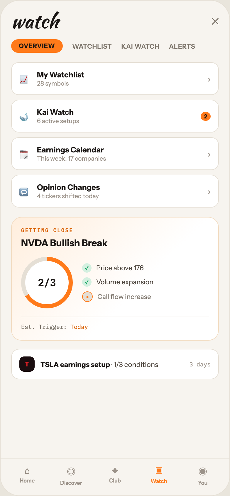

# 06 WATCH

Canvas: **CHEAT CODE · LIGHT THEME · SAME SYSTEM** · board index 5 · slug `06-watch`
Frame: **392×846px** (design width 392px — port at 390px logical, scale ratios).

> Style values are EXACT computed values from the canvas. `T.*` = canvas token, resolved in
> the Tokens appendix at the bottom of this file. Text marked `(MOCK)` must not ship as drawn —
> see `../../DELTA.md` for its substitution rule.

## Tree

- **“watch ✕ OVERVIEW WATCHLIST KAI WATCH ALE…”** → `
`
  - box: 392x846 · display: flex · dir: column · width: 390px · height: 844px · bg: T.orange-50 · border: 1px solid T.orange-100 · radius: 34px (T.r20) · overflow: hidden · type: color T.neutral-950 / Instrument Sans / 16px / w400 / lh normal
  - **“watch ✕ OVERVIEW WATCHLIST KAI WATCH ALE…”** → `
`
    - box: 390x781 · flex: 1 1 0% · flex-grow: 1 · flex-basis: 0% · pad: 18px 18px 0px 18px · overflow: hidden
    - **“watch ✕…”** → `
`
      - box: 354x34 · display: flex · align: center · justify: space-between
      - **"watch"** → `
`
        - box: 80.5x34 · type: color T.orange-900 / Kaushan Script / 34px / lh 34px · scale: T.ty2
        - text: "watch"
      - **"✕"** → ``
        - box: 12.2x20 · type: color T.neutral-500 · scale: T.ty36
        - text: "✕"
    - **“OVERVIEW WATCHLIST KAI WATCH ALERTS…”** → `
`
      - box: 354x23 · display: flex · align: center · gap: 16px · margin: 14px 0px 0px 0px
      - **"OVERVIEW"** → ``
        - box: 88x23 · pad: 5px 13px 5px 13px · bg: T.orange-400-b · radius: 16px (T.r16) · type: color T.orange-900 / 10.5px / w800 / ls 0.63px · scale: T.ty104
        - text: "OVERVIEW"
      - **"WATCHLIST"** → ``
        - box: 67.8x14 · type: color T.neutral-500 / 11px / w600 / ls 0.44px · scale: T.ty90
        - text: "WATCHLIST"
      - **"KAI WATCH"** → ``
        - box: 65.2x14 · type: color T.neutral-500 / 11px / w600 / ls 0.44px · scale: T.ty90
        - text: "KAI WATCH"
      - **"ALERTS"** → ``
        - box: 44.8x14 · type: color T.neutral-500 / 11px / w600 / ls 0.44px · scale: T.ty90
        - text: "ALERTS"
    - **“📈 My Watchlist 28 symbols › 🐋 Kai Watc…”** → `
`
      - box: 354x248 · display: flex · dir: column · gap: 8px · margin: 16px 0px 0px 0px
      - **“📈 My Watchlist 28 symbols ›…”** → `
`
        - box: 354x56 · display: flex · align: center · gap: 11px · pad: 12px 13px 12px 13px · bg: T.neutral-0 · border: 1px solid T.orange-100 · radius: 13px (T.r14)
        - **"📈"** → ``
          - box: 19x25 · type: 15px · scale: T.ty42
          - text: "📈"
        - **“My Watchlist 28 symbols…”** → `
`
          - box: 279.6x30 · flex: 1 1 0% · flex-grow: 1 · flex-basis: 0%
          - **"My Watchlist"** → `
`
            - box: 279.6x16 · type: color T.orange-900 / 13px / w700 · scale: T.ty58
            - text: "My Watchlist"
          - **"28 symbols"** → `
`
            - box: 279.6x13 · margin: 1px 0px 0px 0px · type: color T.orange-400 / 10.5px · scale: T.ty100
            - text: "28 symbols"
        - **"›"** → ``
          - box: 5.4x20 · type: color T.orange-400 · scale: T.ty36
          - text: "›"
      - **“🐋 Kai Watch 6 active setups 2…”** → `
`
        - box: 354x56 · display: flex · align: center · gap: 11px · pad: 12px 13px 12px 13px · bg: T.neutral-0 · border: 1px solid T.orange-100 · radius: 13px (T.r14)
        - **"🐋"** → ``
          - box: 19x25 · type: 15px · scale: T.ty42
          - text: "🐋"
        - **“Kai Watch 6 active setups…”** → `
`
          - box: 267.9x30 · flex: 1 1 0% · flex-grow: 1 · flex-basis: 0%
          - **"Kai Watch"** → `
`
            - box: 267.9x16 · type: color T.orange-900 / 13px / w700 · scale: T.ty58
            - text: "Kai Watch"
          - **"6 active setups"** → `
`
            - box: 267.9x13 · margin: 1px 0px 0px 0px · type: color T.orange-400 / 10.5px · scale: T.ty100
            - text: "6 active setups"
        - **"2"** → ``
          - box: 17.1x15 · pad: 2px 6px 2px 6px · bg: T.orange-400-b · radius: 8px (T.r9) · type: color T.orange-900 / 9px / w800 · scale: T.ty130
          - text: "2"
      - **“🗓 Earnings Calendar This week: 17 compa…”** → `
`
        - box: 354x56 · display: flex · align: center · gap: 11px · pad: 12px 13px 12px 13px · bg: T.neutral-0 · border: 1px solid T.orange-100 · radius: 13px (T.r14)
        - **"🗓"** → ``
          - box: 19x25 · type: 15px · scale: T.ty42
          - text: "🗓"
        - **“Earnings Calendar This week: 17 companie…”** → `
`
          - box: 279.6x30 · flex: 1 1 0% · flex-grow: 1 · flex-basis: 0%
          - **"Earnings Calendar"** → `
`
            - box: 279.6x16 · type: color T.orange-900 / 13px / w700 · scale: T.ty58
            - text: "Earnings Calendar"
          - **"This week: 17 companies"** → `
`
            - box: 279.6x13 · margin: 1px 0px 0px 0px · type: color T.orange-400 / 10.5px · scale: T.ty100
            - text: "This week: 17 companies"
        - **"›"** → ``
          - box: 5.4x20 · type: color T.orange-400 · scale: T.ty36
          - text: "›"
      - **“🔁 Opinion Changes 4 tickers shifted tod…”** → `
`
        - box: 354x56 · display: flex · align: center · gap: 11px · pad: 12px 13px 12px 13px · bg: T.neutral-0 · border: 1px solid T.orange-100 · radius: 13px (T.r14)
        - **"🔁"** → ``
          - box: 19x25 · type: 15px · scale: T.ty42
          - text: "🔁"
        - **“Opinion Changes 4 tickers shifted today…”** → `
`
          - box: 279.6x30 · flex: 1 1 0% · flex-grow: 1 · flex-basis: 0%
          - **"Opinion Changes"** → `
`
            - box: 279.6x16 · type: color T.orange-900 / 13px / w700 · scale: T.ty58
            - text: "Opinion Changes"
          - **"4 tickers shifted today"** → `
`
            - box: 279.6x13 · margin: 1px 0px 0px 0px · type: color T.orange-400 / 10.5px · scale: T.ty100
            - text: "4 tickers shifted today"
        - **"›"** → ``
          - box: 5.4x20 · type: color T.orange-400 · scale: T.ty36
          - text: "›"
    - **“GETTING CLOSE NVDA Bullish Break 2/3 ✓ P…”** → `
`
      - box: 354x211 · pad: 16px 16px 16px 16px · margin: 16px 0px 0px 0px · bg-image: linear-gradient(135deg, T.orange-50-b 0%, T.neutral-0 60%) · border: 1px solid T.orange-100-c · radius: 18px (T.r17)
      - **"Getting close"** → `
`
        - box: 320x11 · type: color T.orange-500 / IBM Plex Mono / 9px / w600 / ls 1.44px / uppercase · scale: T.ty131
        - text: "Getting close"
      - **"NVDA Bullish Break"** → `
`
        - box: 320x20 · margin: 6px 0px 0px 0px · type: color T.orange-900 / w700 · scale: T.ty40
        - text: "NVDA Bullish Break"
      - **“2/3 ✓ Price above 176 ✓ Volume expansion…”** → `
`
        - box: 320x88 · display: flex · align: center · gap: 16px · margin: 14px 0px 0px 0px
        - **“2/3…”** → `
`
          - box: 88x88 · width: 88px · height: 88px · flex: 0 0 auto · flex-shrink: 0 · position: relative [0px 0px 0px 0px]
          - **block[0]** → `
`
            - box: 88x88 · bg-image: conic-gradient(T.orange-400-b 0deg, T.orange-400-b 66%, T.orange-100 66%, T.orange-100 100%) · radius: 50% (T.r21) · position: absolute [0px 0px 0px 0px]
          - **“2/3…”** → `
`
            - box: 74x74 · display: grid · align: center · justify-items: center · grid-cols: 74px · grid-rows: 74px · bg: T.neutral-0 · radius: 50% (T.r21) · position: absolute [7px 7px 7px 7px]
            - **"2/3"** → ``
              - box: 30.6x22 · type: color T.orange-900 / IBM Plex Mono / 17px / w600 · scale: T.ty35
              - text: "2/3"
        - **“✓ Price above 176 ✓ Volume expansion ● C…”** → `
`
          - box: 216x66 · display: flex · dir: column · gap: 8px · flex: 1 1 0% · flex-grow: 1 · flex-basis: 0%
          - **"Price above 176"** → `
`
            - box: 216x16 · display: flex · align: center · gap: 8px · type: color T.orange-700 / 11.5px · scale: T.ty81
            - text: "Price above 176"
            - **"✓"** → ``
              - box: 16x16 · display: grid · align: center · justify-items: center · grid-cols: 16px · grid-rows: 16px · width: 16px · height: 16px · bg: T.green-100 · radius: 50% (T.r21) · type: color T.teal-600 / 9px · scale: T.ty128
              - text: "✓"
          - **"Volume expansion"** → `
`
            - box: 216x16 · display: flex · align: center · gap: 8px · type: color T.orange-700 / 11.5px · scale: T.ty81
            - text: "Volume expansion"
            - **"✓"** → ``
              - box: 16x16 · display: grid · align: center · justify-items: center · grid-cols: 16px · grid-rows: 16px · width: 16px · height: 16px · bg: T.green-100 · radius: 50% (T.r21) · type: color T.teal-600 / 9px · scale: T.ty128
              - text: "✓"
          - **"Call flow increase"** → `
`
            - box: 216x18 · display: flex · align: center · gap: 8px · type: color T.neutral-500 / 11.5px · scale: T.ty81
            - text: "Call flow increase"
            - **"●"** → ``
              - box: 18x18 · display: grid · align: center · justify-items: center · grid-cols: 16px · grid-rows: 16px · width: 16px · height: 16px · bg: T.orange-100 · border: 1px solid T.orange-400-b · radius: 50% (T.r21) · type: color T.orange-400-b / 8px · scale: T.ty148
              - text: "●"
      - **"Est. Trigger:"** → `
`
        - box: 320x24 · pad: 10px 0px 0px 0px · margin: 14px 0px 0px 0px · border: T:1px solid T.orange-100 R:0px none T.neutral-500 B:0px none T.neutral-500 L:0px none T.neutral-500 · type: color T.neutral-500 / IBM Plex Mono / 10px · scale: T.ty108
        - text: "Est. Trigger:"
        - **"Today"** → ``
          - box: 30x13 · display: inline · type: color T.orange-500 · scale: T.ty108
          - text: "Today"
    - **“T TSLA earnings setup · 1/3 conditions 3…”** → `
`
      - box: 354x52 · display: flex · align: center · gap: 10px · pad: 12px 13px 12px 13px · margin: 14px 0px 0px 0px · bg: T.neutral-0 · border: 1px solid T.orange-100 · radius: 14px (T.r15)
      - **"T"** → `
`
        - box: 26x26 · display: grid · align: center · justify-items: center · grid-cols: 26px · grid-rows: 26px · width: 26px · height: 26px · bg: T.red-900 · radius: 8px (T.r9) · type: color T.red-400-b / 11px / w800 · scale: T.ty91
        - text: "T"
      - **"· 1/3 conditions"** → `
`
        - box: 244x15 · flex: 1 1 0% · flex-grow: 1 · flex-basis: 0% · type: color T.orange-700 / 12px · scale: T.ty71
        - text: "· 1/3 conditions"
        - **"TSLA earnings setup"** → `<strong>`
          - box: 118.6x15 · display: inline · type: color T.orange-900 / w700 · scale: T.ty72
          - text: "TSLA earnings setup"
      - **"3 days"** → ``
        - box: 36x13 · type: color T.orange-400 / IBM Plex Mono / 10px · scale: T.ty108
        - text: "3 days"
  - **“⌂ Home ◎ Discover ✦ Club ▣ Watch ◉ You…”** → `
`
    - box: 390x63 · display: flex · pad: 10px 8px 16px 8px · bg: T.orange-50 · border: T:1px solid T.orange-100 R:0px none T.neutral-950 B:0px none T.neutral-950 L:0px none T.neutral-950
    - **“⌂ Home…”** → `
`
      - box: 74.8x36 · flex: 1 1 0% · flex-grow: 1 · flex-basis: 0% · type: align-center
      - **"⌂"** → `
`
        - box: 74.8x19 · type: color T.orange-400 / 15px · scale: T.ty42
        - text: "⌂"
      - **"Home"** → `
`
        - box: 74.8x11 · margin: 2px 0px 0px 0px · type: color T.orange-400 / 9px / w600 · scale: T.ty126
        - text: "Home"
    - **“◎ Discover…”** → `
`
      - box: 74.8x36 · flex: 1 1 0% · flex-grow: 1 · flex-basis: 0% · type: align-center
      - **"◎"** → `
`
        - box: 74.8x23 · type: color T.orange-400 / 15px · scale: T.ty42
        - text: "◎"
      - **"Discover"** → `
`
        - box: 74.8x11 · margin: 2px 0px 0px 0px · type: color T.orange-400 / 9px / w600 · scale: T.ty126
        - text: "Discover"
    - **“✦ Club…”** → `
`
      - box: 74.8x36 · flex: 1 1 0% · flex-grow: 1 · flex-basis: 0% · type: align-center
      - **"✦"** → `
`
        - box: 74.8x19 · type: color T.orange-400 / 15px · scale: T.ty42
        - text: "✦"
      - **"Club"** → `
`
        - box: 74.8x11 · margin: 2px 0px 0px 0px · type: color T.orange-400 / 9px / w600 · scale: T.ty126
        - text: "Club"
    - **“▣ Watch…”** → `
`
      - box: 74.8x36 · flex: 1 1 0% · flex-grow: 1 · flex-basis: 0% · type: align-center
      - **"▣"** → `
`
        - box: 74.8x20 · type: color T.orange-400-b / 15px · scale: T.ty42
        - text: "▣"
      - **"Watch"** → `
`
        - box: 74.8x11 · margin: 2px 0px 0px 0px · type: color T.orange-400-b / 9px / w700 · scale: T.ty129
        - text: "Watch"
    - **“◉ You…”** → `
`
      - box: 74.8x36 · flex: 1 1 0% · flex-grow: 1 · flex-basis: 0% · type: align-center
      - **"◉"** → `
`
        - box: 74.8x23 · type: color T.orange-400 / 15px · scale: T.ty42
        - text: "◉"
      - **"You"** → `
`
        - box: 74.8x11 · margin: 2px 0px 0px 0px · type: color T.orange-400 / 9px / w600 · scale: T.ty126
        - text: "You"

## Tokens used in this board

| token | value | role |
| --- | --- | --- |
| T.orange-100 | `#E5DFD5` | border, bg, gradient |
| T.orange-900 | `#1A1614` | text, bg, border |
| T.orange-400 | `#9B9289` | text, bg |
| T.neutral-0 | `#FFFFFF` | bg, gradient, border, text |
| T.neutral-500 | `#7B7369` | text, border, bg |
| T.orange-400-b | `#FF7A1A` | bg, text, border, gradient |
| T.neutral-950 | `#000000` | border, text |
| T.teal-600 | `#0BA05A` | text, gradient, border, bg |
| T.orange-50 | `#F7F4EF` | bg, border, text, gradient |
| T.orange-500 | `#D95E00` | text |
| T.orange-700 | `#4E463E` | text |
| T.orange-100-c | `#F2DCC2` | border, bg |
| T.orange-50-b | `#FFEEDD` | gradient |
| T.red-900 | `#1A0E10` | bg, gradient |
| T.green-100 | `#D4F0E0` | bg |
| T.red-400-b | `#E82127` | text |
| T.ty2 | Kaushan Script 34px/34px w400 ls:normal | type scale |
| T.ty35 | IBM Plex Mono 17px/normal w600 ls:normal | type scale |
| T.ty36 | Instrument Sans 16px/normal w400 ls:normal | type scale |
| T.ty40 | Instrument Sans 16px/normal w700 ls:normal | type scale |
| T.ty42 | Instrument Sans 15px/normal w400 ls:normal | type scale |
| T.ty58 | Instrument Sans 13px/normal w700 ls:normal | type scale |
| T.ty71 | Instrument Sans 12px/normal w400 ls:normal | type scale |
| T.ty72 | Instrument Sans 12px/normal w700 ls:normal | type scale |
| T.ty81 | Instrument Sans 11.5px/normal w400 ls:normal | type scale |
| T.ty90 | Instrument Sans 11px/normal w600 ls:0.44px | type scale |
| T.ty91 | Instrument Sans 11px/normal w800 ls:normal | type scale |
| T.ty100 | Instrument Sans 10.5px/normal w400 ls:normal | type scale |
| T.ty104 | Instrument Sans 10.5px/normal w800 ls:0.63px | type scale |
| T.ty108 | IBM Plex Mono 10px/normal w400 ls:normal | type scale |
| T.ty126 | Instrument Sans 9px/normal w600 ls:normal | type scale |
| T.ty128 | Instrument Sans 9px/normal w400 ls:normal | type scale |
| T.ty129 | Instrument Sans 9px/normal w700 ls:normal | type scale |
| T.ty130 | Instrument Sans 9px/normal w800 ls:normal | type scale |
| T.ty131 | IBM Plex Mono 9px/normal w600 ls:1.44px uppercase | type scale |
| T.ty148 | Instrument Sans 8px/normal w400 ls:normal | type scale |
| T.r9 | `8px` | radius |
| T.r14 | `13px` | radius |
| T.r15 | `14px` | radius |
| T.r16 | `16px` | radius |
| T.r17 | `18px` | radius |
| T.r20 | `34px` | radius |
| T.r21 | `50%` | radius |
