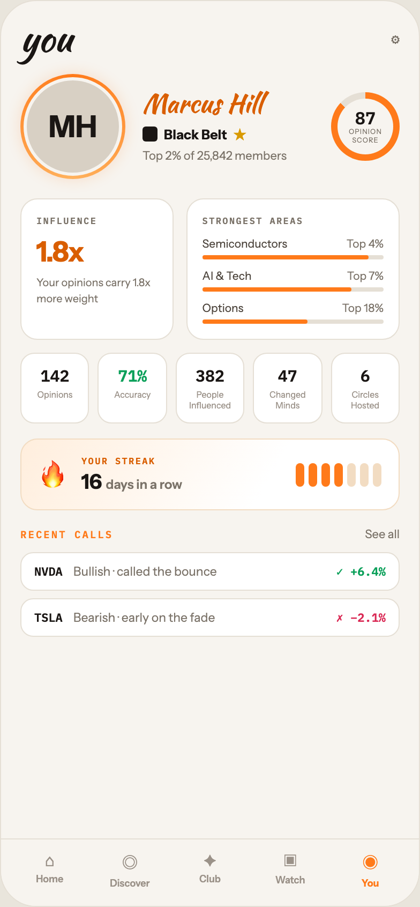

# 07 YOU · PROFILE

Canvas: **CHEAT CODE · LIGHT THEME · SAME SYSTEM** · board index 6 · slug `07-you-profile`
Frame: **392×846px** (design width 392px — port at 390px logical, scale ratios).

> Style values are EXACT computed values from the canvas. `T.*` = canvas token, resolved in
> the Tokens appendix at the bottom of this file. Text marked `(MOCK)` must not ship as drawn —
> see `../../DELTA.md` for its substitution rule.

## Tree

- **“you ⚙ MH Marcus Hill Black Belt ★ Top 2%…”** → `
`
  - box: 392x846 · display: flex · dir: column · width: 390px · height: 844px · bg: T.orange-50 · border: 1px solid T.orange-100 · radius: 34px (T.r20) · overflow: hidden · type: color T.neutral-950 / Instrument Sans / 16px / w400 / lh normal
  - **“you ⚙ MH Marcus Hill Black Belt ★ Top 2%…”** → `
`
    - box: 390x781 · flex: 1 1 0% · flex-grow: 1 · flex-basis: 0% · pad: 18px 18px 0px 18px · overflow: hidden
    - **“you ⚙…”** → `
`
      - box: 354x34 · display: flex · align: center · justify: space-between
      - **"you"** → `
`
        - box: 48.4x34 · type: color T.orange-900 / Kaushan Script / 34px / lh 34px · scale: T.ty2
        - text: "you"
      - **"⚙"** → ``
        - box: 7.8x16 · type: color T.neutral-500 / 13px · scale: T.ty59
        - text: "⚙"
    - **“MH Marcus Hill Black Belt ★ Top 2% of 25…”** → `
`
      - box: 354x98 · display: flex · align: center · gap: 16px · margin: 16px 0px 0px 0px
      - **“MH…”** → `
`
        - box: 98x98 · width: 92px · height: 92px · flex: 0 0 auto · flex-shrink: 0 · pad: 3px 3px 3px 3px · bg-image: conic-gradient(T.orange-400-b, T.orange-300, T.orange-400-b) · radius: 50% (T.r21) · shadow: T.orange-400a18 0px 0px 14px 0px
        - **"MH"** → `
`
          - box: 92x92 · display: grid · align: center · justify-items: center · grid-cols: 86px · grid-rows: 86px · width: 100% · height: 100% · bg: T.orange-100-b · border: 3px solid T.orange-50 · radius: 50% (T.r21) · type: color T.orange-900 / 28px / w800 · scale: T.ty8
          - text: "MH"
      - **“Marcus Hill Black Belt ★ Top 2% of 25,84…”** → `
`
        - box: 160x68.4 · flex: 1 1 0% · flex-grow: 1 · flex-basis: 0%
        - **"Marcus Hill"** → `
`
          - box: 160x26.4 · type: color T.orange-500 / Kaushan Script / 24px / lh 26.4px · scale: T.ty16
          - text: "Marcus Hill"
        - **“Black Belt ★…”** → `
`
          - box: 160x18 · display: flex · align: center · gap: 6px · margin: 6px 0px 0px 0px
          - **block[0]** → ``
            - box: 14x14 · width: 14px · height: 14px · bg: T.orange-900 · radius: 3px (T.r4)
          - **"Black Belt"** → ``
            - box: 58.9x15 · type: color T.orange-900 / 12.5px / w700 · scale: T.ty65
            - text: "Black Belt"
          - **"★"** → ``
            - box: 12x18 · type: color T.amber-500 / 12px · scale: T.ty71
            - text: "★"
        - **"Top 2% of 25,842 members"** **(MOCK)** → `
`
          - box: 160x14 · margin: 4px 0px 0px 0px · type: color T.neutral-500 / 11px · scale: T.ty88
          - text: "Top 2% of 25,842 members"
      - **“87 OPINION SCORE…”** → `
`
        - box: 64x64 · display: grid · align: center · justify-items: center · grid-cols: 64px · grid-rows: 64px · width: 64px · height: 64px · flex: 0 0 auto · flex-shrink: 0 · bg-image: conic-gradient(T.orange-400-b 0deg, T.orange-400-b 87%, T.orange-100 87%, T.orange-100 100%) · radius: 50% (T.r21)
        - **“87 OPINION SCORE…”** → `
`
          - box: 52x52 · display: grid · align: center · justify-items: center · grid-cols: 52px · grid-rows: 52px · width: 52px · height: 52px · bg: T.orange-50 · radius: 50% (T.r21) · type: align-center
          - **“87 OPINION SCORE…”** → `
`
            - box: 31x33
            - **"87"** → `
`
              - box: 31x16 · type: color T.orange-900 / IBM Plex Mono / w600 / lh 16px · scale: T.ty41
              - text: "87"
            - **"OPINIONSCORE"** → `
`
              - box: 31x16 · margin: 1px 0px 0px 0px · type: color T.neutral-500 / 6.5px / ls 0.52px · scale: T.ty156
              - text: "OPINIONSCORE"
              - **block[0]** → ` `
                - box: 0x8 · display: inline
    - **“INFLUENCE 1.8x Your opinions carry 1.8x …”** → `
`
      - box: 354x132 · display: flex · gap: 12px · margin: 18px 0px 0px 0px
      - **“INFLUENCE 1.8x Your opinions carry 1.8x …”** → `
`
        - box: 142.8x132 · flex: 1 1 0% · flex-grow: 1 · flex-basis: 0% · pad: 14px 14px 14px 14px · bg: T.neutral-0 · border: 1px solid T.orange-100 · radius: 16px (T.r16)
        - **"Influence"** → `
`
          - box: 112.8x11 · type: color T.neutral-500 / IBM Plex Mono / 8.5px / w600 / ls 1.19px / uppercase · scale: T.ty140
          - text: "Influence"
        - **"1.8x"** → `
`
          - box: 112.8x32 · margin: 8px 0px 0px 0px · type: color T.orange-500 / 26px / w800 / ls -0.52px · scale: T.ty13
          - text: "1.8x"
        - **"Your opinions carry 1.8x more weight"** → `
`
          - box: 112.8x29 · margin: 6px 0px 0px 0px · type: color T.neutral-500 / 10px / lh 14.5px · scale: T.ty113
          - text: "Your opinions carry 1.8x more weight"
      - **“STRONGEST AREAS Semiconductors Top 4% AI…”** → `
`
        - box: 199.2x132 · flex: 1.5 1 0% · flex-grow: 1.5 · flex-basis: 0% · pad: 14px 14px 14px 14px · bg: T.neutral-0 · border: 1px solid T.orange-100 · radius: 16px (T.r16)
        - **"Strongest areas"** → `
`
          - box: 169.2x11 · type: color T.neutral-500 / IBM Plex Mono / 8.5px / w600 / ls 1.19px / uppercase · scale: T.ty140
          - text: "Strongest areas"
        - **“Semiconductors Top 4%…”** → `
`
          - box: 169.2x21 · margin: 10px 0px 0px 0px
          - **“Semiconductors Top 4%…”** → `
`
            - box: 169.2x13 · display: flex · justify: space-between · type: color T.orange-700 / 10.5px
            - **"Semiconductors"** → ``
              - box: 79.3x13 · scale: T.ty100
              - text: "Semiconductors"
            - **"Top 4%"** **(MOCK)** → ``
              - box: 34.6x13 · type: color T.neutral-500 · scale: T.ty100
              - text: "Top 4%"
          - **block[1]** → `
`
            - box: 169.2x4 · height: 4px · margin: 4px 0px 0px 0px · bg: T.orange-100 · radius: 2px (T.r3)
            - **block[0]** → `
`
              - box: 155.7x4 · width: 92% · height: 100% · bg: T.orange-400-b · radius: 2px (T.r3)
        - **“AI & Tech Top 7%…”** → `
`
          - box: 169.2x21 · margin: 9px 0px 0px 0px
          - **“AI & Tech Top 7%…”** → `
`
            - box: 169.2x13 · display: flex · justify: space-between · type: color T.orange-700 / 10.5px
            - **"AI & Tech"** → ``
              - box: 45.9x13 · scale: T.ty100
              - text: "AI & Tech"
            - **"Top 7%"** **(MOCK)** → ``
              - box: 34.1x13 · type: color T.neutral-500 · scale: T.ty100
              - text: "Top 7%"
          - **block[1]** → `
`
            - box: 169.2x4 · height: 4px · margin: 4px 0px 0px 0px · bg: T.orange-100 · radius: 2px (T.r3)
            - **block[0]** → `
`
              - box: 138.7x4 · width: 82% · height: 100% · bg: T.orange-400-b · radius: 2px (T.r3)
        - **“Options Top 18%…”** → `
`
          - box: 169.2x21 · margin: 9px 0px 0px 0px
          - **“Options Top 18%…”** → `
`
            - box: 169.2x13 · display: flex · justify: space-between · type: color T.orange-700 / 10.5px
            - **"Options"** → ``
              - box: 38.4x13 · scale: T.ty100
              - text: "Options"
            - **"Top 18%"** **(MOCK)** → ``
              - box: 38.8x13 · type: color T.neutral-500 · scale: T.ty100
              - text: "Top 18%"
          - **block[1]** → `
`
            - box: 169.2x4 · height: 4px · margin: 4px 0px 0px 0px · bg: T.orange-100 · radius: 2px (T.r3)
            - **block[0]** → `
`
              - box: 98.1x4 · width: 58% · height: 100% · bg: T.orange-400-b · radius: 2px (T.r3)
    - **“142 Opinions 71% Accuracy 382 People Inf…”** → `
`
      - box: 354x66 · display: flex · gap: 8px · margin: 12px 0px 0px 0px
      - **“142 Opinions…”** → `
`
        - box: 64.4x66 · flex: 1 1 0% · flex-grow: 1 · flex-basis: 0% · pad: 11px 6px 11px 6px · bg: T.neutral-0 · border: 1px solid T.orange-100 · radius: 13px (T.r14) · type: align-center
        - **"142"** → `
`
          - box: 50.4x19 · type: color T.orange-900 / IBM Plex Mono / 15px / w600 · scale: T.ty44
          - text: "142"
        - **"Opinions"** → `
`
          - box: 50.4x10 · margin: 3px 0px 0px 0px · type: color T.orange-400 / 8px · scale: T.ty148
          - text: "Opinions"
      - **“71% Accuracy…”** → `
`
        - box: 64.4x66 · flex: 1 1 0% · flex-grow: 1 · flex-basis: 0% · pad: 11px 6px 11px 6px · bg: T.neutral-0 · border: 1px solid T.orange-100 · radius: 13px (T.r14) · type: align-center
        - **"71%"** **(MOCK)** → `
`
          - box: 50.4x19 · type: color T.teal-600 / IBM Plex Mono / 15px / w600 · scale: T.ty44
          - text: "71%"
        - **"Accuracy"** → `
`
          - box: 50.4x10 · margin: 3px 0px 0px 0px · type: color T.orange-400 / 8px · scale: T.ty148
          - text: "Accuracy"
      - **“382 People Influenced…”** → `
`
        - box: 64.4x66 · flex: 1 1 0% · flex-grow: 1 · flex-basis: 0% · pad: 11px 6px 11px 6px · bg: T.neutral-0 · border: 1px solid T.orange-100 · radius: 13px (T.r14) · type: align-center
        - **"382"** → `
`
          - box: 50.4x19 · type: color T.orange-900 / IBM Plex Mono / 15px / w600 · scale: T.ty44
          - text: "382"
        - **"People Influenced"** → `
`
          - box: 50.4x20 · margin: 3px 0px 0px 0px · type: color T.orange-400 / 8px · scale: T.ty148
          - text: "People Influenced"
      - **“47 Changed Minds…”** → `
`
        - box: 64.4x66 · flex: 1 1 0% · flex-grow: 1 · flex-basis: 0% · pad: 11px 6px 11px 6px · bg: T.neutral-0 · border: 1px solid T.orange-100 · radius: 13px (T.r14) · type: align-center
        - **"47"** → `
`
          - box: 50.4x19 · type: color T.orange-900 / IBM Plex Mono / 15px / w600 · scale: T.ty44
          - text: "47"
        - **"Changed Minds"** → `
`
          - box: 50.4x20 · margin: 3px 0px 0px 0px · type: color T.orange-400 / 8px · scale: T.ty148
          - text: "Changed Minds"
      - **“6 Circles Hosted…”** → `
`
        - box: 64.4x66 · flex: 1 1 0% · flex-grow: 1 · flex-basis: 0% · pad: 11px 6px 11px 6px · bg: T.neutral-0 · border: 1px solid T.orange-100 · radius: 13px (T.r14) · type: align-center
        - **"6"** → `
`
          - box: 50.4x19 · type: color T.orange-900 / IBM Plex Mono / 15px / w600 · scale: T.ty44
          - text: "6"
        - **"Circles Hosted"** → `
`
          - box: 50.4x20 · margin: 3px 0px 0px 0px · type: color T.orange-400 / 8px · scale: T.ty148
          - text: "Circles Hosted"
    - **“🔥 YOUR STREAK 16 days in a row…”** → `
`
      - box: 354x67 · display: flex · align: center · gap: 14px · pad: 14px 16px 14px 16px · margin: 14px 0px 0px 0px · bg-image: linear-gradient(120deg, T.orange-50-b 0%, T.neutral-0 65%) · border: 1px solid T.orange-100-c · radius: 16px (T.r16)
      - **"🔥"** → `
`
        - box: 26x34 · type: 26px · scale: T.ty9
        - text: "🔥"
      - **“YOUR STREAK 16 days in a row…”** → `
`
        - box: 186x37 · flex: 1 1 0% · flex-grow: 1 · flex-basis: 0%
        - **"Your streak"** → `
`
          - box: 186x11 · type: color T.orange-500 / IBM Plex Mono / 8.5px / w600 / ls 1.19px / uppercase · scale: T.ty140
          - text: "Your streak"
        - **"16"** → `
`
          - box: 186x23 · margin: 3px 0px 0px 0px · type: color T.orange-900 / 19px / w800 · scale: T.ty27
          - text: "16"
          - **"days in a row"** → ``
            - box: 71.4x15 · display: inline · type: color T.neutral-500 / 12px / w600 · scale: T.ty78
            - text: "days in a row"
      - **block[2]** → `
`
        - box: 80x22 · display: flex · gap: 4px
        - **block[0]** → ``
          - box: 8x22 · width: 8px · height: 22px · bg: T.orange-400-b · radius: 4px (T.r5)
        - **block[1]** → ``
          - box: 8x22 · width: 8px · height: 22px · bg: T.orange-400-b · radius: 4px (T.r5)
        - **block[2]** → ``
          - box: 8x22 · width: 8px · height: 22px · bg: T.orange-400-b · radius: 4px (T.r5)
        - **block[3]** → ``
          - box: 8x22 · width: 8px · height: 22px · bg: T.orange-400-b · radius: 4px (T.r5)
        - **block[4]** → ``
          - box: 8x22 · width: 8px · height: 22px · bg: T.orange-100-c · radius: 4px (T.r5)
        - **block[5]** → ``
          - box: 8x22 · width: 8px · height: 22px · bg: T.orange-100-c · radius: 4px (T.r5)
        - **block[6]** → ``
          - box: 8x22 · width: 8px · height: 22px · bg: T.orange-100-c · radius: 4px (T.r5)
    - **“RECENT CALLS See all…”** → `
`
      - box: 354x14 · display: flex · align: baseline · justify: space-between · margin: 15px 0px 0px 0px
      - **"Recent calls"** → ``
        - box: 86.6x13 · type: color T.orange-400-b / IBM Plex Mono / 9.5px / w600 / ls 1.52px / uppercase · scale: T.ty118
        - text: "Recent calls"
      - **"See all"** → ``
        - box: 32.4x14 · type: color T.neutral-500 / 11px · scale: T.ty88
        - text: "See all"
    - **“NVDA Bullish · called the bounce ✓ +6.4%…”** → `
`
      - box: 354x79 · display: flex · dir: column · gap: 7px · margin: 10px 0px 0px 0px
      - **“NVDA Bullish · called the bounce ✓ +6.4%…”** → `
`
        - box: 354x36 · display: flex · align: center · gap: 10px · pad: 10px 12px 10px 12px · bg: T.neutral-0 · border: 1px solid T.orange-100 · radius: 12px (T.r13)
        - **"NVDA"** → ``
          - box: 26.4x14 · type: color T.orange-900 / IBM Plex Mono / 11px / w600 · scale: T.ty87
          - text: "NVDA"
        - **"Bullish · called the bounce"** → ``
          - box: 235.4x14 · flex: 1 1 0% · flex-grow: 1 · flex-basis: 0% · type: color T.neutral-500 / 11.5px · scale: T.ty81
          - text: "Bullish · called the bounce"
        - **"✓ +6.4%"** **(MOCK)** → ``
          - box: 46.2x14 · type: color T.teal-600 / IBM Plex Mono / 11px / w600 · scale: T.ty87
          - text: "✓ +6.4%"
      - **“TSLA Bearish · early on the fade ✗ −2.1%…”** → `
`
        - box: 354x36 · display: flex · align: center · gap: 10px · pad: 10px 12px 10px 12px · bg: T.neutral-0 · border: 1px solid T.orange-100 · radius: 12px (T.r13)
        - **"TSLA"** → ``
          - box: 26.4x14 · type: color T.orange-900 / IBM Plex Mono / 11px / w600 · scale: T.ty87
          - text: "TSLA"
        - **"Bearish · early on the fade"** → ``
          - box: 235.4x14 · flex: 1 1 0% · flex-grow: 1 · flex-basis: 0% · type: color T.neutral-500 / 11.5px · scale: T.ty81
          - text: "Bearish · early on the fade"
        - **"✗ −2.1%"** **(MOCK)** → ``
          - box: 46.2x14 · type: color T.red-400 / IBM Plex Mono / 11px / w600 · scale: T.ty87
          - text: "✗ −2.1%"
  - **“⌂ Home ◎ Discover ✦ Club ▣ Watch ◉ You…”** → `
`
    - box: 390x63 · display: flex · pad: 10px 8px 16px 8px · bg: T.orange-50 · border: T:1px solid T.orange-100 R:0px none T.neutral-950 B:0px none T.neutral-950 L:0px none T.neutral-950
    - **“⌂ Home…”** → `
`
      - box: 74.8x36 · flex: 1 1 0% · flex-grow: 1 · flex-basis: 0% · type: align-center
      - **"⌂"** → `
`
        - box: 74.8x19 · type: color T.orange-400 / 15px · scale: T.ty42
        - text: "⌂"
      - **"Home"** → `
`
        - box: 74.8x11 · margin: 2px 0px 0px 0px · type: color T.orange-400 / 9px / w600 · scale: T.ty126
        - text: "Home"
    - **“◎ Discover…”** → `
`
      - box: 74.8x36 · flex: 1 1 0% · flex-grow: 1 · flex-basis: 0% · type: align-center
      - **"◎"** → `
`
        - box: 74.8x23 · type: color T.orange-400 / 15px · scale: T.ty42
        - text: "◎"
      - **"Discover"** → `
`
        - box: 74.8x11 · margin: 2px 0px 0px 0px · type: color T.orange-400 / 9px / w600 · scale: T.ty126
        - text: "Discover"
    - **“✦ Club…”** → `
`
      - box: 74.8x36 · flex: 1 1 0% · flex-grow: 1 · flex-basis: 0% · type: align-center
      - **"✦"** → `
`
        - box: 74.8x19 · type: color T.orange-400 / 15px · scale: T.ty42
        - text: "✦"
      - **"Club"** → `
`
        - box: 74.8x11 · margin: 2px 0px 0px 0px · type: color T.orange-400 / 9px / w600 · scale: T.ty126
        - text: "Club"
    - **“▣ Watch…”** → `
`
      - box: 74.8x36 · flex: 1 1 0% · flex-grow: 1 · flex-basis: 0% · type: align-center
      - **"▣"** → `
`
        - box: 74.8x20 · type: color T.orange-400 / 15px · scale: T.ty42
        - text: "▣"
      - **"Watch"** → `
`
        - box: 74.8x11 · margin: 2px 0px 0px 0px · type: color T.orange-400 / 9px / w600 · scale: T.ty126
        - text: "Watch"
    - **“◉ You…”** → `
`
      - box: 74.8x36 · flex: 1 1 0% · flex-grow: 1 · flex-basis: 0% · type: align-center
      - **"◉"** → `
`
        - box: 74.8x23 · type: color T.orange-400-b / 15px · scale: T.ty42
        - text: "◉"
      - **"You"** → `
`
        - box: 74.8x11 · margin: 2px 0px 0px 0px · type: color T.orange-400-b / 9px / w700 · scale: T.ty129
        - text: "You"

## Tokens used in this board

| token | value | role |
| --- | --- | --- |
| T.orange-100 | `#E5DFD5` | border, bg, gradient |
| T.orange-900 | `#1A1614` | text, bg, border |
| T.orange-400 | `#9B9289` | text, bg |
| T.neutral-0 | `#FFFFFF` | bg, gradient, border, text |
| T.neutral-500 | `#7B7369` | text, border, bg |
| T.orange-400-b | `#FF7A1A` | bg, text, border, gradient |
| T.neutral-950 | `#000000` | border, text |
| T.teal-600 | `#0BA05A` | text, gradient, border, bg |
| T.orange-50 | `#F7F4EF` | bg, border, text, gradient |
| T.orange-500 | `#D95E00` | text |
| T.orange-700 | `#4E463E` | text |
| T.orange-100-b | `#D8D0C4` | bg, border |
| T.red-400 | `#D92652` | text, gradient, bg, border |
| T.amber-500 | `#D99A00` | text, gradient, border, bg |
| T.orange-100-c | `#F2DCC2` | border, bg |
| T.orange-50-b | `#FFEEDD` | gradient |
| T.orange-400a18 | `#FF7A1A/0.18` | shadow, bg |
| T.orange-300 | `#FFB25E` | gradient |
| T.ty2 | Kaushan Script 34px/34px w400 ls:normal | type scale |
| T.ty8 | Instrument Sans 28px/normal w800 ls:normal | type scale |
| T.ty9 | Instrument Sans 26px/normal w400 ls:normal | type scale |
| T.ty13 | Instrument Sans 26px/normal w800 ls:-0.52px | type scale |
| T.ty16 | Kaushan Script 24px/26.4px w400 ls:normal | type scale |
| T.ty27 | Instrument Sans 19px/normal w800 ls:normal | type scale |
| T.ty41 | IBM Plex Mono 16px/16px w600 ls:normal | type scale |
| T.ty42 | Instrument Sans 15px/normal w400 ls:normal | type scale |
| T.ty44 | IBM Plex Mono 15px/normal w600 ls:normal | type scale |
| T.ty59 | Instrument Sans 13px/normal w400 ls:normal | type scale |
| T.ty65 | Instrument Sans 12.5px/normal w700 ls:normal | type scale |
| T.ty71 | Instrument Sans 12px/normal w400 ls:normal | type scale |
| T.ty78 | Instrument Sans 12px/normal w600 ls:normal | type scale |
| T.ty81 | Instrument Sans 11.5px/normal w400 ls:normal | type scale |
| T.ty87 | IBM Plex Mono 11px/normal w600 ls:normal | type scale |
| T.ty88 | Instrument Sans 11px/normal w400 ls:normal | type scale |
| T.ty100 | Instrument Sans 10.5px/normal w400 ls:normal | type scale |
| T.ty113 | Instrument Sans 10px/14.5px w400 ls:normal | type scale |
| T.ty118 | IBM Plex Mono 9.5px/normal w600 ls:1.52px uppercase | type scale |
| T.ty126 | Instrument Sans 9px/normal w600 ls:normal | type scale |
| T.ty129 | Instrument Sans 9px/normal w700 ls:normal | type scale |
| T.ty140 | IBM Plex Mono 8.5px/normal w600 ls:1.19px uppercase | type scale |
| T.ty148 | Instrument Sans 8px/normal w400 ls:normal | type scale |
| T.ty156 | Instrument Sans 6.5px/normal w400 ls:0.52px | type scale |
| T.r3 | `2px` | radius |
| T.r4 | `3px` | radius |
| T.r5 | `4px` | radius |
| T.r13 | `12px` | radius |
| T.r14 | `13px` | radius |
| T.r16 | `16px` | radius |
| T.r20 | `34px` | radius |
| T.r21 | `50%` | radius |
