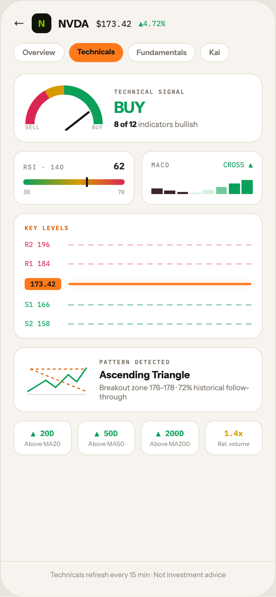

# 12 TICKER · TECHNICALS

Canvas: **CHEAT CODE · LIGHT THEME · SAME SYSTEM** · board index 11 · slug `12-ticker-technicals`
Frame: **392×846px** (design width 392px — port at 390px logical, scale ratios).

> Style values are EXACT computed values from the canvas. `T.*` = canvas token, resolved in
> the Tokens appendix at the bottom of this file. Text marked `(MOCK)` must not ship as drawn —
> see `../../DELTA.md` for its substitution rule.

## Tree

- **“← N NVDA $173.42 ▲4.72% Overview Technic…”** → `
`
  - box: 392x846 · display: flex · dir: column · width: 390px · height: 844px · bg: T.orange-50 · border: 1px solid T.orange-100 · radius: 34px (T.r20) · overflow: hidden · type: color T.neutral-950 / Instrument Sans / 16px / w400 / lh normal
  - **“← N NVDA $173.42 ▲4.72% Overview Technic…”** → `
`
    - box: 390x794 · flex: 1 1 0% · flex-grow: 1 · flex-basis: 0% · pad: 18px 18px 0px 18px · overflow: hidden
    - **“← N NVDA $173.42 ▲4.72%…”** → `
`
      - box: 354x28 · display: flex · align: center · gap: 10px
      - **"←"** → ``
        - box: 16x20 · type: color T.orange-700 · scale: T.ty36
        - text: "←"
      - **"N"** → `
`
        - box: 28x28 · display: grid · align: center · justify-items: center · grid-cols: 28px · grid-rows: 28px · width: 28px · height: 28px · bg: T.lime-900 · radius: 8px (T.r9) · type: color T.lime-600 / 13px / w800 · scale: T.ty61
        - text: "N"
      - **"NVDA"** → ``
        - box: 43.5x19 · type: color T.orange-900 / 15px / w800 · scale: T.ty43
        - text: "NVDA"
      - **"$173.42"** **(MOCK)** → ``
        - box: 50.4x15 · type: color T.orange-900 / IBM Plex Mono / 12px · scale: T.ty74
        - text: "$173.42"
      - **"▲4.72%"** **(MOCK)** → ``
        - box: 37.8x14 · type: color T.teal-600 / IBM Plex Mono / 10.5px · scale: T.ty102
        - text: "▲4.72%"
    - **“Overview Technicals Fundamentals Kai…”** → `
`
      - box: 354x27 · display: flex · gap: 6px · margin: 14px 0px 0px 0px
      - **"Overview"** → ``
        - box: 72.5x27 · pad: 6px 12px 6px 12px · bg: T.neutral-0 · border: 1px solid T.orange-100 · radius: 16px (T.r16) · type: color T.neutral-500 / 10.5px / w600 · scale: T.ty101
        - text: "Overview"
      - **"Technicals"** → ``
        - box: 77.5x27 · pad: 6px 12px 6px 12px · bg: T.orange-400-b · radius: 16px (T.r16) · type: color T.orange-900 / 10.5px / w800 · scale: T.ty105
        - text: "Technicals"
      - **"Fundamentals"** → ``
        - box: 97x27 · pad: 6px 12px 6px 12px · bg: T.neutral-0 · border: 1px solid T.orange-100 · radius: 16px (T.r16) · type: color T.neutral-500 / 10.5px / w600 · scale: T.ty101
        - text: "Fundamentals"
      - **"Kai"** → ``
        - box: 41.6x27 · pad: 6px 12px 6px 12px · bg: T.neutral-0 · border: 1px solid T.orange-100 · radius: 16px (T.r16) · type: color T.neutral-500 / 10.5px / w600 · scale: T.ty101
        - text: "Kai"
    - **“SELL BUY TECHNICAL SIGNAL BUY 8 of 12 in…”** → `
`
      - box: 354x98 · display: flex · align: center · gap: 16px · pad: 16px 16px 16px 16px · margin: 16px 0px 0px 0px · bg: T.neutral-0 · border: 1px solid T.orange-100 · radius: 18px (T.r17)
      - **“SELL BUY…”** → `
`
        - box: 110x64 · width: 110px · height: 64px · flex: 0 0 auto · flex-shrink: 0 · overflow: hidden · position: relative [0px 0px 0px 0px]
        - **block[0]** → `
`
          - box: 110x110 · height: 110px · bg-image: conic-gradient(from 270deg, T.red-400 0deg, T.red-400 60deg, T.amber-500 60deg, T.amber-500 90deg, T.teal-600 90deg, T.teal-600 180deg, T.neutral-950a00 180deg) · radius: 50% (T.r21) · position: absolute [0px 0px -46px 0px]
        - **block[1]** → `
`
          - box: 84x84 · height: 84px · bg: T.neutral-0 · radius: 50% (T.r21) · position: absolute [13px 13px -33px 13px]
        - **block[2]** → `
`
          - box: 36.2x29.1 · width: 2.5px · height: 44px · bg: T.orange-900 · radius: 2px (T.r3) · transform: matrix(0.615661, 0.788011, -0.788011, 0.615661, 0, 0) · position: absolute [20px 52.5px 0px 55px]
        - **“SELL BUY…”** → `
`
          - box: 110x10 · display: flex · justify: space-between · position: absolute [54px 0px 0px 0px] · type: color T.orange-400 / IBM Plex Mono / 7.5px / ls 0.6px
          - **"SELL"** → ``
            - box: 20.4x10 · scale: T.ty153
            - text: "SELL"
          - **"BUY"** → ``
            - box: 15.3x10 · scale: T.ty153
            - text: "BUY"
      - **“TECHNICAL SIGNAL BUY 8 of 12 indicators …”** → `
`
        - box: 194x59 · flex: 1 1 0% · flex-grow: 1 · flex-basis: 0%
        - **"Technical signal"** → `
`
          - box: 194x11 · type: color T.neutral-500 / IBM Plex Mono / 8.5px / w600 / ls 1.19px / uppercase · scale: T.ty140
          - text: "Technical signal"
        - **"BUY"** → `
`
          - box: 194x27 · margin: 4px 0px 0px 0px · type: color T.teal-600 / 22px / w800 / ls -0.44px · scale: T.ty19
          - text: "BUY"
        - **"indicators bullish"** → `
`
          - box: 194x14 · margin: 3px 0px 0px 0px · type: color T.neutral-500 / 11px · scale: T.ty88
          - text: "indicators bullish"
          - **"8 of 12"** → ``
            - box: 32x14 · display: inline · type: color T.orange-900 / w700 · scale: T.ty86
            - text: "8 of 12"
    - **“RSI · 14D 62 30 70 MACD CROSS ▲…”** → `
`
      - box: 354x76 · display: flex · gap: 10px · margin: 12px 0px 0px 0px
      - **“RSI · 14D 62 30 70…”** → `
`
        - box: 172x76 · flex: 1 1 0% · flex-grow: 1 · flex-basis: 0% · pad: 12px 13px 12px 13px · bg: T.neutral-0 · border: 1px solid T.orange-100 · radius: 14px (T.r15)
        - **“RSI · 14D 62…”** → `
`
          - box: 144x17 · display: flex · align: baseline · justify: space-between
          - **"RSI · 14D"** → ``
            - box: 58.3x11 · type: color T.neutral-500 / IBM Plex Mono / 9px / ls 1.08px · scale: T.ty132
            - text: "RSI · 14D"
          - **"62"** → ``
            - box: 15.6x17 · type: color T.orange-900 / IBM Plex Mono / 13px / w600 · scale: T.ty60
            - text: "62"
        - **block[1]** → `
`
          - box: 144x8 · height: 8px · margin: 10px 0px 0px 0px · bg-image: linear-gradient(90deg, T.teal-600 0%, T.amber-500 55%, T.red-400 100%) · radius: 4px (T.r5) · position: relative [0px 0px 0px 0px]
          - **block[0]** → ``
            - box: 3x14 · width: 3px · height: 14px · bg: T.orange-900 · radius: 2px (T.r3) · position: absolute [-3px 51.7344px -3px 89.2656px]
        - **“30 70…”** → `
`
          - box: 144x10 · display: flex · justify: space-between · margin: 5px 0px 0px 0px · type: color T.orange-400 / IBM Plex Mono / 8px
          - **"30"** → ``
            - box: 9.6x10 · scale: T.ty149
            - text: "30"
          - **"70"** → ``
            - box: 9.6x10 · scale: T.ty149
            - text: "70"
      - **“MACD CROSS ▲…”** → `
`
        - box: 172x76 · flex: 1 1 0% · flex-grow: 1 · flex-basis: 0% · pad: 12px 13px 12px 13px · bg: T.neutral-0 · border: 1px solid T.orange-100 · radius: 14px (T.r15)
        - **“MACD CROSS ▲…”** → `
`
          - box: 144x13 · display: flex · align: baseline · justify: space-between
          - **"MACD"** → ``
            - box: 25.9x11 · type: color T.neutral-500 / IBM Plex Mono / 9px / ls 1.08px · scale: T.ty132
            - text: "MACD"
          - **"CROSS ▲"** → ``
            - box: 42x13 · type: color T.teal-600 / IBM Plex Mono / 10px · scale: T.ty108
            - text: "CROSS ▲"
        - **block[1]** → `
`
          - box: 144x26 · display: flex · align: flex-end · gap: 2.5px · height: 26px · margin: 9px 0px 0px 0px
          - **block[0]** → `
`
            - box: 15.8x7.8 · height: 30% · flex: 1 1 0% · flex-grow: 1 · flex-basis: 0% · bg: T.pink-800
          - **block[1]** → `
`
            - box: 15.8x5.2 · height: 20% · flex: 1 1 0% · flex-grow: 1 · flex-basis: 0% · bg: T.pink-800
          - **block[2]** → `
`
            - box: 15.8x3.1 · height: 12% · flex: 1 1 0% · flex-grow: 1 · flex-basis: 0% · bg: T.pink-800
          - **block[3]** → `
`
            - box: 15.8x2.1 · height: 8% · flex: 1 1 0% · flex-grow: 1 · flex-basis: 0% · bg: T.green-100
          - **block[4]** → `
`
            - box: 15.8x5.7 · height: 22% · flex: 1 1 0% · flex-grow: 1 · flex-basis: 0% · bg: T.green-100
          - **block[5]** → `
`
            - box: 15.8x10.4 · height: 40% · flex: 1 1 0% · flex-grow: 1 · flex-basis: 0% · bg: T.green-300
          - **block[6]** → `
`
            - box: 15.8x15.1 · height: 58% · flex: 1 1 0% · flex-grow: 1 · flex-basis: 0% · bg: T.teal-600
          - **block[7]** → `
`
            - box: 15.8x19.8 · height: 76% · flex: 1 1 0% · flex-grow: 1 · flex-basis: 0% · bg: T.teal-600
    - **“KEY LEVELS R2 196 R1 184 173.42 S1 166 S…”** → `
`
      - box: 354x178 · pad: 14px 15px 14px 15px · margin: 12px 0px 0px 0px · bg: T.neutral-0 · border: 1px solid T.orange-100 · radius: 16px (T.r16)
      - **"Key levels"** → `
`
        - box: 322x11 · type: color T.orange-500 / IBM Plex Mono / 8.5px / w600 / ls 1.19px / uppercase · scale: T.ty140
        - text: "Key levels"
      - **“R2 196 R1 184 173.42 S1 166 S2 158…”** → `
`
        - box: 322x125 · display: flex · dir: column · margin: 12px 0px 0px 0px
        - **“R2 196…”** → `
`
          - box: 322x13 · display: flex · align: center · gap: 10px
          - **"R2 196"** → ``
            - box: 52x13 · width: 52px · type: color T.red-400 / IBM Plex Mono / 10px · scale: T.ty108
            - text: "R2 196"
          - **block[1]** → `
`
            - box: 260x2 · height: 2px · flex: 1 1 0% · flex-grow: 1 · flex-basis: 0% · bg-image: repeating-linear-gradient(90deg, T.red-100 0px, T.red-100 8px, T.neutral-950a00 8px, T.neutral-950a00 14px)
        - **“R1 184…”** → `
`
          - box: 322x13 · display: flex · align: center · gap: 10px · margin: 14px 0px 0px 0px
          - **"R1 184"** → ``
            - box: 52x13 · width: 52px · type: color T.red-400 / IBM Plex Mono / 10px · scale: T.ty108
            - text: "R1 184"
          - **block[1]** → `
`
            - box: 260x2 · height: 2px · flex: 1 1 0% · flex-grow: 1 · flex-basis: 0% · bg-image: repeating-linear-gradient(90deg, T.red-100 0px, T.red-100 8px, T.neutral-950a00 8px, T.neutral-950a00 14px)
        - **“173.42…”** → `
`
          - box: 322x17 · display: flex · align: center · gap: 10px · margin: 14px 0px 0px 0px
          - **"173.42"** → ``
            - box: 52x17 · width: 52px · pad: 2px 0px 2px 0px · bg: T.orange-400-b · radius: 4px (T.r5) · type: color T.orange-900 / IBM Plex Mono / 10px / w700 / align-center · scale: T.ty112
            - text: "173.42"
          - **block[1]** → `
`
            - box: 260x3 · height: 3px · flex: 1 1 0% · flex-grow: 1 · flex-basis: 0% · bg: T.orange-400-b · radius: 2px (T.r3) · shadow: T.orange-400a35 0px 0px 8px 0px
        - **“S1 166…”** → `
`
          - box: 322x13 · display: flex · align: center · gap: 10px · margin: 14px 0px 0px 0px
          - **"S1 166"** → ``
            - box: 52x13 · width: 52px · type: color T.teal-600 / IBM Plex Mono / 10px · scale: T.ty108
            - text: "S1 166"
          - **block[1]** → `
`
            - box: 260x2 · height: 2px · flex: 1 1 0% · flex-grow: 1 · flex-basis: 0% · bg-image: repeating-linear-gradient(90deg, T.green-200 0px, T.green-200 8px, T.neutral-950a00 8px, T.neutral-950a00 14px)
        - **“S2 158…”** → `
`
          - box: 322x13 · display: flex · align: center · gap: 10px · margin: 14px 0px 0px 0px
          - **"S2 158"** → ``
            - box: 52x13 · width: 52px · type: color T.teal-600 / IBM Plex Mono / 10px · scale: T.ty108
            - text: "S2 158"
          - **block[1]** → `
`
            - box: 260x2 · height: 2px · flex: 1 1 0% · flex-grow: 1 · flex-basis: 0% · bg-image: repeating-linear-gradient(90deg, T.green-200 0px, T.green-200 8px, T.neutral-950a00 8px, T.neutral-950a00 14px)
    - **“PATTERN DETECTED Ascending Triangle Brea…”** → `
`
      - box: 354x92 · display: flex · align: center · gap: 14px · pad: 14px 15px 14px 15px · margin: 12px 0px 0px 0px · bg: T.neutral-0 · border: 1px solid T.orange-100 · radius: 16px (T.r16)
      - **svg** → `<svg>`
        - box: 92x58 · flex: 0 0 auto · flex-shrink: 0 · overflow: hidden
        - svg: `<svg data-dc-tpl="1004" width="92" height="58" viewBox="0 0 92 58" style="flex: 0 0 auto;">
              <path data-dc-tpl="1005" d="M4 50 L88 50" stroke="#E5DFD5" stroke-width="1.5"></path>
              <path data-dc-tpl="1006" d="M4 46 L30 30 L44 40 L62 22 L74 32 L88 12" fill="none" stroke="#0BA`
        - **block[0]** → `<path>`
          - box: 84x0 · display: inline
        - **block[1]** → `<path>`
          - box: 84x34 · display: inline
        - **block[2]** → `<path>`
          - box: 80x32 · display: inline
        - **block[3]** → `<path>`
          - box: 80x0 · display: inline
      - **“PATTERN DETECTED Ascending Triangle Brea…”** → `
`
        - box: 216x62 · flex: 1 1 0% · flex-grow: 1 · flex-basis: 0%
        - **"Pattern detected"** → `
`
          - box: 216x11 · type: color T.neutral-500 / IBM Plex Mono / 8.5px / w600 / ls 1.19px / uppercase · scale: T.ty140
          - text: "Pattern detected"
        - **"Ascending Triangle"** → `
`
          - box: 216x18 · margin: 4px 0px 0px 0px · type: color T.orange-900 / 14px / w700 · scale: T.ty53
          - text: "Ascending Triangle"
        - **"Breakout zone 176–178 · 72% historical follo"** **(MOCK)** → `
`
          - box: 216x26 · margin: 3px 0px 0px 0px · type: color T.neutral-500 / 10.5px · scale: T.ty100
          - text: "Breakout zone 176–178 · 72% historical follow-through"
    - **“▲ 20D Above MA20 ▲ 50D Above MA50 ▲ 200D…”** → `
`
      - box: 354x49 · display: flex · gap: 8px · margin: 12px 0px 0px 0px
      - **“▲ 20D Above MA20…”** → `
`
        - box: 82.5x49 · flex: 1 1 0% · flex-grow: 1 · flex-basis: 0% · pad: 10px 8px 10px 8px · bg: T.neutral-0 · border: 1px solid T.orange-100 · radius: 12px (T.r13) · type: align-center
        - **"▲ 20D"** → `
`
          - box: 64.5x14 · type: color T.teal-600 / IBM Plex Mono / 11px / w600 · scale: T.ty87
          - text: "▲ 20D"
        - **"Above MA20"** → `
`
          - box: 64.5x10 · margin: 3px 0px 0px 0px · type: color T.orange-400 / 8.5px · scale: T.ty141
          - text: "Above MA20"
      - **“▲ 50D Above MA50…”** → `
`
        - box: 82.5x49 · flex: 1 1 0% · flex-grow: 1 · flex-basis: 0% · pad: 10px 8px 10px 8px · bg: T.neutral-0 · border: 1px solid T.orange-100 · radius: 12px (T.r13) · type: align-center
        - **"▲ 50D"** → `
`
          - box: 64.5x14 · type: color T.teal-600 / IBM Plex Mono / 11px / w600 · scale: T.ty87
          - text: "▲ 50D"
        - **"Above MA50"** → `
`
          - box: 64.5x10 · margin: 3px 0px 0px 0px · type: color T.orange-400 / 8.5px · scale: T.ty141
          - text: "Above MA50"
      - **“▲ 200D Above MA200…”** → `
`
        - box: 82.5x49 · flex: 1 1 0% · flex-grow: 1 · flex-basis: 0% · pad: 10px 8px 10px 8px · bg: T.neutral-0 · border: 1px solid T.orange-100 · radius: 12px (T.r13) · type: align-center
        - **"▲ 200D"** → `
`
          - box: 64.5x14 · type: color T.teal-600 / IBM Plex Mono / 11px / w600 · scale: T.ty87
          - text: "▲ 200D"
        - **"Above MA200"** → `
`
          - box: 64.5x10 · margin: 3px 0px 0px 0px · type: color T.orange-400 / 8.5px · scale: T.ty141
          - text: "Above MA200"
      - **“1.4x Rel. volume…”** → `
`
        - box: 82.5x49 · flex: 1 1 0% · flex-grow: 1 · flex-basis: 0% · pad: 10px 8px 10px 8px · bg: T.neutral-0 · border: 1px solid T.orange-100 · radius: 12px (T.r13) · type: align-center
        - **"1.4x"** → `
`
          - box: 64.5x14 · type: color T.amber-500 / IBM Plex Mono / 11px / w600 · scale: T.ty87
          - text: "1.4x"
        - **"Rel. volume"** → `
`
          - box: 64.5x10 · margin: 3px 0px 0px 0px · type: color T.orange-400 / 8.5px · scale: T.ty141
          - text: "Rel. volume"
  - **“Technicals refresh every 15 min · Not in…”** → `
`
    - box: 390x50 · pad: 12px 18px 24px 18px · border: T:1px solid T.orange-100 R:0px none T.neutral-950 B:0px none T.neutral-950 L:0px none T.neutral-950
    - **"Technicals refresh every 15 min · Not invest"** → `
`
      - box: 354x13 · type: color T.orange-400 / 10px / align-center · scale: T.ty109
      - text: "Technicals refresh every 15 min · Not investment advice"

## Tokens used in this board

| token | value | role |
| --- | --- | --- |
| T.orange-100 | `#E5DFD5` | border, bg, gradient |
| T.orange-900 | `#1A1614` | text, bg, border |
| T.orange-400 | `#9B9289` | text, bg |
| T.neutral-0 | `#FFFFFF` | bg, gradient, border, text |
| T.neutral-500 | `#7B7369` | text, border, bg |
| T.orange-400-b | `#FF7A1A` | bg, text, border, gradient |
| T.neutral-950 | `#000000` | border, text |
| T.teal-600 | `#0BA05A` | text, gradient, border, bg |
| T.orange-50 | `#F7F4EF` | bg, border, text, gradient |
| T.orange-500 | `#D95E00` | text |
| T.orange-700 | `#4E463E` | text |
| T.red-400 | `#D92652` | text, gradient, bg, border |
| T.amber-500 | `#D99A00` | text, gradient, border, bg |
| T.neutral-950a00 | `#000000/0` | border, gradient |
| T.lime-600 | `#76B900` | text, gradient |
| T.lime-900 | `#101408` | bg, gradient |
| T.red-100 | `#F0BFCB` | gradient, border |
| T.green-200 | `#96D4B4` | gradient, border |
| T.green-100 | `#D4F0E0` | bg |
| T.green-300 | `#6FCB9B` | bg |
| T.orange-400a35 | `#FF7A1A/0.35` | border, shadow |
| T.pink-800 | `#3A2530` | bg |
| T.ty19 | Instrument Sans 22px/normal w800 ls:-0.44px | type scale |
| T.ty36 | Instrument Sans 16px/normal w400 ls:normal | type scale |
| T.ty43 | Instrument Sans 15px/normal w800 ls:normal | type scale |
| T.ty53 | Instrument Sans 14px/normal w700 ls:normal | type scale |
| T.ty60 | IBM Plex Mono 13px/normal w600 ls:normal | type scale |
| T.ty61 | Instrument Sans 13px/normal w800 ls:normal | type scale |
| T.ty74 | IBM Plex Mono 12px/normal w400 ls:normal | type scale |
| T.ty86 | Instrument Sans 11px/normal w700 ls:normal | type scale |
| T.ty87 | IBM Plex Mono 11px/normal w600 ls:normal | type scale |
| T.ty88 | Instrument Sans 11px/normal w400 ls:normal | type scale |
| T.ty100 | Instrument Sans 10.5px/normal w400 ls:normal | type scale |
| T.ty101 | Instrument Sans 10.5px/normal w600 ls:normal | type scale |
| T.ty102 | IBM Plex Mono 10.5px/normal w400 ls:normal | type scale |
| T.ty105 | Instrument Sans 10.5px/normal w800 ls:normal | type scale |
| T.ty108 | IBM Plex Mono 10px/normal w400 ls:normal | type scale |
| T.ty109 | Instrument Sans 10px/normal w400 ls:normal | type scale |
| T.ty112 | IBM Plex Mono 10px/normal w700 ls:normal | type scale |
| T.ty132 | IBM Plex Mono 9px/normal w400 ls:1.08px | type scale |
| T.ty140 | IBM Plex Mono 8.5px/normal w600 ls:1.19px uppercase | type scale |
| T.ty141 | Instrument Sans 8.5px/normal w400 ls:normal | type scale |
| T.ty149 | IBM Plex Mono 8px/normal w400 ls:normal | type scale |
| T.ty153 | IBM Plex Mono 7.5px/normal w400 ls:0.6px | type scale |
| T.r3 | `2px` | radius |
| T.r5 | `4px` | radius |
| T.r9 | `8px` | radius |
| T.r13 | `12px` | radius |
| T.r15 | `14px` | radius |
| T.r16 | `16px` | radius |
| T.r17 | `18px` | radius |
| T.r20 | `34px` | radius |
| T.r21 | `50%` | radius |
