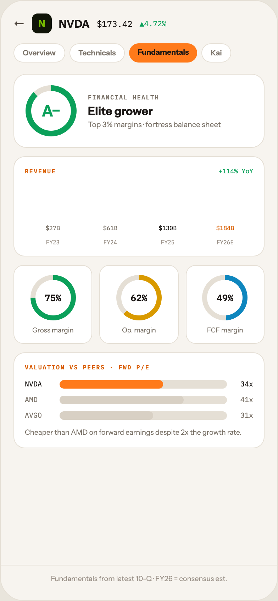

# 13 TICKER · FUNDAMENTALS

Canvas: **CHEAT CODE · LIGHT THEME · SAME SYSTEM** · board index 12 · slug `13-ticker-fundamentals`
Frame: **392×846px** (design width 392px — port at 390px logical, scale ratios).

> Style values are EXACT computed values from the canvas. `T.*` = canvas token, resolved in
> the Tokens appendix at the bottom of this file. Text marked `(MOCK)` must not ship as drawn —
> see `../../DELTA.md` for its substitution rule.

## Tree

- **“← N NVDA $173.42 ▲4.72% Overview Technic…”** → `
`
  - box: 392x846 · display: flex · dir: column · width: 390px · height: 844px · bg: T.orange-50 · border: 1px solid T.orange-100 · radius: 34px (T.r20) · overflow: hidden · type: color T.neutral-950 / Instrument Sans / 16px / w400 / lh normal
  - **“← N NVDA $173.42 ▲4.72% Overview Technic…”** → `
`
    - box: 390x794 · flex: 1 1 0% · flex-grow: 1 · flex-basis: 0% · pad: 18px 18px 0px 18px · overflow: hidden
    - **“← N NVDA $173.42 ▲4.72%…”** → `
`
      - box: 354x28 · display: flex · align: center · gap: 10px
      - **"←"** → ``
        - box: 16x20 · type: color T.orange-700 · scale: T.ty36
        - text: "←"
      - **"N"** → `
`
        - box: 28x28 · display: grid · align: center · justify-items: center · grid-cols: 28px · grid-rows: 28px · width: 28px · height: 28px · bg: T.lime-900 · radius: 8px (T.r9) · type: color T.lime-600 / 13px / w800 · scale: T.ty61
        - text: "N"
      - **"NVDA"** → ``
        - box: 43.5x19 · type: color T.orange-900 / 15px / w800 · scale: T.ty43
        - text: "NVDA"
      - **"$173.42"** **(MOCK)** → ``
        - box: 50.4x15 · type: color T.orange-900 / IBM Plex Mono / 12px · scale: T.ty74
        - text: "$173.42"
      - **"▲4.72%"** **(MOCK)** → ``
        - box: 37.8x14 · type: color T.teal-600 / IBM Plex Mono / 10.5px · scale: T.ty102
        - text: "▲4.72%"
    - **“Overview Technicals Fundamentals Kai…”** → `
`
      - box: 354x27 · display: flex · gap: 6px · margin: 14px 0px 0px 0px
      - **"Overview"** → ``
        - box: 72.5x27 · pad: 6px 12px 6px 12px · bg: T.neutral-0 · border: 1px solid T.orange-100 · radius: 16px (T.r16) · type: color T.neutral-500 / 10.5px / w600 · scale: T.ty101
        - text: "Overview"
      - **"Technicals"** → ``
        - box: 78.7x27 · pad: 6px 12px 6px 12px · bg: T.neutral-0 · border: 1px solid T.orange-100 · radius: 16px (T.r16) · type: color T.neutral-500 / 10.5px / w600 · scale: T.ty101
        - text: "Technicals"
      - **"Fundamentals"** → ``
        - box: 96.1x27 · pad: 6px 12px 6px 12px · bg: T.orange-400-b · radius: 16px (T.r16) · type: color T.orange-900 / 10.5px / w800 · scale: T.ty105
        - text: "Fundamentals"
      - **"Kai"** → ``
        - box: 41.6x27 · pad: 6px 12px 6px 12px · bg: T.neutral-0 · border: 1px solid T.orange-100 · radius: 16px (T.r16) · type: color T.neutral-500 / 10.5px / w600 · scale: T.ty101
        - text: "Kai"
    - **“A− FINANCIAL HEALTH Elite grower Top 3% …”** → `
`
      - box: 354x104 · display: flex · align: center · gap: 16px · pad: 15px 16px 15px 16px · margin: 16px 0px 0px 0px · bg: T.neutral-0 · border: 1px solid T.orange-100 · radius: 18px (T.r17)
      - **“A−…”** → `
`
        - box: 72x72 · display: grid · align: center · justify-items: center · grid-cols: 72px · grid-rows: 72px · width: 72px · height: 72px · flex: 0 0 auto · flex-shrink: 0 · bg-image: conic-gradient(T.teal-600 0deg, T.teal-600 88%, T.orange-100 88%, T.orange-100 100%) · radius: 50% (T.r21)
        - **“A−…”** → `
`
          - box: 56x56 · display: grid · align: center · justify-items: center · grid-cols: 56px · grid-rows: 56px · width: 56px · height: 56px · bg: T.neutral-0 · radius: 50% (T.r21)
          - **"A−"** → ``
            - box: 26.4x27 · type: color T.teal-600 / 22px / w800 · scale: T.ty21
            - text: "A−"
      - **“FINANCIAL HEALTH Elite grower Top 3% mar…”** → `
`
        - box: 232x51 · flex: 1 1 0% · flex-grow: 1 · flex-basis: 0%
        - **"Financial health"** → `
`
          - box: 232x11 · type: color T.neutral-500 / IBM Plex Mono / 8.5px / w600 / ls 1.19px / uppercase · scale: T.ty140
          - text: "Financial health"
        - **"Elite grower"** → `
`
          - box: 232x20 · margin: 4px 0px 0px 0px · type: color T.orange-900 / w800 · scale: T.ty37
          - text: "Elite grower"
        - **"Top 3% margins · fortress balance sheet"** **(MOCK)** → `
`
          - box: 232x13 · margin: 3px 0px 0px 0px · type: color T.neutral-500 / 10.5px · scale: T.ty100
          - text: "Top 3% margins · fortress balance sheet"
    - **“REVENUE +114% YoY $27B FY23 $61B FY24 $1…”** → `
`
      - box: 354x141 · pad: 14px 15px 14px 15px · margin: 12px 0px 0px 0px · bg: T.neutral-0 · border: 1px solid T.orange-100 · radius: 16px (T.r16)
      - **“REVENUE +114% YoY…”** → `
`
        - box: 322x11 · display: flex · align: baseline · justify: space-between
        - **"Revenue"** → ``
          - box: 44x11 · type: color T.orange-500 / IBM Plex Mono / 8.5px / w600 / ls 1.19px / uppercase · scale: T.ty140
          - text: "Revenue"
        - **"+114% YoY"** **(MOCK)** → ``
          - box: 48.6x11 · type: color T.teal-600 / IBM Plex Mono / 9px · scale: T.ty127
          - text: "+114% YoY"
      - **“$27B FY23 $61B FY24 $130B FY25 $184B FY2…”** → `
`
        - box: 322x88 · display: flex · align: flex-end · gap: 10px · height: 88px · pad: 0px 4px 0px 4px · margin: 12px 0px 0px 0px
        - **“$27B FY23…”** → `
`
          - box: 71x31 · display: flex · dir: column · align: center · justify: flex-end · gap: 5px · flex: 1 1 0% · flex-grow: 1 · flex-basis: 0%
          - **"$27B"** **(MOCK)** → ``
            - box: 20.4x11 · type: color T.neutral-500 / IBM Plex Mono / 8.5px · scale: T.ty142
            - text: "$27B"
          - **block[1]** → `
`
            - box: 71x0 · width: 100% · height: 18% · bg: T.orange-100-b · radius: 5px 5px 0px 0px
          - **"FY23"** → ``
            - box: 19.2x10 · type: color T.orange-400 / IBM Plex Mono / 8px · scale: T.ty149
            - text: "FY23"
        - **“$61B FY24…”** → `
`
          - box: 71x31 · display: flex · dir: column · align: center · justify: flex-end · gap: 5px · flex: 1 1 0% · flex-grow: 1 · flex-basis: 0%
          - **"$61B"** **(MOCK)** → ``
            - box: 20.4x11 · type: color T.neutral-500 / IBM Plex Mono / 8.5px · scale: T.ty142
            - text: "$61B"
          - **block[1]** → `
`
            - box: 71x0 · width: 100% · height: 40% · bg: T.orange-200-b · radius: 5px 5px 0px 0px
          - **"FY24"** → ``
            - box: 19.2x10 · type: color T.orange-400 / IBM Plex Mono / 8px · scale: T.ty149
            - text: "FY24"
        - **“$130B FY25…”** → `
`
          - box: 71x31 · display: flex · dir: column · align: center · justify: flex-end · gap: 5px · flex: 1 1 0% · flex-grow: 1 · flex-basis: 0%
          - **"$130B"** **(MOCK)** → ``
            - box: 25.5x11 · type: color T.orange-900 / IBM Plex Mono / 8.5px · scale: T.ty142
            - text: "$130B"
          - **block[1]** → `
`
            - box: 71x0 · width: 100% · height: 78% · bg: T.orange-400-b · radius: 5px 5px 0px 0px
          - **"FY25"** → ``
            - box: 19.2x10 · type: color T.orange-400 / IBM Plex Mono / 8px · scale: T.ty149
            - text: "FY25"
        - **“$184B FY26E…”** → `
`
          - box: 71x31 · display: flex · dir: column · align: center · justify: flex-end · gap: 5px · flex: 1 1 0% · flex-grow: 1 · flex-basis: 0%
          - **"$184B"** **(MOCK)** → ``
            - box: 25.5x11 · type: color T.orange-500 / IBM Plex Mono / 8.5px · scale: T.ty142
            - text: "$184B"
          - **block[1]** → `
`
            - box: 71x0 · width: 100% · height: 100% · bg-image: repeating-linear-gradient(45deg, T.orange-400-b 0px, T.orange-400-b 6px, T.orange-400-c 6px, T.orange-400-c 12px) · radius: 5px 5px 0px 0px · opacity: 0.75
          - **"FY26E"** → ``
            - box: 24x10 · type: color T.orange-400 / IBM Plex Mono / 8px · scale: T.ty149
            - text: "FY26E"
    - **“75% Gross margin 62% Op. margin 49% FCF …”** → `
`
      - box: 354x111 · display: flex · gap: 10px · margin: 12px 0px 0px 0px
      - **“75% Gross margin…”** → `
`
        - box: 111.3x111 · display: flex · dir: column · align: center · flex: 1 1 0% · flex-grow: 1 · flex-basis: 0% · pad: 13px 13px 13px 13px · bg: T.neutral-0 · border: 1px solid T.orange-100 · radius: 14px (T.r15)
        - **“75%…”** → `
`
          - box: 64x64 · width: 64px · height: 64px · position: relative [0px 0px 0px 0px]
          - **block[0]** → `
`
            - box: 64x64 · bg-image: conic-gradient(T.teal-600 0deg, T.teal-600 75%, T.orange-100 75%, T.orange-100 100%) · radius: 50% (T.r21) · position: absolute [0px 0px 0px 0px]
          - **“75%…”** → `
`
            - box: 50x50 · display: grid · align: center · justify-items: center · grid-cols: 50px · grid-rows: 50px · bg: T.neutral-0 · radius: 50% (T.r21) · position: absolute [7px 7px 7px 7px]
            - **"75%"** **(MOCK)** → ``
              - box: 23.4x17 · type: color T.orange-900 / IBM Plex Mono / 13px / w600 · scale: T.ty60
              - text: "75%"
        - **"Gross margin"** → `
`
          - box: 58.3x11 · margin: 8px 0px 0px 0px · type: color T.neutral-500 / 9.5px · scale: T.ty117
          - text: "Gross margin"
      - **“62% Op. margin…”** → `
`
        - box: 111.3x111 · display: flex · dir: column · align: center · flex: 1 1 0% · flex-grow: 1 · flex-basis: 0% · pad: 13px 13px 13px 13px · bg: T.neutral-0 · border: 1px solid T.orange-100 · radius: 14px (T.r15)
        - **“62%…”** → `
`
          - box: 64x64 · width: 64px · height: 64px · position: relative [0px 0px 0px 0px]
          - **block[0]** → `
`
            - box: 64x64 · bg-image: conic-gradient(T.amber-500 0deg, T.amber-500 62%, T.orange-100 62%, T.orange-100 100%) · radius: 50% (T.r21) · position: absolute [0px 0px 0px 0px]
          - **“62%…”** → `
`
            - box: 50x50 · display: grid · align: center · justify-items: center · grid-cols: 50px · grid-rows: 50px · bg: T.neutral-0 · radius: 50% (T.r21) · position: absolute [7px 7px 7px 7px]
            - **"62%"** **(MOCK)** → ``
              - box: 23.4x17 · type: color T.orange-900 / IBM Plex Mono / 13px / w600 · scale: T.ty60
              - text: "62%"
        - **"Op. margin"** → `
`
          - box: 48x11 · margin: 8px 0px 0px 0px · type: color T.neutral-500 / 9.5px · scale: T.ty117
          - text: "Op. margin"
      - **“49% FCF margin…”** → `
`
        - box: 111.3x111 · display: flex · dir: column · align: center · flex: 1 1 0% · flex-grow: 1 · flex-basis: 0% · pad: 13px 13px 13px 13px · bg: T.neutral-0 · border: 1px solid T.orange-100 · radius: 14px (T.r15)
        - **“49%…”** → `
`
          - box: 64x64 · width: 64px · height: 64px · position: relative [0px 0px 0px 0px]
          - **block[0]** → `
`
            - box: 64x64 · bg-image: conic-gradient(T.blue-500 0deg, T.blue-500 49%, T.orange-100 49%, T.orange-100 100%) · radius: 50% (T.r21) · position: absolute [0px 0px 0px 0px]
          - **“49%…”** → `
`
            - box: 50x50 · display: grid · align: center · justify-items: center · grid-cols: 50px · grid-rows: 50px · bg: T.neutral-0 · radius: 50% (T.r21) · position: absolute [7px 7px 7px 7px]
            - **"49%"** **(MOCK)** → ``
              - box: 23.4x17 · type: color T.orange-900 / IBM Plex Mono / 13px / w600 · scale: T.ty60
              - text: "49%"
        - **"FCF margin"** → `
`
          - box: 51x11 · margin: 8px 0px 0px 0px · type: color T.neutral-500 / 9.5px · scale: T.ty117
          - text: "FCF margin"
    - **“VALUATION VS PEERS · FWD P/E NVDA 34x AM…”** → `
`
      - box: 354x135 · pad: 14px 15px 14px 15px · margin: 12px 0px 0px 0px · bg: T.neutral-0 · border: 1px solid T.orange-100 · radius: 16px (T.r16)
      - **"Valuation vs peers · Fwd P/E"** → `
`
        - box: 322x11 · type: color T.orange-500 / IBM Plex Mono / 8.5px / w600 / ls 1.19px / uppercase · scale: T.ty140
        - text: "Valuation vs peers · Fwd P/E"
      - **“NVDA 34x AMD 41x AVGO 31x…”** → `
`
        - box: 322x57 · display: flex · dir: column · gap: 9px · margin: 12px 0px 0px 0px
        - **“NVDA 34x…”** → `
`
          - box: 322x13 · display: flex · align: center · gap: 9px
          - **"NVDA"** → ``
            - box: 40x13 · width: 40px · type: color T.orange-900 / IBM Plex Mono / 10px · scale: T.ty108
            - text: "NVDA"
          - **block[1]** → `
`
            - box: 236x12 · height: 12px · flex: 1 1 0% · flex-grow: 1 · flex-basis: 0% · bg: T.orange-100 · radius: 6px (T.r7) · overflow: hidden
            - **block[0]** → `
`
              - box: 146.3x12 · width: 62% · height: 100% · bg: T.orange-400-b · radius: 6px (T.r7)
          - **"34x"** → ``
            - box: 28x13 · width: 28px · type: color T.orange-900 / IBM Plex Mono / 10px / align-right · scale: T.ty108
            - text: "34x"
        - **“AMD 41x…”** → `
`
          - box: 322x13 · display: flex · align: center · gap: 9px
          - **"AMD"** → ``
            - box: 40x13 · width: 40px · type: color T.neutral-500 / IBM Plex Mono / 10px · scale: T.ty108
            - text: "AMD"
          - **block[1]** → `
`
            - box: 236x12 · height: 12px · flex: 1 1 0% · flex-grow: 1 · flex-basis: 0% · bg: T.orange-100 · radius: 6px (T.r7) · overflow: hidden
            - **block[0]** → `
`
              - box: 174.6x12 · width: 74% · height: 100% · bg: T.orange-100-b · radius: 6px (T.r7)
          - **"41x"** → ``
            - box: 28x13 · width: 28px · type: color T.neutral-500 / IBM Plex Mono / 10px / align-right · scale: T.ty108
            - text: "41x"
        - **“AVGO 31x…”** → `
`
          - box: 322x13 · display: flex · align: center · gap: 9px
          - **"AVGO"** → ``
            - box: 40x13 · width: 40px · type: color T.neutral-500 / IBM Plex Mono / 10px · scale: T.ty108
            - text: "AVGO"
          - **block[1]** → `
`
            - box: 236x12 · height: 12px · flex: 1 1 0% · flex-grow: 1 · flex-basis: 0% · bg: T.orange-100 · radius: 6px (T.r7) · overflow: hidden
            - **block[0]** → `
`
              - box: 132.2x12 · width: 56% · height: 100% · bg: T.orange-100-b · radius: 6px (T.r7)
          - **"31x"** → ``
            - box: 28x13 · width: 28px · type: color T.neutral-500 / IBM Plex Mono / 10px / align-right · scale: T.ty108
            - text: "31x"
      - **"Cheaper than AMD on forward earnings despite"** → `
`
        - box: 322x15 · margin: 10px 0px 0px 0px · type: color T.neutral-500 / 10px / lh 15px · scale: T.ty115
        - text: "Cheaper than AMD on forward earnings despite 2x the growth rate."
  - **“Fundamentals from latest 10-Q · FY26 = c…”** → `
`
    - box: 390x50 · pad: 12px 18px 24px 18px · border: T:1px solid T.orange-100 R:0px none T.neutral-950 B:0px none T.neutral-950 L:0px none T.neutral-950
    - **"Fundamentals from latest 10-Q · FY26 = conse"** → `
`
      - box: 354x13 · type: color T.orange-400 / 10px / align-center · scale: T.ty109
      - text: "Fundamentals from latest 10-Q · FY26 = consensus est."

## Tokens used in this board

| token | value | role |
| --- | --- | --- |
| T.orange-100 | `#E5DFD5` | border, bg, gradient |
| T.orange-900 | `#1A1614` | text, bg, border |
| T.orange-400 | `#9B9289` | text, bg |
| T.neutral-0 | `#FFFFFF` | bg, gradient, border, text |
| T.neutral-500 | `#7B7369` | text, border, bg |
| T.orange-400-b | `#FF7A1A` | bg, text, border, gradient |
| T.neutral-950 | `#000000` | border, text |
| T.teal-600 | `#0BA05A` | text, gradient, border, bg |
| T.orange-50 | `#F7F4EF` | bg, border, text, gradient |
| T.orange-500 | `#D95E00` | text |
| T.orange-700 | `#4E463E` | text |
| T.orange-100-b | `#D8D0C4` | bg, border |
| T.amber-500 | `#D99A00` | text, gradient, border, bg |
| T.lime-600 | `#76B900` | text, gradient |
| T.lime-900 | `#101408` | bg, gradient |
| T.blue-500 | `#0E86BE` | text, gradient, bg |
| T.orange-400-c | `#E08A3C` | gradient, shadow |
| T.orange-200-b | `#F0B375` | bg |
| T.ty21 | Instrument Sans 22px/normal w800 ls:normal | type scale |
| T.ty36 | Instrument Sans 16px/normal w400 ls:normal | type scale |
| T.ty37 | Instrument Sans 16px/normal w800 ls:normal | type scale |
| T.ty43 | Instrument Sans 15px/normal w800 ls:normal | type scale |
| T.ty60 | IBM Plex Mono 13px/normal w600 ls:normal | type scale |
| T.ty61 | Instrument Sans 13px/normal w800 ls:normal | type scale |
| T.ty74 | IBM Plex Mono 12px/normal w400 ls:normal | type scale |
| T.ty100 | Instrument Sans 10.5px/normal w400 ls:normal | type scale |
| T.ty101 | Instrument Sans 10.5px/normal w600 ls:normal | type scale |
| T.ty102 | IBM Plex Mono 10.5px/normal w400 ls:normal | type scale |
| T.ty105 | Instrument Sans 10.5px/normal w800 ls:normal | type scale |
| T.ty108 | IBM Plex Mono 10px/normal w400 ls:normal | type scale |
| T.ty109 | Instrument Sans 10px/normal w400 ls:normal | type scale |
| T.ty115 | Instrument Sans 10px/15px w400 ls:normal | type scale |
| T.ty117 | Instrument Sans 9.5px/normal w400 ls:normal | type scale |
| T.ty127 | IBM Plex Mono 9px/normal w400 ls:normal | type scale |
| T.ty140 | IBM Plex Mono 8.5px/normal w600 ls:1.19px uppercase | type scale |
| T.ty142 | IBM Plex Mono 8.5px/normal w400 ls:normal | type scale |
| T.ty149 | IBM Plex Mono 8px/normal w400 ls:normal | type scale |
| T.r7 | `6px` | radius |
| T.r9 | `8px` | radius |
| T.r15 | `14px` | radius |
| T.r16 | `16px` | radius |
| T.r17 | `18px` | radius |
| T.r20 | `34px` | radius |
| T.r21 | `50%` | radius |
