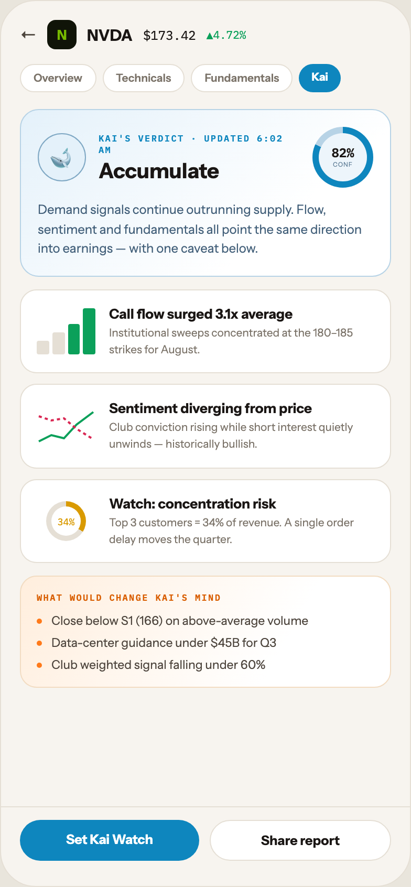

# 14 TICKER · KAI REPORT

Canvas: **CHEAT CODE · LIGHT THEME · SAME SYSTEM** · board index 13 · slug `14-ticker-kai-report`
Frame: **392×846px** (design width 392px — port at 390px logical, scale ratios).

> Style values are EXACT computed values from the canvas. `T.*` = canvas token, resolved in
> the Tokens appendix at the bottom of this file. Text marked `(MOCK)` must not ship as drawn —
> see `../../DELTA.md` for its substitution rule.

## Tree

- **“← N NVDA $173.42 ▲4.72% Overview Technic…”** → `
`
  - box: 392x846 · display: flex · dir: column · width: 390px · height: 844px · bg: T.orange-50 · border: 1px solid T.orange-100 · radius: 34px (T.r20) · overflow: hidden · type: color T.neutral-950 / Instrument Sans / 16px / w400 / lh normal
  - **“← N NVDA $173.42 ▲4.72% Overview Technic…”** → `
`
    - box: 390x768 · flex: 1 1 0% · flex-grow: 1 · flex-basis: 0% · pad: 18px 18px 0px 18px · overflow: hidden
    - **“← N NVDA $173.42 ▲4.72%…”** → `
`
      - box: 354x28 · display: flex · align: center · gap: 10px
      - **"←"** → ``
        - box: 16x20 · type: color T.orange-700 · scale: T.ty36
        - text: "←"
      - **"N"** → `
`
        - box: 28x28 · display: grid · align: center · justify-items: center · grid-cols: 28px · grid-rows: 28px · width: 28px · height: 28px · bg: T.lime-900 · radius: 8px (T.r9) · type: color T.lime-600 / 13px / w800 · scale: T.ty61
        - text: "N"
      - **"NVDA"** → ``
        - box: 43.5x19 · type: color T.orange-900 / 15px / w800 · scale: T.ty43
        - text: "NVDA"
      - **"$173.42"** **(MOCK)** → ``
        - box: 50.4x15 · type: color T.orange-900 / IBM Plex Mono / 12px · scale: T.ty74
        - text: "$173.42"
      - **"▲4.72%"** **(MOCK)** → ``
        - box: 37.8x14 · type: color T.teal-600 / IBM Plex Mono / 10.5px · scale: T.ty102
        - text: "▲4.72%"
    - **“Overview Technicals Fundamentals Kai…”** → `
`
      - box: 354x27 · display: flex · gap: 6px · margin: 14px 0px 0px 0px
      - **"Overview"** → ``
        - box: 72.5x27 · pad: 6px 12px 6px 12px · bg: T.neutral-0 · border: 1px solid T.orange-100 · radius: 16px (T.r16) · type: color T.neutral-500 / 10.5px / w600 · scale: T.ty101
        - text: "Overview"
      - **"Technicals"** → ``
        - box: 78.7x27 · pad: 6px 12px 6px 12px · bg: T.neutral-0 · border: 1px solid T.orange-100 · radius: 16px (T.r16) · type: color T.neutral-500 / 10.5px / w600 · scale: T.ty101
        - text: "Technicals"
      - **"Fundamentals"** → ``
        - box: 97x27 · pad: 6px 12px 6px 12px · bg: T.neutral-0 · border: 1px solid T.orange-100 · radius: 16px (T.r16) · type: color T.neutral-500 / 10.5px / w600 · scale: T.ty101
        - text: "Fundamentals"
      - **"Kai"** → ``
        - box: 39.8x27 · pad: 6px 12px 6px 12px · bg: T.blue-500 · radius: 16px (T.r16) · type: color T.neutral-0 / 10.5px / w800 · scale: T.ty105
        - text: "Kai"
    - **“🐋 KAI'S VERDICT · UPDATED 6:02 AM Accum…”** → `
`
      - box: 354x159.8 · pad: 16px 16px 16px 16px · margin: 16px 0px 0px 0px · bg-image: linear-gradient(140deg, T.blue-50 0%, T.neutral-0 70%) · border: 1px solid T.blue-100 · radius: 18px (T.r17)
      - **“🐋 KAI'S VERDICT · UPDATED 6:02 AM Accum…”** → `
`
        - box: 320x58 · display: flex · align: center · gap: 12px
        - **"🐋"** → `
`
          - box: 46x46 · display: grid · align: center · justify-items: center · grid-cols: 44px · grid-rows: 44px · width: 44px · height: 44px · flex: 0 0 auto · flex-shrink: 0 · bg: T.blue-50 · border: 1px solid T.blue-300-b · radius: 50% (T.r21) · type: 20px · scale: T.ty26
          - text: "🐋"
        - **“KAI'S VERDICT · UPDATED 6:02 AM Accumula…”** → `
`
          - box: 192x49 · flex: 1 1 0% · flex-grow: 1 · flex-basis: 0%
          - **"Kai's verdict · updated 6:02 AM"** → `
`
            - box: 192x22 · type: color T.blue-500 / IBM Plex Mono / 8.5px / w600 / ls 1.19px / uppercase · scale: T.ty140
            - text: "Kai's verdict · updated 6:02 AM"
          - **"Accumulate"** → `
`
            - box: 192x24 · margin: 3px 0px 0px 0px · type: color T.orange-900 / 20px / w800 · scale: T.ty23
            - text: "Accumulate"
        - **“82% CONF…”** → `
`
          - box: 58x58 · display: grid · align: center · justify-items: center · grid-cols: 58px · grid-rows: 58px · width: 58px · height: 58px · flex: 0 0 auto · flex-shrink: 0 · bg-image: conic-gradient(T.blue-500 0deg, T.blue-500 82%, T.blue-100 82%, T.blue-100 100%) · radius: 50% (T.r21)
          - **“82% CONF…”** → `
`
            - box: 46x46 · display: grid · align: center · justify-items: center · grid-cols: 46px · grid-rows: 46px · width: 46px · height: 46px · bg: T.blue-50-c · radius: 50% (T.r21) · type: align-center
            - **“82% CONF…”** → `
`
              - box: 21.6x21
              - **"82%"** **(MOCK)** → `
`
                - box: 21.6x12 · type: color T.orange-900 / IBM Plex Mono / 12px / w600 / lh 12px · scale: T.ty79
                - text: "82%"
              - **"CONF"** → `
`
                - box: 21.6x8 · margin: 1px 0px 0px 0px · type: color T.blue-500-c / 6px / ls 0.48px · scale: T.ty157
                - text: "CONF"
      - **"Demand signals continue outrunning supply. F"** → `
`
        - box: 320x55.8 · margin: 12px 0px 0px 0px · type: color T.blue-600 / 12px / lh 18.6px · scale: T.ty80
        - text: "Demand signals continue outrunning supply. Flow, sentiment and fundamentals all point the same direction into earnings — with one caveat below."
    - **“Call flow surged 3.1x average Institutio…”** → `
`
      - box: 354x80.5 · display: flex · align: center · gap: 13px · pad: 14px 15px 14px 15px · margin: 12px 0px 0px 0px · bg: T.neutral-0 · border: 1px solid T.orange-100 · radius: 16px (T.r16)
      - **block[0]** → `
`
        - box: 56x44 · display: flex · align: flex-end · gap: 3px · width: 56px · height: 44px · flex: 0 0 auto · flex-shrink: 0
        - **block[0]** → `
`
          - box: 11.8x13.2 · height: 30% · flex: 1 1 0% · flex-grow: 1 · flex-basis: 0% · bg: T.orange-100 · radius: 2px (T.r3)
        - **block[1]** → `
`
          - box: 11.8x21.1 · height: 48% · flex: 1 1 0% · flex-grow: 1 · flex-basis: 0% · bg: T.orange-100 · radius: 2px (T.r3)
        - **block[2]** → `
`
          - box: 11.8x29 · height: 66% · flex: 1 1 0% · flex-grow: 1 · flex-basis: 0% · bg: T.teal-600 · radius: 2px (T.r3)
        - **block[3]** → `
`
          - box: 11.8x44 · height: 100% · flex: 1 1 0% · flex-grow: 1 · flex-basis: 0% · bg: T.teal-600 · radius: 2px (T.r3)
      - **“Call flow surged 3.1x average Institutio…”** → `
`
        - box: 253x50.5 · flex: 1 1 0% · flex-grow: 1 · flex-basis: 0%
        - **"Call flow surged 3.1x average"** → `
`
          - box: 253x16 · type: color T.orange-900 / 13px / w700 · scale: T.ty58
          - text: "Call flow surged 3.1x average"
        - **"Institutional sweeps concentrated at the 180"** → `
`
          - box: 253x31.5 · margin: 3px 0px 0px 0px · type: color T.neutral-500 / 10.5px / lh 15.75px · scale: T.ty106
          - text: "Institutional sweeps concentrated at the 180–185 strikes for August."
    - **“Sentiment diverging from price Club conv…”** → `
`
      - box: 354x80.5 · display: flex · align: center · gap: 13px · pad: 14px 15px 14px 15px · margin: 10px 0px 0px 0px · bg: T.neutral-0 · border: 1px solid T.orange-100 · radius: 16px (T.r16)
      - **block[0]** → `
`
        - box: 56x44 · width: 56px · height: 44px · flex: 0 0 auto · flex-shrink: 0 · position: relative [0px 0px 0px 0px]
        - **svg** → `<svg>`
          - box: 56x44 · display: inline · overflow: hidden
          - svg: `<svg data-dc-tpl="1154" width="56" height="44" viewBox="0 0 56 44"><path data-dc-tpl="1155" d="M2 36 L14 30 L26 33 L38 20 L54 8" fill="none" stroke="#0BA05A" stroke-width="2"></path><path data-dc-tpl="1156" d="M2 12 L14 16 L26 14 L38 24 L54 34" fill="none" stroke="#D92652" stroke-width="2" stroke-da`
          - **block[0]** → `<path>`
            - box: 52x28 · display: inline
          - **block[1]** → `<path>`
            - box: 52x22 · display: inline
      - **“Sentiment diverging from price Club conv…”** → `
`
        - box: 253x50.5 · flex: 1 1 0% · flex-grow: 1 · flex-basis: 0%
        - **"Sentiment diverging from price"** → `
`
          - box: 253x16 · type: color T.orange-900 / 13px / w700 · scale: T.ty58
          - text: "Sentiment diverging from price"
        - **"Club conviction rising while short interest "** → `
`
          - box: 253x31.5 · margin: 3px 0px 0px 0px · type: color T.neutral-500 / 10.5px / lh 15.75px · scale: T.ty106
          - text: "Club conviction rising while short interest quietly unwinds — historically bullish."
    - **“34% Watch: concentration risk Top 3 cust…”** → `
`
      - box: 354x80.5 · display: flex · align: center · gap: 13px · pad: 14px 15px 14px 15px · margin: 10px 0px 0px 0px · bg: T.neutral-0 · border: 1px solid T.orange-100 · radius: 16px (T.r16)
      - **“34%…”** → `
`
        - box: 56x44 · display: grid · align: center · justify-items: center · grid-cols: 56px · grid-rows: 44px · width: 56px · height: 44px · flex: 0 0 auto · flex-shrink: 0
        - **“34%…”** → `
`
          - box: 38x38 · display: grid · align: center · justify-items: center · grid-cols: 38px · grid-rows: 38px · width: 38px · height: 38px · bg-image: conic-gradient(T.amber-500 0deg, T.amber-500 34%, T.orange-100 34%, T.orange-100 100%) · radius: 50% (T.r21)
          - **"34%"** **(MOCK)** → `
`
            - box: 28x28 · display: grid · align: center · justify-items: center · grid-cols: 28px · grid-rows: 28px · width: 28px · height: 28px · bg: T.neutral-0 · radius: 50% (T.r21) · type: color T.amber-500 / IBM Plex Mono / 9px · scale: T.ty127
            - text: "34%"
      - **“Watch: concentration risk Top 3 customer…”** → `
`
        - box: 253x50.5 · flex: 1 1 0% · flex-grow: 1 · flex-basis: 0%
        - **"Watch: concentration risk"** → `
`
          - box: 253x16 · type: color T.orange-900 / 13px / w700 · scale: T.ty58
          - text: "Watch: concentration risk"
        - **"Top 3 customers = 34% of revenue. A single o"** **(MOCK)** → `
`
          - box: 253x31.5 · margin: 3px 0px 0px 0px · type: color T.neutral-500 / 10.5px / lh 15.75px · scale: T.ty106
          - text: "Top 3 customers = 34% of revenue. A single order delay moves the quarter."
    - **“WHAT WOULD CHANGE KAI'S MIND Close below…”** → `
`
      - box: 354x107 · pad: 14px 15px 14px 15px · margin: 12px 0px 0px 0px · bg-image: linear-gradient(120deg, T.orange-50-b 0%, T.neutral-0 70%) · border: 1px solid T.orange-100-c · radius: 16px (T.r16)
      - **"What would change Kai's mind"** → `
`
        - box: 322x11 · type: color T.orange-500 / IBM Plex Mono / 8.5px / w600 / ls 1.19px / uppercase · scale: T.ty140
        - text: "What would change Kai's mind"
      - **“Close below S1 (166) on above-average vo…”** → `
`
        - box: 322x56 · display: flex · dir: column · gap: 7px · margin: 10px 0px 0px 0px
        - **"Close below S1 (166) on above-average volume"** → `
`
          - box: 322x14 · display: flex · align: center · gap: 9px · type: color T.orange-700 / 11.5px · scale: T.ty81
          - text: "Close below S1 (166) on above-average volume"
          - **block[0]** → ``
            - box: 5x5 · width: 5px · height: 5px · flex: 0 0 auto · flex-shrink: 0 · bg: T.orange-400-b · radius: 50% (T.r21)
        - **"Data-center guidance under $45B for Q3"** **(MOCK)** → `
`
          - box: 322x14 · display: flex · align: center · gap: 9px · type: color T.orange-700 / 11.5px · scale: T.ty81
          - text: "Data-center guidance under $45B for Q3"
          - **block[0]** → ``
            - box: 5x5 · width: 5px · height: 5px · flex: 0 0 auto · flex-shrink: 0 · bg: T.orange-400-b · radius: 50% (T.r21)
        - **"Club weighted signal falling under 60%"** **(MOCK)** → `
`
          - box: 322x14 · display: flex · align: center · gap: 9px · type: color T.orange-700 / 11.5px · scale: T.ty81
          - text: "Club weighted signal falling under 60%"
          - **block[0]** → ``
            - box: 5x5 · width: 5px · height: 5px · flex: 0 0 auto · flex-shrink: 0 · bg: T.orange-400-b · radius: 50% (T.r21)
  - **“Set Kai Watch Share report…”** → `
`
    - box: 390x76 · display: flex · gap: 10px · pad: 12px 18px 24px 18px · border: T:1px solid T.orange-100 R:0px none T.neutral-950 B:0px none T.neutral-950 L:0px none T.neutral-950
    - **"Set Kai Watch"** → `
`
      - box: 171x39 · flex: 1 1 0% · flex-grow: 1 · flex-basis: 0% · pad: 11px 0px 11px 0px · bg: T.blue-500 · radius: 20px (T.r18) · type: color T.neutral-0 / 12.5px / w800 / align-center · scale: T.ty69
      - text: "Set Kai Watch"
    - **"Share report"** → `
`
      - box: 173x39 · flex: 1 1 0% · flex-grow: 1 · flex-basis: 0% · pad: 11px 0px 11px 0px · bg: T.neutral-0 · border: 1px solid T.orange-100 · radius: 20px (T.r18) · type: color T.orange-900 / 12.5px / w700 / align-center · scale: T.ty65
      - text: "Share report"

## Tokens used in this board

| token | value | role |
| --- | --- | --- |
| T.orange-100 | `#E5DFD5` | border, bg, gradient |
| T.orange-900 | `#1A1614` | text, bg, border |
| T.neutral-0 | `#FFFFFF` | bg, gradient, border, text |
| T.neutral-500 | `#7B7369` | text, border, bg |
| T.orange-400-b | `#FF7A1A` | bg, text, border, gradient |
| T.neutral-950 | `#000000` | border, text |
| T.teal-600 | `#0BA05A` | text, gradient, border, bg |
| T.orange-50 | `#F7F4EF` | bg, border, text, gradient |
| T.orange-500 | `#D95E00` | text |
| T.orange-700 | `#4E463E` | text |
| T.amber-500 | `#D99A00` | text, gradient, border, bg |
| T.lime-600 | `#76B900` | text, gradient |
| T.orange-100-c | `#F2DCC2` | border, bg |
| T.lime-900 | `#101408` | bg, gradient |
| T.blue-500 | `#0E86BE` | text, gradient, bg |
| T.orange-50-b | `#FFEEDD` | gradient |
| T.blue-100 | `#B7D3E6` | border, gradient |
| T.blue-50 | `#E4F1FA` | bg, gradient |
| T.blue-300-b | `#7FA8C4` | border |
| T.blue-50-c | `#EDF5FB` | bg, gradient |
| T.blue-600 | `#43607A` | text |
| T.blue-500-c | `#5B7A94` | text |
| T.ty23 | Instrument Sans 20px/normal w800 ls:normal | type scale |
| T.ty26 | Instrument Sans 20px/normal w400 ls:normal | type scale |
| T.ty36 | Instrument Sans 16px/normal w400 ls:normal | type scale |
| T.ty43 | Instrument Sans 15px/normal w800 ls:normal | type scale |
| T.ty58 | Instrument Sans 13px/normal w700 ls:normal | type scale |
| T.ty61 | Instrument Sans 13px/normal w800 ls:normal | type scale |
| T.ty65 | Instrument Sans 12.5px/normal w700 ls:normal | type scale |
| T.ty69 | Instrument Sans 12.5px/normal w800 ls:normal | type scale |
| T.ty74 | IBM Plex Mono 12px/normal w400 ls:normal | type scale |
| T.ty79 | IBM Plex Mono 12px/12px w600 ls:normal | type scale |
| T.ty80 | Instrument Sans 12px/18.6px w400 ls:normal | type scale |
| T.ty81 | Instrument Sans 11.5px/normal w400 ls:normal | type scale |
| T.ty101 | Instrument Sans 10.5px/normal w600 ls:normal | type scale |
| T.ty102 | IBM Plex Mono 10.5px/normal w400 ls:normal | type scale |
| T.ty105 | Instrument Sans 10.5px/normal w800 ls:normal | type scale |
| T.ty106 | Instrument Sans 10.5px/15.75px w400 ls:normal | type scale |
| T.ty127 | IBM Plex Mono 9px/normal w400 ls:normal | type scale |
| T.ty140 | IBM Plex Mono 8.5px/normal w600 ls:1.19px uppercase | type scale |
| T.ty157 | Instrument Sans 6px/normal w400 ls:0.48px | type scale |
| T.r3 | `2px` | radius |
| T.r9 | `8px` | radius |
| T.r16 | `16px` | radius |
| T.r17 | `18px` | radius |
| T.r18 | `20px` | radius |
| T.r20 | `34px` | radius |
| T.r21 | `50%` | radius |
