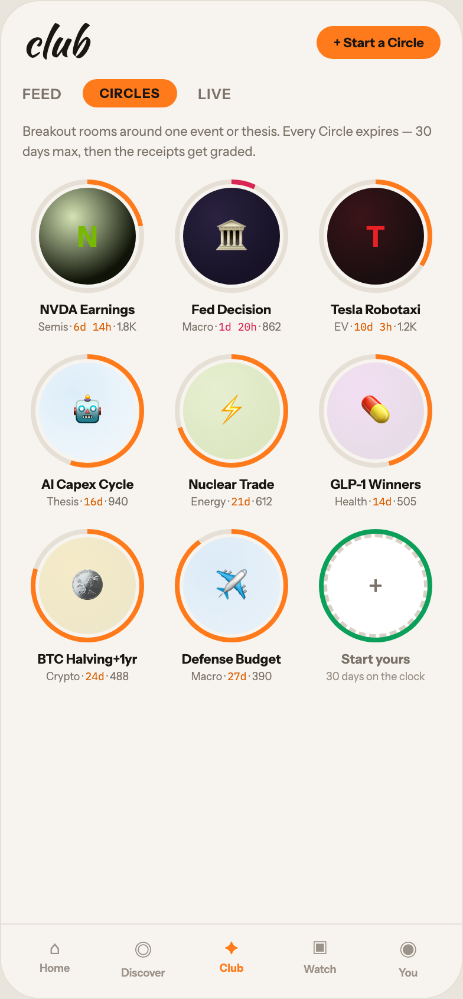

# 16 CLUB · CIRCLES

Canvas: **CHEAT CODE · LIGHT THEME · SAME SYSTEM** · board index 15 · slug `16-club-circles`
Frame: **392×846px** (design width 392px — port at 390px logical, scale ratios).

> Style values are EXACT computed values from the canvas. `T.*` = canvas token, resolved in
> the Tokens appendix at the bottom of this file. Text marked `(MOCK)` must not ship as drawn —
> see `../../DELTA.md` for its substitution rule.

## Tree

- **“club + Start a Circle FEED CIRCLES LIVE …”** → `
`
  - box: 392x846 · display: flex · dir: column · width: 390px · height: 844px · bg: T.orange-50 · border: 1px solid T.orange-100 · radius: 34px (T.r20) · overflow: hidden · type: color T.neutral-950 / Instrument Sans / 16px / w400 / lh normal
  - **“club + Start a Circle FEED CIRCLES LIVE …”** → `
`
    - box: 390x781 · flex: 1 1 0% · flex-grow: 1 · flex-basis: 0% · pad: 18px 18px 0px 18px · overflow: hidden
    - **“club + Start a Circle…”** → `
`
      - box: 354x34 · display: flex · align: center · justify: space-between
      - **"club"** → `
`
        - box: 55x34 · type: color T.orange-900 / Kaushan Script / 34px / lh 34px · scale: T.ty2
        - text: "club"
      - **"+ Start a Circle"** → ``
        - box: 104.6x28 · pad: 7px 14px 7px 14px · bg: T.orange-400-b · radius: 18px (T.r17) · type: color T.orange-900 / 11px / w700 · scale: T.ty86
        - text: "+ Start a Circle"
    - **“FEED CIRCLES LIVE…”** → `
`
      - box: 354x24 · display: flex · align: center · gap: 18px · margin: 14px 0px 0px 0px
      - **"FEED"** → ``
        - box: 33.2x15 · type: color T.neutral-500 / 12px / w600 / ls 0.48px · scale: T.ty75
        - text: "FEED"
      - **"CIRCLES"** → ``
        - box: 79.4x24 · pad: 5px 14px 5px 14px · bg: T.orange-400-b · radius: 16px (T.r16) · type: color T.orange-900 / 11px / w800 / ls 0.66px · scale: T.ty94
        - text: "CIRCLES"
      - **"LIVE"** → ``
        - box: 28.4x15 · type: color T.neutral-500 / 12px / w600 / ls 0.48px · scale: T.ty75
        - text: "LIVE"
    - **"Breakout rooms around one event or thesis. E"** → `
`
      - box: 354x33 · margin: 12px 0px 0px 0px · type: color T.neutral-500 / 11px / lh 16.5px · scale: T.ty93
      - text: "Breakout rooms around one event or thesis. Every Circle expires — 30 days max, then the receipts get graded."
    - **“N NVDA Earnings Semis · 6d 14h · 1.8K 🏛…”** → `
`
      - box: 354x130 · display: flex · justify: space-between · margin: 16px 0px 0px 0px
      - **“N NVDA Earnings Semis · 6d 14h · 1.8K…”** → `
`
        - box: 110x130 · width: 110px · type: align-center
        - **“N…”** → `
`
          - box: 96x96 · width: 96px · height: 96px · margin: 0px 7px 0px 7px · position: relative [0px 0px 0px 0px]
          - **block[0]** → `
`
            - box: 96x96 · bg-image: conic-gradient(T.orange-400-b 0deg, T.orange-400-b 22%, T.orange-100 22%, T.orange-100 100%) · radius: 50% (T.r21) · position: absolute [0px 0px 0px 0px]
          - **"N"** → `
`
            - box: 88x88 · display: grid · align: center · justify-items: center · grid-cols: 82px · grid-rows: 82px · bg-image: radial-gradient(circle at 35% 30%, T.lime-100-b, T.lime-900 70%) · border: 3px solid T.orange-50 · radius: 50% (T.r21) · position: absolute [4px 4px 4px 4px] · type: color T.lime-600 / 24px / w800 · scale: T.ty15
            - text: "N"
        - **"NVDA Earnings"** → `
`
          - box: 110x14 · margin: 7px 0px 0px 0px · type: color T.orange-900 / 11px / w700 · scale: T.ty86
          - text: "NVDA Earnings"
        - **"Semis · · 1.8K"** → `
`
          - box: 110x11 · margin: 2px 0px 0px 0px · type: color T.neutral-500 / 9px · scale: T.ty128
          - text: "Semis · · 1.8K"
          - **"6d 14h"** → ``
            - box: 32.4x11 · display: inline · type: color T.orange-500 / IBM Plex Mono · scale: T.ty127
            - text: "6d 14h"
      - **“🏛 Fed Decision Macro · 1d 20h · 862…”** → `
`
        - box: 110x130 · width: 110px · type: align-center
        - **“🏛…”** → `
`
          - box: 96x96 · width: 96px · height: 96px · margin: 0px 7px 0px 7px · position: relative [0px 0px 0px 0px]
          - **block[0]** → `
`
            - box: 96x96 · bg-image: conic-gradient(T.red-400 0deg, T.red-400 7%, T.orange-100 7%, T.orange-100 100%) · radius: 50% (T.r21) · position: absolute [0px 0px 0px 0px]
          - **"🏛"** → `
`
            - box: 88x88 · display: grid · align: center · justify-items: center · grid-cols: 82px · grid-rows: 82px · bg-image: radial-gradient(circle at 35% 30%, T.indigo-800, T.indigo-850 70%) · border: 3px solid T.orange-50 · radius: 50% (T.r21) · position: absolute [4px 4px 4px 4px] · type: 26px · scale: T.ty9
            - text: "🏛"
        - **"Fed Decision"** → `
`
          - box: 110x14 · margin: 7px 0px 0px 0px · type: color T.orange-900 / 11px / w700 · scale: T.ty86
          - text: "Fed Decision"
        - **"Macro · · 862"** → `
`
          - box: 110x11 · margin: 2px 0px 0px 0px · type: color T.neutral-500 / 9px · scale: T.ty128
          - text: "Macro · · 862"
          - **"1d 20h"** → ``
            - box: 32.4x11 · display: inline · type: color T.red-400 / IBM Plex Mono · scale: T.ty127
            - text: "1d 20h"
      - **“T Tesla Robotaxi EV · 10d 3h · 1.2K…”** → `
`
        - box: 110x130 · width: 110px · type: align-center
        - **“T…”** → `
`
          - box: 96x96 · width: 96px · height: 96px · margin: 0px 7px 0px 7px · position: relative [0px 0px 0px 0px]
          - **block[0]** → `
`
            - box: 96x96 · bg-image: conic-gradient(T.orange-400-b 0deg, T.orange-400-b 34%, T.orange-100 34%, T.orange-100 100%) · radius: 50% (T.r21) · position: absolute [0px 0px 0px 0px]
          - **"T"** → `
`
            - box: 88x88 · display: grid · align: center · justify-items: center · grid-cols: 82px · grid-rows: 82px · bg-image: radial-gradient(circle at 35% 30%, T.red-850, T.red-900 70%) · border: 3px solid T.orange-50 · radius: 50% (T.r21) · position: absolute [4px 4px 4px 4px] · type: color T.red-400-b / 24px / w800 · scale: T.ty15
            - text: "T"
        - **"Tesla Robotaxi"** → `
`
          - box: 110x14 · margin: 7px 0px 0px 0px · type: color T.orange-900 / 11px / w700 · scale: T.ty86
          - text: "Tesla Robotaxi"
        - **"EV · · 1.2K"** → `
`
          - box: 110x11 · margin: 2px 0px 0px 0px · type: color T.neutral-500 / 9px · scale: T.ty128
          - text: "EV · · 1.2K"
          - **"10d 3h"** → ``
            - box: 32.4x11 · display: inline · type: color T.orange-500 / IBM Plex Mono · scale: T.ty127
            - text: "10d 3h"
    - **“🤖 AI Capex Cycle Thesis · 16d · 940 ⚡ N…”** → `
`
      - box: 354x130 · display: flex · justify: space-between · margin: 18px 0px 0px 0px
      - **“🤖 AI Capex Cycle Thesis · 16d · 940…”** → `
`
        - box: 110x130 · width: 110px · type: align-center
        - **“🤖…”** → `
`
          - box: 96x96 · width: 96px · height: 96px · margin: 0px 7px 0px 7px · position: relative [0px 0px 0px 0px]
          - **block[0]** → `
`
            - box: 96x96 · bg-image: conic-gradient(T.orange-400-b 0deg, T.orange-400-b 55%, T.orange-100 55%, T.orange-100 100%) · radius: 50% (T.r21) · position: absolute [0px 0px 0px 0px]
          - **"🤖"** → `
`
            - box: 88x88 · display: grid · align: center · justify-items: center · grid-cols: 82px · grid-rows: 82px · bg-image: radial-gradient(circle at 35% 30%, T.blue-50-b, T.blue-50-c 70%) · border: 3px solid T.orange-50 · radius: 50% (T.r21) · position: absolute [4px 4px 4px 4px] · type: 26px · scale: T.ty9
            - text: "🤖"
        - **"AI Capex Cycle"** → `
`
          - box: 110x14 · margin: 7px 0px 0px 0px · type: color T.orange-900 / 11px / w700 · scale: T.ty86
          - text: "AI Capex Cycle"
        - **"Thesis · · 940"** → `
`
          - box: 110x11 · margin: 2px 0px 0px 0px · type: color T.neutral-500 / 9px · scale: T.ty128
          - text: "Thesis · · 940"
          - **"16d"** → ``
            - box: 16.2x11 · display: inline · type: color T.orange-500 / IBM Plex Mono · scale: T.ty127
            - text: "16d"
      - **“⚡ Nuclear Trade Energy · 21d · 612…”** → `
`
        - box: 110x130 · width: 110px · type: align-center
        - **“⚡…”** → `
`
          - box: 96x96 · width: 96px · height: 96px · margin: 0px 7px 0px 7px · position: relative [0px 0px 0px 0px]
          - **block[0]** → `
`
            - box: 96x96 · bg-image: conic-gradient(T.orange-400-b 0deg, T.orange-400-b 70%, T.orange-100 70%, T.orange-100 100%) · radius: 50% (T.r21) · position: absolute [0px 0px 0px 0px]
          - **"⚡"** → `
`
            - box: 88x88 · display: grid · align: center · justify-items: center · grid-cols: 82px · grid-rows: 82px · bg-image: radial-gradient(circle at 35% 30%, T.lime-100-c, T.lime-100-d 70%) · border: 3px solid T.orange-50 · radius: 50% (T.r21) · position: absolute [4px 4px 4px 4px] · type: 26px · scale: T.ty9
            - text: "⚡"
        - **"Nuclear Trade"** → `
`
          - box: 110x14 · margin: 7px 0px 0px 0px · type: color T.orange-900 / 11px / w700 · scale: T.ty86
          - text: "Nuclear Trade"
        - **"Energy · · 612"** → `
`
          - box: 110x11 · margin: 2px 0px 0px 0px · type: color T.neutral-500 / 9px · scale: T.ty128
          - text: "Energy · · 612"
          - **"21d"** → ``
            - box: 16.2x11 · display: inline · type: color T.orange-500 / IBM Plex Mono · scale: T.ty127
            - text: "21d"
      - **“💊 GLP-1 Winners Health · 14d · 505…”** → `
`
        - box: 110x130 · width: 110px · type: align-center
        - **“💊…”** → `
`
          - box: 96x96 · width: 96px · height: 96px · margin: 0px 7px 0px 7px · position: relative [0px 0px 0px 0px]
          - **block[0]** → `
`
            - box: 96x96 · bg-image: conic-gradient(T.orange-400-b 0deg, T.orange-400-b 46%, T.orange-100 46%, T.orange-100 100%) · radius: 50% (T.r21) · position: absolute [0px 0px 0px 0px]
          - **"💊"** → `
`
            - box: 88x88 · display: grid · align: center · justify-items: center · grid-cols: 82px · grid-rows: 82px · bg-image: radial-gradient(circle at 35% 30%, T.magenta-50, T.magenta-100 70%) · border: 3px solid T.orange-50 · radius: 50% (T.r21) · position: absolute [4px 4px 4px 4px] · type: 26px · scale: T.ty9
            - text: "💊"
        - **"GLP-1 Winners"** **(MOCK)** → `
`
          - box: 110x14 · margin: 7px 0px 0px 0px · type: color T.orange-900 / 11px / w700 · scale: T.ty86
          - text: "GLP-1 Winners"
        - **"Health · · 505"** → `
`
          - box: 110x11 · margin: 2px 0px 0px 0px · type: color T.neutral-500 / 9px · scale: T.ty128
          - text: "Health · · 505"
          - **"14d"** → ``
            - box: 16.2x11 · display: inline · type: color T.orange-500 / IBM Plex Mono · scale: T.ty127
            - text: "14d"
    - **“🪙 BTC Halving+1yr Crypto · 24d · 488 ✈️…”** → `
`
      - box: 354x130 · display: flex · justify: space-between · margin: 18px 0px 0px 0px
      - **“🪙 BTC Halving+1yr Crypto · 24d · 488…”** → `
`
        - box: 110x130 · width: 110px · type: align-center
        - **“🪙…”** → `
`
          - box: 96x96 · width: 96px · height: 96px · margin: 0px 7px 0px 7px · position: relative [0px 0px 0px 0px]
          - **block[0]** → `
`
            - box: 96x96 · bg-image: conic-gradient(T.orange-400-b 0deg, T.orange-400-b 80%, T.orange-100 80%, T.orange-100 100%) · radius: 50% (T.r21) · position: absolute [0px 0px 0px 0px]
          - **"🪙"** → `
`
            - box: 88x88 · display: grid · align: center · justify-items: center · grid-cols: 82px · grid-rows: 82px · bg-image: radial-gradient(circle at 35% 30%, T.amber-100, T.amber-100-b 70%) · border: 3px solid T.orange-50 · radius: 50% (T.r21) · position: absolute [4px 4px 4px 4px] · type: 26px · scale: T.ty9
            - text: "🪙"
        - **"BTC Halving+1yr"** **(MOCK)** → `
`
          - box: 110x14 · margin: 7px 0px 0px 0px · type: color T.orange-900 / 11px / w700 · scale: T.ty86
          - text: "BTC Halving+1yr"
        - **"Crypto · · 488"** → `
`
          - box: 110x11 · margin: 2px 0px 0px 0px · type: color T.neutral-500 / 9px · scale: T.ty128
          - text: "Crypto · · 488"
          - **"24d"** → ``
            - box: 16.2x11 · display: inline · type: color T.orange-500 / IBM Plex Mono · scale: T.ty127
            - text: "24d"
      - **“✈️ Defense Budget Macro · 27d · 390…”** → `
`
        - box: 110x130 · width: 110px · type: align-center
        - **“✈️…”** → `
`
          - box: 96x96 · width: 96px · height: 96px · margin: 0px 7px 0px 7px · position: relative [0px 0px 0px 0px]
          - **block[0]** → `
`
            - box: 96x96 · bg-image: conic-gradient(T.orange-400-b 0deg, T.orange-400-b 90%, T.orange-100 90%, T.orange-100 100%) · radius: 50% (T.r21) · position: absolute [0px 0px 0px 0px]
          - **"✈️"** → `
`
            - box: 88x88 · display: grid · align: center · justify-items: center · grid-cols: 82px · grid-rows: 82px · bg-image: radial-gradient(circle at 35% 30%, T.blue-50-d, T.blue-50-e 70%) · border: 3px solid T.orange-50 · radius: 50% (T.r21) · position: absolute [4px 4px 4px 4px] · type: 26px · scale: T.ty9
            - text: "✈️"
        - **"Defense Budget"** → `
`
          - box: 110x14 · margin: 7px 0px 0px 0px · type: color T.orange-900 / 11px / w700 · scale: T.ty86
          - text: "Defense Budget"
        - **"Macro · · 390"** → `
`
          - box: 110x11 · margin: 2px 0px 0px 0px · type: color T.neutral-500 / 9px · scale: T.ty128
          - text: "Macro · · 390"
          - **"27d"** → ``
            - box: 16.2x11 · display: inline · type: color T.orange-500 / IBM Plex Mono · scale: T.ty127
            - text: "27d"
      - **“+ Start yours 30 days on the clock…”** → `
`
        - box: 110x130 · width: 110px · type: align-center
        - **“+…”** → `
`
          - box: 96x96 · width: 96px · height: 96px · margin: 0px 7px 0px 7px · position: relative [0px 0px 0px 0px]
          - **block[0]** → `
`
            - box: 96x96 · bg-image: conic-gradient(T.teal-600 0deg, T.teal-600 100%, T.orange-100 100%, T.orange-100 100%) · radius: 50% (T.r21) · position: absolute [0px 0px 0px 0px]
          - **"+"** → `
`
            - box: 88x88 · display: grid · align: center · justify-items: center · grid-cols: 82px · grid-rows: 82px · bg: T.neutral-0 · border: 3px dashed T.orange-100-b · radius: 50% (T.r21) · position: absolute [4px 4px 4px 4px] · type: color T.neutral-500 / 24px · scale: T.ty18
            - text: "+"
        - **"Start yours"** → `
`
          - box: 110x14 · margin: 7px 0px 0px 0px · type: color T.neutral-500 / 11px / w700 · scale: T.ty86
          - text: "Start yours"
        - **"30 days on the clock"** → `
`
          - box: 110x11 · margin: 2px 0px 0px 0px · type: color T.orange-400 / 9px · scale: T.ty128
          - text: "30 days on the clock"
  - **“⌂ Home ◎ Discover ✦ Club ▣ Watch ◉ You…”** → `
`
    - box: 390x63 · display: flex · pad: 10px 8px 16px 8px · bg: T.orange-50 · border: T:1px solid T.orange-100 R:0px none T.neutral-950 B:0px none T.neutral-950 L:0px none T.neutral-950
    - **“⌂ Home…”** → `
`
      - box: 74.8x36 · flex: 1 1 0% · flex-grow: 1 · flex-basis: 0% · type: align-center
      - **"⌂"** → `
`
        - box: 74.8x19 · type: color T.orange-400 / 15px · scale: T.ty42
        - text: "⌂"
      - **"Home"** → `
`
        - box: 74.8x11 · margin: 2px 0px 0px 0px · type: color T.orange-400 / 9px / w600 · scale: T.ty126
        - text: "Home"
    - **“◎ Discover…”** → `
`
      - box: 74.8x36 · flex: 1 1 0% · flex-grow: 1 · flex-basis: 0% · type: align-center
      - **"◎"** → `
`
        - box: 74.8x23 · type: color T.orange-400 / 15px · scale: T.ty42
        - text: "◎"
      - **"Discover"** → `
`
        - box: 74.8x11 · margin: 2px 0px 0px 0px · type: color T.orange-400 / 9px / w600 · scale: T.ty126
        - text: "Discover"
    - **“✦ Club…”** → `
`
      - box: 74.8x36 · flex: 1 1 0% · flex-grow: 1 · flex-basis: 0% · type: align-center
      - **"✦"** → `
`
        - box: 74.8x19 · type: color T.orange-400-b / 15px · scale: T.ty42
        - text: "✦"
      - **"Club"** → `
`
        - box: 74.8x11 · margin: 2px 0px 0px 0px · type: color T.orange-400-b / 9px / w700 · scale: T.ty129
        - text: "Club"
    - **“▣ Watch…”** → `
`
      - box: 74.8x36 · flex: 1 1 0% · flex-grow: 1 · flex-basis: 0% · type: align-center
      - **"▣"** → `
`
        - box: 74.8x20 · type: color T.orange-400 / 15px · scale: T.ty42
        - text: "▣"
      - **"Watch"** → `
`
        - box: 74.8x11 · margin: 2px 0px 0px 0px · type: color T.orange-400 / 9px / w600 · scale: T.ty126
        - text: "Watch"
    - **“◉ You…”** → `
`
      - box: 74.8x36 · flex: 1 1 0% · flex-grow: 1 · flex-basis: 0% · type: align-center
      - **"◉"** → `
`
        - box: 74.8x23 · type: color T.orange-400 / 15px · scale: T.ty42
        - text: "◉"
      - **"You"** → `
`
        - box: 74.8x11 · margin: 2px 0px 0px 0px · type: color T.orange-400 / 9px / w600 · scale: T.ty126
        - text: "You"

## Tokens used in this board

| token | value | role |
| --- | --- | --- |
| T.orange-100 | `#E5DFD5` | border, bg, gradient |
| T.orange-900 | `#1A1614` | text, bg, border |
| T.orange-400 | `#9B9289` | text, bg |
| T.neutral-0 | `#FFFFFF` | bg, gradient, border, text |
| T.neutral-500 | `#7B7369` | text, border, bg |
| T.orange-400-b | `#FF7A1A` | bg, text, border, gradient |
| T.neutral-950 | `#000000` | border, text |
| T.teal-600 | `#0BA05A` | text, gradient, border, bg |
| T.orange-50 | `#F7F4EF` | bg, border, text, gradient |
| T.orange-500 | `#D95E00` | text |
| T.orange-100-b | `#D8D0C4` | bg, border |
| T.red-400 | `#D92652` | text, gradient, bg, border |
| T.lime-600 | `#76B900` | text, gradient |
| T.lime-900 | `#101408` | bg, gradient |
| T.red-900 | `#1A0E10` | bg, gradient |
| T.red-400-b | `#E82127` | text |
| T.indigo-850 | `#171226` | bg, gradient |
| T.blue-50-b | `#DDEDF8` | gradient |
| T.blue-50-c | `#EDF5FB` | bg, gradient |
| T.lime-100-b | `#D4E4B4` | gradient |
| T.indigo-800 | `#2A2240` | gradient |
| T.red-850 | `#3A1418` | gradient |
| T.lime-100-c | `#E7EFD1` | gradient |
| T.lime-100-d | `#DDE7C2` | gradient |
| T.magenta-50 | `#F2DFF2` | gradient |
| T.magenta-100 | `#E8DCE8` | gradient |
| T.amber-100 | `#F5EBC8` | gradient |
| T.amber-100-b | `#EFE7C9` | gradient |
| T.blue-50-d | `#DCEBF7` | gradient |
| T.blue-50-e | `#E6F0F8` | gradient |
| T.ty2 | Kaushan Script 34px/34px w400 ls:normal | type scale |
| T.ty9 | Instrument Sans 26px/normal w400 ls:normal | type scale |
| T.ty15 | Instrument Sans 24px/normal w800 ls:normal | type scale |
| T.ty18 | Instrument Sans 24px/normal w400 ls:normal | type scale |
| T.ty42 | Instrument Sans 15px/normal w400 ls:normal | type scale |
| T.ty75 | Instrument Sans 12px/normal w600 ls:0.48px | type scale |
| T.ty86 | Instrument Sans 11px/normal w700 ls:normal | type scale |
| T.ty93 | Instrument Sans 11px/16.5px w400 ls:normal | type scale |
| T.ty94 | Instrument Sans 11px/normal w800 ls:0.66px | type scale |
| T.ty126 | Instrument Sans 9px/normal w600 ls:normal | type scale |
| T.ty127 | IBM Plex Mono 9px/normal w400 ls:normal | type scale |
| T.ty128 | Instrument Sans 9px/normal w400 ls:normal | type scale |
| T.ty129 | Instrument Sans 9px/normal w700 ls:normal | type scale |
| T.r16 | `16px` | radius |
| T.r17 | `18px` | radius |
| T.r20 | `34px` | radius |
| T.r21 | `50%` | radius |
