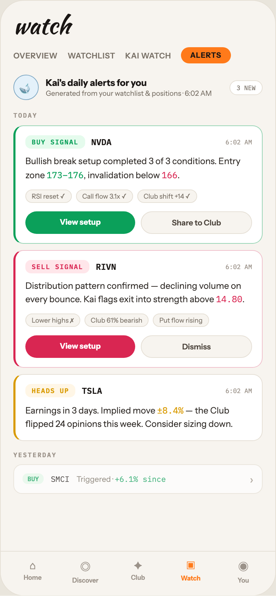

# 18 WATCH · KAI ALERTS

Canvas: **CHEAT CODE · LIGHT THEME · SAME SYSTEM** · board index 17 · slug `18-watch-kai-alerts`
Frame: **392×846px** (design width 392px — port at 390px logical, scale ratios).

> Style values are EXACT computed values from the canvas. `T.*` = canvas token, resolved in
> the Tokens appendix at the bottom of this file. Text marked `(MOCK)` must not ship as drawn —
> see `../../DELTA.md` for its substitution rule.

## Tree

- **“watch OVERVIEW WATCHLIST KAI WATCH ALERT…”** → `
`
  - box: 392x846 · display: flex · dir: column · width: 390px · height: 844px · bg: T.orange-50 · border: 1px solid T.orange-100 · radius: 34px (T.r20) · overflow: hidden · type: color T.neutral-950 / Instrument Sans / 16px / w400 / lh normal
  - **“watch OVERVIEW WATCHLIST KAI WATCH ALERT…”** → `
`
    - box: 390x781 · flex: 1 1 0% · flex-grow: 1 · flex-basis: 0% · pad: 18px 18px 0px 18px · overflow: hidden
    - **"watch"** → `
`
      - box: 354x34 · type: color T.orange-900 / Kaushan Script / 34px / lh 34px · scale: T.ty2
      - text: "watch"
    - **“OVERVIEW WATCHLIST KAI WATCH ALERTS…”** → `
`
      - box: 354x23 · display: flex · align: center · gap: 14px · margin: 14px 0px 0px 0px
      - **"OVERVIEW"** → ``
        - box: 63x14 · type: color T.neutral-500 / 11px / w600 / ls 0.44px · scale: T.ty90
        - text: "OVERVIEW"
      - **"WATCHLIST"** → ``
        - box: 67.8x14 · type: color T.neutral-500 / 11px / w600 / ls 0.44px · scale: T.ty90
        - text: "WATCHLIST"
      - **"KAI WATCH"** → ``
        - box: 65.2x14 · type: color T.neutral-500 / 11px / w600 / ls 0.44px · scale: T.ty90
        - text: "KAI WATCH"
      - **"ALERTS"** → ``
        - box: 70.5x23 · pad: 5px 13px 5px 13px · bg: T.orange-400-b · radius: 16px (T.r16) · type: color T.orange-900 / 10.5px / w800 / ls 0.63px · scale: T.ty104
        - text: "ALERTS"
    - **“🐋 Kai's daily alerts for you Generated …”** → `
`
      - box: 354x36 · display: flex · align: center · gap: 10px · margin: 16px 0px 0px 0px
      - **"🐋"** → `
`
        - box: 36x36 · display: grid · align: center · justify-items: center · grid-cols: 34px · grid-rows: 34px · width: 34px · height: 34px · bg: T.blue-50 · border: 1px solid T.blue-300-b · radius: 50% (T.r21) · type: 15px · scale: T.ty42
        - text: "🐋"
      - **“Kai's daily alerts for you Generated fro…”** → `
`
        - box: 251x30 · flex: 1 1 0% · flex-grow: 1 · flex-basis: 0%
        - **"Kai's daily alerts for you"** → `
`
          - box: 251x16 · type: color T.orange-900 / 13px / w700 · scale: T.ty58
          - text: "Kai's daily alerts for you"
        - **"Generated from your watchlist & positions · "** → `
`
          - box: 251x13 · margin: 1px 0px 0px 0px · type: color T.neutral-500 / 10px · scale: T.ty109
          - text: "Generated from your watchlist & positions · 6:02 AM"
      - **"3 NEW"** → ``
        - box: 47x21 · pad: 4px 9px 4px 9px · bg: T.neutral-0 · border: 1px solid T.orange-100 · radius: 12px (T.r13) · type: color T.neutral-500 / IBM Plex Mono / 9px · scale: T.ty127
        - text: "3 NEW"
    - **"Today"** → `
`
      - box: 354x11 · margin: 16px 0px 0px 0px · type: color T.orange-400 / IBM Plex Mono / 9px / w600 / ls 1.44px / uppercase · scale: T.ty131
      - text: "Today"
    - **“BUY SIGNAL NVDA 6:02 AM Bullish break se…”** → `
`
      - box: 354x167.5 · pad: 13px 14px 13px 14px · margin: 9px 0px 0px 0px · bg: T.neutral-0 · border: T:1px solid T.green-200 R:1px solid T.green-200 B:1px solid T.green-200 L:3px solid T.teal-600 · radius: 14px (T.r15)
      - **“BUY SIGNAL NVDA 6:02 AM…”** → `
`
        - box: 322x19 · display: flex · align: center · gap: 9px
        - **"BUY SIGNAL"** → ``
          - box: 84.5x19 · pad: 3px 9px 3px 9px · bg: T.green-400a14 · radius: 8px (T.r9) · type: color T.teal-600 / IBM Plex Mono / 9.5px / w700 / ls 0.95px · scale: T.ty122
          - text: "BUY SIGNAL"
        - **"NVDA"** → ``
          - box: 28.8x15 · type: color T.orange-900 / IBM Plex Mono / 12px / w600 · scale: T.ty73
          - text: "NVDA"
        - **"6:02 AM"** → ``
          - box: 37.8x11 · margin: 0px 0px 0px 152.875px · type: color T.orange-400 / IBM Plex Mono / 9px · scale: T.ty127
          - text: "6:02 AM"
      - **"Bullish break setup completed 3 of 3 conditi"** → `
`
        - box: 322x38.5 · margin: 9px 0px 0px 0px · type: color T.orange-800 / 12.5px / lh 18.75px · scale: T.ty66
        - text: "Bullish break setup completed 3 of 3 conditions. Entry zone , invalidation below ."
        - **"173–176"** → ``
          - box: 52.5x16 · display: inline · type: color T.teal-600 / IBM Plex Mono · scale: T.ty67
          - text: "173–176"
        - **"166"** → ``
          - box: 22.5x16 · display: inline · type: color T.red-400 / IBM Plex Mono · scale: T.ty67
          - text: "166"
      - **“RSI reset ✓ Call flow 3.1x ✓ Club shift …”** → `
`
        - box: 322x19 · display: flex · wrap: wrap · gap: 6px · margin: 10px 0px 0px 0px
        - **"RSI reset ✓"** → ``
          - box: 65.7x19 · pad: 3px 8px 3px 8px · bg: T.orange-50 · border: 1px solid T.orange-100 · radius: 10px (T.r11) · type: color T.neutral-500 / 9.5px · scale: T.ty117
          - text: "RSI reset ✓"
        - **"Call flow 3.1x ✓"** → ``
          - box: 81.2x19 · pad: 3px 8px 3px 8px · bg: T.orange-50 · border: 1px solid T.orange-100 · radius: 10px (T.r11) · type: color T.neutral-500 / 9.5px · scale: T.ty117
          - text: "Call flow 3.1x ✓"
        - **"Club shift +14 ✓"** **(MOCK)** → ``
          - box: 84.7x19 · pad: 3px 8px 3px 8px · bg: T.orange-50 · border: 1px solid T.orange-100 · radius: 10px (T.r11) · type: color T.neutral-500 / 9.5px · scale: T.ty117
          - text: "Club shift +14 ✓"
      - **“View setup Share to Club…”** → `
`
        - box: 322x32 · display: flex · gap: 8px · margin: 12px 0px 0px 0px
        - **"View setup"** → ``
          - box: 156x32 · flex: 1 1 0% · flex-grow: 1 · flex-basis: 0% · pad: 8px 0px 8px 0px · bg: T.teal-600 · radius: 16px (T.r16) · type: color T.neutral-0 / 11px / w800 / align-center · scale: T.ty91
          - text: "View setup"
        - **"Share to Club"** → ``
          - box: 158x32 · flex: 1 1 0% · flex-grow: 1 · flex-basis: 0% · pad: 8px 0px 8px 0px · bg: T.orange-50 · border: 1px solid T.orange-100 · radius: 16px (T.r16) · type: color T.orange-700 / 11px / w600 / align-center · scale: T.ty92
          - text: "Share to Club"
    - **“SELL SIGNAL RIVN 6:02 AM Distribution pa…”** → `
`
      - box: 354x167.5 · pad: 13px 14px 13px 14px · margin: 9px 0px 0px 0px · bg: T.neutral-0 · border: T:1px solid T.red-100 R:1px solid T.red-100 B:1px solid T.red-100 L:3px solid T.red-400 · radius: 14px (T.r15)
      - **“SELL SIGNAL RIVN 6:02 AM…”** → `
`
        - box: 322x19 · display: flex · align: center · gap: 9px
        - **"SELL SIGNAL"** → ``
          - box: 91.2x19 · pad: 3px 9px 3px 9px · bg: T.red-300a14 · radius: 8px (T.r9) · type: color T.red-400 / IBM Plex Mono / 9.5px / w700 / ls 0.95px · scale: T.ty122
          - text: "SELL SIGNAL"
        - **"RIVN"** → ``
          - box: 28.8x15 · type: color T.orange-900 / IBM Plex Mono / 12px / w600 · scale: T.ty73
          - text: "RIVN"
        - **"6:02 AM"** → ``
          - box: 37.8x11 · margin: 0px 0px 0px 146.219px · type: color T.orange-400 / IBM Plex Mono / 9px · scale: T.ty127
          - text: "6:02 AM"
      - **"Distribution pattern confirmed — declining v"** → `
`
        - box: 322x38.5 · margin: 9px 0px 0px 0px · type: color T.orange-800 / 12.5px / lh 18.75px · scale: T.ty66
        - text: "Distribution pattern confirmed — declining volume on every bounce. Kai flags exit into strength above ."
        - **"14.80"** → ``
          - box: 37.5x16 · display: inline · type: color T.red-400 / IBM Plex Mono · scale: T.ty67
          - text: "14.80"
      - **“Lower highs ✗ Club 61% bearish Put flow …”** → `
`
        - box: 322x19 · display: flex · wrap: wrap · gap: 6px · margin: 10px 0px 0px 0px
        - **"Lower highs ✗"** → ``
          - box: 77.8x19 · pad: 3px 8px 3px 8px · bg: T.orange-50 · border: 1px solid T.orange-100 · radius: 10px (T.r11) · type: color T.neutral-500 / 9.5px · scale: T.ty117
          - text: "Lower highs ✗"
        - **"Club 61% bearish"** **(MOCK)** → ``
          - box: 91.4x19 · pad: 3px 8px 3px 8px · bg: T.orange-50 · border: 1px solid T.orange-100 · radius: 10px (T.r11) · type: color T.neutral-500 / 9.5px · scale: T.ty117
          - text: "Club 61% bearish"
        - **"Put flow rising"** → ``
          - box: 79.5x19 · pad: 3px 8px 3px 8px · bg: T.orange-50 · border: 1px solid T.orange-100 · radius: 10px (T.r11) · type: color T.neutral-500 / 9.5px · scale: T.ty117
          - text: "Put flow rising"
      - **“View setup Dismiss…”** → `
`
        - box: 322x32 · display: flex · gap: 8px · margin: 12px 0px 0px 0px
        - **"View setup"** → ``
          - box: 156x32 · flex: 1 1 0% · flex-grow: 1 · flex-basis: 0% · pad: 8px 0px 8px 0px · bg: T.red-400 · radius: 16px (T.r16) · type: color T.neutral-0 / 11px / w800 / align-center · scale: T.ty91
          - text: "View setup"
        - **"Dismiss"** → ``
          - box: 158x32 · flex: 1 1 0% · flex-grow: 1 · flex-basis: 0% · pad: 8px 0px 8px 0px · bg: T.orange-50 · border: 1px solid T.orange-100 · radius: 16px (T.r16) · type: color T.orange-700 / 11px / w600 / align-center · scale: T.ty92
          - text: "Dismiss"
    - **“HEADS UP TSLA 6:02 AM Earnings in 3 days…”** → `
`
      - box: 354x94.5 · pad: 13px 14px 13px 14px · margin: 9px 0px 0px 0px · bg: T.neutral-0 · border: T:1px solid T.orange-100 R:1px solid T.orange-100 B:1px solid T.orange-100 L:3px solid T.amber-500 · radius: 14px (T.r15)
      - **“HEADS UP TSLA 6:02 AM…”** → `
`
        - box: 322x19 · display: flex · align: center · gap: 9px
        - **"HEADS UP"** → ``
          - box: 71.2x19 · pad: 3px 9px 3px 9px · bg: T.orange-300a14 · radius: 8px (T.r9) · type: color T.amber-500 / IBM Plex Mono / 9.5px / w700 / ls 0.95px · scale: T.ty122
          - text: "HEADS UP"
        - **"TSLA"** → ``
          - box: 28.8x15 · type: color T.orange-900 / IBM Plex Mono / 12px / w600 · scale: T.ty73
          - text: "TSLA"
        - **"6:02 AM"** → ``
          - box: 37.8x11 · margin: 0px 0px 0px 166.172px · type: color T.orange-400 / IBM Plex Mono / 9px · scale: T.ty127
          - text: "6:02 AM"
      - **"Earnings in 3 days. Implied move — the Club "** → `
`
        - box: 322x38.5 · margin: 9px 0px 0px 0px · type: color T.orange-800 / 12.5px / lh 18.75px · scale: T.ty66
        - text: "Earnings in 3 days. Implied move — the Club flipped 24 opinions this week. Consider sizing down."
        - **"±8.4%"** **(MOCK)** → ``
          - box: 37.5x16 · display: inline · type: color T.amber-500 / IBM Plex Mono · scale: T.ty67
          - text: "±8.4%"
    - **"Yesterday"** → `
`
      - box: 354x11 · margin: 14px 0px 0px 0px · type: color T.orange-400 / IBM Plex Mono / 9px / w600 / ls 1.44px / uppercase · scale: T.ty131
      - text: "Yesterday"
    - **“BUY SMCI Triggered · +6.1% since ›…”** → `
`
      - box: 354x42 · display: flex · align: center · gap: 10px · pad: 10px 12px 10px 12px · margin: 8px 0px 0px 0px · bg: T.neutral-0 · border: 1px solid T.orange-100 · radius: 12px (T.r13) · opacity: 0.7
      - **"BUY"** → ``
        - box: 30.2x15 · pad: 2px 7px 2px 7px · bg: T.green-400a14 · radius: 7px (T.r8) · type: color T.teal-600 / IBM Plex Mono / 9px / w700 · scale: T.ty138
        - text: "BUY"
      - **"SMCI"** → ``
        - box: 26.4x14 · type: color T.orange-900 / IBM Plex Mono / 11px · scale: T.ty89
        - text: "SMCI"
      - **"Triggered ·"** → ``
        - box: 236x14 · flex: 1 1 0% · flex-grow: 1 · flex-basis: 0% · type: color T.neutral-500 / 11px · scale: T.ty88
        - text: "Triggered ·"
        - **"+6.1% since"** **(MOCK)** → ``
          - box: 72.6x14 · display: inline · type: color T.teal-600 / IBM Plex Mono · scale: T.ty89
          - text: "+6.1% since"
      - **"›"** → ``
        - box: 5.4x20 · type: color T.orange-400 · scale: T.ty36
        - text: "›"
  - **“⌂ Home ◎ Discover ✦ Club ▣ Watch ◉ You…”** → `
`
    - box: 390x63 · display: flex · pad: 10px 8px 16px 8px · bg: T.orange-50 · border: T:1px solid T.orange-100 R:0px none T.neutral-950 B:0px none T.neutral-950 L:0px none T.neutral-950
    - **“⌂ Home…”** → `
`
      - box: 74.8x36 · flex: 1 1 0% · flex-grow: 1 · flex-basis: 0% · type: align-center
      - **"⌂"** → `
`
        - box: 74.8x19 · type: color T.orange-400 / 15px · scale: T.ty42
        - text: "⌂"
      - **"Home"** → `
`
        - box: 74.8x11 · margin: 2px 0px 0px 0px · type: color T.orange-400 / 9px / w600 · scale: T.ty126
        - text: "Home"
    - **“◎ Discover…”** → `
`
      - box: 74.8x36 · flex: 1 1 0% · flex-grow: 1 · flex-basis: 0% · type: align-center
      - **"◎"** → `
`
        - box: 74.8x23 · type: color T.orange-400 / 15px · scale: T.ty42
        - text: "◎"
      - **"Discover"** → `
`
        - box: 74.8x11 · margin: 2px 0px 0px 0px · type: color T.orange-400 / 9px / w600 · scale: T.ty126
        - text: "Discover"
    - **“✦ Club…”** → `
`
      - box: 74.8x36 · flex: 1 1 0% · flex-grow: 1 · flex-basis: 0% · type: align-center
      - **"✦"** → `
`
        - box: 74.8x19 · type: color T.orange-400 / 15px · scale: T.ty42
        - text: "✦"
      - **"Club"** → `
`
        - box: 74.8x11 · margin: 2px 0px 0px 0px · type: color T.orange-400 / 9px / w600 · scale: T.ty126
        - text: "Club"
    - **“▣ Watch…”** → `
`
      - box: 74.8x36 · flex: 1 1 0% · flex-grow: 1 · flex-basis: 0% · type: align-center
      - **"▣"** → `
`
        - box: 74.8x20 · type: color T.orange-400-b / 15px · scale: T.ty42
        - text: "▣"
      - **"Watch"** → `
`
        - box: 74.8x11 · margin: 2px 0px 0px 0px · type: color T.orange-400-b / 9px / w700 · scale: T.ty129
        - text: "Watch"
    - **“◉ You…”** → `
`
      - box: 74.8x36 · flex: 1 1 0% · flex-grow: 1 · flex-basis: 0% · type: align-center
      - **"◉"** → `
`
        - box: 74.8x23 · type: color T.orange-400 / 15px · scale: T.ty42
        - text: "◉"
      - **"You"** → `
`
        - box: 74.8x11 · margin: 2px 0px 0px 0px · type: color T.orange-400 / 9px / w600 · scale: T.ty126
        - text: "You"

## Tokens used in this board

| token | value | role |
| --- | --- | --- |
| T.orange-100 | `#E5DFD5` | border, bg, gradient |
| T.orange-900 | `#1A1614` | text, bg, border |
| T.orange-400 | `#9B9289` | text, bg |
| T.neutral-0 | `#FFFFFF` | bg, gradient, border, text |
| T.neutral-500 | `#7B7369` | text, border, bg |
| T.orange-400-b | `#FF7A1A` | bg, text, border, gradient |
| T.neutral-950 | `#000000` | border, text |
| T.teal-600 | `#0BA05A` | text, gradient, border, bg |
| T.orange-50 | `#F7F4EF` | bg, border, text, gradient |
| T.orange-700 | `#4E463E` | text |
| T.red-400 | `#D92652` | text, gradient, bg, border |
| T.amber-500 | `#D99A00` | text, gradient, border, bg |
| T.orange-800 | `#2E2925` | text |
| T.red-100 | `#F0BFCB` | gradient, border |
| T.green-200 | `#96D4B4` | gradient, border |
| T.blue-50 | `#E4F1FA` | bg, gradient |
| T.green-400a14 | `#4AE383/0.14` | bg |
| T.blue-300-b | `#7FA8C4` | border |
| T.red-300a14 | `#FF4D6D/0.14` | bg |
| T.orange-300a14 | `#FFC24B/0.14` | bg |
| T.ty2 | Kaushan Script 34px/34px w400 ls:normal | type scale |
| T.ty36 | Instrument Sans 16px/normal w400 ls:normal | type scale |
| T.ty42 | Instrument Sans 15px/normal w400 ls:normal | type scale |
| T.ty58 | Instrument Sans 13px/normal w700 ls:normal | type scale |
| T.ty66 | Instrument Sans 12.5px/18.75px w400 ls:normal | type scale |
| T.ty67 | IBM Plex Mono 12.5px/18.75px w400 ls:normal | type scale |
| T.ty73 | IBM Plex Mono 12px/normal w600 ls:normal | type scale |
| T.ty88 | Instrument Sans 11px/normal w400 ls:normal | type scale |
| T.ty89 | IBM Plex Mono 11px/normal w400 ls:normal | type scale |
| T.ty90 | Instrument Sans 11px/normal w600 ls:0.44px | type scale |
| T.ty91 | Instrument Sans 11px/normal w800 ls:normal | type scale |
| T.ty92 | Instrument Sans 11px/normal w600 ls:normal | type scale |
| T.ty104 | Instrument Sans 10.5px/normal w800 ls:0.63px | type scale |
| T.ty109 | Instrument Sans 10px/normal w400 ls:normal | type scale |
| T.ty117 | Instrument Sans 9.5px/normal w400 ls:normal | type scale |
| T.ty122 | IBM Plex Mono 9.5px/normal w700 ls:0.95px | type scale |
| T.ty126 | Instrument Sans 9px/normal w600 ls:normal | type scale |
| T.ty127 | IBM Plex Mono 9px/normal w400 ls:normal | type scale |
| T.ty129 | Instrument Sans 9px/normal w700 ls:normal | type scale |
| T.ty131 | IBM Plex Mono 9px/normal w600 ls:1.44px uppercase | type scale |
| T.ty138 | IBM Plex Mono 9px/normal w700 ls:normal | type scale |
| T.r8 | `7px` | radius |
| T.r9 | `8px` | radius |
| T.r11 | `10px` | radius |
| T.r13 | `12px` | radius |
| T.r15 | `14px` | radius |
| T.r16 | `16px` | radius |
| T.r20 | `34px` | radius |
| T.r21 | `50%` | radius |
