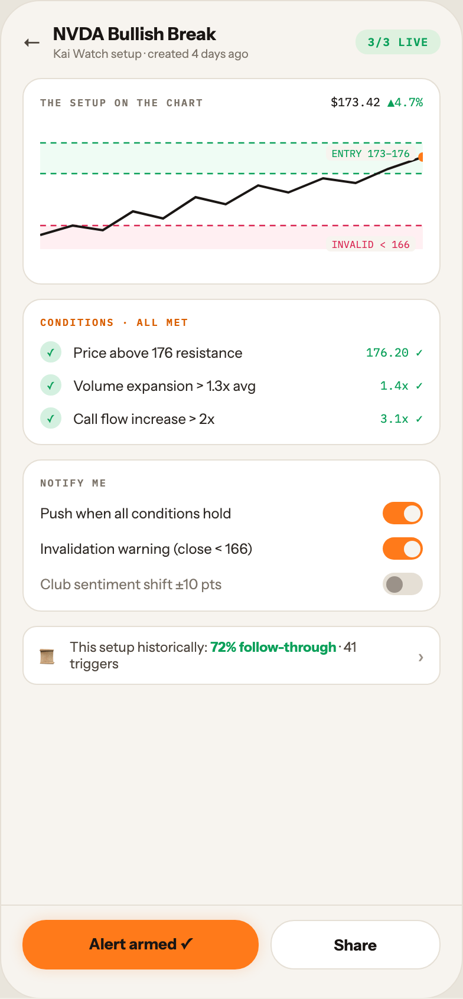

# 19 ALERT · VIEW SETUP

Canvas: **CHEAT CODE · LIGHT THEME · SAME SYSTEM** · board index 18 · slug `19-alert-view-setup`
Frame: **392×846px** (design width 392px — port at 390px logical, scale ratios).

> Style values are EXACT computed values from the canvas. `T.*` = canvas token, resolved in
> the Tokens appendix at the bottom of this file. Text marked `(MOCK)` must not ship as drawn —
> see `../../DELTA.md` for its substitution rule.

## Tree

- **“← NVDA Bullish Break Kai Watch setup · c…”** → `
`
  - box: 392x846 · display: flex · dir: column · width: 390px · height: 844px · bg: T.orange-50 · border: 1px solid T.orange-100 · radius: 34px (T.r20) · overflow: hidden · type: color T.neutral-950 / Instrument Sans / 16px / w400 / lh normal
  - **“← NVDA Bullish Break Kai Watch setup · c…”** → `
`
    - box: 390x765 · flex: 1 1 0% · flex-grow: 1 · flex-basis: 0% · pad: 18px 18px 0px 18px · overflow: hidden
    - **“← NVDA Bullish Break Kai Watch setup · c…”** → `
`
      - box: 354x33 · display: flex · align: center · gap: 10px
      - **"←"** → ``
        - box: 16x20 · type: color T.orange-700 · scale: T.ty36
        - text: "←"
      - **“NVDA Bullish Break Kai Watch setup · cre…”** → `
`
        - box: 246.3x33 · flex: 1 1 0% · flex-grow: 1 · flex-basis: 0%
        - **"NVDA Bullish Break"** → `
`
          - box: 246.3x19 · type: color T.orange-900 / 15px / w800 · scale: T.ty43
          - text: "NVDA Bullish Break"
        - **"Kai Watch setup · created 4 days ago"** **(MOCK)** → `
`
          - box: 246.3x13 · margin: 1px 0px 0px 0px · type: color T.neutral-500 / 10px · scale: T.ty109
          - text: "Kai Watch setup · created 4 days ago"
      - **"3/3 LIVE"** → ``
        - box: 71.7x21 · pad: 4px 10px 4px 10px · bg: T.green-400a14 · radius: 10px (T.r11) · type: color T.teal-600 / IBM Plex Mono / 9.5px / w700 / ls 0.76px · scale: T.ty125
        - text: "3/3 LIVE"
    - **“THE SETUP ON THE CHART $173.42 ▲4.7% ENT…”** → `
`
      - box: 354x175 · pad: 13px 14px 13px 14px · margin: 14px 0px 0px 0px · bg: T.neutral-0 · border: 1px solid T.orange-100 · radius: 16px (T.r16)
      - **“THE SETUP ON THE CHART $173.42 ▲4.7%…”** → `
`
        - box: 324x13 · display: flex · align: baseline · justify: space-between
        - **"The setup on the chart"** → ``
          - box: 138.4x11 · type: color T.neutral-500 / IBM Plex Mono / 8.5px / w600 / ls 1.19px / uppercase · scale: T.ty140
          - text: "The setup on the chart"
        - **"$173.42"** **(MOCK)** → ``
          - box: 78x13 · type: color T.orange-900 / IBM Plex Mono / 10px · scale: T.ty108
          - text: "$173.42"
          - **"▲4.7%"** **(MOCK)** → ``
            - box: 30x13 · display: inline · type: color T.teal-600 · scale: T.ty108
            - text: "▲4.7%"
      - **“ENTRY 173–176 INVALID < 166…”** → `
`
        - box: 324x124 · margin: 10px 0px 0px 0px · position: relative [0px 0px 0px 0px]
        - **svg** → `<svg>`
          - box: 324x120 · display: inline · overflow: hidden
          - svg: `<svg data-dc-tpl="1561" width="100%" height="120" viewBox="0 0 330 120" preserveAspectRatio="none">
                <rect data-dc-tpl="1562" x="0" y="18" width="330" height="26" fill="rgba(74,227,131,.09)"></rect>
                <rect data-dc-tpl="1563" x="0" y="88" width="330" height="20" fill="rg`
          - **block[0]** → `<rect>`
            - box: 324x26 · display: inline
          - **block[1]** → `<rect>`
            - box: 324x20 · display: inline
          - **block[2]** → `<path>`
            - box: 324x0 · display: inline
          - **block[3]** → `<path>`
            - box: 324x0 · display: inline
          - **block[4]** → `<path>`
            - box: 324x0 · display: inline
          - **block[5]** → `<path>`
            - box: 324x66 · display: inline
          - **block[6]** → `<circle>`
            - box: 7.9x8 · display: inline
        - **"ENTRY 173–176"** → ``
          - box: 76.3x13 · pad: 1px 5px 1px 5px · bg: T.orange-50 · radius: 4px (T.r5) · position: absolute [20px 6px 91px 241.688px] · type: color T.teal-600 / IBM Plex Mono / 8.5px · scale: T.ty142
          - text: "ENTRY 173–176"
        - **"INVALID < 166"** → ``
          - box: 76.3x13 · pad: 1px 5px 1px 5px · bg: T.orange-50 · radius: 4px (T.r5) · position: absolute [97px 6px 14px 241.688px] · type: color T.red-400 / IBM Plex Mono / 8.5px · scale: T.ty142
          - text: "INVALID < 166"
    - **“CONDITIONS · ALL MET ✓ Price above 176 r…”** → `
`
      - box: 354x124 · pad: 13px 14px 13px 14px · margin: 12px 0px 0px 0px · bg: T.neutral-0 · border: 1px solid T.orange-100 · radius: 16px (T.r16)
      - **"Conditions · all met"** → `
`
        - box: 324x11 · type: color T.orange-500 / IBM Plex Mono / 8.5px / w600 / ls 1.19px / uppercase · scale: T.ty140
        - text: "Conditions · all met"
      - **“✓ Price above 176 resistance 176.20 ✓ ✓ …”** → `
`
        - box: 324x74 · display: flex · dir: column · gap: 10px · margin: 11px 0px 0px 0px
        - **“✓ Price above 176 resistance 176.20 ✓…”** → `
`
          - box: 324x18 · display: flex · align: center · gap: 10px
          - **"✓"** → ``
            - box: 18x18 · display: grid · align: center · justify-items: center · grid-cols: 18px · grid-rows: 18px · width: 18px · height: 18px · flex: 0 0 auto · flex-shrink: 0 · bg: T.green-100 · radius: 50% (T.r21) · type: color T.teal-600 / 9px · scale: T.ty128
            - text: "✓"
          - **"Price above 176 resistance"** → ``
            - box: 238x15 · flex: 1 1 0% · flex-grow: 1 · flex-basis: 0% · type: color T.orange-800 / 12px · scale: T.ty71
            - text: "Price above 176 resistance"
          - **"176.20 ✓"** → ``
            - box: 48x13 · type: color T.teal-600 / IBM Plex Mono / 10px · scale: T.ty108
            - text: "176.20 ✓"
        - **“✓ Volume expansion > 1.3x avg 1.4x ✓…”** → `
`
          - box: 324x18 · display: flex · align: center · gap: 10px
          - **"✓"** → ``
            - box: 18x18 · display: grid · align: center · justify-items: center · grid-cols: 18px · grid-rows: 18px · width: 18px · height: 18px · flex: 0 0 auto · flex-shrink: 0 · bg: T.green-100 · radius: 50% (T.r21) · type: color T.teal-600 / 9px · scale: T.ty128
            - text: "✓"
          - **"Volume expansion > 1.3x avg"** → ``
            - box: 250x15 · flex: 1 1 0% · flex-grow: 1 · flex-basis: 0% · type: color T.orange-800 / 12px · scale: T.ty71
            - text: "Volume expansion > 1.3x avg"
          - **"1.4x ✓"** → ``
            - box: 36x13 · type: color T.teal-600 / IBM Plex Mono / 10px · scale: T.ty108
            - text: "1.4x ✓"
        - **“✓ Call flow increase > 2x 3.1x ✓…”** → `
`
          - box: 324x18 · display: flex · align: center · gap: 10px
          - **"✓"** → ``
            - box: 18x18 · display: grid · align: center · justify-items: center · grid-cols: 18px · grid-rows: 18px · width: 18px · height: 18px · flex: 0 0 auto · flex-shrink: 0 · bg: T.green-100 · radius: 50% (T.r21) · type: color T.teal-600 / 9px · scale: T.ty128
            - text: "✓"
          - **"Call flow increase > 2x"** → ``
            - box: 250x15 · flex: 1 1 0% · flex-grow: 1 · flex-basis: 0% · type: color T.orange-800 / 12px · scale: T.ty71
            - text: "Call flow increase > 2x"
          - **"3.1x ✓"** → ``
            - box: 36x13 · type: color T.teal-600 / IBM Plex Mono / 10px · scale: T.ty108
            - text: "3.1x ✓"
    - **“NOTIFY ME Push when all conditions hold …”** → `
`
      - box: 354x129 · pad: 13px 14px 13px 14px · margin: 12px 0px 0px 0px · bg: T.neutral-0 · border: 1px solid T.orange-100 · radius: 16px (T.r16)
      - **"Notify me"** → `
`
        - box: 324x11 · type: color T.neutral-500 / IBM Plex Mono / 8.5px / w600 / ls 1.19px / uppercase · scale: T.ty140
        - text: "Notify me"
      - **“Push when all conditions hold Invalidati…”** → `
`
        - box: 324x79 · display: flex · dir: column · gap: 11px · margin: 11px 0px 0px 0px
        - **“Push when all conditions hold…”** → `
`
          - box: 324x19 · display: flex · align: center · gap: 10px
          - **"Push when all conditions hold"** → ``
            - box: 280x15 · flex: 1 1 0% · flex-grow: 1 · flex-basis: 0% · type: color T.orange-800 / 12px · scale: T.ty71
            - text: "Push when all conditions hold"
          - **block[1]** → ``
            - box: 34x19 · width: 34px · height: 19px · flex: 0 0 auto · flex-shrink: 0 · bg: T.orange-400-b · radius: 10px (T.r11) · position: relative [0px 0px 0px 0px]
            - **block[0]** → ``
              - box: 14x14 · width: 14px · height: 14px · bg: T.orange-50 · radius: 50% (T.r21) · position: absolute [2.5px 2.5px 2.5px 17.5px]
        - **“Invalidation warning (close < 166)…”** → `
`
          - box: 324x19 · display: flex · align: center · gap: 10px
          - **"Invalidation warning (close < 166)"** → ``
            - box: 280x15 · flex: 1 1 0% · flex-grow: 1 · flex-basis: 0% · type: color T.orange-800 / 12px · scale: T.ty71
            - text: "Invalidation warning (close < 166)"
          - **block[1]** → ``
            - box: 34x19 · width: 34px · height: 19px · flex: 0 0 auto · flex-shrink: 0 · bg: T.orange-400-b · radius: 10px (T.r11) · position: relative [0px 0px 0px 0px]
            - **block[0]** → ``
              - box: 14x14 · width: 14px · height: 14px · bg: T.orange-50 · radius: 50% (T.r21) · position: absolute [2.5px 2.5px 2.5px 17.5px]
        - **“Club sentiment shift ±10 pts…”** → `
`
          - box: 324x19 · display: flex · align: center · gap: 10px
          - **"Club sentiment shift ±10 pts"** → ``
            - box: 280x15 · flex: 1 1 0% · flex-grow: 1 · flex-basis: 0% · type: color T.neutral-500 / 12px · scale: T.ty71
            - text: "Club sentiment shift ±10 pts"
          - **block[1]** → ``
            - box: 34x19 · width: 34px · height: 19px · flex: 0 0 auto · flex-shrink: 0 · bg: T.orange-100 · radius: 10px (T.r11) · position: relative [0px 0px 0px 0px]
            - **block[0]** → ``
              - box: 14x14 · width: 14px · height: 14px · bg: T.orange-400 · radius: 50% (T.r21) · position: absolute [2.5px 17.5px 2.5px 2.5px]
    - **“📜 This setup historically: 72% follow-t…”** → `
`
      - box: 354x50 · display: flex · align: center · gap: 10px · pad: 10px 13px 10px 13px · margin: 12px 0px 0px 0px · bg: T.neutral-0 · border: 1px solid T.orange-100 · radius: 12px (T.r13)
      - **"📜"** → ``
        - box: 16x21 · type: 13px · scale: T.ty59
        - text: "📜"
      - **"This setup historically: · 41 triggers"** → ``
        - box: 284.6x28 · flex: 1 1 0% · flex-grow: 1 · flex-basis: 0% · type: color T.orange-700 / 11.5px · scale: T.ty81
        - text: "This setup historically: · 41 triggers"
        - **"72% follow-through"** **(MOCK)** → ``
          - box: 106.8x14 · display: inline · type: color T.teal-600 / w700 · scale: T.ty82
          - text: "72% follow-through"
      - **"›"** → ``
        - box: 5.4x20 · type: color T.orange-400 · scale: T.ty36
        - text: "›"
  - **“Alert armed ✓ Share…”** → `
`
    - box: 390x79 · display: flex · gap: 10px · pad: 12px 18px 24px 18px · border: T:1px solid T.orange-100 R:0px none T.neutral-950 B:0px none T.neutral-950 L:0px none T.neutral-950
    - **"Alert armed ✓"** → `
`
      - box: 199.5x42 · flex: 1.4 1 0% · flex-grow: 1.4 · flex-basis: 0% · pad: 12px 0px 12px 0px · bg: T.orange-400-b · radius: 20px (T.r18) · shadow: T.orange-400a20 0px 0px 12px 0px · type: color T.orange-900 / 13px / w800 / align-center · scale: T.ty61
      - text: "Alert armed ✓"
    - **"Share"** → `
`
      - box: 144.5x42 · flex: 1 1 0% · flex-grow: 1 · flex-basis: 0% · pad: 12px 0px 12px 0px · bg: T.neutral-0 · border: 1px solid T.orange-100 · radius: 20px (T.r18) · type: color T.orange-900 / 13px / w700 / align-center · scale: T.ty58
      - text: "Share"

## Tokens used in this board

| token | value | role |
| --- | --- | --- |
| T.orange-100 | `#E5DFD5` | border, bg, gradient |
| T.orange-900 | `#1A1614` | text, bg, border |
| T.orange-400 | `#9B9289` | text, bg |
| T.neutral-0 | `#FFFFFF` | bg, gradient, border, text |
| T.neutral-500 | `#7B7369` | text, border, bg |
| T.orange-400-b | `#FF7A1A` | bg, text, border, gradient |
| T.neutral-950 | `#000000` | border, text |
| T.teal-600 | `#0BA05A` | text, gradient, border, bg |
| T.orange-50 | `#F7F4EF` | bg, border, text, gradient |
| T.orange-500 | `#D95E00` | text |
| T.orange-700 | `#4E463E` | text |
| T.red-400 | `#D92652` | text, gradient, bg, border |
| T.orange-800 | `#2E2925` | text |
| T.green-100 | `#D4F0E0` | bg |
| T.orange-400a20 | `#FF7A1A/0.2` | shadow |
| T.green-400a14 | `#4AE383/0.14` | bg |
| T.ty36 | Instrument Sans 16px/normal w400 ls:normal | type scale |
| T.ty43 | Instrument Sans 15px/normal w800 ls:normal | type scale |
| T.ty58 | Instrument Sans 13px/normal w700 ls:normal | type scale |
| T.ty59 | Instrument Sans 13px/normal w400 ls:normal | type scale |
| T.ty61 | Instrument Sans 13px/normal w800 ls:normal | type scale |
| T.ty71 | Instrument Sans 12px/normal w400 ls:normal | type scale |
| T.ty81 | Instrument Sans 11.5px/normal w400 ls:normal | type scale |
| T.ty82 | Instrument Sans 11.5px/normal w700 ls:normal | type scale |
| T.ty108 | IBM Plex Mono 10px/normal w400 ls:normal | type scale |
| T.ty109 | Instrument Sans 10px/normal w400 ls:normal | type scale |
| T.ty125 | IBM Plex Mono 9.5px/normal w700 ls:0.76px | type scale |
| T.ty128 | Instrument Sans 9px/normal w400 ls:normal | type scale |
| T.ty140 | IBM Plex Mono 8.5px/normal w600 ls:1.19px uppercase | type scale |
| T.ty142 | IBM Plex Mono 8.5px/normal w400 ls:normal | type scale |
| T.r5 | `4px` | radius |
| T.r11 | `10px` | radius |
| T.r13 | `12px` | radius |
| T.r16 | `16px` | radius |
| T.r18 | `20px` | radius |
| T.r20 | `34px` | radius |
| T.r21 | `50%` | radius |
