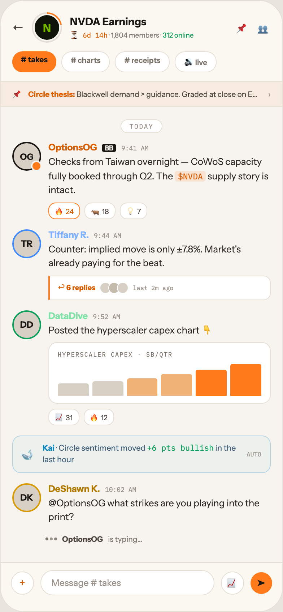

# 23 INSIDE A CIRCLE

Canvas: **CHEAT CODE · LIGHT THEME · SAME SYSTEM** · board index 22 · slug `23-inside-a-circle`
Frame: **392×846px** (design width 392px — port at 390px logical, scale ratios).

> Style values are EXACT computed values from the canvas. `T.*` = canvas token, resolved in
> the Tokens appendix at the bottom of this file. Text marked `(MOCK)` must not ship as drawn —
> see `../../DELTA.md` for its substitution rule.

## Tree

- **“← N NVDA Earnings ⏳ 6d 14h · 1,804 membe…”** → `
`
  - box: 392x846 · display: flex · dir: column · width: 390px · height: 844px · bg: T.orange-50 · border: 1px solid T.orange-100 · radius: 34px (T.r20) · overflow: hidden · type: color T.neutral-950 / Instrument Sans / 16px / w400 / lh normal
  - **“← N NVDA Earnings ⏳ 6d 14h · 1,804 membe…”** → `
`
    - box: 390x112 · pad: 16px 16px 12px 16px · bg: T.amber-0 · border: T:0px none T.neutral-950 R:0px none T.neutral-950 B:1px solid T.orange-100 L:0px none T.neutral-950
    - **“← N NVDA Earnings ⏳ 6d 14h · 1,804 membe…”** → `
`
      - box: 358x42 · display: flex · align: center · gap: 11px
      - **"←"** → ``
        - box: 16x20 · type: color T.orange-700 · scale: T.ty36
        - text: "←"
      - **“N…”** → `
`
        - box: 42x42 · width: 38px · height: 38px · flex: 0 0 auto · flex-shrink: 0 · pad: 2px 2px 2px 2px · bg-image: conic-gradient(T.orange-400-b 0deg, T.orange-400-b 22%, T.orange-100 22%, T.orange-100 100%) · radius: 50% (T.r21)
        - **"N"** → `
`
          - box: 38x38 · display: grid · align: center · justify-items: center · grid-cols: 34px · grid-rows: 34px · width: 100% · height: 100% · bg: T.lime-900 · border: 2px solid T.amber-0 · radius: 50% (T.r21) · type: color T.lime-600 / 15px / w800 · scale: T.ty43
          - text: "N"
      - **“NVDA Earnings ⏳ 6d 14h · 1,804 members ·…”** → `
`
        - box: 219x35 · min-width: 0px · flex: 1 1 0% · flex-grow: 1 · flex-basis: 0%
        - **"NVDA Earnings"** → `
`
          - box: 219x18 · type: color T.orange-900 / 14.5px / w800 · scale: T.ty48
          - text: "NVDA Earnings"
        - **"· 1,804 members ·"** **(MOCK)** → `
`
          - box: 219x16 · margin: 1px 0px 0px 0px · type: color T.neutral-500 / 9.5px · scale: T.ty117
          - text: "· 1,804 members ·"
          - **"⏳ 6d 14h"** → ``
            - box: 51.9x13 · display: inline · type: color T.orange-500 / IBM Plex Mono · scale: T.ty119
            - text: "⏳ 6d 14h"
          - **"312 online"** **(MOCK)** → ``
            - box: 43.1x11 · display: inline · type: color T.teal-600 · scale: T.ty117
            - text: "312 online"
      - **“📌 👥…”** → `
`
        - box: 48x23 · display: flex · align: center · gap: 12px · type: color T.neutral-500
        - **"📌"** → ``
          - box: 18x23 · type: 14px · scale: T.ty50
          - text: "📌"
        - **"👥"** → ``
          - box: 18x23 · type: 14px · scale: T.ty50
          - text: "👥"
    - **“# takes # charts # receipts 🔊 live…”** → `
`
      - box: 358x29 · display: flex · gap: 7px · margin: 12px 0px 0px 0px
      - **"# takes"** → ``
        - box: 61x29 · pad: 5px 12px 5px 12px · bg: T.orange-400-b · radius: 14px (T.r15) · type: color T.orange-900 / 10.5px / w800 · scale: T.ty105
        - text: "# takes"
      - **"# charts"** → ``
        - box: 67.3x29 · pad: 5px 12px 5px 12px · bg: T.neutral-0 · border: 1px solid T.orange-100 · radius: 14px (T.r15) · type: color T.neutral-500 / 10.5px / w600 · scale: T.ty101
        - text: "# charts"
      - **"# receipts"** → ``
        - box: 76x29 · pad: 5px 12px 5px 12px · bg: T.neutral-0 · border: 1px solid T.orange-100 · radius: 14px (T.r15) · type: color T.neutral-500 / 10.5px / w600 · scale: T.ty101
        - text: "# receipts"
      - **"🔊 live"** → ``
        - box: 57.9x29 · pad: 5px 12px 5px 12px · bg: T.neutral-0 · border: 1px solid T.orange-100 · radius: 14px (T.r15) · type: color T.neutral-500 / 10.5px / w600 · scale: T.ty101
        - text: "🔊 live"
  - **“📌 Circle thesis: Blackwell demand > gui…”** → `
`
    - box: 390x35 · display: flex · align: center · gap: 8px · pad: 8px 16px 8px 16px · bg: T.orange-400a07 · border: T:0px none T.neutral-950 R:0px none T.neutral-950 B:1px solid T.orange-100 L:0px none T.neutral-950
    - **"📌"** → ``
      - box: 14x18 · type: 11px · scale: T.ty88
      - text: "📌"
    - **"Blackwell demand > guidance. Graded at close"** → ``
      - box: 324.3x13 · text-overflow: ellipsis · flex: 1 1 0% · flex-grow: 1 · flex-basis: 0% · overflow: hidden · type: color T.orange-700 / 10.5px / nowrap · scale: T.ty100
      - text: "Blackwell demand > guidance. Graded at close on ER day."
      - **"Circle thesis:"** → `<strong>`
        - box: 64.8x13 · display: inline · type: color T.orange-500 / w700 · scale: T.ty103
        - text: "Circle thesis:"
    - **"›"** → ``
      - box: 3.7x14 · type: color T.orange-400 / 11px · scale: T.ty88
      - text: "›"
  - **“TODAY OG OptionsOG BB 9:41 AM Checks fro…”** → `
`
    - box: 390x629 · display: flex · dir: column · gap: 14px · flex: 1 1 0% · flex-grow: 1 · flex-basis: 0% · pad: 14px 16px 0px 16px · overflow: hidden
    - **“TODAY…”** → `
`
      - box: 358x20 · type: align-center
      - **"TODAY"** → ``
        - box: 57.3x19 · display: inline · pad: 3px 11px 3px 11px · bg: T.neutral-0 · border: 1px solid T.orange-100 · radius: 10px (T.r11) · type: color T.orange-400 / IBM Plex Mono / 9px / ls 1.26px · scale: T.ty139
        - text: "TODAY"
    - **“OG OptionsOG BB 9:41 AM Checks from Taiw…”** → `
`
      - box: 358x106.5 · display: flex · gap: 10px
      - **"OG"** → `
`
        - box: 40x40 · display: grid · align: center · justify-items: center · grid-cols: 36px · grid-rows: 36px · width: 36px · height: 36px · flex: 0 0 auto · flex-shrink: 0 · bg: T.orange-100-b · border: 2px solid T.orange-900 · radius: 50% (T.r21) · position: relative [0px 0px 0px 0px] · type: color T.orange-900 / 12px / w700 · scale: T.ty72
        - text: "OG"
        - **block[0]** → ``
          - box: 15x15 · width: 11px · height: 11px · bg: T.orange-400-b · border: 2px solid T.orange-50 · radius: 50% (T.r21) · position: absolute [24px -3px -3px 24px]
      - **“OptionsOG BB 9:41 AM Checks from Taiwan …”** → `
`
        - box: 308x106.5 · min-width: 0px · flex: 1 1 0% · flex-grow: 1 · flex-basis: 0%
        - **“OptionsOG BB 9:41 AM…”** → `
`
          - box: 308x15 · display: flex · align: baseline · gap: 7px
          - **"OptionsOG"** → ``
            - box: 67.3x15 · type: color T.orange-500 / 12.5px / w700 · scale: T.ty65
            - text: "OptionsOG"
          - **"BB"** → ``
            - box: 19.6x11 · pad: 0px 4px 0px 4px · bg: T.orange-900 · radius: 3px (T.r4) · type: color T.orange-50 / 9px / w700 · scale: T.ty129
            - text: "BB"
          - **"9:41 AM"** → ``
            - box: 37.8x11 · type: color T.orange-400 / IBM Plex Mono / 9px · scale: T.ty127
            - text: "9:41 AM"
        - **"Checks from Taiwan overnight — CoWoS capacit"** → `
`
          - box: 308x58.5 · margin: 3px 0px 0px 0px · type: color T.orange-800 / 13px / lh 19.5px · scale: T.ty62
          - text: "Checks from Taiwan overnight — CoWoS capacity fully booked through Q2. The supply story is intact."
          - **"$NVDA"** → ``
            - box: 42.5x15 · display: inline · pad: 0px 4px 0px 4px · bg: T.orange-400a14 · radius: 4px (T.r5) · type: color T.orange-500 / IBM Plex Mono / 11.5px / lh 17.25px · scale: T.ty85
            - text: "$NVDA"
        - **“🔥 24 🐂 18 💡 7…”** → `
`
          - box: 308x23 · display: flex · gap: 6px · margin: 7px 0px 0px 0px
          - **"🔥 24"** → ``
            - box: 44.1x23 · pad: 2px 8px 2px 8px · bg: T.neutral-0 · border: 1px solid T.orange-400-b · radius: 10px (T.r11) · type: color T.orange-500 / 10px · scale: T.ty109
            - text: "🔥 24"
          - **"🐂 18"** → ``
            - box: 42.7x23 · pad: 2px 8px 2px 8px · bg: T.neutral-0 · border: 1px solid T.orange-100 · radius: 10px (T.r11) · type: color T.orange-700 / 10px · scale: T.ty109
            - text: "🐂 18"
          - **"💡 7"** → ``
            - box: 38.3x23 · pad: 2px 8px 2px 8px · bg: T.neutral-0 · border: 1px solid T.orange-100 · radius: 10px (T.r11) · type: color T.orange-700 / 10px · scale: T.ty109
            - text: "💡 7"
    - **“TR Tiffany R. 9:44 AM Counter: implied m…”** → `
`
      - box: 358x98 · display: flex · gap: 10px
      - **"TR"** → `
`
        - box: 40x40 · display: grid · align: center · justify-items: center · grid-cols: 36px · grid-rows: 36px · width: 36px · height: 36px · flex: 0 0 auto · flex-shrink: 0 · bg: T.orange-100-b · border: 2px solid T.blue-300 · radius: 50% (T.r21) · type: color T.orange-900 / 12px / w700 · scale: T.ty72
        - text: "TR"
      - **“Tiffany R. 9:44 AM Counter: implied move…”** → `
`
        - box: 308x98 · min-width: 0px · flex: 1 1 0% · flex-grow: 1 · flex-basis: 0%
        - **“Tiffany R. 9:44 AM…”** → `
`
          - box: 308x15 · display: flex · align: baseline · gap: 7px
          - **"Tiffany R."** → ``
            - box: 56x15 · type: color T.blue-200 / 12.5px / w700 · scale: T.ty65
            - text: "Tiffany R."
          - **"9:44 AM"** → ``
            - box: 37.8x11 · type: color T.orange-400 / IBM Plex Mono / 9px · scale: T.ty127
            - text: "9:44 AM"
        - **"Counter: implied move is only ±7.8%. Market'"** **(MOCK)** → `
`
          - box: 308x39 · margin: 3px 0px 0px 0px · type: color T.orange-800 / 13px / lh 19.5px · scale: T.ty62
          - text: "Counter: implied move is only ±7.8%. Market's already paying for the beat."
        - **“↩ 6 replies last 2m ago…”** → `
`
          - box: 308x34 · pad: 8px 11px 8px 11px · margin: 7px 0px 0px 0px · bg: T.neutral-0 · border: T:1px solid T.orange-100 R:1px solid T.orange-100 B:1px solid T.orange-100 L:2px solid T.orange-400-b · radius: 0px 10px 10px 0px
          - **“↩ 6 replies last 2m ago…”** → `
`
            - box: 283x16 · display: flex · align: center · gap: 6px
            - **"↩ 6 replies"** **(MOCK)** → ``
              - box: 52.2x13 · type: color T.orange-500 / 10px / w700 · scale: T.ty111
              - text: "↩ 6 replies"
            - **block[1]** → `
`
              - box: 40x16 · display: flex
              - **block[0]** → ``
                - box: 16x16 · width: 14px · height: 14px · bg: T.orange-100-b · border: 1px solid T.neutral-0 · radius: 50% (T.r21)
              - **block[1]** → ``
                - box: 16x16 · width: 14px · height: 14px · margin: 0px 0px 0px -4px · bg: T.orange-200 · border: 1px solid T.neutral-0 · radius: 50% (T.r21)
              - **block[2]** → ``
                - box: 16x16 · width: 14px · height: 14px · margin: 0px 0px 0px -4px · bg: T.orange-100-b · border: 1px solid T.neutral-0 · radius: 50% (T.r21)
            - **"last 2m ago"** **(MOCK)** → ``
              - box: 56.1x11 · type: color T.orange-400 / IBM Plex Mono / 8.5px · scale: T.ty142
              - text: "last 2m ago"
    - **“DD DataDive 9:52 AM Posted the hyperscal…”** → `
`
      - box: 358x159.5 · display: flex · gap: 10px
      - **"DD"** → `
`
        - box: 40x40 · display: grid · align: center · justify-items: center · grid-cols: 36px · grid-rows: 36px · width: 36px · height: 36px · flex: 0 0 auto · flex-shrink: 0 · bg: T.orange-100-b · border: 2px solid T.teal-600 · radius: 50% (T.r21) · type: color T.orange-900 / 12px / w700 · scale: T.ty72
        - text: "DD"
      - **“DataDive 9:52 AM Posted the hyperscaler …”** → `
`
        - box: 308x159.5 · min-width: 0px · flex: 1 1 0% · flex-grow: 1 · flex-basis: 0%
        - **“DataDive 9:52 AM…”** → `
`
          - box: 308x15 · display: flex · align: baseline · gap: 7px
          - **"DataDive"** → ``
            - box: 54.6x15 · type: color T.green-300-b / 12.5px / w700 · scale: T.ty65
            - text: "DataDive"
          - **"9:52 AM"** → ``
            - box: 37.8x11 · type: color T.orange-400 / IBM Plex Mono / 9px · scale: T.ty127
            - text: "9:52 AM"
        - **"Posted the hyperscaler capex chart 👇"** → `
`
          - box: 308x19.5 · margin: 3px 0px 0px 0px · type: color T.orange-800 / 13px / lh 19.5px · scale: T.ty62
          - text: "Posted the hyperscaler capex chart 👇"
        - **“HYPERSCALER CAPEX · $B/QTR…”** → `
`
          - box: 308x85 · pad: 10px 12px 10px 12px · margin: 7px 0px 0px 0px · bg: T.neutral-0 · border: 1px solid T.orange-100 · radius: 12px (T.r13)
          - **"HYPERSCALER CAPEX · $B/QTR"** → `
`
            - box: 282x11 · type: color T.neutral-500 / IBM Plex Mono / 8.5px / ls 1.02px · scale: T.ty147
            - text: "HYPERSCALER CAPEX · $B/QTR"
          - **block[1]** → `
`
            - box: 282x44 · display: flex · align: flex-end · gap: 5px · height: 44px · margin: 8px 0px 0px 0px
            - **block[0]** → `
`
              - box: 42.8x16.7 · height: 38% · flex: 1 1 0% · flex-grow: 1 · flex-basis: 0% · bg: T.orange-100-b · radius: 3px 3px 0px 0px
            - **block[1]** → `
`
              - box: 42.8x20.2 · height: 46% · flex: 1 1 0% · flex-grow: 1 · flex-basis: 0% · bg: T.orange-100-b · radius: 3px 3px 0px 0px
            - **block[2]** → `
`
              - box: 42.8x24.2 · height: 55% · flex: 1 1 0% · flex-grow: 1 · flex-basis: 0% · bg: T.orange-200-b · radius: 3px 3px 0px 0px
            - **block[3]** → `
`
              - box: 42.8x29.9 · height: 68% · flex: 1 1 0% · flex-grow: 1 · flex-basis: 0% · bg: T.orange-200-b · radius: 3px 3px 0px 0px
            - **block[4]** → `
`
              - box: 42.8x36.1 · height: 82% · flex: 1 1 0% · flex-grow: 1 · flex-basis: 0% · bg: T.orange-400-b · radius: 3px 3px 0px 0px
            - **block[5]** → `
`
              - box: 42.8x44 · height: 100% · flex: 1 1 0% · flex-grow: 1 · flex-basis: 0% · bg: T.orange-400-b · radius: 3px 3px 0px 0px
        - **“📈 31 🔥 12…”** → `
`
          - box: 308x23 · display: flex · gap: 6px · margin: 7px 0px 0px 0px
          - **"📈 31"** → ``
            - box: 42.6x23 · pad: 2px 8px 2px 8px · bg: T.neutral-0 · border: 1px solid T.orange-100 · radius: 10px (T.r11) · type: color T.orange-700 / 10px · scale: T.ty109
            - text: "📈 31"
          - **"🔥 12"** → ``
            - box: 42.4x23 · pad: 2px 8px 2px 8px · bg: T.neutral-0 · border: 1px solid T.orange-100 · radius: 10px (T.r11) · type: color T.orange-700 / 10px · scale: T.ty109
            - text: "🔥 12"
    - **“🐋 Kai · Circle sentiment moved +6 pts b…”** → `
`
      - box: 358x51.9 · display: flex · align: center · gap: 10px · pad: 9px 12px 9px 12px · bg: T.blue-300a06 · border: 1px solid T.blue-100 · radius: 12px (T.r13)
      - **"🐋"** → ``
        - box: 19x25 · type: 15px · scale: T.ty42
        - text: "🐋"
      - **"· Circle sentiment moved in the last hour"** → `
`
        - box: 272.6x31.9 · flex: 1 1 0% · flex-grow: 1 · flex-basis: 0% · type: color T.blue-600 / 11px / lh 15.95px · scale: T.ty97
        - text: "· Circle sentiment moved in the last hour"
        - **"Kai"** → `<strong>`
          - box: 16.5x14 · display: inline · type: color T.blue-500 / w700 · scale: T.ty98
          - text: "Kai"
        - **"+6 pts bullish"** **(MOCK)** → ``
          - box: 92.4x14 · display: inline · type: color T.teal-600 / IBM Plex Mono · scale: T.ty99
          - text: "+6 pts bullish"
      - **"AUTO"** → ``
        - box: 20.4x11 · type: color T.orange-400 / IBM Plex Mono / 8.5px · scale: T.ty142
        - text: "AUTO"
    - **“DK DeShawn K. 10:02 AM @OptionsOG what s…”** → `
`
      - box: 358x57 · display: flex · gap: 10px
      - **"DK"** → `
`
        - box: 40x40 · display: grid · align: center · justify-items: center · grid-cols: 36px · grid-rows: 36px · width: 36px · height: 36px · flex: 0 0 auto · flex-shrink: 0 · bg: T.orange-100-b · border: 2px solid T.amber-500 · radius: 50% (T.r21) · type: color T.orange-900 / 12px / w700 · scale: T.ty72
        - text: "DK"
      - **“DeShawn K. 10:02 AM @OptionsOG what stri…”** → `
`
        - box: 308x57 · min-width: 0px · flex: 1 1 0% · flex-grow: 1 · flex-basis: 0%
        - **“DeShawn K. 10:02 AM…”** → `
`
          - box: 308x15 · display: flex · align: baseline · gap: 7px
          - **"DeShawn K."** → ``
            - box: 71.5x15 · type: color T.amber-600 / 12.5px / w700 · scale: T.ty65
            - text: "DeShawn K."
          - **"10:02 AM"** → ``
            - box: 43.2x11 · type: color T.orange-400 / IBM Plex Mono / 9px · scale: T.ty127
            - text: "10:02 AM"
        - **"@OptionsOG what strikes are you playing into"** → `
`
          - box: 308x39 · margin: 3px 0px 0px 0px · type: color T.orange-800 / 13px / lh 19.5px · scale: T.ty62
          - text: "@OptionsOG what strikes are you playing into the print?"
    - **"is typing…"** → `
`
      - box: 358x13 · display: flex · align: center · gap: 7px · pad: 0px 0px 0px 46px · type: color T.neutral-500 / 10.5px · scale: T.ty100
      - text: "is typing…"
      - **block[0]** → ``
        - box: 16x4 · display: flex · gap: 2px
        - **block[0]** → ``
          - box: 4x4 · width: 4px · height: 4px · bg: T.neutral-500 · radius: 50% (T.r21)
        - **block[1]** → ``
          - box: 4x4 · width: 4px · height: 4px · bg: T.orange-400 · radius: 50% (T.r21)
        - **block[2]** → ``
          - box: 4x4 · width: 4px · height: 4px · bg: T.neutral-400 · radius: 50% (T.r21)
      - **"OptionsOG"** → `<strong>`
        - box: 56.6x13 · type: color T.orange-700 / w700 · scale: T.ty103
        - text: "OptionsOG"
  - **“+ Message # takes 📈 ➤…”** → `
`
    - box: 390x68 · pad: 10px 14px 22px 14px · bg: T.amber-0 · border: T:1px solid T.orange-100 R:0px none T.neutral-950 B:0px none T.neutral-950 L:0px none T.neutral-950
    - **“+ Message # takes 📈 ➤…”** → `
`
      - box: 362x35 · display: flex · align: center · gap: 9px
      - **"+"** → ``
        - box: 32x32 · display: grid · align: center · justify-items: center · grid-cols: 30px · grid-rows: 30px · width: 30px · height: 30px · flex: 0 0 auto · flex-shrink: 0 · bg: T.neutral-0 · border: 1px solid T.orange-100 · radius: 50% (T.r21) · type: color T.orange-500 / 15px · scale: T.ty42
        - text: "+"
      - **"Message # takes"** → `
`
        - box: 241x35 · flex: 1 1 0% · flex-grow: 1 · flex-basis: 0% · pad: 9px 14px 9px 14px · bg: T.neutral-0 · border: 1px solid T.orange-100 · radius: 20px (T.r18) · type: color T.orange-400 / 12.5px · scale: T.ty70
        - text: "Message # takes"
      - **"📈"** → ``
        - box: 32x32 · display: grid · align: center · justify-items: center · grid-cols: 30px · grid-rows: 30px · width: 30px · height: 30px · flex: 0 0 auto · flex-shrink: 0 · bg: T.neutral-0 · border: 1px solid T.orange-100 · radius: 50% (T.r21) · type: 13px · scale: T.ty59
        - text: "📈"
      - **"➤"** → ``
        - box: 30x30 · display: grid · align: center · justify-items: center · grid-cols: 30px · grid-rows: 30px · width: 30px · height: 30px · flex: 0 0 auto · flex-shrink: 0 · bg: T.orange-400-b · radius: 50% (T.r21) · type: color T.orange-900 / 12px / w800 · scale: T.ty76
        - text: "➤"

## Tokens used in this board

| token | value | role |
| --- | --- | --- |
| T.orange-100 | `#E5DFD5` | border, bg, gradient |
| T.orange-900 | `#1A1614` | text, bg, border |
| T.orange-400 | `#9B9289` | text, bg |
| T.neutral-0 | `#FFFFFF` | bg, gradient, border, text |
| T.neutral-500 | `#7B7369` | text, border, bg |
| T.orange-400-b | `#FF7A1A` | bg, text, border, gradient |
| T.neutral-950 | `#000000` | border, text |
| T.teal-600 | `#0BA05A` | text, gradient, border, bg |
| T.orange-50 | `#F7F4EF` | bg, border, text, gradient |
| T.orange-500 | `#D95E00` | text |
| T.orange-700 | `#4E463E` | text |
| T.orange-100-b | `#D8D0C4` | bg, border |
| T.amber-500 | `#D99A00` | text, gradient, border, bg |
| T.orange-800 | `#2E2925` | text |
| T.lime-600 | `#76B900` | text, gradient |
| T.lime-900 | `#101408` | bg, gradient |
| T.blue-500 | `#0E86BE` | text, gradient, bg |
| T.blue-300 | `#3D8BFF` | text, border, bg |
| T.orange-200 | `#C4BBAD` | bg |
| T.blue-100 | `#B7D3E6` | border, gradient |
| T.orange-200-b | `#F0B375` | bg |
| T.amber-0 | `#FBF8F2` | bg, border |
| T.neutral-400 | `#8A8178` | text, bg |
| T.blue-600 | `#43607A` | text |
| T.orange-400a14 | `#FF7A1A/0.14` | shadow, bg |
| T.orange-400a07 | `#FF7A1A/0.07` | bg |
| T.blue-200 | `#7FB3FF` | text |
| T.green-300-b | `#7FE3A8` | text |
| T.blue-300a06 | `#5BC4F0/0.06` | bg |
| T.amber-600 | `#B07A00` | text |
| T.ty36 | Instrument Sans 16px/normal w400 ls:normal | type scale |
| T.ty42 | Instrument Sans 15px/normal w400 ls:normal | type scale |
| T.ty43 | Instrument Sans 15px/normal w800 ls:normal | type scale |
| T.ty48 | Instrument Sans 14.5px/normal w800 ls:normal | type scale |
| T.ty50 | Instrument Sans 14px/normal w400 ls:normal | type scale |
| T.ty59 | Instrument Sans 13px/normal w400 ls:normal | type scale |
| T.ty62 | Instrument Sans 13px/19.5px w400 ls:normal | type scale |
| T.ty65 | Instrument Sans 12.5px/normal w700 ls:normal | type scale |
| T.ty70 | Instrument Sans 12.5px/normal w400 ls:normal | type scale |
| T.ty72 | Instrument Sans 12px/normal w700 ls:normal | type scale |
| T.ty76 | Instrument Sans 12px/normal w800 ls:normal | type scale |
| T.ty85 | IBM Plex Mono 11.5px/17.25px w400 ls:normal | type scale |
| T.ty88 | Instrument Sans 11px/normal w400 ls:normal | type scale |
| T.ty97 | Instrument Sans 11px/15.95px w400 ls:normal | type scale |
| T.ty98 | Instrument Sans 11px/15.95px w700 ls:normal | type scale |
| T.ty99 | IBM Plex Mono 11px/15.95px w400 ls:normal | type scale |
| T.ty100 | Instrument Sans 10.5px/normal w400 ls:normal | type scale |
| T.ty101 | Instrument Sans 10.5px/normal w600 ls:normal | type scale |
| T.ty103 | Instrument Sans 10.5px/normal w700 ls:normal | type scale |
| T.ty105 | Instrument Sans 10.5px/normal w800 ls:normal | type scale |
| T.ty109 | Instrument Sans 10px/normal w400 ls:normal | type scale |
| T.ty111 | Instrument Sans 10px/normal w700 ls:normal | type scale |
| T.ty117 | Instrument Sans 9.5px/normal w400 ls:normal | type scale |
| T.ty119 | IBM Plex Mono 9.5px/normal w400 ls:normal | type scale |
| T.ty127 | IBM Plex Mono 9px/normal w400 ls:normal | type scale |
| T.ty129 | Instrument Sans 9px/normal w700 ls:normal | type scale |
| T.ty139 | IBM Plex Mono 9px/normal w400 ls:1.26px | type scale |
| T.ty142 | IBM Plex Mono 8.5px/normal w400 ls:normal | type scale |
| T.ty147 | IBM Plex Mono 8.5px/normal w400 ls:1.02px | type scale |
| T.r4 | `3px` | radius |
| T.r5 | `4px` | radius |
| T.r11 | `10px` | radius |
| T.r13 | `12px` | radius |
| T.r15 | `14px` | radius |
| T.r18 | `20px` | radius |
| T.r20 | `34px` | radius |
| T.r21 | `50%` | radius |
