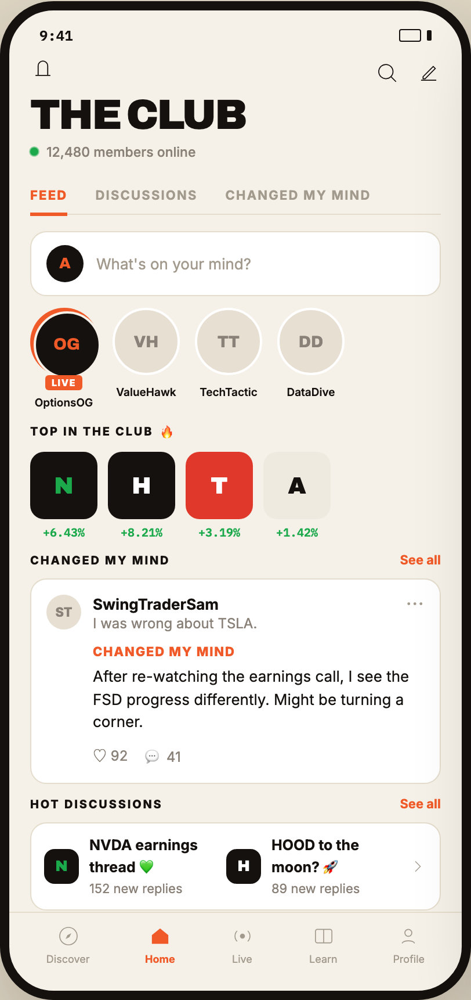

# 01 CLUB · FEED

Canvas: **CHEAT CODE CLUB — FTA-DASHBOARD** · board index 0 · slug `01-club-feed`
Frame: **406×860px** (design width 406px — port at 390px logical, scale ratios).

> Style values are EXACT computed values from the canvas. `T.*` = canvas token, resolved in
> the Tokens appendix at the bottom of this file. Text marked `(MOCK)` must not ship as drawn —
> see `../../DELTA.md` for its substitution rule.

## Tree

- **“9:41 THE CLUB 12,480 members online FEED…”** → `
`
  - box: 406x860 · display: flex · dir: column · width: 390px · height: 844px · bg: T.amber-50 · border: 8px solid T.orange-900 · radius: 46px (T.r17) · shadow: T.orange-900a20 0px 28px 66px 0px · overflow: hidden · type: color T.neutral-950 / Inter / 16px / w400 / lh normal
  - **“9:41…”** → `
`
    - box: 390x31 · display: flex · align: center · justify: space-between · pad: 14px 26px 2px 26px · type: color T.orange-900 / IBM Plex Mono / 12px / w600
    - **"9:41"** → ``
      - box: 28.8x15 · scale: T.ty42
      - text: "9:41"
    - **block[1]** → ``
      - box: 28x11 · display: flex · align: center · gap: 5px
      - **block[0]** → ``
        - box: 19x11 · width: 17px · height: 9px · border: 1px solid T.orange-900 · radius: 2px (T.r2)
      - **block[1]** → ``
        - box: 4x9 · width: 4px · height: 9px · bg: T.orange-900 · radius: 1px (T.r1)
  - **“THE CLUB 12,480 members online…”** → `
`
    - box: 390x98.4 · display: flex · align: flex-start · justify: space-between · pad: 8px 18px 0px 18px
    - **“THE CLUB 12,480 members online…”** → `
`
      - box: 185.7x90.4
      - **svg** → `<svg>`
        - box: 22x22 · display: inline · overflow: hidden
        - svg: `<svg data-dc-tpl="25" width="22" height="22" viewBox="0 0 24 24"><path data-dc-tpl="26" d="M5 18.5h14M7.5 18.5V9.5a4.5 4.5 0 0 1 9 0v9" fill="none" stroke="#14110F" strokewidth="2" strokelinecap="round"></path></svg>`
        - **block[0]** → `<path>`
          - box: 12.8x12.4 · display: inline
      - **"The Club"** → `<h2>`
        - box: 185.7x32.4 · margin: 9px 0px 0px 0px · type: color T.orange-900 / Archivo / 36px / w900 / ls -1.44px / lh 32.4px / uppercase · scale: T.ty1
        - text: "The Club"
      - **"12,480 members online"** **(MOCK)** → `
`
        - box: 185.7x14 · display: flex · align: center · gap: 7px · margin: 9px 0px 0px 0px · type: color T.neutral-400 / 11.5px / w500 · scale: T.ty52
        - text: "12,480 members online"
        - **block[0]** → ``
          - box: 7x7 · display: flex · width: 7px · height: 7px · position: relative [0px 0px 0px 0px]
          - **block[0]** → ``
            - box: 7.1x7.1 · bg: T.green-600 · radius: 50% (T.r18) · opacity: 0.591627 · transform: matrix(1.01954, 0, 0, 1.01954, 0, 0) · position: absolute [0px 0px 0px 0px]
          - **block[1]** → ``
            - box: 7x7 · width: 7px · height: 7px · bg: T.green-600 · radius: 50% (T.r18) · position: relative [0px 0px 0px 0px]
    - **block[1]** → `
`
      - box: 57x25 · display: flex · align: center · gap: 15px · pad: 4px 0px 0px 0px
      - **svg** → `<svg>`
        - box: 21x21 · overflow: hidden
        - svg: `<svg data-dc-tpl="33" width="21" height="21" viewBox="0 0 24 24"><circle data-dc-tpl="34" cx="11" cy="11" r="7" fill="none" stroke="#14110F" strokewidth="2"></circle><path data-dc-tpl="35" d="M16.2 16.2 21 21" stroke="#14110F" strokewidth="2" strokelinecap="round"></path></svg>`
        - **block[0]** → `<circle>`
          - box: 12.3x12.3 · display: inline
        - **block[1]** → `<path>`
          - box: 4.2x4.2 · display: inline
      - **svg** → `<svg>`
        - box: 21x21 · overflow: hidden
        - svg: `<svg data-dc-tpl="36" width="21" height="21" viewBox="0 0 24 24"><path data-dc-tpl="37" d="M4.5 19.5h15M6.5 16 16.5 6l2 2-10 10H6.5Z" fill="none" stroke="#14110F" strokewidth="2" strokelinejoin="round"></path></svg>`
        - **block[0]** → `<path>`
          - box: 13.1x11.8 · display: inline
  - **“FEED DISCUSSIONS CHANGED MY MIND…”** → `
`
    - box: 354x32.5 · display: flex · margin: 15px 18px 0px 18px · border: T:0px none T.neutral-950 R:0px none T.neutral-950 B:1px solid T.amber-100 L:0px none T.neutral-950
    - **"Feed"** → `
`
      - box: 32.2x33 · pad: 8px 0px 8px 0px · margin: 0px 24px -1.5px 0px · border: T:0px none T.orange-400 R:0px none T.orange-400 B:3px solid T.orange-400 L:0px none T.orange-400 · type: color T.orange-400 / 11px / w800 / ls 1.1px / uppercase · scale: T.ty57
      - text: "Feed"
    - **"Discussions"** → `
`
      - box: 88.1x31.5 · pad: 8px 0px 8px 0px · margin: 0px 24px 0px 0px · type: color T.orange-400-b / 11px / w700 / ls 1.1px / uppercase · scale: T.ty56
      - text: "Discussions"
    - **"Changed my mind"** → `
`
      - box: 125.5x31.5 · pad: 8px 0px 8px 0px · type: color T.orange-400-b / 11px / w700 / ls 1.1px / uppercase · scale: T.ty56
      - text: "Changed my mind"
  - **“A What's on your mind? OG LIVE OptionsOG…”** → `
`
    - box: 390x599.1 · display: flex · dir: column · gap: 10px · flex: 1 1 0% · flex-grow: 1 · flex-basis: 0% · pad: 14px 18px 0px 18px · overflow: hidden
    - **“A What's on your mind?…”** → `
`
      - box: 354x56 · display: flex · align: center · gap: 11px · flex-shrink: 0 · pad: 11px 13px 11px 13px · bg: T.neutral-0 · border: 1px solid T.amber-100 · radius: 14px (T.r14)
      - **"A"** → `
`
        - box: 32x32 · display: grid · align: center · justify-items: center · grid-cols: 32px · grid-rows: 32px · width: 32px · height: 32px · flex-shrink: 0 · bg: T.orange-900 · radius: 50% (T.r18) · type: color T.orange-400 / Archivo / 13px / w800 · scale: T.ty31
        - text: "A"
      - **"What's on your mind?"** → ``
        - box: 283x16 · flex: 1 1 0% · flex-grow: 1 · flex-basis: 0% · type: color T.orange-400-b / 13px · scale: T.ty30
        - text: "What's on your mind?"
    - **“OG LIVE OptionsOG VH ValueHawk TT TechTa…”** → `
`
      - box: 354x87 · display: flex · gap: 13px · flex-shrink: 0
      - **“OG LIVE OptionsOG…”** → `
`
        - box: 58x87 · width: 58px · flex-shrink: 0 · type: align-center
        - **“OG…”** → `
`
          - box: 59x59 · width: 54px · height: 54px · pad: 2.5px 2.5px 2.5px 2.5px · margin: 0px -1px 0px 0px · bg: T.orange-400 · radius: 50% (T.r18)
          - **"OG"** → `
`
            - box: 58x58 · display: grid · align: center · justify-items: center · grid-cols: 54px · grid-rows: 54px · width: 100% · height: 100% · bg: T.orange-900 · border: 2px solid T.amber-50 · radius: 50% (T.r18) · type: color T.orange-400 / Archivo / 14px / w800 · scale: T.ty23
            - text: "OG"
        - **“LIVE…”** → `
`
          - box: 58x20 · margin: -8px 0px 0px 0px · position: relative [0px 0px 0px 0px]
          - **"LIVE"** → ``
            - box: 31x13 · display: inline · pad: 1.5px 5px 1.5px 5px · bg: T.orange-400 · radius: 3px (T.r3) · type: color T.neutral-0 / 8px / w800 / ls 0.8px · scale: T.ty87
            - text: "LIVE"
        - **"OptionsOG"** → `
`
          - box: 58x11 · margin: 5px 0px 0px 0px · type: color T.orange-900 / 9.5px / w600 · scale: T.ty73
          - text: "OptionsOG"
      - **“VH ValueHawk…”** → `
`
        - box: 58x87 · width: 58px · flex-shrink: 0 · type: align-center
        - **"VH"** → `
`
          - box: 58x58 · display: grid · align: center · justify-items: center · grid-cols: 54px · grid-rows: 54px · width: 54px · height: 54px · bg: T.orange-100 · border: 2px solid T.neutral-0 · radius: 50% (T.r18) · type: color T.neutral-400 / Archivo / 14px / w800 · scale: T.ty23
          - text: "VH"
        - **"ValueHawk"** → `
`
          - box: 58x11 · margin: 9px 0px 0px 0px · type: color T.orange-900 / 9.5px / w600 · scale: T.ty73
          - text: "ValueHawk"
      - **“TT TechTactic…”** → `
`
        - box: 58x87 · width: 58px · flex-shrink: 0 · type: align-center
        - **"TT"** → `
`
          - box: 58x58 · display: grid · align: center · justify-items: center · grid-cols: 54px · grid-rows: 54px · width: 54px · height: 54px · bg: T.orange-100 · border: 2px solid T.neutral-0 · radius: 50% (T.r18) · type: color T.neutral-400 / Archivo / 14px / w800 · scale: T.ty23
          - text: "TT"
        - **"TechTactic"** → `
`
          - box: 58x11 · margin: 9px 0px 0px 0px · type: color T.orange-900 / 9.5px / w600 · scale: T.ty73
          - text: "TechTactic"
      - **“DD DataDive…”** → `
`
        - box: 58x87 · width: 58px · flex-shrink: 0 · type: align-center
        - **"DD"** → `
`
          - box: 58x58 · display: grid · align: center · justify-items: center · grid-cols: 54px · grid-rows: 54px · width: 54px · height: 54px · bg: T.orange-100 · border: 2px solid T.neutral-0 · radius: 50% (T.r18) · type: color T.neutral-400 / Archivo / 14px / w800 · scale: T.ty23
          - text: "DD"
        - **"DataDive"** → `
`
          - box: 58x11 · margin: 9px 0px 0px 0px · type: color T.orange-900 / 9.5px / w600 · scale: T.ty73
          - text: "DataDive"
    - **“TOP IN THE CLUB 🔥 N +6.43% H +8.21% T +…”** → `
`
      - box: 354x103 · flex-shrink: 0
      - **“TOP IN THE CLUB 🔥…”** → `
`
        - box: 354x18 · display: flex · align: center · gap: 6px · margin: 0px 0px 9px 0px
        - **"Top in the Club"** → ``
          - box: 106.1x12 · type: color T.orange-900 / 10px / w800 / ls 1.4px / uppercase · scale: T.ty68
          - text: "Top in the Club"
        - **"🔥"** → ``
          - box: 14x18 · type: 11px · scale: T.ty53
          - text: "🔥"
      - **“N +6.43% H +8.21% T +3.19% A +1.42%…”** → `
`
        - box: 354x76 · display: flex · gap: 9px
        - **“N +6.43%…”** → `
`
          - box: 58x76 · width: 58px · flex-shrink: 0
          - **"N"** → `
`
            - box: 58x58 · display: grid · align: center · justify-items: center · grid-cols: 58px · grid-rows: 58px · height: 58px · bg: T.orange-900 · radius: 12px (T.r12) · type: color T.green-600 / Archivo / 20px / w900 · scale: T.ty12
            - text: "N"
          - **"+6.43%"** **(MOCK)** → `
`
            - box: 58x13 · margin: 5px 0px 0px 0px · type: color T.green-600 / IBM Plex Mono / 10px / w600 / align-center · scale: T.ty70
            - text: "+6.43%"
        - **“H +8.21%…”** → `
`
          - box: 58x76 · width: 58px · flex-shrink: 0
          - **"H"** → `
`
            - box: 58x58 · display: grid · align: center · justify-items: center · grid-cols: 58px · grid-rows: 58px · height: 58px · bg: T.orange-900 · radius: 12px (T.r12) · type: color T.neutral-0 / Archivo / 20px / w900 · scale: T.ty12
            - text: "H"
          - **"+8.21%"** **(MOCK)** → `
`
            - box: 58x13 · margin: 5px 0px 0px 0px · type: color T.green-600 / IBM Plex Mono / 10px / w600 / align-center · scale: T.ty70
            - text: "+8.21%"
        - **“T +3.19%…”** → `
`
          - box: 58x76 · width: 58px · flex-shrink: 0
          - **"T"** → `
`
            - box: 58x58 · display: grid · align: center · justify-items: center · grid-cols: 58px · grid-rows: 58px · height: 58px · bg: T.red-400 · radius: 12px (T.r12) · type: color T.neutral-0 / Archivo / 20px / w900 · scale: T.ty12
            - text: "T"
          - **"+3.19%"** **(MOCK)** → `
`
            - box: 58x13 · margin: 5px 0px 0px 0px · type: color T.green-600 / IBM Plex Mono / 10px / w600 / align-center · scale: T.ty70
            - text: "+3.19%"
        - **“A +1.42%…”** → `
`
          - box: 58x76 · width: 58px · flex-shrink: 0
          - **"A"** → `
`
            - box: 58x58 · display: grid · align: center · justify-items: center · grid-cols: 58px · grid-rows: 58px · height: 58px · bg: T.orange-50-b · radius: 12px (T.r12) · type: color T.orange-900 / Archivo / 20px / w900 · scale: T.ty12
            - text: "A"
          - **"+1.42%"** **(MOCK)** → `
`
            - box: 58x13 · margin: 5px 0px 0px 0px · type: color T.green-600 / IBM Plex Mono / 10px / w600 / align-center · scale: T.ty70
            - text: "+1.42%"
    - **“CHANGED MY MIND See all ST SwingTraderSa…”** → `
`
      - box: 354x199.5 · flex-shrink: 0
      - **“CHANGED MY MIND See all…”** → `
`
        - box: 354x14 · display: flex · align: center · justify: space-between · margin: 0px 0px 9px 0px
        - **"Changed my mind"** → ``
          - box: 120.6x12 · type: color T.orange-900 / 10px / w800 / ls 1.4px / uppercase · scale: T.ty68
          - text: "Changed my mind"
        - **"See all"** → ``
          - box: 35.3x14 · type: color T.orange-400 / 11px / w700 · scale: T.ty55
          - text: "See all"
      - **“ST SwingTraderSam I was wrong about TSLA…”** → `
`
        - box: 354x176.5 · pad: 13px 13px 13px 13px · bg: T.neutral-0 · border: 1px solid T.amber-100 · radius: 14px (T.r14)
        - **“ST SwingTraderSam I was wrong about TSLA…”** → `
`
          - box: 326x32 · display: flex · align: flex-start · gap: 10px
          - **"ST"** → `
`
            - box: 30x30 · display: grid · align: center · justify-items: center · grid-cols: 30px · grid-rows: 30px · width: 30px · height: 30px · flex-shrink: 0 · bg: T.orange-100 · radius: 50% (T.r18) · type: color T.neutral-400 / 11px / w800 · scale: T.ty54
            - text: "ST"
          - **“SwingTraderSam I was wrong about TSLA.…”** → `
`
            - box: 260.3x32 · min-width: 0px · flex: 1 1 0% · flex-grow: 1 · flex-basis: 0%
            - **"SwingTraderSam"** → `
`
              - box: 260.3x16 · type: color T.orange-900 / 13px / w700 · scale: T.ty27
              - text: "SwingTraderSam"
            - **"I was wrong about TSLA."** → `
`
              - box: 260.3x15 · margin: 1px 0px 0px 0px · type: color T.neutral-400 / 12px · scale: T.ty43
              - text: "I was wrong about TSLA."
          - **"···"** → ``
            - box: 15.7x15 · type: color T.orange-400-b / 12px / w800 / ls 1px · scale: T.ty45
            - text: "···"
        - **“CHANGED MY MIND After re-watching the ea…”** → `
`
          - box: 326x106.5 · pad: 0px 0px 0px 40px · margin: 10px 0px 0px 0px
          - **"Changed my mind"** → `
`
            - box: 286x14 · type: color T.orange-400 / 11px / w800 / ls 0.88px / uppercase · scale: T.ty60
            - text: "Changed my mind"
          - **"After re-watching the earnings call, I see t"** → `
`
            - box: 286x58.5 · margin: 5px 0px 0px 0px · type: color T.orange-900 / 13px / lh 19.5px · scale: T.ty26
            - text: "After re-watching the earnings call, I see the FSD progress differently. Might be turning a corner."
          - **“♡ 92 💬 41…”** → `
`
            - box: 286x20 · display: flex · gap: 15px · margin: 9px 0px 0px 0px · type: color T.neutral-400 / 12px
            - **"♡ 92"** → ``
              - box: 30.1x20 · scale: T.ty43
              - text: "♡ 92"
            - **"💬 41"** → ``
              - box: 30.8x20 · scale: T.ty43
              - text: "💬 41"
    - **“HOT DISCUSSIONS See all N NVDA earnings …”** → `
`
      - box: 354x99 · flex-shrink: 0
      - **“HOT DISCUSSIONS See all…”** → `
`
        - box: 354x14 · display: flex · align: center · justify: space-between · margin: 0px 0px 9px 0px
        - **"Hot discussions"** → ``
          - box: 114.3x12 · type: color T.orange-900 / 10px / w800 / ls 1.4px / uppercase · scale: T.ty68
          - text: "Hot discussions"
        - **"See all"** → ``
          - box: 35.3x14 · type: color T.orange-400 / 11px / w700 · scale: T.ty55
          - text: "See all"
      - **“N NVDA earnings thread 💚 152 new replie…”** → `
`
        - box: 354x76 · display: flex · align: center · gap: 9px · pad: 11px 11px 11px 11px · bg: T.neutral-0 · border: 1px solid T.amber-100 · radius: 14px (T.r14)
        - **"N"** → ``
          - box: 30x30 · display: grid · align: center · justify-items: center · grid-cols: 30px · grid-rows: 30px · width: 30px · height: 30px · flex-shrink: 0 · bg: T.orange-900 · radius: 9px (T.r9) · type: color T.green-600 / Archivo / 13px / w900 · scale: T.ty28
          - text: "N"
        - **“NVDA earnings thread 💚 152 new replies…”** → `
`
          - box: 109x52 · min-width: 0px · flex: 1 1 0% · flex-grow: 1 · flex-basis: 0%
          - **"NVDA earnings thread 💚"** → `
`
            - box: 109x36 · type: color T.orange-900 / 12.5px / w700 · scale: T.ty37
            - text: "NVDA earnings thread 💚"
          - **"152 new replies"** → `
`
            - box: 109x14 · margin: 2px 0px 0px 0px · type: color T.neutral-400 / 11px · scale: T.ty53
            - text: "152 new replies"
        - **"H"** → ``
          - box: 30x30 · display: grid · align: center · justify-items: center · grid-cols: 30px · grid-rows: 30px · width: 30px · height: 30px · flex-shrink: 0 · bg: T.orange-900 · radius: 9px (T.r9) · type: color T.neutral-0 / Archivo / 13px / w900 · scale: T.ty28
          - text: "H"
        - **“HOOD to the moon? 🚀 89 new replies…”** → `
`
          - box: 109x52 · min-width: 0px · flex: 1 1 0% · flex-grow: 1 · flex-basis: 0%
          - **"HOOD to the moon? 🚀"** → `
`
            - box: 109x36 · type: color T.orange-900 / 12.5px / w700 · scale: T.ty37
            - text: "HOOD to the moon? 🚀"
          - **"89 new replies"** → `
`
            - box: 109x14 · margin: 2px 0px 0px 0px · type: color T.neutral-400 / 11px · scale: T.ty53
            - text: "89 new replies"
        - **svg** → `<svg>`
          - box: 16x16 · flex-shrink: 0 · overflow: hidden
          - svg: `<svg data-dc-tpl="109" width="16" height="16" viewBox="0 0 24 24" style="flex-shrink: 0;"><path data-dc-tpl="110" d="M9 5.5 15.5 12 9 18.5" fill="none" stroke="#A39A8E" strokewidth="2.2" strokelinecap="round" strokelinejoin="round"></path></svg>`
          - **block[0]** → `<path>`
            - box: 4.3x8.7 · display: inline
  - **“Discover Home Live Learn Profile…”** → `
`
    - box: 390x68 · display: flex · align: center · justify: space-around · pad: 10px 8px 22px 8px · border: T:1px solid T.amber-100 R:0px none T.neutral-950 B:0px none T.neutral-950 L:0px none T.neutral-950
    - **“Discover…”** → `
`
      - box: 37.3x35 · display: flex · dir: column · align: center · gap: 4px
      - **svg** → `<svg>`
        - box: 20x20 · overflow: hidden
        - svg: `<svg data-dc-tpl="113" width="20" height="20" viewBox="0 0 24 24"><circle data-dc-tpl="114" cx="12" cy="12" r="9" fill="none" stroke="#A39A8E" strokewidth="1.9"></circle><path data-dc-tpl="115" d="M15 9 13 13l-4 2 2-4Z" fill="#A39A8E"></path></svg>`
        - **block[0]** → `<circle>`
          - box: 15x15 · display: inline
        - **block[1]** → `<path>`
          - box: 5x5 · display: inline
      - **"Discover"** → ``
        - box: 37.3x11 · type: color T.orange-400-b / 9px · scale: T.ty79
        - text: "Discover"
    - **“Home…”** → `
`
      - box: 25.8x35 · display: flex · dir: column · align: center · gap: 4px
      - **svg** → `<svg>`
        - box: 20x20 · overflow: hidden
        - svg: `<svg data-dc-tpl="118" width="20" height="20" viewBox="0 0 24 24"><path data-dc-tpl="119" d="M3.5 11 12 4l8.5 7v9h-17Z" fill="#F05A28"></path></svg>`
        - **block[0]** → `<path>`
          - box: 14.2x13.3 · display: inline
      - **"Home"** → ``
        - box: 25.8x11 · type: color T.orange-400 / 9px / w700 · scale: T.ty80
        - text: "Home"
    - **“Live…”** → `
`
      - box: 20x35 · display: flex · dir: column · align: center · gap: 4px
      - **svg** → `<svg>`
        - box: 20x20 · overflow: hidden
        - svg: `<svg data-dc-tpl="122" width="20" height="20" viewBox="0 0 24 24"><circle data-dc-tpl="123" cx="12" cy="12" r="2.6" fill="#A39A8E"></circle><path data-dc-tpl="124" d="M6.5 6.6a7.6 7.6 0 0 0 0 10.8M17.5 6.6a7.6 7.6 0 0 1 0 10.8" fill="none" stroke="#A39A8E" strokewidth="1.9" strokelinecap="round"></p`
        - **block[0]** → `<circle>`
          - box: 4.3x4.3 · display: inline
        - **block[1]** → `<path>`
          - box: 12.9x9 · display: inline
      - **"Live"** → ``
        - box: 17.4x11 · type: color T.orange-400-b / 9px · scale: T.ty79
        - text: "Live"
    - **“Learn…”** → `
`
      - box: 24.3x35 · display: flex · dir: column · align: center · gap: 4px
      - **svg** → `<svg>`
        - box: 20x20 · overflow: hidden
        - svg: `<svg data-dc-tpl="127" width="20" height="20" viewBox="0 0 24 24"><rect data-dc-tpl="128" x="3.5" y="5" width="17" height="14" rx="2" fill="none" stroke="#A39A8E" strokewidth="1.9"></rect><path data-dc-tpl="129" d="M12 5v14" stroke="#A39A8E" strokewidth="1.9"></path></svg>`
        - **block[0]** → `<rect>`
          - box: 14.2x11.7 · display: inline
        - **block[1]** → `<path>`
          - box: 0x11.7 · display: inline
      - **"Learn"** → ``
        - box: 24.3x11 · type: color T.orange-400-b / 9px · scale: T.ty79
        - text: "Learn"
    - **“Profile…”** → `
`
      - box: 27.3x35 · display: flex · dir: column · align: center · gap: 4px
      - **svg** → `<svg>`
        - box: 20x20 · overflow: hidden
        - svg: `<svg data-dc-tpl="132" width="20" height="20" viewBox="0 0 24 24"><circle data-dc-tpl="133" cx="12" cy="8.6" r="3.6" fill="none" stroke="#A39A8E" strokewidth="1.9"></circle><path data-dc-tpl="134" d="M5.5 19.4c1.5-3.4 11.5-3.4 13 0" fill="none" stroke="#A39A8E" strokewidth="1.9" strokelinecap="round`
        - **block[0]** → `<circle>`
          - box: 6x6 · display: inline
        - **block[1]** → `<path>`
          - box: 10.8x2.1 · display: inline
      - **"Profile"** → ``
        - box: 27.3x11 · type: color T.orange-400-b / 9px · scale: T.ty79
        - text: "Profile"

## Tokens used in this board

| token | value | role |
| --- | --- | --- |
| T.orange-900 | `#14110F` | border, text, bg, gradient |
| T.neutral-0 | `#FFFFFF` | bg, text, border |
| T.orange-400 | `#F05A28` | border, text, bg, gradient |
| T.neutral-400 | `#8A8279` | text, border |
| T.amber-100 | `#E4DCCC` | border, bg |
| T.orange-400-b | `#A39A8E` | text, bg |
| T.neutral-950 | `#000000` | border, text |
| T.green-600 | `#1BA94C` | bg, text |
| T.orange-100 | `#E7DFD2` | bg |
| T.amber-50 | `#F5F1E8` | bg, border |
| T.orange-900a20 | `#14110F/0.2` | shadow |
| T.red-400 | `#E0392B` | bg, text |
| T.orange-50-b | `#EFEAE0` | bg |
| T.ty1 | Archivo 36px/32.4px w900 ls:-1.44px uppercase | type scale |
| T.ty12 | Archivo 20px/normal w900 ls:normal | type scale |
| T.ty23 | Archivo 14px/normal w800 ls:normal | type scale |
| T.ty26 | Inter 13px/19.5px w400 ls:normal | type scale |
| T.ty27 | Inter 13px/normal w700 ls:normal | type scale |
| T.ty28 | Archivo 13px/normal w900 ls:normal | type scale |
| T.ty30 | Inter 13px/normal w400 ls:normal | type scale |
| T.ty31 | Archivo 13px/normal w800 ls:normal | type scale |
| T.ty37 | Inter 12.5px/normal w700 ls:normal | type scale |
| T.ty42 | IBM Plex Mono 12px/normal w600 ls:normal | type scale |
| T.ty43 | Inter 12px/normal w400 ls:normal | type scale |
| T.ty45 | Inter 12px/normal w800 ls:1px | type scale |
| T.ty52 | Inter 11.5px/normal w500 ls:normal | type scale |
| T.ty53 | Inter 11px/normal w400 ls:normal | type scale |
| T.ty54 | Inter 11px/normal w800 ls:normal | type scale |
| T.ty55 | Inter 11px/normal w700 ls:normal | type scale |
| T.ty56 | Inter 11px/normal w700 ls:1.1px uppercase | type scale |
| T.ty57 | Inter 11px/normal w800 ls:1.1px uppercase | type scale |
| T.ty60 | Inter 11px/normal w800 ls:0.88px uppercase | type scale |
| T.ty68 | Inter 10px/normal w800 ls:1.4px uppercase | type scale |
| T.ty70 | IBM Plex Mono 10px/normal w600 ls:normal | type scale |
| T.ty73 | Inter 9.5px/normal w600 ls:normal | type scale |
| T.ty79 | Inter 9px/normal w400 ls:normal | type scale |
| T.ty80 | Inter 9px/normal w700 ls:normal | type scale |
| T.ty87 | Inter 8px/normal w800 ls:0.8px | type scale |
| T.r1 | `1px` | radius |
| T.r2 | `2px` | radius |
| T.r3 | `3px` | radius |
| T.r9 | `9px` | radius |
| T.r12 | `12px` | radius |
| T.r14 | `14px` | radius |
| T.r17 | `46px` | radius |
| T.r18 | `50%` | radius |
