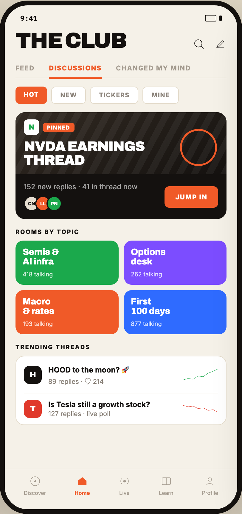

# 02 CLUB · DISCUSSIONS

Canvas: **CHEAT CODE CLUB — FTA-DASHBOARD** · board index 1 · slug `02-club-discussions`
Frame: **406×860px** (design width 406px — port at 390px logical, scale ratios).

> Style values are EXACT computed values from the canvas. `T.*` = canvas token, resolved in
> the Tokens appendix at the bottom of this file. Text marked `(MOCK)` must not ship as drawn —
> see `../../DELTA.md` for its substitution rule.

## Tree

- **“9:41 THE CLUB FEED DISCUSSIONS CHANGED M…”** → `
`
  - box: 406x860 · display: flex · dir: column · width: 390px · height: 844px · bg: T.amber-50 · border: 8px solid T.orange-900 · radius: 46px (T.r17) · shadow: T.orange-900a20 0px 28px 66px 0px · overflow: hidden · type: color T.neutral-950 / Inter / 16px / w400 / lh normal
  - **“9:41…”** → `
`
    - box: 390x31 · display: flex · align: center · justify: space-between · pad: 14px 26px 2px 26px · type: color T.orange-900 / IBM Plex Mono / 12px / w600
    - **"9:41"** → ``
      - box: 28.8x15 · scale: T.ty42
      - text: "9:41"
    - **block[1]** → ``
      - box: 28x11 · display: flex · align: center · gap: 5px
      - **block[0]** → ``
        - box: 19x11 · width: 17px · height: 9px · border: 1px solid T.orange-900 · radius: 2px (T.r2)
      - **block[1]** → ``
        - box: 4x9 · width: 4px · height: 9px · bg: T.orange-900 · radius: 1px (T.r1)
  - **“THE CLUB…”** → `
`
    - box: 390x44.4 · display: flex · align: flex-end · justify: space-between · pad: 12px 18px 0px 18px
    - **"The Club"** → `<h2>`
      - box: 185.7x32.4 · type: color T.orange-900 / Archivo / 36px / w900 / ls -1.44px / lh 32.4px / uppercase · scale: T.ty1
      - text: "The Club"
    - **block[1]** → `
`
      - box: 57x21 · display: flex · gap: 15px
      - **svg** → `<svg>`
        - box: 21x21 · overflow: hidden
        - svg: `<svg data-dc-tpl="149" width="21" height="21" viewBox="0 0 24 24"><circle data-dc-tpl="150" cx="11" cy="11" r="7" fill="none" stroke="#14110F" strokewidth="2"></circle><path data-dc-tpl="151" d="M16.2 16.2 21 21" stroke="#14110F" strokewidth="2" strokelinecap="round"></path></svg>`
        - **block[0]** → `<circle>`
          - box: 12.3x12.3 · display: inline
        - **block[1]** → `<path>`
          - box: 4.2x4.2 · display: inline
      - **svg** → `<svg>`
        - box: 21x21 · overflow: hidden
        - svg: `<svg data-dc-tpl="152" width="21" height="21" viewBox="0 0 24 24"><path data-dc-tpl="153" d="M4.5 19.5h15M6.5 16 16.5 6l2 2-10 10H6.5Z" fill="none" stroke="#14110F" strokewidth="2" strokelinejoin="round"></path></svg>`
        - **block[0]** → `<path>`
          - box: 13.1x11.8 · display: inline
  - **“FEED DISCUSSIONS CHANGED MY MIND…”** → `
`
    - box: 354x32.5 · display: flex · margin: 15px 18px 0px 18px · border: T:0px none T.neutral-950 R:0px none T.neutral-950 B:1px solid T.amber-100 L:0px none T.neutral-950
    - **"Feed"** → `
`
      - box: 32.2x31.5 · pad: 8px 0px 8px 0px · margin: 0px 24px 0px 0px · type: color T.orange-400-b / 11px / w700 / ls 1.1px / uppercase · scale: T.ty56
      - text: "Feed"
    - **"Discussions"** → `
`
      - box: 88.5x33 · pad: 8px 0px 8px 0px · margin: 0px 24px -1.5px 0px · border: T:0px none T.orange-400 R:0px none T.orange-400 B:3px solid T.orange-400 L:0px none T.orange-400 · type: color T.orange-400 / 11px / w800 / ls 1.1px / uppercase · scale: T.ty57
      - text: "Discussions"
    - **"Changed my mind"** → `
`
      - box: 125.5x31.5 · pad: 8px 0px 8px 0px · type: color T.orange-400-b / 11px / w700 / ls 1.1px / uppercase · scale: T.ty56
      - text: "Changed my mind"
  - **“HOT NEW TICKERS MINE…”** → `
`
    - box: 390x43 · display: flex · gap: 7px · pad: 14px 18px 0px 18px
    - **"Hot"** → ``
      - box: 53.3x29 · pad: 7px 14px 7px 14px · bg: T.orange-400 · radius: 7px (T.r7) · type: color T.neutral-0 / 10.5px / w800 / ls 0.84px / uppercase · scale: T.ty66
      - text: "Hot"
    - **"New"** → ``
      - box: 57.8x29 · pad: 7px 14px 7px 14px · bg: T.neutral-0 · border: 1px solid T.amber-100 · radius: 7px (T.r7) · type: color T.neutral-400 / 10.5px / w700 / ls 0.84px / uppercase · scale: T.ty65
      - text: "New"
    - **"Tickers"** → ``
      - box: 81.3x29 · pad: 7px 14px 7px 14px · bg: T.neutral-0 · border: 1px solid T.amber-100 · radius: 7px (T.r7) · type: color T.neutral-400 / 10.5px / w700 / ls 0.84px / uppercase · scale: T.ty65
      - text: "Tickers"
    - **"Mine"** → ``
      - box: 60.5x29 · pad: 7px 14px 7px 14px · bg: T.neutral-0 · border: 1px solid T.amber-100 · radius: 7px (T.r7) · type: color T.neutral-400 / 10.5px / w700 / ls 0.84px / uppercase · scale: T.ty65
      - text: "Mine"
  - **“N PINNED NVDA EARNINGS THREAD 152 new re…”** → `
`
    - box: 390x610.1 · display: flex · dir: column · gap: 15px · flex: 1 1 0% · flex-grow: 1 · flex-basis: 0% · pad: 14px 18px 0px 18px · overflow: hidden
    - **“N PINNED NVDA EARNINGS THREAD 152 new re…”** → `
`
      - box: 354x179 · flex-shrink: 0 · bg: T.orange-900 · radius: 16px (T.r16) · overflow: hidden · position: relative [0px 0px 0px 0px]
      - **“N PINNED NVDA EARNINGS THREAD…”** → `
`
        - box: 354x104 · height: 104px · bg-image: linear-gradient(150deg, T.orange-800, T.orange-900) · overflow: hidden · position: relative [0px 0px 0px 0px]
        - **block[0]** → `
`
          - box: 354x104 · bg-image: repeating-linear-gradient(118deg, T.neutral-0a05 0px, T.neutral-0a05 11px, T.neutral-950a00 11px, T.neutral-950a00 22px) · position: absolute [0px 0px 0px 0px]
        - **“N PINNED…”** → `
`
          - box: 84.5x26 · display: flex · align: center · gap: 6px · position: absolute [12px 255.453px 66px 14px]
          - **"N"** → ``
            - box: 26x26 · display: grid · align: center · justify-items: center · grid-cols: 26px · grid-rows: 26px · width: 26px · height: 26px · bg: T.neutral-0 · radius: 7px (T.r7) · type: color T.green-600 / Archivo / 12px / w900 · scale: T.ty46
            - text: "N"
          - **"PINNED"** → ``
            - box: 52.5x15 · pad: 2px 7px 2px 7px · bg: T.orange-400 · radius: 4px (T.r4) · type: color T.neutral-0 / 9px / w800 / ls 0.72px · scale: T.ty81
            - text: "PINNED"
        - **"NVDA earningsthread"** → `
`
          - box: 202.5x46 · position: absolute [46px 137.484px 12px 14px] · type: color T.neutral-0 / Archivo / 23px / w900 / ls -0.69px / lh 23px / uppercase · scale: T.ty7
          - text: "NVDA earningsthread"
          - **block[0]** → ` `
            - box: 0x25 · display: inline
        - **block[3]** → `
`
          - box: 75.2x75.2 · width: 56px · height: 56px · border: 3px solid T.orange-400 · radius: 50% (T.r18) · transform: matrix(0.970296, -0.241922, 0.241922, 0.970296, 0, 0) · position: absolute [28px 16px 14px 276px]
      - **“152 new replies · 41 in thread now CN LL…”** → `
`
        - box: 354x75 · display: flex · align: center · gap: 10px · pad: 13px 14px 13px 14px
        - **“152 new replies · 41 in thread now CN LL…”** → `
`
          - box: 226.3x49 · flex: 1 1 0% · flex-grow: 1 · flex-basis: 0%
          - **"152 new replies · 41 in thread now"** → `
`
            - box: 226.3x15 · type: color T.neutral-0a62 / 12px · scale: T.ty43
            - text: "152 new replies · 41 in thread now"
          - **“CN LL PN…”** → `
`
            - box: 226.3x26 · display: flex · margin: 8px 0px 0px 0px
            - **"CN"** → ``
              - box: 26x26 · display: grid · align: center · justify-items: center · grid-cols: 22px · grid-rows: 22px · width: 22px · height: 22px · bg: T.orange-100 · border: 2px solid T.orange-900 · radius: 50% (T.r18) · type: color T.orange-900 / 8px / w800 · scale: T.ty85
              - text: "CN"
            - **"LL"** → ``
              - box: 26x26 · display: grid · align: center · justify-items: center · grid-cols: 22px · grid-rows: 22px · width: 22px · height: 22px · margin: 0px 0px 0px -7px · bg: T.orange-400 · border: 2px solid T.orange-900 · radius: 50% (T.r18) · type: color T.neutral-0 / 8px / w800 · scale: T.ty85
              - text: "LL"
            - **"PN"** → ``
              - box: 26x26 · display: grid · align: center · justify-items: center · grid-cols: 22px · grid-rows: 22px · width: 22px · height: 22px · margin: 0px 0px 0px -7px · bg: T.green-600 · border: 2px solid T.orange-900 · radius: 50% (T.r18) · type: color T.neutral-0 / 8px / w800 · scale: T.ty85
              - text: "PN"
        - **"Jump in"** → ``
          - box: 89.7x36 · pad: 11px 18px 11px 18px · bg: T.orange-400 · radius: 8px (T.r8) · type: color T.neutral-0 / 11px / w800 / ls 1.1px / uppercase · scale: T.ty57
          - text: "Jump in"
    - **“ROOMS BY TOPIC Semis & AI infra 418 talk…”** → `
`
      - box: 354x178 · flex-shrink: 0
      - **"Rooms by topic"** → `
`
        - box: 354x12 · margin: 0px 0px 9px 0px · type: color T.orange-900 / 10px / w800 / ls 1.4px / uppercase · scale: T.ty68
        - text: "Rooms by topic"
      - **“Semis & AI infra 418 talking Options des…”** → `
`
        - box: 354x157 · display: grid · grid-cols: 172.5px 172.5px · grid-rows: 74px 74px · gap: 9px
        - **“Semis & AI infra 418 talking…”** → `
`
          - box: 172.5x74 · display: flex · dir: column · justify: space-between · height: 74px · pad: 12px 12px 12px 12px · bg: T.green-600 · radius: 13px (T.r13) · type: color T.neutral-0
          - **"Semis &AI infra"** → `
`
            - box: 148.5x31.5 · type: Archivo / 15px / w800 / ls -0.15px / lh 15.75px · scale: T.ty19
            - text: "Semis &AI infra"
            - **block[0]** → ` `
              - box: 0x16 · display: inline
          - **"418 talking"** → `
`
            - box: 148.5x12 · opacity: 0.82 · type: 10px · scale: T.ty71
            - text: "418 talking"
        - **“Options desk 262 talking…”** → `
`
          - box: 172.5x74 · display: flex · dir: column · justify: space-between · height: 74px · pad: 12px 12px 12px 12px · bg: T.indigo-300 · radius: 13px (T.r13) · type: color T.neutral-0
          - **"Optionsdesk"** → `
`
            - box: 148.5x31.5 · type: Archivo / 15px / w800 / ls -0.15px / lh 15.75px · scale: T.ty19
            - text: "Optionsdesk"
            - **block[0]** → ` `
              - box: 0x16 · display: inline
          - **"262 talking"** → `
`
            - box: 148.5x12 · opacity: 0.82 · type: 10px · scale: T.ty71
            - text: "262 talking"
        - **“Macro & rates 193 talking…”** → `
`
          - box: 172.5x74 · display: flex · dir: column · justify: space-between · height: 74px · pad: 12px 12px 12px 12px · bg: T.orange-400 · radius: 13px (T.r13) · type: color T.neutral-0
          - **"Macro& rates"** → `
`
            - box: 148.5x31.5 · type: Archivo / 15px / w800 / ls -0.15px / lh 15.75px · scale: T.ty19
            - text: "Macro& rates"
            - **block[0]** → ` `
              - box: 0x16 · display: inline
          - **"193 talking"** → `
`
            - box: 148.5x12 · opacity: 0.82 · type: 10px · scale: T.ty71
            - text: "193 talking"
        - **“First 100 days 877 talking…”** → `
`
          - box: 172.5x74 · display: flex · dir: column · justify: space-between · height: 74px · pad: 12px 12px 12px 12px · bg: T.blue-400 · radius: 13px (T.r13) · type: color T.neutral-0
          - **"First100 days"** → `
`
            - box: 148.5x31.5 · type: Archivo / 15px / w800 / ls -0.15px / lh 15.75px · scale: T.ty19
            - text: "First100 days"
            - **block[0]** → ` `
              - box: 0x16 · display: inline
          - **"877 talking"** → `
`
            - box: 148.5x12 · opacity: 0.82 · type: 10px · scale: T.ty71
            - text: "877 talking"
    - **“TRENDING THREADS H HOOD to the moon? 🚀 …”** → `
`
      - box: 354x137 · flex-shrink: 0
      - **"Trending threads"** → `
`
        - box: 354x12 · margin: 0px 0px 9px 0px · type: color T.orange-900 / 10px / w800 / ls 1.4px / uppercase · scale: T.ty68
        - text: "Trending threads"
      - **“H HOOD to the moon? 🚀 89 replies · ♡ 21…”** → `
`
        - box: 354x116 · pad: 0px 13px 0px 13px · bg: T.neutral-0 · border: 1px solid T.amber-100 · radius: 14px (T.r14)
        - **“H HOOD to the moon? 🚀 89 replies · ♡ 21…”** → `
`
          - box: 326x62 · display: flex · align: center · gap: 11px · pad: 11px 0px 11px 0px · border: T:0px none T.neutral-950 R:0px none T.neutral-950 B:1px solid T.orange-50 L:0px none T.neutral-950
          - **"H"** → ``
            - box: 30x30 · display: grid · align: center · justify-items: center · grid-cols: 30px · grid-rows: 30px · width: 30px · height: 30px · bg: T.orange-900 · radius: 9px (T.r9) · type: color T.neutral-0 / Archivo / 13px / w900 · scale: T.ty28
            - text: "H"
          - **“HOOD to the moon? 🚀 89 replies · ♡ 214…”** → `
`
            - box: 214x39 · min-width: 0px · flex: 1 1 0% · flex-grow: 1 · flex-basis: 0%
            - **"HOOD to the moon? 🚀"** → `
`
              - box: 214x21 · type: color T.orange-900 / 12.5px / w700 · scale: T.ty37
              - text: "HOOD to the moon? 🚀"
            - **"89 replies · ♡ 214"** **(MOCK)** → `
`
              - box: 214x17 · margin: 1px 0px 0px 0px · type: color T.neutral-400 / 11px · scale: T.ty53
              - text: "89 replies · ♡ 214"
          - **svg** → `<svg>`
            - box: 60x24 · overflow: hidden
            - svg: `<svg data-dc-tpl="208" width="60" height="24" viewBox="0 0 100 40"><polyline data-dc-tpl="209" points="2,34 16,30 30,32 44,23 58,25 72,15 86,10 98,4" fill="none" stroke="#1BA94C" strokewidth="3.2" strokelinecap="round" strokelinejoin="round"></polyline></svg>`
            - **block[0]** → `<polyline>`
              - box: 57.6x18 · display: inline
        - **“T Is Tesla still a growth stock? 127 rep…”** → `
`
          - box: 326x52 · display: flex · align: center · gap: 11px · pad: 11px 0px 11px 0px
          - **"T"** → ``
            - box: 30x30 · display: grid · align: center · justify-items: center · grid-cols: 30px · grid-rows: 30px · width: 30px · height: 30px · bg: T.red-400 · radius: 9px (T.r9) · type: color T.neutral-0 / Archivo / 13px / w900 · scale: T.ty28
            - text: "T"
          - **“Is Tesla still a growth stock? 127 repli…”** → `
`
            - box: 214x30 · min-width: 0px · flex: 1 1 0% · flex-grow: 1 · flex-basis: 0%
            - **"Is Tesla still a growth stock?"** → `
`
              - box: 214x15 · type: color T.orange-900 / 12.5px / w700 · scale: T.ty37
              - text: "Is Tesla still a growth stock?"
            - **"127 replies · live poll"** **(MOCK)** → `
`
              - box: 214x14 · margin: 1px 0px 0px 0px · type: color T.neutral-400 / 11px · scale: T.ty53
              - text: "127 replies · live poll"
          - **svg** → `<svg>`
            - box: 60x24 · overflow: hidden
            - svg: `<svg data-dc-tpl="215" width="60" height="24" viewBox="0 0 100 40"><polyline data-dc-tpl="216" points="2,10 16,14 30,12 44,19 58,17 72,24 86,22 98,29" fill="none" stroke="#E0392B" strokewidth="3.2" strokelinecap="round" strokelinejoin="round"></polyline></svg>`
            - **block[0]** → `<polyline>`
              - box: 57.6x11.4 · display: inline
  - **“Discover Home Live Learn Profile…”** → `
`
    - box: 390x68 · display: flex · align: center · justify: space-around · pad: 10px 8px 22px 8px · border: T:1px solid T.amber-100 R:0px none T.neutral-950 B:0px none T.neutral-950 L:0px none T.neutral-950
    - **“Discover…”** → `
`
      - box: 37.3x35 · display: flex · dir: column · align: center · gap: 4px
      - **svg** → `<svg>`
        - box: 20x20 · overflow: hidden
        - svg: `<svg data-dc-tpl="219" width="20" height="20" viewBox="0 0 24 24"><circle data-dc-tpl="220" cx="12" cy="12" r="9" fill="none" stroke="#A39A8E" strokewidth="1.9"></circle><path data-dc-tpl="221" d="M15 9 13 13l-4 2 2-4Z" fill="#A39A8E"></path></svg>`
        - **block[0]** → `<circle>`
          - box: 15x15 · display: inline
        - **block[1]** → `<path>`
          - box: 5x5 · display: inline
      - **"Discover"** → ``
        - box: 37.3x11 · type: color T.orange-400-b / 9px · scale: T.ty79
        - text: "Discover"
    - **“Home…”** → `
`
      - box: 25.8x35 · display: flex · dir: column · align: center · gap: 4px
      - **svg** → `<svg>`
        - box: 20x20 · overflow: hidden
        - svg: `<svg data-dc-tpl="224" width="20" height="20" viewBox="0 0 24 24"><path data-dc-tpl="225" d="M3.5 11 12 4l8.5 7v9h-17Z" fill="#F05A28"></path></svg>`
        - **block[0]** → `<path>`
          - box: 14.2x13.3 · display: inline
      - **"Home"** → ``
        - box: 25.8x11 · type: color T.orange-400 / 9px / w700 · scale: T.ty80
        - text: "Home"
    - **“Live…”** → `
`
      - box: 20x35 · display: flex · dir: column · align: center · gap: 4px
      - **svg** → `<svg>`
        - box: 20x20 · overflow: hidden
        - svg: `<svg data-dc-tpl="228" width="20" height="20" viewBox="0 0 24 24"><circle data-dc-tpl="229" cx="12" cy="12" r="2.6" fill="#A39A8E"></circle><path data-dc-tpl="230" d="M6.5 6.6a7.6 7.6 0 0 0 0 10.8M17.5 6.6a7.6 7.6 0 0 1 0 10.8" fill="none" stroke="#A39A8E" strokewidth="1.9" strokelinecap="round"></p`
        - **block[0]** → `<circle>`
          - box: 4.3x4.3 · display: inline
        - **block[1]** → `<path>`
          - box: 12.9x9 · display: inline
      - **"Live"** → ``
        - box: 17.4x11 · type: color T.orange-400-b / 9px · scale: T.ty79
        - text: "Live"
    - **“Learn…”** → `
`
      - box: 24.3x35 · display: flex · dir: column · align: center · gap: 4px
      - **svg** → `<svg>`
        - box: 20x20 · overflow: hidden
        - svg: `<svg data-dc-tpl="233" width="20" height="20" viewBox="0 0 24 24"><rect data-dc-tpl="234" x="3.5" y="5" width="17" height="14" rx="2" fill="none" stroke="#A39A8E" strokewidth="1.9"></rect><path data-dc-tpl="235" d="M12 5v14" stroke="#A39A8E" strokewidth="1.9"></path></svg>`
        - **block[0]** → `<rect>`
          - box: 14.2x11.7 · display: inline
        - **block[1]** → `<path>`
          - box: 0x11.7 · display: inline
      - **"Learn"** → ``
        - box: 24.3x11 · type: color T.orange-400-b / 9px · scale: T.ty79
        - text: "Learn"
    - **“Profile…”** → `
`
      - box: 27.3x35 · display: flex · dir: column · align: center · gap: 4px
      - **svg** → `<svg>`
        - box: 20x20 · overflow: hidden
        - svg: `<svg data-dc-tpl="238" width="20" height="20" viewBox="0 0 24 24"><circle data-dc-tpl="239" cx="12" cy="8.6" r="3.6" fill="none" stroke="#A39A8E" strokewidth="1.9"></circle><path data-dc-tpl="240" d="M5.5 19.4c1.5-3.4 11.5-3.4 13 0" fill="none" stroke="#A39A8E" strokewidth="1.9" strokelinecap="round`
        - **block[0]** → `<circle>`
          - box: 6x6 · display: inline
        - **block[1]** → `<path>`
          - box: 10.8x2.1 · display: inline
      - **"Profile"** → ``
        - box: 27.3x11 · type: color T.orange-400-b / 9px · scale: T.ty79
        - text: "Profile"

## Tokens used in this board

| token | value | role |
| --- | --- | --- |
| T.orange-900 | `#14110F` | border, text, bg, gradient |
| T.neutral-0 | `#FFFFFF` | bg, text, border |
| T.orange-400 | `#F05A28` | border, text, bg, gradient |
| T.neutral-400 | `#8A8279` | text, border |
| T.amber-100 | `#E4DCCC` | border, bg |
| T.orange-400-b | `#A39A8E` | text, bg |
| T.neutral-950 | `#000000` | border, text |
| T.green-600 | `#1BA94C` | bg, text |
| T.orange-100 | `#E7DFD2` | bg |
| T.amber-50 | `#F5F1E8` | bg, border |
| T.orange-900a20 | `#14110F/0.2` | shadow |
| T.red-400 | `#E0392B` | bg, text |
| T.neutral-950a00 | `#000000/0` | gradient |
| T.orange-50 | `#F0EBE1` | border |
| T.neutral-0a05 | `#FFFFFF/0.05` | gradient |
| T.neutral-0a62 | `#FFFFFF/0.62` | text |
| T.blue-400 | `#2F6BFF` | bg |
| T.orange-800 | `#332B23` | gradient |
| T.indigo-300 | `#7C4DFF` | bg |
| T.ty1 | Archivo 36px/32.4px w900 ls:-1.44px uppercase | type scale |
| T.ty7 | Archivo 23px/23px w900 ls:-0.69px uppercase | type scale |
| T.ty19 | Archivo 15px/15.75px w800 ls:-0.15px | type scale |
| T.ty28 | Archivo 13px/normal w900 ls:normal | type scale |
| T.ty37 | Inter 12.5px/normal w700 ls:normal | type scale |
| T.ty42 | IBM Plex Mono 12px/normal w600 ls:normal | type scale |
| T.ty43 | Inter 12px/normal w400 ls:normal | type scale |
| T.ty46 | Archivo 12px/normal w900 ls:normal | type scale |
| T.ty53 | Inter 11px/normal w400 ls:normal | type scale |
| T.ty56 | Inter 11px/normal w700 ls:1.1px uppercase | type scale |
| T.ty57 | Inter 11px/normal w800 ls:1.1px uppercase | type scale |
| T.ty65 | Inter 10.5px/normal w700 ls:0.84px uppercase | type scale |
| T.ty66 | Inter 10.5px/normal w800 ls:0.84px uppercase | type scale |
| T.ty68 | Inter 10px/normal w800 ls:1.4px uppercase | type scale |
| T.ty71 | Inter 10px/normal w400 ls:normal | type scale |
| T.ty79 | Inter 9px/normal w400 ls:normal | type scale |
| T.ty80 | Inter 9px/normal w700 ls:normal | type scale |
| T.ty81 | Inter 9px/normal w800 ls:0.72px | type scale |
| T.ty85 | Inter 8px/normal w800 ls:normal | type scale |
| T.r1 | `1px` | radius |
| T.r2 | `2px` | radius |
| T.r4 | `4px` | radius |
| T.r7 | `7px` | radius |
| T.r8 | `8px` | radius |
| T.r9 | `9px` | radius |
| T.r13 | `13px` | radius |
| T.r14 | `14px` | radius |
| T.r16 | `16px` | radius |
| T.r17 | `46px` | radius |
| T.r18 | `50%` | radius |
