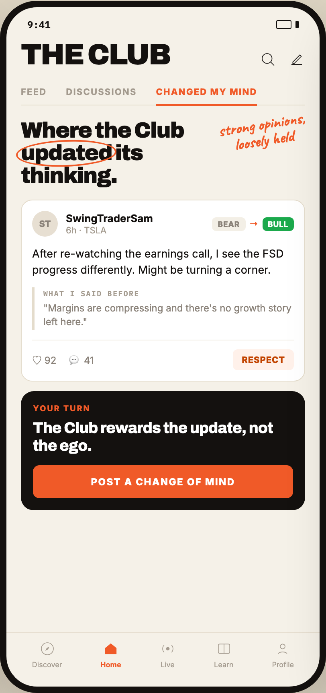

# 03 CLUB · CHANGED MY MIND

Canvas: **CHEAT CODE CLUB — FTA-DASHBOARD** · board index 2 · slug `03-club-changed-my-mind`
Frame: **406×860px** (design width 406px — port at 390px logical, scale ratios).

> Style values are EXACT computed values from the canvas. `T.*` = canvas token, resolved in
> the Tokens appendix at the bottom of this file. Text marked `(MOCK)` must not ship as drawn —
> see `../../DELTA.md` for its substitution rule.

## Tree

- **“9:41 THE CLUB FEED DISCUSSIONS CHANGED M…”** → `
`
  - box: 406x860 · display: flex · dir: column · width: 390px · height: 844px · bg: T.amber-50 · border: 8px solid T.orange-900 · radius: 46px (T.r17) · shadow: T.orange-900a20 0px 28px 66px 0px · overflow: hidden · type: color T.neutral-950 / Inter / 16px / w400 / lh normal
  - **“9:41…”** → `
`
    - box: 390x31 · display: flex · align: center · justify: space-between · pad: 14px 26px 2px 26px · type: color T.orange-900 / IBM Plex Mono / 12px / w600
    - **"9:41"** → ``
      - box: 28.8x15 · scale: T.ty42
      - text: "9:41"
    - **block[1]** → ``
      - box: 28x11 · display: flex · align: center · gap: 5px
      - **block[0]** → ``
        - box: 19x11 · width: 17px · height: 9px · border: 1px solid T.orange-900 · radius: 2px (T.r2)
      - **block[1]** → ``
        - box: 4x9 · width: 4px · height: 9px · bg: T.orange-900 · radius: 1px (T.r1)
  - **“THE CLUB…”** → `
`
    - box: 390x44.4 · display: flex · align: flex-end · justify: space-between · pad: 12px 18px 0px 18px
    - **"The Club"** → `<h2>`
      - box: 185.7x32.4 · type: color T.orange-900 / Archivo / 36px / w900 / ls -1.44px / lh 32.4px / uppercase · scale: T.ty1
      - text: "The Club"
    - **block[1]** → `
`
      - box: 57x21 · display: flex · gap: 15px
      - **svg** → `<svg>`
        - box: 21x21 · overflow: hidden
        - svg: `<svg data-dc-tpl="255" width="21" height="21" viewBox="0 0 24 24"><circle data-dc-tpl="256" cx="11" cy="11" r="7" fill="none" stroke="#14110F" strokewidth="2"></circle><path data-dc-tpl="257" d="M16.2 16.2 21 21" stroke="#14110F" strokewidth="2" strokelinecap="round"></path></svg>`
        - **block[0]** → `<circle>`
          - box: 12.3x12.3 · display: inline
        - **block[1]** → `<path>`
          - box: 4.2x4.2 · display: inline
      - **svg** → `<svg>`
        - box: 21x21 · overflow: hidden
        - svg: `<svg data-dc-tpl="258" width="21" height="21" viewBox="0 0 24 24"><path data-dc-tpl="259" d="M4.5 19.5h15M6.5 16 16.5 6l2 2-10 10H6.5Z" fill="none" stroke="#14110F" strokewidth="2" strokelinejoin="round"></path></svg>`
        - **block[0]** → `<path>`
          - box: 13.1x11.8 · display: inline
  - **“FEED DISCUSSIONS CHANGED MY MIND…”** → `
`
    - box: 354x32.5 · display: flex · margin: 15px 18px 0px 18px · border: T:0px none T.neutral-950 R:0px none T.neutral-950 B:1px solid T.amber-100 L:0px none T.neutral-950
    - **"Feed"** → `
`
      - box: 32.2x31.5 · pad: 8px 0px 8px 0px · margin: 0px 24px 0px 0px · type: color T.orange-400-b / 11px / w700 / ls 1.1px / uppercase · scale: T.ty56
      - text: "Feed"
    - **"Discussions"** → `
`
      - box: 88.1x31.5 · pad: 8px 0px 8px 0px · margin: 0px 24px 0px 0px · type: color T.orange-400-b / 11px / w700 / ls 1.1px / uppercase · scale: T.ty56
      - text: "Discussions"
    - **"Changed my mind"** → `
`
      - box: 126.1x33 · pad: 8px 0px 8px 0px · margin: 0px 0px -1.5px 0px · border: T:0px none T.orange-400 R:0px none T.orange-400 B:3px solid T.orange-400 L:0px none T.orange-400 · type: color T.orange-400 / 11px / w800 / ls 1.1px / uppercase · scale: T.ty57
      - text: "Changed my mind"
  - **“Where the Club updated its thinking. str…”** → `
`
    - box: 390x100.6 · pad: 18px 18px 0px 18px · position: relative [0px 0px 0px 0px]
    - **"Where the Club its thinking."** → `<h3>`
      - box: 250x82.6 · max-width: 250px · type: color T.orange-900 / Archivo / 27px / w900 / ls -0.945px / lh 27.54px · scale: T.ty5
      - text: "Where the Club its thinking."
      - **"updated"** → ``
        - box: 113.4x27.5 · display: inline-block · position: relative [0px 0px 0px 0px] · scale: T.ty5
        - text: "updated"
        - **block[0]** → ``
          - box: 126.5x36.9 · border: 2px solid T.orange-400 · radius: 50% (T.r18) · transform: matrix(0.999391, -0.0348995, 0.0348995, 0.999391, 0, 0) · position: absolute [-3px -6px -2px -6px]
    - **"strong opinions,loosely held"** → `
`
      - box: 113.5x56.5 · transform: matrix(0.987688, -0.156434, 0.156434, 0.987688, 0, 0) · position: absolute [14px 16px 46.5938px 265.438px] · type: color T.orange-400 / Caveat / 20px / w700 / lh 20px / align-center · scale: T.ty13
      - text: "strong opinions,loosely held"
      - **block[0]** → ` `
        - box: 3.9x24.7 · display: inline
  - **“ST SwingTraderSam 6h · TSLA BEAR → BULL …”** → `
`
    - box: 390x552.5 · display: flex · dir: column · gap: 12px · flex: 1 1 0% · flex-grow: 1 · flex-basis: 0% · pad: 16px 18px 0px 18px · overflow: hidden
    - **“ST SwingTraderSam 6h · TSLA BEAR → BULL …”** → `
`
      - box: 354x226.3 · flex-shrink: 0 · pad: 13px 13px 13px 13px · bg: T.neutral-0 · border: 1px solid T.amber-100 · radius: 14px (T.r14)
      - **“ST SwingTraderSam 6h · TSLA BEAR → BULL…”** → `
`
        - box: 326x32 · display: flex · align: center · gap: 10px
        - **"ST"** → `
`
          - box: 32x32 · display: grid · align: center · justify-items: center · grid-cols: 32px · grid-rows: 32px · width: 32px · height: 32px · flex-shrink: 0 · bg: T.orange-100 · radius: 50% (T.r18) · type: color T.neutral-400 / 11px / w800 · scale: T.ty54
          - text: "ST"
        - **“SwingTraderSam 6h · TSLA…”** → `
`
          - box: 172.3x30 · min-width: 0px · flex: 1 1 0% · flex-grow: 1 · flex-basis: 0%
          - **"SwingTraderSam"** → `
`
            - box: 172.3x16 · type: color T.orange-900 / 13px / w700 · scale: T.ty27
            - text: "SwingTraderSam"
          - **"6h · TSLA"** → `
`
            - box: 172.3x14 · type: color T.orange-400-b / 11px · scale: T.ty53
            - text: "6h · TSLA"
        - **“BEAR → BULL…”** → `
`
          - box: 101.7x17 · display: flex · align: center · gap: 5px · flex-shrink: 0
          - **"BEAR"** → ``
            - box: 41.2x17 · pad: 3px 7px 3px 7px · bg: T.amber-50-b · radius: 5px (T.r5) · type: color T.neutral-400 / 9.5px / w800 / ls 0.38px · scale: T.ty76
            - text: "BEAR"
          - **"→"** → ``
            - box: 11x14 · type: color T.orange-400 / 11px / w800 · scale: T.ty54
            - text: "→"
          - **"BULL"** → ``
            - box: 39.5x17 · pad: 3px 7px 3px 7px · bg: T.green-600 · radius: 5px (T.r5) · type: color T.neutral-0 / 9.5px / w800 / ls 0.38px · scale: T.ty76
            - text: "BULL"
      - **"After re-watching the earnings call, I see t"** → `
`
        - box: 326x40.5 · margin: 11px 0px 0px 0px · type: color T.orange-900 / 13.5px / lh 20.25px · scale: T.ty25
        - text: "After re-watching the earnings call, I see the FSD progress differently. Might be turning a corner."
      - **“WHAT I SAID BEFORE "Margins are compress…”** → `
`
        - box: 326x53.8 · pad: 2px 0px 2px 11px · margin: 11px 0px 0px 0px · border: T:0px none T.neutral-950 R:0px none T.neutral-950 B:0px none T.neutral-950 L:3px solid T.amber-100
        - **"WHAT I SAID BEFORE"** → `
`
          - box: 312x11 · type: color T.orange-400-b / IBM Plex Mono / 9px / w600 / ls 1.26px · scale: T.ty83
          - text: "WHAT I SAID BEFORE"
        - **"\"Margins are compressing and there's no grow"** → `
`
          - box: 312x34.8 · margin: 4px 0px 0px 0px · type: color T.neutral-400 / 12px / lh 17.4px · scale: T.ty47
          - text: "\"Margins are compressing and there's no growth story left here.\""
      - **“♡ 92 💬 41 RESPECT…”** → `
`
        - box: 326x38 · display: flex · align: center · gap: 16px · pad: 11px 0px 0px 0px · margin: 12px 0px 0px 0px · border: T:1px solid T.orange-50 R:0px none T.neutral-400 B:0px none T.neutral-400 L:0px none T.neutral-400 · type: color T.neutral-400 / 12px
        - **"♡ 92"** → ``
          - box: 30.1x18 · scale: T.ty43
          - text: "♡ 92"
        - **"💬 41"** → ``
          - box: 30.8x20 · scale: T.ty43
          - text: "💬 41"
        - **"RESPECT"** → ``
          - box: 75.8x26 · pad: 6px 11px 6px 11px · margin: 0px 0px 0px 157.234px · bg: T.orange-50-c · radius: 6px (T.r6) · type: color T.orange-600 / 11px / w800 / ls 0.44px · scale: T.ty58
          - text: "RESPECT"
    - **“YOUR TURN The Club rewards the update, n…”** → `
`
      - box: 354x147.7 · flex-shrink: 0 · pad: 15px 15px 15px 15px · bg: T.orange-900 · radius: 16px (T.r16) · type: color T.neutral-0
      - **"Your turn"** → `
`
        - box: 324x12 · type: color T.orange-400 / 10px / w800 / ls 1.4px / uppercase · scale: T.ty68
        - text: "Your turn"
      - **"The Club rewards the update, not the ego."** → `
`
        - box: 324x43.7 · margin: 8px 0px 0px 0px · type: Archivo / 19px / w800 / ls -0.38px / lh 21.85px · scale: T.ty14
        - text: "The Club rewards the update, not the ego."
      - **"Post a change of mind"** → `
`
        - box: 324x41 · pad: 13px 13px 13px 13px · margin: 13px 0px 0px 0px · bg: T.orange-400 · radius: 8px (T.r8) · type: 12px / w800 / ls 1.2px / uppercase / align-center · scale: T.ty48
        - text: "Post a change of mind"
  - **“Discover Home Live Learn Profile…”** → `
`
    - box: 390x68 · display: flex · align: center · justify: space-around · pad: 10px 8px 22px 8px · border: T:1px solid T.amber-100 R:0px none T.neutral-950 B:0px none T.neutral-950 L:0px none T.neutral-950
    - **“Discover…”** → `
`
      - box: 37.3x35 · display: flex · dir: column · align: center · gap: 4px
      - **svg** → `<svg>`
        - box: 20x20 · overflow: hidden
        - svg: `<svg data-dc-tpl="295" width="20" height="20" viewBox="0 0 24 24"><circle data-dc-tpl="296" cx="12" cy="12" r="9" fill="none" stroke="#A39A8E" strokewidth="1.9"></circle><path data-dc-tpl="297" d="M15 9 13 13l-4 2 2-4Z" fill="#A39A8E"></path></svg>`
        - **block[0]** → `<circle>`
          - box: 15x15 · display: inline
        - **block[1]** → `<path>`
          - box: 5x5 · display: inline
      - **"Discover"** → ``
        - box: 37.3x11 · type: color T.orange-400-b / 9px · scale: T.ty79
        - text: "Discover"
    - **“Home…”** → `
`
      - box: 25.8x35 · display: flex · dir: column · align: center · gap: 4px
      - **svg** → `<svg>`
        - box: 20x20 · overflow: hidden
        - svg: `<svg data-dc-tpl="300" width="20" height="20" viewBox="0 0 24 24"><path data-dc-tpl="301" d="M3.5 11 12 4l8.5 7v9h-17Z" fill="#F05A28"></path></svg>`
        - **block[0]** → `<path>`
          - box: 14.2x13.3 · display: inline
      - **"Home"** → ``
        - box: 25.8x11 · type: color T.orange-400 / 9px / w700 · scale: T.ty80
        - text: "Home"
    - **“Live…”** → `
`
      - box: 20x35 · display: flex · dir: column · align: center · gap: 4px
      - **svg** → `<svg>`
        - box: 20x20 · overflow: hidden
        - svg: `<svg data-dc-tpl="304" width="20" height="20" viewBox="0 0 24 24"><circle data-dc-tpl="305" cx="12" cy="12" r="2.6" fill="#A39A8E"></circle><path data-dc-tpl="306" d="M6.5 6.6a7.6 7.6 0 0 0 0 10.8M17.5 6.6a7.6 7.6 0 0 1 0 10.8" fill="none" stroke="#A39A8E" strokewidth="1.9" strokelinecap="round"></p`
        - **block[0]** → `<circle>`
          - box: 4.3x4.3 · display: inline
        - **block[1]** → `<path>`
          - box: 12.9x9 · display: inline
      - **"Live"** → ``
        - box: 17.4x11 · type: color T.orange-400-b / 9px · scale: T.ty79
        - text: "Live"
    - **“Learn…”** → `
`
      - box: 24.3x35 · display: flex · dir: column · align: center · gap: 4px
      - **svg** → `<svg>`
        - box: 20x20 · overflow: hidden
        - svg: `<svg data-dc-tpl="309" width="20" height="20" viewBox="0 0 24 24"><rect data-dc-tpl="310" x="3.5" y="5" width="17" height="14" rx="2" fill="none" stroke="#A39A8E" strokewidth="1.9"></rect><path data-dc-tpl="311" d="M12 5v14" stroke="#A39A8E" strokewidth="1.9"></path></svg>`
        - **block[0]** → `<rect>`
          - box: 14.2x11.7 · display: inline
        - **block[1]** → `<path>`
          - box: 0x11.7 · display: inline
      - **"Learn"** → ``
        - box: 24.3x11 · type: color T.orange-400-b / 9px · scale: T.ty79
        - text: "Learn"
    - **“Profile…”** → `
`
      - box: 27.3x35 · display: flex · dir: column · align: center · gap: 4px
      - **svg** → `<svg>`
        - box: 20x20 · overflow: hidden
        - svg: `<svg data-dc-tpl="314" width="20" height="20" viewBox="0 0 24 24"><circle data-dc-tpl="315" cx="12" cy="8.6" r="3.6" fill="none" stroke="#A39A8E" strokewidth="1.9"></circle><path data-dc-tpl="316" d="M5.5 19.4c1.5-3.4 11.5-3.4 13 0" fill="none" stroke="#A39A8E" strokewidth="1.9" strokelinecap="round`
        - **block[0]** → `<circle>`
          - box: 6x6 · display: inline
        - **block[1]** → `<path>`
          - box: 10.8x2.1 · display: inline
      - **"Profile"** → ``
        - box: 27.3x11 · type: color T.orange-400-b / 9px · scale: T.ty79
        - text: "Profile"

## Tokens used in this board

| token | value | role |
| --- | --- | --- |
| T.orange-900 | `#14110F` | border, text, bg, gradient |
| T.neutral-0 | `#FFFFFF` | bg, text, border |
| T.orange-400 | `#F05A28` | border, text, bg, gradient |
| T.neutral-400 | `#8A8279` | text, border |
| T.amber-100 | `#E4DCCC` | border, bg |
| T.orange-400-b | `#A39A8E` | text, bg |
| T.neutral-950 | `#000000` | border, text |
| T.green-600 | `#1BA94C` | bg, text |
| T.orange-100 | `#E7DFD2` | bg |
| T.amber-50 | `#F5F1E8` | bg, border |
| T.orange-900a20 | `#14110F/0.2` | shadow |
| T.orange-50 | `#F0EBE1` | border |
| T.amber-50-b | `#F3EFE6` | bg |
| T.orange-50-c | `#FFF1EA` | bg |
| T.orange-600 | `#C24400` | text |
| T.ty1 | Archivo 36px/32.4px w900 ls:-1.44px uppercase | type scale |
| T.ty5 | Archivo 27px/27.54px w900 ls:-0.945px | type scale |
| T.ty13 | Caveat 20px/20px w700 ls:normal | type scale |
| T.ty14 | Archivo 19px/21.85px w800 ls:-0.38px | type scale |
| T.ty25 | Inter 13.5px/20.25px w400 ls:normal | type scale |
| T.ty27 | Inter 13px/normal w700 ls:normal | type scale |
| T.ty42 | IBM Plex Mono 12px/normal w600 ls:normal | type scale |
| T.ty43 | Inter 12px/normal w400 ls:normal | type scale |
| T.ty47 | Inter 12px/17.4px w400 ls:normal | type scale |
| T.ty48 | Inter 12px/normal w800 ls:1.2px uppercase | type scale |
| T.ty53 | Inter 11px/normal w400 ls:normal | type scale |
| T.ty54 | Inter 11px/normal w800 ls:normal | type scale |
| T.ty56 | Inter 11px/normal w700 ls:1.1px uppercase | type scale |
| T.ty57 | Inter 11px/normal w800 ls:1.1px uppercase | type scale |
| T.ty58 | Inter 11px/normal w800 ls:0.44px | type scale |
| T.ty68 | Inter 10px/normal w800 ls:1.4px uppercase | type scale |
| T.ty76 | Inter 9.5px/normal w800 ls:0.38px | type scale |
| T.ty79 | Inter 9px/normal w400 ls:normal | type scale |
| T.ty80 | Inter 9px/normal w700 ls:normal | type scale |
| T.ty83 | IBM Plex Mono 9px/normal w600 ls:1.26px | type scale |
| T.r1 | `1px` | radius |
| T.r2 | `2px` | radius |
| T.r5 | `5px` | radius |
| T.r6 | `6px` | radius |
| T.r8 | `8px` | radius |
| T.r14 | `14px` | radius |
| T.r16 | `16px` | radius |
| T.r17 | `46px` | radius |
| T.r18 | `50%` | radius |
