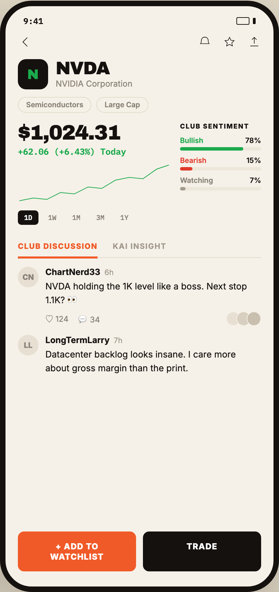

# 04 TICKER THREAD

Canvas: **CHEAT CODE CLUB — FTA-DASHBOARD** · board index 3 · slug `04-ticker-thread`
Frame: **406×860px** (design width 406px — port at 390px logical, scale ratios).

> Style values are EXACT computed values from the canvas. `T.*` = canvas token, resolved in
> the Tokens appendix at the bottom of this file. Text marked `(MOCK)` must not ship as drawn —
> see `../../DELTA.md` for its substitution rule.

## Tree

- **“9:41 N NVDA NVIDIA Corporation Semicondu…”** → `
`
  - box: 406x860 · display: flex · dir: column · width: 390px · height: 844px · bg: T.amber-50 · border: 8px solid T.orange-900 · radius: 46px (T.r17) · shadow: T.orange-900a20 0px 28px 66px 0px · overflow: hidden · type: color T.neutral-950 / Inter / 16px / w400 / lh normal
  - **“9:41…”** → `
`
    - box: 390x31 · display: flex · align: center · justify: space-between · pad: 14px 26px 2px 26px · type: color T.orange-900 / IBM Plex Mono / 12px / w600
    - **"9:41"** → ``
      - box: 28.8x15 · scale: T.ty42
      - text: "9:41"
    - **block[1]** → ``
      - box: 28x11 · display: flex · align: center · gap: 5px
      - **block[0]** → ``
        - box: 19x11 · width: 17px · height: 9px · border: 1px solid T.orange-900 · radius: 2px (T.r2)
      - **block[1]** → ``
        - box: 4x9 · width: 4px · height: 9px · bg: T.orange-900 · radius: 1px (T.r1)
  - **block[1]** → `
`
    - box: 390x32 · display: flex · align: center · justify: space-between · pad: 10px 18px 0px 18px
    - **svg** → `<svg>`
      - box: 22x22 · overflow: hidden
      - svg: `<svg data-dc-tpl="329" width="22" height="22" viewBox="0 0 24 24"><path data-dc-tpl="330" d="M15 5 8 12l7 7" fill="none" stroke="#14110F" strokewidth="2.2" strokelinecap="round" strokelinejoin="round"></path></svg>`
      - **block[0]** → `<path>`
        - box: 6.4x12.8 · display: inline
    - **block[1]** → `
`
      - box: 92x20 · display: flex · gap: 16px
      - **svg** → `<svg>`
        - box: 20x20 · overflow: hidden
        - svg: `<svg data-dc-tpl="332" width="20" height="20" viewBox="0 0 24 24"><path data-dc-tpl="333" d="M6 9.5a6 6 0 0 1 12 0c0 4 1.5 5.5 1.5 5.5h-15S6 13.5 6 9.5Z" fill="none" stroke="#14110F" strokewidth="1.9" strokelinejoin="round"></path></svg>`
        - **block[0]** → `<path>`
          - box: 12.5x9.6 · display: inline
      - **svg** → `<svg>`
        - box: 20x20 · overflow: hidden
        - svg: `<svg data-dc-tpl="334" width="20" height="20" viewBox="0 0 24 24"><path data-dc-tpl="335" d="m12 4 2.4 5 5.6.7-4 3.9 1 5.4-5-2.7-5 2.7 1-5.4-4-3.9 5.6-.7Z" fill="none" stroke="#14110F" strokewidth="1.8" strokelinejoin="round"></path></svg>`
        - **block[0]** → `<path>`
          - box: 13.3x12.5 · display: inline
      - **svg** → `<svg>`
        - box: 20x20 · overflow: hidden
        - svg: `<svg data-dc-tpl="336" width="20" height="20" viewBox="0 0 24 24"><path data-dc-tpl="337" d="M12 4v11M8 8l4-4 4 4M5 19h14" fill="none" stroke="#14110F" strokewidth="1.9" strokelinecap="round" strokelinejoin="round"></path></svg>`
        - **block[0]** → `<path>`
          - box: 11.7x12.5 · display: inline
  - **“N NVDA NVIDIA Corporation…”** → `
`
    - box: 390x58 · display: flex · align: center · gap: 11px · pad: 14px 18px 0px 18px
    - **"N"** → ``
      - box: 44x44 · display: grid · align: center · justify-items: center · grid-cols: 44px · grid-rows: 44px · width: 44px · height: 44px · bg: T.orange-900 · radius: 12px (T.r12) · type: color T.green-600 / Archivo / 20px / w900 · scale: T.ty12
      - text: "N"
    - **“NVDA NVIDIA Corporation…”** → `
`
      - box: 111.7x43
      - **"NVDA"** → `
`
        - box: 111.7x26 · type: color T.orange-900 / Archivo / 26px / w900 / ls -0.91px / lh 26px · scale: T.ty6
        - text: "NVDA"
      - **"NVIDIA Corporation"** → `
`
        - box: 111.7x15 · margin: 2px 0px 0px 0px · type: color T.neutral-400 / 12px · scale: T.ty43
        - text: "NVIDIA Corporation"
  - **“Semiconductors Large Cap…”** → `
`
    - box: 390x34 · display: flex · gap: 7px · pad: 11px 18px 0px 18px
    - **"Semiconductors"** → ``
      - box: 107.2x23 · pad: 4px 11px 4px 11px · border: 1px solid T.amber-100 · radius: 999px (T.r19) · type: color T.neutral-400 / 10.5px / w600 · scale: T.ty64
      - text: "Semiconductors"
    - **"Large Cap"** → ``
      - box: 75.7x23 · pad: 4px 11px 4px 11px · border: 1px solid T.amber-100 · radius: 999px (T.r19) · type: color T.neutral-400 / 10.5px / w600 · scale: T.ty64
      - text: "Large Cap"
  - **“$1,024.31 +62.06 (+6.43%) Today 1D 1W 1M…”** → `
`
    - box: 390x163 · display: flex · gap: 14px · pad: 14px 18px 0px 18px
    - **“$1,024.31 +62.06 (+6.43%) Today 1D 1W 1M…”** → `
`
      - box: 222x149 · min-width: 0px · flex: 1 1 0% · flex-grow: 1 · flex-basis: 0%
      - **"$1,024.31"** **(MOCK)** → `
`
        - box: 222x30 · type: color T.orange-900 / Archivo / 30px / w900 / ls -1.05px / lh 30px · scale: T.ty4
        - text: "$1,024.31"
      - **"+62.06 (+6.43%) Today"** **(MOCK)** → `
`
        - box: 222x16 · margin: 4px 0px 0px 0px · type: color T.green-600 / IBM Plex Mono / 12.5px / w600 · scale: T.ty41
        - text: "+62.06 (+6.43%) Today"
      - **svg** → `<svg>`
        - box: 222x62 · margin: 8px 0px 0px 0px · overflow: hidden
        - svg: `<svg data-dc-tpl="350" width="100%" height="62" viewBox="0 0 200 62" preserveAspectRatio="none" style="margin-top: 8px; display: block;"><polyline data-dc-tpl="351" points="2,56 20,52 38,54 56,44 74,46 92,36 110,38 128,26 146,22 164,24 182,10 198,4" fill="none" stroke="#1BA94C" strokewidth="2.4" str`
        - **block[0]** → `<polyline>`
          - box: 217.6x52 · display: inline
      - **“1D 1W 1M 3M 1Y…”** → `
`
        - box: 222x21 · display: flex · gap: 5px · margin: 8px 0px 0px 0px
        - **"1D"** → ``
          - box: 30x21 · pad: 4px 9px 4px 9px · bg: T.orange-900 · radius: 5px (T.r5) · type: color T.neutral-0 / IBM Plex Mono / 10px / w600 · scale: T.ty70
          - text: "1D"
        - **"1W"** → ``
          - box: 30x21 · pad: 4px 9px 4px 9px · type: color T.neutral-400 / IBM Plex Mono / 10px · scale: T.ty69
          - text: "1W"
        - **"1M"** → ``
          - box: 30x21 · pad: 4px 9px 4px 9px · type: color T.neutral-400 / IBM Plex Mono / 10px · scale: T.ty69
          - text: "1M"
        - **"3M"** → ``
          - box: 30x21 · pad: 4px 9px 4px 9px · type: color T.neutral-400 / IBM Plex Mono / 10px · scale: T.ty69
          - text: "3M"
        - **"1Y"** → ``
          - box: 30x21 · pad: 4px 9px 4px 9px · type: color T.neutral-400 / IBM Plex Mono / 10px · scale: T.ty69
          - text: "1Y"
    - **“CLUB SENTIMENT Bullish 78% Bearish 15% W…”** → `
`
      - box: 118x149 · width: 118px · flex-shrink: 0
      - **"Club sentiment"** → `
`
        - box: 118x11 · type: color T.orange-900 / 9.5px / w800 / ls 1.14px / uppercase · scale: T.ty77
        - text: "Club sentiment"
      - **“Bullish 78%…”** → `
`
        - box: 118x21 · margin: 9px 0px 0px 0px
        - **“Bullish 78%…”** → `
`
          - box: 118x13 · display: flex · justify: space-between · type: color T.green-600 / 10.5px / w600
          - **"Bullish"** → ``
            - box: 33.8x13 · scale: T.ty64
            - text: "Bullish"
          - **"78%"** **(MOCK)** → ``
            - box: 23.2x13 · type: color T.orange-900 · scale: T.ty64
            - text: "78%"
        - **block[1]** → `
`
          - box: 118x5 · height: 5px · margin: 3px 0px 0px 0px · bg: T.amber-100-b · radius: 3px (T.r3)
          - **block[0]** → `
`
            - box: 92x5 · width: 78% · height: 100% · bg: T.green-600 · radius: 3px (T.r3)
      - **“Bearish 15%…”** → `
`
        - box: 118x21 · margin: 8px 0px 0px 0px
        - **“Bearish 15%…”** → `
`
          - box: 118x13 · display: flex · justify: space-between · type: color T.red-400 / 10.5px / w600
          - **"Bearish"** → ``
            - box: 38.5x13 · scale: T.ty64
            - text: "Bearish"
          - **"15%"** **(MOCK)** → ``
            - box: 21.4x13 · type: color T.orange-900 · scale: T.ty64
            - text: "15%"
        - **block[1]** → `
`
          - box: 118x5 · height: 5px · margin: 3px 0px 0px 0px · bg: T.amber-100-b · radius: 3px (T.r3)
          - **block[0]** → `
`
            - box: 17.7x5 · width: 15% · height: 100% · bg: T.red-400 · radius: 3px (T.r3)
      - **“Watching 7%…”** → `
`
        - box: 118x21 · margin: 8px 0px 0px 0px
        - **“Watching 7%…”** → `
`
          - box: 118x13 · display: flex · justify: space-between · type: color T.neutral-400 / 10.5px / w600
          - **"Watching"** → ``
            - box: 48.1x13 · scale: T.ty64
            - text: "Watching"
          - **"7%"** **(MOCK)** → ``
            - box: 16.6x13 · type: color T.orange-900 · scale: T.ty64
            - text: "7%"
        - **block[1]** → `
`
          - box: 118x5 · height: 5px · margin: 3px 0px 0px 0px · bg: T.amber-100-b · radius: 3px (T.r3)
          - **block[0]** → `
`
            - box: 8.3x5 · width: 7% · height: 100% · bg: T.orange-400-b · radius: 3px (T.r3)
  - **“CLUB DISCUSSION KAI INSIGHT…”** → `
`
    - box: 354x32.5 · display: flex · margin: 16px 18px 0px 18px · border: T:0px none T.neutral-950 R:0px none T.neutral-950 B:1px solid T.amber-100 L:0px none T.neutral-950
    - **"Club discussion"** → `
`
      - box: 116.1x33 · pad: 8px 0px 8px 0px · margin: 0px 22px -1.5px 0px · border: T:0px none T.orange-400 R:0px none T.orange-400 B:3px solid T.orange-400 L:0px none T.orange-400 · type: color T.orange-400 / 11px / w800 / ls 0.99px / uppercase · scale: T.ty61
      - text: "Club discussion"
    - **"Kai insight"** → `
`
      - box: 78.3x31.5 · pad: 8px 0px 8px 0px · type: color T.orange-400-b / 11px / w700 / ls 0.99px / uppercase · scale: T.ty62
      - text: "Kai insight"
  - **“CN ChartNerd33 6h NVDA holding the 1K le…”** → `
`
    - box: 390x385.5 · display: flex · dir: column · gap: 13px · flex: 1 1 0% · flex-grow: 1 · flex-basis: 0% · pad: 13px 18px 0px 18px · overflow: hidden
    - **“CN ChartNerd33 6h NVDA holding the 1K le…”** → `
`
      - box: 354x86 · display: flex · gap: 10px · flex-shrink: 0
      - **"CN"** → `
`
        - box: 30x30 · display: grid · align: center · justify-items: center · grid-cols: 30px · grid-rows: 30px · width: 30px · height: 30px · flex-shrink: 0 · bg: T.orange-100 · radius: 50% (T.r18) · type: color T.neutral-400 / 11px / w800 · scale: T.ty54
        - text: "CN"
      - **“ChartNerd33 6h NVDA holding the 1K level…”** → `
`
        - box: 314x86 · min-width: 0px · flex: 1 1 0% · flex-grow: 1 · flex-basis: 0%
        - **“ChartNerd33 6h…”** → `
`
          - box: 314x15 · display: flex · align: center · gap: 6px
          - **"ChartNerd33"** → ``
            - box: 80x15 · type: color T.orange-900 / 12.5px / w700 · scale: T.ty37
            - text: "ChartNerd33"
          - **"6h"** → ``
            - box: 13.3x14 · type: color T.orange-400-b / 11px · scale: T.ty53
            - text: "6h"
        - **"NVDA holding the 1K level like a boss. Next "** → `
`
          - box: 314x39 · margin: 4px 0px 0px 0px · type: color T.orange-900 / 13px / lh 19.5px · scale: T.ty26
          - text: "NVDA holding the 1K level like a boss. Next stop 1.1K? 👀"
        - **“♡ 124 💬 34…”** → `
`
          - box: 314x21 · display: flex · align: center · gap: 14px · margin: 7px 0px 0px 0px · type: color T.neutral-400 / 11.5px
          - **"♡ 124"** → ``
            - box: 33.7x17 · scale: T.ty51
            - text: "♡ 124"
          - **"💬 34"** → ``
            - box: 31.8x18 · scale: T.ty51
            - text: "💬 34"
          - **block[2]** → ``
            - box: 51x21 · display: flex · margin: 0px 0px 0px 169.531px
            - **block[0]** → ``
              - box: 21x21 · width: 19px · height: 19px · bg: T.orange-100 · border: 1px solid T.amber-50 · radius: 50% (T.r18)
            - **block[1]** → ``
              - box: 21x21 · width: 19px · height: 19px · margin: 0px 0px 0px -6px · bg: T.orange-100-b · border: 1px solid T.amber-50 · radius: 50% (T.r18)
            - **block[2]** → ``
              - box: 21x21 · width: 19px · height: 19px · margin: 0px 0px 0px -6px · bg: T.orange-200 · border: 1px solid T.amber-50 · radius: 50% (T.r18)
    - **“LL LongTermLarry 7h Datacenter backlog l…”** → `
`
      - box: 354x58 · display: flex · gap: 10px · flex-shrink: 0
      - **"LL"** → `
`
        - box: 30x30 · display: grid · align: center · justify-items: center · grid-cols: 30px · grid-rows: 30px · width: 30px · height: 30px · flex-shrink: 0 · bg: T.orange-100 · radius: 50% (T.r18) · type: color T.neutral-400 / 11px / w800 · scale: T.ty54
        - text: "LL"
      - **“LongTermLarry 7h Datacenter backlog look…”** → `
`
        - box: 314x58 · min-width: 0px · flex: 1 1 0% · flex-grow: 1 · flex-basis: 0%
        - **“LongTermLarry 7h…”** → `
`
          - box: 314x15 · display: flex · align: center · gap: 6px
          - **"LongTermLarry"** → ``
            - box: 93.5x15 · type: color T.orange-900 / 12.5px / w700 · scale: T.ty37
            - text: "LongTermLarry"
          - **"7h"** → ``
            - box: 12.7x14 · type: color T.orange-400-b / 11px · scale: T.ty53
            - text: "7h"
        - **"Datacenter backlog looks insane. I care more"** → `
`
          - box: 314x39 · margin: 4px 0px 0px 0px · type: color T.orange-900 / 13px / lh 19.5px · scale: T.ty26
          - text: "Datacenter backlog looks insane. I care more about gross margin than the print."
  - **“+ ADD TO WATCHLIST TRADE…”** → `
`
    - box: 390x92 · display: flex · gap: 10px · pad: 12px 18px 22px 18px
    - **"+ Add to watchlist"** → ``
      - box: 172x58 · flex: 1 1 0% · flex-grow: 1 · flex-basis: 0% · pad: 14px 14px 14px 14px · bg: T.orange-400 · radius: 9px (T.r9) · type: color T.neutral-0 / 12px / w800 / ls 0.72px / uppercase / align-center · scale: T.ty44
      - text: "+ Add to watchlist"
    - **"Trade"** → ``
      - box: 172x58 · flex: 1 1 0% · flex-grow: 1 · flex-basis: 0% · pad: 14px 14px 14px 14px · bg: T.orange-900 · radius: 9px (T.r9) · type: color T.neutral-0 / 12px / w800 / ls 0.72px / uppercase / align-center · scale: T.ty44
      - text: "Trade"

## Tokens used in this board

| token | value | role |
| --- | --- | --- |
| T.orange-900 | `#14110F` | border, text, bg, gradient |
| T.neutral-0 | `#FFFFFF` | bg, text, border |
| T.orange-400 | `#F05A28` | border, text, bg, gradient |
| T.neutral-400 | `#8A8279` | text, border |
| T.amber-100 | `#E4DCCC` | border, bg |
| T.orange-400-b | `#A39A8E` | text, bg |
| T.neutral-950 | `#000000` | border, text |
| T.green-600 | `#1BA94C` | bg, text |
| T.orange-100 | `#E7DFD2` | bg |
| T.amber-50 | `#F5F1E8` | bg, border |
| T.orange-900a20 | `#14110F/0.2` | shadow |
| T.red-400 | `#E0392B` | bg, text |
| T.amber-100-b | `#EDE7DB` | bg |
| T.orange-100-b | `#D8CFC0` | bg |
| T.orange-200 | `#C9BFAE` | bg |
| T.ty4 | Archivo 30px/30px w900 ls:-1.05px | type scale |
| T.ty6 | Archivo 26px/26px w900 ls:-0.91px | type scale |
| T.ty12 | Archivo 20px/normal w900 ls:normal | type scale |
| T.ty26 | Inter 13px/19.5px w400 ls:normal | type scale |
| T.ty37 | Inter 12.5px/normal w700 ls:normal | type scale |
| T.ty41 | IBM Plex Mono 12.5px/normal w600 ls:normal | type scale |
| T.ty42 | IBM Plex Mono 12px/normal w600 ls:normal | type scale |
| T.ty43 | Inter 12px/normal w400 ls:normal | type scale |
| T.ty44 | Inter 12px/normal w800 ls:0.72px uppercase | type scale |
| T.ty51 | Inter 11.5px/normal w400 ls:normal | type scale |
| T.ty53 | Inter 11px/normal w400 ls:normal | type scale |
| T.ty54 | Inter 11px/normal w800 ls:normal | type scale |
| T.ty61 | Inter 11px/normal w800 ls:0.99px uppercase | type scale |
| T.ty62 | Inter 11px/normal w700 ls:0.99px uppercase | type scale |
| T.ty64 | Inter 10.5px/normal w600 ls:normal | type scale |
| T.ty69 | IBM Plex Mono 10px/normal w400 ls:normal | type scale |
| T.ty70 | IBM Plex Mono 10px/normal w600 ls:normal | type scale |
| T.ty77 | Inter 9.5px/normal w800 ls:1.14px uppercase | type scale |
| T.r1 | `1px` | radius |
| T.r2 | `2px` | radius |
| T.r3 | `3px` | radius |
| T.r5 | `5px` | radius |
| T.r9 | `9px` | radius |
| T.r12 | `12px` | radius |
| T.r17 | `46px` | radius |
| T.r18 | `50%` | radius |
| T.r19 | `999px` | radius |
