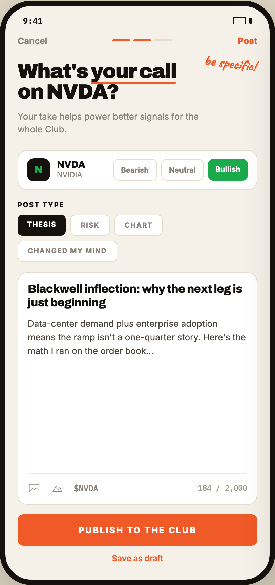

# 05 SHARE YOUR CALL

Canvas: **CHEAT CODE CLUB — FTA-DASHBOARD** · board index 4 · slug `05-share-your-call`
Frame: **406×860px** (design width 406px — port at 390px logical, scale ratios).

> Style values are EXACT computed values from the canvas. `T.*` = canvas token, resolved in
> the Tokens appendix at the bottom of this file. Text marked `(MOCK)` must not ship as drawn —
> see `../../DELTA.md` for its substitution rule.

## Tree

- **“9:41 Cancel Post be specific! What's you…”** → `
`
  - box: 406x860 · display: flex · dir: column · width: 390px · height: 844px · bg: T.amber-50 · border: 8px solid T.orange-900 · radius: 46px (T.r17) · shadow: T.orange-900a20 0px 28px 66px 0px · overflow: hidden · type: color T.neutral-950 / Inter / 16px / w400 / lh normal
  - **“9:41…”** → `
`
    - box: 390x31 · display: flex · align: center · justify: space-between · pad: 14px 26px 2px 26px · type: color T.orange-900 / IBM Plex Mono / 12px / w600
    - **"9:41"** → ``
      - box: 28.8x15 · scale: T.ty42
      - text: "9:41"
    - **block[1]** → ``
      - box: 28x11 · display: flex · align: center · gap: 5px
      - **block[0]** → ``
        - box: 19x11 · width: 17px · height: 9px · border: 1px solid T.orange-900 · radius: 2px (T.r2)
      - **block[1]** → ``
        - box: 4x9 · width: 4px · height: 9px · bg: T.orange-900 · radius: 1px (T.r1)
  - **“Cancel Post…”** → `
`
    - box: 390x28 · display: flex · align: center · justify: space-between · pad: 12px 18px 0px 18px
    - **"Cancel"** → ``
      - box: 43.7x16 · type: color T.neutral-400 / 13px / w600 · scale: T.ty32
      - text: "Cancel"
    - **block[1]** → `
`
      - box: 88x3 · display: flex · align: center · gap: 5px
      - **block[0]** → ``
        - box: 26x3 · width: 26px · height: 3px · bg: T.orange-400 · radius: 2px (T.r2)
      - **block[1]** → ``
        - box: 26x3 · width: 26px · height: 3px · bg: T.orange-400 · radius: 2px (T.r2)
      - **block[2]** → ``
        - box: 26x3 · width: 26px · height: 3px · bg: T.amber-100 · radius: 2px (T.r2)
    - **"Post"** → ``
      - box: 28.8x16 · type: color T.orange-400 / 13px / w800 · scale: T.ty33
      - text: "Post"
  - **“be specific! What's your call on NVDA? Y…”** → `
`
    - box: 390x133.2 · pad: 22px 18px 0px 18px · position: relative [0px 0px 0px 0px]
    - **"be specific!"** → `
`
      - box: 79.7x35.2 · transform: matrix(0.992546, 0.121869, -0.121869, 0.992546, 0, 0) · position: absolute [12px 20px 95.1875px 292.906px] · type: color T.orange-400 / Caveat / 21px / w700 · scale: T.ty11
      - text: "be specific!"
    - **"What's on NVDA?"** → `<h2>`
      - box: 250x61.2 · max-width: 250px · type: color T.orange-900 / Archivo / 30px / w900 / ls -1.05px / lh 30.6px · scale: T.ty3
      - text: "What's on NVDA?"
      - **"your call"** → ``
        - box: 126.2x30.6 · display: inline-block · position: relative [0px 0px 0px 0px] · scale: T.ty3
        - text: "your call"
        - **block[0]** → ``
          - box: 126.2x3 · height: 3px · bg: T.orange-400 · radius: 2px (T.r2) · position: absolute [30.5938px 0px -3px 0px]
    - **"Your take helps power better signals for the"** → `
`
      - box: 270x39 · max-width: 270px · margin: 11px 0px 0px 0px · type: color T.neutral-400 / 13px / lh 19.5px · scale: T.ty26
      - text: "Your take helps power better signals for the whole Club."
  - **“N NVDA NVIDIA Bearish Neutral Bullish…”** → `
`
    - box: 390x78 · pad: 20px 18px 0px 18px
    - **“N NVDA NVIDIA Bearish Neutral Bullish…”** → `
`
      - box: 354x58 · display: flex · align: center · gap: 10px · pad: 11px 13px 11px 13px · bg: T.neutral-0 · border: 1px solid T.amber-100 · radius: 13px (T.r13)
      - **"N"** → ``
        - box: 34x34 · display: grid · align: center · justify-items: center · grid-cols: 34px · grid-rows: 34px · width: 34px · height: 34px · bg: T.orange-900 · radius: 10px (T.r10) · type: color T.green-600 / Archivo / 15px / w900 · scale: T.ty21
        - text: "N"
      - **“NVDA NVIDIA…”** → `
`
        - box: 72.7x29 · flex: 1 1 0% · flex-grow: 1 · flex-basis: 0%
        - **"NVDA"** → `
`
          - box: 72.7x15 · type: color T.orange-900 / Archivo / 14px / w800 · scale: T.ty23
          - text: "NVDA"
        - **"NVIDIA"** → `
`
          - box: 72.7x14 · type: color T.neutral-400 / 11px · scale: T.ty53
          - text: "NVIDIA"
      - **“Bearish Neutral Bullish…”** → `
`
        - box: 199.3x32 · display: flex · gap: 6px
        - **"Bearish"** → ``
          - box: 64.9x32 · pad: 8px 11px 8px 11px · border: 1px solid T.amber-100 · radius: 8px (T.r8) · type: color T.neutral-400 / 11px / w700 · scale: T.ty55
          - text: "Bearish"
        - **"Neutral"** → ``
          - box: 63.5x32 · pad: 8px 11px 8px 11px · border: 1px solid T.amber-100 · radius: 8px (T.r8) · type: color T.neutral-400 / 11px / w700 · scale: T.ty55
          - text: "Neutral"
        - **"Bullish"** → ``
          - box: 59x32 · pad: 8px 11px 8px 11px · bg: T.green-600 · radius: 8px (T.r8) · type: color T.neutral-0 / 11px / w800 · scale: T.ty54
          - text: "Bullish"
  - **“POST TYPE THESIS RISK CHART CHANGED MY M…”** → `
`
    - box: 390x106 · pad: 16px 18px 0px 18px
    - **"Post type"** → `
`
      - box: 354x12 · margin: 0px 0px 9px 0px · type: color T.orange-900 / 10px / w800 / ls 1.4px / uppercase · scale: T.ty68
      - text: "Post type"
    - **“THESIS RISK CHART CHANGED MY MIND…”** → `
`
      - box: 354x69 · display: flex · wrap: wrap · gap: 7px
      - **"Thesis"** → ``
        - box: 71.3x31 · pad: 8px 14px 8px 14px · bg: T.orange-900 · radius: 7px (T.r7) · type: color T.neutral-0 / 10.5px / w800 / ls 0.84px / uppercase · scale: T.ty66
        - text: "Thesis"
      - **"Risk"** → ``
        - box: 57.6x31 · pad: 8px 14px 8px 14px · bg: T.neutral-0 · border: 1px solid T.amber-100 · radius: 7px (T.r7) · type: color T.neutral-400 / 10.5px / w700 / ls 0.84px / uppercase · scale: T.ty65
        - text: "Risk"
      - **"Chart"** → ``
        - box: 71.6x31 · pad: 8px 14px 8px 14px · bg: T.neutral-0 · border: 1px solid T.amber-100 · radius: 7px (T.r7) · type: color T.neutral-400 / 10.5px / w700 / ls 0.84px / uppercase · scale: T.ty65
        - text: "Chart"
      - **"Changed my mind"** → ``
        - box: 146.7x31 · pad: 8px 14px 8px 14px · bg: T.neutral-0 · border: 1px solid T.amber-100 · radius: 7px (T.r7) · type: color T.neutral-400 / 10.5px / w700 / ls 0.84px / uppercase · scale: T.ty65
        - text: "Changed my mind"
  - **“Blackwell inflection: why the next leg i…”** → `
`
    - box: 390x357.8 · display: flex · dir: column · min-height: 0px · flex: 1 1 0% · flex-grow: 1 · flex-basis: 0% · pad: 16px 18px 0px 18px
    - **“Blackwell inflection: why the next leg i…”** → `
`
      - box: 354x341.8 · display: flex · dir: column · min-height: 0px · flex: 1 1 0% · flex-grow: 1 · flex-basis: 0% · pad: 14px 14px 14px 14px · bg: T.neutral-0 · border: 1px solid T.amber-100 · radius: 14px (T.r14)
      - **"Blackwell inflection: why the next leg is ju"** → `
`
        - box: 324x40.8 · type: color T.orange-900 / Archivo / 17px / w800 / ls -0.34px / lh 20.4px · scale: T.ty16
        - text: "Blackwell inflection: why the next leg is just beginning"
      - **"Data-center demand plus enterprise adoption "** → `
`
        - box: 324x60.4 · margin: 9px 0px 0px 0px · type: color T.orange-700 / 13px / lh 20.15px · scale: T.ty34
        - text: "Data-center demand plus enterprise adoption means the ramp isn't a one-quarter story. Here's the math I ran on the order book…"
      - **“$NVDA 184 / 2,000…”** → `
`
        - box: 324x32 · display: flex · align: center · gap: 15px · pad: 12px 0px 0px 0px · margin: 169.609px 0px 0px 0px · border: T:1px solid T.orange-50 R:0px none T.neutral-950 B:0px none T.neutral-950 L:0px none T.neutral-950
        - **svg** → `<svg>`
          - box: 19x19 · overflow: hidden
          - svg: `<svg data-dc-tpl="451" width="19" height="19" viewBox="0 0 24 24"><rect data-dc-tpl="452" x="3" y="5" width="18" height="14" rx="2" fill="none" stroke="#8A8279" strokewidth="1.9"></rect><path data-dc-tpl="453" d="m5 16 4-4 3 3 3.5-4L21 16" fill="none" stroke="#8A8279" strokewidth="1.9" strokelinejoi`
          - **block[0]** → `<rect>`
            - box: 14.3x11.1 · display: inline
          - **block[1]** → `<path>`
            - box: 12.7x4 · display: inline
        - **svg** → `<svg>`
          - box: 19x19 · overflow: hidden
          - svg: `<svg data-dc-tpl="454" width="19" height="19" viewBox="0 0 24 24"><path data-dc-tpl="455" d="M4 18 10 8l4 6 3-4 3 8Z" fill="none" stroke="#8A8279" strokewidth="1.9" strokelinejoin="round"></path></svg>`
          - **block[0]** → `<path>`
            - box: 12.7x7.9 · display: inline
        - **"$NVDA"** → ``
          - box: 36x15 · type: color T.neutral-400 / IBM Plex Mono / 12px · scale: T.ty49
          - text: "$NVDA"
        - **"184 / 2,000"** **(MOCK)** → ``
          - box: 72.6x14 · margin: 0px 0px 0px 132.391px · type: color T.orange-400-b / IBM Plex Mono / 11px · scale: T.ty59
          - text: "184 / 2,000"
  - **“PUBLISH TO THE CLUB Save as draft…”** → `
`
    - box: 390x110 · pad: 14px 18px 24px 18px
    - **"Publish to the Club"** → `
`
      - box: 354x46 · pad: 15px 15px 15px 15px · bg: T.orange-400 · radius: 9px (T.r9) · type: color T.neutral-0 / 13px / w800 / ls 1.56px / uppercase / align-center · scale: T.ty35
      - text: "Publish to the Club"
    - **"Save as draft"** → `
`
      - box: 354x15 · margin: 11px 0px 0px 0px · type: color T.orange-400 / 12px / w600 / align-center · scale: T.ty50
      - text: "Save as draft"

## Tokens used in this board

| token | value | role |
| --- | --- | --- |
| T.orange-900 | `#14110F` | border, text, bg, gradient |
| T.neutral-0 | `#FFFFFF` | bg, text, border |
| T.orange-400 | `#F05A28` | border, text, bg, gradient |
| T.neutral-400 | `#8A8279` | text, border |
| T.amber-100 | `#E4DCCC` | border, bg |
| T.orange-400-b | `#A39A8E` | text, bg |
| T.neutral-950 | `#000000` | border, text |
| T.green-600 | `#1BA94C` | bg, text |
| T.amber-50 | `#F5F1E8` | bg, border |
| T.orange-900a20 | `#14110F/0.2` | shadow |
| T.orange-50 | `#F0EBE1` | border |
| T.orange-700 | `#4A443D` | text |
| T.ty3 | Archivo 30px/30.6px w900 ls:-1.05px | type scale |
| T.ty11 | Caveat 21px/normal w700 ls:normal | type scale |
| T.ty16 | Archivo 17px/20.4px w800 ls:-0.34px | type scale |
| T.ty21 | Archivo 15px/normal w900 ls:normal | type scale |
| T.ty23 | Archivo 14px/normal w800 ls:normal | type scale |
| T.ty26 | Inter 13px/19.5px w400 ls:normal | type scale |
| T.ty32 | Inter 13px/normal w600 ls:normal | type scale |
| T.ty33 | Inter 13px/normal w800 ls:normal | type scale |
| T.ty34 | Inter 13px/20.15px w400 ls:normal | type scale |
| T.ty35 | Inter 13px/normal w800 ls:1.56px uppercase | type scale |
| T.ty42 | IBM Plex Mono 12px/normal w600 ls:normal | type scale |
| T.ty49 | IBM Plex Mono 12px/normal w400 ls:normal | type scale |
| T.ty50 | Inter 12px/normal w600 ls:normal | type scale |
| T.ty53 | Inter 11px/normal w400 ls:normal | type scale |
| T.ty54 | Inter 11px/normal w800 ls:normal | type scale |
| T.ty55 | Inter 11px/normal w700 ls:normal | type scale |
| T.ty59 | IBM Plex Mono 11px/normal w400 ls:normal | type scale |
| T.ty65 | Inter 10.5px/normal w700 ls:0.84px uppercase | type scale |
| T.ty66 | Inter 10.5px/normal w800 ls:0.84px uppercase | type scale |
| T.ty68 | Inter 10px/normal w800 ls:1.4px uppercase | type scale |
| T.r1 | `1px` | radius |
| T.r2 | `2px` | radius |
| T.r7 | `7px` | radius |
| T.r8 | `8px` | radius |
| T.r9 | `9px` | radius |
| T.r10 | `10px` | radius |
| T.r13 | `13px` | radius |
| T.r14 | `14px` | radius |
| T.r17 | `46px` | radius |
