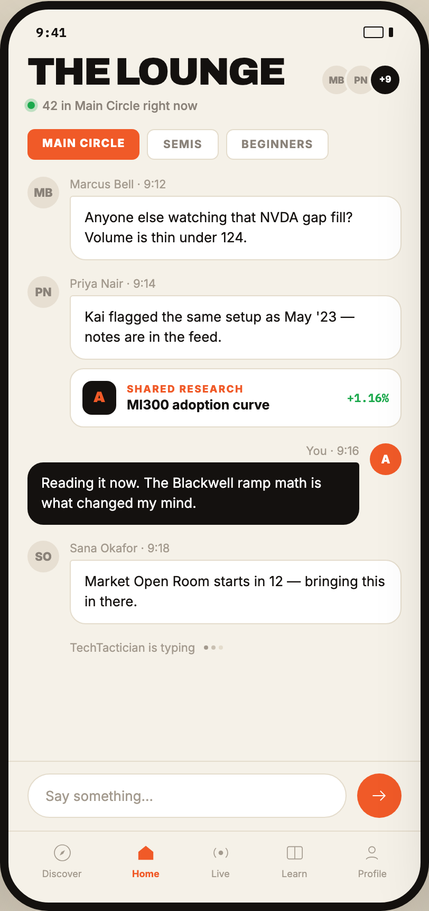

# 06 THE LOUNGE

Canvas: **CHEAT CODE CLUB — FTA-DASHBOARD** · board index 5 · slug `06-the-lounge`
Frame: **406×860px** (design width 406px — port at 390px logical, scale ratios).

> Style values are EXACT computed values from the canvas. `T.*` = canvas token, resolved in
> the Tokens appendix at the bottom of this file. Text marked `(MOCK)` must not ship as drawn —
> see `../../DELTA.md` for its substitution rule.

## Tree

- **“9:41 THE LOUNGE 42 in Main Circle right …”** → `
`
  - box: 406x860 · display: flex · dir: column · width: 390px · height: 844px · bg: T.amber-50 · border: 8px solid T.orange-900 · radius: 46px (T.r17) · shadow: T.orange-900a20 0px 28px 66px 0px · overflow: hidden · type: color T.neutral-950 / Inter / 16px / w400 / lh normal
  - **“9:41…”** → `
`
    - box: 390x31 · display: flex · align: center · justify: space-between · pad: 14px 26px 2px 26px · type: color T.orange-900 / IBM Plex Mono / 12px / w600
    - **"9:41"** → ``
      - box: 28.8x15 · scale: T.ty42
      - text: "9:41"
    - **block[1]** → ``
      - box: 28x11 · display: flex · align: center · gap: 5px
      - **block[0]** → ``
        - box: 19x11 · width: 17px · height: 9px · border: 1px solid T.orange-900 · radius: 2px (T.r2)
      - **block[1]** → ``
        - box: 4x9 · width: 4px · height: 9px · bg: T.orange-900 · radius: 1px (T.r1)
  - **“THE LOUNGE 42 in Main Circle right now M…”** → `
`
    - box: 390x67.4 · display: flex · align: flex-start · justify: space-between · pad: 12px 18px 0px 18px
    - **“THE LOUNGE 42 in Main Circle right now…”** → `
`
      - box: 242.9x55.4
      - **"The Lounge"** → `<h2>`
        - box: 242.9x32.4 · type: color T.orange-900 / Archivo / 36px / w900 / ls -1.44px / lh 32.4px / uppercase · scale: T.ty1
        - text: "The Lounge"
      - **"42 in Main Circle right now"** → `
`
        - box: 242.9x14 · display: flex · align: center · gap: 7px · margin: 9px 0px 0px 0px · type: color T.neutral-400 / 11.5px / w500 · scale: T.ty52
        - text: "42 in Main Circle right now"
        - **block[0]** → ``
          - box: 7x7 · display: flex · width: 7px · height: 7px · position: relative [0px 0px 0px 0px]
          - **block[0]** → ``
            - box: 7.1x7.1 · bg: T.green-600 · radius: 50% (T.r18) · opacity: 0.591627 · transform: matrix(1.01954, 0, 0, 1.01954, 0, 0) · position: absolute [0px 0px 0px 0px]
          - **block[1]** → ``
            - box: 7x7 · width: 7px · height: 7px · bg: T.green-600 · radius: 50% (T.r18) · position: relative [0px 0px 0px 0px]
    - **“MB PN +9…”** → `
`
      - box: 77x39 · display: flex · pad: 8px 0px 0px 0px
      - **"MB"** → ``
        - box: 31x31 · display: grid · align: center · justify-items: center · grid-cols: 27px · grid-rows: 27px · width: 27px · height: 27px · bg: T.orange-100 · border: 2px solid T.amber-50 · radius: 50% (T.r18) · type: color T.neutral-400 / 9px / w800 · scale: T.ty82
        - text: "MB"
      - **"PN"** → ``
        - box: 31x31 · display: grid · align: center · justify-items: center · grid-cols: 27px · grid-rows: 27px · width: 27px · height: 27px · margin: 0px 0px 0px -8px · bg: T.orange-100 · border: 2px solid T.amber-50 · radius: 50% (T.r18) · type: color T.neutral-400 / 9px / w800 · scale: T.ty82
        - text: "PN"
      - **"+9"** **(MOCK)** → ``
        - box: 31x31 · display: grid · align: center · justify-items: center · grid-cols: 27px · grid-rows: 27px · width: 27px · height: 27px · margin: 0px 0px 0px -8px · bg: T.orange-900 · border: 2px solid T.amber-50 · radius: 50% (T.r18) · type: color T.neutral-0 / 8.5px / w800 · scale: T.ty84
        - text: "+9"
  - **“MAIN CIRCLE SEMIS BEGINNERS…”** → `
`
    - box: 390x56 · display: flex · gap: 7px · pad: 15px 18px 12px 18px
    - **"Main circle"** → ``
      - box: 106.5x29 · pad: 7px 14px 7px 14px · bg: T.orange-400 · radius: 7px (T.r7) · type: color T.neutral-0 / 10.5px / w800 / ls 0.84px / uppercase · scale: T.ty66
      - text: "Main circle"
    - **"Semis"** → ``
      - box: 67.1x29 · pad: 7px 14px 7px 14px · bg: T.neutral-0 · border: 1px solid T.amber-100 · radius: 7px (T.r7) · type: color T.neutral-400 / 10.5px / w700 / ls 0.84px / uppercase · scale: T.ty65
      - text: "Semis"
    - **"Beginners"** → ``
      - box: 97.9x29 · pad: 7px 14px 7px 14px · bg: T.neutral-0 · border: 1px solid T.amber-100 · radius: 7px (T.r7) · type: color T.neutral-400 / 10.5px / w700 / ls 0.84px / uppercase · scale: T.ty65
      - text: "Beginners"
  - **“MB Marcus Bell · 9:12 Anyone else watchi…”** → `
`
    - box: 390x555.6 · display: flex · dir: column · gap: 15px · flex: 1 1 0% · flex-grow: 1 · flex-basis: 0% · pad: 4px 18px 0px 18px · overflow: hidden
    - **“MB Marcus Bell · 9:12 Anyone else watchi…”** → `
`
      - box: 354x79 · display: flex · gap: 10px · flex-shrink: 0
      - **"MB"** → `
`
        - box: 30x30 · display: grid · align: center · justify-items: center · grid-cols: 30px · grid-rows: 30px · width: 30px · height: 30px · flex-shrink: 0 · bg: T.orange-100 · radius: 50% (T.r18) · type: color T.neutral-400 / 11px / w800 · scale: T.ty54
        - text: "MB"
      - **“Marcus Bell · 9:12 Anyone else watching …”** → `
`
        - box: 314x79 · min-width: 0px
        - **"Marcus Bell · 9:12"** → `
`
          - box: 314x14 · margin: 0px 0px 4px 0px · type: color T.orange-400-b / 11px · scale: T.ty53
          - text: "Marcus Bell · 9:12"
        - **"Anyone else watching that NVDA gap fill? Vol"** → `
`
          - box: 314x61 · pad: 10px 13px 10px 13px · bg: T.neutral-0 · border: 1px solid T.amber-100 · radius: 3px 15px 15px 15px · type: color T.orange-900 / 13px / lh 19.5px · scale: T.ty26
          - text: "Anyone else watching that NVDA gap fill? Volume is thin under 124."
    - **“PN Priya Nair · 9:14 Kai flagged the sam…”** → `
`
      - box: 354x143 · display: flex · gap: 10px · flex-shrink: 0
      - **"PN"** → `
`
        - box: 30x30 · display: grid · align: center · justify-items: center · grid-cols: 30px · grid-rows: 30px · width: 30px · height: 30px · flex-shrink: 0 · bg: T.orange-100 · radius: 50% (T.r18) · type: color T.neutral-400 / 11px / w800 · scale: T.ty54
        - text: "PN"
      - **“Priya Nair · 9:14 Kai flagged the same s…”** → `
`
        - box: 314x143 · min-width: 0px
        - **"Priya Nair · 9:14"** → `
`
          - box: 314x14 · margin: 0px 0px 4px 0px · type: color T.orange-400-b / 11px · scale: T.ty53
          - text: "Priya Nair · 9:14"
        - **"Kai flagged the same setup as May '23 — note"** → `
`
          - box: 314x61 · pad: 10px 13px 10px 13px · bg: T.neutral-0 · border: 1px solid T.amber-100 · radius: 3px 15px 15px 15px · type: color T.orange-900 / 13px / lh 19.5px · scale: T.ty26
          - text: "Kai flagged the same setup as May '23 — notes are in the feed."
        - **“A SHARED RESEARCH MI300 adoption curve +…”** → `
`
          - box: 314x56 · display: flex · align: center · gap: 10px · pad: 11px 11px 11px 11px · margin: 8px 0px 0px 0px · bg: T.neutral-0 · border: 1px solid T.amber-100 · radius: 13px (T.r13)
          - **"A"** → ``
            - box: 32x32 · display: grid · align: center · justify-items: center · grid-cols: 32px · grid-rows: 32px · width: 32px · height: 32px · flex-shrink: 0 · bg: T.orange-900 · radius: 9px (T.r9) · type: color T.orange-400 / Archivo / 14px / w900 · scale: T.ty24
            - text: "A"
          - **“SHARED RESEARCH MI300 adoption curve…”** → `
`
            - box: 135.3x28 · min-width: 0px
            - **"Shared research"** → `
`
              - box: 135.3x11 · type: color T.orange-400 / 9.5px / w800 / ls 1.14px / uppercase · scale: T.ty77
              - text: "Shared research"
            - **"MI300 adoption curve"** → `
`
              - box: 135.3x15 · margin: 2px 0px 0px 0px · type: color T.orange-900 / 12.5px / w700 · scale: T.ty37
              - text: "MI300 adoption curve"
          - **"+1.16%"** **(MOCK)** → ``
            - box: 39.6x14 · flex-shrink: 0 · margin: 0px 0px 0px 63.1406px · type: color T.green-600 / IBM Plex Mono / 11px / w600 · scale: T.ty63
            - text: "+1.16%"
    - **“A You · 9:16 Reading it now. The Blackwe…”** → `
`
      - box: 354x77 · display: flex · dir: row-reverse · gap: 10px · flex-shrink: 0
      - **"A"** → `
`
        - box: 30x30 · display: grid · align: center · justify-items: center · grid-cols: 30px · grid-rows: 30px · width: 30px · height: 30px · flex-shrink: 0 · bg: T.orange-400 · radius: 50% (T.r18) · type: color T.neutral-0 / 11px / w800 · scale: T.ty54
        - text: "A"
      - **“You · 9:16 Reading it now. The Blackwell…”** → `
`
        - box: 314x77 · min-width: 0px
        - **"You · 9:16"** → `
`
          - box: 314x14 · margin: 0px 0px 4px 0px · type: color T.orange-400-b / 11px / align-right · scale: T.ty53
          - text: "You · 9:16"
        - **"Reading it now. The Blackwell ramp math is w"** → `
`
          - box: 314x59 · pad: 10px 13px 10px 13px · bg: T.orange-900 · radius: 15px 3px 15px 15px · type: color T.neutral-0 / 13px / lh 19.5px · scale: T.ty26
          - text: "Reading it now. The Blackwell ramp math is what changed my mind."
    - **“SO Sana Okafor · 9:18 Market Open Room s…”** → `
`
      - box: 354x79 · display: flex · gap: 10px · flex-shrink: 0
      - **"SO"** → `
`
        - box: 30x30 · display: grid · align: center · justify-items: center · grid-cols: 30px · grid-rows: 30px · width: 30px · height: 30px · flex-shrink: 0 · bg: T.orange-100 · radius: 50% (T.r18) · type: color T.neutral-400 / 11px / w800 · scale: T.ty54
        - text: "SO"
      - **“Sana Okafor · 9:18 Market Open Room star…”** → `
`
        - box: 314x79 · min-width: 0px
        - **"Sana Okafor · 9:18"** → `
`
          - box: 314x14 · margin: 0px 0px 4px 0px · type: color T.orange-400-b / 11px · scale: T.ty53
          - text: "Sana Okafor · 9:18"
        - **"Market Open Room starts in 12 — bringing thi"** → `
`
          - box: 314x61 · pad: 10px 13px 10px 13px · bg: T.neutral-0 · border: 1px solid T.amber-100 · radius: 3px 15px 15px 15px · type: color T.orange-900 / 13px / lh 19.5px · scale: T.ty26
          - text: "Market Open Room starts in 12 — bringing this in there."
    - **“TechTactician is typing…”** → `
`
      - box: 354x14 · display: flex · align: center · gap: 8px · flex-shrink: 0 · pad: 0px 0px 0px 40px
      - **"TechTactician is typing"** → ``
        - box: 118.6x14 · type: color T.orange-400-b / 11px · scale: T.ty53
        - text: "TechTactician is typing"
      - **block[1]** → ``
        - box: 18x4 · display: flex · gap: 3px
        - **block[0]** → ``
          - box: 4x4 · width: 4px · height: 4px · bg: T.orange-400-b · radius: 50% (T.r18)
        - **block[1]** → ``
          - box: 4x4 · width: 4px · height: 4px · bg: T.orange-200-b · radius: 50% (T.r18)
        - **block[2]** → ``
          - box: 4x4 · width: 4px · height: 4px · bg: T.amber-100 · radius: 50% (T.r18)
  - **“Say something……”** → `
`
    - box: 390x66 · display: flex · align: center · gap: 10px · pad: 11px 18px 12px 18px · border: T:1px solid T.amber-100 R:0px none T.neutral-950 B:0px none T.neutral-950 L:0px none T.neutral-950
    - **"Say something…"** → `
`
      - box: 302x42 · flex: 1 1 0% · flex-grow: 1 · flex-basis: 0% · pad: 12px 16px 12px 16px · bg: T.neutral-0 · border: 1px solid T.amber-100 · radius: 999px (T.r19) · type: color T.orange-400-b / 13px · scale: T.ty30
      - text: "Say something…"
    - **block[1]** → ``
      - box: 42x42 · display: grid · align: center · justify-items: center · grid-cols: 42px · grid-rows: 42px · width: 42px · height: 42px · flex-shrink: 0 · bg: T.orange-400 · radius: 50% (T.r18)
      - **svg** → `<svg>`
        - box: 18x18 · overflow: hidden
        - svg: `<svg data-dc-tpl="522" width="18" height="18" viewBox="0 0 20 20"><path data-dc-tpl="523" d="M3 10h13M11 5l5 5-5 5" fill="none" stroke="#fff" strokewidth="2.2" strokelinecap="round" strokelinejoin="round"></path></svg>`
        - **block[0]** → `<path>`
          - box: 11.7x9 · display: inline
  - **“Discover Home Live Learn Profile…”** → `
`
    - box: 390x68 · display: flex · align: center · justify: space-around · pad: 10px 8px 22px 8px · border: T:1px solid T.amber-100 R:0px none T.neutral-950 B:0px none T.neutral-950 L:0px none T.neutral-950
    - **“Discover…”** → `
`
      - box: 37.3x35 · display: flex · dir: column · align: center · gap: 4px
      - **svg** → `<svg>`
        - box: 20x20 · overflow: hidden
        - svg: `<svg data-dc-tpl="526" width="20" height="20" viewBox="0 0 24 24"><circle data-dc-tpl="527" cx="12" cy="12" r="9" fill="none" stroke="#A39A8E" strokewidth="1.9"></circle><path data-dc-tpl="528" d="M15 9 13 13l-4 2 2-4Z" fill="#A39A8E"></path></svg>`
        - **block[0]** → `<circle>`
          - box: 15x15 · display: inline
        - **block[1]** → `<path>`
          - box: 5x5 · display: inline
      - **"Discover"** → ``
        - box: 37.3x11 · type: color T.orange-400-b / 9px · scale: T.ty79
        - text: "Discover"
    - **“Home…”** → `
`
      - box: 25.8x35 · display: flex · dir: column · align: center · gap: 4px
      - **svg** → `<svg>`
        - box: 20x20 · overflow: hidden
        - svg: `<svg data-dc-tpl="531" width="20" height="20" viewBox="0 0 24 24"><path data-dc-tpl="532" d="M3.5 11 12 4l8.5 7v9h-17Z" fill="#F05A28"></path></svg>`
        - **block[0]** → `<path>`
          - box: 14.2x13.3 · display: inline
      - **"Home"** → ``
        - box: 25.8x11 · type: color T.orange-400 / 9px / w700 · scale: T.ty80
        - text: "Home"
    - **“Live…”** → `
`
      - box: 20x35 · display: flex · dir: column · align: center · gap: 4px
      - **svg** → `<svg>`
        - box: 20x20 · overflow: hidden
        - svg: `<svg data-dc-tpl="535" width="20" height="20" viewBox="0 0 24 24"><circle data-dc-tpl="536" cx="12" cy="12" r="2.6" fill="#A39A8E"></circle><path data-dc-tpl="537" d="M6.5 6.6a7.6 7.6 0 0 0 0 10.8M17.5 6.6a7.6 7.6 0 0 1 0 10.8" fill="none" stroke="#A39A8E" strokewidth="1.9" strokelinecap="round"></p`
        - **block[0]** → `<circle>`
          - box: 4.3x4.3 · display: inline
        - **block[1]** → `<path>`
          - box: 12.9x9 · display: inline
      - **"Live"** → ``
        - box: 17.4x11 · type: color T.orange-400-b / 9px · scale: T.ty79
        - text: "Live"
    - **“Learn…”** → `
`
      - box: 24.3x35 · display: flex · dir: column · align: center · gap: 4px
      - **svg** → `<svg>`
        - box: 20x20 · overflow: hidden
        - svg: `<svg data-dc-tpl="540" width="20" height="20" viewBox="0 0 24 24"><rect data-dc-tpl="541" x="3.5" y="5" width="17" height="14" rx="2" fill="none" stroke="#A39A8E" strokewidth="1.9"></rect><path data-dc-tpl="542" d="M12 5v14" stroke="#A39A8E" strokewidth="1.9"></path></svg>`
        - **block[0]** → `<rect>`
          - box: 14.2x11.7 · display: inline
        - **block[1]** → `<path>`
          - box: 0x11.7 · display: inline
      - **"Learn"** → ``
        - box: 24.3x11 · type: color T.orange-400-b / 9px · scale: T.ty79
        - text: "Learn"
    - **“Profile…”** → `
`
      - box: 27.3x35 · display: flex · dir: column · align: center · gap: 4px
      - **svg** → `<svg>`
        - box: 20x20 · overflow: hidden
        - svg: `<svg data-dc-tpl="545" width="20" height="20" viewBox="0 0 24 24"><circle data-dc-tpl="546" cx="12" cy="8.6" r="3.6" fill="none" stroke="#A39A8E" strokewidth="1.9"></circle><path data-dc-tpl="547" d="M5.5 19.4c1.5-3.4 11.5-3.4 13 0" fill="none" stroke="#A39A8E" strokewidth="1.9" strokelinecap="round`
        - **block[0]** → `<circle>`
          - box: 6x6 · display: inline
        - **block[1]** → `<path>`
          - box: 10.8x2.1 · display: inline
      - **"Profile"** → ``
        - box: 27.3x11 · type: color T.orange-400-b / 9px · scale: T.ty79
        - text: "Profile"

## Tokens used in this board

| token | value | role |
| --- | --- | --- |
| T.orange-900 | `#14110F` | border, text, bg, gradient |
| T.neutral-0 | `#FFFFFF` | bg, text, border |
| T.orange-400 | `#F05A28` | border, text, bg, gradient |
| T.neutral-400 | `#8A8279` | text, border |
| T.amber-100 | `#E4DCCC` | border, bg |
| T.orange-400-b | `#A39A8E` | text, bg |
| T.neutral-950 | `#000000` | border, text |
| T.green-600 | `#1BA94C` | bg, text |
| T.orange-100 | `#E7DFD2` | bg |
| T.amber-50 | `#F5F1E8` | bg, border |
| T.orange-900a20 | `#14110F/0.2` | shadow |
| T.orange-200-b | `#C9C0B2` | bg |
| T.ty1 | Archivo 36px/32.4px w900 ls:-1.44px uppercase | type scale |
| T.ty24 | Archivo 14px/normal w900 ls:normal | type scale |
| T.ty26 | Inter 13px/19.5px w400 ls:normal | type scale |
| T.ty30 | Inter 13px/normal w400 ls:normal | type scale |
| T.ty37 | Inter 12.5px/normal w700 ls:normal | type scale |
| T.ty42 | IBM Plex Mono 12px/normal w600 ls:normal | type scale |
| T.ty52 | Inter 11.5px/normal w500 ls:normal | type scale |
| T.ty53 | Inter 11px/normal w400 ls:normal | type scale |
| T.ty54 | Inter 11px/normal w800 ls:normal | type scale |
| T.ty63 | IBM Plex Mono 11px/normal w600 ls:normal | type scale |
| T.ty65 | Inter 10.5px/normal w700 ls:0.84px uppercase | type scale |
| T.ty66 | Inter 10.5px/normal w800 ls:0.84px uppercase | type scale |
| T.ty77 | Inter 9.5px/normal w800 ls:1.14px uppercase | type scale |
| T.ty79 | Inter 9px/normal w400 ls:normal | type scale |
| T.ty80 | Inter 9px/normal w700 ls:normal | type scale |
| T.ty82 | Inter 9px/normal w800 ls:normal | type scale |
| T.ty84 | Inter 8.5px/normal w800 ls:normal | type scale |
| T.r1 | `1px` | radius |
| T.r2 | `2px` | radius |
| T.r7 | `7px` | radius |
| T.r9 | `9px` | radius |
| T.r13 | `13px` | radius |
| T.r17 | `46px` | radius |
| T.r18 | `50%` | radius |
| T.r19 | `999px` | radius |
