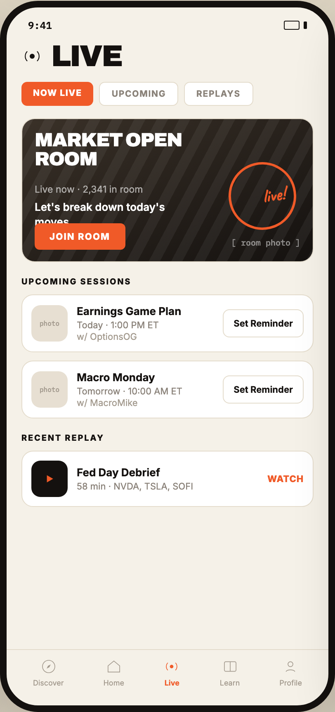

# 07 LIVE ROOMS

Canvas: **CHEAT CODE CLUB — FTA-DASHBOARD** · board index 6 · slug `07-live-rooms`
Frame: **406×860px** (design width 406px — port at 390px logical, scale ratios).

> Style values are EXACT computed values from the canvas. `T.*` = canvas token, resolved in
> the Tokens appendix at the bottom of this file. Text marked `(MOCK)` must not ship as drawn —
> see `../../DELTA.md` for its substitution rule.

## Tree

- **“9:41 LIVE NOW LIVE UPCOMING REPLAYS MARK…”** → `
`
  - box: 406x860 · display: flex · dir: column · width: 390px · height: 844px · bg: T.amber-50 · border: 8px solid T.orange-900 · radius: 46px (T.r17) · shadow: T.orange-900a20 0px 28px 66px 0px · overflow: hidden · type: color T.neutral-950 / Inter / 16px / w400 / lh normal
  - **“9:41…”** → `
`
    - box: 390x31 · display: flex · align: center · justify: space-between · pad: 14px 26px 2px 26px · type: color T.orange-900 / IBM Plex Mono / 12px / w600
    - **"9:41"** → ``
      - box: 28.8x15 · scale: T.ty42
      - text: "9:41"
    - **block[1]** → ``
      - box: 28x11 · display: flex · align: center · gap: 5px
      - **block[0]** → ``
        - box: 19x11 · width: 17px · height: 9px · border: 1px solid T.orange-900 · radius: 2px (T.r2)
      - **block[1]** → ``
        - box: 4x9 · width: 4px · height: 9px · bg: T.orange-900 · radius: 1px (T.r1)
  - **“LIVE…”** → `
`
    - box: 390x44.4 · display: flex · align: center · gap: 10px · pad: 12px 18px 0px 18px
    - **svg** → `<svg>`
      - box: 26x26 · overflow: hidden
      - svg: `<svg data-dc-tpl="560" width="26" height="26" viewBox="0 0 24 24"><circle data-dc-tpl="561" cx="12" cy="12" r="2.8" fill="#14110F"></circle><path data-dc-tpl="562" d="M6.5 6.6a7.6 7.6 0 0 0 0 10.8M17.5 6.6a7.6 7.6 0 0 1 0 10.8" fill="none" stroke="#14110F" strokewidth="2" strokelinecap="round"></pat`
      - **block[0]** → `<circle>`
        - box: 6.1x6.1 · display: inline
      - **block[1]** → `<path>`
        - box: 16.8x11.7 · display: inline
    - **"Live"** → `<h2>`
      - box: 85.5x32.4 · type: color T.orange-900 / Archivo / 36px / w900 / ls -1.44px / lh 32.4px / uppercase · scale: T.ty1
      - text: "Live"
  - **“NOW LIVE UPCOMING REPLAYS…”** → `
`
    - box: 390x44 · display: flex · gap: 7px · pad: 15px 18px 0px 18px
    - **"Now live"** → ``
      - box: 87.4x29 · pad: 7px 14px 7px 14px · bg: T.orange-400 · radius: 7px (T.r7) · type: color T.neutral-0 / 10.5px / w800 / ls 0.84px / uppercase · scale: T.ty66
      - text: "Now live"
    - **"Upcoming"** → ``
      - box: 95.7x29 · pad: 7px 14px 7px 14px · bg: T.neutral-0 · border: 1px solid T.amber-100 · radius: 7px (T.r7) · type: color T.neutral-400 / 10.5px / w700 / ls 0.84px / uppercase · scale: T.ty65
      - text: "Upcoming"
    - **"Replays"** → ``
      - box: 83.5x29 · pad: 7px 14px 7px 14px · bg: T.neutral-0 · border: 1px solid T.amber-100 · radius: 7px (T.r7) · type: color T.neutral-400 / 10.5px / w700 / ls 0.84px / uppercase · scale: T.ty65
      - text: "Replays"
  - **“MARKET OPEN ROOM Live now · 2,341 in roo…”** → `
`
    - box: 390x656.6 · display: flex · dir: column · gap: 17px · flex: 1 1 0% · flex-grow: 1 · flex-basis: 0% · pad: 15px 18px 0px 18px · overflow: hidden
    - **“MARKET OPEN ROOM Live now · 2,341 in roo…”** → `
`
      - box: 354x174 · flex-shrink: 0 · bg: T.neutral-0 · border: 1px solid T.amber-100 · radius: 16px (T.r16) · overflow: hidden
      - **“MARKET OPEN ROOM Live now · 2,341 in roo…”** → `
`
        - box: 352x172 · height: 172px · bg-image: linear-gradient(155deg, T.orange-800-b, T.orange-900) · overflow: hidden · position: relative [0px 0px 0px 0px]
        - **block[0]** → `
`
          - box: 352x172 · bg-image: repeating-linear-gradient(118deg, T.neutral-0a06 0px, T.neutral-0a06 12px, T.neutral-950a00 12px, T.neutral-950a00 24px) · position: absolute [0px 0px 0px 0px]
        - **"Market openroom"** → `
`
          - box: 178.6x46 · position: absolute [14px 158.391px 112px 15px] · type: color T.neutral-0 / Archivo / 23px / w900 / ls -0.69px / lh 23px / uppercase · scale: T.ty7
          - text: "Market openroom"
          - **block[0]** → ` `
            - box: 0x25 · display: inline
        - **"Live now · 2,341 in room"** **(MOCK)** → `
`
          - box: 131.2x14 · position: absolute [78px 205.797px 80px 15px] · type: color T.neutral-0a62 / 11.5px · scale: T.ty51
          - text: "Live now · 2,341 in room"
        - **"Let's break down today's moves"** → `
`
          - box: 200x35.1 · max-width: 200px · position: absolute [98px 137px 38.9062px 15px] · type: color T.neutral-0 / 13px / w600 / lh 17.55px · scale: T.ty36
          - text: "Let's break down today's moves"
        - **block[4]** → `
`
          - box: 99.4x99.4 · width: 76px · height: 76px · border: 3px solid T.orange-400 · radius: 50% (T.r18) · transform: matrix(0.970296, -0.241922, 0.241922, 0.970296, 0, 0) · position: absolute [52px 20px 38px 250px]
        - **"live!"** → `
`
          - box: 31.1x31.6 · transform: matrix(0.990268, -0.139173, 0.139173, 0.990268, 0, 0) · position: absolute [78px 34px 66px 290.516px] · type: color T.orange-400 / Caveat / 22px / w700 · scale: T.ty9
          - text: "live!"
        - **"Join room"** → `
`
          - box: 109.5x32 · pad: 9px 18px 9px 18px · bg: T.orange-400 · radius: 6px (T.r6) · position: absolute [126px 227.469px 14px 15px] · type: color T.neutral-0 / 11px / w800 / ls 1.1px / uppercase · scale: T.ty57
          - text: "Join room"
        - **"[ room photo ]"** → `
`
          - box: 84x13 · position: absolute [143px 15px 16px 253px] · type: color T.neutral-0a50 / IBM Plex Mono / 10px · scale: T.ty69
          - text: "[ room photo ]"
    - **“UPCOMING SESSIONS photo Earnings Game Pl…”** → `
`
      - box: 354x172 · flex-shrink: 0
      - **"Upcoming sessions"** → `
`
        - box: 354x12 · margin: 0px 0px 10px 0px · type: color T.orange-900 / 10px / w800 / ls 1.4px / uppercase · scale: T.ty68
        - text: "Upcoming sessions"
      - **“photo Earnings Game Plan Today · 1:00 PM…”** → `
`
        - box: 354x150 · display: flex · dir: column · gap: 10px
        - **“photo Earnings Game Plan Today · 1:00 PM…”** → `
`
          - box: 354x70 · display: flex · align: center · gap: 11px · pad: 11px 11px 11px 11px · bg: T.neutral-0 · border: 1px solid T.amber-100 · radius: 14px (T.r14)
          - **"photo"** → `
`
            - box: 44x44 · display: grid · align: center · justify-items: center · grid-cols: 44px · grid-rows: 44px · width: 44px · height: 44px · flex-shrink: 0 · bg: T.orange-100 · radius: 11px (T.r11) · type: color T.orange-400-b / IBM Plex Mono / 8px · scale: T.ty86
            - text: "photo"
          - **“Earnings Game Plan Today · 1:00 PM ET w/…”** → `
`
            - box: 166.1x46 · min-width: 0px · flex: 1 1 0% · flex-grow: 1 · flex-basis: 0%
            - **"Earnings Game Plan"** → `
`
              - box: 166.1x16 · type: color T.orange-900 / 13px / w700 · scale: T.ty27
              - text: "Earnings Game Plan"
            - **"Today · 1:00 PM ET"** → `
`
              - box: 166.1x14 · margin: 2px 0px 0px 0px · type: color T.neutral-400 / 11px · scale: T.ty53
              - text: "Today · 1:00 PM ET"
            - **"w/ OptionsOG"** → `
`
              - box: 166.1x14 · type: color T.orange-400-b / 11px · scale: T.ty53
              - text: "w/ OptionsOG"
          - **"Set Reminder"** → ``
            - box: 97.9x34 · pad: 9px 12px 9px 12px · border: 1px solid T.amber-100 · radius: 8px (T.r8) · type: color T.orange-900 / 11px / w700 / nowrap · scale: T.ty55
            - text: "Set Reminder"
        - **“photo Macro Monday Tomorrow · 10:00 AM E…”** → `
`
          - box: 354x70 · display: flex · align: center · gap: 11px · pad: 11px 11px 11px 11px · bg: T.neutral-0 · border: 1px solid T.amber-100 · radius: 14px (T.r14)
          - **"photo"** → `
`
            - box: 44x44 · display: grid · align: center · justify-items: center · grid-cols: 44px · grid-rows: 44px · width: 44px · height: 44px · flex-shrink: 0 · bg: T.orange-100 · radius: 11px (T.r11) · type: color T.orange-400-b / IBM Plex Mono / 8px · scale: T.ty86
            - text: "photo"
          - **“Macro Monday Tomorrow · 10:00 AM ET w/ M…”** → `
`
            - box: 166.1x46 · min-width: 0px · flex: 1 1 0% · flex-grow: 1 · flex-basis: 0%
            - **"Macro Monday"** → `
`
              - box: 166.1x16 · type: color T.orange-900 / 13px / w700 · scale: T.ty27
              - text: "Macro Monday"
            - **"Tomorrow · 10:00 AM ET"** → `
`
              - box: 166.1x14 · margin: 2px 0px 0px 0px · type: color T.neutral-400 / 11px · scale: T.ty53
              - text: "Tomorrow · 10:00 AM ET"
            - **"w/ MacroMike"** → `
`
              - box: 166.1x14 · type: color T.orange-400-b / 11px · scale: T.ty53
              - text: "w/ MacroMike"
          - **"Set Reminder"** → ``
            - box: 97.9x34 · pad: 9px 12px 9px 12px · border: 1px solid T.amber-100 · radius: 8px (T.r8) · type: color T.orange-900 / 11px / w700 / nowrap · scale: T.ty55
            - text: "Set Reminder"
    - **“RECENT REPLAY Fed Day Debrief 58 min · N…”** → `
`
      - box: 354x90 · flex-shrink: 0
      - **"Recent replay"** → `
`
        - box: 354x12 · margin: 0px 0px 10px 0px · type: color T.orange-900 / 10px / w800 / ls 1.4px / uppercase · scale: T.ty68
        - text: "Recent replay"
      - **“Fed Day Debrief 58 min · NVDA, TSLA, SOF…”** → `
`
        - box: 354x68 · display: flex · align: center · gap: 11px · pad: 11px 11px 11px 11px · bg: T.neutral-0 · border: 1px solid T.amber-100 · radius: 14px (T.r14)
        - **block[0]** → `
`
          - box: 44x44 · display: grid · align: center · justify-items: center · grid-cols: 44px · grid-rows: 44px · width: 44px · height: 44px · flex-shrink: 0 · bg: T.orange-900 · radius: 11px (T.r11)
          - **svg** → `<svg>`
            - box: 16x16 · overflow: hidden
            - svg: `<svg data-dc-tpl="601" width="16" height="16" viewBox="0 0 20 20"><path data-dc-tpl="602" d="M6 4.5 15.5 10 6 15.5Z" fill="#F05A28"></path></svg>`
            - **block[0]** → `<path>`
              - box: 7.6x8.8 · display: inline
        - **“Fed Day Debrief 58 min · NVDA, TSLA, SOF…”** → `
`
          - box: 220x32 · min-width: 0px · flex: 1 1 0% · flex-grow: 1 · flex-basis: 0%
          - **"Fed Day Debrief"** → `
`
            - box: 220x16 · type: color T.orange-900 / 13px / w700 · scale: T.ty27
            - text: "Fed Day Debrief"
          - **"58 min · NVDA, TSLA, SOFI"** → `
`
            - box: 220x14 · margin: 2px 0px 0px 0px · type: color T.neutral-400 / 11px · scale: T.ty53
            - text: "58 min · NVDA, TSLA, SOFI"
        - **"WATCH"** → ``
          - box: 44x14 · type: color T.orange-400 / 11px / w800 / ls 0.44px · scale: T.ty58
          - text: "WATCH"
  - **“Discover Home Live Learn Profile…”** → `
`
    - box: 390x68 · display: flex · align: center · justify: space-around · pad: 10px 8px 22px 8px · border: T:1px solid T.amber-100 R:0px none T.neutral-950 B:0px none T.neutral-950 L:0px none T.neutral-950
    - **“Discover…”** → `
`
      - box: 37.3x35 · display: flex · dir: column · align: center · gap: 4px
      - **svg** → `<svg>`
        - box: 20x20 · overflow: hidden
        - svg: `<svg data-dc-tpl="609" width="20" height="20" viewBox="0 0 24 24"><circle data-dc-tpl="610" cx="12" cy="12" r="9" fill="none" stroke="#A39A8E" strokewidth="1.9"></circle><path data-dc-tpl="611" d="M15 9 13 13l-4 2 2-4Z" fill="#A39A8E"></path></svg>`
        - **block[0]** → `<circle>`
          - box: 15x15 · display: inline
        - **block[1]** → `<path>`
          - box: 5x5 · display: inline
      - **"Discover"** → ``
        - box: 37.3x11 · type: color T.orange-400-b / 9px · scale: T.ty79
        - text: "Discover"
    - **“Home…”** → `
`
      - box: 25.2x35 · display: flex · dir: column · align: center · gap: 4px
      - **svg** → `<svg>`
        - box: 20x20 · overflow: hidden
        - svg: `<svg data-dc-tpl="614" width="20" height="20" viewBox="0 0 24 24"><path data-dc-tpl="615" d="M3.5 11 12 4l8.5 7v9h-17Z" fill="none" stroke="#A39A8E" strokewidth="1.9" strokelinejoin="round"></path></svg>`
        - **block[0]** → `<path>`
          - box: 14.2x13.3 · display: inline
      - **"Home"** → ``
        - box: 25.2x11 · type: color T.orange-400-b / 9px · scale: T.ty79
        - text: "Home"
    - **“Live…”** → `
`
      - box: 20x35 · display: flex · dir: column · align: center · gap: 4px
      - **svg** → `<svg>`
        - box: 20x20 · overflow: hidden
        - svg: `<svg data-dc-tpl="618" width="20" height="20" viewBox="0 0 24 24"><circle data-dc-tpl="619" cx="12" cy="12" r="2.6" fill="#F05A28"></circle><path data-dc-tpl="620" d="M6.5 6.6a7.6 7.6 0 0 0 0 10.8M17.5 6.6a7.6 7.6 0 0 1 0 10.8" fill="none" stroke="#F05A28" strokewidth="2" strokelinecap="round"></pat`
        - **block[0]** → `<circle>`
          - box: 4.3x4.3 · display: inline
        - **block[1]** → `<path>`
          - box: 12.9x9 · display: inline
      - **"Live"** → ``
        - box: 18.1x11 · type: color T.orange-400 / 9px / w700 · scale: T.ty80
        - text: "Live"
    - **“Learn…”** → `
`
      - box: 24.3x35 · display: flex · dir: column · align: center · gap: 4px
      - **svg** → `<svg>`
        - box: 20x20 · overflow: hidden
        - svg: `<svg data-dc-tpl="623" width="20" height="20" viewBox="0 0 24 24"><rect data-dc-tpl="624" x="3.5" y="5" width="17" height="14" rx="2" fill="none" stroke="#A39A8E" strokewidth="1.9"></rect><path data-dc-tpl="625" d="M12 5v14" stroke="#A39A8E" strokewidth="1.9"></path></svg>`
        - **block[0]** → `<rect>`
          - box: 14.2x11.7 · display: inline
        - **block[1]** → `<path>`
          - box: 0x11.7 · display: inline
      - **"Learn"** → ``
        - box: 24.3x11 · type: color T.orange-400-b / 9px · scale: T.ty79
        - text: "Learn"
    - **“Profile…”** → `
`
      - box: 27.3x35 · display: flex · dir: column · align: center · gap: 4px
      - **svg** → `<svg>`
        - box: 20x20 · overflow: hidden
        - svg: `<svg data-dc-tpl="628" width="20" height="20" viewBox="0 0 24 24"><circle data-dc-tpl="629" cx="12" cy="8.6" r="3.6" fill="none" stroke="#A39A8E" strokewidth="1.9"></circle><path data-dc-tpl="630" d="M5.5 19.4c1.5-3.4 11.5-3.4 13 0" fill="none" stroke="#A39A8E" strokewidth="1.9" strokelinecap="round`
        - **block[0]** → `<circle>`
          - box: 6x6 · display: inline
        - **block[1]** → `<path>`
          - box: 10.8x2.1 · display: inline
      - **"Profile"** → ``
        - box: 27.3x11 · type: color T.orange-400-b / 9px · scale: T.ty79
        - text: "Profile"

## Tokens used in this board

| token | value | role |
| --- | --- | --- |
| T.orange-900 | `#14110F` | border, text, bg, gradient |
| T.neutral-0 | `#FFFFFF` | bg, text, border |
| T.orange-400 | `#F05A28` | border, text, bg, gradient |
| T.neutral-400 | `#8A8279` | text, border |
| T.amber-100 | `#E4DCCC` | border, bg |
| T.orange-400-b | `#A39A8E` | text, bg |
| T.neutral-950 | `#000000` | border, text |
| T.orange-100 | `#E7DFD2` | bg |
| T.amber-50 | `#F5F1E8` | bg, border |
| T.orange-900a20 | `#14110F/0.2` | shadow |
| T.neutral-950a00 | `#000000/0` | gradient |
| T.neutral-0a62 | `#FFFFFF/0.62` | text |
| T.neutral-0a06 | `#FFFFFF/0.055` | gradient |
| T.orange-800-b | `#3A3128` | gradient |
| T.neutral-0a50 | `#FFFFFF/0.5` | text |
| T.ty1 | Archivo 36px/32.4px w900 ls:-1.44px uppercase | type scale |
| T.ty7 | Archivo 23px/23px w900 ls:-0.69px uppercase | type scale |
| T.ty9 | Caveat 22px/normal w700 ls:normal | type scale |
| T.ty27 | Inter 13px/normal w700 ls:normal | type scale |
| T.ty36 | Inter 13px/17.55px w600 ls:normal | type scale |
| T.ty42 | IBM Plex Mono 12px/normal w600 ls:normal | type scale |
| T.ty51 | Inter 11.5px/normal w400 ls:normal | type scale |
| T.ty53 | Inter 11px/normal w400 ls:normal | type scale |
| T.ty55 | Inter 11px/normal w700 ls:normal | type scale |
| T.ty57 | Inter 11px/normal w800 ls:1.1px uppercase | type scale |
| T.ty58 | Inter 11px/normal w800 ls:0.44px | type scale |
| T.ty65 | Inter 10.5px/normal w700 ls:0.84px uppercase | type scale |
| T.ty66 | Inter 10.5px/normal w800 ls:0.84px uppercase | type scale |
| T.ty68 | Inter 10px/normal w800 ls:1.4px uppercase | type scale |
| T.ty69 | IBM Plex Mono 10px/normal w400 ls:normal | type scale |
| T.ty79 | Inter 9px/normal w400 ls:normal | type scale |
| T.ty80 | Inter 9px/normal w700 ls:normal | type scale |
| T.ty86 | IBM Plex Mono 8px/normal w400 ls:normal | type scale |
| T.r1 | `1px` | radius |
| T.r2 | `2px` | radius |
| T.r6 | `6px` | radius |
| T.r7 | `7px` | radius |
| T.r8 | `8px` | radius |
| T.r11 | `11px` | radius |
| T.r14 | `14px` | radius |
| T.r16 | `16px` | radius |
| T.r17 | `46px` | radius |
| T.r18 | `50%` | radius |
