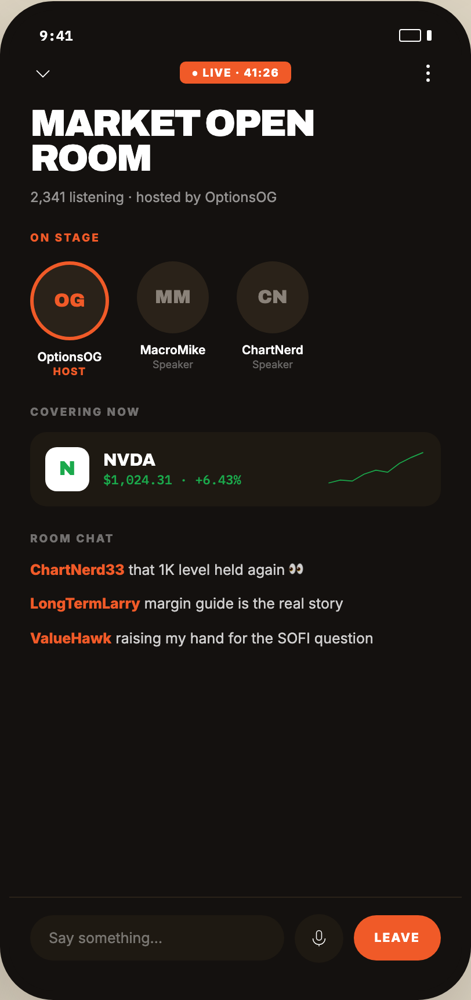

# 08 IN THE ROOM

Canvas: **CHEAT CODE CLUB — FTA-DASHBOARD** · board index 7 · slug `08-in-the-room`
Frame: **406×860px** (design width 406px — port at 390px logical, scale ratios).

> Style values are EXACT computed values from the canvas. `T.*` = canvas token, resolved in
> the Tokens appendix at the bottom of this file. Text marked `(MOCK)` must not ship as drawn —
> see `../../DELTA.md` for its substitution rule.

## Tree

- **“9:41 ● LIVE · 41:26 MARKET OPEN ROOM 2,3…”** → `
`
  - box: 406x860 · display: flex · dir: column · width: 390px · height: 844px · bg: T.orange-900 · border: 8px solid T.orange-900 · radius: 46px (T.r17) · shadow: T.orange-900a20 0px 28px 66px 0px · overflow: hidden · type: color T.neutral-950 / Inter / 16px / w400 / lh normal
  - **“9:41…”** → `
`
    - box: 390x31 · display: flex · align: center · justify: space-between · pad: 14px 26px 2px 26px · type: color T.neutral-0 / IBM Plex Mono / 12px / w600
    - **"9:41"** → ``
      - box: 28.8x15 · scale: T.ty42
      - text: "9:41"
    - **block[1]** → ``
      - box: 28x11 · display: flex · align: center · gap: 5px
      - **block[0]** → ``
        - box: 19x11 · width: 17px · height: 9px · border: 1px solid T.neutral-0 · radius: 2px (T.r2)
      - **block[1]** → ``
        - box: 4x9 · width: 4px · height: 9px · bg: T.neutral-0 · radius: 1px (T.r1)
  - **“● LIVE · 41:26…”** → `
`
    - box: 390x34 · display: flex · align: center · justify: space-between · pad: 12px 18px 0px 18px
    - **svg** → `<svg>`
      - box: 22x22 · overflow: hidden
      - svg: `<svg data-dc-tpl="643" width="22" height="22" viewBox="0 0 24 24"><path data-dc-tpl="644" d="M6 9.5 12 15.5 18 9.5" fill="none" stroke="#fff" strokewidth="2.2" strokelinecap="round" strokelinejoin="round"></path></svg>`
      - **block[0]** → `<path>`
        - box: 11x5.5 · display: inline
    - **"● LIVE · 41:26"** → `
`
      - box: 95.8x19 · display: flex · align: center · gap: 6px · pad: 4px 10px 4px 10px · bg: T.orange-400 · radius: 5px (T.r5) · type: color T.neutral-0 / 9.5px / w800 / ls 0.95px · scale: T.ty78
      - text: "● LIVE · 41:26"
    - **svg** → `<svg>`
      - box: 22x22 · overflow: hidden
      - svg: `<svg data-dc-tpl="646" width="22" height="22" viewBox="0 0 24 24"><circle data-dc-tpl="647" cx="12" cy="5.5" r="1.6" fill="#fff"></circle><circle data-dc-tpl="648" cx="12" cy="12" r="1.6" fill="#fff"></circle><circle data-dc-tpl="649" cx="12" cy="18.5" r="1.6" fill="#fff"></circle></svg>`
      - **block[0]** → `<circle>`
        - box: 2.9x2.9 · display: inline
      - **block[1]** → `<circle>`
        - box: 2.9x2.9 · display: inline
      - **block[2]** → `<circle>`
        - box: 2.9x2.9 · display: inline
  - **“MARKET OPEN ROOM 2,341 listening · hoste…”** → `
`
    - box: 390x103.2 · pad: 18px 18px 0px 18px
    - **"Market openroom"** → `<h2>`
      - box: 354x60.2 · type: color T.neutral-0 / Archivo / 32px / w900 / ls -1.28px / lh 30.08px / uppercase · scale: T.ty2
      - text: "Market openroom"
      - **block[0]** → ` `
        - box: 0x35 · display: inline
    - **"2,341 listening · hosted by OptionsOG"** **(MOCK)** → `
`
      - box: 354x15 · margin: 10px 0px 0px 0px · type: color T.neutral-0a55 / 12px · scale: T.ty43
      - text: "2,341 listening · hosted by OptionsOG"
  - **“ON STAGE OG OptionsOG HOST MM MacroMike …”** → `
`
    - box: 390x148 · pad: 22px 18px 0px 18px
    - **"On stage"** → `
`
      - box: 354x11 · margin: 0px 0px 15px 0px · type: color T.orange-400 / 9.5px / w800 / ls 1.52px / uppercase · scale: T.ty75
      - text: "On stage"
    - **“OG OptionsOG HOST MM MacroMike Speaker C…”** → `
`
      - box: 354x100 · display: flex · gap: 24px
      - **“OG OptionsOG HOST…”** → `
`
        - box: 68x100 · type: align-center
        - **“OG…”** → `
`
          - box: 68x68 · width: 62px · height: 62px · pad: 3px 3px 3px 3px · bg: T.orange-400 · radius: 50% (T.r18)
          - **"OG"** → `
`
            - box: 62x62 · display: grid · align: center · justify-items: center · grid-cols: 62px · grid-rows: 62px · width: 100% · height: 100% · bg: T.orange-850 · radius: 50% (T.r18) · type: color T.orange-400 / Archivo / w900 · scale: T.ty18
            - text: "OG"
        - **"OptionsOG"** → `
`
          - box: 68x13 · margin: 8px 0px 0px 0px · type: color T.neutral-0 / 10.5px / w600 · scale: T.ty64
          - text: "OptionsOG"
        - **"HOST"** → `
`
          - box: 68x11 · type: color T.orange-400 / 9px / w800 / ls 0.72px · scale: T.ty81
          - text: "HOST"
      - **“MM MacroMike Speaker…”** → `
`
        - box: 62x100 · type: align-center
        - **"MM"** → `
`
          - box: 62x62 · display: grid · align: center · justify-items: center · grid-cols: 62px · grid-rows: 62px · width: 62px · height: 62px · bg: T.orange-850 · radius: 50% (T.r18) · type: color T.neutral-400 / Archivo / w900 · scale: T.ty18
          - text: "MM"
        - **"MacroMike"** → `
`
          - box: 62x13 · margin: 8px 0px 0px 0px · type: color T.neutral-0 / 10.5px / w600 · scale: T.ty64
          - text: "MacroMike"
        - **"Speaker"** → `
`
          - box: 62x11 · type: color T.neutral-0a36 / 9px · scale: T.ty79
          - text: "Speaker"
      - **“CN ChartNerd Speaker…”** → `
`
        - box: 62x100 · type: align-center
        - **"CN"** → `
`
          - box: 62x62 · display: grid · align: center · justify-items: center · grid-cols: 62px · grid-rows: 62px · width: 62px · height: 62px · bg: T.orange-850 · radius: 50% (T.r18) · type: color T.neutral-400 / Archivo / w900 · scale: T.ty18
          - text: "CN"
        - **"ChartNerd"** → `
`
          - box: 62x13 · margin: 8px 0px 0px 0px · type: color T.neutral-0 / 10.5px / w600 · scale: T.ty64
          - text: "ChartNerd"
        - **"Speaker"** → `
`
          - box: 62x11 · type: color T.neutral-0a36 / 9px · scale: T.ty79
          - text: "Speaker"
  - **“COVERING NOW N NVDA $1,024.31 · +6.43%…”** → `
`
    - box: 390x111 · pad: 24px 18px 0px 18px
    - **"Covering now"** → `
`
      - box: 354x11 · margin: 0px 0px 12px 0px · type: color T.neutral-0a40 / 9.5px / w800 / ls 1.52px / uppercase · scale: T.ty75
      - text: "Covering now"
    - **“N NVDA $1,024.31 · +6.43%…”** → `
`
      - box: 354x64 · display: flex · align: center · gap: 12px · pad: 13px 13px 13px 13px · bg: T.orange-900-b · radius: 14px (T.r14)
      - **"N"** → ``
        - box: 38x38 · display: grid · align: center · justify-items: center · grid-cols: 38px · grid-rows: 38px · width: 38px · height: 38px · bg: T.neutral-0 · radius: 10px (T.r10) · type: color T.green-600 / Archivo / 17px / w900 · scale: T.ty17
        - text: "N"
      - **“NVDA $1,024.31 · +6.43%…”** → `
`
        - box: 180x32 · flex: 1 1 0% · flex-grow: 1 · flex-basis: 0%
        - **"NVDA"** → `
`
          - box: 180x16 · type: color T.neutral-0 / Archivo / 15px / w800 · scale: T.ty22
          - text: "NVDA"
        - **"$1,024.31 · +6.43%"** **(MOCK)** → `
`
          - box: 180x14 · margin: 2px 0px 0px 0px · type: color T.green-600 / IBM Plex Mono / 11px · scale: T.ty59
          - text: "$1,024.31 · +6.43%"
      - **svg** → `<svg>`
        - box: 86x34 · overflow: hidden
        - svg: `<svg data-dc-tpl="677" width="86" height="34" viewBox="0 0 100 40"><polyline data-dc-tpl="678" points="2,34 14,31 26,32 38,25 50,21 62,23 74,14 86,8 98,3" fill="none" stroke="#1BA94C" strokewidth="3" strokelinecap="round" strokelinejoin="round"></polyline></svg>`
        - **block[0]** → `<polyline>`
          - box: 81.6x26.3 · display: inline
  - **“ROOM CHAT ChartNerd33 that 1K level held…”** → `
`
    - box: 390x335.8 · flex: 1 1 0% · flex-grow: 1 · flex-basis: 0% · pad: 22px 18px 0px 18px · overflow: hidden
    - **"Room chat"** → `
`
      - box: 354x11 · margin: 0px 0px 13px 0px · type: color T.neutral-0a40 / 9.5px / w800 / ls 1.52px / uppercase · scale: T.ty75
      - text: "Room chat"
    - **“ChartNerd33 that 1K level held again 👀 …”** → `
`
      - box: 354x76.5 · display: flex · dir: column · gap: 12px
      - **"that 1K level held again 👀"** → `
`
        - box: 354x17.5 · type: color T.neutral-0a80 / 12.5px / lh 17.5px · scale: T.ty39
        - text: "that 1K level held again 👀"
        - **"ChartNerd33"** → ``
          - box: 81.3x15 · display: inline · type: color T.orange-400 / w800 · scale: T.ty40
          - text: "ChartNerd33"
      - **"margin guide is the real story"** → `
`
        - box: 354x17.5 · type: color T.neutral-0a80 / 12.5px / lh 17.5px · scale: T.ty39
        - text: "margin guide is the real story"
        - **"LongTermLarry"** → ``
          - box: 94.9x15 · display: inline · type: color T.orange-400 / w800 · scale: T.ty40
          - text: "LongTermLarry"
      - **"raising my hand for the SOFI question"** → `
`
        - box: 354x17.5 · type: color T.neutral-0a80 / 12.5px / lh 17.5px · scale: T.ty39
        - text: "raising my hand for the SOFI question"
        - **"ValueHawk"** → ``
          - box: 70.1x15 · display: inline · type: color T.orange-400 / w800 · scale: T.ty40
          - text: "ValueHawk"
  - **“Say something… LEAVE…”** → `
`
    - box: 390x81 · display: flex · align: center · gap: 9px · pad: 14px 18px 24px 18px · border: T:1px solid T.orange-850 R:0px none T.neutral-950 B:0px none T.neutral-950 L:0px none T.neutral-950
    - **"Say something…"** → `
`
      - box: 218.7x39 · flex: 1 1 0% · flex-grow: 1 · flex-basis: 0% · pad: 12px 16px 12px 16px · bg: T.orange-900-b · radius: 999px (T.r19) · type: color T.neutral-0a40 / 12.5px · scale: T.ty38
      - text: "Say something…"
    - **block[1]** → ``
      - box: 42x42 · display: grid · align: center · justify-items: center · grid-cols: 42px · grid-rows: 42px · width: 42px · height: 42px · flex-shrink: 0 · bg: T.orange-900-b · radius: 50% (T.r18)
      - **svg** → `<svg>`
        - box: 18x18 · overflow: hidden
        - svg: `<svg data-dc-tpl="691" width="18" height="18" viewBox="0 0 24 24"><rect data-dc-tpl="692" x="9" y="3" width="6" height="11" rx="3" fill="none" stroke="#fff" strokewidth="2"></rect><path data-dc-tpl="693" d="M5 12a7 7 0 0 0 14 0M12 19v2" fill="none" stroke="#fff" strokewidth="2" strokelinecap="round"`
        - **block[0]** → `<rect>`
          - box: 4.5x8.3 · display: inline
        - **block[1]** → `<path>`
          - box: 10.5x6.8 · display: inline
    - **"Leave"** → ``
      - box: 75.3x39 · flex-shrink: 0 · pad: 13px 18px 13px 18px · bg: T.orange-400 · radius: 999px (T.r19) · type: color T.neutral-0 / 10.5px / w800 / ls 1.05px / uppercase · scale: T.ty67
      - text: "Leave"

## Tokens used in this board

| token | value | role |
| --- | --- | --- |
| T.orange-900 | `#14110F` | border, text, bg, gradient |
| T.neutral-0 | `#FFFFFF` | bg, text, border |
| T.orange-400 | `#F05A28` | border, text, bg, gradient |
| T.neutral-400 | `#8A8279` | text, border |
| T.neutral-950 | `#000000` | border, text |
| T.green-600 | `#1BA94C` | bg, text |
| T.orange-900a20 | `#14110F/0.2` | shadow |
| T.orange-850 | `#2A2219` | bg, border |
| T.neutral-0a40 | `#FFFFFF/0.4` | text |
| T.orange-900-b | `#1E1912` | bg |
| T.neutral-0a80 | `#FFFFFF/0.8` | text |
| T.neutral-0a36 | `#FFFFFF/0.36` | text |
| T.neutral-0a55 | `#FFFFFF/0.55` | text |
| T.ty2 | Archivo 32px/30.08px w900 ls:-1.28px uppercase | type scale |
| T.ty17 | Archivo 17px/normal w900 ls:normal | type scale |
| T.ty18 | Archivo 16px/normal w900 ls:normal | type scale |
| T.ty22 | Archivo 15px/normal w800 ls:normal | type scale |
| T.ty38 | Inter 12.5px/normal w400 ls:normal | type scale |
| T.ty39 | Inter 12.5px/17.5px w400 ls:normal | type scale |
| T.ty40 | Inter 12.5px/17.5px w800 ls:normal | type scale |
| T.ty42 | IBM Plex Mono 12px/normal w600 ls:normal | type scale |
| T.ty43 | Inter 12px/normal w400 ls:normal | type scale |
| T.ty59 | IBM Plex Mono 11px/normal w400 ls:normal | type scale |
| T.ty64 | Inter 10.5px/normal w600 ls:normal | type scale |
| T.ty67 | Inter 10.5px/normal w800 ls:1.05px uppercase | type scale |
| T.ty75 | Inter 9.5px/normal w800 ls:1.52px uppercase | type scale |
| T.ty78 | Inter 9.5px/normal w800 ls:0.95px | type scale |
| T.ty79 | Inter 9px/normal w400 ls:normal | type scale |
| T.ty81 | Inter 9px/normal w800 ls:0.72px | type scale |
| T.r1 | `1px` | radius |
| T.r2 | `2px` | radius |
| T.r5 | `5px` | radius |
| T.r10 | `10px` | radius |
| T.r14 | `14px` | radius |
| T.r17 | `46px` | radius |
| T.r18 | `50%` | radius |
| T.r19 | `999px` | radius |
