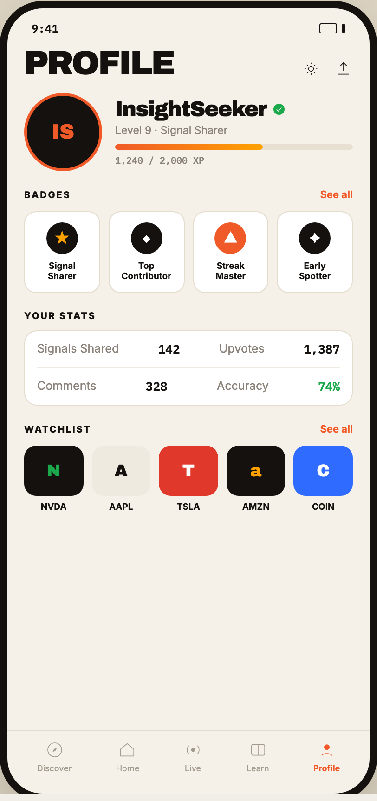

# 09 MEMBER PROFILE

Canvas: **CHEAT CODE CLUB — FTA-DASHBOARD** · board index 8 · slug `09-member-profile`
Frame: **406×860px** (design width 406px — port at 390px logical, scale ratios).

> Style values are EXACT computed values from the canvas. `T.*` = canvas token, resolved in
> the Tokens appendix at the bottom of this file. Text marked `(MOCK)` must not ship as drawn —
> see `../../DELTA.md` for its substitution rule.

## Tree

- **“9:41 PROFILE IS InsightSeeker Level 9 · …”** → `
`
  - box: 406x860 · display: flex · dir: column · width: 390px · height: 844px · bg: T.amber-50 · border: 8px solid T.orange-900 · radius: 46px (T.r17) · shadow: T.orange-900a20 0px 28px 66px 0px · overflow: hidden · type: color T.neutral-950 / Inter / 16px / w400 / lh normal
  - **“9:41…”** → `
`
    - box: 390x31 · display: flex · align: center · justify: space-between · pad: 14px 26px 2px 26px · type: color T.orange-900 / IBM Plex Mono / 12px / w600
    - **"9:41"** → ``
      - box: 28.8x15 · scale: T.ty42
      - text: "9:41"
    - **block[1]** → ``
      - box: 28x11 · display: flex · align: center · gap: 5px
      - **block[0]** → ``
        - box: 19x11 · width: 17px · height: 9px · border: 1px solid T.orange-900 · radius: 2px (T.r2)
      - **block[1]** → ``
        - box: 4x9 · width: 4px · height: 9px · bg: T.orange-900 · radius: 1px (T.r1)
  - **“PROFILE…”** → `
`
    - box: 390x44.4 · display: flex · align: flex-end · justify: space-between · pad: 12px 18px 0px 18px
    - **"Profile"** → `<h2>`
      - box: 161.2x32.4 · type: color T.orange-900 / Archivo / 36px / w900 / ls -1.44px / lh 32.4px / uppercase · scale: T.ty1
      - text: "Profile"
    - **block[1]** → `
`
      - box: 55x20 · display: flex · gap: 15px
      - **svg** → `<svg>`
        - box: 20x20 · overflow: hidden
        - svg: `<svg data-dc-tpl="708" width="20" height="20" viewBox="0 0 24 24"><circle data-dc-tpl="709" cx="12" cy="12" r="3.2" fill="none" stroke="#14110F" strokewidth="1.9"></circle><path data-dc-tpl="710" d="M12 4v2M12 18v2M4 12h2M18 12h2M6.5 6.5 8 8M16 16l1.5 1.5M17.5 6.5 16 8M8 16l-1.5 1.5" stroke="#14110F`
        - **block[0]** → `<circle>`
          - box: 5.3x5.3 · display: inline
        - **block[1]** → `<path>`
          - box: 13.3x13.3 · display: inline
      - **svg** → `<svg>`
        - box: 20x20 · overflow: hidden
        - svg: `<svg data-dc-tpl="711" width="20" height="20" viewBox="0 0 24 24"><path data-dc-tpl="712" d="M12 4v11M8 8l4-4 4 4M5 19h14" fill="none" stroke="#14110F" strokewidth="1.9" strokelinecap="round" strokelinejoin="round"></path></svg>`
        - **block[0]** → `<path>`
          - box: 11.7x12.5 · display: inline
  - **“IS InsightSeeker Level 9 · Signal Sharer…”** → `
`
    - box: 390x100 · display: flex · align: center · gap: 14px · pad: 16px 18px 0px 18px
    - **“IS…”** → `
`
      - box: 84x84 · width: 78px · height: 78px · flex-shrink: 0 · pad: 3px 3px 3px 3px · bg: T.orange-400 · radius: 50% (T.r18)
      - **"IS"** → `
`
        - box: 78x78 · display: grid · align: center · justify-items: center · grid-cols: 78px · grid-rows: 78px · width: 100% · height: 100% · bg: T.orange-900 · radius: 50% (T.r18) · type: color T.orange-400 / Archivo / 22px / w900 · scale: T.ty10
        - text: "IS"
    - **“InsightSeeker Level 9 · Signal Sharer 1,…”** → `
`
      - box: 256x74 · min-width: 0px · flex: 1 1 0% · flex-grow: 1 · flex-basis: 0%
      - **“InsightSeeker…”** → `
`
        - box: 256x25 · display: flex · align: center · gap: 6px
        - **"InsightSeeker"** → ``
          - box: 163.1x25 · type: color T.orange-900 / Archivo / 23px / w900 / ls -0.805px · scale: T.ty8
          - text: "InsightSeeker"
        - **svg** → `<svg>`
          - box: 15x15 · flex-shrink: 0 · overflow: hidden
          - svg: `<svg data-dc-tpl="719" width="15" height="15" viewBox="0 0 20 20" style="flex-shrink: 0;"><circle data-dc-tpl="720" cx="10" cy="10" r="8" fill="#1BA94C"></circle><path data-dc-tpl="721" d="M6.5 10.2 9 12.6 13.6 7.6" fill="none" stroke="#fff" strokewidth="2" strokelinecap="round"></path></svg>`
          - **block[0]** → `<circle>`
            - box: 12x12 · display: inline
          - **block[1]** → `<path>`
            - box: 5.3x3.8 · display: inline
      - **"Level 9 · Signal Sharer"** → `
`
        - box: 256x14 · margin: 3px 0px 0px 0px · type: color T.neutral-400 / 11.5px · scale: T.ty51
        - text: "Level 9 · Signal Sharer"
      - **block[2]** → `
`
        - box: 256x6 · height: 6px · margin: 8px 0px 0px 0px · bg: T.orange-100 · radius: 4px (T.r4)
        - **block[0]** → `
`
          - box: 158.7x6 · width: 62% · height: 100% · bg-image: linear-gradient(90deg, T.orange-400, T.orange-400-c) · radius: 4px (T.r4)
      - **"1,240 / 2,000 XP"** **(MOCK)** → `
`
        - box: 256x13 · margin: 5px 0px 0px 0px · type: color T.neutral-400 / IBM Plex Mono / 10px · scale: T.ty69
        - text: "1,240 / 2,000 XP"
  - **“BADGES See all ★ Signal Sharer ◆ Top Con…”** → `
`
    - box: 390x130.8 · pad: 18px 18px 0px 18px
    - **“BADGES See all…”** → `
`
      - box: 354x14 · display: flex · align: center · justify: space-between · margin: 0px 0px 11px 0px
      - **"Badges"** → ``
        - box: 50.2x12 · type: color T.orange-900 / 10px / w800 / ls 1.4px / uppercase · scale: T.ty68
        - text: "Badges"
      - **"See all"** → ``
        - box: 35.3x14 · type: color T.orange-400 / 11px / w700 · scale: T.ty55
        - text: "See all"
    - **“★ Signal Sharer ◆ Top Contributor ▲ Stre…”** → `
`
      - box: 354x87.8 · display: flex · gap: 9px
      - **“★ Signal Sharer…”** → `
`
        - box: 81.8x87.8 · flex: 1 1 0% · flex-grow: 1 · flex-basis: 0% · pad: 11px 6px 11px 6px · bg: T.neutral-0 · border: 1px solid T.amber-100 · radius: 13px (T.r13) · type: align-center
        - **"★"** → `
`
          - box: 34x34 · display: grid · align: center · justify-items: center · grid-cols: 34px · grid-rows: 34px · width: 34px · height: 34px · margin: 0px 16.875px 0px 16.875px · bg: T.orange-900 · radius: 50% (T.r18) · type: color T.orange-400-c / 15px · scale: T.ty20
          - text: "★"
        - **"SignalSharer"** → `
`
          - box: 67.8x22.8 · margin: 7px 0px 0px 0px · type: color T.orange-900 / 9.5px / w700 / lh 11.4px · scale: T.ty74
          - text: "SignalSharer"
          - **block[0]** → ` `
            - box: 0x11 · display: inline
      - **“◆ Top Contributor…”** → `
`
        - box: 81.8x87.8 · flex: 1 1 0% · flex-grow: 1 · flex-basis: 0% · pad: 11px 6px 11px 6px · bg: T.neutral-0 · border: 1px solid T.amber-100 · radius: 13px (T.r13) · type: align-center
        - **"◆"** → `
`
          - box: 34x34 · display: grid · align: center · justify-items: center · grid-cols: 34px · grid-rows: 34px · width: 34px · height: 34px · margin: 0px 16.875px 0px 16.875px · bg: T.orange-900 · radius: 50% (T.r18) · type: color T.neutral-0 / 15px · scale: T.ty20
          - text: "◆"
        - **"TopContributor"** → `
`
          - box: 67.8x22.8 · margin: 7px 0px 0px 0px · type: color T.orange-900 / 9.5px / w700 / lh 11.4px · scale: T.ty74
          - text: "TopContributor"
          - **block[0]** → ` `
            - box: 0x11 · display: inline
      - **“▲ Streak Master…”** → `
`
        - box: 81.8x87.8 · flex: 1 1 0% · flex-grow: 1 · flex-basis: 0% · pad: 11px 6px 11px 6px · bg: T.neutral-0 · border: 1px solid T.amber-100 · radius: 13px (T.r13) · type: align-center
        - **"▲"** → `
`
          - box: 34x34 · display: grid · align: center · justify-items: center · grid-cols: 34px · grid-rows: 34px · width: 34px · height: 34px · margin: 0px 16.875px 0px 16.875px · bg: T.orange-400 · radius: 50% (T.r18) · type: color T.neutral-0 / 15px · scale: T.ty20
          - text: "▲"
        - **"StreakMaster"** → `
`
          - box: 67.8x22.8 · margin: 7px 0px 0px 0px · type: color T.orange-900 / 9.5px / w700 / lh 11.4px · scale: T.ty74
          - text: "StreakMaster"
          - **block[0]** → ` `
            - box: 0x11 · display: inline
      - **“✦ Early Spotter…”** → `
`
        - box: 81.8x87.8 · flex: 1 1 0% · flex-grow: 1 · flex-basis: 0% · pad: 11px 6px 11px 6px · bg: T.neutral-0 · border: 1px solid T.amber-100 · radius: 13px (T.r13) · type: align-center
        - **"✦"** → `
`
          - box: 34x34 · display: grid · align: center · justify-items: center · grid-cols: 34px · grid-rows: 34px · width: 34px · height: 34px · margin: 0px 16.875px 0px 16.875px · bg: T.orange-900 · radius: 50% (T.r18) · type: color T.neutral-0 / 15px · scale: T.ty20
          - text: "✦"
        - **"EarlySpotter"** → `
`
          - box: 67.8x22.8 · margin: 7px 0px 0px 0px · type: color T.orange-900 / 9.5px / w700 / lh 11.4px · scale: T.ty74
          - text: "EarlySpotter"
          - **block[0]** → ` `
            - box: 0x11 · display: inline
  - **“YOUR STATS Signals Shared 142 Upvotes 1,…”** → `
`
    - box: 390x121 · pad: 18px 18px 0px 18px
    - **"Your stats"** → `
`
      - box: 354x12 · margin: 0px 0px 10px 0px · type: color T.orange-900 / 10px / w800 / ls 1.4px / uppercase · scale: T.ty68
      - text: "Your stats"
    - **“Signals Shared 142 Upvotes 1,387 Comment…”** → `
`
      - box: 354x81 · pad: 0px 13px 0px 13px · bg: T.neutral-0 · border: 1px solid T.amber-100 · radius: 14px (T.r14)
      - **“Signals Shared 142 Upvotes 1,387…”** → `
`
        - box: 326x40 · display: flex · justify: space-between · pad: 11px 0px 11px 0px · border: T:0px none T.neutral-950 R:0px none T.neutral-950 B:1px solid T.orange-50 L:0px none T.neutral-950
        - **"Signals Shared"** → ``
          - box: 88.1x17 · type: color T.neutral-400 / 12.5px · scale: T.ty38
          - text: "Signals Shared"
        - **"142"** → ``
          - box: 23.4x17 · type: color T.orange-900 / IBM Plex Mono / 13px / w600 · scale: T.ty29
          - text: "142"
        - **"Upvotes"** → ``
          - box: 48.8x17 · type: color T.neutral-400 / 12.5px · scale: T.ty38
          - text: "Upvotes"
        - **"1,387"** **(MOCK)** → ``
          - box: 39x17 · type: color T.orange-900 / IBM Plex Mono / 13px / w600 · scale: T.ty29
          - text: "1,387"
      - **“Comments 328 Accuracy 74%…”** → `
`
        - box: 326x39 · display: flex · justify: space-between · pad: 11px 0px 11px 0px
        - **"Comments"** → ``
          - box: 63.8x17 · type: color T.neutral-400 / 12.5px · scale: T.ty38
          - text: "Comments"
        - **"328"** → ``
          - box: 23.4x17 · type: color T.orange-900 / IBM Plex Mono / 13px / w600 · scale: T.ty29
          - text: "328"
        - **"Accuracy"** → ``
          - box: 56x17 · type: color T.neutral-400 / 12.5px · scale: T.ty38
          - text: "Accuracy"
        - **"74%"** **(MOCK)** → ``
          - box: 23.4x17 · type: color T.green-600 / IBM Plex Mono / 13px / w600 · scale: T.ty29
          - text: "74%"
  - **“WATCHLIST See all N NVDA A AAPL T TSLA a…”** → `
`
    - box: 390x348.8 · flex: 1 1 0% · flex-grow: 1 · flex-basis: 0% · pad: 18px 18px 0px 18px · overflow: hidden
    - **“WATCHLIST See all…”** → `
`
      - box: 354x14 · display: flex · align: center · justify: space-between · margin: 0px 0px 11px 0px
      - **"Watchlist"** → ``
        - box: 72.4x12 · type: color T.orange-900 / 10px / w800 / ls 1.4px / uppercase · scale: T.ty68
        - text: "Watchlist"
      - **"See all"** → ``
        - box: 35.3x14 · type: color T.orange-400 / 11px / w700 · scale: T.ty55
        - text: "See all"
    - **“N NVDA A AAPL T TSLA a AMZN C COIN…”** → `
`
      - box: 354x71 · display: flex · gap: 9px
      - **“N NVDA…”** → `
`
        - box: 63.6x71 · flex: 1 1 0% · flex-grow: 1 · flex-basis: 0%
        - **"N"** → `
`
          - box: 63.6x54 · display: grid · align: center · justify-items: center · grid-cols: 63.5938px · grid-rows: 54px · height: 54px · bg: T.orange-900 · radius: 13px (T.r13) · type: color T.green-600 / Archivo / 18px / w900 · scale: T.ty15
          - text: "N"
        - **"NVDA"** → `
`
          - box: 63.6x11 · margin: 6px 0px 0px 0px · type: color T.orange-900 / 9.5px / w700 / align-center · scale: T.ty72
          - text: "NVDA"
      - **“A AAPL…”** → `
`
        - box: 63.6x71 · flex: 1 1 0% · flex-grow: 1 · flex-basis: 0%
        - **"A"** → `
`
          - box: 63.6x54 · display: grid · align: center · justify-items: center · grid-cols: 63.5938px · grid-rows: 54px · height: 54px · bg: T.orange-50-b · radius: 13px (T.r13) · type: color T.orange-900 / Archivo / 18px / w900 · scale: T.ty15
          - text: "A"
        - **"AAPL"** → `
`
          - box: 63.6x11 · margin: 6px 0px 0px 0px · type: color T.orange-900 / 9.5px / w700 / align-center · scale: T.ty72
          - text: "AAPL"
      - **“T TSLA…”** → `
`
        - box: 63.6x71 · flex: 1 1 0% · flex-grow: 1 · flex-basis: 0%
        - **"T"** → `
`
          - box: 63.6x54 · display: grid · align: center · justify-items: center · grid-cols: 63.5938px · grid-rows: 54px · height: 54px · bg: T.red-400 · radius: 13px (T.r13) · type: color T.neutral-0 / Archivo / 18px / w900 · scale: T.ty15
          - text: "T"
        - **"TSLA"** → `
`
          - box: 63.6x11 · margin: 6px 0px 0px 0px · type: color T.orange-900 / 9.5px / w700 / align-center · scale: T.ty72
          - text: "TSLA"
      - **“a AMZN…”** → `
`
        - box: 63.6x71 · flex: 1 1 0% · flex-grow: 1 · flex-basis: 0%
        - **"a"** → `
`
          - box: 63.6x54 · display: grid · align: center · justify-items: center · grid-cols: 63.5938px · grid-rows: 54px · height: 54px · bg: T.orange-900 · radius: 13px (T.r13) · type: color T.orange-400-c / Archivo / 18px / w900 · scale: T.ty15
          - text: "a"
        - **"AMZN"** → `
`
          - box: 63.6x11 · margin: 6px 0px 0px 0px · type: color T.orange-900 / 9.5px / w700 / align-center · scale: T.ty72
          - text: "AMZN"
      - **“C COIN…”** → `
`
        - box: 63.6x71 · flex: 1 1 0% · flex-grow: 1 · flex-basis: 0%
        - **"C"** → `
`
          - box: 63.6x54 · display: grid · align: center · justify-items: center · grid-cols: 63.5938px · grid-rows: 54px · height: 54px · bg: T.blue-400 · radius: 13px (T.r13) · type: color T.neutral-0 / Archivo / 18px / w900 · scale: T.ty15
          - text: "C"
        - **"COIN"** → `
`
          - box: 63.6x11 · margin: 6px 0px 0px 0px · type: color T.orange-900 / 9.5px / w700 / align-center · scale: T.ty72
          - text: "COIN"
  - **“Discover Home Live Learn Profile…”** → `
`
    - box: 390x68 · display: flex · align: center · justify: space-around · pad: 10px 8px 22px 8px · border: T:1px solid T.amber-100 R:0px none T.neutral-950 B:0px none T.neutral-950 L:0px none T.neutral-950
    - **“Discover…”** → `
`
      - box: 37.3x35 · display: flex · dir: column · align: center · gap: 4px
      - **svg** → `<svg>`
        - box: 20x20 · overflow: hidden
        - svg: `<svg data-dc-tpl="782" width="20" height="20" viewBox="0 0 24 24"><circle data-dc-tpl="783" cx="12" cy="12" r="9" fill="none" stroke="#A39A8E" strokewidth="1.9"></circle><path data-dc-tpl="784" d="M15 9 13 13l-4 2 2-4Z" fill="#A39A8E"></path></svg>`
        - **block[0]** → `<circle>`
          - box: 15x15 · display: inline
        - **block[1]** → `<path>`
          - box: 5x5 · display: inline
      - **"Discover"** → ``
        - box: 37.3x11 · type: color T.orange-400-b / 9px · scale: T.ty79
        - text: "Discover"
    - **“Home…”** → `
`
      - box: 25.2x35 · display: flex · dir: column · align: center · gap: 4px
      - **svg** → `<svg>`
        - box: 20x20 · overflow: hidden
        - svg: `<svg data-dc-tpl="787" width="20" height="20" viewBox="0 0 24 24"><path data-dc-tpl="788" d="M3.5 11 12 4l8.5 7v9h-17Z" fill="none" stroke="#A39A8E" strokewidth="1.9" strokelinejoin="round"></path></svg>`
        - **block[0]** → `<path>`
          - box: 14.2x13.3 · display: inline
      - **"Home"** → ``
        - box: 25.2x11 · type: color T.orange-400-b / 9px · scale: T.ty79
        - text: "Home"
    - **“Live…”** → `
`
      - box: 20x35 · display: flex · dir: column · align: center · gap: 4px
      - **svg** → `<svg>`
        - box: 20x20 · overflow: hidden
        - svg: `<svg data-dc-tpl="791" width="20" height="20" viewBox="0 0 24 24"><circle data-dc-tpl="792" cx="12" cy="12" r="2.6" fill="#A39A8E"></circle><path data-dc-tpl="793" d="M6.5 6.6a7.6 7.6 0 0 0 0 10.8M17.5 6.6a7.6 7.6 0 0 1 0 10.8" fill="none" stroke="#A39A8E" strokewidth="1.9" strokelinecap="round"></p`
        - **block[0]** → `<circle>`
          - box: 4.3x4.3 · display: inline
        - **block[1]** → `<path>`
          - box: 12.9x9 · display: inline
      - **"Live"** → ``
        - box: 17.4x11 · type: color T.orange-400-b / 9px · scale: T.ty79
        - text: "Live"
    - **“Learn…”** → `
`
      - box: 24.3x35 · display: flex · dir: column · align: center · gap: 4px
      - **svg** → `<svg>`
        - box: 20x20 · overflow: hidden
        - svg: `<svg data-dc-tpl="796" width="20" height="20" viewBox="0 0 24 24"><rect data-dc-tpl="797" x="3.5" y="5" width="17" height="14" rx="2" fill="none" stroke="#A39A8E" strokewidth="1.9"></rect><path data-dc-tpl="798" d="M12 5v14" stroke="#A39A8E" strokewidth="1.9"></path></svg>`
        - **block[0]** → `<rect>`
          - box: 14.2x11.7 · display: inline
        - **block[1]** → `<path>`
          - box: 0x11.7 · display: inline
      - **"Learn"** → ``
        - box: 24.3x11 · type: color T.orange-400-b / 9px · scale: T.ty79
        - text: "Learn"
    - **“Profile…”** → `
`
      - box: 28.7x35 · display: flex · dir: column · align: center · gap: 4px
      - **svg** → `<svg>`
        - box: 20x20 · overflow: hidden
        - svg: `<svg data-dc-tpl="801" width="20" height="20" viewBox="0 0 24 24"><circle data-dc-tpl="802" cx="12" cy="8.6" r="3.6" fill="#F05A28"></circle><path data-dc-tpl="803" d="M5.5 19.4c1.5-3.4 11.5-3.4 13 0" fill="none" stroke="#F05A28" strokewidth="2" strokelinecap="round"></path></svg>`
        - **block[0]** → `<circle>`
          - box: 6x6 · display: inline
        - **block[1]** → `<path>`
          - box: 10.8x2.1 · display: inline
      - **"Profile"** → ``
        - box: 28.7x11 · type: color T.orange-400 / 9px / w700 · scale: T.ty80
        - text: "Profile"

## Tokens used in this board

| token | value | role |
| --- | --- | --- |
| T.orange-900 | `#14110F` | border, text, bg, gradient |
| T.neutral-0 | `#FFFFFF` | bg, text, border |
| T.orange-400 | `#F05A28` | border, text, bg, gradient |
| T.neutral-400 | `#8A8279` | text, border |
| T.amber-100 | `#E4DCCC` | border, bg |
| T.orange-400-b | `#A39A8E` | text, bg |
| T.neutral-950 | `#000000` | border, text |
| T.green-600 | `#1BA94C` | bg, text |
| T.orange-100 | `#E7DFD2` | bg |
| T.amber-50 | `#F5F1E8` | bg, border |
| T.orange-900a20 | `#14110F/0.2` | shadow |
| T.red-400 | `#E0392B` | bg, text |
| T.orange-50 | `#F0EBE1` | border |
| T.orange-400-c | `#FFA200` | gradient, text |
| T.orange-50-b | `#EFEAE0` | bg |
| T.blue-400 | `#2F6BFF` | bg |
| T.ty1 | Archivo 36px/32.4px w900 ls:-1.44px uppercase | type scale |
| T.ty8 | Archivo 23px/normal w900 ls:-0.805px | type scale |
| T.ty10 | Archivo 22px/normal w900 ls:normal | type scale |
| T.ty15 | Archivo 18px/normal w900 ls:normal | type scale |
| T.ty20 | Inter 15px/normal w400 ls:normal | type scale |
| T.ty29 | IBM Plex Mono 13px/normal w600 ls:normal | type scale |
| T.ty38 | Inter 12.5px/normal w400 ls:normal | type scale |
| T.ty42 | IBM Plex Mono 12px/normal w600 ls:normal | type scale |
| T.ty51 | Inter 11.5px/normal w400 ls:normal | type scale |
| T.ty55 | Inter 11px/normal w700 ls:normal | type scale |
| T.ty68 | Inter 10px/normal w800 ls:1.4px uppercase | type scale |
| T.ty69 | IBM Plex Mono 10px/normal w400 ls:normal | type scale |
| T.ty72 | Inter 9.5px/normal w700 ls:normal | type scale |
| T.ty74 | Inter 9.5px/11.4px w700 ls:normal | type scale |
| T.ty79 | Inter 9px/normal w400 ls:normal | type scale |
| T.ty80 | Inter 9px/normal w700 ls:normal | type scale |
| T.r1 | `1px` | radius |
| T.r2 | `2px` | radius |
| T.r4 | `4px` | radius |
| T.r13 | `13px` | radius |
| T.r14 | `14px` | radius |
| T.r17 | `46px` | radius |
| T.r18 | `50%` | radius |
