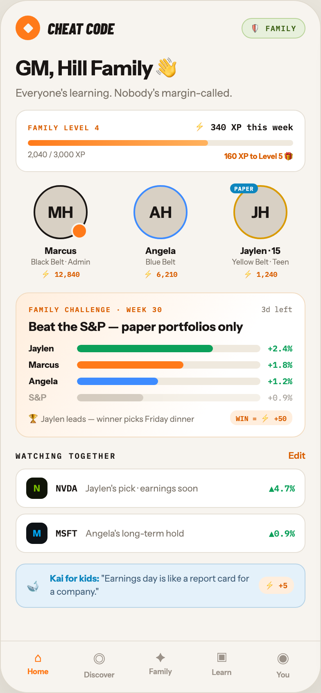

# F1 FAMILY HOME

Canvas: **CHEAT CODE · FAMILY MODE** · board index 0 · slug `01-f1-family-home`
Frame: **392×846px** (design width 392px — port at 390px logical, scale ratios).

> Style values are EXACT computed values from the canvas. `T.*` = canvas token, resolved in
> the Tokens appendix at the bottom of this file. Text marked `(MOCK)` must not ship as drawn —
> see `../../DELTA.md` for its substitution rule.

## Tree

- **“CHEAT CODE 🛡 FAMILY GM, Hill Family 👋 …”** → `
`
  - box: 392x846 · display: flex · dir: column · width: 390px · height: 844px · bg: T.orange-50 · border: 1px solid T.orange-100-b · radius: 34px (T.r17) · shadow: T.orange-900a10 0px 20px 46px 0px · overflow: hidden · type: color T.neutral-950 / Instrument Sans / 16px / w400 / lh normal
  - **“CHEAT CODE 🛡 FAMILY GM, Hill Family 👋 …”** → `
`
    - box: 390x781 · flex: 1 1 0% · flex-grow: 1 · flex-basis: 0% · pad: 18px 18px 0px 18px · overflow: hidden
    - **“CHEAT CODE 🛡 FAMILY…”** → `
`
      - box: 354x30 · display: flex · align: center · justify: space-between
      - **“CHEAT CODE…”** → `
`
        - box: 120.2x30 · display: flex · align: center · gap: 9px
        - **block[0]** → `
`
          - box: 30x30 · display: grid · align: center · justify-items: center · grid-cols: 30px · grid-rows: 30px · width: 30px · height: 30px · bg: T.orange-400-b · radius: 50% (T.r18)
          - **block[0]** → `
`
            - box: 12.7x12.7 · width: 9px · height: 9px · bg: T.orange-50 · radius: 1.5px (T.r2) · transform: matrix(0.707107, 0.707107, -0.707107, 0.707107, 0, 0)
        - **"Cheat Code"** → ``
          - box: 81.2x23 · type: color T.orange-900 / Barlow Condensed / 19px / w800 / italic / uppercase · scale: T.ty12
          - text: "Cheat Code"
      - **"🛡 FAMILY"** → ``
        - box: 78x25 · display: flex · align: center · gap: 6px · pad: 4px 10px 4px 10px · bg: T.lime-50 · border: 1px solid T.lime-200 · radius: 14px (T.r13) · type: color T.lime-700 / IBM Plex Mono / 9px / w700 / ls 0.9px · scale: T.ty81
        - text: "🛡 FAMILY"
    - **"GM, Hill Family 👋"** → `<h2>`
      - box: 354x33 · margin: 18px 0px 0px 0px · type: color T.orange-900 / 25px / w700 / ls -0.5px · scale: T.ty7
      - text: "GM, Hill Family 👋"
    - **"Everyone's learning. Nobody's margin-called."** → `
`
      - box: 354x16 · margin: 5px 0px 0px 0px · type: color T.neutral-500 / 13px · scale: T.ty29
      - text: "Everyone's learning. Nobody's margin-called."
    - **“FAMILY LEVEL 4 ⚡ 340 XP this week 2,040 …”** → `
`
      - box: 354x76 · pad: 11px 14px 11px 14px · margin: 13px 0px 0px 0px · bg: T.neutral-0 · border: 1px solid T.orange-100 · radius: 14px (T.r13)
      - **“FAMILY LEVEL 4 ⚡ 340 XP this week…”** → `
`
        - box: 324x17 · display: flex · align: baseline · justify: space-between
        - **"Family Level 4"** → ``
          - box: 88.1x11 · type: color T.orange-500 / IBM Plex Mono / 8.5px / w600 / ls 1.19px / uppercase · scale: T.ty87
          - text: "Family Level 4"
        - **"⚡ 340 XP this week"** → ``
          - box: 120.1x17 · type: color T.orange-900 / IBM Plex Mono / 10.5px / w600 · scale: T.ty62
          - text: "⚡ 340 XP this week"
      - **block[1]** → `
`
        - box: 324x7 · height: 7px · margin: 8px 0px 0px 0px · bg: T.orange-50-b · radius: 4px (T.r5) · overflow: hidden
        - **block[0]** → `
`
          - box: 220.3x7 · width: 68% · height: 100% · bg-image: linear-gradient(90deg, T.orange-400-b, T.orange-300) · radius: 4px (T.r5)
      - **“2,040 / 3,000 XP 160 XP to Level 5 🎁…”** → `
`
        - box: 324x15 · display: flex · justify: space-between · margin: 5px 0px 0px 0px · type: color T.neutral-500 / 9px
        - **"2,040 / 3,000 XP"** **(MOCK)** → ``
          - box: 70.1x15 · scale: T.ty77
          - text: "2,040 / 3,000 XP"
        - **"160 XP to Level 5 🎁"** → ``
          - box: 83.9x15 · type: color T.orange-500 / w700 · scale: T.ty76
          - text: "160 XP to Level 5 🎁"
    - **“MH Marcus Black Belt · Admin ⚡ 12,840 AH…”** → `
`
      - box: 354x115 · display: flex · gap: 12px · margin: 16px 0px 0px 0px
      - **“MH Marcus Black Belt · Admin ⚡ 12,840…”** → `
`
        - box: 110x115 · flex: 1 1 0% · flex-grow: 1 · flex-basis: 0% · type: align-center
        - **"MH"** → `
`
          - box: 66x66 · display: grid · align: center · justify-items: center · grid-cols: 62px · grid-rows: 62px · width: 62px · height: 62px · margin: 0px 22px 0px 22px · bg: T.orange-100-c · border: 2px solid T.orange-900 · radius: 50% (T.r18) · position: relative [0px 0px 0px 0px] · type: color T.orange-900 / 19px / w800 · scale: T.ty11
          - text: "MH"
          - **block[0]** → ``
            - box: 20x20 · width: 16px · height: 16px · bg: T.orange-400-b · border: 2px solid T.orange-50 · radius: 50% (T.r18) · position: absolute [44px -2px -2px 44px]
        - **"Marcus"** → `
`
          - box: 110x14 · margin: 7px 0px 0px 0px · type: color T.orange-900 / 11px / w700 · scale: T.ty50
          - text: "Marcus"
        - **"Black Belt · Admin"** → `
`
          - box: 110x11 · margin: 1px 0px 0px 0px · type: color T.neutral-500 / 9px · scale: T.ty77
          - text: "Black Belt · Admin"
        - **"⚡ 12,840"** **(MOCK)** → `
`
          - box: 110x14 · margin: 2px 0px 0px 0px · type: color T.orange-500 / IBM Plex Mono / 8.5px / w600 · scale: T.ty88
          - text: "⚡ 12,840"
      - **“AH Angela Blue Belt ⚡ 6,210…”** → `
`
        - box: 110x115 · flex: 1 1 0% · flex-grow: 1 · flex-basis: 0% · type: align-center
        - **"AH"** → `
`
          - box: 66x66 · display: grid · align: center · justify-items: center · grid-cols: 62px · grid-rows: 62px · width: 62px · height: 62px · margin: 0px 22px 0px 22px · bg: T.orange-100-c · border: 2px solid T.blue-300 · radius: 50% (T.r18) · type: color T.orange-900 / 19px / w800 · scale: T.ty11
          - text: "AH"
        - **"Angela"** → `
`
          - box: 110x14 · margin: 7px 0px 0px 0px · type: color T.orange-900 / 11px / w700 · scale: T.ty50
          - text: "Angela"
        - **"Blue Belt"** → `
`
          - box: 110x11 · margin: 1px 0px 0px 0px · type: color T.neutral-500 / 9px · scale: T.ty77
          - text: "Blue Belt"
        - **"⚡ 6,210"** **(MOCK)** → `
`
          - box: 110x14 · margin: 2px 0px 0px 0px · type: color T.orange-500 / IBM Plex Mono / 8.5px / w600 · scale: T.ty88
          - text: "⚡ 6,210"
      - **“JH PAPER Jaylen · 15 Yellow Belt · Teen …”** → `
`
        - box: 110x115 · flex: 1 1 0% · flex-grow: 1 · flex-basis: 0% · type: align-center
        - **"JH"** → `
`
          - box: 66x66 · display: grid · align: center · justify-items: center · grid-cols: 62px · grid-rows: 62px · width: 62px · height: 62px · margin: 0px 22px 0px 22px · bg: T.orange-100-c · border: 2px solid T.amber-500 · radius: 50% (T.r18) · position: relative [0px 0px 0px 0px] · type: color T.orange-900 / 19px / w800 · scale: T.ty11
          - text: "JH"
          - **"PAPER"** → ``
            - box: 33.8x12 · pad: 1.5px 5px 1.5px 5px · bg: T.blue-500 · radius: 8px (T.r7) · position: absolute [-4px 34.1875px 54px -6px] · type: color T.neutral-0 / IBM Plex Mono / 7px / w700 / ls 0.56px · scale: T.ty96
            - text: "PAPER"
        - **"Jaylen · 15"** → `
`
          - box: 110x14 · margin: 7px 0px 0px 0px · type: color T.orange-900 / 11px / w700 · scale: T.ty50
          - text: "Jaylen · 15"
        - **"Yellow Belt · Teen"** → `
`
          - box: 110x11 · margin: 1px 0px 0px 0px · type: color T.neutral-500 / 9px · scale: T.ty77
          - text: "Yellow Belt · Teen"
        - **"⚡ 1,240"** **(MOCK)** → `
`
          - box: 110x14 · margin: 2px 0px 0px 0px · type: color T.orange-500 / IBM Plex Mono / 8.5px / w600 · scale: T.ty88
          - text: "⚡ 1,240"
    - **“FAMILY CHALLENGE · WEEK 30 3d left Beat …”** → `
`
      - box: 354x177 · pad: 14px 15px 14px 15px · margin: 16px 0px 0px 0px · bg-image: linear-gradient(120deg, T.orange-50-c 0%, T.neutral-0 70%) · border: 1px solid T.orange-100-d · radius: 16px (T.r14)
      - **“FAMILY CHALLENGE · WEEK 30 3d left…”** → `
`
        - box: 322x11 · display: flex · align: center · justify: space-between
        - **"Family challenge · Week 30"** → `
`
          - box: 163.5x11 · type: color T.orange-500 / IBM Plex Mono / 8.5px / w600 / ls 1.19px / uppercase · scale: T.ty87
          - text: "Family challenge · Week 30"
        - **"3d left"** → ``
          - box: 37.8x11 · type: color T.neutral-500 / IBM Plex Mono / 9px · scale: T.ty78
          - text: "3d left"
      - **"Beat the S&P — paper portfolios only"** → `
`
        - box: 322x19 · margin: 6px 0px 0px 0px · type: color T.orange-900 / 15px / w800 · scale: T.ty22
        - text: "Beat the S&P — paper portfolios only"
      - **“Jaylen +2.4% Marcus +1.8% Angela +1.2% S…”** → `
`
        - box: 322x73 · display: flex · dir: column · gap: 7px · margin: 11px 0px 0px 0px
        - **“Jaylen +2.4%…”** → `
`
          - box: 322x13 · display: flex · align: center · gap: 9px
          - **"Jaylen"** → ``
            - box: 50x13 · width: 50px · type: color T.orange-900 / 10.5px / w700 · scale: T.ty61
            - text: "Jaylen"
          - **block[1]** → `
`
            - box: 224x9 · height: 9px · flex: 1 1 0% · flex-grow: 1 · flex-basis: 0% · bg: T.orange-50-b · radius: 5px (T.r6) · overflow: hidden
            - **block[0]** → `
`
              - box: 165.8x9 · width: 74% · height: 100% · bg: T.teal-600 · radius: 5px (T.r6)
          - **"+2.4%"** **(MOCK)** → ``
            - box: 30x13 · type: color T.teal-600 / IBM Plex Mono / 10px / w600 · scale: T.ty66
            - text: "+2.4%"
        - **“Marcus +1.8%…”** → `
`
          - box: 322x13 · display: flex · align: center · gap: 9px
          - **"Marcus"** → ``
            - box: 50x13 · width: 50px · type: color T.orange-900 / 10.5px / w700 · scale: T.ty61
            - text: "Marcus"
          - **block[1]** → `
`
            - box: 224x9 · height: 9px · flex: 1 1 0% · flex-grow: 1 · flex-basis: 0% · bg: T.orange-50-b · radius: 5px (T.r6) · overflow: hidden
            - **block[0]** → `
`
              - box: 129.9x9 · width: 58% · height: 100% · bg: T.orange-400-b · radius: 5px (T.r6)
          - **"+1.8%"** **(MOCK)** → ``
            - box: 30x13 · type: color T.teal-600 / IBM Plex Mono / 10px / w600 · scale: T.ty66
            - text: "+1.8%"
        - **“Angela +1.2%…”** → `
`
          - box: 322x13 · display: flex · align: center · gap: 9px
          - **"Angela"** → ``
            - box: 50x13 · width: 50px · type: color T.orange-900 / 10.5px / w700 · scale: T.ty61
            - text: "Angela"
          - **block[1]** → `
`
            - box: 224x9 · height: 9px · flex: 1 1 0% · flex-grow: 1 · flex-basis: 0% · bg: T.orange-50-b · radius: 5px (T.r6) · overflow: hidden
            - **block[0]** → `
`
              - box: 98.5x9 · width: 44% · height: 100% · bg: T.blue-300 · radius: 5px (T.r6)
          - **"+1.2%"** **(MOCK)** → ``
            - box: 30x13 · type: color T.teal-600 / IBM Plex Mono / 10px / w600 · scale: T.ty66
            - text: "+1.2%"
        - **“S&P +0.9%…”** → `
`
          - box: 322x13 · display: flex · align: center · gap: 9px · opacity: 0.7
          - **"S&P"** → ``
            - box: 50x13 · width: 50px · type: color T.neutral-500 / 10.5px / w600 · scale: T.ty60
            - text: "S&P"
          - **block[1]** → `
`
            - box: 224x9 · height: 9px · flex: 1 1 0% · flex-grow: 1 · flex-basis: 0% · bg: T.orange-50-b · radius: 5px (T.r6) · overflow: hidden
            - **block[0]** → `
`
              - box: 80.6x9 · width: 36% · height: 100% · bg: T.orange-200 · radius: 5px (T.r6)
          - **"+0.9%"** **(MOCK)** → ``
            - box: 30x13 · type: color T.neutral-500 / IBM Plex Mono / 10px · scale: T.ty67
            - text: "+0.9%"
      - **“🏆 Jaylen leads — winner picks Friday di…”** → `
`
        - box: 322x18 · display: flex · align: center · justify: space-between · margin: 9px 0px 0px 0px
        - **"🏆 Jaylen leads — winner picks Friday dinner"** → ``
          - box: 202.2x17 · type: color T.neutral-500 / 10px · scale: T.ty65
          - text: "🏆 Jaylen leads — winner picks Friday dinner"
        - **"WIN = ⚡ +50"** **(MOCK)** → ``
          - box: 76x18 · pad: 2px 7px 2px 7px · bg: T.orange-50-c · radius: 8px (T.r7) · type: color T.orange-500 / IBM Plex Mono / 8.5px / w700 · scale: T.ty86
          - text: "WIN = ⚡ +50"
    - **“WATCHING TOGETHER Edit…”** → `
`
      - box: 354x14 · display: flex · align: baseline · justify: space-between · margin: 15px 0px 0px 0px
      - **"Watching together"** → ``
        - box: 122.8x13 · type: color T.orange-900 / IBM Plex Mono / 9.5px / w600 / ls 1.52px / uppercase · scale: T.ty71
        - text: "Watching together"
      - **"Edit"** → ``
        - box: 20.7x14 · type: color T.orange-500 / 11px / w600 · scale: T.ty51
        - text: "Edit"
    - **“N NVDA Jaylen's pick · earnings soon ▲4.…”** → `
`
      - box: 354x103 · display: flex · dir: column · gap: 7px · margin: 9px 0px 0px 0px
      - **“N NVDA Jaylen's pick · earnings soon ▲4.…”** → `
`
        - box: 354x48 · display: flex · align: center · gap: 10px · pad: 10px 12px 10px 12px · bg: T.neutral-0 · border: 1px solid T.orange-100 · radius: 12px (T.r11)
        - **"N"** → `
`
          - box: 26x26 · display: grid · align: center · justify-items: center · grid-cols: 26px · grid-rows: 26px · width: 26px · height: 26px · bg: T.lime-900 · radius: 8px (T.r7) · type: color T.lime-600 / 11px / w800 · scale: T.ty53
          - text: "N"
        - **"NVDA"** → ``
          - box: 26.4x14 · type: color T.orange-900 / IBM Plex Mono / 11px / w600 · scale: T.ty52
          - text: "NVDA"
        - **"Jaylen's pick · earnings soon"** → ``
          - box: 214.1x14 · flex: 1 1 0% · flex-grow: 1 · flex-basis: 0% · type: color T.neutral-500 / 11px · scale: T.ty48
          - text: "Jaylen's pick · earnings soon"
        - **"▲4.7%"** **(MOCK)** → ``
          - box: 31.5x14 · type: color T.teal-600 / IBM Plex Mono / 10.5px / w600 · scale: T.ty62
          - text: "▲4.7%"
      - **“M MSFT Angela's long-term hold ▲0.9%…”** → `
`
        - box: 354x48 · display: flex · align: center · gap: 10px · pad: 10px 12px 10px 12px · bg: T.neutral-0 · border: 1px solid T.orange-100 · radius: 12px (T.r11)
        - **"M"** → `
`
          - box: 26x26 · display: grid · align: center · justify-items: center · grid-cols: 26px · grid-rows: 26px · width: 26px · height: 26px · bg: T.blue-900 · radius: 8px (T.r7) · type: color T.blue-500-b / 11px / w800 · scale: T.ty53
          - text: "M"
        - **"MSFT"** → ``
          - box: 26.4x14 · type: color T.orange-900 / IBM Plex Mono / 11px / w600 · scale: T.ty52
          - text: "MSFT"
        - **"Angela's long-term hold"** → ``
          - box: 214.1x14 · flex: 1 1 0% · flex-grow: 1 · flex-basis: 0% · type: color T.neutral-500 / 11px · scale: T.ty48
          - text: "Angela's long-term hold"
        - **"▲0.9%"** **(MOCK)** → ``
          - box: 31.5x14 · type: color T.teal-600 / IBM Plex Mono / 10.5px / w600 · scale: T.ty62
          - text: "▲0.9%"
    - **“🐋 Kai for kids: "Earnings day is like a…”** → `
`
      - box: 354x53.9 · display: flex · align: center · gap: 10px · pad: 10px 13px 10px 13px · margin: 13px 0px 0px 0px · bg: T.blue-50 · border: 1px solid T.blue-100 · radius: 12px (T.r11)
      - **"🐋"** → ``
        - box: 18x23 · type: 14px · scale: T.ty25
        - text: "🐋"
      - **"\"Earnings day is like a report card for a co"** → ``
        - box: 244.8x31.9 · flex: 1 1 0% · flex-grow: 1 · flex-basis: 0% · type: color T.blue-600 / 11px / lh 15.95px · scale: T.ty54
        - text: "\"Earnings day is like a report card for a company.\""
        - **"Kai for kids:"** → `<strong>`
          - box: 60.3x14 · display: inline · type: color T.blue-500 / w700 · scale: T.ty55
          - text: "Kai for kids:"
      - **"⚡ +5"** **(MOCK)** → ``
        - box: 43.2x21 · flex: 0 0 auto · flex-shrink: 0 · pad: 3px 8px 3px 8px · bg: T.orange-50-c · radius: 10px (T.r9) · type: color T.orange-500 / IBM Plex Mono / 9px / w700 · scale: T.ty80
        - text: "⚡ +5"
  - **“⌂ Home ◎ Discover ✦ Family ▣ Learn ◉ You…”** → `
`
    - box: 390x63 · display: flex · pad: 10px 8px 16px 8px · bg: T.orange-50 · border: T:1px solid T.orange-100 R:0px none T.neutral-950 B:0px none T.neutral-950 L:0px none T.neutral-950
    - **“⌂ Home…”** → `
`
      - box: 74.8x36 · flex: 1 1 0% · flex-grow: 1 · flex-basis: 0% · type: align-center
      - **"⌂"** → `
`
        - box: 74.8x19 · type: color T.orange-400-b / 15px · scale: T.ty21
        - text: "⌂"
      - **"Home"** → `
`
        - box: 74.8x11 · margin: 2px 0px 0px 0px · type: color T.orange-400-b / 9px / w700 · scale: T.ty76
        - text: "Home"
    - **“◎ Discover…”** → `
`
      - box: 74.8x36 · flex: 1 1 0% · flex-grow: 1 · flex-basis: 0% · type: align-center
      - **"◎"** → `
`
        - box: 74.8x23 · type: color T.orange-400 / 15px · scale: T.ty21
        - text: "◎"
      - **"Discover"** → `
`
        - box: 74.8x11 · margin: 2px 0px 0px 0px · type: color T.orange-400 / 9px / w600 · scale: T.ty75
        - text: "Discover"
    - **“✦ Family…”** → `
`
      - box: 74.8x36 · flex: 1 1 0% · flex-grow: 1 · flex-basis: 0% · type: align-center
      - **"✦"** → `
`
        - box: 74.8x19 · type: color T.orange-400 / 15px · scale: T.ty21
        - text: "✦"
      - **"Family"** → `
`
        - box: 74.8x11 · margin: 2px 0px 0px 0px · type: color T.orange-400 / 9px / w600 · scale: T.ty75
        - text: "Family"
    - **“▣ Learn…”** → `
`
      - box: 74.8x36 · flex: 1 1 0% · flex-grow: 1 · flex-basis: 0% · type: align-center
      - **"▣"** → `
`
        - box: 74.8x20 · type: color T.orange-400 / 15px · scale: T.ty21
        - text: "▣"
      - **"Learn"** → `
`
        - box: 74.8x11 · margin: 2px 0px 0px 0px · type: color T.orange-400 / 9px / w600 · scale: T.ty75
        - text: "Learn"
    - **“◉ You…”** → `
`
      - box: 74.8x36 · flex: 1 1 0% · flex-grow: 1 · flex-basis: 0% · type: align-center
      - **"◉"** → `
`
        - box: 74.8x23 · type: color T.orange-400 / 15px · scale: T.ty21
        - text: "◉"
      - **"You"** → `
`
        - box: 74.8x11 · margin: 2px 0px 0px 0px · type: color T.orange-400 / 9px / w600 · scale: T.ty75
        - text: "You"

## Tokens used in this board

| token | value | role |
| --- | --- | --- |
| T.orange-900 | `#1A1614` | text, border, bg |
| T.neutral-950 | `#000000` | text, border |
| T.neutral-500 | `#7B7369` | text, bg |
| T.neutral-0 | `#FFFFFF` | bg, text, gradient |
| T.orange-400 | `#9B9289` | text, bg |
| T.orange-100 | `#E5DFD5` | border, bg |
| T.orange-500 | `#D95E00` | text |
| T.orange-400-b | `#FF7A1A` | bg, gradient, text, border |
| T.orange-50 | `#F7F4EF` | bg, border, text |
| T.orange-50-b | `#EFE9DE` | bg, gradient, border |
| T.teal-600 | `#0BA05A` | bg, text |
| T.orange-50-c | `#FFEEDD` | gradient, bg |
| T.orange-100-b | `#E0DACE` | border, gradient |
| T.orange-100-c | `#D8D0C4` | bg |
| T.orange-900a10 | `#1A1614/0.1` | shadow |
| T.orange-300 | `#FFB25E` | gradient, text |
| T.amber-500 | `#D99A00` | border, bg, gradient |
| T.orange-100-d | `#F2DCC2` | border |
| T.lime-50 | `#E7F0DC` | bg |
| T.lime-700 | `#3E6317` | text |
| T.blue-500 | `#0E86BE` | bg, text |
| T.blue-300 | `#3D8BFF` | border, bg |
| T.orange-200 | `#C4BBAD` | bg, border |
| T.blue-100 | `#B7D3E6` | border, text |
| T.lime-200 | `#B8D398` | border |
| T.lime-900 | `#101408` | bg |
| T.lime-600 | `#76B900` | text |
| T.blue-50 | `#E4F1FA` | bg |
| T.blue-600 | `#43607A` | text |
| T.blue-900 | `#0E1216` | bg |
| T.blue-500-b | `#00A4EF` | text |
| T.ty7 | Instrument Sans 25px/normal w700 ls:-0.5px | type scale |
| T.ty11 | Instrument Sans 19px/normal w800 ls:normal | type scale |
| T.ty12 | Barlow Condensed 19px/normal w800 ls:normal uppercase | type scale |
| T.ty21 | Instrument Sans 15px/normal w400 ls:normal | type scale |
| T.ty22 | Instrument Sans 15px/normal w800 ls:normal | type scale |
| T.ty25 | Instrument Sans 14px/normal w400 ls:normal | type scale |
| T.ty29 | Instrument Sans 13px/normal w400 ls:normal | type scale |
| T.ty48 | Instrument Sans 11px/normal w400 ls:normal | type scale |
| T.ty50 | Instrument Sans 11px/normal w700 ls:normal | type scale |
| T.ty51 | Instrument Sans 11px/normal w600 ls:normal | type scale |
| T.ty52 | IBM Plex Mono 11px/normal w600 ls:normal | type scale |
| T.ty53 | Instrument Sans 11px/normal w800 ls:normal | type scale |
| T.ty54 | Instrument Sans 11px/15.95px w400 ls:normal | type scale |
| T.ty55 | Instrument Sans 11px/15.95px w700 ls:normal | type scale |
| T.ty60 | Instrument Sans 10.5px/normal w600 ls:normal | type scale |
| T.ty61 | Instrument Sans 10.5px/normal w700 ls:normal | type scale |
| T.ty62 | IBM Plex Mono 10.5px/normal w600 ls:normal | type scale |
| T.ty65 | Instrument Sans 10px/normal w400 ls:normal | type scale |
| T.ty66 | IBM Plex Mono 10px/normal w600 ls:normal | type scale |
| T.ty67 | IBM Plex Mono 10px/normal w400 ls:normal | type scale |
| T.ty71 | IBM Plex Mono 9.5px/normal w600 ls:1.52px uppercase | type scale |
| T.ty75 | Instrument Sans 9px/normal w600 ls:normal | type scale |
| T.ty76 | Instrument Sans 9px/normal w700 ls:normal | type scale |
| T.ty77 | Instrument Sans 9px/normal w400 ls:normal | type scale |
| T.ty78 | IBM Plex Mono 9px/normal w400 ls:normal | type scale |
| T.ty80 | IBM Plex Mono 9px/normal w700 ls:normal | type scale |
| T.ty81 | IBM Plex Mono 9px/normal w700 ls:0.9px | type scale |
| T.ty86 | IBM Plex Mono 8.5px/normal w700 ls:normal | type scale |
| T.ty87 | IBM Plex Mono 8.5px/normal w600 ls:1.19px uppercase | type scale |
| T.ty88 | IBM Plex Mono 8.5px/normal w600 ls:normal | type scale |
| T.ty96 | IBM Plex Mono 7px/normal w700 ls:0.56px | type scale |
| T.r2 | `1.5px` | radius |
| T.r5 | `4px` | radius |
| T.r6 | `5px` | radius |
| T.r7 | `8px` | radius |
| T.r9 | `10px` | radius |
| T.r11 | `12px` | radius |
| T.r13 | `14px` | radius |
| T.r14 | `16px` | radius |
| T.r17 | `34px` | radius |
| T.r18 | `50%` | radius |
