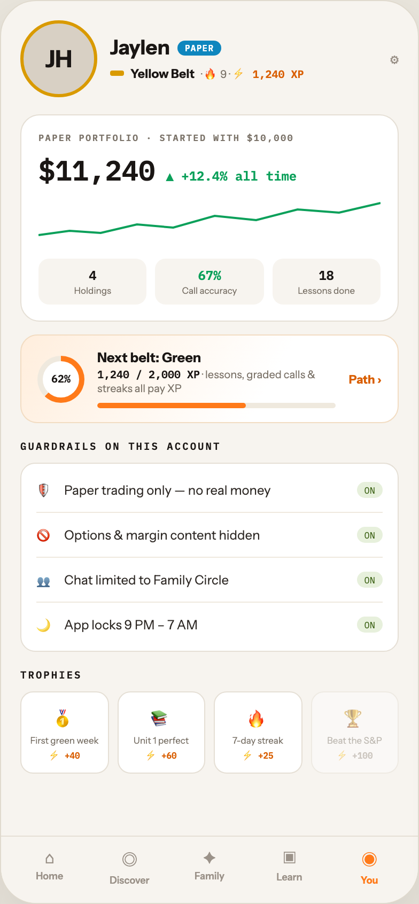

# F2 TEEN · PAPER ACCOUNT

Canvas: **CHEAT CODE · FAMILY MODE** · board index 1 · slug `02-f2-teen-paper-account`
Frame: **392×846px** (design width 392px — port at 390px logical, scale ratios).

> Style values are EXACT computed values from the canvas. `T.*` = canvas token, resolved in
> the Tokens appendix at the bottom of this file. Text marked `(MOCK)` must not ship as drawn —
> see `../../DELTA.md` for its substitution rule.

## Tree

- **“JH Jaylen PAPER Yellow Belt · 🔥 9 · ⚡ 1…”** → `
`
  - box: 392x846 · display: flex · dir: column · width: 390px · height: 844px · bg: T.orange-50 · border: 1px solid T.orange-100-b · radius: 34px (T.r17) · shadow: T.orange-900a10 0px 20px 46px 0px · overflow: hidden · type: color T.neutral-950 / Instrument Sans / 16px / w400 / lh normal
  - **“JH Jaylen PAPER Yellow Belt · 🔥 9 · ⚡ 1…”** → `
`
    - box: 390x781 · flex: 1 1 0% · flex-grow: 1 · flex-basis: 0% · pad: 18px 18px 0px 18px · overflow: hidden
    - **“JH Jaylen PAPER Yellow Belt · 🔥 9 · ⚡ 1…”** → `
`
      - box: 354x72 · display: flex · align: center · gap: 12px
      - **"JH"** → `
`
        - box: 72x72 · display: grid · align: center · justify-items: center · grid-cols: 66px · grid-rows: 66px · width: 66px · height: 66px · flex: 0 0 auto · flex-shrink: 0 · bg: T.orange-100-c · border: 3px solid T.amber-500 · radius: 50% (T.r18) · type: color T.orange-900 / 22px / w800 · scale: T.ty10
        - text: "JH"
      - **“Jaylen PAPER Yellow Belt · 🔥 9 · ⚡ 1,24…”** → `
`
        - box: 250.2x44 · flex: 1 1 0% · flex-grow: 1 · flex-basis: 0%
        - **“Jaylen PAPER…”** → `
`
          - box: 250.2x23 · display: flex · align: center · gap: 7px
          - **"Jaylen"** → ``
            - box: 56x23 · type: color T.orange-900 / 19px / w800 · scale: T.ty11
            - text: "Jaylen"
          - **"PAPER"** → ``
            - box: 41.2x14 · pad: 2px 7px 2px 7px · bg: T.blue-500 · radius: 9px (T.r8) · type: color T.neutral-0 / IBM Plex Mono / 8px / w700 / ls 0.64px · scale: T.ty93
            - text: "PAPER"
        - **“Yellow Belt · 🔥 9 · ⚡ 1,240 XP…”** → `
`
          - box: 250.2x17 · display: flex · align: center · gap: 6px · margin: 4px 0px 0px 0px
          - **block[0]** → ``
            - box: 13x4.5 · width: 13px · height: 4.5px · bg: T.amber-500 · radius: 2px (T.r3)
          - **"Yellow Belt"** → ``
            - box: 60.1x14 · type: color T.orange-900 / 11.5px / w700 · scale: T.ty46
            - text: "Yellow Belt"
          - **"· 🔥 9 ·"** → ``
            - box: 96.2x17 · type: color T.neutral-500 / 10px · scale: T.ty65
            - text: "· 🔥 9 ·"
            - **"⚡ 1,240 XP"** **(MOCK)** → ``
              - box: 67x13 · display: inline · type: color T.orange-500 / IBM Plex Mono / w600 · scale: T.ty66
              - text: "⚡ 1,240 XP"
      - **"⚙"** → ``
        - box: 7.8x16 · type: color T.orange-400 / 13px · scale: T.ty29
        - text: "⚙"
    - **“PAPER PORTFOLIO · STARTED WITH $10,000 $…”** → `
`
      - box: 354x194 · pad: 15px 16px 15px 16px · margin: 16px 0px 0px 0px · bg: T.neutral-0 · border: 1px solid T.orange-100 · radius: 18px (T.r15)
      - **"Paper portfolio · started with $10,000"** **(MOCK)** → `
`
        - box: 320x11 · type: color T.neutral-500 / IBM Plex Mono / 8.5px / w600 / ls 1.19px / uppercase · scale: T.ty87
        - text: "Paper portfolio · started with $10,000"
      - **“$11,240 ▲ +12.4% all time…”** → `
`
        - box: 320x34 · display: flex · align: baseline · gap: 10px · margin: 8px 0px 0px 0px
        - **"$11,240"** **(MOCK)** → ``
          - box: 109.2x34 · type: color T.orange-900 / IBM Plex Mono / 26px / w600 · scale: T.ty4
          - text: "$11,240"
        - **"▲ +12.4% all time"** **(MOCK)** → ``
          - box: 122.4x15 · type: color T.teal-600 / IBM Plex Mono / 12px / w600 · scale: T.ty39
          - text: "▲ +12.4% all time"
      - **svg** → `<svg>`
        - box: 320x42 · display: inline · margin: 8px 0px 0px 0px · overflow: hidden
        - svg: `<svg data-dc-tpl="144" width="100%" height="42" viewBox="0 0 330 42" preserveAspectRatio="none" style="margin-top: 8px;"><path data-dc-tpl="145" d="M0 36 L30 32 L60 34 L95 26 L130 29 L170 18 L210 22 L250 12 L290 15 L330 6" fill="none" stroke="#0BA05A" stroke-width="2"></path></svg>`
        - **block[0]** → `<path>`
          - box: 320x30 · display: inline
      - **“4 Holdings 67% Call accuracy 18 Lessons …”** → `
`
        - box: 320x43 · display: flex · gap: 8px · margin: 12px 0px 0px 0px
        - **“4 Holdings…”** → `
`
          - box: 101.3x43 · flex: 1 1 0% · flex-grow: 1 · flex-basis: 0% · pad: 8px 8px 8px 8px · bg: T.orange-50 · radius: 10px (T.r9) · type: align-center
          - **"4"** → `
`
            - box: 85.3x15 · type: color T.orange-900 / IBM Plex Mono / 12px / w600 · scale: T.ty39
            - text: "4"
          - **"Holdings"** → `
`
            - box: 85.3x10 · margin: 2px 0px 0px 0px · type: color T.neutral-500 / 8.5px · scale: T.ty84
            - text: "Holdings"
        - **“67% Call accuracy…”** → `
`
          - box: 101.3x43 · flex: 1 1 0% · flex-grow: 1 · flex-basis: 0% · pad: 8px 8px 8px 8px · bg: T.orange-50 · radius: 10px (T.r9) · type: align-center
          - **"67%"** **(MOCK)** → `
`
            - box: 85.3x15 · type: color T.teal-600 / IBM Plex Mono / 12px / w600 · scale: T.ty39
            - text: "67%"
          - **"Call accuracy"** → `
`
            - box: 85.3x10 · margin: 2px 0px 0px 0px · type: color T.neutral-500 / 8.5px · scale: T.ty84
            - text: "Call accuracy"
        - **“18 Lessons done…”** → `
`
          - box: 101.3x43 · flex: 1 1 0% · flex-grow: 1 · flex-basis: 0% · pad: 8px 8px 8px 8px · bg: T.orange-50 · radius: 10px (T.r9) · type: align-center
          - **"18"** → `
`
            - box: 85.3x15 · type: color T.orange-900 / IBM Plex Mono / 12px / w600 · scale: T.ty39
            - text: "18"
          - **"Lessons done"** → `
`
            - box: 85.3x10 · margin: 2px 0px 0px 0px · type: color T.neutral-500 / 8.5px · scale: T.ty84
            - text: "Lessons done"
    - **“62% Next belt: Green 1,240 / 2,000 XP · …”** → `
`
      - box: 354x83 · display: flex · align: center · gap: 12px · pad: 13px 15px 13px 15px · margin: 12px 0px 0px 0px · bg-image: linear-gradient(120deg, T.orange-50-c 0%, T.neutral-0 65%) · border: 1px solid T.orange-100-d · radius: 16px (T.r14)
      - **“62%…”** → `
`
        - box: 44x44 · display: grid · align: center · justify-items: center · grid-cols: 44px · grid-rows: 44px · width: 44px · height: 44px · flex: 0 0 auto · flex-shrink: 0 · bg-image: conic-gradient(T.orange-400-b 0deg, T.orange-400-b 62%, T.orange-50-b 62%, T.orange-50-b 100%) · radius: 50% (T.r18)
        - **"62%"** **(MOCK)** → `
`
          - box: 34x34 · display: grid · align: center · justify-items: center · grid-cols: 34px · grid-rows: 34px · width: 34px · height: 34px · bg: T.neutral-0 · radius: 50% (T.r18) · type: color T.orange-900 / IBM Plex Mono / 10px / w600 · scale: T.ty66
          - text: "62%"
      - **“Next belt: Green 1,240 / 2,000 XP · less…”** → `
`
        - box: 223.4x55 · flex: 1 1 0% · flex-grow: 1 · flex-basis: 0%
        - **"Next belt: Green"** → `
`
          - box: 223.4x15 · type: color T.orange-900 / 12.5px / w700 · scale: T.ty34
          - text: "Next belt: Green"
        - **"· lessons, graded calls & streaks all pay XP"** → `
`
          - box: 223.4x26 · margin: 2px 0px 0px 0px · type: color T.neutral-500 / 10px · scale: T.ty65
          - text: "· lessons, graded calls & streaks all pay XP"
          - **"1,240 / 2,000 XP"** **(MOCK)** → ``
            - box: 96x13 · display: inline · type: color T.orange-900 / IBM Plex Mono / w600 · scale: T.ty66
            - text: "1,240 / 2,000 XP"
        - **block[2]** → `
`
          - box: 223.4x5 · height: 5px · margin: 7px 0px 0px 0px · bg: T.orange-50-b · radius: 3px (T.r4) · overflow: hidden
          - **block[0]** → `
`
            - box: 138.5x5 · width: 62% · height: 100% · bg: T.orange-400-b · radius: 3px (T.r4)
      - **"Path ›"** → ``
        - box: 30.6x14 · type: color T.orange-500 / 11px / w700 · scale: T.ty50
        - text: "Path ›"
    - **"Guardrails on this account"** → `
`
      - box: 354x13 · margin: 15px 0px 0px 0px · type: color T.orange-900 / IBM Plex Mono / 9.5px / w600 / ls 1.52px / uppercase · scale: T.ty71
      - text: "Guardrails on this account"
    - **“🛡 Paper trading only — no real money ON…”** → `
`
      - box: 354x177 · pad: 4px 14px 4px 14px · margin: 9px 0px 0px 0px · bg: T.neutral-0 · border: 1px solid T.orange-100 · radius: 14px (T.r13)
      - **“🛡 Paper trading only — no real money ON…”** → `
`
        - box: 324x42 · display: flex · align: center · gap: 10px · pad: 10px 0px 10px 0px · border: T:0px none T.neutral-950 R:0px none T.neutral-950 B:1px solid T.orange-50-b L:0px none T.neutral-950
        - **"🛡"** → ``
          - box: 16x21 · type: 13px · scale: T.ty29
          - text: "🛡"
        - **"Paper trading only — no real money"** → ``
          - box: 263.8x15 · flex: 1 1 0% · flex-grow: 1 · flex-basis: 0% · type: color T.orange-800 / 12px · scale: T.ty38
          - text: "Paper trading only — no real money"
        - **"ON"** → ``
          - box: 24.2x15 · pad: 2px 7px 2px 7px · bg: T.lime-50 · radius: 8px (T.r7) · type: color T.lime-700 / IBM Plex Mono / 8.5px · scale: T.ty85
          - text: "ON"
      - **“🚫 Options & margin content hidden ON…”** → `
`
        - box: 324x42 · display: flex · align: center · gap: 10px · pad: 10px 0px 10px 0px · border: T:0px none T.neutral-950 R:0px none T.neutral-950 B:1px solid T.orange-50-b L:0px none T.neutral-950
        - **"🚫"** → ``
          - box: 16x21 · type: 13px · scale: T.ty29
          - text: "🚫"
        - **"Options & margin content hidden"** → ``
          - box: 263.8x15 · flex: 1 1 0% · flex-grow: 1 · flex-basis: 0% · type: color T.orange-800 / 12px · scale: T.ty38
          - text: "Options & margin content hidden"
        - **"ON"** → ``
          - box: 24.2x15 · pad: 2px 7px 2px 7px · bg: T.lime-50 · radius: 8px (T.r7) · type: color T.lime-700 / IBM Plex Mono / 8.5px · scale: T.ty85
          - text: "ON"
      - **“👥 Chat limited to Family Circle ON…”** → `
`
        - box: 324x42 · display: flex · align: center · gap: 10px · pad: 10px 0px 10px 0px · border: T:0px none T.neutral-950 R:0px none T.neutral-950 B:1px solid T.orange-50-b L:0px none T.neutral-950
        - **"👥"** → ``
          - box: 16x21 · type: 13px · scale: T.ty29
          - text: "👥"
        - **"Chat limited to Family Circle"** → ``
          - box: 263.8x15 · flex: 1 1 0% · flex-grow: 1 · flex-basis: 0% · type: color T.orange-800 / 12px · scale: T.ty38
          - text: "Chat limited to Family Circle"
        - **"ON"** → ``
          - box: 24.2x15 · pad: 2px 7px 2px 7px · bg: T.lime-50 · radius: 8px (T.r7) · type: color T.lime-700 / IBM Plex Mono / 8.5px · scale: T.ty85
          - text: "ON"
      - **“🌙 App locks 9 PM – 7 AM ON…”** → `
`
        - box: 324x41 · display: flex · align: center · gap: 10px · pad: 10px 0px 10px 0px
        - **"🌙"** → ``
          - box: 16x21 · type: 13px · scale: T.ty29
          - text: "🌙"
        - **"App locks 9 PM – 7 AM"** → ``
          - box: 263.8x15 · flex: 1 1 0% · flex-grow: 1 · flex-basis: 0% · type: color T.orange-800 / 12px · scale: T.ty38
          - text: "App locks 9 PM – 7 AM"
        - **"ON"** → ``
          - box: 24.2x15 · pad: 2px 7px 2px 7px · bg: T.lime-50 · radius: 8px (T.r7) · type: color T.lime-700 / IBM Plex Mono / 8.5px · scale: T.ty85
          - text: "ON"
    - **"Trophies"** → `
`
      - box: 354x13 · margin: 15px 0px 0px 0px · type: color T.orange-900 / IBM Plex Mono / 9.5px / w600 / ls 1.52px / uppercase · scale: T.ty71
      - text: "Trophies"
    - **“🥇 First green week ⚡ +40 📚 Unit 1 perf…”** → `
`
      - box: 354x77 · display: flex · gap: 8px · margin: 9px 0px 0px 0px
      - **“🥇 First green week ⚡ +40…”** → `
`
        - box: 82.5x77 · flex: 1 1 0% · flex-grow: 1 · flex-basis: 0% · pad: 10px 6px 10px 6px · bg: T.neutral-0 · border: 1px solid T.orange-100 · radius: 12px (T.r11) · type: align-center
        - **"🥇"** → `
`
          - box: 68.5x27 · type: 17px · scale: T.ty14
          - text: "🥇"
        - **"First green week"** → `
`
          - box: 68.5x10 · margin: 3px 0px 0px 0px · type: color T.neutral-500 / 8.5px · scale: T.ty84
          - text: "First green week"
        - **"⚡ +40"** **(MOCK)** → `
`
          - box: 68.5x13 · margin: 2px 0px 0px 0px · type: color T.orange-500 / IBM Plex Mono / 8px / w700 · scale: T.ty91
          - text: "⚡ +40"
      - **“📚 Unit 1 perfect ⚡ +60…”** → `
`
        - box: 82.5x77 · flex: 1 1 0% · flex-grow: 1 · flex-basis: 0% · pad: 10px 6px 10px 6px · bg: T.neutral-0 · border: 1px solid T.orange-100 · radius: 12px (T.r11) · type: align-center
        - **"📚"** → `
`
          - box: 68.5x27 · type: 17px · scale: T.ty14
          - text: "📚"
        - **"Unit 1 perfect"** → `
`
          - box: 68.5x10 · margin: 3px 0px 0px 0px · type: color T.neutral-500 / 8.5px · scale: T.ty84
          - text: "Unit 1 perfect"
        - **"⚡ +60"** **(MOCK)** → `
`
          - box: 68.5x13 · margin: 2px 0px 0px 0px · type: color T.orange-500 / IBM Plex Mono / 8px / w700 · scale: T.ty91
          - text: "⚡ +60"
      - **“🔥 7-day streak ⚡ +25…”** → `
`
        - box: 82.5x77 · flex: 1 1 0% · flex-grow: 1 · flex-basis: 0% · pad: 10px 6px 10px 6px · bg: T.neutral-0 · border: 1px solid T.orange-100 · radius: 12px (T.r11) · type: align-center
        - **"🔥"** → `
`
          - box: 68.5x27 · type: 17px · scale: T.ty14
          - text: "🔥"
        - **"7-day streak"** → `
`
          - box: 68.5x10 · margin: 3px 0px 0px 0px · type: color T.neutral-500 / 8.5px · scale: T.ty84
          - text: "7-day streak"
        - **"⚡ +25"** **(MOCK)** → `
`
          - box: 68.5x13 · margin: 2px 0px 0px 0px · type: color T.orange-500 / IBM Plex Mono / 8px / w700 · scale: T.ty91
          - text: "⚡ +25"
      - **“🏆 Beat the S&P ⚡ +100…”** → `
`
        - box: 82.5x77 · flex: 1 1 0% · flex-grow: 1 · flex-basis: 0% · pad: 10px 6px 10px 6px · bg: T.neutral-0 · border: 1px solid T.orange-100 · radius: 12px (T.r11) · opacity: 0.45 · type: align-center
        - **"🏆"** → `
`
          - box: 68.5x27 · type: 17px · scale: T.ty14
          - text: "🏆"
        - **"Beat the S&P"** → `
`
          - box: 68.5x10 · margin: 3px 0px 0px 0px · type: color T.neutral-500 / 8.5px · scale: T.ty84
          - text: "Beat the S&P"
        - **"⚡ +100"** **(MOCK)** → `
`
          - box: 68.5x13 · margin: 2px 0px 0px 0px · type: color T.orange-400 / IBM Plex Mono / 8px / w700 · scale: T.ty91
          - text: "⚡ +100"
  - **“⌂ Home ◎ Discover ✦ Family ▣ Learn ◉ You…”** → `
`
    - box: 390x63 · display: flex · pad: 10px 8px 16px 8px · bg: T.orange-50 · border: T:1px solid T.orange-100 R:0px none T.neutral-950 B:0px none T.neutral-950 L:0px none T.neutral-950
    - **“⌂ Home…”** → `
`
      - box: 74.8x36 · flex: 1 1 0% · flex-grow: 1 · flex-basis: 0% · type: align-center
      - **"⌂"** → `
`
        - box: 74.8x19 · type: color T.orange-400 / 15px · scale: T.ty21
        - text: "⌂"
      - **"Home"** → `
`
        - box: 74.8x11 · margin: 2px 0px 0px 0px · type: color T.orange-400 / 9px / w600 · scale: T.ty75
        - text: "Home"
    - **“◎ Discover…”** → `
`
      - box: 74.8x36 · flex: 1 1 0% · flex-grow: 1 · flex-basis: 0% · type: align-center
      - **"◎"** → `
`
        - box: 74.8x23 · type: color T.orange-400 / 15px · scale: T.ty21
        - text: "◎"
      - **"Discover"** → `
`
        - box: 74.8x11 · margin: 2px 0px 0px 0px · type: color T.orange-400 / 9px / w600 · scale: T.ty75
        - text: "Discover"
    - **“✦ Family…”** → `
`
      - box: 74.8x36 · flex: 1 1 0% · flex-grow: 1 · flex-basis: 0% · type: align-center
      - **"✦"** → `
`
        - box: 74.8x19 · type: color T.orange-400 / 15px · scale: T.ty21
        - text: "✦"
      - **"Family"** → `
`
        - box: 74.8x11 · margin: 2px 0px 0px 0px · type: color T.orange-400 / 9px / w600 · scale: T.ty75
        - text: "Family"
    - **“▣ Learn…”** → `
`
      - box: 74.8x36 · flex: 1 1 0% · flex-grow: 1 · flex-basis: 0% · type: align-center
      - **"▣"** → `
`
        - box: 74.8x20 · type: color T.orange-400 / 15px · scale: T.ty21
        - text: "▣"
      - **"Learn"** → `
`
        - box: 74.8x11 · margin: 2px 0px 0px 0px · type: color T.orange-400 / 9px / w600 · scale: T.ty75
        - text: "Learn"
    - **“◉ You…”** → `
`
      - box: 74.8x36 · flex: 1 1 0% · flex-grow: 1 · flex-basis: 0% · type: align-center
      - **"◉"** → `
`
        - box: 74.8x23 · type: color T.orange-400-b / 15px · scale: T.ty21
        - text: "◉"
      - **"You"** → `
`
        - box: 74.8x11 · margin: 2px 0px 0px 0px · type: color T.orange-400-b / 9px / w700 · scale: T.ty76
        - text: "You"

## Tokens used in this board

| token | value | role |
| --- | --- | --- |
| T.orange-900 | `#1A1614` | text, border, bg |
| T.neutral-950 | `#000000` | text, border |
| T.neutral-500 | `#7B7369` | text, bg |
| T.neutral-0 | `#FFFFFF` | bg, text, gradient |
| T.orange-400 | `#9B9289` | text, bg |
| T.orange-100 | `#E5DFD5` | border, bg |
| T.orange-500 | `#D95E00` | text |
| T.orange-400-b | `#FF7A1A` | bg, gradient, text, border |
| T.orange-50 | `#F7F4EF` | bg, border, text |
| T.orange-50-b | `#EFE9DE` | bg, gradient, border |
| T.teal-600 | `#0BA05A` | bg, text |
| T.orange-50-c | `#FFEEDD` | gradient, bg |
| T.orange-100-b | `#E0DACE` | border, gradient |
| T.orange-100-c | `#D8D0C4` | bg |
| T.orange-800 | `#2E2925` | text |
| T.orange-900a10 | `#1A1614/0.1` | shadow |
| T.amber-500 | `#D99A00` | border, bg, gradient |
| T.orange-100-d | `#F2DCC2` | border |
| T.lime-50 | `#E7F0DC` | bg |
| T.lime-700 | `#3E6317` | text |
| T.blue-500 | `#0E86BE` | bg, text |
| T.ty4 | IBM Plex Mono 26px/normal w600 ls:normal | type scale |
| T.ty10 | Instrument Sans 22px/normal w800 ls:normal | type scale |
| T.ty11 | Instrument Sans 19px/normal w800 ls:normal | type scale |
| T.ty14 | Instrument Sans 17px/normal w400 ls:normal | type scale |
| T.ty21 | Instrument Sans 15px/normal w400 ls:normal | type scale |
| T.ty29 | Instrument Sans 13px/normal w400 ls:normal | type scale |
| T.ty34 | Instrument Sans 12.5px/normal w700 ls:normal | type scale |
| T.ty38 | Instrument Sans 12px/normal w400 ls:normal | type scale |
| T.ty39 | IBM Plex Mono 12px/normal w600 ls:normal | type scale |
| T.ty46 | Instrument Sans 11.5px/normal w700 ls:normal | type scale |
| T.ty50 | Instrument Sans 11px/normal w700 ls:normal | type scale |
| T.ty65 | Instrument Sans 10px/normal w400 ls:normal | type scale |
| T.ty66 | IBM Plex Mono 10px/normal w600 ls:normal | type scale |
| T.ty71 | IBM Plex Mono 9.5px/normal w600 ls:1.52px uppercase | type scale |
| T.ty75 | Instrument Sans 9px/normal w600 ls:normal | type scale |
| T.ty76 | Instrument Sans 9px/normal w700 ls:normal | type scale |
| T.ty84 | Instrument Sans 8.5px/normal w400 ls:normal | type scale |
| T.ty85 | IBM Plex Mono 8.5px/normal w400 ls:normal | type scale |
| T.ty87 | IBM Plex Mono 8.5px/normal w600 ls:1.19px uppercase | type scale |
| T.ty91 | IBM Plex Mono 8px/normal w700 ls:normal | type scale |
| T.ty93 | IBM Plex Mono 8px/normal w700 ls:0.64px | type scale |
| T.r3 | `2px` | radius |
| T.r4 | `3px` | radius |
| T.r7 | `8px` | radius |
| T.r8 | `9px` | radius |
| T.r9 | `10px` | radius |
| T.r11 | `12px` | radius |
| T.r13 | `14px` | radius |
| T.r14 | `16px` | radius |
| T.r15 | `18px` | radius |
| T.r17 | `34px` | radius |
| T.r18 | `50%` | radius |
