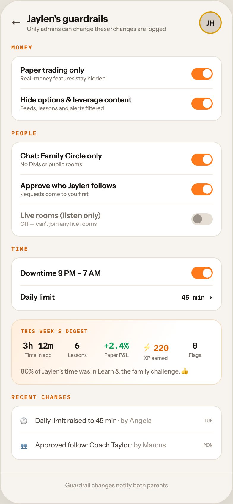

# F3 PARENTAL CONTROLS

Canvas: **CHEAT CODE · FAMILY MODE** · board index 2 · slug `03-f3-parental-controls`
Frame: **392×846px** (design width 392px — port at 390px logical, scale ratios).

> Style values are EXACT computed values from the canvas. `T.*` = canvas token, resolved in
> the Tokens appendix at the bottom of this file. Text marked `(MOCK)` must not ship as drawn —
> see `../../DELTA.md` for its substitution rule.

## Tree

- **“← Jaylen's guardrails Only admins can ch…”** → `
`
  - box: 392x846 · display: flex · dir: column · width: 390px · height: 844px · bg: T.orange-50 · border: 1px solid T.orange-100-b · radius: 34px (T.r17) · shadow: T.orange-900a10 0px 20px 46px 0px · overflow: hidden · type: color T.neutral-950 / Instrument Sans / 16px / w400 / lh normal
  - **“← Jaylen's guardrails Only admins can ch…”** → `
`
    - box: 390x794 · flex: 1 1 0% · flex-grow: 1 · flex-basis: 0% · pad: 18px 18px 0px 18px · overflow: hidden
    - **“← Jaylen's guardrails Only admins can ch…”** → `
`
      - box: 354x38 · display: flex · align: center · gap: 10px
      - **"←"** → ``
        - box: 16x20 · type: color T.orange-700 · scale: T.ty17
        - text: "←"
      - **“Jaylen's guardrails Only admins can chan…”** → `
`
        - box: 280x34 · flex: 1 1 0% · flex-grow: 1 · flex-basis: 0%
        - **"Jaylen's guardrails"** → `
`
          - box: 280x20 · type: color T.orange-900 / w800 · scale: T.ty19
          - text: "Jaylen's guardrails"
        - **"Only admins can change these · changes are l"** → `
`
          - box: 280x13 · margin: 1px 0px 0px 0px · type: color T.neutral-500 / 10px · scale: T.ty65
          - text: "Only admins can change these · changes are logged"
      - **"JH"** → `
`
        - box: 38x38 · display: grid · align: center · justify-items: center · grid-cols: 34px · grid-rows: 34px · width: 34px · height: 34px · bg: T.orange-100-c · border: 2px solid T.amber-500 · radius: 50% (T.r18) · type: color T.orange-900 / 12px / w800 · scale: T.ty41
        - text: "JH"
    - **"Money"** → `
`
      - box: 354x13 · margin: 16px 0px 0px 0px · type: color T.orange-500 / IBM Plex Mono / 9.5px / w600 / ls 1.52px / uppercase · scale: T.ty71
      - text: "Money"
    - **“Paper trading only Real-money features s…”** → `
`
      - box: 354x109 · pad: 4px 14px 4px 14px · margin: 8px 0px 0px 0px · bg: T.neutral-0 · border: 1px solid T.orange-100 · radius: 14px (T.r13)
      - **“Paper trading only Real-money features s…”** → `
`
        - box: 324x50 · display: flex · align: center · gap: 10px · pad: 11px 0px 11px 0px · border: T:0px none T.neutral-950 R:0px none T.neutral-950 B:1px solid T.orange-50-b L:0px none T.neutral-950
        - **“Paper trading only Real-money features s…”** → `
`
          - box: 278x27 · flex: 1 1 0% · flex-grow: 1 · flex-basis: 0%
          - **"Paper trading only"** → `
`
            - box: 278x15 · type: color T.orange-900 / 12.5px / w600 · scale: T.ty35
            - text: "Paper trading only"
          - **"Real-money features stay hidden"** → `
`
            - box: 278x11 · margin: 1px 0px 0px 0px · type: color T.neutral-500 / 9.5px · scale: T.ty70
            - text: "Real-money features stay hidden"
        - **block[1]** → ``
          - box: 36x20 · width: 36px · height: 20px · bg: T.orange-400-b · radius: 11px (T.r10) · position: relative [0px 0px 0px 0px]
          - **block[0]** → ``
            - box: 15x15 · width: 15px · height: 15px · bg: T.neutral-0 · radius: 50% (T.r18) · position: absolute [2.5px 2.5px 2.5px 18.5px]
      - **“Hide options & leverage content Feeds, l…”** → `
`
        - box: 324x49 · display: flex · align: center · gap: 10px · pad: 11px 0px 11px 0px
        - **“Hide options & leverage content Feeds, l…”** → `
`
          - box: 278x27 · flex: 1 1 0% · flex-grow: 1 · flex-basis: 0%
          - **"Hide options & leverage content"** → `
`
            - box: 278x15 · type: color T.orange-900 / 12.5px / w600 · scale: T.ty35
            - text: "Hide options & leverage content"
          - **"Feeds, lessons and alerts filtered"** → `
`
            - box: 278x11 · margin: 1px 0px 0px 0px · type: color T.neutral-500 / 9.5px · scale: T.ty70
            - text: "Feeds, lessons and alerts filtered"
        - **block[1]** → ``
          - box: 36x20 · width: 36px · height: 20px · bg: T.orange-400-b · radius: 11px (T.r10) · position: relative [0px 0px 0px 0px]
          - **block[0]** → ``
            - box: 15x15 · width: 15px · height: 15px · bg: T.neutral-0 · radius: 50% (T.r18) · position: absolute [2.5px 2.5px 2.5px 18.5px]
    - **"People"** → `
`
      - box: 354x13 · margin: 14px 0px 0px 0px · type: color T.orange-500 / IBM Plex Mono / 9.5px / w600 / ls 1.52px / uppercase · scale: T.ty71
      - text: "People"
    - **“Chat: Family Circle only No DMs or publi…”** → `
`
      - box: 354x159 · pad: 4px 14px 4px 14px · margin: 8px 0px 0px 0px · bg: T.neutral-0 · border: 1px solid T.orange-100 · radius: 14px (T.r13)
      - **“Chat: Family Circle only No DMs or publi…”** → `
`
        - box: 324x50 · display: flex · align: center · gap: 10px · pad: 11px 0px 11px 0px · border: T:0px none T.neutral-950 R:0px none T.neutral-950 B:1px solid T.orange-50-b L:0px none T.neutral-950
        - **“Chat: Family Circle only No DMs or publi…”** → `
`
          - box: 278x27 · flex: 1 1 0% · flex-grow: 1 · flex-basis: 0%
          - **"Chat: Family Circle only"** → `
`
            - box: 278x15 · type: color T.orange-900 / 12.5px / w600 · scale: T.ty35
            - text: "Chat: Family Circle only"
          - **"No DMs or public rooms"** → `
`
            - box: 278x11 · margin: 1px 0px 0px 0px · type: color T.neutral-500 / 9.5px · scale: T.ty70
            - text: "No DMs or public rooms"
        - **block[1]** → ``
          - box: 36x20 · width: 36px · height: 20px · bg: T.orange-400-b · radius: 11px (T.r10) · position: relative [0px 0px 0px 0px]
          - **block[0]** → ``
            - box: 15x15 · width: 15px · height: 15px · bg: T.neutral-0 · radius: 50% (T.r18) · position: absolute [2.5px 2.5px 2.5px 18.5px]
      - **“Approve who Jaylen follows Requests come…”** → `
`
        - box: 324x50 · display: flex · align: center · gap: 10px · pad: 11px 0px 11px 0px · border: T:0px none T.neutral-950 R:0px none T.neutral-950 B:1px solid T.orange-50-b L:0px none T.neutral-950
        - **“Approve who Jaylen follows Requests come…”** → `
`
          - box: 278x27 · flex: 1 1 0% · flex-grow: 1 · flex-basis: 0%
          - **"Approve who Jaylen follows"** → `
`
            - box: 278x15 · type: color T.orange-900 / 12.5px / w600 · scale: T.ty35
            - text: "Approve who Jaylen follows"
          - **"Requests come to you first"** → `
`
            - box: 278x11 · margin: 1px 0px 0px 0px · type: color T.neutral-500 / 9.5px · scale: T.ty70
            - text: "Requests come to you first"
        - **block[1]** → ``
          - box: 36x20 · width: 36px · height: 20px · bg: T.orange-400-b · radius: 11px (T.r10) · position: relative [0px 0px 0px 0px]
          - **block[0]** → ``
            - box: 15x15 · width: 15px · height: 15px · bg: T.neutral-0 · radius: 50% (T.r18) · position: absolute [2.5px 2.5px 2.5px 18.5px]
      - **“Live rooms (listen only) Off — can't joi…”** → `
`
        - box: 324x49 · display: flex · align: center · gap: 10px · pad: 11px 0px 11px 0px
        - **“Live rooms (listen only) Off — can't joi…”** → `
`
          - box: 278x27 · flex: 1 1 0% · flex-grow: 1 · flex-basis: 0%
          - **"Live rooms (listen only)"** → `
`
            - box: 278x15 · type: color T.neutral-500 / 12.5px / w600 · scale: T.ty35
            - text: "Live rooms (listen only)"
          - **"Off — can't join any live rooms"** → `
`
            - box: 278x11 · margin: 1px 0px 0px 0px · type: color T.orange-400 / 9.5px · scale: T.ty70
            - text: "Off — can't join any live rooms"
        - **block[1]** → ``
          - box: 36x20 · width: 36px · height: 20px · bg: T.orange-100 · radius: 11px (T.r10) · position: relative [0px 0px 0px 0px]
          - **block[0]** → ``
            - box: 15x15 · width: 15px · height: 15px · bg: T.orange-400 · radius: 50% (T.r18) · position: absolute [2.5px 18.5px 2.5px 2.5px]
    - **"Time"** → `
`
      - box: 354x13 · margin: 14px 0px 0px 0px · type: color T.orange-500 / IBM Plex Mono / 9.5px / w600 / ls 1.52px / uppercase · scale: T.ty71
      - text: "Time"
    - **“Downtime 9 PM – 7 AM Daily limit 45 min …”** → `
`
      - box: 354x90 · pad: 4px 14px 4px 14px · margin: 8px 0px 0px 0px · bg: T.neutral-0 · border: 1px solid T.orange-100 · radius: 14px (T.r13)
      - **“Downtime 9 PM – 7 AM…”** → `
`
        - box: 324x43 · display: flex · align: center · gap: 10px · pad: 11px 0px 11px 0px · border: T:0px none T.neutral-950 R:0px none T.neutral-950 B:1px solid T.orange-50-b L:0px none T.neutral-950
        - **“Downtime 9 PM – 7 AM…”** → `
`
          - box: 278x15 · flex: 1 1 0% · flex-grow: 1 · flex-basis: 0%
          - **"Downtime 9 PM – 7 AM"** → `
`
            - box: 278x15 · type: color T.orange-900 / 12.5px / w600 · scale: T.ty35
            - text: "Downtime 9 PM – 7 AM"
        - **block[1]** → ``
          - box: 36x20 · width: 36px · height: 20px · bg: T.orange-400-b · radius: 11px (T.r10) · position: relative [0px 0px 0px 0px]
          - **block[0]** → ``
            - box: 15x15 · width: 15px · height: 15px · bg: T.neutral-0 · radius: 50% (T.r18) · position: absolute [2.5px 2.5px 2.5px 18.5px]
      - **“Daily limit 45 min ›…”** → `
`
        - box: 324x37 · display: flex · align: center · gap: 10px · pad: 11px 0px 11px 0px
        - **“Daily limit…”** → `
`
          - box: 261.2x15 · flex: 1 1 0% · flex-grow: 1 · flex-basis: 0%
          - **"Daily limit"** → `
`
            - box: 261.2x15 · type: color T.orange-900 / 12.5px / w600 · scale: T.ty35
            - text: "Daily limit"
        - **"45 min ›"** → ``
          - box: 52.8x14 · type: color T.orange-900 / IBM Plex Mono / 11px / w600 · scale: T.ty52
          - text: "45 min ›"
    - **“THIS WEEK'S DIGEST 3h 12m Time in app 6 …”** → `
`
      - box: 354x109.8 · pad: 13px 15px 13px 15px · margin: 14px 0px 0px 0px · bg-image: linear-gradient(120deg, T.orange-50-c 0%, T.neutral-0 70%) · border: 1px solid T.orange-100-d · radius: 16px (T.r14)
      - **"This week's digest"** → `
`
        - box: 322x11 · type: color T.orange-500 / IBM Plex Mono / 8.5px / w600 / ls 1.19px / uppercase · scale: T.ty87
        - text: "This week's digest"
      - **“3h 12m Time in app 6 Lessons +2.4% Paper…”** → `
`
        - box: 322x35 · display: flex · gap: 8px · margin: 10px 0px 0px 0px
        - **“3h 12m Time in app…”** → `
`
          - box: 58x35 · flex: 1 1 0% · flex-grow: 1 · flex-basis: 0% · type: align-center
          - **"3h 12m"** → `
`
            - box: 58x18 · type: color T.orange-900 / IBM Plex Mono / 14px / w600 · scale: T.ty26
            - text: "3h 12m"
          - **"Time in app"** → `
`
            - box: 58x10 · margin: 2px 0px 0px 0px · type: color T.neutral-500 / 8.5px · scale: T.ty84
            - text: "Time in app"
        - **“6 Lessons…”** → `
`
          - box: 58x35 · flex: 1 1 0% · flex-grow: 1 · flex-basis: 0% · type: align-center
          - **"6"** → `
`
            - box: 58x18 · type: color T.orange-900 / IBM Plex Mono / 14px / w600 · scale: T.ty26
            - text: "6"
          - **"Lessons"** → `
`
            - box: 58x10 · margin: 2px 0px 0px 0px · type: color T.neutral-500 / 8.5px · scale: T.ty84
            - text: "Lessons"
        - **“+2.4% Paper P&L…”** → `
`
          - box: 58x35 · flex: 1 1 0% · flex-grow: 1 · flex-basis: 0% · type: align-center
          - **"+2.4%"** **(MOCK)** → `
`
            - box: 58x18 · type: color T.teal-600 / IBM Plex Mono / 14px / w600 · scale: T.ty26
            - text: "+2.4%"
          - **"Paper P&L"** → `
`
            - box: 58x10 · margin: 2px 0px 0px 0px · type: color T.neutral-500 / 8.5px · scale: T.ty84
            - text: "Paper P&L"
        - **“⚡220 XP earned…”** → `
`
          - box: 58x35 · flex: 1 1 0% · flex-grow: 1 · flex-basis: 0% · type: align-center
          - **"⚡220"** → `
`
            - box: 58x23 · type: color T.orange-500 / IBM Plex Mono / 14px / w600 · scale: T.ty26
            - text: "⚡220"
          - **"XP earned"** → `
`
            - box: 58x10 · margin: 2px 0px 0px 0px · type: color T.neutral-500 / 8.5px · scale: T.ty84
            - text: "XP earned"
        - **“0 Flags…”** → `
`
          - box: 58x35 · flex: 1 1 0% · flex-grow: 1 · flex-basis: 0% · type: align-center
          - **"0"** → `
`
            - box: 58x18 · type: color T.orange-900 / IBM Plex Mono / 14px / w600 · scale: T.ty26
            - text: "0"
          - **"Flags"** → `
`
            - box: 58x10 · margin: 2px 0px 0px 0px · type: color T.neutral-500 / 8.5px · scale: T.ty84
            - text: "Flags"
      - **"80% of Jaylen's time was in Learn & the fami"** **(MOCK)** → `
`
        - box: 322x15.8 · margin: 10px 0px 0px 0px · type: color T.orange-500-b / 10.5px / lh 15.75px · scale: T.ty63
        - text: "80% of Jaylen's time was in Learn & the family challenge. 👍"
    - **"Recent changes"** → `
`
      - box: 354x13 · margin: 14px 0px 0px 0px · type: color T.orange-500 / IBM Plex Mono / 9.5px / w600 / ls 1.52px / uppercase · scale: T.ty71
      - text: "Recent changes"
    - **“🕐 Daily limit raised to 45 min · by Ang…”** → `
`
      - box: 354x91 · pad: 4px 14px 4px 14px · margin: 8px 0px 0px 0px · bg: T.neutral-0 · border: 1px solid T.orange-100 · radius: 14px (T.r13)
      - **“🕐 Daily limit raised to 45 min · by Ang…”** → `
`
        - box: 324x41 · display: flex · align: center · gap: 10px · pad: 10px 0px 10px 0px · border: T:0px none T.neutral-950 R:0px none T.neutral-950 B:1px solid T.orange-50-b L:0px none T.neutral-950
        - **"🕐"** → ``
          - box: 15x20 · type: 12px · scale: T.ty38
          - text: "🕐"
        - **"Daily limit raised to 45 min"** → ``
          - box: 273.7x14 · flex: 1 1 0% · flex-grow: 1 · flex-basis: 0% · type: color T.orange-700 / 11.5px · scale: T.ty45
          - text: "Daily limit raised to 45 min"
          - **"· by Angela"** → ``
            - box: 56.2x14 · display: inline · type: color T.orange-400 · scale: T.ty45
            - text: "· by Angela"
        - **"TUE"** → ``
          - box: 15.3x11 · type: color T.orange-400 / IBM Plex Mono / 8.5px · scale: T.ty85
          - text: "TUE"
      - **“👥 Approved follow: Coach Taylor · by Ma…”** → `
`
        - box: 324x40 · display: flex · align: center · gap: 10px · pad: 10px 0px 10px 0px
        - **"👥"** → ``
          - box: 15x20 · type: 12px · scale: T.ty38
          - text: "👥"
        - **"Approved follow: Coach Taylor"** → ``
          - box: 273.7x14 · flex: 1 1 0% · flex-grow: 1 · flex-basis: 0% · type: color T.orange-700 / 11.5px · scale: T.ty45
          - text: "Approved follow: Coach Taylor"
          - **"· by Marcus"** → ``
            - box: 57.5x14 · display: inline · type: color T.orange-400 · scale: T.ty45
            - text: "· by Marcus"
        - **"MON"** → ``
          - box: 15.3x11 · type: color T.orange-400 / IBM Plex Mono / 8.5px · scale: T.ty85
          - text: "MON"
  - **“Guardrail changes notify both parents…”** → `
`
    - box: 390x50 · pad: 12px 18px 24px 18px · border: T:1px solid T.orange-100 R:0px none T.neutral-950 B:0px none T.neutral-950 L:0px none T.neutral-950
    - **"Guardrail changes notify both parents"** → `
`
      - box: 354x13 · type: color T.orange-400 / 10px / align-center · scale: T.ty65
      - text: "Guardrail changes notify both parents"

## Tokens used in this board

| token | value | role |
| --- | --- | --- |
| T.orange-900 | `#1A1614` | text, border, bg |
| T.neutral-950 | `#000000` | text, border |
| T.neutral-500 | `#7B7369` | text, bg |
| T.neutral-0 | `#FFFFFF` | bg, text, gradient |
| T.orange-400 | `#9B9289` | text, bg |
| T.orange-100 | `#E5DFD5` | border, bg |
| T.orange-500 | `#D95E00` | text |
| T.orange-400-b | `#FF7A1A` | bg, gradient, text, border |
| T.orange-50 | `#F7F4EF` | bg, border, text |
| T.orange-50-b | `#EFE9DE` | bg, gradient, border |
| T.teal-600 | `#0BA05A` | bg, text |
| T.orange-50-c | `#FFEEDD` | gradient, bg |
| T.orange-100-b | `#E0DACE` | border, gradient |
| T.orange-100-c | `#D8D0C4` | bg |
| T.orange-900a10 | `#1A1614/0.1` | shadow |
| T.orange-700 | `#4E463E` | text |
| T.amber-500 | `#D99A00` | border, bg, gradient |
| T.orange-100-d | `#F2DCC2` | border |
| T.orange-500-b | `#7A6A5E` | text |
| T.ty17 | Instrument Sans 16px/normal w400 ls:normal | type scale |
| T.ty19 | Instrument Sans 16px/normal w800 ls:normal | type scale |
| T.ty26 | IBM Plex Mono 14px/normal w600 ls:normal | type scale |
| T.ty35 | Instrument Sans 12.5px/normal w600 ls:normal | type scale |
| T.ty38 | Instrument Sans 12px/normal w400 ls:normal | type scale |
| T.ty41 | Instrument Sans 12px/normal w800 ls:normal | type scale |
| T.ty45 | Instrument Sans 11.5px/normal w400 ls:normal | type scale |
| T.ty52 | IBM Plex Mono 11px/normal w600 ls:normal | type scale |
| T.ty63 | Instrument Sans 10.5px/15.75px w400 ls:normal | type scale |
| T.ty65 | Instrument Sans 10px/normal w400 ls:normal | type scale |
| T.ty70 | Instrument Sans 9.5px/normal w400 ls:normal | type scale |
| T.ty71 | IBM Plex Mono 9.5px/normal w600 ls:1.52px uppercase | type scale |
| T.ty84 | Instrument Sans 8.5px/normal w400 ls:normal | type scale |
| T.ty85 | IBM Plex Mono 8.5px/normal w400 ls:normal | type scale |
| T.ty87 | IBM Plex Mono 8.5px/normal w600 ls:1.19px uppercase | type scale |
| T.r10 | `11px` | radius |
| T.r13 | `14px` | radius |
| T.r14 | `16px` | radius |
| T.r17 | `34px` | radius |
| T.r18 | `50%` | radius |
