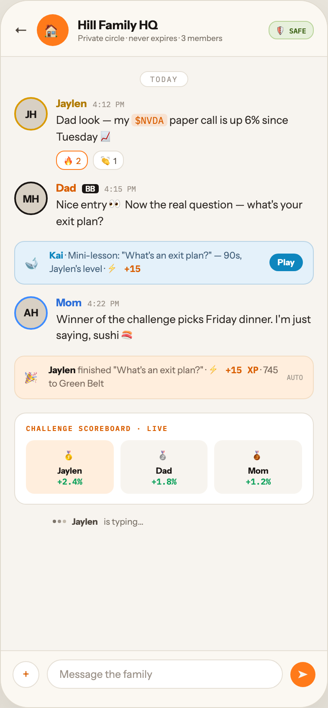

# F4 FAMILY CIRCLE

Canvas: **CHEAT CODE · FAMILY MODE** · board index 3 · slug `04-f4-family-circle`
Frame: **392×846px** (design width 392px — port at 390px logical, scale ratios).

> Style values are EXACT computed values from the canvas. `T.*` = canvas token, resolved in
> the Tokens appendix at the bottom of this file. Text marked `(MOCK)` must not ship as drawn —
> see `../../DELTA.md` for its substitution rule.

## Tree

- **“← 🏠 Hill Family HQ Private circle · nev…”** → `
`
  - box: 392x846 · display: flex · dir: column · width: 390px · height: 844px · bg: T.orange-50 · border: 1px solid T.orange-100-b · radius: 34px (T.r17) · shadow: T.orange-900a10 0px 20px 46px 0px · overflow: hidden · type: color T.neutral-950 / Instrument Sans / 16px / w400 / lh normal
  - **“← 🏠 Hill Family HQ Private circle · nev…”** → `
`
    - box: 390x67 · pad: 16px 16px 12px 16px · bg: T.amber-0 · border: T:0px none T.neutral-950 R:0px none T.neutral-950 B:1px solid T.orange-100 L:0px none T.neutral-950
    - **“← 🏠 Hill Family HQ Private circle · nev…”** → `
`
      - box: 358x38 · display: flex · align: center · gap: 11px
      - **"←"** → ``
        - box: 16x20 · type: color T.orange-700 · scale: T.ty17
        - text: "←"
      - **"🏠"** → `
`
        - box: 38x38 · display: grid · align: center · justify-items: center · grid-cols: 38px · grid-rows: 38px · width: 38px · height: 38px · flex: 0 0 auto · flex-shrink: 0 · bg: T.orange-400-b · radius: 50% (T.r18) · scale: T.ty17
        - text: "🏠"
      - **“Hill Family HQ Private circle · never ex…”** → `
`
        - box: 216.5x30 · min-width: 0px · flex: 1 1 0% · flex-grow: 1 · flex-basis: 0%
        - **"Hill Family HQ"** → `
`
          - box: 216.5x18 · type: color T.orange-900 / 14.5px / w800 · scale: T.ty24
          - text: "Hill Family HQ"
        - **"Private circle · never expires · 3 members"** **(MOCK)** → `
`
          - box: 216.5x11 · margin: 1px 0px 0px 0px · type: color T.neutral-500 / 9.5px · scale: T.ty70
          - text: "Private circle · never expires · 3 members"
      - **"🛡 SAFE"** → ``
        - box: 54.5x22 · pad: 3px 8px 3px 8px · bg: T.lime-50 · border: 1px solid T.lime-200 · radius: 10px (T.r9) · type: color T.lime-700 / IBM Plex Mono / 8.5px / w700 · scale: T.ty86
        - text: "🛡 SAFE"
  - **“TODAY JH Jaylen 4:12 PM Dad look — my $N…”** → `
`
    - box: 390x709 · display: flex · dir: column · gap: 14px · flex: 1 1 0% · flex-grow: 1 · flex-basis: 0% · pad: 14px 16px 0px 16px · overflow: hidden
    - **“TODAY…”** → `
`
      - box: 358x20 · type: align-center
      - **"TODAY"** → ``
        - box: 57.3x19 · display: inline · pad: 3px 11px 3px 11px · bg: T.neutral-0 · border: 1px solid T.orange-100 · radius: 10px (T.r9) · type: color T.orange-400 / IBM Plex Mono / 9px / ls 1.26px · scale: T.ty82
        - text: "TODAY"
    - **“JH Jaylen 4:12 PM Dad look — my $NVDA pa…”** → `
`
      - box: 358x87 · display: flex · gap: 10px
      - **"JH"** → `
`
        - box: 40x40 · display: grid · align: center · justify-items: center · grid-cols: 36px · grid-rows: 36px · width: 36px · height: 36px · flex: 0 0 auto · flex-shrink: 0 · bg: T.orange-100-c · border: 2px solid T.amber-500 · radius: 50% (T.r18) · type: color T.orange-900 / 12px / w700 · scale: T.ty40
        - text: "JH"
      - **“Jaylen 4:12 PM Dad look — my $NVDA paper…”** → `
`
        - box: 308x87 · min-width: 0px · flex: 1 1 0% · flex-grow: 1 · flex-basis: 0%
        - **“Jaylen 4:12 PM…”** → `
`
          - box: 308x15 · display: flex · align: baseline · gap: 7px
          - **"Jaylen"** → ``
            - box: 36.8x15 · type: color T.amber-600 / 12.5px / w700 · scale: T.ty34
            - text: "Jaylen"
          - **"4:12 PM"** → ``
            - box: 37.8x11 · type: color T.orange-400 / IBM Plex Mono / 9px · scale: T.ty78
            - text: "4:12 PM"
        - **"Dad look — my paper call is up 6% since Tues"** **(MOCK)** → `
`
          - box: 308x39 · margin: 3px 0px 0px 0px · type: color T.orange-800 / 13px / lh 19.5px · scale: T.ty31
          - text: "Dad look — my paper call is up 6% since Tuesday 📈"
          - **"$NVDA"** → ``
            - box: 42.5x15 · display: inline · pad: 0px 4px 0px 4px · bg: T.orange-400a14 · radius: 4px (T.r5) · type: color T.orange-500 / IBM Plex Mono / 11.5px / lh 17.25px · scale: T.ty47
            - text: "$NVDA"
        - **“🔥 2 👏 1…”** → `
`
          - box: 308x23 · display: flex · gap: 6px · margin: 7px 0px 0px 0px
          - **"🔥 2"** → ``
            - box: 38.5x23 · pad: 2px 8px 2px 8px · bg: T.neutral-0 · border: 1px solid T.orange-400-b · radius: 10px (T.r9) · type: color T.orange-500 / 10px · scale: T.ty65
            - text: "🔥 2"
          - **"👏 1"** → ``
            - box: 36.9x23 · pad: 2px 8px 2px 8px · bg: T.neutral-0 · border: 1px solid T.orange-100 · radius: 10px (T.r9) · type: color T.orange-700 / 10px · scale: T.ty65
            - text: "👏 1"
    - **“MH Dad BB 4:15 PM Nice entry 👀 Now the …”** → `
`
      - box: 358x57 · display: flex · gap: 10px
      - **"MH"** → `
`
        - box: 40x40 · display: grid · align: center · justify-items: center · grid-cols: 36px · grid-rows: 36px · width: 36px · height: 36px · flex: 0 0 auto · flex-shrink: 0 · bg: T.orange-100-c · border: 2px solid T.orange-900 · radius: 50% (T.r18) · type: color T.orange-900 / 12px / w700 · scale: T.ty40
        - text: "MH"
      - **“Dad BB 4:15 PM Nice entry 👀 Now the rea…”** → `
`
        - box: 308x57 · min-width: 0px · flex: 1 1 0% · flex-grow: 1 · flex-basis: 0%
        - **“Dad BB 4:15 PM…”** → `
`
          - box: 308x15 · display: flex · align: baseline · gap: 7px
          - **"Dad"** → ``
            - box: 24.1x15 · type: color T.orange-500 / 12.5px / w700 · scale: T.ty34
            - text: "Dad"
          - **"BB"** → ``
            - box: 19.6x11 · pad: 0px 4px 0px 4px · bg: T.orange-900 · radius: 3px (T.r4) · type: color T.orange-50 / 9px / w700 · scale: T.ty76
            - text: "BB"
          - **"4:15 PM"** → ``
            - box: 37.8x11 · type: color T.orange-400 / IBM Plex Mono / 9px · scale: T.ty78
            - text: "4:15 PM"
        - **"Nice entry 👀 Now the real question — what's"** → `
`
          - box: 308x39 · margin: 3px 0px 0px 0px · type: color T.orange-800 / 13px / lh 19.5px · scale: T.ty31
          - text: "Nice entry 👀 Now the real question — what's your exit plan?"
    - **“🐋 Kai · Mini-lesson: "What's an exit pl…”** → `
`
      - box: 358x51.9 · display: flex · align: center · gap: 10px · pad: 9px 12px 9px 12px · bg: T.blue-50 · border: 1px solid T.blue-100 · radius: 12px (T.r11)
      - **"🐋"** → ``
        - box: 19x25 · type: 15px · scale: T.ty21
        - text: "🐋"
      - **"· Mini-lesson: \"What's an exit plan?\" — 90s,"** → `
`
        - box: 252.8x31.9 · flex: 1 1 0% · flex-grow: 1 · flex-basis: 0% · type: color T.blue-600 / 11px / lh 15.95px · scale: T.ty54
        - text: "· Mini-lesson: \"What's an exit plan?\" — 90s, Jaylen's level ·"
        - **"Kai"** → `<strong>`
          - box: 16.5x14 · display: inline · type: color T.blue-500 / w700 · scale: T.ty55
          - text: "Kai"
        - **"⚡ +15"** **(MOCK)** → ``
          - box: 40.4x14 · display: inline · type: color T.orange-500 / IBM Plex Mono / w700 · scale: T.ty56
          - text: "⚡ +15"
      - **"Play"** → ``
        - box: 40.2x21 · flex: 0 0 auto · flex-shrink: 0 · pad: 4px 10px 4px 10px · bg: T.blue-500 · radius: 12px (T.r11) · type: color T.neutral-0 / 10px / w700 · scale: T.ty68
        - text: "Play"
    - **“AH Mom 4:22 PM Winner of the challenge p…”** → `
`
      - box: 358x57 · display: flex · gap: 10px
      - **"AH"** → `
`
        - box: 40x40 · display: grid · align: center · justify-items: center · grid-cols: 36px · grid-rows: 36px · width: 36px · height: 36px · flex: 0 0 auto · flex-shrink: 0 · bg: T.orange-100-c · border: 2px solid T.blue-300 · radius: 50% (T.r18) · type: color T.orange-900 / 12px / w700 · scale: T.ty40
        - text: "AH"
      - **“Mom 4:22 PM Winner of the challenge pick…”** → `
`
        - box: 308x57 · min-width: 0px · flex: 1 1 0% · flex-grow: 1 · flex-basis: 0%
        - **“Mom 4:22 PM…”** → `
`
          - box: 308x15 · display: flex · align: baseline · gap: 7px
          - **"Mom"** → ``
            - box: 30.6x15 · type: color T.blue-400 / 12.5px / w700 · scale: T.ty34
            - text: "Mom"
          - **"4:22 PM"** → ``
            - box: 37.8x11 · type: color T.orange-400 / IBM Plex Mono / 9px · scale: T.ty78
            - text: "4:22 PM"
        - **"Winner of the challenge picks Friday dinner."** → `
`
          - box: 308x39 · margin: 3px 0px 0px 0px · type: color T.orange-800 / 13px / lh 19.5px · scale: T.ty31
          - text: "Winner of the challenge picks Friday dinner. I'm just saying, sushi 🍣"
    - **“🎉 Jaylen finished "What's an exit plan?…”** → `
`
      - box: 358x51.9 · display: flex · align: center · gap: 10px · pad: 9px 12px 9px 12px · bg: T.orange-50-c · border: 1px solid T.orange-100-d · radius: 12px (T.r11)
      - **"🎉"** → ``
        - box: 18x23 · type: 14px · scale: T.ty25
        - text: "🎉"
      - **"finished \"What's an exit plan?\" · · 745 to G"** → `
`
        - box: 274.8x31.9 · flex: 1 1 0% · flex-grow: 1 · flex-basis: 0% · type: color T.orange-500-b / 11px / lh 15.95px · scale: T.ty54
        - text: "finished \"What's an exit plan?\" · · 745 to Green Belt"
        - **"Jaylen"** → `<strong>`
          - box: 32.4x14 · display: inline · type: color T.orange-900 / w700 · scale: T.ty55
          - text: "Jaylen"
        - **"⚡ +15 XP"** **(MOCK)** → ``
          - box: 60.2x14 · display: inline · type: color T.orange-500 / IBM Plex Mono / w700 · scale: T.ty56
          - text: "⚡ +15 XP"
      - **"AUTO"** → ``
        - box: 19.2x10 · type: color T.orange-400 / IBM Plex Mono / 8px · scale: T.ty89
        - text: "AUTO"
    - **“CHALLENGE SCOREBOARD · LIVE 🥇 Jaylen +2…”** → `
`
      - box: 358x110 · pad: 12px 13px 12px 13px · margin: 2px 0px 0px 0px · bg: T.neutral-0 · border: 1px solid T.orange-100 · radius: 14px (T.r13)
      - **"Challenge scoreboard · live"** → `
`
        - box: 330x11 · type: color T.orange-500 / IBM Plex Mono / 8.5px / w600 / ls 1.19px / uppercase · scale: T.ty87
        - text: "Challenge scoreboard · live"
      - **“🥇 Jaylen +2.4% 🥈 Dad +1.8% 🥉 Mom +1.2…”** → `
`
        - box: 330x64 · display: flex · gap: 8px · margin: 9px 0px 0px 0px
        - **“🥇 Jaylen +2.4%…”** → `
`
          - box: 104.7x64 · flex: 1 1 0% · flex-grow: 1 · flex-basis: 0% · pad: 8px 4px 8px 4px · bg: T.orange-50-c · radius: 10px (T.r9) · type: align-center
          - **"🥇"** → `
`
            - box: 96.7x20 · type: 12px · scale: T.ty38
            - text: "🥇"
          - **"Jaylen"** → `
`
            - box: 96.7x13 · margin: 2px 0px 0px 0px · type: color T.orange-900 / 10px / w700 · scale: T.ty68
            - text: "Jaylen"
          - **"+2.4%"** **(MOCK)** → `
`
            - box: 96.7x13 · type: color T.teal-600 / IBM Plex Mono / 10px / w600 · scale: T.ty66
            - text: "+2.4%"
        - **“🥈 Dad +1.8%…”** → `
`
          - box: 104.7x64 · flex: 1 1 0% · flex-grow: 1 · flex-basis: 0% · pad: 8px 4px 8px 4px · bg: T.orange-50 · radius: 10px (T.r9) · type: align-center
          - **"🥈"** → `
`
            - box: 96.7x20 · type: 12px · scale: T.ty38
            - text: "🥈"
          - **"Dad"** → `
`
            - box: 96.7x13 · margin: 2px 0px 0px 0px · type: color T.orange-900 / 10px / w700 · scale: T.ty68
            - text: "Dad"
          - **"+1.8%"** **(MOCK)** → `
`
            - box: 96.7x13 · type: color T.teal-600 / IBM Plex Mono / 10px / w600 · scale: T.ty66
            - text: "+1.8%"
        - **“🥉 Mom +1.2%…”** → `
`
          - box: 104.7x64 · flex: 1 1 0% · flex-grow: 1 · flex-basis: 0% · pad: 8px 4px 8px 4px · bg: T.orange-50 · radius: 10px (T.r9) · type: align-center
          - **"🥉"** → `
`
            - box: 96.7x20 · type: 12px · scale: T.ty38
            - text: "🥉"
          - **"Mom"** → `
`
            - box: 96.7x13 · margin: 2px 0px 0px 0px · type: color T.orange-900 / 10px / w700 · scale: T.ty68
            - text: "Mom"
          - **"+1.2%"** **(MOCK)** → `
`
            - box: 96.7x13 · type: color T.teal-600 / IBM Plex Mono / 10px / w600 · scale: T.ty66
            - text: "+1.2%"
    - **"is typing…"** → `
`
      - box: 358x13 · display: flex · align: center · gap: 7px · pad: 0px 0px 0px 46px · type: color T.neutral-500 / 10.5px · scale: T.ty64
      - text: "is typing…"
      - **block[0]** → ``
        - box: 16x4 · display: flex · gap: 2px
        - **block[0]** → ``
          - box: 4x4 · width: 4px · height: 4px · bg: T.neutral-500 · radius: 50% (T.r18)
        - **block[1]** → ``
          - box: 4x4 · width: 4px · height: 4px · bg: T.orange-400 · radius: 50% (T.r18)
        - **block[2]** → ``
          - box: 4x4 · width: 4px · height: 4px · bg: T.orange-200 · radius: 50% (T.r18)
      - **"Jaylen"** → `<strong>`
        - box: 30.9x13 · type: color T.orange-700 / w700 · scale: T.ty61
        - text: "Jaylen"
  - **“+ Message the family ➤…”** → `
`
    - box: 390x68 · pad: 10px 14px 22px 14px · bg: T.amber-0 · border: T:1px solid T.orange-100 R:0px none T.neutral-950 B:0px none T.neutral-950 L:0px none T.neutral-950
    - **“+ Message the family ➤…”** → `
`
      - box: 362x35 · display: flex · align: center · gap: 9px
      - **"+"** → ``
        - box: 32x32 · display: grid · align: center · justify-items: center · grid-cols: 30px · grid-rows: 30px · width: 30px · height: 30px · flex: 0 0 auto · flex-shrink: 0 · bg: T.neutral-0 · border: 1px solid T.orange-100 · radius: 50% (T.r18) · type: color T.orange-500 / 15px · scale: T.ty21
        - text: "+"
      - **"Message the family"** → `
`
        - box: 282x35 · flex: 1 1 0% · flex-grow: 1 · flex-basis: 0% · pad: 9px 14px 9px 14px · bg: T.neutral-0 · border: 1px solid T.orange-100 · radius: 20px (T.r16) · type: color T.orange-400 / 12.5px · scale: T.ty37
        - text: "Message the family"
      - **"➤"** → ``
        - box: 30x30 · display: grid · align: center · justify-items: center · grid-cols: 30px · grid-rows: 30px · width: 30px · height: 30px · flex: 0 0 auto · flex-shrink: 0 · bg: T.orange-400-b · radius: 50% (T.r18) · type: color T.orange-50 / 12px / w800 · scale: T.ty41
        - text: "➤"

## Tokens used in this board

| token | value | role |
| --- | --- | --- |
| T.orange-900 | `#1A1614` | text, border, bg |
| T.neutral-950 | `#000000` | text, border |
| T.neutral-500 | `#7B7369` | text, bg |
| T.neutral-0 | `#FFFFFF` | bg, text, gradient |
| T.orange-400 | `#9B9289` | text, bg |
| T.orange-100 | `#E5DFD5` | border, bg |
| T.orange-500 | `#D95E00` | text |
| T.orange-400-b | `#FF7A1A` | bg, gradient, text, border |
| T.orange-50 | `#F7F4EF` | bg, border, text |
| T.teal-600 | `#0BA05A` | bg, text |
| T.orange-50-c | `#FFEEDD` | gradient, bg |
| T.orange-100-b | `#E0DACE` | border, gradient |
| T.orange-100-c | `#D8D0C4` | bg |
| T.orange-800 | `#2E2925` | text |
| T.orange-900a10 | `#1A1614/0.1` | shadow |
| T.orange-700 | `#4E463E` | text |
| T.amber-500 | `#D99A00` | border, bg, gradient |
| T.orange-100-d | `#F2DCC2` | border |
| T.lime-50 | `#E7F0DC` | bg |
| T.lime-700 | `#3E6317` | text |
| T.blue-500 | `#0E86BE` | bg, text |
| T.blue-300 | `#3D8BFF` | border, bg |
| T.orange-200 | `#C4BBAD` | bg, border |
| T.blue-100 | `#B7D3E6` | border, text |
| T.lime-200 | `#B8D398` | border |
| T.blue-50 | `#E4F1FA` | bg |
| T.blue-600 | `#43607A` | text |
| T.orange-500-b | `#7A6A5E` | text |
| T.amber-0 | `#FBF8F2` | bg |
| T.amber-600 | `#B07A00` | text |
| T.orange-400a14 | `#FF7A1A/0.14` | bg |
| T.blue-400 | `#2D6FD9` | text |
| T.ty17 | Instrument Sans 16px/normal w400 ls:normal | type scale |
| T.ty21 | Instrument Sans 15px/normal w400 ls:normal | type scale |
| T.ty24 | Instrument Sans 14.5px/normal w800 ls:normal | type scale |
| T.ty25 | Instrument Sans 14px/normal w400 ls:normal | type scale |
| T.ty31 | Instrument Sans 13px/19.5px w400 ls:normal | type scale |
| T.ty34 | Instrument Sans 12.5px/normal w700 ls:normal | type scale |
| T.ty37 | Instrument Sans 12.5px/normal w400 ls:normal | type scale |
| T.ty38 | Instrument Sans 12px/normal w400 ls:normal | type scale |
| T.ty40 | Instrument Sans 12px/normal w700 ls:normal | type scale |
| T.ty41 | Instrument Sans 12px/normal w800 ls:normal | type scale |
| T.ty47 | IBM Plex Mono 11.5px/17.25px w400 ls:normal | type scale |
| T.ty54 | Instrument Sans 11px/15.95px w400 ls:normal | type scale |
| T.ty55 | Instrument Sans 11px/15.95px w700 ls:normal | type scale |
| T.ty56 | IBM Plex Mono 11px/15.95px w700 ls:normal | type scale |
| T.ty61 | Instrument Sans 10.5px/normal w700 ls:normal | type scale |
| T.ty64 | Instrument Sans 10.5px/normal w400 ls:normal | type scale |
| T.ty65 | Instrument Sans 10px/normal w400 ls:normal | type scale |
| T.ty66 | IBM Plex Mono 10px/normal w600 ls:normal | type scale |
| T.ty68 | Instrument Sans 10px/normal w700 ls:normal | type scale |
| T.ty70 | Instrument Sans 9.5px/normal w400 ls:normal | type scale |
| T.ty76 | Instrument Sans 9px/normal w700 ls:normal | type scale |
| T.ty78 | IBM Plex Mono 9px/normal w400 ls:normal | type scale |
| T.ty82 | IBM Plex Mono 9px/normal w400 ls:1.26px | type scale |
| T.ty86 | IBM Plex Mono 8.5px/normal w700 ls:normal | type scale |
| T.ty87 | IBM Plex Mono 8.5px/normal w600 ls:1.19px uppercase | type scale |
| T.ty89 | IBM Plex Mono 8px/normal w400 ls:normal | type scale |
| T.r4 | `3px` | radius |
| T.r5 | `4px` | radius |
| T.r9 | `10px` | radius |
| T.r11 | `12px` | radius |
| T.r13 | `14px` | radius |
| T.r16 | `20px` | radius |
| T.r17 | `34px` | radius |
| T.r18 | `50%` | radius |
