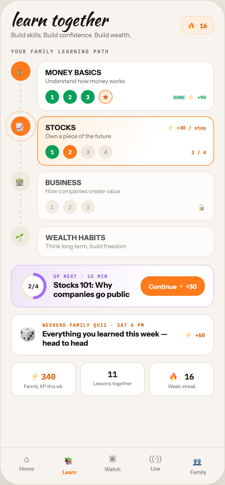

# F5 FAMILY LEARN

Canvas: **CHEAT CODE · FAMILY MODE** · board index 4 · slug `05-f5-family-learn`
Frame: **392×846px** (design width 392px — port at 390px logical, scale ratios).

> Style values are EXACT computed values from the canvas. `T.*` = canvas token, resolved in
> the Tokens appendix at the bottom of this file. Text marked `(MOCK)` must not ship as drawn —
> see `../../DELTA.md` for its substitution rule.

## Tree

- **“learn together Build skills. Build confi…”** → `
`
  - box: 392x846 · display: flex · dir: column · width: 390px · height: 844px · bg: T.orange-50 · border: 1px solid T.orange-100-b · radius: 34px (T.r17) · shadow: T.orange-900a10 0px 20px 46px 0px · overflow: hidden · type: color T.neutral-950 / Instrument Sans / 16px / w400 / lh normal
  - **“learn together Build skills. Build confi…”** → `
`
    - box: 390x779 · flex: 1 1 0% · flex-grow: 1 · flex-basis: 0% · pad: 18px 18px 0px 18px · overflow: hidden
    - **“learn together Build skills. Build confi…”** → `
`
      - box: 354x49 · display: flex · align: center · justify: space-between
      - **“learn together Build skills. Build confi…”** → `
`
        - box: 209.2x49
        - **"learn together"** → `
`
          - box: 209.2x30 · type: color T.orange-900 / Kaushan Script / 30px / lh 30px · scale: T.ty1
          - text: "learn together"
        - **"Build skills. Build confidence. Build wealth"** → `
`
          - box: 209.2x14 · margin: 5px 0px 0px 0px · type: color T.neutral-500 / 11px · scale: T.ty48
          - text: "Build skills. Build confidence. Build wealth."
      - **"🔥 16"** → ``
        - box: 57.8x32 · pad: 6px 11px 6px 11px · bg: T.orange-50-c · border: 1px solid T.orange-100-d · radius: 14px (T.r13) · type: color T.orange-500 / IBM Plex Mono / 11px / w700 · scale: T.ty57
        - text: "🔥 16"
    - **"Your family learning path"** → `
`
      - box: 354x11 · margin: 16px 0px 0px 0px · type: color T.neutral-500 / IBM Plex Mono / 9px / w600 / ls 1.44px / uppercase · scale: T.ty79
      - text: "Your family learning path"
    - **“💰 MONEY BASICS Understand how money wor…”** → `
`
      - box: 354x96 · display: flex · gap: 12px · margin: 12px 0px 0px 0px
      - **“💰…”** → `
`
        - box: 34x96 · display: flex · dir: column · align: center · width: 34px · flex: 0 0 auto · flex-shrink: 0
        - **"💰"** → `
`
          - box: 34x34 · display: grid · align: center · justify-items: center · grid-cols: 34px · grid-rows: 34px · width: 34px · height: 34px · bg: T.orange-400-b · radius: 50% (T.r18) · type: 14px · scale: T.ty25
          - text: "💰"
        - **block[1]** → `
`
          - box: 2.5x54 · width: 2.5px · flex: 1 1 0% · flex-grow: 1 · flex-basis: 0% · margin: 4px 0px 4px 0px · bg-image: repeating-linear-gradient(T.orange-100-b 0px, T.orange-100-b 5px, T.neutral-950a00 5px, T.neutral-950a00 10px)
      - **“MONEY BASICS Understand how money works …”** → `
`
        - box: 308x86 · flex: 1 1 0% · flex-grow: 1 · flex-basis: 0% · pad: 11px 13px 11px 13px · margin: 0px 0px 10px 0px · bg: T.neutral-0 · border: 1px solid T.orange-100 · radius: 14px (T.r13)
        - **"MONEY BASICS"** → `
`
          - box: 280x15 · type: color T.orange-900 / 12.5px / w800 / ls 0.25px · scale: T.ty36
          - text: "MONEY BASICS"
        - **"Understand how money works"** → `
`
          - box: 280x13 · margin: 1px 0px 0px 0px · type: color T.neutral-500 / 10px · scale: T.ty65
          - text: "Understand how money works"
        - **“1 2 3 ★ DONE ⚡ +90…”** → `
`
          - box: 280x24 · display: flex · align: center · gap: 7px · margin: 9px 0px 0px 0px
          - **"1"** → ``
            - box: 24x24 · display: grid · align: center · justify-items: center · grid-cols: 24px · grid-rows: 24px · width: 24px · height: 24px · bg: T.teal-600 · radius: 50% (T.r18) · type: color T.neutral-0 / IBM Plex Mono / 10px / w600 · scale: T.ty66
            - text: "1"
          - **"2"** → ``
            - box: 24x24 · display: grid · align: center · justify-items: center · grid-cols: 24px · grid-rows: 24px · width: 24px · height: 24px · bg: T.teal-600 · radius: 50% (T.r18) · type: color T.neutral-0 / IBM Plex Mono / 10px / w600 · scale: T.ty66
            - text: "2"
          - **"3"** → ``
            - box: 24x24 · display: grid · align: center · justify-items: center · grid-cols: 24px · grid-rows: 24px · width: 24px · height: 24px · bg: T.teal-600 · radius: 50% (T.r18) · type: color T.neutral-0 / IBM Plex Mono / 10px / w600 · scale: T.ty66
            - text: "3"
          - **"★"** → ``
            - box: 24x24 · display: grid · align: center · justify-items: center · grid-cols: 22px · grid-rows: 22px · width: 24px · height: 24px · bg: T.orange-50-c · border: 1px solid T.orange-400-b · radius: 50% (T.r18) · type: color T.orange-500 / 10px · scale: T.ty65
            - text: "★"
          - **"DONE ⚡ +90"** **(MOCK)** → ``
            - box: 56.9x14 · margin: 0px 0px 0px 99.0938px · type: color T.teal-600 / IBM Plex Mono / 8.5px / w700 · scale: T.ty86
            - text: "DONE ⚡ +90"
    - **“📈 STOCKS ⚡ +30 / step Own a piece of th…”** → `
`
      - box: 354x96 · display: flex · gap: 12px
      - **“📈…”** → `
`
        - box: 34x96 · display: flex · dir: column · align: center · width: 34px · flex: 0 0 auto · flex-shrink: 0
        - **"📈"** → `
`
          - box: 34x34 · display: grid · align: center · justify-items: center · grid-cols: 34px · grid-rows: 34px · width: 34px · height: 34px · bg: T.orange-400-b · radius: 50% (T.r18) · position: relative [0px 0px 0px 0px] · type: 14px · scale: T.ty25
          - text: "📈"
          - **block[0]** → ``
            - box: 102.4x102.4 · border: 2px solid T.orange-400a45 · radius: 50% (T.r18) · opacity: 0.0261628 · transform: matrix(2.32674, 0, 0, 2.32674, 0, 0) · position: absolute [-5px -5px -5px -5px]
        - **block[1]** → `
`
          - box: 2.5x54 · width: 2.5px · flex: 1 1 0% · flex-grow: 1 · flex-basis: 0% · margin: 4px 0px 4px 0px · bg-image: repeating-linear-gradient(T.orange-100-b 0px, T.orange-100-b 5px, T.neutral-950a00 5px, T.neutral-950a00 10px)
      - **“STOCKS ⚡ +30 / step Own a piece of the f…”** → `
`
        - box: 308x86 · flex: 1 1 0% · flex-grow: 1 · flex-basis: 0% · pad: 11px 13px 11px 13px · margin: 0px 0px 10px 0px · bg-image: linear-gradient(120deg, T.orange-50-c 0%, T.neutral-0 65%) · border: 1px solid T.orange-400-b · radius: 14px (T.r13)
        - **“STOCKS ⚡ +30 / step…”** → `
`
          - box: 280x15 · display: flex · justify: space-between
          - **"STOCKS"** → `
`
            - box: 53.1x15 · type: color T.orange-900 / 12.5px / w800 / ls 0.25px · scale: T.ty36
            - text: "STOCKS"
          - **"⚡ +30 / step"** **(MOCK)** → ``
            - box: 67.1x15 · type: color T.orange-500 / IBM Plex Mono / 8.5px / w700 · scale: T.ty86
            - text: "⚡ +30 / step"
        - **"Own a piece of the future"** → `
`
          - box: 280x13 · margin: 1px 0px 0px 0px · type: color T.neutral-500 / 10px · scale: T.ty65
          - text: "Own a piece of the future"
        - **“1 2 3 4 2 / 4…”** → `
`
          - box: 280x24 · display: flex · align: center · gap: 7px · margin: 9px 0px 0px 0px
          - **"1"** → ``
            - box: 24x24 · display: grid · align: center · justify-items: center · grid-cols: 24px · grid-rows: 24px · width: 24px · height: 24px · bg: T.teal-600 · radius: 50% (T.r18) · type: color T.neutral-0 / IBM Plex Mono / 10px / w600 · scale: T.ty66
            - text: "1"
          - **"2"** → ``
            - box: 24x24 · display: grid · align: center · justify-items: center · grid-cols: 24px · grid-rows: 24px · width: 24px · height: 24px · bg: T.orange-400-b · radius: 50% (T.r18) · type: color T.neutral-0 / IBM Plex Mono / 10px / w700 · scale: T.ty69
            - text: "2"
          - **"3"** → ``
            - box: 24x24 · display: grid · align: center · justify-items: center · grid-cols: 24px · grid-rows: 24px · width: 24px · height: 24px · bg: T.orange-50-b · radius: 50% (T.r18) · type: color T.orange-400 / IBM Plex Mono / 10px · scale: T.ty67
            - text: "3"
          - **"4"** → ``
            - box: 24x24 · display: grid · align: center · justify-items: center · grid-cols: 24px · grid-rows: 24px · width: 24px · height: 24px · bg: T.orange-50-b · radius: 50% (T.r18) · type: color T.orange-400 / IBM Plex Mono / 10px · scale: T.ty67
            - text: "4"
          - **"2 / 4"** → ``
            - box: 25.5x11 · margin: 0px 0px 0px 130.5px · type: color T.orange-500 / IBM Plex Mono / 8.5px / w700 · scale: T.ty86
            - text: "2 / 4"
    - **“🏦 BUSINESS How companies create value 1…”** → `
`
      - box: 354x96 · display: flex · gap: 12px
      - **“🏦…”** → `
`
        - box: 34x96 · display: flex · dir: column · align: center · width: 34px · flex: 0 0 auto · flex-shrink: 0
        - **"🏦"** → `
`
          - box: 34x34 · display: grid · align: center · justify-items: center · grid-cols: 34px · grid-rows: 34px · width: 34px · height: 34px · bg: T.orange-50-b · radius: 50% (T.r18) · type: 14px · scale: T.ty25
          - text: "🏦"
        - **block[1]** → `
`
          - box: 2.5x54 · width: 2.5px · flex: 1 1 0% · flex-grow: 1 · flex-basis: 0% · margin: 4px 0px 4px 0px · bg-image: repeating-linear-gradient(T.orange-100-b 0px, T.orange-100-b 5px, T.neutral-950a00 5px, T.neutral-950a00 10px)
      - **“BUSINESS How companies create value 1 2 …”** → `
`
        - box: 308x86 · flex: 1 1 0% · flex-grow: 1 · flex-basis: 0% · pad: 11px 13px 11px 13px · margin: 0px 0px 10px 0px · bg: T.neutral-0 · border: 1px solid T.orange-100 · radius: 14px (T.r13) · opacity: 0.75
        - **"BUSINESS"** → `
`
          - box: 280x15 · type: color T.orange-900 / 12.5px / w800 / ls 0.25px · scale: T.ty36
          - text: "BUSINESS"
        - **"How companies create value"** → `
`
          - box: 280x13 · margin: 1px 0px 0px 0px · type: color T.neutral-500 / 10px · scale: T.ty65
          - text: "How companies create value"
        - **“1 2 3 🔒…”** → `
`
          - box: 280x24 · display: flex · align: center · gap: 7px · margin: 9px 0px 0px 0px
          - **"1"** → ``
            - box: 24x24 · display: grid · align: center · justify-items: center · grid-cols: 24px · grid-rows: 24px · width: 24px · height: 24px · bg: T.orange-50-b · radius: 50% (T.r18) · type: color T.orange-400 / IBM Plex Mono / 10px · scale: T.ty67
            - text: "1"
          - **"2"** → ``
            - box: 24x24 · display: grid · align: center · justify-items: center · grid-cols: 24px · grid-rows: 24px · width: 24px · height: 24px · bg: T.orange-50-b · radius: 50% (T.r18) · type: color T.orange-400 / IBM Plex Mono / 10px · scale: T.ty67
            - text: "2"
          - **"3"** → ``
            - box: 24x24 · display: grid · align: center · justify-items: center · grid-cols: 24px · grid-rows: 24px · width: 24px · height: 24px · bg: T.orange-50-b · radius: 50% (T.r18) · type: color T.orange-400 / IBM Plex Mono / 10px · scale: T.ty67
            - text: "3"
          - **"🔒"** → ``
            - box: 14x18 · margin: 0px 0px 0px 173px · type: color T.orange-400 / 11px · scale: T.ty48
            - text: "🔒"
    - **“🌱 WEALTH HABITS Think long term, build …”** → `
`
      - box: 354x53 · display: flex · gap: 12px
      - **“🌱…”** → `
`
        - box: 34x53 · display: flex · dir: column · align: center · width: 34px · flex: 0 0 auto · flex-shrink: 0
        - **"🌱"** → `
`
          - box: 34x34 · display: grid · align: center · justify-items: center · grid-cols: 34px · grid-rows: 34px · width: 34px · height: 34px · bg: T.orange-50-b · radius: 50% (T.r18) · type: 14px · scale: T.ty25
          - text: "🌱"
      - **“WEALTH HABITS Think long term, build fre…”** → `
`
        - box: 308x53 · flex: 1 1 0% · flex-grow: 1 · flex-basis: 0% · pad: 11px 13px 11px 13px · bg: T.neutral-0 · border: 1px solid T.orange-100 · radius: 14px (T.r13) · opacity: 0.75
        - **"WEALTH HABITS"** → `
`
          - box: 280x15 · type: color T.orange-900 / 12.5px / w800 / ls 0.25px · scale: T.ty36
          - text: "WEALTH HABITS"
        - **"Think long term, build freedom"** → `
`
          - box: 280x13 · margin: 1px 0px 0px 0px · type: color T.neutral-500 / 10px · scale: T.ty65
          - text: "Think long term, build freedom"
    - **“2/4 UP NEXT · 15 MIN Stocks 101: Why com…”** → `
`
      - box: 354x74 · display: flex · align: center · gap: 12px · pad: 13px 15px 13px 15px · margin: 14px 0px 0px 0px · bg-image: linear-gradient(120deg, T.violet-50 0%, T.neutral-0 70%) · border: 1px solid T.violet-100 · radius: 16px (T.r14)
      - **“2/4…”** → `
`
        - box: 46x46 · display: grid · align: center · justify-items: center · grid-cols: 46px · grid-rows: 46px · width: 46px · height: 46px · flex: 0 0 auto · flex-shrink: 0 · bg-image: conic-gradient(T.violet-200 0deg, T.violet-200 50%, T.orange-50-b 50%, T.orange-50-b 100%) · radius: 50% (T.r18)
        - **"2/4"** → `
`
          - box: 36x36 · display: grid · align: center · justify-items: center · grid-cols: 36px · grid-rows: 36px · width: 36px · height: 36px · bg: T.neutral-0 · radius: 50% (T.r18) · type: color T.orange-900 / IBM Plex Mono / 10px / w600 · scale: T.ty66
          - text: "2/4"
      - **“UP NEXT · 15 MIN Stocks 101: Why compani…”** → `
`
        - box: 140.2x44 · flex: 1 1 0% · flex-grow: 1 · flex-basis: 0%
        - **"Up next · 15 min"** → `
`
          - box: 140.2x10 · type: color T.violet-400 / IBM Plex Mono / 8px / w600 / ls 1.12px / uppercase · scale: T.ty92
          - text: "Up next · 15 min"
        - **"Stocks 101: Why companies go public"** → `
`
          - box: 140.2x32 · margin: 2px 0px 0px 0px · type: color T.orange-900 / 13.5px / w800 · scale: T.ty28
          - text: "Stocks 101: Why companies go public"
      - **"Continue ⚡+30"** **(MOCK)** → ``
        - box: 111.8x34 · flex: 0 0 auto · flex-shrink: 0 · pad: 8px 14px 8px 14px · bg: T.orange-400-b · radius: 16px (T.r14) · type: color T.orange-50 / 11px / w800 · scale: T.ty53
        - text: "Continue ⚡+30"
    - **“🎲 WEEKEND FAMILY QUIZ · SAT 6 PM Everyt…”** → `
`
      - box: 354x72 · display: flex · align: center · gap: 13px · pad: 13px 15px 13px 15px · margin: 12px 0px 0px 0px · bg: T.neutral-0 · border: 1px solid T.orange-100 · radius: 16px (T.r14)
      - **"🎲"** → `
`
        - box: 26x34 · flex: 0 0 auto · flex-shrink: 0 · type: 26px · scale: T.ty5
        - text: "🎲"
      - **“WEEKEND FAMILY QUIZ · SAT 6 PM Everythin…”** → `
`
        - box: 235.2x44 · flex: 1 1 0% · flex-grow: 1 · flex-basis: 0%
        - **"Weekend family quiz · Sat 6 PM"** → `
`
          - box: 235.2x10 · type: color T.orange-500 / IBM Plex Mono / 8px / w600 / ls 1.12px / uppercase · scale: T.ty92
          - text: "Weekend family quiz · Sat 6 PM"
        - **"Everything you learned this week — head to h"** → `
`
          - box: 235.2x32 · margin: 2px 0px 0px 0px · type: color T.orange-900 / 13px / w700 · scale: T.ty32
          - text: "Everything you learned this week — head to head"
      - **"⚡ +60"** **(MOCK)** → ``
        - box: 34.8x16 · flex: 0 0 auto · flex-shrink: 0 · type: color T.orange-500 / IBM Plex Mono / 9.5px / w700 · scale: T.ty72
        - text: "⚡ +60"
    - **“⚡340 Family XP this wk 11 Lessons togeth…”** → `
`
      - box: 354x59 · display: flex · gap: 8px · margin: 12px 0px 0px 0px
      - **“⚡340 Family XP this wk…”** → `
`
        - box: 112.7x59 · flex: 1 1 0% · flex-grow: 1 · flex-basis: 0% · pad: 11px 6px 11px 6px · bg: T.neutral-0 · border: 1px solid T.orange-100 · radius: 13px (T.r12) · type: align-center
        - **"⚡340"** → `
`
          - box: 98.7x23 · type: color T.orange-500 / IBM Plex Mono / 14px / w600 · scale: T.ty26
          - text: "⚡340"
        - **"Family XP this wk"** → `
`
          - box: 98.7x10 · margin: 2px 0px 0px 0px · type: color T.neutral-500 / 8.5px · scale: T.ty84
          - text: "Family XP this wk"
      - **“11 Lessons together…”** → `
`
        - box: 112.7x59 · flex: 1 1 0% · flex-grow: 1 · flex-basis: 0% · pad: 11px 6px 11px 6px · bg: T.neutral-0 · border: 1px solid T.orange-100 · radius: 13px (T.r12) · type: align-center
        - **"11"** → `
`
          - box: 98.7x18 · type: color T.orange-900 / IBM Plex Mono / 14px / w600 · scale: T.ty26
          - text: "11"
        - **"Lessons together"** → `
`
          - box: 98.7x10 · margin: 2px 0px 0px 0px · type: color T.neutral-500 / 8.5px · scale: T.ty84
          - text: "Lessons together"
      - **“🔥 16 Week streak…”** → `
`
        - box: 112.7x59 · flex: 1 1 0% · flex-grow: 1 · flex-basis: 0% · pad: 11px 6px 11px 6px · bg: T.neutral-0 · border: 1px solid T.orange-100 · radius: 13px (T.r12) · type: align-center
        - **"🔥 16"** → `
`
          - box: 98.7x23 · type: color T.orange-900 / IBM Plex Mono / 14px / w600 · scale: T.ty26
          - text: "🔥 16"
        - **"Week streak"** → `
`
          - box: 98.7x10 · margin: 2px 0px 0px 0px · type: color T.neutral-500 / 8.5px · scale: T.ty84
          - text: "Week streak"
  - **“⌂ Home 📚 Learn ▣ Watch ((·)) Live 👥 Fa…”** → `
`
    - box: 390x65 · display: flex · pad: 10px 8px 16px 8px · bg: T.orange-50 · border: T:1px solid T.orange-100 R:0px none T.neutral-950 B:0px none T.neutral-950 L:0px none T.neutral-950
    - **“⌂ Home…”** → `
`
      - box: 74.8x38 · flex: 1 1 0% · flex-grow: 1 · flex-basis: 0% · type: align-center
      - **"⌂"** → `
`
        - box: 74.8x19 · type: color T.orange-400 / 15px · scale: T.ty21
        - text: "⌂"
      - **"Home"** → `
`
        - box: 74.8x11 · margin: 2px 0px 0px 0px · type: color T.orange-400 / 9px / w600 · scale: T.ty75
        - text: "Home"
    - **“📚 Learn…”** → `
`
      - box: 74.8x38 · flex: 1 1 0% · flex-grow: 1 · flex-basis: 0% · type: align-center
      - **"📚"** → `
`
        - box: 74.8x25 · type: color T.orange-400-b / 15px · scale: T.ty21
        - text: "📚"
      - **"Learn"** → `
`
        - box: 74.8x11 · margin: 2px 0px 0px 0px · type: color T.orange-400-b / 9px / w700 · scale: T.ty76
        - text: "Learn"
    - **“▣ Watch…”** → `
`
      - box: 74.8x38 · flex: 1 1 0% · flex-grow: 1 · flex-basis: 0% · type: align-center
      - **"▣"** → `
`
        - box: 74.8x20 · type: color T.orange-400 / 15px · scale: T.ty21
        - text: "▣"
      - **"Watch"** → `
`
        - box: 74.8x11 · margin: 2px 0px 0px 0px · type: color T.orange-400 / 9px / w600 · scale: T.ty75
        - text: "Watch"
    - **“((·)) Live…”** → `
`
      - box: 74.8x38 · flex: 1 1 0% · flex-grow: 1 · flex-basis: 0% · type: align-center
      - **"((·))"** → `
`
        - box: 74.8x19 · type: color T.orange-400 / 15px · scale: T.ty21
        - text: "((·))"
      - **"Live"** → `
`
        - box: 74.8x11 · margin: 2px 0px 0px 0px · type: color T.orange-400 / 9px / w600 · scale: T.ty75
        - text: "Live"
    - **“👥 Family…”** → `
`
      - box: 74.8x38 · flex: 1 1 0% · flex-grow: 1 · flex-basis: 0% · type: align-center
      - **"👥"** → `
`
        - box: 74.8x25 · type: color T.orange-400 / 15px · scale: T.ty21
        - text: "👥"
      - **"Family"** → `
`
        - box: 74.8x11 · margin: 2px 0px 0px 0px · type: color T.orange-400 / 9px / w600 · scale: T.ty75
        - text: "Family"

## Tokens used in this board

| token | value | role |
| --- | --- | --- |
| T.orange-900 | `#1A1614` | text, border, bg |
| T.neutral-950 | `#000000` | text, border |
| T.neutral-500 | `#7B7369` | text, bg |
| T.neutral-0 | `#FFFFFF` | bg, text, gradient |
| T.orange-400 | `#9B9289` | text, bg |
| T.orange-100 | `#E5DFD5` | border, bg |
| T.orange-500 | `#D95E00` | text |
| T.orange-400-b | `#FF7A1A` | bg, gradient, text, border |
| T.orange-50 | `#F7F4EF` | bg, border, text |
| T.orange-50-b | `#EFE9DE` | bg, gradient, border |
| T.teal-600 | `#0BA05A` | bg, text |
| T.orange-50-c | `#FFEEDD` | gradient, bg |
| T.orange-100-b | `#E0DACE` | border, gradient |
| T.orange-900a10 | `#1A1614/0.1` | shadow |
| T.orange-100-d | `#F2DCC2` | border |
| T.neutral-950a00 | `#000000/0` | gradient |
| T.violet-200 | `#A66BFF` | gradient |
| T.orange-400a45 | `#FF7A1A/0.45` | border |
| T.violet-100 | `#D6C4EC` | border |
| T.violet-50 | `#EEE4F8` | gradient |
| T.violet-400 | `#8A5BD6` | text |
| T.ty1 | Kaushan Script 30px/30px w400 ls:normal | type scale |
| T.ty5 | Instrument Sans 26px/normal w400 ls:normal | type scale |
| T.ty21 | Instrument Sans 15px/normal w400 ls:normal | type scale |
| T.ty25 | Instrument Sans 14px/normal w400 ls:normal | type scale |
| T.ty26 | IBM Plex Mono 14px/normal w600 ls:normal | type scale |
| T.ty28 | Instrument Sans 13.5px/normal w800 ls:normal | type scale |
| T.ty32 | Instrument Sans 13px/normal w700 ls:normal | type scale |
| T.ty36 | Instrument Sans 12.5px/normal w800 ls:0.25px | type scale |
| T.ty48 | Instrument Sans 11px/normal w400 ls:normal | type scale |
| T.ty53 | Instrument Sans 11px/normal w800 ls:normal | type scale |
| T.ty57 | IBM Plex Mono 11px/normal w700 ls:normal | type scale |
| T.ty65 | Instrument Sans 10px/normal w400 ls:normal | type scale |
| T.ty66 | IBM Plex Mono 10px/normal w600 ls:normal | type scale |
| T.ty67 | IBM Plex Mono 10px/normal w400 ls:normal | type scale |
| T.ty69 | IBM Plex Mono 10px/normal w700 ls:normal | type scale |
| T.ty72 | IBM Plex Mono 9.5px/normal w700 ls:normal | type scale |
| T.ty75 | Instrument Sans 9px/normal w600 ls:normal | type scale |
| T.ty76 | Instrument Sans 9px/normal w700 ls:normal | type scale |
| T.ty79 | IBM Plex Mono 9px/normal w600 ls:1.44px uppercase | type scale |
| T.ty84 | Instrument Sans 8.5px/normal w400 ls:normal | type scale |
| T.ty86 | IBM Plex Mono 8.5px/normal w700 ls:normal | type scale |
| T.ty92 | IBM Plex Mono 8px/normal w600 ls:1.12px uppercase | type scale |
| T.r12 | `13px` | radius |
| T.r13 | `14px` | radius |
| T.r14 | `16px` | radius |
| T.r17 | `34px` | radius |
| T.r18 | `50%` | radius |
