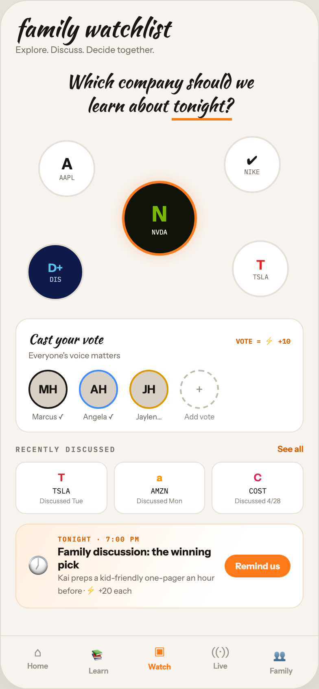

# F6 FAMILY WATCHLIST

Canvas: **CHEAT CODE · FAMILY MODE** · board index 5 · slug `06-f6-family-watchlist`
Frame: **392×846px** (design width 392px — port at 390px logical, scale ratios).

> Style values are EXACT computed values from the canvas. `T.*` = canvas token, resolved in
> the Tokens appendix at the bottom of this file. Text marked `(MOCK)` must not ship as drawn —
> see `../../DELTA.md` for its substitution rule.

## Tree

- **“family watchlist Explore. Discuss. Decid…”** → `
`
  - box: 392x846 · display: flex · dir: column · width: 390px · height: 844px · bg: T.orange-50 · border: 1px solid T.orange-100-b · radius: 34px (T.r17) · shadow: T.orange-900a10 0px 20px 46px 0px · overflow: hidden · type: color T.neutral-950 / Instrument Sans / 16px / w400 / lh normal
  - **“family watchlist Explore. Discuss. Decid…”** → `
`
    - box: 390x779 · flex: 1 1 0% · flex-grow: 1 · flex-basis: 0% · pad: 18px 18px 0px 18px · overflow: hidden
    - **"family watchlist"** → `
`
      - box: 354x30 · type: color T.orange-900 / Kaushan Script / 30px / lh 30px · scale: T.ty1
      - text: "family watchlist"
    - **"Explore. Discuss. Decide together."** → `
`
      - box: 354x14 · margin: 5px 0px 0px 0px · type: color T.neutral-500 / 11px · scale: T.ty48
      - text: "Explore. Discuss. Decide together."
    - **“Which company should we learn about toni…”** → `
`
      - box: 354x57.2 · margin: 18px 0px 0px 0px · type: align-center
      - **"Which company should welearn about"** → `
`
        - box: 354x57.2 · type: color T.orange-900 / Kaushan Script / 22px / lh 28.6px · scale: T.ty9
        - text: "Which company should welearn about"
        - **block[0]** → ` `
          - box: 0x32 · display: inline
        - **"tonight?"** → ``
          - box: 74.1x35 · display: inline · border: T:0px none T.orange-900 R:0px none T.orange-900 B:3px solid T.orange-400-b L:0px none T.orange-900 · scale: T.ty9
          - text: "tonight?"
    - **“N NVDA A AAPL ✔ NIKE D+ DIS T TSLA…”** → `
`
      - box: 354x230 · height: 230px · margin: 10px 0px 0px 0px · position: relative [0px 0px 0px 0px]
      - **“N NVDA…”** → `
`
        - box: 92x92 · display: grid · align: center · justify-items: center · grid-cols: 86px · grid-rows: 86px · width: 86px · height: 86px · bg: T.lime-900 · border: 3px solid T.orange-400-b · radius: 50% (T.r18) · shadow: T.orange-400a25 0px 0px 16px 0px · transform: matrix(1, 0, 0, 1, -46, -46) · position: absolute [115px 85px 23px 177px]
        - **“N NVDA…”** → `
`
          - box: 19.2x43 · type: align-center
          - **"N"** → `
`
            - box: 19.2x32 · type: color T.lime-600 / 26px / w800 · scale: T.ty6
            - text: "N"
          - **"NVDA"** → `
`
            - box: 19.2x10 · margin: 1px 0px 0px 0px · type: color T.orange-50 / IBM Plex Mono / 8px · scale: T.ty89
            - text: "NVDA"
      - **“A AAPL…”** → `
`
        - box: 70x70 · display: grid · align: center · justify-items: center · grid-cols: 66px · grid-rows: 66px · width: 66px · height: 66px · bg: T.neutral-0 · border: 2px solid T.orange-100 · radius: 50% (T.r18) · position: absolute [18.3906px 255.688px 141.609px 28.3125px]
        - **“A AAPL…”** → `
`
          - box: 19.2x33 · type: align-center
          - **"A"** → `
`
            - box: 19.2x23 · type: color T.orange-900 / 19px / w800 · scale: T.ty11
            - text: "A"
          - **"AAPL"** → `
`
            - box: 19.2x10 · type: color T.neutral-500 / IBM Plex Mono / 8px · scale: T.ty89
            - text: "AAPL"
      - **“✔ NIKE…”** → `
`
        - box: 70x70 · display: grid · align: center · justify-items: center · grid-cols: 66px · grid-rows: 66px · width: 66px · height: 66px · bg: T.neutral-0 · border: 2px solid T.orange-100 · radius: 50% (T.r18) · position: absolute [13.7969px 28.3125px 146.203px 255.688px]
        - **“✔ NIKE…”** → `
`
          - box: 19.2x29 · type: align-center
          - **"✔"** → `
`
            - box: 19.2x19 · type: color T.orange-900 / 15px / w800 · scale: T.ty22
            - text: "✔"
          - **"NIKE"** → `
`
            - box: 19.2x10 · type: color T.neutral-500 / IBM Plex Mono / 8px · scale: T.ty89
            - text: "NIKE"
      - **“D+ DIS…”** → `
`
        - box: 70x70 · display: grid · align: center · justify-items: center · grid-cols: 66px · grid-rows: 66px · width: 66px · height: 66px · bg: T.blue-800 · border: 2px solid T.orange-100 · radius: 50% (T.r18) · position: absolute [146.203px 269.844px 13.7969px 14.1562px]
        - **“D+ DIS…”** → `
`
          - box: 18.1x28 · type: align-center
          - **"D+"** → `
`
            - box: 18.1x18 · type: color T.blue-300-b / 14px / w800 · scale: T.ty27
            - text: "D+"
          - **"DIS"** → `
`
            - box: 18.1x10 · type: color T.blue-100 / IBM Plex Mono / 8px · scale: T.ty89
            - text: "DIS"
      - **“T TSLA…”** → `
`
        - box: 70x70 · display: grid · align: center · justify-items: center · grid-cols: 66px · grid-rows: 66px · width: 66px · height: 66px · bg: T.neutral-0 · border: 2px solid T.orange-100 · radius: 50% (T.r18) · position: absolute [141.609px 17.6875px 18.3906px 266.312px]
        - **“T TSLA…”** → `
`
          - box: 19.2x30 · type: align-center
          - **"T"** → `
`
            - box: 19.2x20 · type: color T.red-400-b / w800 · scale: T.ty19
            - text: "T"
          - **"TSLA"** → `
`
            - box: 19.2x10 · type: color T.neutral-500 / IBM Plex Mono / 8px · scale: T.ty89
            - text: "TSLA"
      - **svg** → `<svg>`
        - box: 354x230 · overflow: hidden · position: absolute [0px 0px 0px 0px] z-1
        - svg: `<svg data-dc-tpl="519" width="100%" height="230" viewBox="0 0 354 230" style="position: absolute; inset: 0px; z-index: -1;"><path data-dc-tpl="520" d="M60 40 L177 115 M294 36 L177 115 M50 190 L177 115 M300 185 L177 115" stroke="#E0DACE" stroke-width="1.5" stroke-dasharray="4 5"></path></svg>`
        - **block[0]** → `<path>`
          - box: 250x154 · display: inline
    - **“Cast your vote VOTE = ⚡ +10 Everyone's v…”** → `
`
      - box: 354x140 · pad: 13px 15px 13px 15px · margin: 8px 0px 0px 0px · bg: T.neutral-0 · border: 1px solid T.orange-100 · radius: 16px (T.r14)
      - **“Cast your vote VOTE = ⚡ +10…”** → `
`
        - box: 322x23 · display: flex · align: baseline · justify: space-between
        - **"Cast your vote"** → ``
          - box: 91.4x23 · type: color T.orange-900 / Kaushan Script · scale: T.ty20
          - text: "Cast your vote"
        - **"VOTE = ⚡ +10"** **(MOCK)** → ``
          - box: 67.1x14 · type: color T.orange-500 / IBM Plex Mono / 8.5px / w700 · scale: T.ty86
          - text: "VOTE = ⚡ +10"
      - **"Everyone's voice matters"** → `
`
        - box: 322x13 · margin: 2px 0px 0px 0px · type: color T.neutral-500 / 10px · scale: T.ty65
        - text: "Everyone's voice matters"
      - **“MH Marcus ✓ AH Angela ✓ JH Jaylen… + Add…”** → `
`
        - box: 322x63 · display: flex · gap: 14px · margin: 11px 0px 0px 0px
        - **“MH Marcus ✓…”** → `
`
          - box: 48x63 · type: align-center
          - **"MH"** → `
`
            - box: 48x48 · display: grid · align: center · justify-items: center · grid-cols: 44px · grid-rows: 44px · width: 44px · height: 44px · bg: T.orange-100-c · border: 2px solid T.orange-900 · radius: 50% (T.r18) · type: color T.orange-900 / 14px / w800 · scale: T.ty27
            - text: "MH"
          - **"Marcus ✓"** → `
`
            - box: 48x11 · margin: 4px 0px 0px 0px · type: color T.neutral-500 / 9px · scale: T.ty77
            - text: "Marcus ✓"
        - **“AH Angela ✓…”** → `
`
          - box: 48x63 · type: align-center
          - **"AH"** → `
`
            - box: 48x48 · display: grid · align: center · justify-items: center · grid-cols: 44px · grid-rows: 44px · width: 44px · height: 44px · bg: T.orange-100-c · border: 2px solid T.blue-300 · radius: 50% (T.r18) · type: color T.orange-900 / 14px / w800 · scale: T.ty27
            - text: "AH"
          - **"Angela ✓"** → `
`
            - box: 48x11 · margin: 4px 0px 0px 0px · type: color T.neutral-500 / 9px · scale: T.ty77
            - text: "Angela ✓"
        - **“JH Jaylen……”** → `
`
          - box: 48x63 · type: align-center
          - **"JH"** → `
`
            - box: 48x48 · display: grid · align: center · justify-items: center · grid-cols: 44px · grid-rows: 44px · width: 44px · height: 44px · bg: T.orange-100-c · border: 2px solid T.amber-500 · radius: 50% (T.r18) · type: color T.orange-900 / 14px / w800 · scale: T.ty27
            - text: "JH"
          - **"Jaylen…"** → `
`
            - box: 48x11 · margin: 4px 0px 0px 0px · type: color T.neutral-500 / 9px · scale: T.ty77
            - text: "Jaylen…"
        - **“+ Add vote…”** → `
`
          - box: 48x63 · type: align-center
          - **"+"** → `
`
            - box: 48x48 · display: grid · align: center · justify-items: center · grid-cols: 44px · grid-rows: 44px · width: 44px · height: 44px · bg: T.neutral-0 · border: 2px dashed T.orange-200 · radius: 50% (T.r18) · type: color T.orange-400 · scale: T.ty17
            - text: "+"
          - **"Add vote"** → `
`
            - box: 48x11 · margin: 4px 0px 0px 0px · type: color T.orange-400 / 9px · scale: T.ty77
            - text: "Add vote"
    - **“RECENTLY DISCUSSED See all…”** → `
`
      - box: 354x13 · display: flex · align: baseline · justify: space-between · margin: 14px 0px 0px 0px
      - **"Recently discussed"** → ``
        - box: 123.1x11 · type: color T.neutral-500 / IBM Plex Mono / 9px / w600 / ls 1.44px / uppercase · scale: T.ty79
        - text: "Recently discussed"
      - **"See all"** → ``
        - box: 32.1x13 · type: color T.orange-500 / 10.5px / w600 · scale: T.ty60
        - text: "See all"
    - **“T TSLA Discussed Tue a AMZN Discussed Mo…”** → `
`
      - box: 354x64 · display: flex · gap: 8px · margin: 9px 0px 0px 0px
      - **“T TSLA Discussed Tue…”** → `
`
        - box: 112.7x64 · flex: 1 1 0% · flex-grow: 1 · flex-basis: 0% · pad: 10px 10px 10px 10px · bg: T.neutral-0 · border: 1px solid T.orange-100 · radius: 12px (T.r11) · type: align-center
        - **"T"** → `
`
          - box: 90.7x16 · type: color T.red-400-b / 13px / w800 · scale: T.ty30
          - text: "T"
        - **"TSLA"** → `
`
          - box: 90.7x11 · margin: 3px 0px 0px 0px · type: color T.orange-900 / IBM Plex Mono / 9px · scale: T.ty78
          - text: "TSLA"
        - **"Discussed Tue"** → `
`
          - box: 90.7x10 · margin: 2px 0px 0px 0px · type: color T.orange-400 / 8px · scale: T.ty90
          - text: "Discussed Tue"
      - **“a AMZN Discussed Mon…”** → `
`
        - box: 112.7x64 · flex: 1 1 0% · flex-grow: 1 · flex-basis: 0% · pad: 10px 10px 10px 10px · bg: T.neutral-0 · border: 1px solid T.orange-100 · radius: 12px (T.r11) · type: align-center
        - **"a"** → `
`
          - box: 90.7x16 · type: color T.orange-400-c / 13px / w800 · scale: T.ty30
          - text: "a"
        - **"AMZN"** → `
`
          - box: 90.7x11 · margin: 3px 0px 0px 0px · type: color T.orange-900 / IBM Plex Mono / 9px · scale: T.ty78
          - text: "AMZN"
        - **"Discussed Mon"** → `
`
          - box: 90.7x10 · margin: 2px 0px 0px 0px · type: color T.orange-400 / 8px · scale: T.ty90
          - text: "Discussed Mon"
      - **“C COST Discussed 4/28…”** → `
`
        - box: 112.7x64 · flex: 1 1 0% · flex-grow: 1 · flex-basis: 0% · pad: 10px 10px 10px 10px · bg: T.neutral-0 · border: 1px solid T.orange-100 · radius: 12px (T.r11) · type: align-center
        - **"C"** → `
`
          - box: 90.7x16 · type: color T.red-400 / 13px / w800 · scale: T.ty30
          - text: "C"
        - **"COST"** → `
`
          - box: 90.7x11 · margin: 3px 0px 0px 0px · type: color T.orange-900 / IBM Plex Mono / 9px · scale: T.ty78
          - text: "COST"
        - **"Discussed 4/28"** → `
`
          - box: 90.7x10 · margin: 2px 0px 0px 0px · type: color T.orange-400 / 8px · scale: T.ty90
          - text: "Discussed 4/28"
    - **“🕖 TONIGHT · 7:00 PM Family discussion: …”** → `
`
      - box: 354x104 · display: flex · align: center · gap: 12px · pad: 13px 15px 13px 15px · margin: 12px 0px 0px 0px · bg-image: linear-gradient(120deg, T.orange-50-c 0%, T.neutral-0 70%) · border: 1px solid T.orange-100-d · radius: 16px (T.r14)
      - **"🕖"** → `
`
        - box: 24x32 · flex: 0 0 auto · flex-shrink: 0 · type: 24px · scale: T.ty8
        - text: "🕖"
      - **“TONIGHT · 7:00 PM Family discussion: the…”** → `
`
        - box: 193.3x76 · flex: 1 1 0% · flex-grow: 1 · flex-basis: 0%
        - **"Tonight · 7:00 PM"** → `
`
          - box: 193.3x10 · type: color T.orange-500 / IBM Plex Mono / 8px / w600 / ls 1.12px / uppercase · scale: T.ty92
          - text: "Tonight · 7:00 PM"
        - **"Family discussion: the winning pick"** → `
`
          - box: 193.3x32 · margin: 2px 0px 0px 0px · type: color T.orange-900 / 13px / w700 · scale: T.ty32
          - text: "Family discussion: the winning pick"
        - **"Kai preps a kid-friendly one-pager an hour b"** **(MOCK)** → `
`
          - box: 193.3x30 · margin: 2px 0px 0px 0px · type: color T.neutral-500 / 10px · scale: T.ty65
          - text: "Kai preps a kid-friendly one-pager an hour before · ⚡ +20 each"
      - **"Remind us"** → ``
        - box: 80.7x28 · flex: 0 0 auto · flex-shrink: 0 · pad: 7px 13px 7px 13px · bg: T.orange-400-b · radius: 16px (T.r14) · type: color T.orange-50 / 11px / w700 · scale: T.ty50
        - text: "Remind us"
  - **“⌂ Home 📚 Learn ▣ Watch ((·)) Live 👥 Fa…”** → `
`
    - box: 390x65 · display: flex · pad: 10px 8px 16px 8px · bg: T.orange-50 · border: T:1px solid T.orange-100 R:0px none T.neutral-950 B:0px none T.neutral-950 L:0px none T.neutral-950
    - **“⌂ Home…”** → `
`
      - box: 74.8x38 · flex: 1 1 0% · flex-grow: 1 · flex-basis: 0% · type: align-center
      - **"⌂"** → `
`
        - box: 74.8x19 · type: color T.orange-400 / 15px · scale: T.ty21
        - text: "⌂"
      - **"Home"** → `
`
        - box: 74.8x11 · margin: 2px 0px 0px 0px · type: color T.orange-400 / 9px / w600 · scale: T.ty75
        - text: "Home"
    - **“📚 Learn…”** → `
`
      - box: 74.8x38 · flex: 1 1 0% · flex-grow: 1 · flex-basis: 0% · type: align-center
      - **"📚"** → `
`
        - box: 74.8x25 · type: color T.orange-400 / 15px · scale: T.ty21
        - text: "📚"
      - **"Learn"** → `
`
        - box: 74.8x11 · margin: 2px 0px 0px 0px · type: color T.orange-400 / 9px / w600 · scale: T.ty75
        - text: "Learn"
    - **“▣ Watch…”** → `
`
      - box: 74.8x38 · flex: 1 1 0% · flex-grow: 1 · flex-basis: 0% · type: align-center
      - **"▣"** → `
`
        - box: 74.8x20 · type: color T.orange-400-b / 15px · scale: T.ty21
        - text: "▣"
      - **"Watch"** → `
`
        - box: 74.8x11 · margin: 2px 0px 0px 0px · type: color T.orange-400-b / 9px / w700 · scale: T.ty76
        - text: "Watch"
    - **“((·)) Live…”** → `
`
      - box: 74.8x38 · flex: 1 1 0% · flex-grow: 1 · flex-basis: 0% · type: align-center
      - **"((·))"** → `
`
        - box: 74.8x19 · type: color T.orange-400 / 15px · scale: T.ty21
        - text: "((·))"
      - **"Live"** → `
`
        - box: 74.8x11 · margin: 2px 0px 0px 0px · type: color T.orange-400 / 9px / w600 · scale: T.ty75
        - text: "Live"
    - **“👥 Family…”** → `
`
      - box: 74.8x38 · flex: 1 1 0% · flex-grow: 1 · flex-basis: 0% · type: align-center
      - **"👥"** → `
`
        - box: 74.8x25 · type: color T.orange-400 / 15px · scale: T.ty21
        - text: "👥"
      - **"Family"** → `
`
        - box: 74.8x11 · margin: 2px 0px 0px 0px · type: color T.orange-400 / 9px / w600 · scale: T.ty75
        - text: "Family"

## Tokens used in this board

| token | value | role |
| --- | --- | --- |
| T.orange-900 | `#1A1614` | text, border, bg |
| T.neutral-950 | `#000000` | text, border |
| T.neutral-500 | `#7B7369` | text, bg |
| T.neutral-0 | `#FFFFFF` | bg, text, gradient |
| T.orange-400 | `#9B9289` | text, bg |
| T.orange-100 | `#E5DFD5` | border, bg |
| T.orange-500 | `#D95E00` | text |
| T.orange-400-b | `#FF7A1A` | bg, gradient, text, border |
| T.orange-50 | `#F7F4EF` | bg, border, text |
| T.orange-50-c | `#FFEEDD` | gradient, bg |
| T.orange-100-b | `#E0DACE` | border, gradient |
| T.orange-100-c | `#D8D0C4` | bg |
| T.orange-900a10 | `#1A1614/0.1` | shadow |
| T.amber-500 | `#D99A00` | border, bg, gradient |
| T.orange-100-d | `#F2DCC2` | border |
| T.blue-300 | `#3D8BFF` | border, bg |
| T.orange-200 | `#C4BBAD` | bg, border |
| T.blue-100 | `#B7D3E6` | border, text |
| T.red-400 | `#D92652` | text, bg |
| T.lime-900 | `#101408` | bg |
| T.lime-600 | `#76B900` | text |
| T.red-400-b | `#E82127` | text |
| T.orange-400a25 | `#FF7A1A/0.25` | shadow |
| T.blue-800 | `#0E1B4A` | bg |
| T.blue-300-b | `#5BC4F0` | text |
| T.orange-400-c | `#FF9900` | text |
| T.ty1 | Kaushan Script 30px/30px w400 ls:normal | type scale |
| T.ty6 | Instrument Sans 26px/normal w800 ls:normal | type scale |
| T.ty8 | Instrument Sans 24px/normal w400 ls:normal | type scale |
| T.ty9 | Kaushan Script 22px/28.6px w400 ls:normal | type scale |
| T.ty11 | Instrument Sans 19px/normal w800 ls:normal | type scale |
| T.ty17 | Instrument Sans 16px/normal w400 ls:normal | type scale |
| T.ty19 | Instrument Sans 16px/normal w800 ls:normal | type scale |
| T.ty20 | Kaushan Script 16px/normal w400 ls:normal | type scale |
| T.ty21 | Instrument Sans 15px/normal w400 ls:normal | type scale |
| T.ty22 | Instrument Sans 15px/normal w800 ls:normal | type scale |
| T.ty27 | Instrument Sans 14px/normal w800 ls:normal | type scale |
| T.ty30 | Instrument Sans 13px/normal w800 ls:normal | type scale |
| T.ty32 | Instrument Sans 13px/normal w700 ls:normal | type scale |
| T.ty48 | Instrument Sans 11px/normal w400 ls:normal | type scale |
| T.ty50 | Instrument Sans 11px/normal w700 ls:normal | type scale |
| T.ty60 | Instrument Sans 10.5px/normal w600 ls:normal | type scale |
| T.ty65 | Instrument Sans 10px/normal w400 ls:normal | type scale |
| T.ty75 | Instrument Sans 9px/normal w600 ls:normal | type scale |
| T.ty76 | Instrument Sans 9px/normal w700 ls:normal | type scale |
| T.ty77 | Instrument Sans 9px/normal w400 ls:normal | type scale |
| T.ty78 | IBM Plex Mono 9px/normal w400 ls:normal | type scale |
| T.ty79 | IBM Plex Mono 9px/normal w600 ls:1.44px uppercase | type scale |
| T.ty86 | IBM Plex Mono 8.5px/normal w700 ls:normal | type scale |
| T.ty89 | IBM Plex Mono 8px/normal w400 ls:normal | type scale |
| T.ty90 | Instrument Sans 8px/normal w400 ls:normal | type scale |
| T.ty92 | IBM Plex Mono 8px/normal w600 ls:1.12px uppercase | type scale |
| T.r11 | `12px` | radius |
| T.r14 | `16px` | radius |
| T.r17 | `34px` | radius |
| T.r18 | `50%` | radius |
