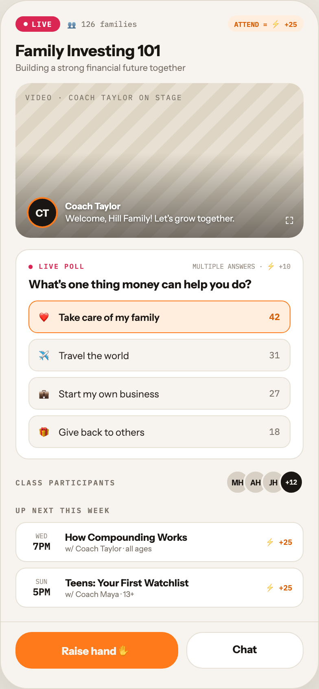

# F7 FAMILY LIVE CLASS

Canvas: **CHEAT CODE · FAMILY MODE** · board index 6 · slug `07-f7-family-live-class`
Frame: **392×846px** (design width 392px — port at 390px logical, scale ratios).

> Style values are EXACT computed values from the canvas. `T.*` = canvas token, resolved in
> the Tokens appendix at the bottom of this file. Text marked `(MOCK)` must not ship as drawn —
> see `../../DELTA.md` for its substitution rule.

## Tree

- **“LIVE 👥 126 families ATTEND = ⚡ +25 Fami…”** → `
`
  - box: 392x846 · display: flex · dir: column · width: 390px · height: 844px · bg: T.orange-50 · border: 1px solid T.orange-100-b · radius: 34px (T.r17) · shadow: T.orange-900a10 0px 20px 46px 0px · overflow: hidden · type: color T.neutral-950 / Instrument Sans / 16px / w400 / lh normal
  - **“LIVE 👥 126 families ATTEND = ⚡ +25 Fami…”** → `
`
    - box: 390x762 · flex: 1 1 0% · flex-grow: 1 · flex-basis: 0% · pad: 18px 18px 0px 18px · overflow: hidden
    - **“LIVE 👥 126 families ATTEND = ⚡ +25…”** → `
`
      - box: 354x20 · display: flex · align: center · gap: 8px
      - **"LIVE"** → ``
        - box: 55.2x19 · display: flex · align: center · gap: 5px · pad: 4px 10px 4px 10px · bg: T.red-400 · radius: 14px (T.r13) · type: color T.neutral-0 / IBM Plex Mono / 9px / w700 / ls 0.9px · scale: T.ty81
        - text: "LIVE"
        - **block[0]** → ``
          - box: 5x5 · width: 5px · height: 5px · bg: T.neutral-0 · radius: 50% (T.r18)
      - **"👥 126 families"** **(MOCK)** → ``
        - box: 86.1x16 · type: color T.neutral-500 / IBM Plex Mono / 9.5px · scale: T.ty74
        - text: "👥 126 families"
      - **"ATTEND = ⚡ +25"** **(MOCK)** → ``
        - box: 93.3x20 · pad: 3px 8px 3px 8px · margin: 0px 0px 0px 103.375px · bg: T.orange-50-c · radius: 10px (T.r9) · type: color T.orange-500 / IBM Plex Mono / 8.5px / w700 · scale: T.ty86
        - text: "ATTEND = ⚡ +25"
    - **"Family Investing 101"** → `
`
      - box: 354x23 · margin: 12px 0px 0px 0px · type: color T.orange-900 / 19px / w800 · scale: T.ty11
      - text: "Family Investing 101"
    - **"Building a strong financial future together"** → `
`
      - box: 354x14 · margin: 2px 0px 0px 0px · type: color T.neutral-500 / 11px · scale: T.ty48
      - text: "Building a strong financial future together"
    - **“VIDEO · COACH TAYLOR ON STAGE CT Coach T…”** → `
`
      - box: 354x190 · height: 190px · margin: 12px 0px 0px 0px · bg-image: repeating-linear-gradient(135deg, T.orange-100-e 0px, T.orange-100-e 14px, T.orange-100-f 14px, T.orange-100-f 28px) · radius: 18px (T.r15) · overflow: hidden · position: relative [0px 0px 0px 0px]
      - **block[0]** → `
`
        - box: 354x190 · bg-image: linear-gradient(T.neutral-950a00 45%, T.orange-900a55 100%) · position: absolute [0px 0px 0px 0px]
      - **"Video · Coach Taylor on stage"** → `
`
        - box: 193.1x11 · position: absolute [12px 148.859px 167px 12px] · type: color T.neutral-500 / IBM Plex Mono / 9px / ls 1.26px / uppercase · scale: T.ty83
        - text: "Video · Coach Taylor on stage"
      - **“CT Coach Taylor Welcome, Hill Family! Le…”** → `
`
        - box: 255.4x38 · display: flex · align: center · gap: 9px · position: absolute [140px 84.625px 12px 14px]
        - **"CT"** → `
`
          - box: 38x38 · display: grid · align: center · justify-items: center · grid-cols: 34px · grid-rows: 34px · width: 34px · height: 34px · bg: T.orange-900 · border: 2px solid T.orange-400-b · radius: 50% (T.r18) · type: color T.orange-50 / 12px / w700 · scale: T.ty40
          - text: "CT"
        - **"Welcome, Hill Family! Let's grow together."** → `
`
          - box: 208.4x30.8 · text-shadow: #000000/0.4 0px 1px 3px · type: color T.neutral-0 / 11px / lh 15.4px · scale: T.ty58
          - text: "Welcome, Hill Family! Let's grow together."
          - **"Coach Taylor"** → `<strong>`
            - box: 68x14 · display: inline · text-shadow: #000000/0.4 0px 1px 3px · type: w700 · scale: T.ty59
            - text: "Coach Taylor"
          - **block[1]** → ` `
            - box: 0x14 · display: inline · text-shadow: #000000/0.4 0px 1px 3px
      - **"⛶"** → ``
        - box: 10.6x18 · position: absolute [160px 12px 12px 331.375px] · type: color T.neutral-0 / 13px · scale: T.ty29
        - text: "⛶"
    - **“● LIVE POLL MULTIPLE ANSWERS · ⚡ +10 Wha…”** → `
`
      - box: 354x258 · pad: 13px 15px 13px 15px · margin: 14px 0px 0px 0px · bg: T.neutral-0 · border: 1px solid T.orange-100 · radius: 16px (T.r14)
      - **“● LIVE POLL MULTIPLE ANSWERS · ⚡ +10…”** → `
`
        - box: 322x13 · display: flex · align: baseline · justify: space-between
        - **"● Live poll"** → ``
          - box: 69.2x11 · type: color T.red-400 / IBM Plex Mono / 8.5px / w600 / ls 1.19px / uppercase · scale: T.ty87
          - text: "● Live poll"
        - **"MULTIPLE ANSWERS · ⚡ +10"** **(MOCK)** → ``
          - box: 120.4x13 · type: color T.orange-400 / IBM Plex Mono / 8px · scale: T.ty89
          - text: "MULTIPLE ANSWERS · ⚡ +10"
      - **"What's one thing money can help you do?"** → `
`
        - box: 322x18 · margin: 7px 0px 0px 0px · type: color T.orange-900 / 14px / w800 · scale: T.ty27
        - text: "What's one thing money can help you do?"
      - **“❤️ Take care of my family 42 ✈️ Travel t…”** → `
`
        - box: 322x181 · display: flex · dir: column · gap: 7px · margin: 11px 0px 0px 0px
        - **“❤️ Take care of my family 42…”** → `
`
          - box: 322x40 · display: flex · align: center · gap: 9px · pad: 9px 12px 9px 12px · bg: T.orange-50-c · border: 1px solid T.orange-400-b · radius: 11px (T.r10)
          - **"❤️"** → ``
            - box: 15x20 · type: 12px · scale: T.ty38
            - text: "❤️"
          - **"Take care of my family"** → ``
            - box: 249.8x15 · flex: 1 1 0% · flex-grow: 1 · flex-basis: 0% · type: color T.orange-900 / 12px / w600 · scale: T.ty42
            - text: "Take care of my family"
          - **"42"** → ``
            - box: 13.2x14 · type: color T.orange-500 / IBM Plex Mono / 11px / w600 · scale: T.ty52
            - text: "42"
        - **“✈️ Travel the world 31…”** → `
`
          - box: 322x40 · display: flex · align: center · gap: 9px · pad: 9px 12px 9px 12px · bg: T.orange-50 · border: 1px solid T.orange-100 · radius: 11px (T.r10)
          - **"✈️"** → ``
            - box: 15x20 · type: 12px · scale: T.ty38
            - text: "✈️"
          - **"Travel the world"** → ``
            - box: 249.8x15 · flex: 1 1 0% · flex-grow: 1 · flex-basis: 0% · type: color T.orange-800 / 12px · scale: T.ty38
            - text: "Travel the world"
          - **"31"** → ``
            - box: 13.2x14 · type: color T.neutral-500 / IBM Plex Mono / 11px · scale: T.ty49
            - text: "31"
        - **“💼 Start my own business 27…”** → `
`
          - box: 322x40 · display: flex · align: center · gap: 9px · pad: 9px 12px 9px 12px · bg: T.orange-50 · border: 1px solid T.orange-100 · radius: 11px (T.r10)
          - **"💼"** → ``
            - box: 15x20 · type: 12px · scale: T.ty38
            - text: "💼"
          - **"Start my own business"** → ``
            - box: 249.8x15 · flex: 1 1 0% · flex-grow: 1 · flex-basis: 0% · type: color T.orange-800 / 12px · scale: T.ty38
            - text: "Start my own business"
          - **"27"** → ``
            - box: 13.2x14 · type: color T.neutral-500 / IBM Plex Mono / 11px · scale: T.ty49
            - text: "27"
        - **“🎁 Give back to others 18…”** → `
`
          - box: 322x40 · display: flex · align: center · gap: 9px · pad: 9px 12px 9px 12px · bg: T.orange-50 · border: 1px solid T.orange-100 · radius: 11px (T.r10)
          - **"🎁"** → ``
            - box: 15x20 · type: 12px · scale: T.ty38
            - text: "🎁"
          - **"Give back to others"** → ``
            - box: 249.8x15 · flex: 1 1 0% · flex-grow: 1 · flex-basis: 0% · type: color T.orange-800 / 12px · scale: T.ty38
            - text: "Give back to others"
          - **"18"** → ``
            - box: 13.2x14 · type: color T.neutral-500 / IBM Plex Mono / 11px · scale: T.ty49
            - text: "18"
    - **“CLASS PARTICIPANTS MH AH JH +12…”** → `
`
      - box: 354x30 · display: flex · align: center · justify: space-between · margin: 13px 0px 0px 0px
      - **"Class participants"** → ``
        - box: 123.1x11 · type: color T.neutral-500 / IBM Plex Mono / 9px / w600 / ls 1.44px / uppercase · scale: T.ty79
        - text: "Class participants"
      - **“MH AH JH +12…”** → `
`
        - box: 96x30 · display: flex · align: center
        - **"MH"** → `
`
          - box: 30x30 · display: grid · align: center · justify-items: center · grid-cols: 26px · grid-rows: 26px · width: 26px · height: 26px · bg: T.orange-100-c · border: 2px solid T.orange-50 · radius: 50% (T.r18) · type: color T.orange-900 / 9px / w700 · scale: T.ty76
          - text: "MH"
        - **"AH"** → `
`
          - box: 30x30 · display: grid · align: center · justify-items: center · grid-cols: 26px · grid-rows: 26px · width: 26px · height: 26px · margin: 0px 0px 0px -8px · bg: T.orange-100-c · border: 2px solid T.orange-50 · radius: 50% (T.r18) · type: color T.orange-900 / 9px / w700 · scale: T.ty76
          - text: "AH"
        - **"JH"** → `
`
          - box: 30x30 · display: grid · align: center · justify-items: center · grid-cols: 26px · grid-rows: 26px · width: 26px · height: 26px · margin: 0px 0px 0px -8px · bg: T.orange-100-c · border: 2px solid T.orange-50 · radius: 50% (T.r18) · type: color T.orange-900 / 9px / w700 · scale: T.ty76
          - text: "JH"
        - **"+12"** **(MOCK)** → `
`
          - box: 30x30 · display: grid · align: center · justify-items: center · grid-cols: 26px · grid-rows: 26px · width: 26px · height: 26px · margin: 0px 0px 0px -8px · bg: T.orange-900 · border: 2px solid T.orange-50 · radius: 50% (T.r18) · type: color T.orange-50 / IBM Plex Mono / 8px / w600 · scale: T.ty94
          - text: "+12"
    - **"Up next this week"** → `
`
      - box: 354x11 · margin: 14px 0px 0px 0px · type: color T.neutral-500 / IBM Plex Mono / 9px / w600 / ls 1.44px / uppercase · scale: T.ty79
      - text: "Up next this week"
    - **“WED 7PM How Compounding Works w/ Coach T…”** → `
`
      - box: 354x105 · display: flex · dir: column · gap: 7px · margin: 9px 0px 0px 0px
      - **“WED 7PM How Compounding Works w/ Coach T…”** → `
`
        - box: 354x49 · display: flex · align: center · gap: 11px · pad: 10px 13px 10px 13px · bg: T.neutral-0 · border: 1px solid T.orange-100 · radius: 13px (T.r12)
        - **“WED 7PM…”** → `
`
          - box: 36x25 · width: 36px · flex: 0 0 auto · flex-shrink: 0 · type: align-center
          - **"WED"** → `
`
            - box: 36x10 · type: color T.orange-400 / IBM Plex Mono / 8px · scale: T.ty89
            - text: "WED"
          - **"7PM"** → `
`
            - box: 36x15 · type: color T.orange-900 / IBM Plex Mono / 12px / w600 · scale: T.ty39
            - text: "7PM"
        - **“How Compounding Works w/ Coach Taylor · …”** → `
`
          - box: 235.4x27 · flex: 1 1 0% · flex-grow: 1 · flex-basis: 0%
          - **"How Compounding Works"** → `
`
            - box: 235.4x15 · type: color T.orange-900 / 12px / w700 · scale: T.ty40
            - text: "How Compounding Works"
          - **"w/ Coach Taylor · all ages"** → `
`
            - box: 235.4x11 · margin: 1px 0px 0px 0px · type: color T.neutral-500 / 9.5px · scale: T.ty70
            - text: "w/ Coach Taylor · all ages"
        - **"⚡ +25"** **(MOCK)** → ``
          - box: 32.6x15 · type: color T.orange-500 / IBM Plex Mono / 9px / w700 · scale: T.ty80
          - text: "⚡ +25"
      - **“SUN 5PM Teens: Your First Watchlist w/ C…”** → `
`
        - box: 354x49 · display: flex · align: center · gap: 11px · pad: 10px 13px 10px 13px · bg: T.neutral-0 · border: 1px solid T.orange-100 · radius: 13px (T.r12)
        - **“SUN 5PM…”** → `
`
          - box: 36x25 · width: 36px · flex: 0 0 auto · flex-shrink: 0 · type: align-center
          - **"SUN"** → `
`
            - box: 36x10 · type: color T.orange-400 / IBM Plex Mono / 8px · scale: T.ty89
            - text: "SUN"
          - **"5PM"** → `
`
            - box: 36x15 · type: color T.orange-900 / IBM Plex Mono / 12px / w600 · scale: T.ty39
            - text: "5PM"
        - **“Teens: Your First Watchlist w/ Coach May…”** → `
`
          - box: 235.4x27 · flex: 1 1 0% · flex-grow: 1 · flex-basis: 0%
          - **"Teens: Your First Watchlist"** → `
`
            - box: 235.4x15 · type: color T.orange-900 / 12px / w700 · scale: T.ty40
            - text: "Teens: Your First Watchlist"
          - **"w/ Coach Maya · 13+"** → `
`
            - box: 235.4x11 · margin: 1px 0px 0px 0px · type: color T.neutral-500 / 9.5px · scale: T.ty70
            - text: "w/ Coach Maya · 13+"
        - **"⚡ +25"** **(MOCK)** → ``
          - box: 32.6x15 · type: color T.orange-500 / IBM Plex Mono / 9px / w700 · scale: T.ty80
          - text: "⚡ +25"
  - **“Raise hand ✋ Chat…”** → `
`
    - box: 390x82 · display: flex · gap: 10px · pad: 12px 18px 24px 18px · border: T:1px solid T.orange-100 R:0px none T.neutral-950 B:0px none T.neutral-950 L:0px none T.neutral-950
    - **"Raise hand ✋"** → `
`
      - box: 199.5x45 · flex: 1.4 1 0% · flex-grow: 1.4 · flex-basis: 0% · pad: 12px 0px 12px 0px · bg: T.orange-400-b · radius: 20px (T.r16) · type: color T.orange-50 / 13px / w800 / align-center · scale: T.ty30
      - text: "Raise hand ✋"
    - **"Chat"** → `
`
      - box: 144.5x45 · flex: 1 1 0% · flex-grow: 1 · flex-basis: 0% · pad: 12px 0px 12px 0px · bg: T.neutral-0 · border: 1px solid T.orange-100 · radius: 20px (T.r16) · type: color T.orange-900 / 13px / w700 / align-center · scale: T.ty32
      - text: "Chat"

## Tokens used in this board

| token | value | role |
| --- | --- | --- |
| T.orange-900 | `#1A1614` | text, border, bg |
| T.neutral-950 | `#000000` | text, border |
| T.neutral-500 | `#7B7369` | text, bg |
| T.neutral-0 | `#FFFFFF` | bg, text, gradient |
| T.orange-400 | `#9B9289` | text, bg |
| T.orange-100 | `#E5DFD5` | border, bg |
| T.orange-500 | `#D95E00` | text |
| T.orange-400-b | `#FF7A1A` | bg, gradient, text, border |
| T.orange-50 | `#F7F4EF` | bg, border, text |
| T.orange-50-c | `#FFEEDD` | gradient, bg |
| T.orange-100-b | `#E0DACE` | border, gradient |
| T.orange-100-c | `#D8D0C4` | bg |
| T.orange-800 | `#2E2925` | text |
| T.orange-900a10 | `#1A1614/0.1` | shadow |
| T.neutral-950a00 | `#000000/0` | gradient |
| T.red-400 | `#D92652` | text, bg |
| T.orange-100-e | `#E8E0D2` | gradient |
| T.orange-100-f | `#DED5C4` | gradient |
| T.orange-900a55 | `#1A1614/0.55` | gradient |
| T.ty11 | Instrument Sans 19px/normal w800 ls:normal | type scale |
| T.ty27 | Instrument Sans 14px/normal w800 ls:normal | type scale |
| T.ty29 | Instrument Sans 13px/normal w400 ls:normal | type scale |
| T.ty30 | Instrument Sans 13px/normal w800 ls:normal | type scale |
| T.ty32 | Instrument Sans 13px/normal w700 ls:normal | type scale |
| T.ty38 | Instrument Sans 12px/normal w400 ls:normal | type scale |
| T.ty39 | IBM Plex Mono 12px/normal w600 ls:normal | type scale |
| T.ty40 | Instrument Sans 12px/normal w700 ls:normal | type scale |
| T.ty42 | Instrument Sans 12px/normal w600 ls:normal | type scale |
| T.ty48 | Instrument Sans 11px/normal w400 ls:normal | type scale |
| T.ty49 | IBM Plex Mono 11px/normal w400 ls:normal | type scale |
| T.ty52 | IBM Plex Mono 11px/normal w600 ls:normal | type scale |
| T.ty58 | Instrument Sans 11px/15.4px w400 ls:normal | type scale |
| T.ty59 | Instrument Sans 11px/15.4px w700 ls:normal | type scale |
| T.ty70 | Instrument Sans 9.5px/normal w400 ls:normal | type scale |
| T.ty74 | IBM Plex Mono 9.5px/normal w400 ls:normal | type scale |
| T.ty76 | Instrument Sans 9px/normal w700 ls:normal | type scale |
| T.ty79 | IBM Plex Mono 9px/normal w600 ls:1.44px uppercase | type scale |
| T.ty80 | IBM Plex Mono 9px/normal w700 ls:normal | type scale |
| T.ty81 | IBM Plex Mono 9px/normal w700 ls:0.9px | type scale |
| T.ty83 | IBM Plex Mono 9px/normal w400 ls:1.26px uppercase | type scale |
| T.ty86 | IBM Plex Mono 8.5px/normal w700 ls:normal | type scale |
| T.ty87 | IBM Plex Mono 8.5px/normal w600 ls:1.19px uppercase | type scale |
| T.ty89 | IBM Plex Mono 8px/normal w400 ls:normal | type scale |
| T.ty94 | IBM Plex Mono 8px/normal w600 ls:normal | type scale |
| T.r9 | `10px` | radius |
| T.r10 | `11px` | radius |
| T.r12 | `13px` | radius |
| T.r13 | `14px` | radius |
| T.r14 | `16px` | radius |
| T.r15 | `18px` | radius |
| T.r16 | `20px` | radius |
| T.r17 | `34px` | radius |
| T.r18 | `50%` | radius |
