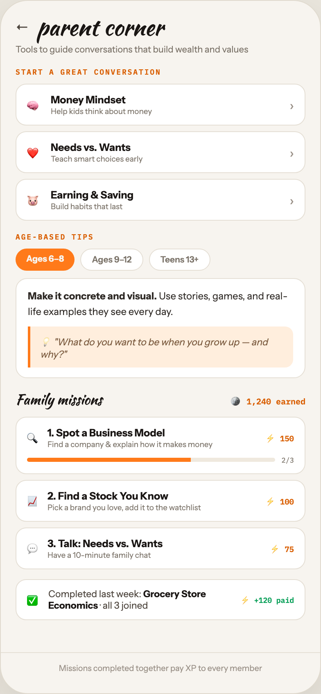

# F8 PARENT CORNER

Canvas: **CHEAT CODE · FAMILY MODE** · board index 7 · slug `08-f8-parent-corner`
Frame: **392×846px** (design width 392px — port at 390px logical, scale ratios).

> Style values are EXACT computed values from the canvas. `T.*` = canvas token, resolved in
> the Tokens appendix at the bottom of this file. Text marked `(MOCK)` must not ship as drawn —
> see `../../DELTA.md` for its substitution rule.

## Tree

- **“← parent corner Tools to guide conversat…”** → `
`
  - box: 392x846 · display: flex · dir: column · width: 390px · height: 844px · bg: T.orange-50 · border: 1px solid T.orange-100-b · radius: 34px (T.r17) · shadow: T.orange-900a10 0px 20px 46px 0px · overflow: hidden · type: color T.neutral-950 / Instrument Sans / 16px / w400 / lh normal
  - **“← parent corner Tools to guide conversat…”** → `
`
    - box: 390x794 · flex: 1 1 0% · flex-grow: 1 · flex-basis: 0% · pad: 18px 18px 0px 18px · overflow: hidden
    - **“← parent corner…”** → `
`
      - box: 354x28 · display: flex · align: center · gap: 10px
      - **"←"** → ``
        - box: 16x20 · type: color T.orange-700 · scale: T.ty17
        - text: "←"
      - **"parent corner"** → `
`
        - box: 154.5x28 · type: color T.orange-900 / Kaushan Script / 28px / lh 28px · scale: T.ty3
        - text: "parent corner"
    - **"Tools to guide conversations that build weal"** → `
`
      - box: 354x14 · margin: 6px 0px 0px 0px · type: color T.neutral-500 / 11px · scale: T.ty48
      - text: "Tools to guide conversations that build wealth and values"
    - **"Start a great conversation"** → `
`
      - box: 354x11 · margin: 15px 0px 0px 0px · type: color T.orange-500 / IBM Plex Mono / 9px / w600 / ls 1.44px / uppercase · scale: T.ty79
      - text: "Start a great conversation"
    - **“🧠 Money Mindset Help kids think about m…”** → `
`
      - box: 354x167 · display: flex · dir: column · gap: 7px · margin: 9px 0px 0px 0px
      - **“🧠 Money Mindset Help kids think about m…”** → `
`
        - box: 354x51 · display: flex · align: center · gap: 11px · pad: 11px 13px 11px 13px · bg: T.neutral-0 · border: 1px solid T.orange-100 · radius: 13px (T.r12)
        - **"🧠"** → ``
          - box: 18x23 · type: 14px · scale: T.ty25
          - text: "🧠"
        - **“Money Mindset Help kids think about mone…”** → `
`
          - box: 280.6x27 · flex: 1 1 0% · flex-grow: 1 · flex-basis: 0%
          - **"Money Mindset"** → `
`
            - box: 280.6x15 · type: color T.orange-900 / 12.5px / w700 · scale: T.ty34
            - text: "Money Mindset"
          - **"Help kids think about money"** → `
`
            - box: 280.6x11 · margin: 1px 0px 0px 0px · type: color T.neutral-500 / 9.5px · scale: T.ty70
            - text: "Help kids think about money"
        - **"›"** → ``
          - box: 5.4x20 · type: color T.orange-400 · scale: T.ty17
          - text: "›"
      - **“❤️ Needs vs. Wants Teach smart choices e…”** → `
`
        - box: 354x51 · display: flex · align: center · gap: 11px · pad: 11px 13px 11px 13px · bg: T.neutral-0 · border: 1px solid T.orange-100 · radius: 13px (T.r12)
        - **"❤️"** → ``
          - box: 18x23 · type: 14px · scale: T.ty25
          - text: "❤️"
        - **“Needs vs. Wants Teach smart choices earl…”** → `
`
          - box: 280.6x27 · flex: 1 1 0% · flex-grow: 1 · flex-basis: 0%
          - **"Needs vs. Wants"** → `
`
            - box: 280.6x15 · type: color T.orange-900 / 12.5px / w700 · scale: T.ty34
            - text: "Needs vs. Wants"
          - **"Teach smart choices early"** → `
`
            - box: 280.6x11 · margin: 1px 0px 0px 0px · type: color T.neutral-500 / 9.5px · scale: T.ty70
            - text: "Teach smart choices early"
        - **"›"** → ``
          - box: 5.4x20 · type: color T.orange-400 · scale: T.ty17
          - text: "›"
      - **“🐷 Earning & Saving Build habits that la…”** → `
`
        - box: 354x51 · display: flex · align: center · gap: 11px · pad: 11px 13px 11px 13px · bg: T.neutral-0 · border: 1px solid T.orange-100 · radius: 13px (T.r12)
        - **"🐷"** → ``
          - box: 18x23 · type: 14px · scale: T.ty25
          - text: "🐷"
        - **“Earning & Saving Build habits that last…”** → `
`
          - box: 280.6x27 · flex: 1 1 0% · flex-grow: 1 · flex-basis: 0%
          - **"Earning & Saving"** → `
`
            - box: 280.6x15 · type: color T.orange-900 / 12.5px / w700 · scale: T.ty34
            - text: "Earning & Saving"
          - **"Build habits that last"** → `
`
            - box: 280.6x11 · margin: 1px 0px 0px 0px · type: color T.neutral-500 / 9.5px · scale: T.ty70
            - text: "Build habits that last"
        - **"›"** → ``
          - box: 5.4x20 · type: color T.orange-400 · scale: T.ty17
          - text: "›"
    - **"Age-based tips"** → `
`
      - box: 354x11 · margin: 14px 0px 0px 0px · type: color T.orange-500 / IBM Plex Mono / 9px / w600 / ls 1.44px / uppercase · scale: T.ty79
      - text: "Age-based tips"
    - **“Ages 6–8 Ages 9–12 Teens 13+…”** → `
`
      - box: 354x27 · display: flex · gap: 7px · margin: 9px 0px 0px 0px
      - **"Ages 6–8"** → ``
        - box: 72.2x27 · pad: 6px 13px 6px 13px · bg: T.orange-400-b · radius: 14px (T.r13) · type: color T.orange-50 / 10.5px / w700 · scale: T.ty61
        - text: "Ages 6–8"
      - **"Ages 9–12"** → ``
        - box: 76.5x27 · pad: 6px 13px 6px 13px · bg: T.neutral-0 · border: 1px solid T.orange-100 · radius: 14px (T.r13) · type: color T.neutral-500 / 10.5px / w600 · scale: T.ty60
        - text: "Ages 9–12"
      - **"Teens 13+"** → ``
        - box: 74.9x27 · pad: 6px 13px 6px 13px · bg: T.neutral-0 · border: 1px solid T.orange-100 · radius: 14px (T.r13) · type: color T.neutral-500 / 10.5px / w600 · scale: T.ty60
        - text: "Teens 13+"
    - **“Make it concrete and visual. Use stories…”** → `
`
      - box: 354x122.2 · pad: 12px 14px 12px 14px · margin: 9px 0px 0px 0px · bg: T.neutral-0 · border: 1px solid T.orange-100 · radius: 14px (T.r13)
      - **"Use stories, games, and real-life examples t"** → `
`
        - box: 324x37.2 · type: color T.orange-800 / 12px / lh 18.6px · scale: T.ty43
        - text: "Use stories, games, and real-life examples they see every day."
        - **"Make it concrete and visual."** → `<strong>`
          - box: 157.6x15 · display: inline · type: w700 · scale: T.ty44
          - text: "Make it concrete and visual."
      - **"💡 \"What do you want to be when you grow up "** → `
`
        - box: 324x50 · pad: 9px 12px 9px 12px · margin: 9px 0px 0px 0px · bg: T.orange-50-c · border: T:0px none T.orange-600 R:0px none T.orange-600 B:0px none T.orange-600 L:3px solid T.orange-400-b · radius: 0px 10px 10px 0px · type: color T.orange-600 / 11.5px / italic · scale: T.ty45
        - text: "💡 \"What do you want to be when you grow up — and why?\""
    - **“Family missions 🪙 1,240 earned…”** → `
`
      - box: 354x24 · display: flex · align: baseline · justify: space-between · margin: 14px 0px 0px 0px
      - **"Family missions"** → ``
        - box: 105.8x24 · type: color T.orange-900 / Kaushan Script / 17px · scale: T.ty15
        - text: "Family missions"
      - **"🪙 1,240 earned"** **(MOCK)** → ``
        - box: 91x17 · type: color T.orange-500 / IBM Plex Mono / 10px / w700 · scale: T.ty69
        - text: "🪙 1,240 earned"
    - **“🔍 1. Spot a Business Model Find a compa…”** → `
`
      - box: 354x186 · display: flex · dir: column · gap: 7px · margin: 9px 0px 0px 0px
      - **“🔍 1. Spot a Business Model Find a compa…”** → `
`
        - box: 354x70 · pad: 11px 13px 11px 13px · bg: T.neutral-0 · border: 1px solid T.orange-100 · radius: 13px (T.r12)
        - **“🔍 1. Spot a Business Model Find a compa…”** → `
`
          - box: 326x27 · display: flex · align: center · gap: 9px
          - **"🔍"** → ``
            - box: 16x21 · type: 13px · scale: T.ty29
            - text: "🔍"
          - **“1. Spot a Business Model Find a company …”** → `
`
            - box: 257.2x27 · flex: 1 1 0% · flex-grow: 1 · flex-basis: 0%
            - **"1. Spot a Business Model"** → `
`
              - box: 257.2x15 · type: color T.orange-900 / 12.5px / w700 · scale: T.ty34
              - text: "1. Spot a Business Model"
            - **"Find a company & explain how it makes money"** → `
`
              - box: 257.2x11 · margin: 1px 0px 0px 0px · type: color T.neutral-500 / 9.5px · scale: T.ty70
              - text: "Find a company & explain how it makes money"
          - **"⚡ 150"** → ``
            - box: 34.8x16 · type: color T.orange-500 / IBM Plex Mono / 9.5px / w700 · scale: T.ty72
            - text: "⚡ 150"
        - **“2/3…”** → `
`
          - box: 326x11 · display: flex · align: center · gap: 8px · margin: 8px 0px 0px 0px
          - **block[0]** → `
`
            - box: 302.7x5 · height: 5px · flex: 1 1 0% · flex-grow: 1 · flex-basis: 0% · bg: T.orange-50-b · radius: 3px (T.r4) · overflow: hidden
            - **block[0]** → `
`
              - box: 199.8x5 · width: 66% · height: 100% · bg: T.orange-400-b
          - **"2/3"** → ``
            - box: 15.3x11 · type: color T.neutral-500 / IBM Plex Mono / 8.5px · scale: T.ty85
            - text: "2/3"
      - **“📈 2. Find a Stock You Know Pick a brand…”** → `
`
        - box: 354x51 · pad: 11px 13px 11px 13px · bg: T.neutral-0 · border: 1px solid T.orange-100 · radius: 13px (T.r12)
        - **“📈 2. Find a Stock You Know Pick a brand…”** → `
`
          - box: 326x27 · display: flex · align: center · gap: 9px
          - **"📈"** → ``
            - box: 16x21 · type: 13px · scale: T.ty29
            - text: "📈"
          - **“2. Find a Stock You Know Pick a brand yo…”** → `
`
            - box: 257.2x27 · flex: 1 1 0% · flex-grow: 1 · flex-basis: 0%
            - **"2. Find a Stock You Know"** → `
`
              - box: 257.2x15 · type: color T.orange-900 / 12.5px / w700 · scale: T.ty34
              - text: "2. Find a Stock You Know"
            - **"Pick a brand you love, add it to the watchli"** → `
`
              - box: 257.2x11 · margin: 1px 0px 0px 0px · type: color T.neutral-500 / 9.5px · scale: T.ty70
              - text: "Pick a brand you love, add it to the watchlist"
          - **"⚡ 100"** → ``
            - box: 34.8x16 · type: color T.orange-500 / IBM Plex Mono / 9.5px / w700 · scale: T.ty72
            - text: "⚡ 100"
      - **“💬 3. Talk: Needs vs. Wants Have a 10-mi…”** → `
`
        - box: 354x51 · pad: 11px 13px 11px 13px · bg: T.neutral-0 · border: 1px solid T.orange-100 · radius: 13px (T.r12)
        - **“💬 3. Talk: Needs vs. Wants Have a 10-mi…”** → `
`
          - box: 326x27 · display: flex · align: center · gap: 9px
          - **"💬"** → ``
            - box: 16x21 · type: 13px · scale: T.ty29
            - text: "💬"
          - **“3. Talk: Needs vs. Wants Have a 10-minut…”** → `
`
            - box: 262.9x27 · flex: 1 1 0% · flex-grow: 1 · flex-basis: 0%
            - **"3. Talk: Needs vs. Wants"** → `
`
              - box: 262.9x15 · type: color T.orange-900 / 12.5px / w700 · scale: T.ty34
              - text: "3. Talk: Needs vs. Wants"
            - **"Have a 10-minute family chat"** → `
`
              - box: 262.9x11 · margin: 1px 0px 0px 0px · type: color T.neutral-500 / 9.5px · scale: T.ty70
              - text: "Have a 10-minute family chat"
          - **"⚡ 75"** → ``
            - box: 29.1x16 · type: color T.orange-500 / IBM Plex Mono / 9.5px / w700 · scale: T.ty72
            - text: "⚡ 75"
    - **“✅ Completed last week: Grocery Store Eco…”** → `
`
      - box: 354x50 · display: flex · align: center · gap: 10px · pad: 10px 13px 10px 13px · margin: 12px 0px 0px 0px · bg: T.neutral-0 · border: 1px solid T.orange-100 · radius: 13px (T.r12)
      - **"✅"** → ``
        - box: 16x21 · type: 13px · scale: T.ty29
        - text: "✅"
      - **"Completed last week: · all 3 joined"** → ``
        - box: 225x28 · flex: 1 1 0% · flex-grow: 1 · flex-basis: 0% · type: color T.orange-700 / 11.5px · scale: T.ty45
        - text: "Completed last week: · all 3 joined"
        - **"Grocery Store Economics"** → `<strong>`
          - box: 192.5x28 · display: inline · type: color T.orange-900 / w700 · scale: T.ty46
          - text: "Grocery Store Economics"
      - **"⚡ +120 paid"** **(MOCK)** → ``
        - box: 65x15 · type: color T.teal-600 / IBM Plex Mono / 9px / w700 · scale: T.ty80
        - text: "⚡ +120 paid"
  - **“Missions completed together pay XP to ev…”** → `
`
    - box: 390x50 · pad: 12px 18px 24px 18px · border: T:1px solid T.orange-100 R:0px none T.neutral-950 B:0px none T.neutral-950 L:0px none T.neutral-950
    - **"Missions completed together pay XP to every "** → `
`
      - box: 354x13 · type: color T.orange-400 / 10px / align-center · scale: T.ty65
      - text: "Missions completed together pay XP to every member"

## Tokens used in this board

| token | value | role |
| --- | --- | --- |
| T.orange-900 | `#1A1614` | text, border, bg |
| T.neutral-950 | `#000000` | text, border |
| T.neutral-500 | `#7B7369` | text, bg |
| T.neutral-0 | `#FFFFFF` | bg, text, gradient |
| T.orange-400 | `#9B9289` | text, bg |
| T.orange-100 | `#E5DFD5` | border, bg |
| T.orange-500 | `#D95E00` | text |
| T.orange-400-b | `#FF7A1A` | bg, gradient, text, border |
| T.orange-50 | `#F7F4EF` | bg, border, text |
| T.orange-50-b | `#EFE9DE` | bg, gradient, border |
| T.teal-600 | `#0BA05A` | bg, text |
| T.orange-50-c | `#FFEEDD` | gradient, bg |
| T.orange-100-b | `#E0DACE` | border, gradient |
| T.orange-800 | `#2E2925` | text |
| T.orange-900a10 | `#1A1614/0.1` | shadow |
| T.orange-700 | `#4E463E` | text |
| T.orange-600 | `#7A5A3E` | border, text |
| T.ty3 | Kaushan Script 28px/28px w400 ls:normal | type scale |
| T.ty15 | Kaushan Script 17px/normal w400 ls:normal | type scale |
| T.ty17 | Instrument Sans 16px/normal w400 ls:normal | type scale |
| T.ty25 | Instrument Sans 14px/normal w400 ls:normal | type scale |
| T.ty29 | Instrument Sans 13px/normal w400 ls:normal | type scale |
| T.ty34 | Instrument Sans 12.5px/normal w700 ls:normal | type scale |
| T.ty43 | Instrument Sans 12px/18.6px w400 ls:normal | type scale |
| T.ty44 | Instrument Sans 12px/18.6px w700 ls:normal | type scale |
| T.ty45 | Instrument Sans 11.5px/normal w400 ls:normal | type scale |
| T.ty46 | Instrument Sans 11.5px/normal w700 ls:normal | type scale |
| T.ty48 | Instrument Sans 11px/normal w400 ls:normal | type scale |
| T.ty60 | Instrument Sans 10.5px/normal w600 ls:normal | type scale |
| T.ty61 | Instrument Sans 10.5px/normal w700 ls:normal | type scale |
| T.ty65 | Instrument Sans 10px/normal w400 ls:normal | type scale |
| T.ty69 | IBM Plex Mono 10px/normal w700 ls:normal | type scale |
| T.ty70 | Instrument Sans 9.5px/normal w400 ls:normal | type scale |
| T.ty72 | IBM Plex Mono 9.5px/normal w700 ls:normal | type scale |
| T.ty79 | IBM Plex Mono 9px/normal w600 ls:1.44px uppercase | type scale |
| T.ty80 | IBM Plex Mono 9px/normal w700 ls:normal | type scale |
| T.ty85 | IBM Plex Mono 8.5px/normal w400 ls:normal | type scale |
| T.r4 | `3px` | radius |
| T.r12 | `13px` | radius |
| T.r13 | `14px` | radius |
| T.r17 | `34px` | radius |
