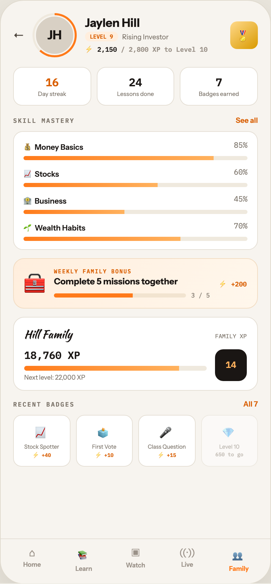

# F9 TEEN PROGRESS

Canvas: **CHEAT CODE · FAMILY MODE** · board index 8 · slug `09-f9-teen-progress`
Frame: **392×846px** (design width 392px — port at 390px logical, scale ratios).

> Style values are EXACT computed values from the canvas. `T.*` = canvas token, resolved in
> the Tokens appendix at the bottom of this file. Text marked `(MOCK)` must not ship as drawn —
> see `../../DELTA.md` for its substitution rule.

## Tree

- **“← JH Jaylen Hill LEVEL 9 Rising Investor…”** → `
`
  - box: 392x846 · display: flex · dir: column · width: 390px · height: 844px · bg: T.orange-50 · border: 1px solid T.orange-100-b · radius: 34px (T.r17) · shadow: T.orange-900a10 0px 20px 46px 0px · overflow: hidden · type: color T.neutral-950 / Instrument Sans / 16px / w400 / lh normal
  - **“← JH Jaylen Hill LEVEL 9 Rising Investor…”** → `
`
    - box: 390x779 · flex: 1 1 0% · flex-grow: 1 · flex-basis: 0% · pad: 18px 18px 0px 18px · overflow: hidden
    - **“← JH Jaylen Hill LEVEL 9 Rising Investor…”** → `
`
      - box: 354x64 · display: flex · align: center · gap: 12px
      - **"←"** → ``
        - box: 16x20 · type: color T.orange-700 · scale: T.ty17
        - text: "←"
      - **“JH…”** → `
`
        - box: 64x64 · width: 58px · height: 58px · flex: 0 0 auto · flex-shrink: 0 · pad: 3px 3px 3px 3px · bg-image: conic-gradient(T.orange-400-b 0deg, T.orange-400-b 62%, T.orange-50-b 62%, T.orange-50-b 100%) · radius: 50% (T.r18)
        - **"JH"** → `
`
          - box: 58x58 · display: grid · align: center · justify-items: center · grid-cols: 54px · grid-rows: 54px · width: 100% · height: 100% · bg: T.orange-100-c · border: 2px solid T.orange-50 · radius: 50% (T.r18) · type: color T.orange-900 / 18px / w800 · scale: T.ty13
          - text: "JH"
      - **“Jaylen Hill LEVEL 9 Rising Investor ⚡ 2,…”** → `
`
        - box: 198x56 · flex: 1 1 0% · flex-grow: 1 · flex-basis: 0%
        - **"Jaylen Hill"** → `
`
          - box: 198x20 · type: color T.orange-900 / 17px / w800 · scale: T.ty16
          - text: "Jaylen Hill"
        - **“LEVEL 9 Rising Investor…”** → `
`
          - box: 198x14 · display: flex · align: center · gap: 6px · margin: 3px 0px 0px 0px
          - **"LEVEL 9"** → ``
            - box: 47.6x14 · pad: 2px 7px 2px 7px · bg: T.orange-50-c · radius: 9px (T.r8) · type: color T.orange-500 / IBM Plex Mono / 8px / w700 · scale: T.ty91
            - text: "LEVEL 9"
          - **"Rising Investor"** → ``
            - box: 67.2x13 · type: color T.neutral-500 / 10px · scale: T.ty65
            - text: "Rising Investor"
        - **"⚡ 2,150"** **(MOCK)** → `
`
          - box: 198x16 · margin: 3px 0px 0px 0px · type: color T.orange-900 / IBM Plex Mono / 9.5px / w600 · scale: T.ty73
          - text: "⚡ 2,150"
          - **"/ 2,800 XP to Level 10"** **(MOCK)** → ``
            - box: 125.4x13 · display: inline · type: color T.orange-400 · scale: T.ty73
            - text: "/ 2,800 XP to Level 10"
      - **"🏅"** → `
`
        - box: 40x40 · display: grid · align: center · justify-items: center · grid-cols: 40px · grid-rows: 40px · width: 40px · height: 40px · flex: 0 0 auto · flex-shrink: 0 · bg-image: linear-gradient(140deg, T.amber-200, T.amber-500) · radius: 10px (T.r9) · type: 17px · scale: T.ty14
        - text: "🏅"
    - **“16 Day streak 24 Lessons done 7 Badges e…”** → `
`
      - box: 354x56 · display: flex · gap: 8px · margin: 14px 0px 0px 0px
      - **“16 Day streak…”** → `
`
        - box: 112.7x56 · flex: 1 1 0% · flex-grow: 1 · flex-basis: 0% · pad: 11px 6px 11px 6px · bg: T.neutral-0 · border: 1px solid T.orange-100 · radius: 13px (T.r12) · type: align-center
        - **"16"** → `
`
          - box: 98.7x20 · type: color T.orange-500 / IBM Plex Mono / w600 · scale: T.ty18
          - text: "16"
        - **"Day streak"** → `
`
          - box: 98.7x10 · margin: 2px 0px 0px 0px · type: color T.neutral-500 / 8.5px · scale: T.ty84
          - text: "Day streak"
      - **“24 Lessons done…”** → `
`
        - box: 112.7x56 · flex: 1 1 0% · flex-grow: 1 · flex-basis: 0% · pad: 11px 6px 11px 6px · bg: T.neutral-0 · border: 1px solid T.orange-100 · radius: 13px (T.r12) · type: align-center
        - **"24"** → `
`
          - box: 98.7x20 · type: color T.orange-900 / IBM Plex Mono / w600 · scale: T.ty18
          - text: "24"
        - **"Lessons done"** → `
`
          - box: 98.7x10 · margin: 2px 0px 0px 0px · type: color T.neutral-500 / 8.5px · scale: T.ty84
          - text: "Lessons done"
      - **“7 Badges earned…”** → `
`
        - box: 112.7x56 · flex: 1 1 0% · flex-grow: 1 · flex-basis: 0% · pad: 11px 6px 11px 6px · bg: T.neutral-0 · border: 1px solid T.orange-100 · radius: 13px (T.r12) · type: align-center
        - **"7"** → `
`
          - box: 98.7x20 · type: color T.orange-900 / IBM Plex Mono / w600 · scale: T.ty18
          - text: "7"
        - **"Badges earned"** → `
`
          - box: 98.7x10 · margin: 2px 0px 0px 0px · type: color T.neutral-500 / 8.5px · scale: T.ty84
          - text: "Badges earned"
    - **“SKILL MASTERY See all…”** → `
`
      - box: 354x13 · display: flex · align: baseline · justify: space-between · margin: 15px 0px 0px 0px
      - **"Skill mastery"** → ``
        - box: 88.9x11 · type: color T.neutral-500 / IBM Plex Mono / 9px / w600 / ls 1.44px / uppercase · scale: T.ty79
        - text: "Skill mastery"
      - **"See all"** → ``
        - box: 32.1x13 · type: color T.orange-500 / 10.5px / w600 · scale: T.ty60
        - text: "See all"
    - **“💰 Money Basics 85% 📈 Stocks 60% 🏦 Bus…”** → `
`
      - box: 354x172 · display: flex · dir: column · gap: 10px · pad: 12px 14px 12px 14px · margin: 9px 0px 0px 0px · bg: T.neutral-0 · border: 1px solid T.orange-100 · radius: 14px (T.r13)
      - **“💰 Money Basics 85%…”** → `
`
        - box: 324x29
        - **“💰 Money Basics 85%…”** → `
`
          - box: 324x18 · display: flex · justify: space-between · type: 11px
          - **"💰 Money Basics"** → ``
            - box: 86.3x18 · type: color T.orange-900 / w600 · scale: T.ty51
            - text: "💰 Money Basics"
          - **"85%"** **(MOCK)** → ``
            - box: 19.8x18 · type: color T.neutral-500 / IBM Plex Mono · scale: T.ty49
            - text: "85%"
        - **block[1]** → `
`
          - box: 324x6 · height: 6px · margin: 5px 0px 0px 0px · bg: T.orange-50-b · radius: 3px (T.r4) · overflow: hidden
          - **block[0]** → `
`
            - box: 275.4x6 · width: 85% · height: 100% · bg-image: linear-gradient(90deg, T.orange-400-b, T.orange-300)
      - **“📈 Stocks 60%…”** → `
`
        - box: 324x29
        - **“📈 Stocks 60%…”** → `
`
          - box: 324x18 · display: flex · justify: space-between · type: 11px
          - **"📈 Stocks"** → ``
            - box: 51.4x18 · type: color T.orange-900 / w600 · scale: T.ty51
            - text: "📈 Stocks"
          - **"60%"** **(MOCK)** → ``
            - box: 19.8x18 · type: color T.neutral-500 / IBM Plex Mono · scale: T.ty49
            - text: "60%"
        - **block[1]** → `
`
          - box: 324x6 · height: 6px · margin: 5px 0px 0px 0px · bg: T.orange-50-b · radius: 3px (T.r4) · overflow: hidden
          - **block[0]** → `
`
            - box: 194.4x6 · width: 60% · height: 100% · bg-image: linear-gradient(90deg, T.orange-400-b, T.orange-300)
      - **“🏦 Business 45%…”** → `
`
        - box: 324x29
        - **“🏦 Business 45%…”** → `
`
          - box: 324x18 · display: flex · justify: space-between · type: 11px
          - **"🏦 Business"** → ``
            - box: 62.1x18 · type: color T.orange-900 / w600 · scale: T.ty51
            - text: "🏦 Business"
          - **"45%"** **(MOCK)** → ``
            - box: 19.8x18 · type: color T.neutral-500 / IBM Plex Mono · scale: T.ty49
            - text: "45%"
        - **block[1]** → `
`
          - box: 324x6 · height: 6px · margin: 5px 0px 0px 0px · bg: T.orange-50-b · radius: 3px (T.r4) · overflow: hidden
          - **block[0]** → `
`
            - box: 145.8x6 · width: 45% · height: 100% · bg-image: linear-gradient(90deg, T.orange-400-b, T.orange-300)
      - **“🌱 Wealth Habits 70%…”** → `
`
        - box: 324x29
        - **“🌱 Wealth Habits 70%…”** → `
`
          - box: 324x18 · display: flex · justify: space-between · type: 11px
          - **"🌱 Wealth Habits"** → ``
            - box: 89.5x18 · type: color T.orange-900 / w600 · scale: T.ty51
            - text: "🌱 Wealth Habits"
          - **"70%"** **(MOCK)** → ``
            - box: 19.8x18 · type: color T.neutral-500 / IBM Plex Mono · scale: T.ty49
            - text: "70%"
        - **block[1]** → `
`
          - box: 324x6 · height: 6px · margin: 5px 0px 0px 0px · bg: T.orange-50-b · radius: 3px (T.r4) · overflow: hidden
          - **block[0]** → `
`
            - box: 226.8x6 · width: 70% · height: 100% · bg-image: linear-gradient(90deg, T.orange-400-b, T.orange-300)
    - **“🧰 WEEKLY FAMILY BONUS Complete 5 missio…”** → `
`
      - box: 354x73 · display: flex · align: center · gap: 13px · pad: 13px 15px 13px 15px · margin: 12px 0px 0px 0px · bg-image: linear-gradient(120deg, T.orange-50-c 0%, T.orange-0 100%) · border: 1px solid T.orange-100-d · radius: 16px (T.r14)
      - **"🧰"** → `
`
        - box: 30x39 · flex: 0 0 auto · flex-shrink: 0 · type: 30px · scale: T.ty2
        - text: "🧰"
      - **“WEEKLY FAMILY BONUS Complete 5 missions …”** → `
`
        - box: 225.5x45 · flex: 1 1 0% · flex-grow: 1 · flex-basis: 0%
        - **"Weekly family bonus"** → `
`
          - box: 225.5x10 · type: color T.orange-500 / IBM Plex Mono / 8px / w600 / ls 1.12px / uppercase · scale: T.ty92
          - text: "Weekly family bonus"
        - **"Complete 5 missions together"** → `
`
          - box: 225.5x15 · margin: 2px 0px 0px 0px · type: color T.orange-900 / 12.5px / w700 · scale: T.ty34
          - text: "Complete 5 missions together"
        - **“3 / 5…”** → `
`
          - box: 225.5x11 · display: flex · align: center · gap: 8px · margin: 7px 0px 0px 0px
          - **block[0]** → `
`
            - box: 190.5x6 · height: 6px · flex: 1 1 0% · flex-grow: 1 · flex-basis: 0% · bg: T.orange-100-g · radius: 3px (T.r4) · overflow: hidden
            - **block[0]** → `
`
              - box: 114.3x6 · width: 60% · height: 100% · bg: T.orange-400-b
          - **"3 / 5"** → ``
            - box: 27x11 · type: color T.neutral-500 / IBM Plex Mono / 9px · scale: T.ty78
            - text: "3 / 5"
      - **"⚡ +200"** **(MOCK)** → ``
        - box: 40.5x16 · flex: 0 0 auto · flex-shrink: 0 · type: color T.orange-500 / IBM Plex Mono / 9.5px / w700 · scale: T.ty72
        - text: "⚡ +200"
    - **“Hill Family FAMILY XP 18,760 XP Next lev…”** → `
`
      - box: 354x107 · pad: 13px 15px 13px 15px · margin: 12px 0px 0px 0px · bg: T.neutral-0 · border: 1px solid T.orange-100 · radius: 16px (T.r14)
      - **“Hill Family FAMILY XP…”** → `
`
        - box: 322x23 · display: flex · align: baseline · justify: space-between
        - **"Hill Family"** → ``
          - box: 69.3x23 · type: color T.orange-900 / Kaushan Script · scale: T.ty20
          - text: "Hill Family"
        - **"FAMILY XP"** → ``
          - box: 45.9x11 · type: color T.neutral-500 / IBM Plex Mono / 8.5px · scale: T.ty85
          - text: "FAMILY XP"
      - **“18,760 XP Next level: 22,000 XP 14…”** → `
`
        - box: 322x47 · display: flex · align: center · gap: 12px · margin: 9px 0px 0px 0px
        - **“18,760 XP Next level: 22,000 XP…”** → `
`
          - box: 264x47 · flex: 1 1 0% · flex-grow: 1 · flex-basis: 0%
          - **"18,760 XP"** **(MOCK)** → `
`
            - box: 264x19 · type: color T.orange-900 / IBM Plex Mono / 15px / w600 · scale: T.ty23
            - text: "18,760 XP"
          - **block[1]** → `
`
            - box: 264x7 · height: 7px · margin: 6px 0px 0px 0px · bg: T.orange-50-b · radius: 4px (T.r5) · overflow: hidden
            - **block[0]** → `
`
              - box: 224.4x7 · width: 85% · height: 100% · bg-image: linear-gradient(90deg, T.orange-400-b, T.orange-300)
          - **"Next level: 22,000 XP"** **(MOCK)** → `
`
            - box: 264x11 · margin: 4px 0px 0px 0px · type: color T.neutral-500 / 9px · scale: T.ty77
            - text: "Next level: 22,000 XP"
        - **"14"** → `
`
          - box: 46x46 · display: grid · align: center · justify-items: center · grid-cols: 46px · grid-rows: 46px · width: 46px · height: 46px · flex: 0 0 auto · flex-shrink: 0 · bg: T.orange-900 · radius: 12px (T.r11) · type: color T.orange-300 / IBM Plex Mono / 13px / w600 · scale: T.ty33
          - text: "14"
    - **“RECENT BADGES All 7…”** → `
`
      - box: 354x13 · display: flex · align: baseline · justify: space-between · margin: 13px 0px 0px 0px
      - **"Recent badges"** → ``
        - box: 88.9x11 · type: color T.neutral-500 / IBM Plex Mono / 9px / w600 / ls 1.44px / uppercase · scale: T.ty79
        - text: "Recent badges"
      - **"All 7"** → ``
        - box: 21.1x13 · type: color T.orange-500 / 10.5px / w600 · scale: T.ty60
        - text: "All 7"
    - **“📈 Stock Spotter ⚡ +40 🗳 First Vote ⚡ +…”** → `
`
      - box: 354x75 · display: flex · gap: 8px · margin: 9px 0px 0px 0px
      - **“📈 Stock Spotter ⚡ +40…”** → `
`
        - box: 82.5x75 · flex: 1 1 0% · flex-grow: 1 · flex-basis: 0% · pad: 10px 5px 10px 5px · bg: T.neutral-0 · border: 1px solid T.orange-100 · radius: 12px (T.r11) · type: align-center
        - **"📈"** → `
`
          - box: 70.5x27 · type: 17px · scale: T.ty14
          - text: "📈"
        - **"Stock Spotter"** → `
`
          - box: 70.5x10 · margin: 3px 0px 0px 0px · type: color T.neutral-500 / 8px · scale: T.ty90
          - text: "Stock Spotter"
        - **"⚡ +40"** **(MOCK)** → `
`
          - box: 70.5x12 · margin: 1px 0px 0px 0px · type: color T.orange-500 / IBM Plex Mono / 7.5px / w700 · scale: T.ty95
          - text: "⚡ +40"
      - **“🗳 First Vote ⚡ +10…”** → `
`
        - box: 82.5x75 · flex: 1 1 0% · flex-grow: 1 · flex-basis: 0% · pad: 10px 5px 10px 5px · bg: T.neutral-0 · border: 1px solid T.orange-100 · radius: 12px (T.r11) · type: align-center
        - **"🗳"** → `
`
          - box: 70.5x27 · type: 17px · scale: T.ty14
          - text: "🗳"
        - **"First Vote"** → `
`
          - box: 70.5x10 · margin: 3px 0px 0px 0px · type: color T.neutral-500 / 8px · scale: T.ty90
          - text: "First Vote"
        - **"⚡ +10"** **(MOCK)** → `
`
          - box: 70.5x12 · margin: 1px 0px 0px 0px · type: color T.orange-500 / IBM Plex Mono / 7.5px / w700 · scale: T.ty95
          - text: "⚡ +10"
      - **“🎤 Class Question ⚡ +15…”** → `
`
        - box: 82.5x75 · flex: 1 1 0% · flex-grow: 1 · flex-basis: 0% · pad: 10px 5px 10px 5px · bg: T.neutral-0 · border: 1px solid T.orange-100 · radius: 12px (T.r11) · type: align-center
        - **"🎤"** → `
`
          - box: 70.5x27 · type: 17px · scale: T.ty14
          - text: "🎤"
        - **"Class Question"** → `
`
          - box: 70.5x10 · margin: 3px 0px 0px 0px · type: color T.neutral-500 / 8px · scale: T.ty90
          - text: "Class Question"
        - **"⚡ +15"** **(MOCK)** → `
`
          - box: 70.5x12 · margin: 1px 0px 0px 0px · type: color T.orange-500 / IBM Plex Mono / 7.5px / w700 · scale: T.ty95
          - text: "⚡ +15"
      - **“💎 Level 10 650 to go…”** → `
`
        - box: 82.5x75 · flex: 1 1 0% · flex-grow: 1 · flex-basis: 0% · pad: 10px 5px 10px 5px · bg: T.neutral-0 · border: 1px solid T.orange-100 · radius: 12px (T.r11) · opacity: 0.5 · type: align-center
        - **"💎"** → `
`
          - box: 70.5x27 · type: 17px · scale: T.ty14
          - text: "💎"
        - **"Level 10"** → `
`
          - box: 70.5x10 · margin: 3px 0px 0px 0px · type: color T.neutral-500 / 8px · scale: T.ty90
          - text: "Level 10"
        - **"650 to go"** → `
`
          - box: 70.5x10 · margin: 1px 0px 0px 0px · type: color T.orange-400 / IBM Plex Mono / 7.5px / w700 · scale: T.ty95
          - text: "650 to go"
  - **“⌂ Home 📚 Learn ▣ Watch ((·)) Live 👥 Fa…”** → `
`
    - box: 390x65 · display: flex · pad: 10px 8px 16px 8px · bg: T.orange-50 · border: T:1px solid T.orange-100 R:0px none T.neutral-950 B:0px none T.neutral-950 L:0px none T.neutral-950
    - **“⌂ Home…”** → `
`
      - box: 74.8x38 · flex: 1 1 0% · flex-grow: 1 · flex-basis: 0% · type: align-center
      - **"⌂"** → `
`
        - box: 74.8x19 · type: color T.orange-400 / 15px · scale: T.ty21
        - text: "⌂"
      - **"Home"** → `
`
        - box: 74.8x11 · margin: 2px 0px 0px 0px · type: color T.orange-400 / 9px / w600 · scale: T.ty75
        - text: "Home"
    - **“📚 Learn…”** → `
`
      - box: 74.8x38 · flex: 1 1 0% · flex-grow: 1 · flex-basis: 0% · type: align-center
      - **"📚"** → `
`
        - box: 74.8x25 · type: color T.orange-400 / 15px · scale: T.ty21
        - text: "📚"
      - **"Learn"** → `
`
        - box: 74.8x11 · margin: 2px 0px 0px 0px · type: color T.orange-400 / 9px / w600 · scale: T.ty75
        - text: "Learn"
    - **“▣ Watch…”** → `
`
      - box: 74.8x38 · flex: 1 1 0% · flex-grow: 1 · flex-basis: 0% · type: align-center
      - **"▣"** → `
`
        - box: 74.8x20 · type: color T.orange-400 / 15px · scale: T.ty21
        - text: "▣"
      - **"Watch"** → `
`
        - box: 74.8x11 · margin: 2px 0px 0px 0px · type: color T.orange-400 / 9px / w600 · scale: T.ty75
        - text: "Watch"
    - **“((·)) Live…”** → `
`
      - box: 74.8x38 · flex: 1 1 0% · flex-grow: 1 · flex-basis: 0% · type: align-center
      - **"((·))"** → `
`
        - box: 74.8x19 · type: color T.orange-400 / 15px · scale: T.ty21
        - text: "((·))"
      - **"Live"** → `
`
        - box: 74.8x11 · margin: 2px 0px 0px 0px · type: color T.orange-400 / 9px / w600 · scale: T.ty75
        - text: "Live"
    - **“👥 Family…”** → `
`
      - box: 74.8x38 · flex: 1 1 0% · flex-grow: 1 · flex-basis: 0% · type: align-center
      - **"👥"** → `
`
        - box: 74.8x25 · type: color T.orange-400-b / 15px · scale: T.ty21
        - text: "👥"
      - **"Family"** → `
`
        - box: 74.8x11 · margin: 2px 0px 0px 0px · type: color T.orange-400-b / 9px / w700 · scale: T.ty76
        - text: "Family"

## Tokens used in this board

| token | value | role |
| --- | --- | --- |
| T.orange-900 | `#1A1614` | text, border, bg |
| T.neutral-950 | `#000000` | text, border |
| T.neutral-500 | `#7B7369` | text, bg |
| T.neutral-0 | `#FFFFFF` | bg, text, gradient |
| T.orange-400 | `#9B9289` | text, bg |
| T.orange-100 | `#E5DFD5` | border, bg |
| T.orange-500 | `#D95E00` | text |
| T.orange-400-b | `#FF7A1A` | bg, gradient, text, border |
| T.orange-50 | `#F7F4EF` | bg, border, text |
| T.orange-50-b | `#EFE9DE` | bg, gradient, border |
| T.orange-50-c | `#FFEEDD` | gradient, bg |
| T.orange-100-b | `#E0DACE` | border, gradient |
| T.orange-100-c | `#D8D0C4` | bg |
| T.orange-900a10 | `#1A1614/0.1` | shadow |
| T.orange-700 | `#4E463E` | text |
| T.orange-300 | `#FFB25E` | gradient, text |
| T.amber-500 | `#D99A00` | border, bg, gradient |
| T.orange-100-d | `#F2DCC2` | border |
| T.amber-200 | `#FFD98A` | gradient |
| T.orange-0 | `#FFF7EC` | gradient |
| T.orange-100-g | `#F2E4D0` | bg |
| T.ty2 | Instrument Sans 30px/normal w400 ls:normal | type scale |
| T.ty13 | Instrument Sans 18px/normal w800 ls:normal | type scale |
| T.ty14 | Instrument Sans 17px/normal w400 ls:normal | type scale |
| T.ty16 | Instrument Sans 17px/normal w800 ls:normal | type scale |
| T.ty17 | Instrument Sans 16px/normal w400 ls:normal | type scale |
| T.ty18 | IBM Plex Mono 16px/normal w600 ls:normal | type scale |
| T.ty20 | Kaushan Script 16px/normal w400 ls:normal | type scale |
| T.ty21 | Instrument Sans 15px/normal w400 ls:normal | type scale |
| T.ty23 | IBM Plex Mono 15px/normal w600 ls:normal | type scale |
| T.ty33 | IBM Plex Mono 13px/normal w600 ls:normal | type scale |
| T.ty34 | Instrument Sans 12.5px/normal w700 ls:normal | type scale |
| T.ty49 | IBM Plex Mono 11px/normal w400 ls:normal | type scale |
| T.ty51 | Instrument Sans 11px/normal w600 ls:normal | type scale |
| T.ty60 | Instrument Sans 10.5px/normal w600 ls:normal | type scale |
| T.ty65 | Instrument Sans 10px/normal w400 ls:normal | type scale |
| T.ty72 | IBM Plex Mono 9.5px/normal w700 ls:normal | type scale |
| T.ty73 | IBM Plex Mono 9.5px/normal w600 ls:normal | type scale |
| T.ty75 | Instrument Sans 9px/normal w600 ls:normal | type scale |
| T.ty76 | Instrument Sans 9px/normal w700 ls:normal | type scale |
| T.ty77 | Instrument Sans 9px/normal w400 ls:normal | type scale |
| T.ty78 | IBM Plex Mono 9px/normal w400 ls:normal | type scale |
| T.ty79 | IBM Plex Mono 9px/normal w600 ls:1.44px uppercase | type scale |
| T.ty84 | Instrument Sans 8.5px/normal w400 ls:normal | type scale |
| T.ty85 | IBM Plex Mono 8.5px/normal w400 ls:normal | type scale |
| T.ty90 | Instrument Sans 8px/normal w400 ls:normal | type scale |
| T.ty91 | IBM Plex Mono 8px/normal w700 ls:normal | type scale |
| T.ty92 | IBM Plex Mono 8px/normal w600 ls:1.12px uppercase | type scale |
| T.ty95 | IBM Plex Mono 7.5px/normal w700 ls:normal | type scale |
| T.r4 | `3px` | radius |
| T.r5 | `4px` | radius |
| T.r8 | `9px` | radius |
| T.r9 | `10px` | radius |
| T.r11 | `12px` | radius |
| T.r12 | `13px` | radius |
| T.r13 | `14px` | radius |
| T.r14 | `16px` | radius |
| T.r17 | `34px` | radius |
| T.r18 | `50%` | radius |
